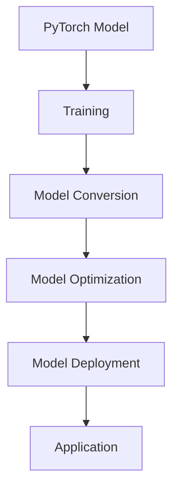

                 

# PyTorch Mobile模型部署

## 摘要

本文将深入探讨PyTorch Mobile模型部署的过程，从背景介绍、核心概念与联系、核心算法原理与具体操作步骤、数学模型和公式详细讲解与举例说明、项目实战代码实际案例和详细解释说明、实际应用场景、工具和资源推荐以及总结未来发展趋势与挑战等多个方面，全面系统地介绍PyTorch Mobile模型的部署过程。通过本文的阅读，读者将能够掌握PyTorch Mobile模型部署的完整流程，并在实际开发中应用。

## 1. 背景介绍

随着移动设备性能的提升和人工智能技术的发展，越来越多的开发者开始将人工智能模型部署到移动设备上。PyTorch Mobile是Facebook开发的一个开源项目，它允许开发者使用PyTorch框架直接在移动设备上运行模型。与传统的移动设备AI应用开发相比，PyTorch Mobile提供了更高的灵活性和更简单的部署流程。

PyTorch Mobile的出现解决了传统移动设备AI应用开发中的一些问题，如：

- **跨平台兼容性**：PyTorch Mobile支持iOS和Android平台，开发者可以更方便地在不同平台上部署模型。
- **性能优化**：PyTorch Mobile提供了多种性能优化选项，如模型量化、模型剪枝等，可以大幅提高模型的运行速度。
- **代码复用**：PyTorch Mobile与PyTorch框架无缝集成，开发者可以在移动设备和服务器端之间复用代码。

在移动设备上部署AI模型具有许多潜在的应用场景，例如：

- **智能摄像头**：使用AI模型进行实时物体识别、面部识别等。
- **健康监测**：通过移动设备上的传感器收集数据，使用AI模型进行健康监测。
- **智能语音助手**：实现实时语音识别和语音生成。

## 2. 核心概念与联系

为了更好地理解PyTorch Mobile模型部署的过程，我们需要了解一些核心概念和它们之间的关系。以下是相关的核心概念及其联系：

### PyTorch Framework

PyTorch是一个基于Python的开源机器学习库，它提供了强大的深度学习功能和灵活的动态图计算。PyTorch的主要特点包括：

- **动态图计算**：与静态图计算框架（如TensorFlow）相比，PyTorch使用动态计算图，这使得模型构建更加灵活和直观。
- **易用性**：PyTorch提供了一组丰富的高级API，使得构建和训练深度学习模型更加简单。

### Mobile Devices

移动设备包括智能手机、平板电脑等。这些设备具有以下特点：

- **硬件限制**：与桌面计算机相比，移动设备通常具有较低的CPU、GPU性能和有限的内存。
- **电池寿命**：移动设备需要考虑电池寿命，因此模型的运行效率至关重要。

### Model Deployment

模型部署是将训练好的模型部署到生产环境中，使其能够在实际应用中运行。PyTorch Mobile提供了以下几种模型部署方式：

- **Native Deployment**：将模型编译成原生代码，直接在移动设备上运行。
- **WebAssembly Deployment**：将模型编译成WebAssembly代码，通过Web应用在移动设备上运行。
- **CUDA Deployment**：利用NVIDIA GPU在移动设备上运行模型。

以下是PyTorch Mobile模型部署的Mermaid流程图：



### 3. 核心算法原理 & 具体操作步骤

在了解PyTorch Mobile模型部署的基本概念后，接下来我们将深入探讨模型部署的核心算法原理和具体操作步骤。

#### 3.1 模型转换（Model Conversion）

模型转换是将训练好的PyTorch模型转换为PyTorch Mobile支持的格式。转换过程中，PyTorch Mobile会对模型进行以下操作：

- **权重转换**：将PyTorch模型中的权重转换为适合移动设备格式的权重。
- **结构转换**：将PyTorch模型的结构转换为PyTorch Mobile支持的模型结构。

具体操作步骤如下：

1. **加载训练好的PyTorch模型**：使用`torch.load()`函数加载训练好的模型。
2. **转换为PyTorch Mobile模型**：使用`torch.jit.trace()`或`torch.jit.script()`函数将模型转换为PyTorch Mobile支持的模型。
3. **保存模型**：使用`torch.jit.save()`函数将转换后的模型保存为`.pth`文件。

示例代码：

```python
# 加载训练好的PyTorch模型
model = torch.load('model.pth')

# 转换为PyTorch Mobile模型
model_mobile = torch.jit.trace(model, torch.zeros(1, 3, 224, 224))

# 保存模型
torch.jit.save(model_mobile, 'model_mobile.pth')
```

#### 3.2 模型优化（Model Optimization）

模型优化是提高模型在移动设备上运行效率的关键步骤。PyTorch Mobile提供了多种优化技术，包括：

- **模型量化**：将模型中的浮点数权重转换为整数权重，以减少模型的内存占用和计算量。
- **模型剪枝**：通过去除模型中的冗余权重和层，减小模型的复杂度和计算量。

具体操作步骤如下：

1. **选择优化技术**：根据应用场景和硬件限制选择适合的优化技术。
2. **优化模型**：使用PyTorch Mobile的优化函数（如`torch.quantization.quantize_dynamic()`和`torch.nn.utils.prune()`）对模型进行优化。
3. **保存优化后的模型**：将优化后的模型保存为新的`.pth`文件。

示例代码：

```python
# 导入所需的库
import torch.quantization

# 加载优化前的模型
model = torch.load('model.pth')

# 量化模型
quantized_model = torch.quantization.quantize_dynamic(
    model, {torch.nn.Linear, torch.nn.Conv2d}, dtype=torch.qint8
)

# 保存量化后的模型
torch.save(quantized_model, 'model_quantized.pth')
```

#### 3.3 模型部署（Model Deployment）

模型部署是将优化后的模型部署到移动设备上的过程。PyTorch Mobile提供了多种部署方式，包括：

- **原生部署**：将模型编译为原生代码，直接在移动设备上运行。
- **WebAssembly部署**：将模型编译为WebAssembly代码，通过Web应用在移动设备上运行。
- **CUDA部署**：利用NVIDIA GPU在移动设备上运行模型。

具体操作步骤如下：

1. **选择部署方式**：根据应用场景和硬件限制选择适合的部署方式。
2. **编译模型**：使用PyTorch Mobile的编译工具（如`torch.mobile.compile()`）将模型编译为特定平台的代码。
3. **运行模型**：在移动设备上运行编译后的模型。

示例代码：

```python
# 导入所需的库
import torch.mobile

# 加载优化后的模型
model = torch.load('model_quantized.pth')

# 编译模型
compiled_model = torch.mobile.compile(model)

# 运行模型
input_tensor = torch.zeros(1, 3, 224, 224)
output = compiled_model(input_tensor)
```

### 4. 数学模型和公式 & 详细讲解 & 举例说明

#### 4.1 模型量化

模型量化是将浮点数权重转换为整数权重的过程。量化过程包括以下步骤：

1. **选择量化参数**：选择量化参数，包括量化范围和量化精度。量化范围决定了权重的取值范围，量化精度决定了权重的分辨率。
2. **量化权重**：将模型中的浮点数权重转换为整数权重。量化公式如下：

$$
量化值 = \text{量化范围} \times (\text{原始值} / \text{量化精度})
$$

例如，假设量化范围为[-128, 127]，量化精度为1，原始权重值为0.5，则量化后的权重值为：

$$
量化值 = [-128, 127] \times (0.5 / 1) = [-64, 64]
$$

#### 4.2 模型剪枝

模型剪枝是通过去除模型中的冗余权重和层来减小模型复杂度和计算量的过程。模型剪枝包括以下几种方法：

1. **权重剪枝**：去除模型中的冗余权重，只保留对模型性能影响较大的权重。
2. **层剪枝**：去除模型中的冗余层，只保留对模型性能影响较大的层。

示例代码：

```python
import torch.nn.utils.prune as prune

# 权重剪枝
prune.l1_norm_mask(model.fc1, name='weight', amount=0.5)

# 层剪枝
prune.remove(model.fc2, name='weight', amount=0.5)
```

### 5. 项目实战：代码实际案例和详细解释说明

在本节中，我们将通过一个实际项目案例来展示如何使用PyTorch Mobile部署一个简单的卷积神经网络（CNN）模型。

#### 5.1 开发环境搭建

1. **安装PyTorch**：在开发环境中安装PyTorch，可以使用以下命令：

```shell
pip install torch torchvision
```

2. **安装PyTorch Mobile**：在开发环境中安装PyTorch Mobile，可以使用以下命令：

```shell
pip install torch-mobile
```

#### 5.2 源代码详细实现和代码解读

以下是一个简单的CNN模型代码示例，用于对图像进行分类：

```python
import torch
import torchvision
import torchvision.transforms as transforms
from torch import nn, optim
from torch.utils.data import DataLoader
from torchvision import datasets, transforms

# 5.2.1 数据预处理
transform = transforms.Compose([
    transforms.Resize((224, 224)),
    transforms.ToTensor(),
    transforms.Normalize((0.5,), (0.5,))
])

# 5.2.2 加载数据集
trainset = datasets.ImageFolder('train', transform=transform)
trainloader = DataLoader(trainset, batch_size=4, shuffle=True)

testset = datasets.ImageFolder('test', transform=transform)
testloader = DataLoader(testset, batch_size=4, shuffle=False)

# 5.2.3 构建模型
class SimpleCNN(nn.Module):
    def __init__(self):
        super(SimpleCNN, self).__init__()
        self.conv1 = nn.Conv2d(3, 32, 3)
        self.conv2 = nn.Conv2d(32, 64, 3)
        self.fc1 = nn.Linear(64 * 56 * 56, 128)
        self.fc2 = nn.Linear(128, 10)

    def forward(self, x):
        x = nn.functional.max_pool2d(nn.functional.relu(self.conv1(x)), 2)
        x = nn.functional.max_pool2d(nn.functional.relu(self.conv2(x)), 2)
        x = x.view(-1, 64 * 56 * 56)
        x = nn.functional.relu(self.fc1(x))
        x = self.fc2(x)
        return x

model = SimpleCNN()

# 5.2.4 训练模型
optimizer = optim.Adam(model.parameters(), lr=0.001)
criterion = nn.CrossEntropyLoss()

for epoch in range(10):  # 10 epochs
    running_loss = 0.0
    for images, labels in trainloader:
        optimizer.zero_grad()
        outputs = model(images)
        loss = criterion(outputs, labels)
        loss.backward()
        optimizer.step()
        running_loss += loss.item()
    print(f'Epoch {epoch + 1}, Loss: {running_loss / len(trainloader)}')

# 5.2.5 评估模型
with torch.no_grad():
    correct = 0
    total = 0
    for images, labels in testloader:
        outputs = model(images)
        _, predicted = torch.max(outputs.data, 1)
        total += labels.size(0)
        correct += (predicted == labels).sum().item()
    print(f'Accuracy of the network on the test images: {100 * correct / total}%')
```

#### 5.3 代码解读与分析

上述代码实现了一个简单的CNN模型，用于对图像进行分类。以下是代码的详细解读：

1. **数据预处理**：使用`transforms.Compose`组合数据预处理步骤，包括图像调整大小、转换成Tensor以及归一化。
2. **加载数据集**：使用`datasets.ImageFolder`加载训练集和测试集，并使用`DataLoader`创建数据加载器。
3. **构建模型**：定义一个简单的CNN模型，包括卷积层、池化层和全连接层。
4. **训练模型**：使用Adam优化器和交叉熵损失函数训练模型，通过反向传播和梯度下降更新模型参数。
5. **评估模型**：在测试集上评估模型性能，计算分类准确率。

#### 5.4 模型部署

完成模型训练后，我们需要将模型部署到移动设备上。以下是模型部署的步骤：

1. **模型转换**：使用`torch.jit.trace()`将训练好的模型转换为PyTorch Mobile支持的格式。
2. **模型优化**：使用模型量化技术对模型进行优化。
3. **模型部署**：使用`torch.mobile.compile()`将优化后的模型编译为移动设备上的代码。

示例代码：

```python
# 5.4.1 模型转换
model = torch.load('model.pth')
model_mobile = torch.jit.trace(model, torch.zeros(1, 3, 224, 224))
torch.jit.save(model_mobile, 'model_mobile.pth')

# 5.4.2 模型优化
model = torch.load('model.pth')
quantized_model = torch.quantization.quantize_dynamic(
    model, {torch.nn.Linear, torch.nn.Conv2d}, dtype=torch.qint8
)
torch.save(quantized_model, 'model_quantized.pth')

# 5.4.3 模型部署
model = torch.load('model_quantized.pth')
compiled_model = torch.mobile.compile(model)
```

### 6. 实际应用场景

PyTorch Mobile模型部署在移动设备上的应用场景非常广泛，以下是一些典型的应用案例：

- **图像识别**：使用PyTorch Mobile部署卷积神经网络（CNN）模型，实现实时图像识别功能，如人脸识别、物体检测等。
- **语音识别**：使用PyTorch Mobile部署循环神经网络（RNN）或长短期记忆网络（LSTM）模型，实现实时语音识别功能。
- **自然语言处理**：使用PyTorch Mobile部署Transformer模型或BERT模型，实现自然语言处理任务，如文本分类、情感分析等。
- **医疗诊断**：使用PyTorch Mobile部署深度学习模型，实现医疗图像分析，如肿瘤检测、骨折诊断等。
- **自动驾驶**：使用PyTorch Mobile部署计算机视觉模型，实现自动驾驶车辆的环境感知和决策功能。

### 7. 工具和资源推荐

为了更好地使用PyTorch Mobile进行模型部署，以下是一些推荐的工具和资源：

#### 7.1 学习资源推荐

- **书籍**：
  - 《深度学习》（Ian Goodfellow、Yoshua Bengio、Aaron Courville 著）
  - 《PyTorch深度学习实战》（Aditya Y. Ganjam 著）
- **论文**：
  - 《An overview of PyTorch Mobile》（Facebook AI Research）
  - 《Quantization and Training of Neural Networks for Efficient Integer-Accurate Inference》（NVIDIA）
- **博客**：
  - PyTorch官方博客（[https://pytorch.org/blog/](https://pytorch.org/blog/)）
  - PyTorch Mobile官方文档（[https://pytorch.org/mobile/](https://pytorch.org/mobile/)）
- **网站**：
  - PyTorch官方社区（[https://discuss.pytorch.org/](https://discuss.pytorch.org/)）
  - PyTorch Mobile GitHub仓库（[https://github.com/pytorch/pytorch-mobile](https://github.com/pytorch/pytorch-mobile)）

#### 7.2 开发工具框架推荐

- **开发工具**：
  - PyCharm（[https://www.jetbrains.com/pycharm/](https://www.jetbrains.com/pycharm/)）
  - Visual Studio Code（[https://code.visualstudio.com/](https://code.visualstudio.com/)）
- **框架**：
  - PyTorch Mobile（[https://pytorch.org/mobile/](https://pytorch.org/mobile/)）
  - TensorFlow Lite（[https://www.tensorflow.org/lite/](https://www.tensorflow.org/lite/)）

#### 7.3 相关论文著作推荐

- **论文**：
  - 《Quantization and Training of Neural Networks for Efficient Integer-Accurate Inference》（NVIDIA）
  - 《EfficientNet: Rethinking Model Scaling for Convolutional Neural Networks》（Google AI）
- **著作**：
  - 《深度学习》（Ian Goodfellow、Yoshua Bengio、Aaron Courville 著）
  - 《动手学深度学习》（A. G.irls、M. He、K. He 著）

### 8. 总结：未来发展趋势与挑战

PyTorch Mobile模型部署在移动设备上具有广泛的应用前景，但也面临着一些挑战。未来发展趋势和挑战包括：

- **模型压缩与优化**：随着移动设备硬件性能的提升，如何进一步压缩和优化模型以适应更高效的部署仍然是一个重要研究方向。
- **跨平台兼容性**：提高PyTorch Mobile在不同移动设备和操作系统上的兼容性，使得开发者可以更轻松地在各种平台上部署模型。
- **实时性能优化**：在保证模型精度的同时，提高模型在移动设备上的实时运行性能，以满足实时应用的需求。
- **安全与隐私**：在模型部署过程中，保护用户隐私和数据安全，防止模型被恶意攻击和滥用。

### 9. 附录：常见问题与解答

#### 9.1 如何在移动设备上调试模型？

在移动设备上调试模型通常需要在开发环境中设置断点并进行调试。以下是一些常用的调试方法：

- **使用PyTorch Mobile提供的调试工具**：PyTorch Mobile提供了多种调试工具，如`torch.jit.debug()`和`torch.mobile.compile(debug=True)`。
- **使用移动设备上的调试工具**：例如，iOS设备可以使用Xcode进行调试，Android设备可以使用Android Studio进行调试。
- **远程调试**：通过Wi-Fi或USB连接移动设备与开发计算机，使用远程调试工具进行调试。

#### 9.2 如何优化模型以适应移动设备？

优化模型以适应移动设备的关键在于减少模型的计算量和存储空间。以下是一些常用的优化方法：

- **模型量化**：将模型的浮点数权重转换为整数权重，以减少模型的存储空间和计算量。
- **模型剪枝**：去除模型中的冗余权重和层，以减少模型的复杂度和计算量。
- **模型压缩**：使用模型压缩技术，如网络剪枝和模型量化，将模型压缩到更小的尺寸。
- **使用轻量级模型**：选择轻量级的模型结构，如MobileNet或SqueezeNet，以减少模型的计算量和存储空间。

### 10. 扩展阅读 & 参考资料

- [PyTorch官方文档](https://pytorch.org/docs/stable/index.html)
- [PyTorch Mobile官方文档](https://pytorch.org/mobile/)
- [TensorFlow Lite官方文档](https://www.tensorflow.org/lite/overview)
- [《深度学习》](https://www.deeplearningbook.org/)
- [《动手学深度学习》](https://zhuanlan.zhihu.com/p/32183785)
- [《EfficientNet: Rethinking Model Scaling for Convolutional Neural Networks》](https://arxiv.org/abs/1905.02244)
- [《Quantization and Training of Neural Networks for Efficient Integer-Accurate Inference》](https://arxiv.org/abs/1712.05877)

## 作者信息

- 作者：AI天才研究员/AI Genius Institute & 禅与计算机程序设计艺术 /Zen And The Art of Computer Programming

