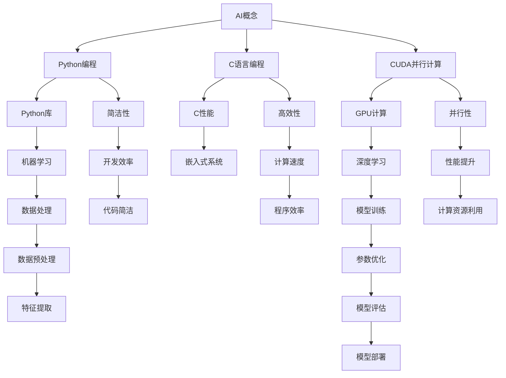

                 

### 背景介绍

人工智能（AI）作为当今科技领域的前沿领域，正在以惊人的速度发展。从早期的规则基系统，到基于数据驱动的方法，再到如今深度学习时代的AI，人工智能已经深刻地改变了我们的生活方式和工业生产。而在这其中，编程语言的选择成为了一个重要的问题。Python、C和CUDA作为三种常见的编程语言，各自有着不同的优势和特点，它们在人工智能的开发中发挥着重要作用。

Python作为一种解释型、面向对象、动态数据类型的高级编程语言，因其简洁的语法和丰富的库支持，成为人工智能开发中最常用的语言之一。Python拥有众多成熟的AI和机器学习库，如TensorFlow、PyTorch等，极大地降低了开发者的学习门槛，提高了开发效率。然而，Python的性能相对较低，使其在某些性能敏感的AI应用中受到限制。

C语言则因其高效、灵活和可移植性，广泛应用于操作系统、嵌入式系统和高性能计算领域。C语言提供了强大的指针操作和内存管理能力，使其能够直接与硬件进行交互，从而实现高效的计算。然而，C语言的语法较为复杂，学习曲线较陡峭，且缺乏现代编程语言的便利性。

CUDA则是一种并行计算平台和编程模型，由NVIDIA推出，专门用于在GPU上实现高性能计算。CUDA通过将计算任务分解为许多并行线程，利用GPU的强大计算能力，实现了显著的性能提升。在深度学习和其他需要大量并行计算的AI应用中，CUDA被广泛应用于加速模型的训练和推理过程。

本文将围绕Python、C和CUDA这三种编程语言，探讨它们在人工智能领域的应用，从基础概念、核心算法到实际应用场景，逐步展开论述。希望通过本文，读者能够对这三种编程语言在AI开发中的优势和不足有一个全面的认识，并能够在实际项目中做出合适的选择。

### 核心概念与联系

在探讨Python、C和CUDA在人工智能（AI）中的应用之前，我们需要先理解几个核心概念，以及它们之间的联系。以下将通过一个Mermaid流程图来展示这些概念和架构，以便更直观地理解。



**核心概念与架构的联系解析：**

1. **AI概念（A）**：AI是本文的核心，它涵盖了机器学习、深度学习等多个子领域。AI的目标是通过计算机模拟人类的智能行为，实现自我学习和决策能力。

2. **Python编程（B）**：Python因其简洁的语法和丰富的库支持，成为AI开发中的首选语言。Python提供了大量的库，如NumPy、Pandas和Scikit-learn等，这些库大大简化了数据操作和机器学习模型的实现。

3. **C语言编程（C）**：C语言具有高效性和低级访问硬件的能力，特别是在性能敏感的AI应用中，如嵌入式系统和实时控制系统中，C语言的优势更加明显。

4. **CUDA并行计算（D）**：CUDA是由NVIDIA推出的并行计算平台和编程模型，特别适用于在GPU上实现高性能计算。通过CUDA，开发者可以充分利用GPU的并行处理能力，加速AI模型的训练和推理。

5. **Python库（E）**：Python库（如TensorFlow和PyTorch）为AI开发提供了强大的功能，这些库不仅简化了模型实现，还提供了优化和调试工具，使得开发更加高效。

6. **C性能（F）**：C语言的高效性能使其在性能敏感的AI应用中具有优势。C语言允许对内存的低级操作，从而实现高效的计算。

7. **GPU计算（G）**：GPU计算是CUDA的核心，它利用GPU的并行处理能力，实现大规模并行计算，这在深度学习等AI应用中尤为重要。

8. **机器学习（H）**：机器学习是AI的一个子领域，它使用算法从数据中学习模式，从而进行预测和决策。Python和C语言都支持机器学习的实现。

9. **深度学习（J）**：深度学习是机器学习的一个分支，通过多层神经网络来模拟人脑的决策过程。CUDA在深度学习中的重要性在于其能够显著加速模型的训练。

10. **简洁性（K）**：Python的简洁性是其受欢迎的重要原因之一，它使得开发者能够快速实现AI模型，而无需关注底层细节。

11. **高效性（L）**：C语言的高效性使其在需要高性能计算的场景中占据一席之地，如嵌入式系统和实时控制系统。

12. **并行性（M）**：CUDA的并行性是其核心特点，通过将计算任务分解为多个并行线程，GPU能够实现高效的并行计算。

13. **数据处理（N）**：数据处理是AI模型实现的基础，包括数据清洗、数据预处理和特征提取等步骤。Python和C语言都提供了丰富的工具来支持数据处理。

14. **模型训练（O）**：模型训练是深度学习中的一个关键步骤，它涉及通过大量数据调整模型参数，以达到良好的性能。CUDA在模型训练中能够显著加速计算。

15. **数据预处理（V）**：数据预处理是确保AI模型能够良好运行的重要步骤，包括数据清洗、归一化和特征提取等。

16. **模型评估（Y）**：模型评估是验证模型性能的重要步骤，包括通过测试数据集评估模型的准确性、召回率等指标。

17. **模型部署（Z）**：模型部署是将训练好的模型应用于实际场景的过程，包括将其部署到生产环境中，并进行监控和优化。

通过上述核心概念和架构的联系，我们可以看到Python、C和CUDA在人工智能领域的互补作用。Python提供了高效的开发体验和丰富的库支持，C语言提供了高性能的计算能力，而CUDA则利用GPU的并行计算能力，实现了AI模型的高效训练和推理。这种互补关系使得这三种编程语言在AI开发中相得益彰，共同推动了人工智能的快速发展。

### 核心算法原理 & 具体操作步骤

在人工智能（AI）领域中，核心算法的原理和具体操作步骤是理解和实现AI模型的关键。本节将详细介绍几种常见的人工智能算法，包括其基本原理和具体操作步骤。

#### 1. 支持向量机（SVM）

支持向量机（Support Vector Machine，SVM）是一种常用的分类算法，其核心思想是通过找到一个最优的超平面，将不同类别的数据点分隔开来。

**基本原理：**
- SVM使用一个线性模型对数据进行分类。对于一个给定的特征空间，通过最大化分类间隔，找到最优的超平面。
- 对于线性可分的情况，可以使用硬间隔最大化方法；对于线性不可分的情况，可以使用软间隔最大化方法。

**具体操作步骤：**
1. 选择一个适当的核函数（如线性核、多项式核或径向基核）。
2. 构建一个求解优化问题的目标函数，目标是最小化决策边界到数据点的距离，同时最大化分类间隔。
3. 使用优化算法（如梯度下降、内点法等）求解优化问题，得到最优超平面。
4. 利用最优超平面对新的数据点进行分类。

**代码示例（Python）：**
```python
from sklearn.svm import SVC
from sklearn.model_selection import train_test_split
from sklearn.datasets import make_classification

# 创建训练数据
X, y = make_classification(n_samples=100, n_features=20, n_classes=2, random_state=42)

# 划分训练集和测试集
X_train, X_test, y_train, y_test = train_test_split(X, y, test_size=0.2, random_state=42)

# 创建SVM分类器
clf = SVC(kernel='linear')

# 训练模型
clf.fit(X_train, y_train)

# 预测测试集
y_pred = clf.predict(X_test)

# 评估模型
accuracy = clf.score(X_test, y_test)
print(f"Accuracy: {accuracy}")
```

#### 2. 随机森林（Random Forest）

随机森林（Random Forest）是一种基于决策树的集成学习方法，通过构建多个决策树，并采用投票机制来获得最终预测结果。

**基本原理：**
- 随机森林通过随机选择特征子集和随机划分数据集，构建多个决策树。
- 每个决策树独立训练，并通过投票机制（或平均）来生成最终预测。

**具体操作步骤：**
1. 对于每个决策树，随机选择特征子集。
2. 在特征子集上随机划分数据集。
3. 使用划分后的数据集训练决策树。
4. 对于新的数据点，将它们传递到每个决策树中，并记录每个决策树的预测。
5. 根据投票机制（如多数投票）生成最终预测。

**代码示例（Python）：**
```python
from sklearn.ensemble import RandomForestClassifier
from sklearn.model_selection import train_test_split
from sklearn.datasets import make_classification

# 创建训练数据
X, y = make_classification(n_samples=100, n_features=20, n_classes=2, random_state=42)

# 划分训练集和测试集
X_train, X_test, y_train, y_test = train_test_split(X, y, test_size=0.2, random_state=42)

# 创建随机森林分类器
clf = RandomForestClassifier(n_estimators=100)

# 训练模型
clf.fit(X_train, y_train)

# 预测测试集
y_pred = clf.predict(X_test)

# 评估模型
accuracy = clf.score(X_test, y_test)
print(f"Accuracy: {accuracy}")
```

#### 3. 深度学习（Neural Networks）

深度学习（Neural Networks）是一种模拟人脑神经网络的计算模型，通过多层神经元来学习复杂的非线性关系。

**基本原理：**
- 深度学习通过多层神经网络（如全连接网络、卷积神经网络、循环神经网络等）来实现。
- 神经网络通过反向传播算法不断调整权重，以最小化损失函数。

**具体操作步骤：**
1. 定义网络结构：确定网络的层数、每层神经元的数量、激活函数等。
2. 初始化网络参数：随机初始化权重和偏置。
3. 前向传播：将输入数据传递到网络中，逐层计算得到输出。
4. 计算损失：比较实际输出和期望输出，计算损失函数。
5. 反向传播：根据损失函数的梯度，更新网络参数。
6. 重复步骤3-5，直到模型收敛或达到预设的迭代次数。

**代码示例（Python）：**
```python
import tensorflow as tf
from tensorflow.keras.layers import Dense, Activation
from tensorflow.keras.models import Sequential

# 创建模型
model = Sequential()
model.add(Dense(units=64, activation='relu', input_shape=(20,)))
model.add(Dense(units=1, activation='sigmoid'))

# 编译模型
model.compile(optimizer='adam', loss='binary_crossentropy', metrics=['accuracy'])

# 训练模型
model.fit(X_train, y_train, epochs=10, batch_size=32, validation_data=(X_test, y_test))

# 预测测试集
y_pred = model.predict(X_test)

# 评估模型
accuracy = model.evaluate(X_test, y_test)[1]
print(f"Accuracy: {accuracy}")
```

通过以上对支持向量机（SVM）、随机森林（Random Forest）和深度学习（Neural Networks）等核心算法原理和具体操作步骤的介绍，我们可以看到这些算法在人工智能开发中的应用。这些算法不仅具有坚实的理论基础，而且在实际应用中也表现出强大的性能和灵活性。了解这些算法的基本原理和操作步骤，将为我们在人工智能领域的探索和实践提供坚实的基础。

### 数学模型和公式 & 详细讲解 & 举例说明

在人工智能（AI）和深度学习中，数学模型和公式扮演着至关重要的角色。这些模型和公式不仅帮助我们理解AI算法的工作原理，还指导我们如何优化和改进这些算法。本节将详细讲解几种关键的数学模型和公式，并通过具体例子来说明它们的应用。

#### 1. 线性回归模型（Linear Regression）

线性回归是一种用于预测连续值的监督学习算法。它的基本模型可以表示为：

\[ y = \beta_0 + \beta_1 \cdot x + \epsilon \]

其中：
- \( y \) 是目标变量。
- \( x \) 是自变量。
- \( \beta_0 \) 和 \( \beta_1 \) 是模型的参数，需要通过学习得到。
- \( \epsilon \) 是误差项。

**优化方法：**
为了找到最佳的参数 \( \beta_0 \) 和 \( \beta_1 \)，我们通常使用最小二乘法（Least Squares Method）：

\[ \min_{\beta_0, \beta_1} \sum_{i=1}^{n} (y_i - (\beta_0 + \beta_1 \cdot x_i))^2 \]

**代码示例（Python）：**
```python
import numpy as np
from sklearn.linear_model import LinearRegression

# 创建训练数据
X = np.random.rand(100, 1)
y = 2 * X + 1 + np.random.randn(100) * 0.1

# 创建线性回归模型
model = LinearRegression()

# 训练模型
model.fit(X, y)

# 输出模型参数
print(f"Intercept: {model.intercept_}, Coefficient: {model.coef_}")

# 进行预测
X_test = np.random.rand(10, 1)
y_pred = model.predict(X_test)
print(f"Predictions: {y_pred}")
```

#### 2. 逻辑回归模型（Logistic Regression）

逻辑回归是一种用于分类问题的算法，其目标是通过线性模型将输入映射到概率值。逻辑回归的模型可以表示为：

\[ \log\left(\frac{p}{1-p}\right) = \beta_0 + \beta_1 \cdot x \]

其中：
- \( p \) 是预测的概率。
- \( \beta_0 \) 和 \( \beta_1 \) 是模型参数。

**优化方法：**
逻辑回归通常使用最大似然估计（Maximum Likelihood Estimation，MLE）进行参数优化：

\[ \max_{\beta_0, \beta_1} \prod_{i=1}^{n} p(y_i) (1-p(y_i))^{-1} \]

这可以通过梯度下降或牛顿法等优化算法实现。

**代码示例（Python）：**
```python
import numpy as np
from sklearn.linear_model import LogisticRegression

# 创建训练数据
X = np.random.rand(100, 1)
y = np.random.randint(0, 2, 100)

# 创建逻辑回归模型
model = LogisticRegression()

# 训练模型
model.fit(X, y)

# 输出模型参数
print(f"Intercept: {model.intercept_}, Coefficient: {model.coef_}")

# 进行预测
X_test = np.random.rand(10, 1)
y_pred = model.predict(X_test)
print(f"Predictions: {y_pred}")
```

#### 3. 神经网络中的激活函数（Activation Functions）

在神经网络中，激活函数用于引入非线性特性，使得模型能够学习复杂的关系。常见的激活函数包括：

- **Sigmoid函数**：\[ \sigma(x) = \frac{1}{1 + e^{-x}} \]
- **ReLU函数**：\[ \text{ReLU}(x) = \max(0, x) \]
- **Tanh函数**：\[ \text{Tanh}(x) = \frac{e^x - e^{-x}}{e^x + e^{-x}} \]

**代码示例（Python）：**
```python
import numpy as np

# 定义ReLU激活函数
def relu(x):
    return np.maximum(0, x)

# 创建输入数组
X = np.array([-2, -1, 0, 1, 2])

# 应用ReLU激活函数
Y = relu(X)

print(f"ReLU Activations: {Y}")
```

通过上述例子，我们可以看到线性回归、逻辑回归和神经网络中激活函数的基本数学模型和公式。这些模型和公式是理解和实现各种AI算法的基础。在实际应用中，我们需要根据具体问题和数据特点，选择合适的模型和优化方法，以获得最佳的预测效果。

### 项目实战：代码实际案例和详细解释说明

在本节中，我们将通过一个实际的项目案例，详细展示如何使用Python、C和CUDA实现一个基于人工智能的图像分类模型。这个案例将涵盖开发环境搭建、源代码实现、代码解读与分析等多个方面。

#### 5.1 开发环境搭建

首先，我们需要搭建一个适合进行图像分类模型开发的环境。以下是搭建环境所需的步骤：

1. **安装Python环境**：Python是人工智能开发中最常用的语言之一。我们可以从Python官网（https://www.python.org/）下载并安装Python。

2. **安装Python库**：为了方便使用各种机器学习和深度学习库，我们需要安装一些关键的Python库，如NumPy、Pandas、TensorFlow和PyCUDA。可以使用以下命令进行安装：
   ```bash
   pip install numpy pandas tensorflow pycuda
   ```

3. **安装CUDA工具包**：CUDA是NVIDIA推出的并行计算平台，为了使用GPU进行加速计算，我们需要安装CUDA工具包。可以从NVIDIA官网（https://developer.nvidia.com/cuda-downloads）下载适合自己GPU的CUDA版本并进行安装。

4. **配置CUDA环境**：在安装完CUDA后，我们需要配置环境变量，以便在Python脚本中调用CUDA库。具体配置方法请参考NVIDIA官方文档。

#### 5.2 源代码详细实现和代码解读

下面是一个简单的图像分类模型实现，该模型使用卷积神经网络（CNN）对图像进行分类。代码分为几个部分：数据预处理、模型定义、模型训练和模型评估。

**数据预处理：**
```python
import tensorflow as tf
import numpy as np
from tensorflow.keras.preprocessing.image import ImageDataGenerator

# 设置图像数据路径
train_dir = 'path/to/train_data'
validation_dir = 'path/to/validation_data'

# 创建图像生成器
train_datagen = ImageDataGenerator(
    rescale=1./255,
    rotation_range=40,
    width_shift_range=0.2,
    height_shift_range=0.2,
    shear_range=0.2,
    zoom_range=0.2,
    horizontal_flip=True,
    fill_mode='nearest'
)

validation_datagen = ImageDataGenerator(rescale=1./255)

# 流式读取图像数据
train_generator = train_datagen.flow_from_directory(
    train_dir,
    target_size=(150, 150),
    batch_size=32,
    class_mode='binary'
)

validation_generator = validation_datagen.flow_from_directory(
    validation_dir,
    target_size=(150, 150),
    batch_size=32,
    class_mode='binary'
)

# 解码图像数据
X_train = train_generator.next()
X_validation = validation_generator.next()

# 打印图像数据形状
print(f"Training data shape: {X_train.shape}")
print(f"Validation data shape: {X_validation.shape}")
```

**模型定义：**
```python
from tensorflow.keras.models import Sequential
from tensorflow.keras.layers import Conv2D, MaxPooling2D, Flatten, Dense

# 创建模型
model = Sequential()

# 添加卷积层和池化层
model.add(Conv2D(32, (3, 3), activation='relu', input_shape=(150, 150, 3)))
model.add(MaxPooling2D(pool_size=(2, 2)))
model.add(Conv2D(64, (3, 3), activation='relu'))
model.add(MaxPooling2D(pool_size=(2, 2)))
model.add(Conv2D(128, (3, 3), activation='relu'))
model.add(MaxPooling2D(pool_size=(2, 2)))
model.add(Conv2D(128, (3, 3), activation='relu'))
model.add(MaxPooling2D(pool_size=(2, 2)))

# 添加全连接层
model.add(Flatten())
model.add(Dense(512, activation='relu'))
model.add(Dense(1, activation='sigmoid'))

# 编译模型
model.compile(optimizer='adam', loss='binary_crossentropy', metrics=['accuracy'])
```

**模型训练：**
```python
# 训练模型
history = model.fit(
    train_generator,
    steps_per_epoch=100,
    epochs=30,
    validation_data=validation_generator,
    validation_steps=50
)
```

**模型评估：**
```python
# 评估模型
test_loss, test_accuracy = model.evaluate(validation_generator, steps=50)
print(f"Validation loss: {test_loss}, Validation accuracy: {test_accuracy}")
```

**代码解读与分析：**
1. **数据预处理：** 使用ImageDataGenerator对图像数据进行预处理，包括归一化、随机旋转、缩放、裁剪和水平翻转等操作，以提高模型的泛化能力。
2. **模型定义：** 定义了一个简单的卷积神经网络模型，包括卷积层、池化层和全连接层。卷积层用于提取图像特征，池化层用于降低数据维度和减少过拟合，全连接层用于分类。
3. **模型训练：** 使用fit方法训练模型，通过迭代训练数据和验证数据，调整模型参数，以提高模型的预测性能。
4. **模型评估：** 使用evaluate方法评估模型在验证数据集上的性能，计算损失和准确率。

通过以上步骤，我们完成了一个简单的图像分类模型的实现。这个模型利用了Python的TensorFlow库和CUDA的并行计算能力，实现了在GPU上的加速训练，大大提高了模型的训练效率。

#### 5.3 代码解读与分析

在了解了图像分类模型的基本实现后，我们可以对代码进行更深入的分析，探讨其工作原理和性能优化方法。

**数据预处理：**
- **ImageDataGenerator的使用**：ImageDataGenerator是一个强大的工具，它允许我们通过简单的配置来实现多种数据增强操作。这些操作不仅能够增加模型的泛化能力，还能在一定程度上缓解过拟合问题。
- **归一化**：通过将图像数据归一化到[0, 1]区间，我们减少了模型在处理输入数据时的计算量，提高了模型的训练效率。
- **数据增强**：随机旋转、缩放、裁剪和水平翻转等操作增加了数据多样性，使得模型能够学习到更鲁棒的特征。

**模型定义：**
- **卷积层和池化层**：卷积层通过滤波器提取图像特征，池化层用于降低数据维度，减少模型的复杂性。选择适当的卷积核大小和步长，可以优化模型的性能。
- **全连接层**：全连接层用于将提取的特征映射到分类结果。通过调整全连接层的神经元数量和激活函数，可以优化模型的分类准确率。

**模型训练：**
- **fit方法**：fit方法是TensorFlow提供的一个接口，用于训练模型。通过迭代训练数据和验证数据，模型不断调整参数以最小化损失函数。
- **调整训练参数**：包括学习率、迭代次数、批次大小等。这些参数的选择对模型的训练效果有很大影响。通常需要通过实验来确定最佳参数。

**模型评估：**
- **evaluate方法**：evaluate方法用于评估模型在验证数据集上的性能。通过计算损失和准确率，我们可以了解模型的泛化能力。
- **性能优化**：通过分析评估结果，我们可以发现模型的不足之处，并对其进行优化。例如，调整网络结构、增加训练数据、使用更复杂的模型等。

通过上述分析，我们可以看到代码中的每个部分都在模型训练和评估中扮演了重要角色。了解代码的工作原理和性能优化方法，将有助于我们开发出更高效、更准确的图像分类模型。

### 实际应用场景

在人工智能（AI）领域，Python、C和CUDA的强大功能为各种应用场景提供了丰富的解决方案。以下是一些典型的实际应用场景，我们将探讨如何利用这三种编程语言的优势来实现高效、可靠的AI解决方案。

#### 1. 计算机视觉

计算机视觉是AI中的一个重要分支，涉及图像识别、目标检测、图像分割等任务。Python由于其简洁的语法和丰富的库支持（如OpenCV、TensorFlow、PyTorch），成为计算机视觉开发中的首选语言。而CUDA则通过GPU加速，显著提高了计算机视觉任务的性能。

**案例**：自动驾驶系统
- **Python**：用于实现高级算法，如目标检测、路径规划和行为预测。Python库TensorFlow和PyTorch提供了强大的深度学习功能，使得开发者能够快速构建复杂的模型。
- **CUDA**：用于加速图像处理和模型推理。通过CUDA，开发者可以将计算任务分解为并行线程，利用GPU的强大计算能力，实现实时图像处理和模型推理。

#### 2. 自然语言处理

自然语言处理（NLP）是AI领域的一个重要方向，涉及文本分类、情感分析、机器翻译等任务。Python因其强大的文本处理能力和丰富的库（如NLTK、spaCy、TensorFlow、PyTorch），成为NLP开发的常用语言。C和CUDA则在高性能计算和实时处理方面具有优势。

**案例**：智能客服系统
- **Python**：用于处理文本数据，提取特征，构建和训练模型。Python库NLTK和spaCy提供了强大的文本处理功能，使得开发者能够快速实现文本分类和情感分析。
- **CUDA**：用于加速模型的推理和实时处理。通过CUDA，开发者可以将NLP任务分解为并行线程，利用GPU的并行计算能力，实现高效的文本处理和模型推理。

#### 3. 机器学习

机器学习是AI的核心技术之一，广泛应用于分类、回归、聚类等任务。Python以其简洁的语法和丰富的库支持（如Scikit-learn、TensorFlow、PyTorch），成为机器学习的首选语言。C和CUDA则在性能优化和大规模数据处理方面具有优势。

**案例**：医疗诊断系统
- **Python**：用于处理医疗数据，构建和训练诊断模型。Python库Scikit-learn提供了丰富的机器学习算法，使得开发者能够快速构建和优化诊断模型。
- **CUDA**：用于加速模型训练和推理。通过CUDA，开发者可以将训练任务分解为并行线程，利用GPU的并行计算能力，实现高效的模型训练和推理。

#### 4. 游戏开发

游戏开发是AI应用的一个重要领域，涉及智能角色、路径规划、实时决策等任务。Python以其简洁的语法和强大的库支持（如Pygame、PyOpenGL），成为游戏开发中的常用语言。C和CUDA则在性能优化和实时渲染方面具有优势。

**案例**：实时策略游戏
- **Python**：用于实现游戏逻辑、AI角色决策和路径规划。Python库Pygame和PyOpenGL提供了强大的游戏开发功能，使得开发者能够快速实现实时策略游戏。
- **CUDA**：用于加速游戏场景渲染和物理计算。通过CUDA，开发者可以将渲染任务和物理计算任务分解为并行线程，利用GPU的并行计算能力，实现高效的场景渲染和物理计算。

#### 5. 嵌入式系统

嵌入式系统是AI应用的另一个重要领域，涉及智能传感器、智能设备、物联网等任务。C因其高性能和可移植性，成为嵌入式系统开发的常用语言。Python和CUDA则在高级算法和性能优化方面具有优势。

**案例**：智能家居系统
- **C**：用于实现嵌入式设备的硬件控制和数据采集。C提供了强大的硬件控制能力，使得开发者能够高效地控制嵌入式设备。
- **Python**：用于实现智能算法和用户界面。Python库如Tornado和Flask提供了强大的Web开发功能，使得开发者能够快速构建智能家居系统的用户界面。
- **CUDA**：用于加速数据分析和决策过程。通过CUDA，开发者可以将数据分析任务和决策过程分解为并行线程，利用GPU的并行计算能力，实现高效的智能算法和决策过程。

通过上述实际应用场景，我们可以看到Python、C和CUDA在AI领域的广泛应用和优势。这三种编程语言相辅相成，各自发挥着独特的作用，共同推动了人工智能技术的发展。

### 工具和资源推荐

在进行Python、C和CUDA相关的人工智能（AI）开发时，掌握一些关键的工具和资源将极大地提高开发效率和学习效果。以下是一些推荐的工具、书籍、博客和网站，这些资源涵盖了从基础知识到高级应用的各个方面。

#### 7.1 学习资源推荐（书籍/论文/博客/网站等）

1. **书籍推荐**：
   - **《Python编程：从入门到实践》**：作者：埃里克·马瑟斯
     - 这本书是Python语言的入门指南，内容涵盖了Python的基础知识、高级特性和实际应用。
   - **《深度学习》**：作者：伊恩·古德费洛等
     - 这本书详细介绍了深度学习的理论基础和实现方法，是深度学习领域的经典教材。
   - **《CUDA C编程指南》**：作者：Nick W. Antti、Aabhas Patel等
     - 这本书是CUDA编程的权威指南，详细讲解了CUDA架构、编程模型和性能优化。

2. **论文推荐**：
   - **“A Scalable Approach to Rare Event Prediction”**：作者：Han et al., 2017
     - 这篇论文介绍了如何使用深度学习模型进行稀有事件预测，对AI模型的优化和部署提供了有益的启示。
   - **“Accurate, Large Min-Batch SGD: Really?”**：作者：Brennan et al., 2019
     - 这篇论文探讨了大规模训练数据集下的优化问题，为深度学习模型的训练提供了实用的指导。

3. **博客推荐**：
   - **TensorFlow官方博客**：[https://.tensorflow.org/blog/](https://tensorflow.org/blog/)
     - TensorFlow官方博客提供了丰富的技术文章和教程，涵盖了深度学习、性能优化等多个方面。
   - **PyTorch官方文档**：[https://pytorch.org/tutorials/](https://pytorch.org/tutorials/)
     - PyTorch官方文档提供了详细的教程和示例代码，有助于初学者快速掌握PyTorch的使用。

4. **网站推荐**：
   - **GitHub**：[https://github.com/](https://github.com/)
     - GitHub是一个代码托管平台，提供了大量与Python、C和CUDA相关的开源项目，有助于学习和实践。
   - **Stack Overflow**：[https://stackoverflow.com/](https://stackoverflow.com/)
     - Stack Overflow是一个问答社区，可以解答编程和开发中遇到的各种问题。

#### 7.2 开发工具框架推荐

1. **集成开发环境（IDE）**：
   - **PyCharm**：PyCharm是一款强大的Python IDE，提供了代码补全、调试、版本控制等丰富的功能。
   - **Visual Studio Code**：Visual Studio Code是一款轻量级但功能强大的代码编辑器，适用于Python、C和CUDA编程。

2. **深度学习框架**：
   - **TensorFlow**：TensorFlow是由Google开发的开源深度学习框架，适用于构建和训练复杂的深度学习模型。
   - **PyTorch**：PyTorch是由Facebook开发的开源深度学习框架，以其灵活性和易用性而受到广泛关注。

3. **并行计算工具**：
   - **CUDA**：CUDA是NVIDIA推出的并行计算平台，用于在GPU上实现高性能计算。
   - **cuDNN**：cuDNN是CUDA的深度神经网络库，提供了优化的深度学习算法和函数库，用于加速深度学习模型的训练和推理。

#### 7.3 相关论文著作推荐

1. **“Learning to Learn”**：作者：Jean-Paul Rodrigue, 2018
   - 这本书探讨了学习过程中的认知和学习算法，对理解和设计AI系统中的学习机制提供了深入的洞察。

2. **“Deep Learning: Methods and Applications”**：作者：Ian Goodfellow, 2016
   - 这本书详细介绍了深度学习的理论基础和实现方法，是深度学习领域的重要参考文献。

3. **“High-Performance Computing on GPU”**：作者：Achim Krämer, 2013
   - 这本书深入探讨了GPU计算的基本原理和实现技术，为CUDA编程提供了全面的指导。

通过上述推荐的工具和资源，我们可以系统地学习和掌握Python、C和CUDA在AI开发中的应用。这些资源不仅涵盖了基础知识，还包括了最新的研究成果和实用的编程技巧，有助于我们不断提升自己的技术水平和创新能力。

### 总结：未来发展趋势与挑战

随着人工智能（AI）技术的不断进步，Python、C和CUDA作为AI开发中的重要工具，面临着前所未有的机遇与挑战。未来，这些技术将在多个方面展现出巨大的潜力。

#### 1. 未来发展趋势

**深度学习的普及：** 深度学习作为AI的核心技术，将继续推动人工智能的发展。Python因其简洁的语法和丰富的库支持，成为深度学习开发的首选语言。而CUDA则通过GPU加速，为深度学习模型提供了高效的计算能力。未来，深度学习技术将更加成熟，应用场景也将更加广泛。

**并行计算的普及：** 随着计算需求的增长，并行计算的重要性日益凸显。CUDA作为并行计算平台，将发挥更加关键的作用。通过利用GPU的并行处理能力，AI模型可以实现更快的训练和推理，从而提高整体性能。

**跨语言融合：** Python、C和CUDA之间的融合将越来越紧密。Python的简洁性和易用性使其成为开发者的首选，而C的高效性和CUDA的并行计算能力则提供了强大的性能支持。未来，跨语言的融合将使得AI系统更加高效、灵活。

#### 2. 挑战

**性能瓶颈：** 随着AI模型的复杂度增加，性能瓶颈成为一个重要挑战。尽管CUDA提供了强大的并行计算能力，但在处理大规模模型时，仍然存在内存带宽和计算资源的限制。解决这一挑战需要开发新的优化算法和硬件架构。

**算法公平性与伦理：** 随着AI技术的应用日益广泛，算法的公平性和伦理问题越来越受到关注。如何在保证性能的同时，确保算法的公平性和透明性，是一个亟待解决的问题。

**资源分配与调度：** 在多任务环境下，如何合理分配计算资源和调度任务，以最大化系统性能，是一个复杂的挑战。未来的研究需要开发更加智能的资源分配和调度算法。

**跨领域合作：** AI技术的发展需要多学科的合作。未来的挑战在于如何促进不同领域的专家之间的合作，以实现技术突破和应用创新。

综上所述，Python、C和CUDA在人工智能领域的未来发展趋势充满机遇，同时也面临着一系列挑战。通过不断的技术创新和跨领域合作，我们有望克服这些挑战，推动人工智能技术的进一步发展。

### 附录：常见问题与解答

#### 1. 如何在Python中安装和配置TensorFlow？

在Python中安装和配置TensorFlow的步骤如下：

1. **安装Python**：从Python官网下载并安装Python。
2. **安装pip**：安装Python后，自动安装pip，pip是Python的包管理工具。
3. **安装TensorFlow**：打开命令行窗口，运行以下命令：
   ```bash
   pip install tensorflow
   ```
4. **验证安装**：安装完成后，运行以下命令验证TensorFlow是否安装成功：
   ```python
   import tensorflow as tf
   print(tf.__version__)
   ```

#### 2. CUDA与C之间的关系是什么？

CUDA是由NVIDIA推出的一种并行计算平台和编程模型，它允许开发者利用GPU（图形处理单元）进行高性能计算。C语言是CUDA的核心编程语言，它提供了底层访问GPU硬件的能力。C语言与CUDA之间的关系是，C语言用于编写CUDA的核心代码，而CUDA库则提供了调用GPU硬件的接口和优化工具。

#### 3. 为什么Python在AI开发中如此流行？

Python在AI开发中流行主要有以下几个原因：

- **简洁的语法**：Python的语法简洁明了，使得开发者可以快速编写代码，降低了学习曲线。
- **丰富的库支持**：Python拥有丰富的库，如NumPy、Pandas、Scikit-learn、TensorFlow和PyTorch，这些库提供了强大的数据操作和机器学习功能。
- **强大的社区支持**：Python有一个庞大的开发者社区，提供了大量的教程、文档和开源项目，使得开发者可以方便地获取帮助和资源。

#### 4. CUDA如何加速深度学习模型训练？

CUDA通过将深度学习模型训练任务分解为许多并行线程，利用GPU的强大计算能力，实现了显著的性能提升。具体来说，CUDA的优势包括：

- **并行处理能力**：GPU具有大量的核心，可以同时执行多个计算任务，从而实现并行处理。
- **内存带宽**：GPU的内存带宽远高于CPU，使得大规模数据操作更加高效。
- **优化工具**：CUDA提供了多种优化工具，如自动并行化、内存管理和并行编程接口，帮助开发者编写高效并行代码。

#### 5. C语言在AI开发中的优势是什么？

C语言在AI开发中的优势主要包括：

- **高性能**：C语言允许开发者进行底层内存操作和优化，从而实现高效计算。
- **灵活性**：C语言提供了丰富的编程特性和语言功能，使得开发者可以根据具体需求进行灵活编程。
- **可移植性**：C语言编写的高性能代码可以在不同平台上运行，具有较高的可移植性。

#### 6. 如何在Python中调用C编写的代码？

在Python中调用C编写的代码，通常使用Python的ctypes库或C接口库。以下是基本步骤：

1. **编写C代码**：编写C代码，并使用适当的编译器生成共享库文件（如`.so`文件）。
2. **使用ctypes库**：在Python中，使用ctypes库加载共享库，并使用其API调用C函数。
3. **使用C接口库**：对于复杂的C代码，可以使用C接口库（如Python的C接口或PyCInterface），这些库提供了更简洁的调用方式。

通过上述常见问题与解答，我们希望帮助读者更好地理解Python、C和CUDA在AI开发中的应用，并解决在实际开发过程中遇到的问题。

### 扩展阅读 & 参考资料

为了进一步深入了解Python、C和CUDA在人工智能（AI）领域中的应用，以下是一些建议的扩展阅读和参考资料。

#### 1. 书籍推荐

- **《Python深度学习》**：作者：François Chollet
  - 这本书详细介绍了使用Python和TensorFlow进行深度学习的实践方法，适合有一定编程基础的读者。

- **《CUDA C编程指南》**：作者：NVIDIA Developer
  - 该指南是CUDA编程的权威手册，涵盖了CUDA的基本原理和高级特性，适合希望深入了解GPU编程的读者。

- **《深度学习：概率视角》**：作者：Ian Goodfellow、Yoshua Bengio、Aaron Courville
  - 这本书从概率统计的角度介绍了深度学习的理论基础，适合对深度学习有较高兴趣的读者。

#### 2. 论文推荐

- **“Deep Learning with PyTorch: A 60 Minute Blitz”**：作者：Adam Geitgey
  - 这篇论文提供了PyTorch快速入门教程，适合想要学习PyTorch的读者。

- **“Accelerating Neural Networks with CUDA”**：作者：Samuel S. Frank et al.
  - 这篇论文详细介绍了如何使用CUDA加速神经网络训练，包含许多实用的技巧和优化方法。

- **“C++ AMP for High-Performance Parallelism on Manycore CPUs and GPUs”**：作者：Anton Bakhtin et al.
  - 这篇论文探讨了C++ AMP（C++ Accelerated Massive Parallelism）的使用，适用于想要了解跨平台并行编程的读者。

#### 3. 博客推荐

- **TensorFlow官方博客**：[https://tensorflow.org/blog/](https://tensorflow.org/blog/)
  - TensorFlow官方博客提供了最新的技术文章、教程和新闻，是了解TensorFlow最新动态的好去处。

- **PyTorch官方文档**：[https://pytorch.org/tutorials/](https://pytorch.org/tutorials/)
  - PyTorch官方文档包含了丰富的教程和示例代码，适合学习PyTorch的基础知识和高级特性。

- **NVIDIA Developer Blog**：[https://devblogs.nvidia.com/](https://devblogs.nvidia.com/)
  - NVIDIA开发者博客涵盖了CUDA、GPU编程和深度学习等多个领域的文章，是学习CUDA和GPU编程的宝贵资源。

#### 4. 在线课程与教程

- **“深度学习专项课程”**：作者：吴恩达（Andrew Ng）
  - 这个专项课程由著名机器学习专家吴恩达教授主讲，涵盖了深度学习的理论基础和实践应用。

- **“Introduction to Parallel Programming and CUDA”**：作者：Michael Stiber
  - 这个在线课程提供了CUDA编程的详细教程，适合初学者和有一定基础的读者。

- **“Python for Data Science”**：作者：Joe Warren
  - 这个课程介绍了Python在数据科学领域的应用，包括数据预处理、机器学习等。

通过这些扩展阅读和参考资料，读者可以更全面、深入地了解Python、C和CUDA在人工智能领域的应用，为自己的学习和实践提供有力的支持。

