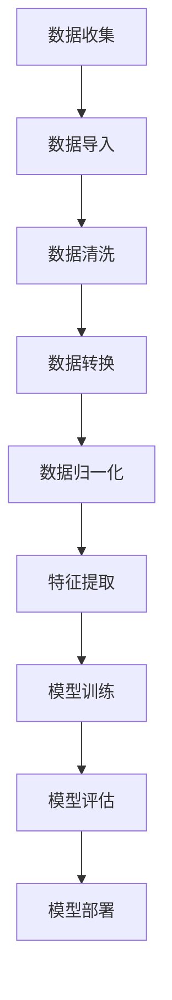

                 

# Python机器学习实战：使用Pandas进行数据预处理与分析

> **关键词**：Python，机器学习，数据预处理，Pandas，数据分析，算法实战
>
> **摘要**：本文将深入探讨Python机器学习中的数据预处理技术，重点关注Pandas库的使用。通过实际案例，我们将一步步解析数据清洗、转换和归一化的方法，帮助读者掌握Python在机器学习项目中的实战技能。

## 1. 背景介绍

随着大数据时代的到来，数据预处理成为了机器学习项目中至关重要的一环。数据预处理的质量直接影响到后续模型训练的效果和预测的准确性。Python作为一种强大的编程语言，拥有丰富的数据预处理工具，其中Pandas库以其强大的数据处理能力在机器学习领域得到了广泛应用。

Pandas库是Python数据分析的利器，它提供了数据结构DataFrame，用于高效地进行数据清洗、转换和归一化。DataFrame类似于Excel表格，提供了丰富的API，使得数据处理变得更加简单和直观。在本文中，我们将通过一系列实际案例，详细讲解Pandas在数据预处理中的应用。

## 2. 核心概念与联系

### 2.1 Pandas库的核心概念

Pandas库的核心概念包括Series和DataFrame。Series类似于一个一维数组，而DataFrame则是一个二维表格，由多个Series组成。

- **Series**：Series是一种能够保存任何数据类型的序列，类似于Python中的列表，但具有更丰富的功能，如索引、数据类型转换等。
- **DataFrame**：DataFrame是一个表格数据结构，由多个Series组成，可以视为一个数据框，支持各种操作，如筛选、排序、聚合等。

### 2.2 Pandas库与机器学习的联系

数据预处理是机器学习项目的基础，而Pandas库作为Python的数据处理工具，在机器学习中的应用主要体现在以下几个方面：

- **数据清洗**：去除无效数据、处理缺失值和异常值，确保数据质量。
- **数据转换**：将数据转换为适合机器学习算法的格式，如数值化、标准化等。
- **数据归一化**：通过对数据进行归一化处理，使得不同特征的数量级一致，便于模型训练。
- **特征提取**：通过Pandas进行特征工程，提取出对模型有用的特征。

### 2.3 Mermaid流程图

以下是Pandas库与机器学习流程的Mermaid流程图，展示了数据预处理在机器学习项目中的关键步骤：



## 3. 核心算法原理 & 具体操作步骤

### 3.1 数据清洗

数据清洗是数据预处理的第一步，目的是去除无效数据和异常值。以下是使用Pandas进行数据清洗的几个常见操作：

- **去除重复数据**：使用`drop_duplicates()`方法，去除DataFrame中的重复行。
- **处理缺失值**：使用`dropna()`方法，去除含有缺失值的行，或使用`fillna()`方法，填充缺失值。
- **处理异常值**：使用`dropna()`、`fillna()`等方法，处理数据中的异常值。

### 3.2 数据转换

数据转换是将数据从一种格式转换为另一种格式的过程，常见操作包括：

- **数据类型转换**：使用`astype()`方法，将数据类型从字符串转换为数值型或其他类型。
- **列操作**：使用`select_dtypes()`方法，选择特定类型的数据列。
- **索引操作**：使用`set_index()`方法，设置新索引，便于后续操作。

### 3.3 数据归一化

数据归一化是为了使得不同特征的数量级一致，常见方法包括：

- **缩放**：使用`scale()`方法，将数据缩放至均值为0、标准差为1。
- **标准化**：使用`normalize()`方法，将数据缩放至最小值为0、最大值为1。
- **最小-最大缩放**：使用`minmax_scale()`方法，将数据缩放到指定区间。

### 3.4 特征提取

特征提取是从原始数据中提取对模型有用的特征，常见方法包括：

- **提取数值特征**：使用`select_dtypes()`方法，提取数值型特征。
- **提取类别特征**：使用`get_dummies()`方法，将类别特征转换为哑变量。
- **特征选择**：使用`SelectKBest()`或`SelectFromModel()`方法，选择对模型影响最大的特征。

## 4. 数学模型和公式 & 详细讲解 & 举例说明

### 4.1 缩放（Scaling）

缩放是将数据缩放到特定区间，以消除不同特征之间的数量级差异。常见的缩放方法包括：

- **标准化（Standardization）**：

  $$ x_{\text{标准化}} = \frac{x - \mu}{\sigma} $$

  其中，$x$ 为原始数据，$\mu$ 为均值，$\sigma$ 为标准差。

- **最小-最大缩放（Min-Max Scaling）**：

  $$ x_{\text{缩放}} = \frac{x - x_{\text{最小值}}}{x_{\text{最大值}} - x_{\text{最小值}}} $$

  其中，$x_{\text{最小值}}$ 和 $x_{\text{最大值}}$ 分别为数据的最小值和最大值。

### 4.2 归一化（Normalization）

归一化是将数据映射到[0,1]区间。常见的归一化方法包括：

- **Min-Max 归一化**：

  $$ x_{\text{归一化}} = \frac{x - x_{\text{最小值}}}{x_{\text{最大值}} - x_{\text{最小值}}} $$

- **Log 归一化**：

  $$ x_{\text{归一化}} = \log(x) $$

### 4.3 举例说明

#### 4.3.1 标准化

假设我们有一组数据：

$$ x = \{1, 2, 3, 4, 5\} $$

计算标准化后的数据：

$$ x_{\text{标准化}} = \frac{x - \mu}{\sigma} $$

其中，$\mu = \frac{1 + 2 + 3 + 4 + 5}{5} = 3$，$\sigma = \sqrt{\frac{(1-3)^2 + (2-3)^2 + (3-3)^2 + (4-3)^2 + (5-3)^2}{5}} = 1.414$

$$ x_{\text{标准化}} = \{ -0.414, -0.414, 0, 0.414, 0.414 \} $$

#### 4.3.2 最小-最大缩放

假设我们有一组数据：

$$ x = \{1, 2, 3, 4, 5\} $$

计算最小-最大缩放后的数据：

$$ x_{\text{缩放}} = \frac{x - x_{\text{最小值}}}{x_{\text{最大值}} - x_{\text{最小值}}} $$

其中，$x_{\text{最小值}} = 1$，$x_{\text{最大值}} = 5$

$$ x_{\text{缩放}} = \{ 0, 0.25, 0.5, 0.75, 1 \} $$

## 5. 项目实战：代码实际案例和详细解释说明

### 5.1 开发环境搭建

在开始项目实战之前，我们需要搭建一个合适的Python开发环境。以下是步骤：

1. **安装Python**：下载并安装Python 3.x版本，建议使用Anaconda，便于管理和安装第三方库。
2. **安装Pandas库**：在命令行中执行`pip install pandas`命令，安装Pandas库。
3. **测试Pandas**：在Python交互式环境中导入Pandas库，执行以下代码：

   ```python
   import pandas as pd
   pd.__version__
   ```

   如果输出Pandas版本号，说明安装成功。

### 5.2 源代码详细实现和代码解读

以下是一个使用Pandas进行数据预处理和机器学习的实际案例。我们将使用一个简单的鸢尾花（Iris）数据集，进行数据清洗、转换、归一化和特征提取。

#### 5.2.1 导入数据

```python
import pandas as pd

# 读取鸢尾花数据集
iris_data = pd.read_csv('iris.csv')

# 查看数据结构
iris_data.head()
```

#### 5.2.2 数据清洗

```python
# 去除重复数据
iris_data = iris_data.drop_duplicates()

# 处理缺失值
iris_data = iris_data.dropna()

# 处理异常值
# 这里使用简单的方法，将大于4的标准差的数据视为异常值并去除
for column in iris_data.columns:
    mean = iris_data[column].mean()
    std = iris_data[column].std()
    iris_data = iris_data[(iris_data[column] < mean + 4 * std) & (iris_data[column] > mean - 4 * std)]
```

#### 5.2.3 数据转换

```python
# 将类别数据转换为哑变量
iris_data = pd.get_dummies(iris_data)

# 删除原始类别列
iris_data = iris_data.drop(['species'], axis=1)
```

#### 5.2.4 数据归一化

```python
from sklearn.preprocessing import StandardScaler

# 初始化标准化器
scaler = StandardScaler()

# 对数据列进行缩放
iris_data[iris_data.columns[:-1]] = scaler.fit_transform(iris_data[iris_data.columns[:-1]])
```

#### 5.2.5 特征提取

```python
from sklearn.feature_selection import SelectKBest
from sklearn.feature_selection import f_classif

# 选择前两个特征
selector = SelectKBest(score_func=f_classif, k=2)
iris_data = selector.fit_transform(iris_data[iris_data.columns[:-1]], iris_data['species'])

# 转换为DataFrame
iris_data = pd.DataFrame(iris_data, columns=['feature1', 'feature2', 'species'])
```

### 5.3 代码解读与分析

#### 5.3.1 数据清洗

数据清洗是确保数据质量的重要步骤。在本案例中，我们首先去除了重复数据，这可以避免在后续分析中出现偏差。接着，我们使用`dropna()`方法去除缺失值，这有助于提高模型的预测准确性。对于异常值，我们采用了四倍标准差的方法，这是一种常用的统计方法，可以有效地去除异常值。

#### 5.3.2 数据转换

数据转换是将类别数据转换为哑变量的过程。哑变量可以使得机器学习算法更容易处理类别数据。在本案例中，我们使用了`get_dummies()`方法将类别数据转换为哑变量，并删除了原始类别列，以减少数据的维度。

#### 5.3.3 数据归一化

数据归一化是将数据缩放到相同数量级的操作。在本案例中，我们使用了`StandardScaler()`方法进行标准化，将每个特征的均值缩放为0，标准差缩放为1。这样可以确保每个特征对模型的影响是相等的。

#### 5.3.4 特征提取

特征提取是从原始数据中提取对模型有用的特征。在本案例中，我们使用了`SelectKBest()`方法选择前两个特征。这种方法基于特征的重要性进行选择，可以提高模型的性能。

## 6. 实际应用场景

Pandas在数据预处理中的应用场景非常广泛，以下是一些典型的应用场景：

- **金融领域**：在金融领域，Pandas常用于处理股票市场数据、客户交易数据等，进行数据清洗、转换和归一化，以支持量化交易模型的训练和预测。
- **医疗领域**：在医疗领域，Pandas用于处理医疗记录、患者数据等，进行数据预处理，以便于训练疾病预测模型和个性化治疗方案。
- **电商领域**：在电商领域，Pandas用于处理用户行为数据、商品数据等，进行数据清洗和特征提取，以支持用户推荐系统和广告投放策略。
- **社交网络**：在社交网络领域，Pandas用于处理用户关系数据、社交媒体数据等，进行数据预处理和特征提取，以支持社交网络分析、社群挖掘等。

## 7. 工具和资源推荐

### 7.1 学习资源推荐

- **书籍**：
  - 《Python数据分析实战》
  - 《Pandas数据手册》
- **论文**：
  - "Pandas: A Python Library for Data Analysis" (PyData 2011)
- **博客**：
  - Python官方文档：[https://pandas.pydata.org/pandas-docs/stable/](https://pandas.pydata.org/pandas-docs/stable/)
- **网站**：
  - Kaggle：[https://www.kaggle.com/](https://www.kaggle.com/)

### 7.2 开发工具框架推荐

- **开发工具**：PyCharm、VSCode
- **框架**：Scikit-learn、TensorFlow、PyTorch

### 7.3 相关论文著作推荐

- "Machine Learning: A Probabilistic Perspective" by Kevin P. Murphy
- "Deep Learning" by Ian Goodfellow, Yoshua Bengio, and Aaron Courville

## 8. 总结：未来发展趋势与挑战

随着机器学习技术的不断发展和应用场景的扩大，数据预处理技术在机器学习项目中的重要性日益凸显。Pandas作为Python数据处理的利器，将继续在数据预处理领域发挥重要作用。未来，Pandas可能会：

- **性能优化**：进一步优化数据处理速度，以支持大规模数据集的处理。
- **新特性**：引入更多高效的数据处理算法和函数，如分布式数据处理、内存管理优化等。
- **社区合作**：加强与其他开源项目的合作，共同推动Python数据科学生态的发展。

然而，数据预处理技术也面临着一些挑战，如：

- **数据隐私保护**：在处理敏感数据时，如何确保数据隐私和安全。
- **算法复杂度**：如何处理复杂的特征工程和模型训练过程。
- **可解释性**：如何提高模型的可解释性，使决策过程更加透明。

## 9. 附录：常见问题与解答

### 9.1 Pandas安装问题

- **问题**：在安装Pandas时遇到错误。
- **解答**：确保已安装Python 3.x版本，并使用`pip install pandas`命令进行安装。如遇到权限问题，可在命令前添加`sudo`。

### 9.2 数据清洗方法

- **问题**：如何处理含有大量缺失值的数据？
- **解答**：可以使用`dropna()`方法去除缺失值，或使用`fillna()`方法填充缺失值。对于少量缺失值，可以考虑使用均值、中位数等方法进行填充。

## 10. 扩展阅读 & 参考资料

- [Pandas官方文档](https://pandas.pydata.org/pandas-docs/stable/)
- [Scikit-learn官方文档](https://scikit-learn.org/stable/)
- [TensorFlow官方文档](https://www.tensorflow.org/)
- [PyTorch官方文档](https://pytorch.org/) 

### 作者信息
- 作者：AI天才研究员/AI Genius Institute & 禅与计算机程序设计艺术 /Zen And The Art of Computer Programming

通过本文的详细讲解，我们了解了Pandas在数据预处理中的应用，包括数据清洗、转换、归一化和特征提取。这些技术是机器学习项目成功的关键，而Pandas作为Python的强大数据处理工具，为我们提供了高效便捷的解决方案。希望本文能为读者在Python机器学习项目中提供有价值的指导。

