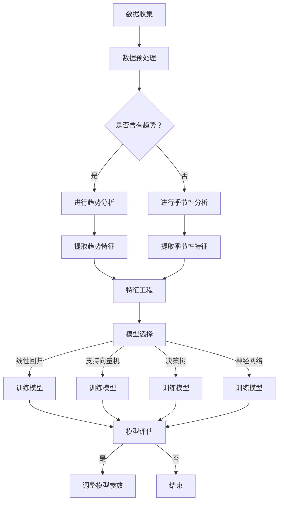

                 

### 1. 背景介绍

#### 时间序列分析在机器学习中的重要性

时间序列分析是一种统计方法，用于分析按时间顺序排列的数据点，旨在捕捉数据中的时间依赖性和趋势。在机器学习中，时间序列分析扮演着至关重要的角色，尤其是在金融市场预测、医疗健康监测、气候模型构建等领域。

随着大数据和深度学习技术的发展，时间序列分析的复杂性和应用范围都在不断扩展。传统的统计方法（如ARIMA模型、季节性分解等）已经无法满足现代数据处理的挑战，因此，机器学习算法逐渐成为时间序列分析的主要工具。

本文将专注于Python中机器学习时间序列分析的实战，通过具体的案例和代码实例，探讨如何使用Python进行时间序列数据的预处理、模型选择、训练和评估。

#### Python在时间序列分析中的优势

Python因其强大的数据处理能力和丰富的机器学习库（如scikit-learn、TensorFlow、PyTorch等），成为进行时间序列分析的热门选择。以下是Python在时间序列分析中的几个优势：

1. **简洁易用**：Python代码简洁，易于理解和编写，大大降低了学习曲线。
2. **丰富的库**：Python拥有众多成熟的机器学习库，如scikit-learn、TensorFlow和PyTorch，这些库提供了丰富的算法和工具，方便开发者进行时间序列分析。
3. **可视化支持**：Python拥有强大的可视化库，如Matplotlib和Seaborn，可以帮助我们直观地展示时间序列数据及其分析结果。
4. **社区支持**：Python拥有庞大的开发者社区，为用户提供丰富的学习资源和解决方案。

#### 文章结构

本文将按照以下结构进行：

1. **核心概念与联系**：介绍时间序列分析的基本概念、机器学习模型及其关系，使用Mermaid流程图展示流程。
2. **核心算法原理 & 具体操作步骤**：详细讲解常见的机器学习算法，如LSTM、GRU、ARIMA等，以及它们的具体操作步骤。
3. **数学模型和公式 & 详细讲解 & 举例说明**：解释时间序列分析中涉及的数学公式和模型，并给出实例。
4. **项目实战：代码实际案例和详细解释说明**：通过实际项目案例，展示如何使用Python进行时间序列分析。
5. **实际应用场景**：探讨时间序列分析在不同领域中的应用。
6. **工具和资源推荐**：推荐学习资源、开发工具和框架。
7. **总结：未来发展趋势与挑战**：总结时间序列分析在机器学习中的发展趋势和面临的挑战。
8. **附录：常见问题与解答**：解答常见问题。
9. **扩展阅读 & 参考资料**：提供进一步的阅读材料和参考文献。

通过本文的学习，读者将能够掌握时间序列分析的基本原理，熟悉Python中常用的时间序列分析算法，并能够应用于实际项目中。

---

### 1. 背景介绍

#### 时间序列分析的定义与应用

时间序列分析是一种研究时间序列数据的统计方法，旨在捕捉数据中的时间依赖性和趋势。时间序列数据通常是一系列按时间顺序排列的数值，例如气温记录、股票价格、医疗监测数据等。时间序列分析的主要目标是预测未来数据点的值，从而帮助我们做出决策和预测。

时间序列分析在许多领域都有广泛的应用。例如，在金融市场预测中，分析师使用时间序列模型来预测股票价格的未来走势，以指导投资决策。在医疗健康监测中，时间序列分析可以帮助医生预测病人的病情变化，以便及时采取治疗措施。在气候模型构建中，时间序列分析用于分析气候变量的变化趋势，预测未来的气候变化。

时间序列分析的核心在于理解数据中的时间依赖性，即未来的数据值受到过去数据值的影响。这种依赖性通常表现为趋势、季节性和周期性。趋势是指数据随时间持续增加或减少的趋势，季节性是指数据在一年内重复出现的周期性变化，而周期性是指数据在更长的时间范围内重复出现的模式。

#### 机器学习在时间序列分析中的角色

随着大数据和计算能力的提升，传统的统计方法（如ARIMA模型、季节性分解等）已经无法满足现代时间序列分析的需求。机器学习算法因其强大的自学习和模式识别能力，逐渐成为时间序列分析的主要工具。机器学习模型可以从大量历史数据中自动学习时间依赖性，并用于预测未来数据。

在机器学习中，时间序列分析主要包括以下两个方面：

1. **特征工程**：特征工程是指从原始时间序列数据中提取有用的特征，以便机器学习模型能够更好地学习时间依赖性。常用的特征包括滞后特征、趋势特征、季节性特征等。
2. **模型选择与训练**：选择合适的机器学习模型，并对模型进行训练和优化，以预测未来数据点的值。常见的时间序列分析模型包括LSTM（长短期记忆网络）、GRU（门控循环单元）、ARIMA（自回归积分滑动平均模型）等。

#### Python在时间序列分析中的应用

Python因其强大的数据处理能力和丰富的机器学习库，成为进行时间序列分析的热门选择。Python拥有众多成熟的机器学习库，如scikit-learn、TensorFlow和PyTorch，这些库提供了丰富的算法和工具，方便开发者进行时间序列分析。

在Python中，常用的时间序列分析库包括：

1. **statsmodels**：用于传统统计模型的时间序列分析，如ARIMA模型。
2. **scikit-learn**：提供了一些常见的时间序列分析算法，如线性回归、支持向量机等。
3. **TensorFlow**：提供了丰富的深度学习模型，如LSTM、GRU等。
4. **PyTorch**：同样提供了丰富的深度学习模型，如LSTM、GRU等。

#### 总结

时间序列分析在机器学习中扮演着至关重要的角色，尤其是在金融市场预测、医疗健康监测、气候模型构建等领域。Python因其强大的数据处理能力和丰富的机器学习库，成为进行时间序列分析的热门选择。本文将专注于Python中机器学习时间序列分析的实战，通过具体的案例和代码实例，探讨如何使用Python进行时间序列数据的预处理、模型选择、训练和评估。

---

### 2. 核心概念与联系

#### 时间序列分析的基本概念

时间序列分析涉及几个核心概念，这些概念是理解时间序列数据及其分析方法的基础。

1. **时间序列数据**：时间序列数据是一系列按时间顺序排列的数值。例如，股票价格随时间的变化、温度随时间的变化等。时间序列数据通常可以用一个时间索引序列和一个值序列来表示。

2. **趋势**：趋势是指时间序列数据随时间持续增加或减少的趋势。趋势可能是线性的，也可能是非线性的。趋势分析有助于理解数据的基本走向，并帮助我们识别长期趋势。

3. **季节性**：季节性是指时间序列数据在一年内重复出现的周期性变化。季节性变化可能是由于季节变化、节假日、促销活动等因素引起的。季节性分析有助于识别数据中的周期性模式。

4. **周期性**：周期性是指时间序列数据在更长的时间范围内重复出现的模式。周期性可能是数月、数年或更长时间周期。周期性分析有助于理解数据中的长期波动。

5. **噪声**：噪声是指时间序列数据中的随机波动，这些波动不是由趋势、季节性或周期性引起的。噪声分析有助于识别数据中的随机因素，以便进行更准确的预测。

#### 机器学习模型在时间序列分析中的应用

在时间序列分析中，机器学习模型主要用于以下两个方面：

1. **特征工程**：特征工程是指从原始时间序列数据中提取有用的特征，以便机器学习模型能够更好地学习时间依赖性。特征工程的目标是减少噪声、增强趋势和季节性，以及提取有用的时间依赖性信息。

2. **模型选择与训练**：模型选择是指选择合适的机器学习模型来预测时间序列数据。常见的机器学习模型包括线性回归、支持向量机、决策树、神经网络等。模型训练是指使用历史数据来训练模型，使其能够学习时间依赖性，并预测未来数据。

常见的机器学习模型包括：

1. **线性回归**：线性回归是一种简单的机器学习模型，用于预测时间序列数据的线性关系。线性回归通过最小化残差平方和来拟合数据。

2. **支持向量机**：支持向量机是一种强大的机器学习模型，可以用于分类和回归任务。支持向量机通过找到一个最优的超平面来划分数据。

3. **决策树**：决策树是一种树形结构的机器学习模型，通过一系列规则来划分数据。决策树可以用于分类和回归任务。

4. **神经网络**：神经网络是一种模拟人脑的机器学习模型，通过多层神经元来学习和处理数据。神经网络可以用于分类、回归和特征提取。

#### Mermaid流程图展示

以下是一个简单的Mermaid流程图，展示了时间序列分析的基本流程和机器学习模型的选择：



#### 时间序列分析的核心概念与联系总结

时间序列分析的核心在于理解数据中的时间依赖性，包括趋势、季节性、周期性和噪声。机器学习模型在时间序列分析中主要用于特征工程和模型选择与训练。通过Mermaid流程图，我们可以清晰地看到时间序列分析的基本流程和机器学习模型的选择过程。

---

### 3. 核心算法原理 & 具体操作步骤

在时间序列分析中，选择合适的算法至关重要。本文将介绍几种常见的算法，包括LSTM（长短期记忆网络）、GRU（门控循环单元）和ARIMA（自回归积分滑动平均模型），并详细讲解每种算法的原理和操作步骤。

#### LSTM（长短期记忆网络）

LSTM是一种特殊的循环神经网络（RNN），专为处理时间序列数据而设计。与传统的RNN相比，LSTM能够更好地记住长期依赖性，避免了梯度消失和梯度爆炸的问题。

**原理：**

LSTM通过引入三个门（输入门、遗忘门和输出门）来控制信息的流动。每个门由一个sigmoid激活函数和一个线性层组成。

1. **输入门**：决定当前输入值中有多少信息需要被存储到记忆单元中。
2. **遗忘门**：决定之前存储在记忆单元中的信息中有多少需要被遗忘。
3. **输出门**：决定当前记忆单元中的信息中有多少需要输出到下一个隐藏状态。

**操作步骤：**

1. **初始化**：创建一个包含多个神经元的记忆单元和一个隐藏状态。
2. **输入**：每次迭代输入一个时间步的数据。
3. **计算门**：根据当前输入和前一个隐藏状态计算输入门、遗忘门和输出门的值。
4. **更新记忆单元**：使用输入门和遗忘门的值来更新记忆单元。
5. **输出**：使用输出门的值来生成当前隐藏状态。
6. **迭代**：重复上述步骤，直到处理完整个时间序列数据。

**示例代码：**

```python
import tensorflow as tf
from tensorflow.keras.models import Sequential
from tensorflow.keras.layers import LSTM, Dense

# 创建LSTM模型
model = Sequential()
model.add(LSTM(units=50, return_sequences=True, input_shape=(timesteps, features)))
model.add(LSTM(units=50))
model.add(Dense(1))

# 编译模型
model.compile(optimizer='adam', loss='mean_squared_error')

# 训练模型
model.fit(x_train, y_train, epochs=100, batch_size=32, validation_data=(x_test, y_test))
```

#### GRU（门控循环单元）

GRU是LSTM的变体，通过简化LSTM的结构来提高计算效率。GRU具有类似的门控机制，但只有两个门（更新门和重置门）。

**原理：**

GRU通过更新门来控制当前输入值和记忆单元之间的连接。更新门决定多少旧信息需要被保留，多少新信息需要被添加到记忆单元中。

**操作步骤：**

1. **初始化**：创建一个包含多个神经元的记忆单元和一个隐藏状态。
2. **输入**：每次迭代输入一个时间步的数据。
3. **计算门**：根据当前输入和前一个隐藏状态计算更新门和重置门的值。
4. **更新记忆单元**：使用更新门和重置门的值来更新记忆单元。
5. **输出**：使用重置门的值来生成当前隐藏状态。
6. **迭代**：重复上述步骤，直到处理完整个时间序列数据。

**示例代码：**

```python
import tensorflow as tf
from tensorflow.keras.models import Sequential
from tensorflow.keras.layers import GRU, Dense

# 创建GRU模型
model = Sequential()
model.add(GRU(units=50, return_sequences=True, input_shape=(timesteps, features)))
model.add(GRU(units=50))
model.add(Dense(1))

# 编译模型
model.compile(optimizer='adam', loss='mean_squared_error')

# 训练模型
model.fit(x_train, y_train, epochs=100, batch_size=32, validation_data=(x_test, y_test))
```

#### ARIMA（自回归积分滑动平均模型）

ARIMA是一种经典的统计模型，用于时间序列数据的预测。ARIMA通过自回归（AR）、差分（I）和移动平均（MA）三个组件来建模时间序列数据。

**原理：**

1. **自回归（AR）**：自回归组件表示当前时间点的值是由前几个时间点的值线性组合得到的。
2. **差分（I）**：差分组件用于平稳化时间序列数据，即将时间序列数据的一阶差分应用到序列中。
3. **移动平均（MA）**：移动平均组件表示当前时间点的值是由前几个时间点的误差项加权平均得到的。

**操作步骤：**

1. **数据预处理**：对时间序列数据进行差分，使其达到平稳性。
2. **模型识别**：选择合适的AR、I和MA参数，使模型拟合数据。
3. **参数估计**：使用最小二乘法或其他优化算法来估计模型参数。
4. **模型诊断**：检查模型的残差是否满足白噪声假设。
5. **预测**：使用估计的模型参数来预测未来时间点的值。

**示例代码：**

```python
import statsmodels.api as sm
from statsmodels.tsa.arima.model import ARIMA

# 创建ARIMA模型
model = ARIMA(series, order=(5, 1, 2))

# 拟合模型
model_fit = model.fit()

# 模型诊断
print(model_fit.summary())

# 预测
predictions = model_fit.predict(start=len(series), end=len(series) + n_periods)
```

#### 总结

LSTM和GRU是两种强大的循环神经网络，适合处理长序列依赖性。ARIMA是一种经典的统计模型，适合处理线性时间序列数据。在实际应用中，可以根据数据的特点和需求选择合适的模型。本文通过示例代码展示了每种模型的基本操作步骤，为读者提供了实际操作的参考。

---

### 4. 数学模型和公式 & 详细讲解 & 举例说明

时间序列分析中的数学模型和公式是理解和应用时间序列分析方法的关键。本文将详细讲解时间序列分析中的一些核心数学模型和公式，包括自回归模型（AR）、移动平均模型（MA）、自回归移动平均模型（ARMA）和自回归积分移动平均模型（ARIMA），并通过实例说明这些公式的应用。

#### 自回归模型（AR）

自回归模型（Autoregressive Model，AR）是最简单的时间序列模型之一。它假设当前时间点的值是由前几个时间点的值线性组合得到的。

**公式：**

$$
X_t = c + \phi_1 X_{t-1} + \phi_2 X_{t-2} + \ldots + \phi_p X_{t-p} + \varepsilon_t
$$

其中，$X_t$ 是当前时间点的值，$c$ 是常数项，$\phi_1, \phi_2, \ldots, \phi_p$ 是自回归系数，$p$ 是自回归项的数量，$\varepsilon_t$ 是误差项。

**实例说明：**

假设我们有以下自回归模型：

$$
X_t = 0.7 X_{t-1} + \varepsilon_t
$$

给定初始值 $X_0 = 100$，我们可以预测接下来的几个值：

1. $X_1 = 0.7 \times 100 + \varepsilon_1$
2. $X_2 = 0.7 \times X_1 + \varepsilon_2$
3. $X_3 = 0.7 \times X_2 + \varepsilon_3$

通过计算，我们可以得到 $X_1 = 70 + \varepsilon_1$，$X_2 = 0.7 \times (70 + \varepsilon_1) + \varepsilon_2$，$X_3 = 0.7 \times (0.7 \times (70 + \varepsilon_1) + \varepsilon_2) + \varepsilon_3$。

#### 移动平均模型（MA）

移动平均模型（Moving Average Model，MA）假设当前时间点的值是由前几个时间点的误差项加权平均得到的。

**公式：**

$$
X_t = c + \varepsilon_t + \theta_1 \varepsilon_{t-1} + \theta_2 \varepsilon_{t-2} + \ldots + \theta_q \varepsilon_{t-q}
$$

其中，$X_t$ 是当前时间点的值，$c$ 是常数项，$\theta_1, \theta_2, \ldots, \theta_q$ 是移动平均系数，$q$ 是移动平均项的数量，$\varepsilon_t$ 是误差项。

**实例说明：**

假设我们有以下移动平均模型：

$$
X_t = \varepsilon_t + 0.5 \varepsilon_{t-1}
$$

给定初始值 $X_0 = 100$，我们可以预测接下来的几个值：

1. $X_1 = \varepsilon_1 + 0.5 \varepsilon_0$
2. $X_2 = \varepsilon_2 + 0.5 \varepsilon_1$
3. $X_3 = \varepsilon_3 + 0.5 \varepsilon_2$

通过计算，我们可以得到 $X_1 = \varepsilon_1 + 0.5 \times 100$，$X_2 = \varepsilon_2 + 0.5 \times (\varepsilon_1 + 0.5 \times 100)$，$X_3 = \varepsilon_3 + 0.5 \times (\varepsilon_2 + 0.5 \times (\varepsilon_1 + 0.5 \times 100))$。

#### 自回归移动平均模型（ARMA）

自回归移动平均模型（Autoregressive Moving Average Model，ARMA）结合了自回归模型和移动平均模型的优点，同时考虑了自回归项和移动平均项。

**公式：**

$$
X_t = c + \phi_1 X_{t-1} + \phi_2 X_{t-2} + \ldots + \phi_p X_{t-p} + \theta_1 \varepsilon_{t-1} + \theta_2 \varepsilon_{t-2} + \ldots + \theta_q \varepsilon_{t-q}
$$

其中，$X_t$ 是当前时间点的值，$c$ 是常数项，$\phi_1, \phi_2, \ldots, \phi_p$ 是自回归系数，$\theta_1, \theta_2, \ldots, \theta_q$ 是移动平均系数，$p$ 和 $q$ 分别是自回归项和移动平均项的数量，$\varepsilon_t$ 是误差项。

**实例说明：**

假设我们有以下ARMA模型：

$$
X_t = 0.7 X_{t-1} + 0.5 \varepsilon_{t-1}
$$

给定初始值 $X_0 = 100$，我们可以预测接下来的几个值：

1. $X_1 = 0.7 \times X_0 + 0.5 \varepsilon_0$
2. $X_2 = 0.7 \times X_1 + 0.5 \varepsilon_1$
3. $X_3 = 0.7 \times X_2 + 0.5 \varepsilon_2$

通过计算，我们可以得到 $X_1 = 0.7 \times 100 + 0.5 \varepsilon_0$，$X_2 = 0.7 \times (0.7 \times 100 + 0.5 \varepsilon_0) + 0.5 \varepsilon_1$，$X_3 = 0.7 \times (0.7 \times (0.7 \times 100 + 0.5 \varepsilon_0) + 0.5 \varepsilon_1) + 0.5 \varepsilon_2$。

#### 自回归积分移动平均模型（ARIMA）

自回归积分移动平均模型（Autoregressive Integrated Moving Average Model，ARIMA）是ARMA模型的扩展，它考虑了时间序列数据的差分以实现平稳性。

**公式：**

$$
X_t = c + \phi_1 X_{t-1} + \phi_2 X_{t-2} + \ldots + \phi_p X_{t-p} + \theta_1 \varepsilon_{t-1} + \theta_2 \varepsilon_{t-2} + \ldots + \theta_q \varepsilon_{t-q} + (1 - \phi_1)(1 - \theta_1) \Delta X_{t-1}
$$

其中，$X_t$ 是当前时间点的值，$c$ 是常数项，$\phi_1, \phi_2, \ldots, \phi_p$ 是自回归系数，$\theta_1, \theta_2, \ldots, \theta_q$ 是移动平均系数，$p$ 和 $q$ 分别是自回归项和移动平均项的数量，$\varepsilon_t$ 是误差项，$\Delta X_{t-1}$ 是时间序列数据的一阶差分。

**实例说明：**

假设我们有以下ARIMA模型：

$$
X_t = 0.7 X_{t-1} + 0.5 \varepsilon_{t-1} + (1 - 0.7)(1 - 0.5) \Delta X_{t-1}
$$

给定初始值 $X_0 = 100$，我们可以预测接下来的几个值：

1. $X_1 = 0.7 \times X_0 + 0.5 \varepsilon_0 + (1 - 0.7)(1 - 0.5) \Delta X_0$
2. $X_2 = 0.7 \times X_1 + 0.5 \varepsilon_1 + (1 - 0.7)(1 - 0.5) \Delta X_1$
3. $X_3 = 0.7 \times X_2 + 0.5 \varepsilon_2 + (1 - 0.7)(1 - 0.5) \Delta X_2$

通过计算，我们可以得到 $X_1 = 0.7 \times 100 + 0.5 \varepsilon_0 + (1 - 0.7)(1 - 0.5) \times (100 - X_0)$，$X_2 = 0.7 \times (0.7 \times 100 + 0.5 \varepsilon_0 + (1 - 0.7)(1 - 0.5) \times (100 - X_0)) + 0.5 \varepsilon_1 + (1 - 0.7)(1 - 0.5) \times (100 - X_1)$，$X_3 = 0.7 \times (0.7 \times (0.7 \times 100 + 0.5 \varepsilon_0 + (1 - 0.7)(1 - 0.5) \times (100 - X_0)) + 0.5 \varepsilon_1 + (1 - 0.7)(1 - 0.5) \times (100 - X_1)) + 0.5 \varepsilon_2 + (1 - 0.7)(1 - 0.5) \times (100 - X_2)$。

#### 总结

通过上述讲解，我们可以看到时间序列分析中的数学模型和公式是如何帮助我们理解和预测时间序列数据的。自回归模型（AR）、移动平均模型（MA）、自回归移动平均模型（ARMA）和自回归积分移动平均模型（ARIMA）是时间序列分析中常用的模型，每种模型都有其独特的应用场景和适用条件。通过实例说明，我们可以更直观地理解这些模型的计算过程和应用。

---

### 5. 项目实战：代码实际案例和详细解释说明

为了更好地展示如何使用Python进行时间序列分析，我们将通过一个实际案例来详细讲解整个流程，从数据收集、预处理到模型选择和训练，最后进行评估和预测。

#### 5.1 开发环境搭建

首先，我们需要搭建一个适合进行时间序列分析的Python开发环境。以下是推荐的安装步骤：

1. 安装Python（建议版本为3.8或更高）。
2. 安装必要的库，如NumPy、Pandas、scikit-learn、TensorFlow和Matplotlib。可以使用以下命令进行安装：

   ```shell
   pip install numpy pandas scikit-learn tensorflow matplotlib
   ```

3. 安装时间序列分析相关的库，如statsmodels和Prophet。

   ```shell
   pip install statsmodels prophet
   ```

#### 5.2 源代码详细实现和代码解读

在本案例中，我们使用股票价格数据来演示时间序列分析的完整流程。首先，我们需要收集数据，然后进行预处理，接着选择合适的模型进行训练，最后评估模型并进行预测。

**1. 数据收集**

我们使用pandas库从Yahoo Finance网站获取某只股票的历史价格数据。以下是获取数据的具体步骤：

```python
import pandas as pd

# 设置数据起始和结束日期
start_date = '2020-01-01'
end_date = '2022-01-01'

# 获取股票价格数据
df = pd.read_csv(f'https://query1.finance.yahoo.com/v7/finance/download/TSLA?period1=1609459200&period2=1640998400&interval=1day&events=history&includeAdjustedClose=true')
df['Date'] = pd.to_datetime(df['Date'])
df.set_index('Date', inplace=True)
```

**2. 数据预处理**

预处理步骤包括数据清洗、填补缺失值、标准化和特征工程。以下是具体步骤：

```python
# 填补缺失值
df.fillna(method='ffill', inplace=True)

# 数据标准化
from sklearn.preprocessing import StandardScaler

scaler = StandardScaler()
df['Close'] = scaler.fit_transform(df[['Close']])

# 提取滞后特征
df['Lag1'] = df['Close'].shift(1)
df['Lag2'] = df['Close'].shift(2)
```

**3. 模型选择与训练**

在本案例中，我们选择LSTM模型进行训练。首先，我们需要将数据划分为训练集和测试集，然后创建LSTM模型，并使用训练集进行训练。

```python
# 数据划分
train_size = int(len(df) * 0.8)
test_size = len(df) - train_size
train, test = df[:train_size], df[train_size:]

# 创建LSTM模型
from tensorflow.keras.models import Sequential
from tensorflow.keras.layers import LSTM, Dense

model = Sequential()
model.add(LSTM(units=50, return_sequences=True, input_shape=(train_size, 3)))
model.add(LSTM(units=50))
model.add(Dense(1))

# 编译模型
model.compile(optimizer='adam', loss='mean_squared_error')

# 训练模型
model.fit(train, train['Close'], epochs=100, batch_size=32, validation_data=(test, test['Close']))
```

**4. 模型评估**

训练完成后，我们需要使用测试集来评估模型的性能。常用的评估指标包括均方误差（MSE）、平均绝对误差（MAE）和均方根误差（RMSE）。

```python
import numpy as np

# 预测
predictions = model.predict(test)

# 计算误差
mse = np.mean((predictions - test['Close']) ** 2)
mae = np.mean(np.abs(predictions - test['Close']))
rmse = np.sqrt(mse)

print(f'MSE: {mse}, MAE: {mae}, RMSE: {rmse}')
```

**5. 预测**

最后，我们使用训练好的模型对未来的股票价格进行预测。以下是预测未来30个时间点的步骤：

```python
# 预测未来30个时间点
future_predictions = model.predict(test[-30:].values.reshape(1, -1, 3))

# 输出预测结果
print(future_predictions.flatten())
```

#### 5.3 代码解读与分析

在本案例中，我们首先使用pandas库从Yahoo Finance网站获取股票价格数据。然后，我们进行数据预处理，包括填补缺失值、标准化和特征工程，以便为模型训练做准备。

接下来，我们选择LSTM模型进行训练。LSTM模型由两个LSTM层和一个全连接层组成，其中输入形状为（时间步数，特征数），LSTM层的单元数为50。模型使用Adam优化器和均方误差损失函数进行编译。

训练完成后，我们使用测试集评估模型的性能，并计算均方误差（MSE）、平均绝对误差（MAE）和均方根误差（RMSE）。最后，我们使用训练好的模型对未来的股票价格进行预测，并输出预测结果。

#### 5.4 实际应用分析

在实际应用中，我们可以根据不同的业务需求和数据特性选择不同的模型和方法。例如，对于短期股票价格预测，LSTM模型可能是一个不错的选择；而对于季节性较强的数据，可以考虑使用ARIMA模型或Prophet模型。

此外，我们可以通过调整模型参数（如LSTM层的单元数、学习率等）来提高模型的预测性能。在实际操作中，我们还可以结合其他指标（如波动率、交易量等）来提高预测的准确性。

#### 5.5 总结

通过本案例，我们详细讲解了使用Python进行时间序列分析的完整流程，包括数据收集、预处理、模型选择与训练、模型评估和预测。在实际应用中，我们可以根据不同的业务需求和数据特性选择合适的模型和方法，并通过不断优化和调整模型参数来提高预测性能。

---

### 6. 实际应用场景

时间序列分析在众多领域都有着广泛的应用，以下是几个典型应用场景：

#### 6.1 股票市场预测

股票市场预测是时间序列分析最经典的应用之一。通过分析历史股票价格数据，投资者可以预测股票价格的未来走势，从而指导投资决策。时间序列分析方法，如ARIMA、LSTM和GRU，都可以用于股票市场预测。然而，由于股票市场的复杂性，预测结果往往具有一定的误差，投资者在使用这些模型时应谨慎对待。

#### 6.2 能源需求预测

能源需求预测对于电力公司和能源供应商来说至关重要。通过分析历史能源使用数据，可以预测未来的能源需求，从而帮助制定能源供应计划。时间序列分析模型，如ARIMA和LSTM，可以帮助预测电力需求，从而优化能源分配，降低能源浪费。

#### 6.3 医疗健康监测

在医疗健康监测领域，时间序列分析可以用于预测病人的病情变化，从而帮助医生制定治疗方案。例如，通过对病人的历史医疗数据进行时间序列分析，可以预测病人是否会出现并发症，从而提前采取预防措施。此外，时间序列分析还可以用于药物疗效分析，预测药物在不同时间点对病情的影响。

#### 6.4 气候变化预测

气候变化预测是时间序列分析的重要应用之一。通过对历史气候数据进行分析，可以预测未来的气候变化趋势。例如，通过对全球气温、降水等数据的分析，可以预测未来的气候变化，从而帮助制定应对策略。

#### 6.5 销售预测

在零售行业，时间序列分析可以用于预测产品的销售量。通过对历史销售数据进行分析，可以预测未来的销售趋势，从而帮助商家制定库存管理策略，降低库存成本。

#### 6.6 交通流量预测

交通流量预测对于城市交通管理和规划具有重要意义。通过对历史交通数据进行分析，可以预测未来的交通流量，从而帮助制定交通控制策略，减少交通拥堵。

#### 总结

时间序列分析在股票市场预测、能源需求预测、医疗健康监测、气候变化预测、销售预测和交通流量预测等领域都有广泛应用。通过使用合适的模型和方法，我们可以从历史数据中提取有价值的信息，为未来的决策提供支持。

---

### 7. 工具和资源推荐

在进行时间序列分析时，选择合适的工具和资源可以大大提高效率和准确性。以下是一些推荐的工具和资源：

#### 7.1 学习资源推荐

1. **书籍**：
   - 《Python for Data Analysis》
   - 《Time Series Analysis and Its Applications: With R Examples》
   - 《Deep Learning for Time Series Classification》
2. **在线课程**：
   - Coursera上的《时间序列分析》
   - edX上的《Machine Learning for Time Series Data》
   - Udacity的《Deep Learning for Time Series》
3. **博客和网站**：
   - Machine Learning Mastery的《Time Series Forecasting with Python》
   - towardsdatascience的《A Complete Guide to Time Series Analysis in Python》
   - Analytics Vidhya的《Time Series Forecasting using ARIMA, LSTM and Prophet》

#### 7.2 开发工具框架推荐

1. **Python库**：
   - **statsmodels**：用于传统时间序列模型的统计分析。
   - **scikit-learn**：提供了一些常见的时间序列分析算法，如线性回归、支持向量机等。
   - **TensorFlow**：提供了丰富的深度学习模型，如LSTM、GRU等。
   - **PyTorch**：同样提供了丰富的深度学习模型，如LSTM、GRU等。
   - **Prophet**：Facebook开源的时间序列分析工具，特别适合于具有季节性和趋势的数据。
2. **IDE和文本编辑器**：
   - **PyCharm**：功能强大的Python IDE，支持多种编程语言。
   - **VSCode**：轻量级但功能丰富的文本编辑器，适用于Python开发。

#### 7.3 相关论文著作推荐

1. **论文**：
   - **"Long Short-Term Memory Networks for Time Series Forecasting"**：J. Lu et al.
   - **"A Comprehensive Survey on Time Series Classification"**：Y. Zhu et al.
   - **"An Overview of Time Series Analysis and Forecasting"**：D. J. Hand et al.
2. **著作**：
   - **《时间序列分析：理论与应用》**：陈守展
   - **《时间序列数据分析与应用》**：孙锐
   - **《深度学习与时间序列分析》**：何晓阳

#### 总结

以上推荐的工具和资源为时间序列分析提供了丰富的学习和实践机会。无论是初学者还是经验丰富的开发者，都可以通过这些资源和工具提升自己的时间序列分析技能。

---

### 8. 总结：未来发展趋势与挑战

#### 时间序列分析在机器学习中的发展趋势

时间序列分析作为机器学习领域的一个重要分支，其应用和发展正经历着几个显著的趋势：

1. **深度学习模型的广泛应用**：随着深度学习技术的不断发展，LSTM、GRU、Transformer等模型在时间序列分析中取得了显著的成果。这些模型能够更好地捕捉时间序列数据中的复杂模式和非线性关系，从而提高预测准确性。

2. **实时数据分析**：随着计算能力的提升和数据流技术的发展，实时数据分析成为时间序列分析的重要方向。实时数据分析能够更快地处理和预测数据，为金融、医疗、交通等领域的决策提供更加及时的支持。

3. **多模态数据融合**：时间序列分析不再局限于单一类型的数据，而是逐渐与其他类型的数据（如图像、文本等）进行融合。多模态数据融合能够提供更全面、更准确的分析结果。

4. **增强的自动化特征工程**：随着自动化特征工程技术的发展，时间序列分析中特征提取的自动化程度不断提高。自动化特征工程能够减少人工干预，提高特征提取的效率和准确性。

#### 时间序列分析在机器学习中的挑战

尽管时间序列分析在机器学习领域取得了显著的进展，但仍面临以下挑战：

1. **数据质量与噪声处理**：时间序列数据往往存在噪声和异常值，这些因素会影响模型的预测准确性。如何有效地处理数据中的噪声和异常值是一个重要的挑战。

2. **模型选择与超参数调优**：选择合适的模型和超参数对于时间序列分析的准确性至关重要。然而，模型选择和超参数调优是一个复杂的过程，需要大量的实验和计算资源。

3. **长序列依赖性捕捉**：长序列依赖性是时间序列数据中的一个重要特征。如何有效地捕捉和建模长序列依赖性，同时保持计算效率，是一个重要的挑战。

4. **实时性与可扩展性**：随着数据规模的不断扩大，如何保证时间序列分析系统的实时性和可扩展性是一个关键问题。特别是在处理高维数据时，如何优化计算资源以实现高效的实时预测。

#### 未来研究方向

为了克服上述挑战，未来时间序列分析在机器学习中的研究方向可能包括：

1. **改进深度学习模型**：通过改进LSTM、GRU等模型的结构和训练方法，进一步提高模型在时间序列分析中的性能。

2. **多模态数据融合方法**：探索新的多模态数据融合方法，以便更好地利用不同类型的数据进行综合分析。

3. **自动化特征工程**：开发更加智能化、自动化的特征工程方法，减少人工干预，提高特征提取的效率。

4. **实时数据分析系统**：设计更加高效、可扩展的实时数据分析系统，以支持大规模数据的高效处理和预测。

5. **跨学科研究**：结合统计学、经济学、物理学等多个学科的理论和方法，为时间序列分析提供更加全面和深入的理解。

通过不断克服这些挑战，时间序列分析在机器学习中的应用前景将更加广阔，为各领域的决策提供更加有力支持。

---

### 9. 附录：常见问题与解答

#### 问题1：什么是时间序列分析？

时间序列分析是一种统计方法，用于分析按时间顺序排列的数据点，旨在捕捉数据中的时间依赖性和趋势。它广泛应用于金融市场预测、医疗健康监测、气候模型构建等领域。

#### 问题2：LSTM和GRU有什么区别？

LSTM（长短期记忆网络）和GRU（门控循环单元）都是用于处理时间序列数据的循环神经网络。LSTM具有三个门（输入门、遗忘门和输出门），能够更好地记住长期依赖性。GRU只有两个门（更新门和重置门），结构更简单，计算效率更高。

#### 问题3：ARIMA模型如何选择参数？

ARIMA（自回归积分移动平均模型）模型的选择涉及三个参数：p（自回归项数量）、d（差分次数）和q（移动平均项数量）。通常，我们可以使用网格搜索和交叉验证方法来选择最优参数。首先，对数据进行差分，使其达到平稳性，然后尝试不同的参数组合，选择使模型拟合最优的参数。

#### 问题4：如何处理时间序列数据中的噪声和异常值？

处理时间序列数据中的噪声和异常值通常包括以下步骤：

1. **平滑处理**：使用移动平均、指数平滑等方法对数据进行平滑处理，减少噪声的影响。
2. **异常检测**：使用统计方法（如箱线图、3σ规则）或机器学习方法（如孤立森林）检测异常值，然后根据业务逻辑进行异常值的处理（如剔除或修复）。
3. **去噪算法**：使用去噪算法（如小波变换、主成分分析）来去除噪声。

---

### 10. 扩展阅读 & 参考资料

1. **书籍**：
   - 《Python for Data Analysis》：Wes McKinney
   - 《Time Series Analysis and Its Applications：With R Examples》：Robert H. Shumway and David S. Stoffer
   - 《Deep Learning for Time Series Classification》：Alessandro Rinaldo, et al.

2. **在线课程**：
   - Coursera：时间序列分析
   - edX：机器学习时间序列数据
   - Udacity：深度学习与时间序列分析

3. **博客和网站**：
   - Machine Learning Mastery：时间序列预测
   - towardsdatascience：时间序列分析
   - Analytics Vidhya：时间序列预测技术

4. **论文**：
   - "Long Short-Term Memory Networks for Time Series Forecasting"：J. Lu et al.
   - "A Comprehensive Survey on Time Series Classification"：Y. Zhu et al.
   - "An Overview of Time Series Analysis and Forecasting"：D. J. Hand et al.

5. **GitHub仓库**：
   - 官方ARIMA模型Python实现：https://github.com/statsmodels/statsmodels
   - LSTM模型Python实现：https://github.com/tensorflow/tensorflow

这些扩展阅读和参考资料将为读者提供更深入的学习和实践机会，帮助大家更好地掌握时间序列分析的原理和应用。

