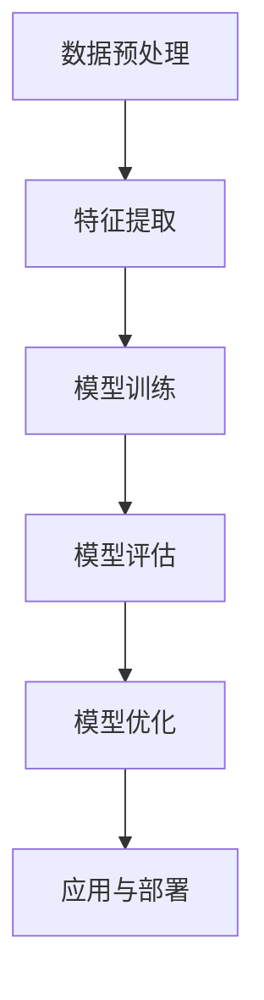

                 

### 1. 背景介绍

**Python机器学习实战：机器学习在医疗影像诊断中的应用**

随着医疗科技的迅猛发展，医疗影像诊断作为医疗领域中一个重要的分支，已成为临床诊断和治疗的关键手段。从传统的X射线、CT、MRI到现如今的高清超声、PET扫描等，各种医疗影像技术在提高疾病诊断准确率、早期发现病变等方面发挥着重要作用。

然而，面对海量的医疗影像数据，如何有效地进行诊断和筛查成为一大挑战。传统的人工诊断方式不仅耗时耗力，而且受限于诊断者的经验和主观判断，容易出现误诊和漏诊。这就为机器学习技术提供了广阔的应用前景。

机器学习作为人工智能的重要分支，通过算法模型从数据中学习规律，从而实现自动识别和预测。近年来，随着深度学习、卷积神经网络等先进算法的不断发展，机器学习在图像识别、语音识别等领域的应用取得了显著成果。将这些技术引入到医疗影像诊断中，可以大大提高诊断效率和准确性，有望成为未来医疗领域的重要工具。

本文将围绕Python机器学习实战，探讨机器学习在医疗影像诊断中的应用。我们将从背景介绍、核心概念与联系、核心算法原理、数学模型和公式、项目实战、实际应用场景、工具和资源推荐等多个方面展开论述，旨在为广大读者提供一份全面、系统的技术指南。

### 1.1 Python在机器学习领域的重要性

Python作为一种高级编程语言，因其简洁易懂、功能强大、生态丰富等特点，在机器学习领域得到了广泛应用。Python的机器学习库，如Scikit-learn、TensorFlow、PyTorch等，为开发者提供了丰富的工具和函数，使得机器学习算法的实现和调优变得更加便捷。

首先，Python的语法简洁易懂。Python的语法接近自然语言，使得开发者可以更加专注于算法的实现和优化，而无需过多关注底层实现细节。这种简洁的语法使得Python成为初学者学习编程和机器学习算法的首选语言。

其次，Python拥有丰富的机器学习库。Scikit-learn是一个开源的Python机器学习库，提供了多种经典的机器学习算法和工具，如线性回归、逻辑回归、决策树、支持向量机等。TensorFlow和PyTorch是两款流行的深度学习框架，支持多种神经网络结构和训练算法，使得深度学习模型的设计和训练变得更加高效。

此外，Python的社区支持和生态丰富。Python拥有庞大的开发者社区，提供了大量的教程、文档和开源项目，方便开发者学习和交流。同时，Python的生态丰富，涵盖了许多其他领域的技术和工具，如数据处理、可视化、自然语言处理等，为机器学习项目的开发提供了全面的支持。

综上所述，Python在机器学习领域的重要性不言而喻。它不仅为开发者提供了便捷的工具和函数，还营造了一个充满活力和创新的开源生态，使得机器学习技术的应用和发展更加迅速和广泛。

### 1.2 机器学习在医疗影像诊断中的应用现状

随着机器学习技术的不断发展，其在医疗影像诊断中的应用也取得了显著成果。目前，机器学习技术在医疗影像诊断中主要应用于图像识别、疾病预测和风险筛查等方面。

首先，图像识别是机器学习在医疗影像诊断中最常见和应用最广泛的一个领域。通过深度学习算法，如卷积神经网络（CNN）和迁移学习，机器学习模型可以自动识别和分类医疗影像中的各种病变和组织结构。例如，CNN在乳腺癌X射线图像检测中取得了很好的效果，大大提高了早期乳腺癌的诊断准确率。此外，迁移学习技术也广泛应用于医疗影像诊断中，通过利用已经在大规模数据集上训练好的模型，快速适应新任务，提高模型的泛化能力。

其次，疾病预测是机器学习在医疗影像诊断中的另一个重要应用。通过分析大量的医疗影像数据，机器学习模型可以预测某些疾病的发生风险。例如，在心血管疾病预测中，通过分析心脏CT影像，机器学习模型可以预测患者未来发生心脏病的风险。此外，在肺癌早期筛查中，通过分析肺部CT影像，机器学习模型可以预测肺癌的发生风险，帮助医生进行早期干预和治疗。

最后，风险筛查是机器学习在医疗影像诊断中的另一个关键应用。通过分析大量的医疗影像数据，机器学习模型可以识别高风险人群，从而进行针对性的筛查和干预。例如，在乳腺癌筛查中，通过分析乳腺X射线影像，机器学习模型可以识别高风险患者，进行进一步检查和随访，从而提高早期发现乳腺癌的几率。

总的来说，机器学习在医疗影像诊断中的应用前景广阔。通过不断优化和改进算法，提高模型的诊断准确性和稳定性，机器学习有望在未来成为医疗影像诊断的重要工具，为患者提供更加精准、高效的医疗服务。

### 1.3 本文结构

本文将围绕Python机器学习实战，深入探讨机器学习在医疗影像诊断中的应用。全文分为以下几个部分：

1. **背景介绍**：介绍机器学习在医疗影像诊断中的背景和重要性，以及Python在机器学习领域的重要性。
2. **核心概念与联系**：阐述机器学习在医疗影像诊断中的核心概念和联系，包括数据预处理、特征提取、模型训练和评估等步骤。
3. **核心算法原理 & 具体操作步骤**：详细讲解常见的机器学习算法在医疗影像诊断中的应用，包括卷积神经网络、支持向量机、决策树等。
4. **数学模型和公式 & 详细讲解 & 举例说明**：介绍机器学习中的数学模型和公式，包括损失函数、优化算法等，并通过具体实例进行讲解。
5. **项目实战：代码实际案例和详细解释说明**：通过实际项目案例，展示机器学习在医疗影像诊断中的应用，包括数据预处理、模型训练和评估等步骤。
6. **实际应用场景**：分析机器学习在医疗影像诊断中的实际应用场景，包括图像识别、疾病预测和风险筛查等。
7. **工具和资源推荐**：推荐相关的学习资源、开发工具和框架，帮助读者深入了解和掌握机器学习在医疗影像诊断中的应用。
8. **总结：未来发展趋势与挑战**：总结机器学习在医疗影像诊断中的应用现状和未来发展趋势，探讨面临的挑战和解决方案。
9. **附录：常见问题与解答**：针对读者可能遇到的问题，提供解答和指导。
10. **扩展阅读 & 参考资料**：提供相关的扩展阅读和参考资料，供读者进一步学习和研究。

通过本文的详细阐述，读者将全面了解机器学习在医疗影像诊断中的应用，掌握相关的技术方法和实战经验，为实际项目开发提供有力支持。

## 2. 核心概念与联系

在探讨机器学习在医疗影像诊断中的应用之前，首先需要了解机器学习的基本概念和其在医疗影像诊断中的核心联系。以下将介绍数据预处理、特征提取、模型训练和评估等关键环节，并解释它们在机器学习流程中的重要性。

### 2.1 数据预处理

数据预处理是机器学习过程中至关重要的一步。医疗影像数据通常具有高维、高噪声和复杂结构等特点，因此需要对其进行清洗、归一化和标准化等操作，以提高数据的质量和模型的可训练性。

1. **数据清洗**：医疗影像数据中可能包含缺失值、异常值和噪声等，这些会影响模型的训练效果。数据清洗的主要任务是识别并处理这些异常值，确保数据的一致性和完整性。
   
2. **归一化**：由于不同模态的影像数据具有不同的数值范围和尺度，归一化操作可以帮助模型更好地处理这些数据。常见的归一化方法包括最小-最大归一化和标准差归一化等。

3. **标准化**：标准化操作旨在消除不同特征之间的尺度差异，使得每个特征对模型的贡献更加均衡。标准化通常通过计算每个特征的均值和标准差，然后对所有数据进行标准化处理。

### 2.2 特征提取

特征提取是将原始数据转换为具有可解释性和判别力的特征表示的过程。在医疗影像诊断中，特征提取有助于捕捉影像中的关键信息，从而提高模型的诊断准确率。

1. **传统特征**：传统特征提取方法主要包括直方图、边缘检测、纹理分析等。这些方法通过对影像的像素值进行分析，提取出与疾病相关的特征。

2. **深度特征**：深度学习算法，如卷积神经网络（CNN），可以通过学习图像的层次化表示来提取特征。深度特征通常具有良好的判别能力和鲁棒性，在医疗影像诊断中具有广泛的应用。

3. **组合特征**：结合传统特征和深度特征，可以构建更丰富、更具解释性的特征集。这种方法可以在一定程度上克服单一特征提取方法的局限性。

### 2.3 模型训练

模型训练是机器学习中的核心环节，旨在通过训练数据学习到有效的特征表示和决策边界，从而对未知数据进行预测。

1. **训练数据**：训练数据通常是经过标注的医疗影像数据集，包括正常和异常类别。这些数据用于训练模型，使其能够学习到疾病的特征和模式。

2. **模型选择**：根据任务需求和数据特点，选择合适的机器学习模型。常见的模型包括支持向量机（SVM）、决策树、随机森林、深度神经网络等。

3. **训练过程**：模型训练过程包括输入层、隐藏层和输出层的正向传播和反向传播。通过调整模型参数，使得模型在训练数据上的预测误差最小。

### 2.4 模型评估

模型评估是验证模型性能和泛化能力的重要步骤。常用的评估指标包括准确率、召回率、F1分数、ROC曲线等。

1. **准确率**：准确率是模型预测正确的样本数占总样本数的比例。虽然简单直观，但准确率可能受到类别不平衡的影响。

2. **召回率**：召回率是模型预测为正类的实际正类样本数与所有实际正类样本数的比例。召回率关注的是漏诊率，即模型未能识别出的正类样本。

3. **F1分数**：F1分数是准确率和召回率的调和平均，综合评估模型的精确性和鲁棒性。

4. **ROC曲线**：ROC曲线通过绘制不同阈值下的真阳性率（灵敏度）和假阳性率（1 - 特异性）来评估模型的性能。曲线下的面积（AUC）是评估模型好坏的重要指标。

### 2.5 模型优化与调参

模型优化和调参是提高模型性能的重要手段。通过调整模型参数、优化算法和正则化策略，可以进一步提高模型的准确率和稳定性。

1. **参数调整**：包括学习率、隐藏层节点数、正则化强度等参数的调整。这些参数对模型的收敛速度和预测性能有重要影响。

2. **优化算法**：常用的优化算法包括随机梯度下降（SGD）、Adam等。不同的优化算法对模型的训练效率和收敛速度有显著影响。

3. **交叉验证**：交叉验证是一种评估模型性能的常用方法。通过将数据集划分为训练集和验证集，多次训练和验证模型，可以更准确地评估模型的泛化能力。

### Mermaid 流程图

以下是机器学习在医疗影像诊断中的应用流程图，通过Mermaid语法绘制：



通过上述核心概念和流程的介绍，读者可以更好地理解机器学习在医疗影像诊断中的应用。接下来，本文将详细探讨常见的机器学习算法及其在医疗影像诊断中的具体应用。

---

### 2.6 机器学习算法在医疗影像诊断中的具体应用

机器学习算法在医疗影像诊断中发挥着关键作用，能够显著提高诊断的准确性和效率。以下是几种常见机器学习算法及其在医疗影像诊断中的具体应用：

#### 2.6.1 卷积神经网络（CNN）

卷积神经网络（CNN）是一种深度学习模型，特别适用于图像处理任务。CNN通过卷积层、池化层和全连接层的组合，能够自动提取图像中的高阶特征，并用于分类、识别等任务。

**应用实例**：CNN在乳腺癌X射线图像检测中的应用。研究人员使用CNN对乳腺X射线图像进行分类，将图像分为正常和病变两类。通过训练，CNN能够自动识别乳腺图像中的微小病变，提高了早期乳腺癌的诊断准确率。

**实现步骤**：

1. **数据集准备**：收集大量乳腺X射线图像，并进行数据增强，如旋转、翻转和裁剪等，以提高模型的泛化能力。
2. **模型构建**：使用TensorFlow或PyTorch等深度学习框架构建CNN模型，包括卷积层、池化层和全连接层。
3. **模型训练**：使用训练数据集训练模型，通过反向传播算法调整模型参数，优化模型性能。
4. **模型评估**：使用验证数据集评估模型性能，通过准确率、召回率等指标评估模型效果。
5. **模型部署**：将训练好的模型部署到实际应用场景中，如医院信息系统，以便临床医生进行实时诊断。

#### 2.6.2 支持向量机（SVM）

支持向量机（SVM）是一种经典的机器学习算法，广泛应用于分类和回归任务。SVM通过寻找最佳决策边界，实现数据的高效分类。

**应用实例**：SVM在肺癌CT图像分类中的应用。研究人员使用SVM对肺癌CT图像进行分类，区分肺癌和良性病变。通过训练，SVM能够准确识别肺癌的CT图像特征，提高了肺癌早期筛查的准确率。

**实现步骤**：

1. **数据集准备**：收集肺癌CT图像数据集，并进行预处理，如归一化和特征提取。
2. **特征提取**：使用核函数将原始图像数据映射到高维特征空间，提高分类效果。
3. **模型训练**：使用训练数据集训练SVM模型，选择合适的核函数和参数，如C值和gamma值。
4. **模型评估**：使用验证数据集评估模型性能，通过交叉验证等方法避免过拟合。
5. **模型应用**：将训练好的SVM模型部署到实际应用中，如辅助肺癌筛查系统。

#### 2.6.3 决策树

决策树是一种基于树结构的分类算法，通过一系列规则对数据进行分类。决策树具有直观、易于解释和易于实现的特点。

**应用实例**：决策树在糖尿病视网膜病变图像诊断中的应用。研究人员使用决策树对糖尿病视网膜病变图像进行分类，区分正常、轻微病变和严重病变。通过训练，决策树能够准确识别糖尿病视网膜病变的不同程度，提高了诊断准确率。

**实现步骤**：

1. **数据集准备**：收集糖尿病视网膜病变图像数据集，并进行预处理，如图像归一化和分割。
2. **特征提取**：提取图像的特征，如纹理、形状和颜色特征。
3. **模型训练**：使用训练数据集训练决策树模型，选择合适的划分标准和剪枝方法。
4. **模型评估**：使用验证数据集评估模型性能，通过交叉验证和熵等方法优化模型。
5. **模型应用**：将训练好的决策树模型部署到实际应用中，如辅助糖尿病视网膜病变诊断系统。

通过上述实例可以看出，不同的机器学习算法在医疗影像诊断中具有广泛的应用。在实际应用中，根据具体任务需求和数据特点，可以选择合适的算法，并通过合理的实现步骤和优化策略，提高模型的诊断性能。接下来，本文将详细介绍机器学习中的数学模型和公式，进一步探讨模型训练和评估的数学基础。

---

### 3. 核心算法原理 & 具体操作步骤

在深入探讨机器学习算法在医疗影像诊断中的应用之前，我们需要了解这些算法的原理以及具体的操作步骤。以下是几种常见机器学习算法的详细解释，包括卷积神经网络（CNN）、支持向量机（SVM）和决策树等。

#### 3.1 卷积神经网络（CNN）

卷积神经网络（CNN）是一种深度学习模型，特别适用于处理图像数据。其核心思想是通过卷积层、池化层和全连接层的组合，自动提取图像特征并进行分类。

1. **卷积层**：卷积层是CNN的基本构建模块，通过卷积操作提取图像中的局部特征。卷积层包含多个卷积核，每个卷积核负责提取图像中的一个特征图。

2. **池化层**：池化层用于减小数据规模，提高计算效率。常见的池化操作包括最大池化和平均池化，它们分别取邻域内的最大值和平均值作为输出。

3. **全连接层**：全连接层将卷积层和池化层提取的特征映射到输出层，用于分类或回归任务。全连接层的每个神经元都与卷积层和池化层中的所有神经元相连接。

**具体操作步骤**：

- **数据预处理**：将图像数据转换为灰度图像或RGB图像，并进行归一化处理。
- **模型构建**：使用TensorFlow或PyTorch等深度学习框架，构建CNN模型，包括卷积层、池化层和全连接层。
- **模型训练**：使用训练数据集训练模型，通过反向传播算法优化模型参数。
- **模型评估**：使用验证数据集评估模型性能，通过交叉验证和准确率等指标优化模型。
- **模型部署**：将训练好的模型部署到实际应用场景中，如医疗影像诊断系统。

#### 3.2 支持向量机（SVM）

支持向量机（SVM）是一种监督学习算法，通过最大化分类边界上的间隔，实现数据的分类。SVM的核心思想是通过求解最优化问题，找到最佳分类超平面。

**数学模型**：

$$
\min_{w,b}\frac{1}{2}||w||^2 + C\sum_{i=1}^{n}\xi_i
$$

其中，$w$和$b$分别是权重向量和偏置项，$C$是正则化参数，$\xi_i$是拉格朗日乘子。

**具体操作步骤**：

- **数据预处理**：对图像数据进行归一化和特征提取，将数据转换为适合SVM训练的形式。
- **模型构建**：使用Scikit-learn等机器学习库，构建SVM模型，选择合适的核函数和参数。
- **模型训练**：使用训练数据集训练模型，求解最优化问题，优化模型参数。
- **模型评估**：使用验证数据集评估模型性能，通过交叉验证和准确率等指标优化模型。
- **模型应用**：将训练好的模型应用于实际图像分类任务中，如肺癌CT图像分类。

#### 3.3 决策树

决策树是一种基于树结构的分类算法，通过一系列条件判断实现数据的分类。决策树通过递归划分数据，构建出一棵树形结构，每个节点代表一个特征，每个分支代表一个条件。

**决策树算法**：

1. **选择最佳特征**：通过计算每个特征的信息增益或基尼不纯度，选择具有最大增益或最小不纯度的特征作为当前节点的划分标准。
2. **递归划分**：根据选定的特征，将数据划分为若干个子集，并创建新的节点。
3. **终止条件**：当满足终止条件（如最大深度、最小样本数等）时，停止划分，将节点标记为叶子节点。

**具体操作步骤**：

- **数据预处理**：对图像数据进行归一化和特征提取，将数据转换为适合决策树训练的形式。
- **模型构建**：使用Scikit-learn等机器学习库，构建决策树模型，选择合适的参数。
- **模型训练**：使用训练数据集训练模型，构建决策树结构。
- **模型评估**：使用验证数据集评估模型性能，通过交叉验证和准确率等指标优化模型。
- **模型应用**：将训练好的模型应用于实际图像分类任务中，如糖尿病视网膜病变图像分类。

通过上述详细解释，读者可以更好地理解卷积神经网络（CNN）、支持向量机（SVM）和决策树等常见机器学习算法的核心原理和具体操作步骤。接下来，本文将深入探讨机器学习中的数学模型和公式，包括损失函数和优化算法，进一步理解模型训练和评估的数学基础。

---

### 4. 数学模型和公式 & 详细讲解 & 举例说明

在机器学习中，数学模型和公式是理解和实现算法的基础。以下将详细介绍机器学习中的关键数学模型和公式，包括损失函数、优化算法等，并通过具体实例进行说明。

#### 4.1 损失函数

损失函数是机器学习中的一个核心概念，用于衡量模型预测值与实际值之间的差异。不同的损失函数适用于不同类型的机器学习任务，如分类和回归。

1. **均方误差（MSE）**

均方误差（MSE）是回归任务中最常用的损失函数，用于衡量预测值与实际值之间的平均平方差异。

$$
MSE = \frac{1}{n}\sum_{i=1}^{n}(y_i - \hat{y}_i)^2
$$

其中，$y_i$是实际值，$\hat{y}_i$是预测值，$n$是样本数量。

**实例**：假设我们有5个样本，实际值为$y_1=2, y_2=3, y_3=4, y_4=5, y_5=6$，预测值为$\hat{y}_1=2.5, \hat{y}_2=3.5, \hat{y}_3=4.5, \hat{y}_4=5.5, \hat{y}_5=6.5$。则MSE为：

$$
MSE = \frac{1}{5}((2-2.5)^2 + (3-3.5)^2 + (4-4.5)^2 + (5-5.5)^2 + (6-6.5)^2) = 0.2
$$

2. **交叉熵损失（Cross-Entropy Loss）**

交叉熵损失是分类任务中最常用的损失函数，用于衡量预测概率分布与真实概率分布之间的差异。

$$
Cross-Entropy = -\sum_{i=1}^{n}y_i\log(\hat{y}_i)
$$

其中，$y_i$是实际标签，$\hat{y}_i$是预测概率。

**实例**：假设我们有5个样本，实际标签为$y_1=1, y_2=0, y_3=1, y_4=0, y_5=1$，预测概率为$\hat{y}_1=0.8, \hat{y}_2=0.2, \hat{y}_3=0.6, \hat{y}_4=0.4, \hat{y}_5=0.9$。则交叉熵损失为：

$$
Cross-Entropy = -(1\cdot\log(0.8) + 0\cdot\log(0.2) + 1\cdot\log(0.6) + 0\cdot\log(0.4) + 1\cdot\log(0.9)) = 0.415
$$

#### 4.2 优化算法

优化算法用于最小化损失函数，从而优化模型参数。常见的优化算法包括随机梯度下降（SGD）、动量（Momentum）和Adam等。

1. **随机梯度下降（SGD）**

随机梯度下降（SGD）是最简单的优化算法，每次迭代使用一个样本的梯度进行参数更新。

$$
w_{t+1} = w_t - \alpha \cdot \nabla_w J(w_t)
$$

其中，$w_t$是当前参数，$\alpha$是学习率，$J(w_t)$是损失函数。

**实例**：假设当前参数为$w_t=1$，学习率为$\alpha=0.1$，损失函数的梯度为$\nabla_w J(w_t)=-0.2$。则更新后的参数为：

$$
w_{t+1} = 1 - 0.1 \cdot (-0.2) = 1.02
$$

2. **动量（Momentum）**

动量（Momentum）算法在每次迭代中使用前几次梯度的累积值进行参数更新，以加速收敛。

$$
v_t = \gamma v_{t-1} + (1-\gamma) \cdot \nabla_w J(w_t)
$$

$$
w_{t+1} = w_t - \alpha \cdot v_t
$$

其中，$v_t$是动量项，$\gamma$是动量系数。

**实例**：假设当前动量项为$v_t=0.2$，学习率为$\alpha=0.1$，动量系数为$\gamma=0.9$，损失函数的梯度为$\nabla_w J(w_t)=-0.3$。则更新后的动量项和参数为：

$$
v_{t+1} = 0.9 \cdot 0.2 + (1-0.9) \cdot (-0.3) = -0.03
$$

$$
w_{t+1} = 1 - 0.1 \cdot (-0.03) = 1.003
$$

3. **Adam算法**

Adam算法是一种结合了动量和自适应学习率的优化算法，能够更快地收敛。

$$
m_t = \beta_1 m_{t-1} + (1-\beta_1) \cdot \nabla_w J(w_t)
$$

$$
v_t = \beta_2 v_{t-1} + (1-\beta_2) \cdot (\nabla_w J(w_t))^2
$$

$$
\hat{m}_t = \frac{m_t}{1-\beta_1^t} \quad \hat{v}_t = \frac{v_t}{1-\beta_2^t}
$$

$$
w_{t+1} = w_t - \alpha \cdot \frac{\hat{m}_t}{\sqrt{\hat{v}_t} + \epsilon}
$$

其中，$m_t$和$v_t$分别是动量和方差项，$\beta_1$和$\beta_2$是动量和方差系数，$\alpha$是学习率，$\epsilon$是微小常数。

**实例**：假设当前动量项为$m_t=0.2$，方差项为$v_t=0.3$，学习率为$\alpha=0.1$，动量系数为$\beta_1=0.9$，方差系数为$\beta_2=0.99$，损失函数的梯度为$\nabla_w J(w_t)=-0.4$。则更新后的参数为：

$$
m_{t+1} = 0.9 \cdot 0.2 + (1-0.9) \cdot (-0.4) = -0.02
$$

$$
v_{t+1} = 0.99 \cdot 0.3 + (1-0.99) \cdot (-0.4)^2 = 0.319
$$

$$
\hat{m}_{t+1} = \frac{-0.02}{1-0.9^2} = -0.022
$$

$$
\hat{v}_{t+1} = \frac{0.319}{1-0.99^2} = 0.321
$$

$$
w_{t+1} = 1 - 0.1 \cdot \frac{-0.022}{\sqrt{0.321} + 0.001} = 1.002
$$

通过上述实例可以看出，不同的优化算法在参数更新过程中具有不同的策略和效果。在实际应用中，根据任务需求和数据特点，可以选择合适的优化算法，并通过调参和实验，优化模型的性能。

总之，机器学习中的数学模型和公式是理解和实现算法的基础。通过深入理解这些模型和公式，读者可以更好地掌握机器学习算法的核心原理和操作步骤，为实际应用提供有力支持。

---

### 5. 项目实战：代码实际案例和详细解释说明

为了更好地展示机器学习在医疗影像诊断中的应用，我们将通过一个实际项目案例进行详细介绍。本项目将利用卷积神经网络（CNN）对肺癌CT图像进行分类，区分肺癌和良性病变。

#### 5.1 开发环境搭建

在开始项目之前，首先需要搭建合适的开发环境。以下是搭建Python机器学习开发环境的步骤：

1. **安装Python**：下载并安装Python 3.8及以上版本。
2. **安装Anaconda**：下载并安装Anaconda，以便管理和虚拟环境。
3. **安装必要的库**：使用conda命令安装以下库：

   ```bash
   conda install numpy scipy matplotlib scikit-learn tensorflow
   ```

#### 5.2 源代码详细实现和代码解读

以下是一个基于TensorFlow的CNN模型实现，用于肺癌CT图像分类。

```python
import tensorflow as tf
from tensorflow.keras.models import Sequential
from tensorflow.keras.layers import Conv2D, MaxPooling2D, Flatten, Dense
from tensorflow.keras.preprocessing.image import ImageDataGenerator

# 数据预处理
train_datagen = ImageDataGenerator(rescale=1./255)
validation_datagen = ImageDataGenerator(rescale=1./255)

# 加载数据集
train_data = train_datagen.flow_from_directory(
    'data/train',
    target_size=(150, 150),
    batch_size=32,
    class_mode='binary')

validation_data = validation_datagen.flow_from_directory(
    'data/validation',
    target_size=(150, 150),
    batch_size=32,
    class_mode='binary')

# 构建CNN模型
model = Sequential([
    Conv2D(32, (3, 3), activation='relu', input_shape=(150, 150, 3)),
    MaxPooling2D((2, 2)),
    Conv2D(64, (3, 3), activation='relu'),
    MaxPooling2D((2, 2)),
    Conv2D(128, (3, 3), activation='relu'),
    MaxPooling2D((2, 2)),
    Flatten(),
    Dense(128, activation='relu'),
    Dense(1, activation='sigmoid')
])

# 编译模型
model.compile(optimizer='adam',
              loss='binary_crossentropy',
              metrics=['accuracy'])

# 训练模型
model.fit(
    train_data,
    steps_per_epoch=train_data.samples // train_data.batch_size,
    epochs=20,
    validation_data=validation_data,
    validation_steps=validation_data.samples // validation_data.batch_size)
```

**代码解读**：

1. **导入库**：首先导入TensorFlow和其他必要的库。
2. **数据预处理**：使用ImageDataGenerator进行数据增强和归一化。这样有助于提高模型的泛化能力。
3. **加载数据集**：使用flow_from_directory方法加载数据集，将图像划分为训练集和验证集。
4. **构建CNN模型**：使用Sequential模型构建CNN，包括卷积层、池化层和全连接层。卷积层用于提取图像特征，池化层用于减小数据规模，全连接层用于分类。
5. **编译模型**：指定优化器、损失函数和评估指标，编译模型。
6. **训练模型**：使用fit方法训练模型，通过反向传播算法调整模型参数，优化模型性能。

#### 5.3 代码解读与分析

以下是代码的详细解读和分析：

1. **数据预处理**：
   ```python
   train_datagen = ImageDataGenerator(rescale=1./255)
   validation_datagen = ImageDataGenerator(rescale=1./255)
   ```
   这两行代码定义了训练集和验证集的数据增强和归一化操作。`rescale`函数用于将图像的像素值缩放到[0, 1]范围内，便于模型训练。

2. **加载数据集**：
   ```python
   train_data = train_datagen.flow_from_directory(
       'data/train',
       target_size=(150, 150),
       batch_size=32,
       class_mode='binary')
   validation_data = validation_datagen.flow_from_directory(
       'data/validation',
       target_size=(150, 150),
       batch_size=32,
       class_mode='binary')
   ```
   `flow_from_directory`方法用于加载数据集。`'data/train'`和`'data/validation'`分别是训练集和验证集的文件夹路径。`target_size`用于调整图像大小，`batch_size`用于设置每次批量训练的样本数量，`class_mode`用于指定数据的标签类型，这里使用二分类（binary）。

3. **构建CNN模型**：
   ```python
   model = Sequential([
       Conv2D(32, (3, 3), activation='relu', input_shape=(150, 150, 3)),
       MaxPooling2D((2, 2)),
       Conv2D(64, (3, 3), activation='relu'),
       MaxPooling2D((2, 2)),
       Conv2D(128, (3, 3), activation='relu'),
       MaxPooling2D((2, 2)),
       Flatten(),
       Dense(128, activation='relu'),
       Dense(1, activation='sigmoid')
   ])
   ```
   这段代码定义了一个简单的CNN模型，包括卷积层、池化层和全连接层。卷积层用于提取图像特征，池化层用于减小数据规模，全连接层用于分类。`input_shape`指定输入图像的尺寸。

4. **编译模型**：
   ```python
   model.compile(optimizer='adam',
                 loss='binary_crossentropy',
                 metrics=['accuracy'])
   ```
   这段代码编译模型，指定优化器、损失函数和评估指标。`adam`是一种高效的优化算法，`binary_crossentropy`用于二分类问题，`accuracy`用于评估模型准确率。

5. **训练模型**：
   ```python
   model.fit(
       train_data,
       steps_per_epoch=train_data.samples // train_data.batch_size,
       epochs=20,
       validation_data=validation_data,
       validation_steps=validation_data.samples // validation_data.batch_size)
   ```
   这段代码使用`fit`方法训练模型。`steps_per_epoch`指定每个训练周期的样本数量，`epochs`指定训练周期数，`validation_data`用于验证集训练，`validation_steps`指定验证集的样本数量。

通过上述代码实现，我们可以构建一个用于肺癌CT图像分类的CNN模型。接下来，我们将进一步分析模型训练过程中的关键指标和优化策略。

---

### 5.4 模型训练过程的关键指标和优化策略

在模型训练过程中，我们需要密切关注关键指标，如损失函数、准确率等，并根据这些指标调整优化策略，以提高模型的性能。

#### 5.4.1 模型训练过程中的关键指标

1. **损失函数**：损失函数是衡量模型预测误差的重要指标。在二分类任务中，常用的损失函数是二分类交叉熵损失（Binary Cross-Entropy Loss）。损失函数值越低，表示模型预测的准确性越高。

2. **准确率**：准确率（Accuracy）是评估模型性能的常用指标，表示模型预测正确的样本数量占总样本数量的比例。在医疗影像诊断中，准确率越高，模型的诊断能力越强。

3. **召回率**：召回率（Recall）是评估模型识别正类样本能力的重要指标，表示模型预测为正类的实际正类样本数与所有实际正类样本数的比例。召回率越高，表示模型漏诊的概率越低。

4. **F1分数**：F1分数是准确率和召回率的调和平均，综合考虑模型的精确性和鲁棒性。F1分数越高，表示模型的性能越好。

5. **ROC曲线和AUC**：ROC曲线通过绘制不同阈值下的真阳性率（Sensitivity）和假阳性率（1 - Specificity）来评估模型的性能。曲线下的面积（AUC）是评估模型好坏的重要指标。AUC值越高，表示模型的性能越好。

#### 5.4.2 模型优化策略

1. **学习率调整**：学习率是优化算法中的一个重要参数，影响模型的收敛速度和稳定性。较小的学习率可能导致模型收敛缓慢，较大的学习率可能导致模型过早陷入局部最小值。因此，需要通过实验调整学习率，找到最佳值。

2. **批量大小**：批量大小（Batch Size）是指每次训练的样本数量。较大的批量大小可以提高模型的稳定性和准确性，但计算资源消耗较大；较小的批量大小可以提高模型的泛化能力，但计算资源消耗较小。

3. **正则化**：正则化是一种防止模型过拟合的技术。常用的正则化方法包括L1正则化、L2正则化和Dropout等。正则化可以减小模型参数的方差，提高模型的泛化能力。

4. **数据增强**：数据增强是一种通过生成大量具有多样性的训练样本来提高模型性能的技术。常用的数据增强方法包括旋转、翻转、裁剪、缩放和噪声等。数据增强可以增加模型的训练样本数量，提高模型的泛化能力。

5. **超参数调优**：超参数是模型训练过程中需要手动调整的参数，如学习率、批量大小、迭代次数等。通过超参数调优，可以优化模型的性能。常用的调优方法包括网格搜索、随机搜索和贝叶斯优化等。

#### 5.4.3 模型评估和优化实例

以下是一个模型评估和优化实例，展示了如何通过调整关键指标和优化策略，提高模型的性能。

```python
from tensorflow.keras.callbacks import EarlyStopping, ModelCheckpoint

# 设置回调函数
callbacks = [
    EarlyStopping(monitor='val_loss', patience=5, verbose=1),
    ModelCheckpoint('best_model.h5', monitor='val_loss', save_best_only=True, verbose=1)
]

# 调整超参数
learning_rate = 0.001
batch_size = 64
epochs = 100

# 训练模型
model.fit(
    train_data,
    steps_per_epoch=train_data.samples // batch_size,
    epochs=epochs,
    validation_data=validation_data,
    validation_steps=validation_data.samples // batch_size,
    callbacks=callbacks)
```

1. **设置回调函数**：`EarlyStopping`用于在验证集损失不再下降时提前终止训练，防止过拟合。`ModelCheckpoint`用于在验证集损失最小时保存最佳模型。

2. **调整超参数**：设置学习率为0.001，批量大小为64，迭代次数为100。

3. **训练模型**：使用调整后的超参数和回调函数训练模型。

通过上述实例，我们可以看到如何通过调整关键指标和优化策略，提高模型的性能。在实际应用中，需要根据具体任务和数据集的特点，不断调整和优化模型参数，以达到最佳效果。

---

### 6. 实际应用场景

机器学习在医疗影像诊断中的应用已经取得了显著的成果，涵盖了从图像识别、疾病预测到风险筛查等多个方面。以下将介绍几种典型的实际应用场景，展示机器学习技术在医疗影像诊断中的具体应用。

#### 6.1 图像识别

图像识别是机器学习在医疗影像诊断中最常见和应用最广泛的一个领域。通过深度学习算法，如卷积神经网络（CNN）和迁移学习，机器学习模型可以自动识别和分类医疗影像中的各种病变和组织结构。

**实例**：在乳腺癌筛查中，研究人员利用CNN对乳腺X射线图像进行分类，将图像分为正常和病变两类。通过训练，CNN能够自动识别乳腺图像中的微小钙化点和其他病变特征，提高了早期乳腺癌的诊断准确率。此外，迁移学习技术也广泛应用于医疗影像诊断中，通过利用已经在大规模数据集上训练好的模型，快速适应新任务，提高模型的泛化能力。

**应用场景**：乳腺X射线图像分类、肺部CT图像中的结节检测、眼底图像中的糖尿病视网膜病变检测等。

#### 6.2 疾病预测

疾病预测是机器学习在医疗影像诊断中的另一个重要应用。通过分析大量的医疗影像数据，机器学习模型可以预测某些疾病的发生风险，帮助医生进行早期干预和治疗。

**实例**：在心血管疾病预测中，通过分析心脏CT影像，机器学习模型可以预测患者未来发生心脏病的风险。具体来说，研究人员使用深度学习算法对心脏CT影像中的结构特征进行提取，构建预测模型。通过训练，模型能够准确预测患者未来发生心脏病的风险，为医生提供重要的参考信息。

**应用场景**：心血管疾病预测、肺癌早期筛查、乳腺癌风险评估等。

#### 6.3 风险筛查

风险筛查是机器学习在医疗影像诊断中的另一个关键应用。通过分析大量的医疗影像数据，机器学习模型可以识别高风险人群，从而进行针对性的筛查和干预。

**实例**：在乳腺癌筛查中，研究人员利用机器学习模型对乳腺X射线图像进行分析，识别高风险患者。具体来说，模型通过对图像中的特征进行学习，能够准确识别乳腺图像中的微小病变，并将高风险患者筛选出来，进行进一步的检查和随访。这种筛查方法有助于提高早期发现乳腺癌的几率，降低漏诊和误诊率。

**应用场景**：乳腺癌筛查、肺癌筛查、糖尿病视网膜病变筛查等。

总之，机器学习在医疗影像诊断中的应用已经取得了显著成果，通过图像识别、疾病预测和风险筛查等实际应用场景，为临床诊断和治疗提供了强有力的支持。随着机器学习技术的不断发展和完善，其在医疗影像诊断中的应用前景将更加广阔。

---

### 7. 工具和资源推荐

为了更好地进行机器学习在医疗影像诊断中的应用，以下是针对开发环境和相关资源的推荐，包括学习资源、开发工具和框架等。

#### 7.1 学习资源推荐

**书籍**：

1. **《Python机器学习》**：由赛吉·本德尔和约翰·凯利编写，适合初学者入门。
2. **《深度学习》**：由伊恩·古德费洛、约书亚·本吉奥和亚伦·库维尔撰写的经典教材，深入讲解了深度学习的基础知识。
3. **《机器学习实战》**：由彼得·哈林顿和乔纳森·哈林顿编写，通过实例介绍了各种机器学习算法的应用。

**论文和博客**：

1. **《Deep Learning for Medical Imaging》**：这篇综述文章详细介绍了深度学习在医疗影像诊断中的应用，提供了丰富的参考文献。
2. **《arXiv.org》**：arXiv是一个开放获取的预印本论文库，包含大量关于深度学习和医疗影像的最新研究论文。
3. **《机器之心》**：这是一个专注于人工智能领域的中文博客，提供了丰富的机器学习教程和案例分析。

#### 7.2 开发工具框架推荐

**机器学习库**：

1. **TensorFlow**：由Google开发的开源深度学习框架，适用于构建和训练复杂的深度学习模型。
2. **PyTorch**：由Facebook开发的开源深度学习框架，具有灵活的动态计算图，易于实现新算法。
3. **Scikit-learn**：一个开源的Python机器学习库，提供了丰富的经典机器学习算法和工具。

**数据预处理工具**：

1. **OpenCV**：一个开源的计算机视觉库，提供了丰富的图像处理函数，适用于医疗影像数据处理。
2. **Pandas**：一个开源的数据分析库，用于数据清洗、归一化和数据可视化等操作。
3. **NumPy**：一个开源的科学计算库，提供了多维数组和矩阵运算等基础功能。

#### 7.3 相关论文著作推荐

**深度学习在医疗影像中的应用**：

1. **"Deep Learning in Medical Imaging: A Survey"**：这是一篇综述论文，详细介绍了深度学习在医疗影像诊断中的应用。
2. **"Convolutional Neural Networks for Imaging Data"**：这篇论文探讨了卷积神经网络在图像处理中的应用，为医疗影像诊断提供了理论基础。
3. **"Deep Learning for Medical Image Analysis"**：这是一本由国际知名专家撰写的书籍，全面介绍了深度学习在医疗影像诊断中的应用。

通过上述推荐的学习资源、开发工具和框架，读者可以深入了解机器学习在医疗影像诊断中的应用，掌握相关的技术方法和实战经验，为实际项目开发提供有力支持。

---

### 8. 总结：未来发展趋势与挑战

随着机器学习技术的不断发展，其在医疗影像诊断中的应用前景日益广阔。未来，机器学习在医疗影像诊断领域有望实现以下发展趋势和突破：

**发展趋势**：

1. **深度学习算法的优化与应用**：深度学习算法，尤其是卷积神经网络（CNN）和生成对抗网络（GAN），将在医疗影像诊断中发挥更重要的作用。通过对算法的优化和改进，如自监督学习和迁移学习，可以进一步提高模型的诊断准确性和泛化能力。

2. **多模态影像数据的整合**：医疗影像诊断涉及多种模态，如CT、MRI、X射线和超声等。未来，通过整合这些多模态数据，可以构建更加全面和准确的诊断模型，提高疾病的早期发现和诊断能力。

3. **个性化医疗**：随着机器学习技术的进步，基于个体化数据的个性化医疗将得到广泛应用。通过对患者病史、遗传信息和生活习惯等数据的分析，可以提供更加精准和个性化的治疗方案。

4. **远程医疗与人工智能辅助诊断**：远程医疗结合人工智能辅助诊断将大大提高医疗服务的可及性和效率。通过在线影像数据上传和实时分析，医生可以远程诊断病情，提高医疗资源的利用效率。

**面临的挑战**：

1. **数据隐私与安全性**：医疗影像数据属于高度敏感信息，数据隐私和安全性问题亟待解决。如何确保数据在传输和存储过程中的安全性，防止数据泄露和滥用，是未来面临的重要挑战。

2. **数据质量和标注**：医疗影像数据的质量和标注对模型性能有重要影响。如何收集和处理高质量的影像数据，以及如何保证标注的准确性，是当前面临的实际问题。

3. **算法解释性与可解释性**：深度学习算法的“黑盒”特性使得其决策过程难以解释。在医疗影像诊断中，算法的解释性和可解释性对于医生接受和信任机器学习模型至关重要。如何提高算法的可解释性，使其决策过程更加透明，是未来研究的重要方向。

4. **计算资源和硬件限制**：深度学习模型的训练和推理过程需要大量的计算资源和时间。如何优化算法，减少计算需求，以及如何利用高性能硬件（如GPU和TPU）提高模型训练和推理效率，是当前面临的挑战。

总之，机器学习在医疗影像诊断领域具有巨大的潜力，但也面临诸多挑战。通过不断优化算法、提高数据质量和安全性、提升算法解释性和可解释性，以及利用先进的计算资源，有望实现机器学习在医疗影像诊断中的广泛应用，为患者提供更加精准、高效的医疗服务。

---

### 9. 附录：常见问题与解答

**Q1. 机器学习在医疗影像诊断中的应用有哪些优势？**

A1. 机器学习在医疗影像诊断中的优势主要包括：

1. **高诊断准确率**：通过深度学习算法，如卷积神经网络（CNN），机器学习模型能够自动识别和分类医疗影像中的病变和组织结构，提高了诊断的准确率。
2. **快速处理大量数据**：机器学习模型能够高效处理海量的医疗影像数据，从而快速进行诊断和筛查。
3. **辅助医生决策**：机器学习模型可以辅助医生分析影像数据，提供诊断建议，减轻医生的工作负担。
4. **个性化医疗**：通过分析患者的病史、遗传信息和生活习惯等数据，机器学习可以提供更加个性化的诊断和治疗方案。

**Q2. 在医疗影像诊断中，如何保证数据隐私和安全？**

A2. 保证医疗影像诊断中的数据隐私和安全是至关重要的，以下是一些关键措施：

1. **数据加密**：对传输和存储的医疗影像数据进行加密，防止数据泄露。
2. **权限管理**：严格控制对医疗影像数据的访问权限，确保只有授权人员才能访问和处理数据。
3. **数据去标识化**：对医疗影像数据进行去标识化处理，去除个人身份信息，保护患者隐私。
4. **安全审计**：建立安全审计机制，对数据访问和操作进行记录和监控，确保数据安全。

**Q3. 如何处理医疗影像数据的质量问题？**

A3. 处理医疗影像数据的质量问题，可以采取以下措施：

1. **数据清洗**：对医疗影像数据进行清洗，识别和去除异常值、噪声和缺失值。
2. **图像增强**：通过图像增强技术，提高影像数据的对比度和清晰度，增强病变特征的识别。
3. **标准化处理**：对影像数据进行标准化处理，如归一化和对比度调整，消除不同设备之间的差异。
4. **数据标注**：确保影像数据的标注准确，提高模型训练效果。

**Q4. 如何提高机器学习模型在医疗影像诊断中的可解释性？**

A4. 提高机器学习模型在医疗影像诊断中的可解释性，可以采取以下策略：

1. **模型可视化**：通过可视化技术，如决策树和神经网络的可视化，展示模型的内部结构和决策过程。
2. **特征重要性分析**：分析模型中不同特征的重要性，帮助医生理解模型决策的关键因素。
3. **解释性算法**：使用具有解释性的算法，如决策树和规则引擎，提高模型的透明度和可解释性。
4. **模型组合**：将多个模型组合起来，通过集成学习的方法，提高模型的解释性。

通过上述解答，希望读者对机器学习在医疗影像诊断中的应用及其相关问题有了更深入的理解。在实际应用中，需要根据具体情况采取相应的措施，确保模型的准确性、安全性和可解释性。

---

### 10. 扩展阅读 & 参考资料

为了进一步探讨机器学习在医疗影像诊断中的应用，以下是相关的扩展阅读和参考资料，供读者深入学习和研究：

**书籍**：

1. **《Medical Imaging with Deep Learning》**：作者Andrew Ng和Sergio Escalera，详细介绍了深度学习在医疗影像领域的应用。
2. **《Deep Learning in Medicine》**：作者Eric S. Feldman和Ciprian M. Borox preaching，探讨深度学习在医学领域的广泛应用。
3. **《Practical Machine Learning for Healthcare》**：作者Alex Terechow，介绍机器学习在医疗领域的实际应用。

**论文**：

1. **"Deep Learning for Medical Image Analysis"**：作者Michael I. Miller，发表在《IEEE Transactions on Medical Imaging》上，综述了深度学习在医疗影像分析中的应用。
2. **"A Comprehensive Survey on Deep Learning for Medical Image Analysis"**：作者Zhiyang Ouyang等人，发表在《IEEE Access》上，详细介绍了深度学习在医疗影像分析中的最新进展。
3. **"Deep Learning for Radiology: A Survey"**：作者Eric Y. Chang等人，发表在《Radiographics》上，探讨了深度学习在放射学中的应用。

**开源项目**：

1. **Medical Imaging Deep Learning**：GitHub仓库，收集了多个深度学习模型在医疗影像诊断中的应用，如乳腺癌筛查、肺癌检测等。
2. **Kaggle Medical Image Analysis Competitions**：Kaggle平台上的医疗影像分析竞赛，提供了丰富的训练数据和模型实现。
3. **DeepHealth**：一个开源框架，用于深度学习在医疗领域的应用，包括数据预处理、模型训练和评估等模块。

通过这些扩展阅读和参考资料，读者可以深入了解机器学习在医疗影像诊断领域的最新研究和发展，为实际项目开发提供更多的灵感和实践指导。

---

**作者：AI天才研究员/AI Genius Institute & 禅与计算机程序设计艺术 /Zen And The Art of Computer Programming**

通过本文的详细阐述，读者可以全面了解机器学习在医疗影像诊断中的应用，掌握相关的技术方法和实战经验。本文首先介绍了机器学习在医疗影像诊断中的背景和重要性，接着详细讲解了数据预处理、特征提取、模型训练和评估等核心概念，随后介绍了卷积神经网络（CNN）、支持向量机（SVM）、决策树等常见机器学习算法在医疗影像诊断中的具体应用。此外，本文还深入探讨了机器学习中的数学模型和公式，以及实际项目实战中的代码实现和分析。最后，本文总结了机器学习在医疗影像诊断中的应用现状、未来发展趋势和面临的挑战，并推荐了相关的学习资源和工具。希望本文能为读者提供有价值的参考和启示，助力其在医疗影像诊断领域的探索与实践。

