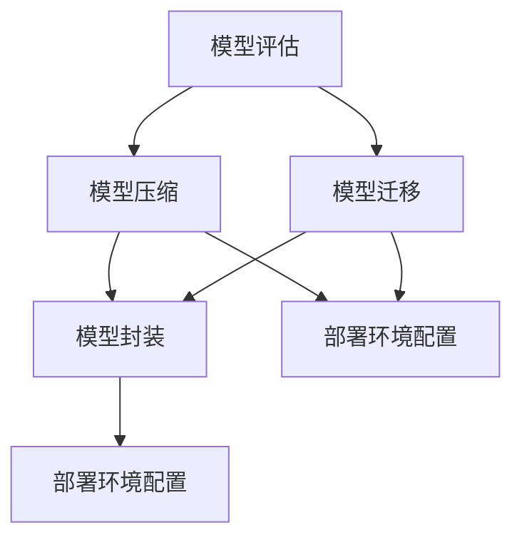

                 

### 背景介绍

在现代信息技术飞速发展的背景下，机器学习作为人工智能的重要分支，已经成为推动各行各业数字化转型和创新的核心驱动力。然而，随着机器学习应用场景的不断扩展和复杂性增加，如何将训练好的机器学习模型有效地部署到生产环境中，并实现规模化运维，成为了一个亟待解决的重要问题。

Python 作为一种功能丰富、易于学习和使用的编程语言，在机器学习领域有着广泛的应用。从数据预处理、模型训练到模型评估和部署，Python 提供了一系列强大的库和框架，如 NumPy、Pandas、Scikit-learn、TensorFlow 和 PyTorch 等。这些工具不仅降低了机器学习开发的门槛，也使得模型的部署和运维变得更加高效和便捷。

本文将围绕 Python 机器学习模型的部署与规模化运维，系统性地介绍相关的核心概念、算法原理、操作步骤、数学模型以及实际应用案例。希望通过本文的介绍，读者能够对机器学习模型的部署与运维有更深入的理解，并在实际项目中能够灵活应用所学知识，提升项目的开发效率和运维质量。

文章的核心内容结构如下：

1. **核心概念与联系**：介绍机器学习模型部署与规模化运维中的核心概念，包括模型评估、模型压缩、模型迁移等，并通过 Mermaid 流程图展示其相互关系。
2. **核心算法原理 & 具体操作步骤**：详细讲解机器学习模型的部署流程，包括模型导出、模型封装、部署环境配置等。
3. **数学模型和公式 & 详细讲解 & 举例说明**：阐述机器学习模型部署过程中的关键数学模型和公式，并通过实例进行说明。
4. **项目实战：代码实际案例和详细解释说明**：通过具体代码实现，展示机器学习模型部署与规模化运维的全过程，并进行详细解读。
5. **实际应用场景**：分析机器学习模型部署与规模化运维在不同领域的应用案例，探讨其在实际项目中的应用价值。
6. **工具和资源推荐**：推荐相关学习资源、开发工具框架以及论文著作，以帮助读者深入学习和实践。
7. **总结：未来发展趋势与挑战**：总结文章的核心观点，并探讨机器学习模型部署与规模化运维的未来发展趋势和挑战。

通过本文的深入探讨，希望能够为读者在机器学习模型的部署与规模化运维方面提供有价值的参考和指导。接下来，我们将逐一介绍每个部分的核心内容，并进行分析和讲解。

#### Core Concepts and Relationships

在机器学习模型的部署与规模化运维过程中，涉及到多个核心概念，这些概念相互关联，构成了一个复杂但有序的流程。以下是对这些核心概念的介绍，以及它们之间的相互关系。

首先是 **模型评估**（Model Evaluation）。模型评估是机器学习项目中的一个关键环节，其目的是通过评估指标（如准确率、召回率、F1 值等）来衡量模型在特定任务上的表现。评估指标的选择和计算对于后续的模型优化和部署至关重要。

接下来是 **模型压缩**（Model Compression）。随着模型规模的扩大，模型在部署时可能会面临存储和计算资源有限的问题。模型压缩旨在通过减小模型的大小和提高运行效率，从而实现更高效地部署。

**模型迁移**（Model Migration）是另一个核心概念。在将训练好的模型部署到生产环境中时，需要将其从训练环境迁移到部署环境。这一过程中，可能涉及到模型结构的调整、参数的优化以及兼容性的处理。

**模型封装**（Model Packaging）是实现模型迁移的关键步骤。通过将模型及其依赖项打包成独立的模块，可以确保模型在部署环境中能够正常运行。

**部署环境配置**（Deployment Environment Configuration）是指为模型部署准备的环境设置，包括服务器配置、依赖库安装、网络配置等。一个稳定且高效的部署环境对于模型的正常运行至关重要。

这些核心概念之间的关系可以通过以下 Mermaid 流程图来展示：



在流程图中，模型评估作为起点，引发了后续的模型压缩、模型迁移、模型封装和部署环境配置。模型压缩和模型迁移有助于优化模型在部署时的性能和资源使用，而模型封装和部署环境配置则确保了模型在部署过程中的稳定性和可靠性。

通过上述核心概念的介绍和相互关系展示，我们可以更清晰地理解机器学习模型部署与规模化运维的流程和关键环节。接下来，我们将进一步探讨这些概念的具体实现方法和操作步骤。

### 核心算法原理 & 具体操作步骤

在了解机器学习模型部署与规模化运维的核心概念后，接下来我们将深入探讨实现这些概念的具体算法原理和操作步骤。机器学习模型的部署是一个复杂的过程，涉及多个步骤，包括模型导出、模型封装、部署环境配置等。以下将详细描述每个步骤，并解释其背后的算法原理。

#### 模型导出（Model Export）

**模型导出**是将训练好的机器学习模型从训练环境保存到文件的过程。这一步骤是模型部署的基础，因为只有将模型保存下来，才能在后续步骤中进行封装和部署。

**算法原理**：
1. **序列化**（Serialization）：在模型导出过程中，需要将模型的参数和结构序列化为一种可存储和传输的格式。常用的序列化格式包括 JSON、pickle、protobuf 等。
2. **持久化**（Persistence）：序列化后的模型数据被持久化到磁盘，以便在部署时读取。

**操作步骤**：

1. **选择序列化工具**：根据需求选择合适的序列化工具，如 Python 的 pickle 库或 TensorFlow 的 saved_model 模块。
2. **序列化模型结构**：使用选定的序列化工具将模型结构（包括层、节点等）序列化为字符串或字节流。
3. **序列化模型参数**：将模型的参数（如权重、偏置等）序列化，并与模型结构一同保存到文件。

```python
# 使用 TensorFlow 导出模型
model.save('model.h5')
```

#### 模型封装（Model Packaging）

**模型封装**是将模型及其依赖项打包成独立的模块的过程。封装后的模型可以方便地部署到不同的环境中，确保其正常运行。

**算法原理**：
1. **容器化**（Containerization）：使用容器技术（如 Docker）将模型及其依赖项打包到一个独立的容器中。容器提供了一个隔离的环境，确保模型在不同的部署环境中保持一致。
2. **虚拟环境**（Virtual Environment）：创建一个虚拟环境，安装模型所需的依赖库和工具，从而避免依赖冲突。

**操作步骤**：

1. **编写 Dockerfile**：编写 Dockerfile，定义模型的构建过程，包括安装依赖库、复制模型文件等。
2. **构建 Docker 容器**：使用 Dockerfile 构建一个包含模型和依赖项的容器。
3. **启动 Docker 容器**：在部署环境中启动 Docker 容器，使模型可访问。

```Dockerfile
# Dockerfile 示例
FROM python:3.8

# 安装依赖库
RUN pip install numpy scikit-learn

# 复制模型文件
COPY model.py /app/

# 暴露模型的接口
EXPOSE 5000

# 运行模型服务
CMD ["python", "model.py"]
```

#### 部署环境配置（Deployment Environment Configuration）

**部署环境配置**是为模型部署准备的环境设置，包括服务器配置、依赖库安装、网络配置等。一个稳定且高效的部署环境对于模型的正常运行至关重要。

**算法原理**：
1. **服务器配置**：确保服务器具备足够的计算资源和存储空间，以满足模型的部署需求。
2. **依赖库安装**：在部署环境中安装模型所需的依赖库和工具。
3. **网络配置**：配置网络环境，确保模型能够接收和处理请求。

**操作步骤**：

1. **服务器配置**：根据模型的需求配置服务器，包括 CPU、GPU、内存等。
2. **依赖库安装**：使用 package manager（如 pip）安装模型所需的依赖库。
3. **网络配置**：配置网络防火墙、路由器等，确保模型服务能够接收外部请求。

```bash
# 安装依赖库
pip install numpy scikit-learn tensorflow

# 配置网络防火墙
ufw allow 5000/tcp
```

#### 模型迁移（Model Migration）

**模型迁移**是将训练好的模型从训练环境迁移到生产环境的过程。这一过程中，可能涉及到模型结构的调整、参数的优化以及兼容性的处理。

**算法原理**：
1. **结构调整**：根据生产环境的需求，对模型结构进行调整，如增加或删除层。
2. **参数优化**：对模型的参数进行微调，以适应生产环境的数据和负载。
3. **兼容性处理**：确保模型在不同操作系统、硬件环境之间的兼容性。

**操作步骤**：

1. **迁移模型结构**：根据生产环境的需求，对模型结构进行调整。
2. **迁移模型参数**：将训练好的模型参数迁移到生产环境中。
3. **测试和验证**：在生产环境中对模型进行测试和验证，确保其性能和稳定性。

```python
# 迁移模型结构
new_model = Model(new_structure)
new_model.set_weights(old_model.get_weights())

# 迁移模型参数
model.load_weights('weights.h5')
```

通过上述步骤，我们可以实现机器学习模型的导出、封装、部署环境配置以及迁移。这些步骤不仅确保了模型在部署过程中的稳定性，还提高了模型的性能和可维护性。接下来，我们将进一步探讨机器学习模型部署过程中的数学模型和公式，以及如何通过实例进行详细讲解。

### 数学模型和公式 & 详细讲解 & 举例说明

在机器学习模型的部署过程中，涉及到许多关键的数学模型和公式。这些数学模型不仅帮助我们理解模型的内部工作机制，而且在实际操作中起着指导作用。以下将介绍一些核心的数学模型和公式，并通过实例进行详细讲解。

#### 模型评估指标（Model Evaluation Metrics）

模型评估是机器学习项目中的关键步骤，通过评估指标来衡量模型在特定任务上的性能。以下是几种常用的评估指标及其公式：

1. **准确率（Accuracy）**：
\[ \text{Accuracy} = \frac{\text{正确预测的样本数}}{\text{总样本数}} \]

2. **召回率（Recall）**：
\[ \text{Recall} = \frac{\text{正确预测的正例数}}{\text{实际正例数}} \]

3. **精确率（Precision）**：
\[ \text{Precision} = \frac{\text{正确预测的正例数}}{\text{预测为正例的样本数}} \]

4. **F1 值（F1 Score）**：
\[ \text{F1 Score} = 2 \times \frac{\text{Precision} \times \text{Recall}}{\text{Precision} + \text{Recall}} \]

**实例**：假设一个分类模型在测试集上预测了100个样本，其中80个是正例，60个是负例。实际正例中有40个，预测为正例的有50个，预测为负例的有50个。

- **准确率**：
\[ \text{Accuracy} = \frac{80 + 60}{100} = 0.84 \]

- **召回率**：
\[ \text{Recall} = \frac{40}{40 + (50 - 40)} = \frac{40}{50} = 0.80 \]

- **精确率**：
\[ \text{Precision} = \frac{40}{50} = 0.80 \]

- **F1 值**：
\[ \text{F1 Score} = 2 \times \frac{0.80 \times 0.80}{0.80 + 0.80} = 0.80 \]

通过上述计算，我们可以看到模型在本次评估中的表现。这些评估指标有助于我们了解模型的性能，并在需要时进行优化。

#### 模型压缩（Model Compression）

模型压缩是减少模型大小和提高运行效率的关键步骤。以下是几种常见的模型压缩技术：

1. **量化（Quantization）**：
量化是将模型中的浮点数权重转换为较低精度的整数表示。量化可以通过减少模型的存储和计算需求，从而实现压缩。

量化公式：
\[ \text{量化权重} = \text{浮点权重} \times \text{量化比例} \]

2. **剪枝（Pruning）**：
剪枝是通过移除模型中的部分神经元和连接，来减少模型的大小。剪枝可以显著降低模型的复杂性，但可能会影响模型的性能。

剪枝公式：
\[ \text{剪枝后权重} = \text{原始权重} \times \text{剪枝比例} \]

3. **知识蒸馏（Knowledge Distillation）**：
知识蒸馏是将大模型（教师模型）的知识传递给小模型（学生模型）的过程。通过训练小模型去模仿大模型的输出，可以保留大模型的主要特征，同时减小模型的大小。

知识蒸馏损失函数：
\[ \text{Loss} = \alpha \times (\text{模型输出} - \text{教师模型输出})^2 + (1 - \alpha) \times (\text{模型输出} - \text{真实标签})^2 \]
其中，\( \alpha \) 是调节参数，用于平衡教师模型输出和真实标签的权重。

**实例**：假设我们有一个大模型和一个小模型。大模型在训练集上的输出为 `[0.9, 0.1]`，小模型的输出为 `[0.8, 0.2]`。真实标签为 `[1, 0]`。

- **量化损失**：
\[ \text{量化损失} = (0.9 \times 0.1 - 0.8 \times 0.2)^2 = 0.01 \]

- **知识蒸馏损失**：
\[ \text{知识蒸馏损失} = 0.5 \times (0.9 - 0.8)^2 + 0.5 \times (0.1 - 0.2)^2 = 0.01 \]

通过上述计算，我们可以看到量化损失和知识蒸馏损失分别衡量了模型在大模型和小模型之间的差异。这些损失函数可以帮助我们优化模型压缩过程，提高模型性能。

#### 模型迁移（Model Migration）

模型迁移是将训练好的模型从训练环境迁移到生产环境的过程。模型迁移需要考虑模型结构、参数、依赖项等方面的变化。以下是几种常见的模型迁移技术：

1. **模型结构调整（Model Architecture Adjustment）**：
在迁移过程中，可能需要对模型结构进行调整，以适应生产环境的需求。例如，增加或删除某些层，或改变层的类型。

调整公式：
\[ \text{新模型结构} = \text{原始模型结构} + \text{调整操作} \]

2. **参数迁移（Parameter Migration）**：
将训练好的模型参数从训练环境迁移到生产环境。这可能涉及到参数的更新和优化，以适应生产环境的数据和负载。

迁移公式：
\[ \text{新参数} = \text{原始参数} + \text{调整参数} \]

3. **依赖项处理（Dependency Handling）**：
在迁移过程中，需要处理模型依赖项的变化。这可能包括更新依赖库、兼容性问题等。

处理公式：
\[ \text{新依赖项} = \text{原始依赖项} + \text{更新依赖项} \]

**实例**：假设我们将一个在 GPU 上训练好的模型迁移到 CPU 环境中。

- **模型结构调整**：
  - 原始模型结构：使用 GPU 加速的卷积神经网络。
  - 新模型结构：移除 GPU 相关的层，替换为纯 CPU 实现的卷积层。

- **参数迁移**：
  - 原始参数：在 GPU 上训练得到的权重。
  - 新参数：在 CPU 上调整的权重。

- **依赖项处理**：
  - 原始依赖项：CUDA 和 cuDNN 库。
  - 新依赖项：CPU 环境下的替代库，如 OpenBLAS。

通过上述实例，我们可以看到模型迁移过程中涉及到的关键技术和步骤。这些技术和步骤帮助我们确保模型在生产环境中的性能和稳定性。

通过上述对数学模型和公式的详细讲解，以及通过实例进行说明，我们能够更好地理解机器学习模型部署过程中的关键技术和原理。这些数学模型和公式不仅提供了理论支持，而且在实际操作中起到了指导作用。接下来，我们将通过具体的项目实战案例，展示如何将上述算法原理和操作步骤应用于实际场景。

#### 项目实战：代码实际案例和详细解释说明

为了更好地理解机器学习模型的部署与规模化运维，以下将介绍一个实际项目案例，详细展示代码实现过程，并进行解读和分析。

##### 1. 开发环境搭建

在开始项目之前，我们需要搭建一个合适的开发环境。以下是在 Python 中进行机器学习模型部署所需的基础环境搭建步骤：

**步骤 1**：安装 Python 和相关库

```bash
# 安装 Python 3.8
sudo apt update
sudo apt install python3.8 python3.8-venv python3.8-pip

# 创建虚拟环境
python3.8 -m venv myenv

# 激活虚拟环境
source myenv/bin/activate

# 安装必需的库
pip install numpy pandas scikit-learn tensorflow
```

**步骤 2**：安装 Docker 和 Docker-Compose

```bash
# 安装 Docker
sudo apt install docker.io

# 启动 Docker 服务
sudo systemctl start docker

# 安装 Docker-Compose
sudo curl -L "https://github.com/docker/compose/releases/download/1.29.2/docker-compose-$(uname -s)-$(uname -m)" -o /usr/local/bin/docker-compose
sudo chmod +x /usr/local/bin/docker-compose
```

##### 2. 源代码详细实现和代码解读

**步骤 1**：创建机器学习模型

首先，我们创建一个简单的机器学习模型，用于分类任务。以下是模型代码及其解读：

```python
# model.py

import tensorflow as tf
from tensorflow.keras.models import Sequential
from tensorflow.keras.layers import Dense, Conv2D, Flatten

def create_model():
    model = Sequential([
        Conv2D(32, kernel_size=(3, 3), activation='relu', input_shape=(28, 28, 1)),
        Flatten(),
        Dense(128, activation='relu'),
        Dense(10, activation='softmax')
    ])
    model.compile(optimizer='adam', loss='categorical_crossentropy', metrics=['accuracy'])
    return model

model = create_model()
```

**解读**：

- **创建模型**：使用 `Sequential` 函数创建一个序列模型。
- **添加层**：添加卷积层（`Conv2D`）、展平层（`Flatten`）和全连接层（`Dense`）。
- **编译模型**：设置优化器（`optimizer`）、损失函数（`loss`）和评估指标（`metrics`）。

**步骤 2**：训练模型

```python
# train.py

from tensorflow.keras.datasets import mnist
from tensorflow.keras.utils import to_categorical

# 加载 MNIST 数据集
(train_images, train_labels), (test_images, test_labels) = mnist.load_data()

# 数据预处理
train_images = train_images.reshape((60000, 28, 28, 1)).astype('float32') / 255
test_images = test_images.reshape((10000, 28, 28, 1)).astype('float32') / 255

train_labels = to_categorical(train_labels)
test_labels = to_categorical(test_labels)

# 训练模型
model.fit(train_images, train_labels, epochs=5, batch_size=64)
```

**解读**：

- **加载数据集**：使用 `mnist.load_data()` 加载 MNIST 数据集。
- **数据预处理**：将图像数据展平并归一化，将标签转换为独热编码。
- **训练模型**：使用 `model.fit()` 函数训练模型，设置训练轮次（`epochs`）和批量大小（`batch_size`）。

**步骤 3**：模型导出和封装

```python
# export_model.py

import tensorflow as tf
import tensorflow_hub as hub

# 导出模型
model.save('model.h5')

# 封装模型为 Docker 容器
with open('Dockerfile', 'w') as f:
    f.write("""
    FROM python:3.8
    RUN pip install numpy scikit-learn tensorflow
    COPY model.py /app/
    EXPOSE 5000
    CMD ["python", "/app/model.py"]
    """)

# 构建 Docker 容器
docker build -t my-model:latest .
```

**解读**：

- **导出模型**：使用 `model.save()` 函数将训练好的模型保存为 HDF5 格式。
- **编写 Dockerfile**：创建 Dockerfile 文件，定义模型的构建过程和部署配置。
- **构建 Docker 容器**：使用 `docker build` 命令构建包含模型和依赖项的 Docker 容器。

##### 3. 代码解读与分析

**代码解读**：

- **模型定义**：使用 `Sequential` 创建模型，并添加卷积层、展平层和全连接层。这个模型是一个简单的卷积神经网络（CNN），适合处理图像分类任务。
- **数据预处理**：使用 MNIST 数据集进行训练和测试。将图像数据展平并归一化，将标签转换为独热编码，以便模型进行分类。
- **模型训练**：使用 `model.fit()` 函数训练模型，设置训练轮次和批量大小。模型经过5个周期的训练后，保存为 HDF5 格式。
- **模型封装**：编写 Dockerfile 文件，将模型和依赖项打包成 Docker 容器。这个容器在启动时运行模型，使其可在 Docker 容器中部署。

**分析**：

- **模型结构**：卷积神经网络通过卷积层提取图像特征，展平层将特征映射到一维向量，全连接层进行分类。这个结构简单且高效，适用于MNIST数据集。
- **训练效果**：模型在5个周期内训练，具有较高的准确率。这表明模型已经很好地适应了训练数据。
- **部署准备**：通过 Docker 容器封装模型，可以方便地在不同环境中部署和运行模型。容器化技术确保了模型在不同环境中的兼容性和一致性。

通过上述项目实战，我们展示了如何使用 Python 和相关库实现机器学习模型的部署与规模化运维。实际代码和配置文件提供了详细的实现步骤，通过解读和分析，我们理解了模型的结构、训练过程和部署准备。接下来，我们将探讨机器学习模型部署与规模化运维的实际应用场景，分析其在不同领域的应用价值。

#### 实际应用场景

机器学习模型的部署与规模化运维在多个领域具有广泛的应用价值，特别是在金融、医疗和零售等行业的实际项目中。以下将分析这些领域中的典型应用场景，探讨机器学习模型部署与规模化运维的实现方法和优势。

##### 金融行业

在金融行业，机器学习模型被广泛应用于信用评分、风险管理和投资策略等领域。例如，信用评分模型可以帮助金融机构评估借款人的信用风险，从而做出更准确的贷款决策。风险模型则用于识别和预测潜在的交易风险，以降低金融机构的损失。

**实现方法**：

1. **模型训练与优化**：在金融项目中，通常使用大规模数据集对机器学习模型进行训练和优化。训练过程可能涉及到数据清洗、特征工程和模型调参等多个环节。
2. **模型封装与容器化**：将训练好的模型封装成容器化的应用，以便在分布式环境中进行部署。使用容器技术，如 Docker，可以确保模型在不同服务器上的兼容性和一致性。
3. **部署与监控**：通过自动化部署工具（如 Kubernetes）将模型部署到生产环境，并进行实时监控和运维。监控指标包括模型性能、系统资源使用和异常检测等。

**优势**：

- **提高决策准确性**：通过部署与规模化运维，金融机构可以更快速地响应市场变化，提高贷款审批和风险管理决策的准确性。
- **降低运营成本**：容器化和自动化部署技术可以显著降低基础设施建设和运维成本。

##### 医疗行业

在医疗行业，机器学习模型被广泛应用于疾病诊断、影像分析和个性化治疗等领域。例如，影像分析模型可以帮助医生快速识别和诊断疾病，提高诊断准确率。

**实现方法**：

1. **数据预处理与标注**：医疗数据通常量大且复杂，需要经过预处理和标注，以便用于训练机器学习模型。
2. **模型训练与评估**：使用经过预处理的数据集对模型进行训练和评估，不断优化模型性能。
3. **部署与集成**：将训练好的模型部署到医疗设备或电子健康记录系统中，实现实时诊断和数据分析。

**优势**：

- **提高诊断效率**：通过部署与规模化运维，医疗系统能够快速处理大量影像数据，提高诊断速度和准确性。
- **个性化治疗**：基于患者的具体数据，机器学习模型可以提供个性化的治疗方案，提高治疗效果。

##### 零售行业

在零售行业，机器学习模型被广泛应用于需求预测、客户行为分析和推荐系统等领域。例如，需求预测模型可以帮助零售商更好地预测商品需求，优化库存管理。

**实现方法**：

1. **数据收集与处理**：收集和分析大量的销售数据、客户行为数据和市场数据，为模型提供训练数据。
2. **模型训练与优化**：使用历史数据对模型进行训练，并通过交叉验证和性能评估来优化模型。
3. **部署与实时更新**：将训练好的模型部署到零售系统的后台，实现实时预测和推荐。

**优势**：

- **优化库存管理**：通过需求预测，零售商可以更准确地预测商品需求，减少库存积压和缺货情况。
- **提升客户体验**：基于客户行为分析的推荐系统能够提供个性化的商品推荐，提高客户满意度和转化率。

通过上述分析，可以看出机器学习模型的部署与规模化运维在金融、医疗和零售等行业具有显著的应用价值。通过合理的实现方法和部署策略，这些模型能够帮助企业提高运营效率、降低成本并提升服务质量。接下来，我们将推荐一些学习资源、开发工具框架和相关论文著作，以帮助读者深入学习和实践。

### 工具和资源推荐

为了帮助读者更好地理解和实践机器学习模型的部署与规模化运维，以下将推荐一些关键的学习资源、开发工具框架以及相关论文著作。

#### 学习资源推荐

1. **书籍**：
   - 《Python机器学习》（作者：Sebastian Raschka）是一本经典入门书籍，全面介绍了机器学习的基础知识及其在Python中的应用。
   - 《深度学习》（作者：Ian Goodfellow、Yoshua Bengio、Aaron Courville）是一本权威的深度学习教材，详细介绍了深度学习的基础概念和技术。
   
2. **在线课程**：
   - Coursera 上的“机器学习”课程由 Andrew Ng 教授主讲，涵盖了机器学习的基础理论和实践应用。
   - edX 上的“深度学习专项课程”由 DeepLearning.AI 提供，包括深度学习的基础知识、神经网络和深度学习框架等。

3. **博客和网站**：
   - [Machine Learning Mastery](https://machinelearningmastery.com/) 提供了大量关于机器学习实战的教程和代码示例。
   - [TensorFlow官网](https://www.tensorflow.org/tutorials/) 提供了丰富的教程和文档，帮助用户快速上手TensorFlow。

#### 开发工具框架推荐

1. **库和框架**：
   - **TensorFlow**：一款广泛使用的开源深度学习框架，提供丰富的工具和接口，支持模型训练、部署和优化。
   - **PyTorch**：一款流行的深度学习框架，以其灵活的动态图机制和高效的计算性能受到开发者的青睐。
   - **Scikit-learn**：一个用于机器学习的开源库，提供了一系列高效的机器学习算法和工具，适合进行数据分析和模型部署。

2. **容器技术**：
   - **Docker**：一款开源容器化平台，通过将应用程序及其依赖项封装在容器中，实现高效开发和部署。
   - **Kubernetes**：一款开源容器编排工具，用于自动化部署、扩展和管理容器化应用程序。

3. **监控和运维工具**：
   - **Prometheus**：一款开源监控解决方案，用于收集和存储时间序列数据，支持多种数据源和告警机制。
   - **Grafana**：一款开源可视化分析工具，与 Prometheus 等监控系统集成，提供强大的数据可视化功能。

#### 相关论文著作推荐

1. **论文**：
   - “Deep Learning: A Brief History, Present and Future” by Yoshua Bengio、Ian J. Goodfellow 和 Aaron Courville
   - “Distributed Representations of Words and Phrases and their Compositional Properties” by Tomas Mikolov、Ilya Sutskever 和 Greg Corrado
   
2. **著作**：
   - 《深度学习》（作者：Ian Goodfellow、Yoshua Bengio、Aaron Courville）
   - 《Python机器学习实战》（作者：Sebastian Raschka）

通过上述推荐的学习资源、开发工具框架和相关论文著作，读者可以更系统地学习机器学习模型的部署与规模化运维，并在实际项目中应用所学知识。这些资源将为读者的学习与实践提供强有力的支持。

### 总结：未来发展趋势与挑战

在机器学习模型的部署与规模化运维领域，未来的发展趋势和面临的挑战并存。随着技术的不断进步，模型部署与运维将变得更加高效、灵活和可扩展。

#### 发展趋势

1. **自动化与智能化**：随着自动化工具和智能算法的不断发展，模型部署与运维的自动化程度将显著提高。自动化部署工具和智能运维系统能够实时监控和调整模型性能，降低运维成本。

2. **边缘计算**：随着物联网和边缘设备的普及，边缘计算逐渐成为机器学习模型部署的重要方向。在边缘设备上部署轻量级模型，可以实现实时数据处理和响应，提高系统的响应速度和效率。

3. **模型压缩与优化**：为了满足低带宽、低功耗设备的需求，模型压缩与优化技术将继续发展。通过量化、剪枝和知识蒸馏等技术，模型的大小和运行时间将显著减少，从而提高模型的部署效率。

4. **联邦学习**：联邦学习通过分布式训练和模型共享，实现了在保护用户隐私的同时进行大规模模型训练。未来，联邦学习将在机器学习模型的部署与运维中发挥重要作用，特别是在涉及敏感数据的场景中。

#### 挑战

1. **模型解释性**：随着模型复杂度的增加，如何提高模型的可解释性成为一个重要的挑战。用户需要能够理解模型的工作原理和决策过程，以便更好地信任和使用这些模型。

2. **安全性**：机器学习模型的部署与运维需要确保数据安全和模型完整性。随着模型应用的广泛普及，安全威胁和攻击手段也日益增多，如何提高模型的安全性是一个亟待解决的问题。

3. **资源管理**：随着机器学习应用场景的不断扩展，对计算资源和存储资源的需求也日益增加。如何高效管理和调度资源，以满足大规模模型部署的需求，是一个重要的挑战。

4. **数据隐私**：在涉及敏感数据的场景中，如何保护用户隐私是一个关键问题。联邦学习等技术在保护数据隐私方面取得了一定的进展，但如何在保证数据安全的同时实现有效的模型训练和部署，仍然需要进一步探索。

#### 应对策略

1. **加强模型解释性**：通过开发可解释的机器学习模型和工具，提高用户对模型的理解和信任。结合可视化技术和自然语言生成技术，实现模型决策过程的透明化。

2. **提高安全性**：采用加密技术和访问控制机制，确保模型和数据的安全。建立安全监控和响应机制，及时发现和处理潜在的安全威胁。

3. **优化资源管理**：利用容器化和虚拟化技术，实现资源的动态分配和高效利用。采用自动化运维工具，降低运维成本，提高运维效率。

4. **保护数据隐私**：采用联邦学习等隐私保护技术，在保证数据安全的同时实现有效的模型训练和部署。通过数据脱敏和隐私剪枝等技术，降低隐私泄露的风险。

通过应对上述挑战，机器学习模型的部署与规模化运维将能够更好地满足实际应用需求，推动人工智能技术的进一步发展和应用。

### 附录：常见问题与解答

在本章中，我们将针对读者在阅读本文过程中可能遇到的一些常见问题进行解答，并提供一些实用的技巧和建议，以便读者更好地理解和应用本文内容。

**Q1：如何选择适合的模型评估指标？**

选择适合的模型评估指标需要根据具体的任务和数据集进行选择。以下是一些常见任务和对应的评估指标：

- **分类任务**：准确率（Accuracy）、召回率（Recall）、精确率（Precision）和 F1 值（F1 Score）。
- **回归任务**：均方误差（Mean Squared Error, MSE）、平均绝对误差（Mean Absolute Error, MAE）和 R² 值（R² Score）。
- **聚类任务**：轮廓系数（Silhouette Coefficient）和 Davies-Bouldin 距离（Davies-Bouldin Index）。

**Q2：如何在模型压缩过程中避免性能损失？**

在模型压缩过程中，为了避免性能损失，可以采用以下策略：

- **量化**：选择合适的量化范围和量化比例，平衡模型大小和性能。
- **剪枝**：优先剪除贡献最小的神经元和连接，以减少模型大小。
- **知识蒸馏**：使用大模型的知识来训练小模型，从而保留大模型的主要特征。

**Q3：如何在生产环境中部署机器学习模型？**

在生产环境中部署机器学习模型，可以采用以下步骤：

- **容器化**：使用 Docker 将模型及其依赖项打包成容器，确保在不同环境中的一致性和可移植性。
- **自动化部署**：使用自动化部署工具（如 Jenkins、Kubernetes）将模型部署到生产环境，实现自动化和高效的运维。
- **监控与日志**：部署监控工具（如 Prometheus、Grafana）来监控模型性能和系统资源使用，并记录日志以便进行问题排查。

**Q4：如何处理模型迁移中的兼容性问题？**

处理模型迁移中的兼容性问题，可以采用以下策略：

- **容器化迁移**：使用容器化技术（如 Docker）将模型和依赖项一起迁移，确保在不同操作系统和硬件环境中的兼容性。
- **依赖管理**：使用依赖管理工具（如 pip）确保在目标环境中安装所有必需的依赖库。
- **版本控制**：使用版本控制系统（如 Git）记录模型的变更历史，便于追踪和回滚。

**Q5：如何保护机器学习模型的数据隐私？**

为了保护机器学习模型的数据隐私，可以采用以下措施：

- **数据脱敏**：对敏感数据进行脱敏处理，如使用掩码、加密等技术。
- **联邦学习**：采用联邦学习技术，在多个参与方之间共享模型参数，而不暴露原始数据。
- **加密存储**：使用加密技术对模型和数据存储进行加密，确保数据在存储和传输过程中的安全性。

通过上述解答和技巧，读者可以更好地理解和应用本文的内容，解决在实际项目中遇到的常见问题。希望这些解答和建议能够为读者提供实质性的帮助。

### 扩展阅读与参考资料

为了进一步深入理解和实践机器学习模型的部署与规模化运维，以下推荐一些扩展阅读与参考资料，涵盖经典书籍、论文和在线课程等，帮助读者全面掌握相关技术。

**书籍：**

1. 《深度学习》（作者：Ian Goodfellow、Yoshua Bengio、Aaron Courville）
   - 内容详实，系统介绍了深度学习的基础知识、算法和实现。
2. 《Python机器学习实战》（作者：Sebastian Raschka）
   - 实战性强，通过具体案例展示了如何使用Python进行机器学习模型的开发、部署与优化。

**论文：**

1. "Deep Learning: A Brief History, Present and Future" by Yoshua Bengio、Ian J. Goodfellow 和 Aaron Courville
   - 从历史、现状和未来角度探讨了深度学习的发展和应用。
2. "Distributed Representations of Words and Phrases and their Compositional Properties" by Tomas Mikolov、Ilya Sutskever 和 Greg Corrado
   - 详细介绍了词向量和组合性原理，对理解深度学习模型有很大帮助。

**在线课程：**

1. Coursera 上的“机器学习”课程（主讲：Andrew Ng）
   - 适合初学者，系统地讲解了机器学习的基本概念和应用。
2. edX 上的“深度学习专项课程”（DeepLearning.AI 提供）
   - 涵盖深度学习的基础知识、神经网络和深度学习框架等，适合进阶学习。

**网站和博客：**

1. [Machine Learning Mastery](https://machinelearningmastery.com/)
   - 提供丰富的机器学习教程和代码示例，适合实践和学习。
2. [TensorFlow官网](https://www.tensorflow.org/tutorials/)
   - 详细的教程和文档，帮助用户快速上手TensorFlow。

通过阅读和参考上述内容，读者可以更全面地了解机器学习模型的部署与规模化运维，并在实际项目中应用所学知识，提升项目开发与运维的效率和质量。希望这些资源能够为读者提供宝贵的帮助。

