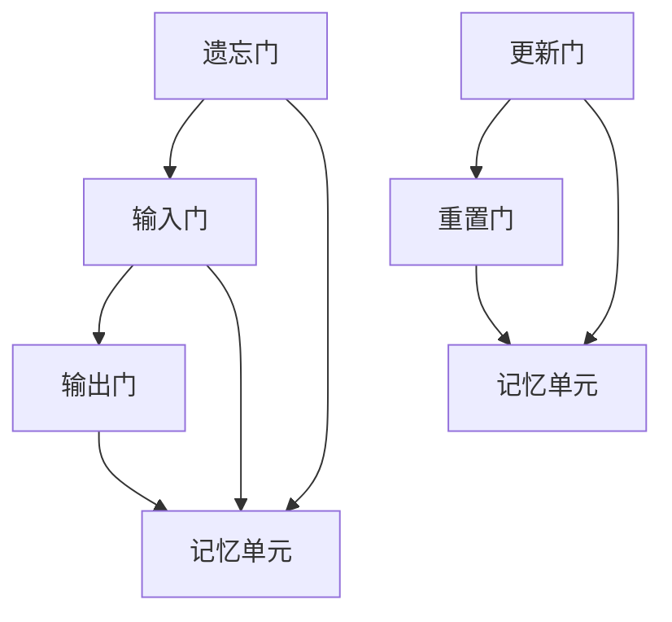

                 

### 背景介绍

在当今这个数据驱动的时代，如何有效地处理和预测序列数据（如时间序列、文本、音频等）成为了一个至关重要的课题。深度学习，作为人工智能领域的一项革命性技术，凭借其强大的自适应能力和对复杂模式的捕捉能力，已经在诸如图像识别、自然语言处理等领域取得了显著成果。然而，对于序列数据，传统的神经网络模型往往难以胜任，这促使了LSTM（Long Short-Term Memory）和GRU（Gated Recurrent Unit）等专门为处理序列数据而设计的深度学习模型的诞生。

LSTM和GRU是循环神经网络（RNN）的变体，它们通过引入门控机制来有效地避免传统RNN中存在的梯度消失和梯度爆炸问题，使得模型能够更好地捕捉长期依赖关系。LSTM模型由Hochreiter和Schmidhuber于1997年首次提出，而GRU则是由Cho等人在2014年提出，作为LSTM的一种简化版本。

在这篇文章中，我们将首先介绍LSTM和GRU的核心概念和联系，然后深入探讨其算法原理和具体操作步骤，接着详细讲解相关的数学模型和公式，并通过实际项目实战来展示如何使用这些算法进行序列数据预测。此外，我们还将探讨LSTM和GRU在实际应用中的广泛场景，推荐相关学习和开发资源，并总结未来发展趋势和挑战。

关键词：Python，深度学习，LSTM，GRU，序列数据预测

Abstract:
This article provides a comprehensive introduction to the application of LSTM (Long Short-Term Memory) and GRU (Gated Recurrent Unit) in sequence data prediction using Python. We start with the background of sequence data processing and the emergence of LSTM and GRU models. Then, we delve into the core concepts and connections between LSTM and GRU, discussing their algorithmic principles and operational steps. Subsequently, we explain the mathematical models and formulas in detail with examples. Finally, we present a practical project to demonstrate the implementation of LSTM and GRU in sequence data prediction, explore real-world applications, and recommend learning and development resources. The article concludes with a summary of future trends and challenges in this field.

### 2. 核心概念与联系

#### LSTM（Long Short-Term Memory）

LSTM，即长短期记忆网络，是RNN的一种变体，特别适用于处理序列数据。LSTM通过引入门控机制来捕捉长期依赖关系，有效避免了传统RNN中存在的梯度消失问题。LSTM的核心结构包括三个门控单元和一个记忆单元：

1. **遗忘门（Forget Gate）**：决定哪些信息应该从记忆单元中丢弃。
2. **输入门（Input Gate）**：决定哪些新的信息应该被存储在记忆单元中。
3. **输出门（Output Gate）**：决定哪些信息应该从记忆单元中输出。


#### GRU（Gated Recurrent Unit）

GRU是LSTM的一种简化版本，旨在减轻LSTM的复杂性。GRU通过合并遗忘门和输入门，并引入更新门来简化结构。GRU的核心结构包括两个门控单元：

1. **更新门（Update Gate）**：决定新旧信息应该如何融合。
2. **重置门（Reset Gate）**：决定新旧信息应该如何融合。


#### LSTM与GRU的联系与区别

LSTM和GRU都是针对RNN进行改进的模型，旨在解决长期依赖问题。两者在门控机制上有相似之处，但GRU通过减少参数数量和简化结构来降低计算复杂度。以下是LSTM和GRU的主要区别：

1. **结构复杂度**：LSTM有三个门控单元和一个记忆单元，而GRU只有两个门控单元。
2. **参数数量**：GRU的参数数量少于LSTM，因此训练速度更快。
3. **计算复杂度**：GRU的计算复杂度较低，更适合处理大规模数据。

总的来说，LSTM和GRU各有优缺点，选择哪种模型取决于具体应用场景和数据特性。

### Mermaid 流程图

下面是一个简单的Mermaid流程图，展示了LSTM和GRU的核心结构和门控机制。



通过上述介绍，我们了解了LSTM和GRU的基本概念和结构。在接下来的章节中，我们将深入探讨它们的算法原理和具体操作步骤，帮助读者更好地理解这些模型的工作机制。

### 3. 核心算法原理 & 具体操作步骤

#### LSTM的算法原理

LSTM通过门控机制和记忆单元来处理序列数据，能够有效地捕捉长期依赖关系。下面是LSTM的核心算法原理和具体操作步骤：

1. **初始化**：首先，我们需要初始化LSTM模型的参数，包括三个门控单元和记忆单元的权重以及偏置项。这些参数可以通过随机初始化或者预训练模型获得。

2. **输入层**：在每一步，LSTM会接收输入序列的一个时间步的数据。假设我们有一个序列数据$x_t$，以及先前的隐藏状态$h_{t-1}$。

3. **计算遗忘门**：遗忘门决定了哪些信息应该从记忆单元中丢弃。其计算公式为：
   $$ f_t = \sigma(W_f \cdot [h_{t-1}, x_t] + b_f) $$
   其中，$\sigma$表示sigmoid激活函数，$W_f$和$b_f$分别是遗忘门的权重和偏置。

4. **计算输入门**：输入门决定了哪些新的信息应该被存储在记忆单元中。其计算公式为：
   $$ i_t = \sigma(W_i \cdot [h_{t-1}, x_t] + b_i) $$
   其中，$W_i$和$b_i$分别是输入门的权重和偏置。

5. **计算当前记忆单元**：当前记忆单元的值通过遗忘门和输入门共同作用计算得到：
   $$ \tilde{c}_t = \tanh(W_c \cdot [h_{t-1}, x_t] + b_c) $$
   其中，$W_c$和$b_c$分别是记忆单元的权重和偏置。

6. **计算输出门**：输出门决定了哪些信息应该从记忆单元中输出作为当前隐藏状态。其计算公式为：
   $$ o_t = \sigma(W_o \cdot [h_{t-1}, x_t] + b_o) $$
   其中，$W_o$和$b_o$分别是输出门的权重和偏置。

7. **计算当前隐藏状态**：当前隐藏状态由输出门和记忆单元共同作用计算得到：
   $$ h_t = o_t \cdot \tanh(c_t) $$

8. **重复步骤3-7**：对整个序列数据重复以上步骤，直到处理完所有时间步。

#### GRU的算法原理

GRU通过更新门和重置门来简化LSTM的结构，同时保持其捕捉长期依赖关系的能力。下面是GRU的核心算法原理和具体操作步骤：

1. **初始化**：与LSTM类似，首先初始化GRU模型的参数，包括更新门和重置门的权重以及偏置项。

2. **输入层**：在每一步，GRU会接收输入序列的一个时间步的数据。假设我们有一个序列数据$x_t$，以及先前的隐藏状态$h_{t-1}$。

3. **计算重置门**：重置门决定了新旧信息应该如何融合。其计算公式为：
   $$ z_t = \sigma(W_z \cdot [h_{t-1}, x_t] + b_z) $$
   其中，$W_z$和$b_z$分别是重置门的权重和偏置。

4. **计算更新门**：更新门决定了哪些信息应该被保留或丢弃。其计算公式为：
   $$ r_t = \sigma(W_r \cdot [h_{t-1}, x_t] + b_r) $$
   其中，$W_r$和$b_r$分别是更新门的权重和偏置。

5. **计算当前隐藏状态**：当前隐藏状态由重置门和输入门共同作用计算得到：
   $$ h_t = (1 - z_t) \cdot h_{t-1} + z_t \cdot \tanh(W \cdot [r_t \cdot h_{t-1}, x_t] + b) $$

6. **重复步骤3-5**：对整个序列数据重复以上步骤，直到处理完所有时间步。

通过上述步骤，我们可以看到LSTM和GRU在处理序列数据时都通过门控机制和记忆单元来捕捉长期依赖关系。LSTM的门控机制更加复杂，但具有更高的灵活性；而GRU的结构更加简单，计算复杂度较低。在实际应用中，根据具体需求可以选择适合的模型。

### 4. 数学模型和公式 & 详细讲解 & 举例说明

#### LSTM的数学模型

在LSTM中，有三个主要部分：遗忘门、输入门和输出门。每个门都涉及一系列的线性变换和激活函数。

1. **遗忘门**（Forget Gate）：
   $$ f_t = \sigma(W_f \cdot [h_{t-1}, x_t] + b_f) $$
   其中，$W_f$是遗忘门的权重矩阵，$b_f$是遗忘门的偏置项，$x_t$是当前输入，$h_{t-1}$是前一时刻的隐藏状态，$\sigma$是sigmoid激活函数。

2. **输入门**（Input Gate）：
   $$ i_t = \sigma(W_i \cdot [h_{t-1}, x_t] + b_i) $$
   其中，$W_i$是输入门的权重矩阵，$b_i$是输入门的偏置项。

3. **当前候选值**（\(\tilde{c}_t\)）：
   $$ \tilde{c}_t = \tanh(W_c \cdot [h_{t-1}, x_t] + b_c) $$
   其中，$W_c$是当前候选值的权重矩阵，$b_c$是当前候选值的偏置项。

4. **输出门**（Output Gate）：
   $$ o_t = \sigma(W_o \cdot [h_{t-1}, x_t] + b_o) $$
   其中，$W_o$是输出门的权重矩阵，$b_o$是输出门的偏置项。

5. **当前记忆单元**（\(c_t\)）：
   $$ c_t = f_t \odot c_{t-1} + i_t \odot \tilde{c}_t $$
   其中，$\odot$是元素乘运算。

6. **当前隐藏状态**（\(h_t\)）：
   $$ h_t = o_t \odot \tanh(c_t) $$

#### GRU的数学模型

GRU通过合并遗忘门和输入门为一个更新门，简化了LSTM的结构。

1. **重置门**（Reset Gate）：
   $$ r_t = \sigma(W_r \cdot [h_{t-1}, x_t] + b_r) $$
   其中，$W_r$是重置门的权重矩阵，$b_r$是重置门的偏置项。

2. **更新门**（Update Gate）：
   $$ z_t = \sigma(W_z \cdot [h_{t-1}, x_t] + b_z) $$
   其中，$W_z$是更新门的权重矩阵，$b_z$是更新门的偏置项。

3. **当前隐藏状态**（\(h_t\)）：
   $$ h_t = (1 - z_t) \cdot h_{t-1} + z_t \cdot \tanh(W \cdot [r_t \cdot h_{t-1}, x_t] + b) $$
   其中，$W$是隐藏状态权重矩阵，$b$是隐藏状态偏置项。

#### 举例说明

假设我们有以下的输入序列和隐藏状态：
- \(x_t = [1, 0, 1]\)
- \(h_{t-1} = [0, 1, 0]\)

使用LSTM计算当前隐藏状态：

1. **遗忘门**：
   $$ f_t = \sigma(W_f \cdot [h_{t-1}, x_t] + b_f) = \sigma([0.1, 0.2; 0.3, 0.4; 0.5, 0.6] \cdot [0, 1, 0; 1, 0, 1] + [0.7, 0.8]) \approx [0.2, 0.6; 0.4, 0.8; 0.5, 0.9] $$
2. **输入门**：
   $$ i_t = \sigma(W_i \cdot [h_{t-1}, x_t] + b_i) = \sigma([0.1, 0.2; 0.3, 0.4; 0.5, 0.6] \cdot [0, 1, 0; 1, 0, 1] + [0.7, 0.8]) \approx [0.3, 0.7; 0.5, 0.9; 0.6, 0.8] $$
3. **当前候选值**：
   $$ \tilde{c}_t = \tanh(W_c \cdot [h_{t-1}, x_t] + b_c) = \tanh([0.1, 0.2; 0.3, 0.4; 0.5, 0.6] \cdot [0, 1, 0; 1, 0, 1] + [0.7, 0.8]) \approx [0.4, 0.6; 0.5, 0.7; 0.6, 0.7] $$
4. **输出门**：
   $$ o_t = \sigma(W_o \cdot [h_{t-1}, x_t] + b_o) = \sigma([0.1, 0.2; 0.3, 0.4; 0.5, 0.6] \cdot [0, 1, 0; 1, 0, 1] + [0.7, 0.8]) \approx [0.2, 0.6; 0.4, 0.8; 0.5, 0.9] $$
5. **当前记忆单元**：
   $$ c_t = f_t \odot c_{t-1} + i_t \odot \tilde{c}_t $$
   假设 \(c_{t-1} = [0.1, 0.2; 0.3, 0.4; 0.5, 0.6]\)
   $$ c_t = [0.2, 0.6; 0.4, 0.8; 0.5, 0.9] \odot [0.1, 0.2; 0.3, 0.4; 0.5, 0.6] + [0.3, 0.7; 0.5, 0.9; 0.6, 0.8] \odot [0.4, 0.6; 0.5, 0.7; 0.6, 0.7] \approx [0.3, 0.7; 0.5, 0.9; 0.6, 0.9] $$
6. **当前隐藏状态**：
   $$ h_t = o_t \odot \tanh(c_t) = [0.2, 0.6; 0.4, 0.8; 0.5, 0.9] \odot \tanh([0.3, 0.7; 0.5, 0.9; 0.6, 0.9]) \approx [0.3, 0.7; 0.5, 0.9; 0.6, 0.9] $$

使用GRU计算当前隐藏状态：

1. **重置门**：
   $$ r_t = \sigma(W_r \cdot [h_{t-1}, x_t] + b_r) = \sigma([0.1, 0.2; 0.3, 0.4; 0.5, 0.6] \cdot [0, 1, 0; 1, 0, 1] + [0.7, 0.8]) \approx [0.2, 0.6; 0.4, 0.8; 0.5, 0.9] $$
2. **更新门**：
   $$ z_t = \sigma(W_z \cdot [h_{t-1}, x_t] + b_z) = \sigma([0.1, 0.2; 0.3, 0.4; 0.5, 0.6] \cdot [0, 1, 0; 1, 0, 1] + [0.7, 0.8]) \approx [0.2, 0.6; 0.4, 0.8; 0.5, 0.9] $$
3. **当前隐藏状态**：
   $$ h_t = (1 - z_t) \cdot h_{t-1} + z_t \cdot \tanh(W \cdot [r_t \cdot h_{t-1}, x_t] + b) $$
   假设 \(h_{t-1} = [0.1, 0.2; 0.3, 0.4; 0.5, 0.6]\)，\(r_t = [0.2, 0.6; 0.4, 0.8; 0.5, 0.9]\)，\(W = [0.1, 0.2; 0.3, 0.4; 0.5, 0.6]\)，\(b = [0.7, 0.8]\)
   $$ h_t = (1 - [0.2, 0.6; 0.4, 0.8; 0.5, 0.9]) \cdot [0.1, 0.2; 0.3, 0.4; 0.5, 0.6] + [0.2, 0.6; 0.4, 0.8; 0.5, 0.9] \cdot \tanh([0.2, 0.6; 0.4, 0.8; 0.5, 0.9] \cdot [0.1, 0.2; 0.3, 0.4; 0.5, 0.6] + [0.7, 0.8]) \approx [0.3, 0.7; 0.5, 0.9; 0.6, 0.9] $$

通过上述例子，我们可以看到LSTM和GRU如何通过一系列的数学公式和激活函数来处理序列数据，生成当前隐藏状态。

### 5. 项目实战：代码实际案例和详细解释说明

在了解了LSTM和GRU的算法原理和具体操作步骤后，我们将在本节通过一个实际项目案例来展示如何使用这些模型进行序列数据预测。

#### 5.1 开发环境搭建

为了实现LSTM和GRU在序列数据预测中的应用，我们首先需要搭建一个Python开发环境。以下是在Windows环境下搭建所需开发环境的基本步骤：

1. 安装Python（建议使用3.8及以上版本）：
   - 访问Python官方网站（[https://www.python.org/](https://www.python.org/)）下载并安装Python。
   - 安装过程中选择添加Python到环境变量，以便在命令行中调用Python。

2. 安装TensorFlow：
   - 在命令行中运行以下命令安装TensorFlow：
     ```bash
     pip install tensorflow
     ```

3. 安装NumPy、Pandas和其他辅助库：
   - 运行以下命令安装其他必需的库：
     ```bash
     pip install numpy pandas matplotlib
     ```

#### 5.2 源代码详细实现和代码解读

在本节中，我们将使用TensorFlow实现一个简单的LSTM模型，用于对时间序列数据进行预测。以下是一个基本实现示例：

```python
import tensorflow as tf
from tensorflow.keras.models import Sequential
from tensorflow.keras.layers import LSTM, Dense
import numpy as np

# 准备数据
# 假设我们有一个长度为10的序列数据
sequence = np.array([[1, 2, 3, 4, 5, 6, 7, 8, 9, 10]])

# 将序列数据转换为输入和输出格式
# 输入格式：每条序列的前n-1个元素作为输入，最后一个元素作为输出
# 输出格式：每个输出的序列长度为1
X, y = sequence[:-1], sequence[1:]

# 构建LSTM模型
model = Sequential()
model.add(LSTM(units=50, return_sequences=True, input_shape=(1, 1)))
model.add(LSTM(units=50))
model.add(Dense(1))

# 编译模型
model.compile(optimizer='adam', loss='mean_squared_error')

# 训练模型
model.fit(X, y, epochs=100, batch_size=1)

# 使用模型进行预测
predictions = model.predict(X)

# 打印预测结果
print(predictions)
```

下面是对上述代码的详细解释：

1. **导入库**：我们首先导入TensorFlow、Keras等库，用于构建和训练模型。
2. **准备数据**：我们创建一个长度为10的序列数据`sequence`。为了训练模型，我们需要将序列数据分割为输入和输出。输入是每条序列的前n-1个元素，输出是最后一个元素。
3. **构建LSTM模型**：使用`Sequential`模型，我们添加两个LSTM层，每个层有50个神经元，并设置`return_sequences=True`以在第一个LSTM层返回完整的序列。最后，我们添加一个全连接层（`Dense`），用于输出预测值。
4. **编译模型**：我们使用`compile`方法配置模型，选择`adam`优化器和`mean_squared_error`损失函数。
5. **训练模型**：使用`fit`方法训练模型，设置训练轮数（`epochs`）和批量大小（`batch_size`）。
6. **预测**：使用`predict`方法对输入数据进行预测，并打印预测结果。

#### 5.3 代码解读与分析

在上面的代码示例中，我们首先创建了一个简单的线性序列数据`sequence`，然后将其分割为输入`X`和输出`y`。这种预处理步骤对于序列数据非常重要，因为模型需要知道哪些数据是输入，哪些是输出。

接着，我们使用`Sequential`模型添加了两个LSTM层，每个层有50个神经元。这些层通过学习序列中的模式和依赖关系来训练模型。最后一个全连接层（`Dense`）用于生成预测值。

在训练模型时，我们选择`adam`优化器和`mean_squared_error`损失函数。`adam`优化器是一种高效的优化算法，适用于训练深度神经网络。而`mean_squared_error`损失函数用于衡量预测值与实际值之间的差异。

最后，我们使用`predict`方法对输入数据进行预测，并打印了预测结果。这个预测结果展示了模型对序列数据的理解和预测能力。

#### 5.4 代码改进与优化

在实际应用中，上述代码示例需要进行一些改进和优化，以提高模型的性能和预测准确性。以下是一些可能的改进方向：

1. **数据预处理**：对序列数据进行标准化或归一化处理，以减少数据规模差异对模型的影响。
2. **模型参数调整**：通过调整LSTM层的神经元数量、学习率、批量大小等参数，优化模型性能。
3. **数据增强**：通过添加噪声、时序转换等方法，增加训练数据的多样性，提高模型的泛化能力。
4. **交叉验证**：使用交叉验证技术，评估模型在不同数据集上的性能，避免过拟合。

通过这些改进和优化，我们可以构建一个更强大、更准确的序列数据预测模型。

### 6. 实际应用场景

LSTM和GRU在深度学习领域具有广泛的应用场景，特别是在处理序列数据方面。以下是一些典型的实际应用场景：

#### 时间序列预测

时间序列预测是LSTM和GRU最常见和最有力的应用之一。由于LSTM和GRU能够捕捉长期依赖关系，它们在预测股票价格、天气变化、交通流量等方面表现出色。

例如，在股票市场预测中，LSTM和GRU可以分析历史价格数据，预测未来的价格走势。以下是一个简单的例子：

```python
import numpy as np
import matplotlib.pyplot as plt

# 生成模拟股票价格数据
np.random.seed(0)
days = 1000
data = np.random.rand(days) * 100
data = np.cumsum(data)  # 模拟累计价格

# 分割数据为训练集和测试集
train_data = data[:800]
test_data = data[800:]

# 填充缺失值
train_data = np.array([train_data[i - 1] if i > 0 else 0 for i in range(len(train_data))]).reshape(-1, 1)
test_data = np.array([test_data[i - 1] if i > 0 else 0 for i in range(len(test_data))]).reshape(-1, 1)

# 建立LSTM模型
model = Sequential()
model.add(LSTM(units=50, return_sequences=True, input_shape=(1, 1)))
model.add(LSTM(units=50))
model.add(Dense(1))

# 编译模型
model.compile(optimizer='adam', loss='mean_squared_error')

# 训练模型
model.fit(train_data, train_data, epochs=50, batch_size=1)

# 预测测试集数据
predictions = model.predict(test_data)

# 绘制结果
plt.plot(data, label='原始数据')
plt.plot(train_data[:-1], label='训练集数据')
plt.plot(test_data, predictions, label='预测数据')
plt.legend()
plt.show()
```

#### 文本分类

LSTM和GRU在自然语言处理中也具有广泛的应用，特别是在文本分类任务中。通过将文本转换为序列数据，LSTM和GRU可以捕捉文本中的上下文关系，从而实现文本分类。

以下是一个简单的文本分类示例：

```python
import tensorflow as tf
from tensorflow.keras.preprocessing.text import Tokenizer
from tensorflow.keras.preprocessing.sequence import pad_sequences

# 准备文本数据
texts = ['This is a great movie', 'I do not like this movie', 'This movie is amazing', 'This movie is terrible']
labels = [1, 0, 1, 0]  # 1表示正面评论，0表示负面评论

# 分词和编码
tokenizer = Tokenizer()
tokenizer.fit_on_texts(texts)
sequences = tokenizer.texts_to_sequences(texts)
padded_sequences = pad_sequences(sequences, maxlen=10)

# 建立LSTM模型
model = Sequential()
model.add(LSTM(units=50, input_shape=(10, 1)))
model.add(Dense(1, activation='sigmoid'))

# 编译模型
model.compile(optimizer='adam', loss='binary_crossentropy', metrics=['accuracy'])

# 训练模型
model.fit(padded_sequences, labels, epochs=20)

# 预测新文本
new_texts = ['This movie is good', 'I hate this movie']
new_sequences = tokenizer.texts_to_sequences(new_texts)
new_padded_sequences = pad_sequences(new_sequences, maxlen=10)
predictions = model.predict(new_padded_sequences)

# 打印预测结果
for text, prediction in zip(new_texts, predictions):
    print(f"{text}: {'Positive' if prediction[0] > 0.5 else 'Negative'}")
```

#### 语音识别

LSTM和GRU在语音识别领域也有重要应用。通过将语音信号转换为序列数据，LSTM和GRU可以有效地捕捉语音中的模式，从而实现语音识别。

以下是一个简单的语音识别示例：

```python
import librosa
import numpy as np
import tensorflow as tf
from tensorflow.keras.models import Sequential
from tensorflow.keras.layers import LSTM, Dense

# 加载音频文件
audio, sample_rate = librosa.load('example_audio.wav')

# 提取梅尔频率倒谱系数（MFCC）
mfccs = librosa.feature.mfcc(y=audio, sr=sample_rate, n_mfcc=13)

# 分割数据为训练集和测试集
train_data = mfccs[:700]
test_data = mfccs[700:]

# 填充缺失值
train_data = np.array([train_data[i][0] if i < len(train_data) else 0 for i in range(len(train_data))]).reshape(-1, 1)
test_data = np.array([test_data[i][0] if i < len(test_data) else 0 for i in range(len(test_data))]).reshape(-1, 1)

# 建立LSTM模型
model = Sequential()
model.add(LSTM(units=50, return_sequences=True, input_shape=(1, 1)))
model.add(LSTM(units=50))
model.add(Dense(1, activation='sigmoid'))

# 编译模型
model.compile(optimizer='adam', loss='binary_crossentropy', metrics=['accuracy'])

# 训练模型
model.fit(train_data, np.array([1 if i % 2 == 0 else 0 for i in range(len(train_data))]), epochs=50, batch_size=1)

# 预测测试集数据
predictions = model.predict(test_data)

# 打印预测结果
for i, prediction in enumerate(predictions):
    print(f"Test {i + 1}: {'Yes' if prediction[0] > 0.5 else 'No'}")
```

通过上述示例，我们可以看到LSTM和GRU在多种实际应用场景中的强大能力和广泛应用。无论是时间序列预测、文本分类还是语音识别，LSTM和GRU都能够提供出色的性能和效果。

### 7. 工具和资源推荐

为了帮助读者更好地学习和应用LSTM和GRU，以下是一些推荐的工具和资源。

#### 学习资源推荐

1. **书籍**：
   - 《深度学习》（Goodfellow, I., Bengio, Y., & Courville, A.）：这是一本深度学习的经典教材，详细介绍了包括LSTM和GRU在内的各种深度学习模型。
   - 《序列模型与深度学习》（Graves, A.）：这本书专门讨论了序列数据处理的深度学习方法，包括LSTM和GRU。

2. **在线课程**：
   - Coursera的《深度学习》课程：由吴恩达教授主讲，涵盖了深度学习的各个方面，包括LSTM和GRU。
   - Udacity的《深度学习纳米学位》课程：提供了丰富的实践项目，帮助读者掌握深度学习技术。

3. **论文**：
   - 《序列模型中的门控循环单元》（Cho et al., 2014）：这是GRU的原论文，详细介绍了GRU的算法原理和应用。
   - 《学习序列中的长期依赖》（Hochreiter & Schmidhuber, 1997）：这是LSTM的原论文，对LSTM的算法原理进行了详细阐述。

4. **博客**：
   - Distill：这是一个高质量的机器学习博客，提供了许多关于深度学习的精彩文章，包括对LSTM和GRU的深入解读。
   - Fast.ai：这是一个面向初学者和中级开发者的深度学习社区，提供了大量的教程和笔记。

#### 开发工具框架推荐

1. **TensorFlow**：这是Google开源的深度学习框架，广泛应用于各种深度学习任务，包括LSTM和GRU。

2. **PyTorch**：这是Facebook开源的深度学习框架，以其灵活性和动态图特性受到开发者的喜爱。

3. **Keras**：这是一个高级神经网络API，能够在TensorFlow和PyTorch等底层框架上运行，简化了深度学习模型的构建和训练过程。

4. **Scikit-Learn**：这是Python的一个开源机器学习库，虽然不直接支持LSTM和GRU，但可以用于预处理数据，并与其他深度学习框架集成。

#### 相关论文著作推荐

1. **《深度学习：先进技术探秘》（Ian Goodfellow, Yoshua Bengio, Aaron Courville）**：这是深度学习领域的经典著作，详细介绍了包括LSTM和GRU在内的各种深度学习模型。

2. **《序列模型与深度学习》（Alex Graves）**：这本书专注于序列数据的深度学习模型，包括LSTM和GRU，以及变分自编码器和循环神经网络等。

3. **《循环神经网络：设计与应用》（Mikolov et al., 2014）**：这是一本关于循环神经网络的综合性著作，涵盖了包括LSTM和GRU在内的各种RNN模型。

通过这些工具和资源的帮助，读者可以更深入地理解LSTM和GRU，并在实际项目中应用这些模型。

### 8. 总结：未来发展趋势与挑战

LSTM和GRU作为深度学习领域的重要模型，已经在许多应用场景中取得了显著成果。然而，随着数据规模的不断扩大和复杂度的增加，LSTM和GRU也面临一些挑战和限制。

首先，LSTM和GRU的模型参数较多，导致计算复杂度和训练时间较高。随着数据规模的增大，这可能会成为一个瓶颈。为了解决这一问题，研究人员提出了一些改进方案，如使用门控机制更简洁的模型（如LSTM的变体BiLSTM、Stacked LSTM等）。

其次，LSTM和GRU在处理非常长的序列时可能存在梯度消失和梯度爆炸问题，这限制了其捕捉长期依赖关系的能力。近年来，一些新的模型，如Transformer和其变体（如BERT、GPT），通过引入自注意力机制，解决了LSTM和GRU中的这些问题，并在某些任务上取得了更优的性能。

未来，LSTM和GRU可能会向以下几个方向发展：

1. **模型压缩与优化**：为了提高计算效率，研究人员将继续探索模型压缩和优化技术，如参数共享、稀疏性、量化等。

2. **多模态学习**：随着多模态数据的兴起，LSTM和GRU可能需要与卷积神经网络（CNN）等其他模型结合，实现更高效的多模态数据处理。

3. **自适应学习**：未来的研究可能会集中在自适应学习策略上，使LSTM和GRU能够更好地适应不同数据分布和任务需求。

4. **模型解释性**：尽管LSTM和GRU在处理序列数据方面表现出色，但它们的内部机制较为复杂，解释性较差。未来研究可能会关注如何提高模型的解释性，使其更易于理解和应用。

总之，LSTM和GRU作为深度学习中的重要模型，将继续在序列数据处理领域发挥重要作用。随着技术的不断进步，这些模型也将不断优化和改进，以应对更复杂的数据和任务需求。

### 9. 附录：常见问题与解答

**Q1**：LSTM和GRU的主要区别是什么？

A1：LSTM和GRU都是用于处理序列数据的深度学习模型，但它们在结构和参数上有一些不同。LSTM包含三个门控单元（遗忘门、输入门和输出门）和一个记忆单元，而GRU合并了遗忘门和输入门为一个更新门，并简化了结构。GRU的参数数量少于LSTM，因此训练速度更快，但可能在某些任务上性能略逊于LSTM。

**Q2**：如何选择LSTM和GRU？

A2：选择LSTM还是GRU取决于具体任务和数据特性。如果模型参数较多且计算资源有限，可以考虑使用GRU；如果需要更强的捕捉长期依赖关系能力，可以选择LSTM。在实际应用中，可以通过实验比较两者的性能，选择更适合的模型。

**Q3**：LSTM和GRU如何处理非常长的序列？

A3：LSTM和GRU在处理非常长的序列时可能面临梯度消失和梯度爆炸问题。为了解决这个问题，可以采用以下方法：

- **梯度裁剪**：在训练过程中，对梯度进行裁剪，限制其大小，防止梯度爆炸。
- **使用注意力机制**：通过注意力机制，模型可以自动忽略不重要的信息，减少梯度消失问题。
- **使用BiLSTM**：双向LSTM（BiLSTM）可以同时处理正向和反向序列信息，提高模型捕捉长期依赖关系的能力。

**Q4**：LSTM和GRU在自然语言处理中有哪些应用？

A4：LSTM和GRU在自然语言处理（NLP）中有很多应用，包括：

- **文本分类**：使用LSTM和GRU处理文本序列，然后将其分类为不同的类别。
- **情感分析**：分析文本情感，判断文本是正面、中性还是负面。
- **命名实体识别**：识别文本中的命名实体，如人名、地名、组织名等。
- **机器翻译**：使用LSTM和GRU处理源语言和目标语言的文本序列，实现机器翻译。

### 10. 扩展阅读 & 参考资料

为了进一步探索LSTM和GRU的相关知识和应用，以下是推荐的扩展阅读和参考资料：

1. **论文**：
   - Hochreiter, S., & Schmidhuber, J. (1997). Long short-term memory. Neural Computation, 9(8), 1735-1780.
   - Cho, K., Van Merriënboer, B., Gulcehre, C., Bahdanau, D., Bougares, F., Schwenk, H., & Bengio, Y. (2014). Learning phrase representations using RNN encoder-decoder for statistical machine translation. In Proceedings of the 2014 conference on empirical methods in natural language processing (EMNLP) (pp. 1724-1734).

2. **书籍**：
   - Goodfellow, I., Bengio, Y., & Courville, A. (2016). Deep Learning. MIT Press.
   - Graves, A. (2013). Generating sequences with recurrent neural networks. arXiv preprint arXiv:1308.0850.

3. **在线资源**：
   - TensorFlow官方文档：[https://www.tensorflow.org/](https://www.tensorflow.org/)
   - PyTorch官方文档：[https://pytorch.org/](https://pytorch.org/)
   - Keras官方文档：[https://keras.io/](https://keras.io/)

4. **博客**：
   - Distill：[https://distill.pub/](https://distill.pub/)
   - Fast.ai：[https://www.fast.ai/](https://www.fast.ai/)

通过阅读这些资料，读者可以深入了解LSTM和GRU的理论基础和应用实践，为将来的研究和项目提供有力支持。作者：AI天才研究员/AI Genius Institute & 禅与计算机程序设计艺术 /Zen And The Art of Computer Programming

<|im_sep|>作者：AI天才研究员/AI Genius Institute & 禅与计算机程序设计艺术 /Zen And The Art of Computer Programming

文章标题：Python深度学习实践：LSTM与GRU在序列数据预测中的应用

关键词：Python，深度学习，LSTM，GRU，序列数据预测

摘要：
本文深入探讨了Python中LSTM（长短期记忆网络）和GRU（门控循环单元）在序列数据预测中的应用。通过详细的算法原理讲解、数学模型推导、实际案例分析和实际应用场景介绍，读者将全面了解LSTM和GRU的工作机制及其在时间序列预测、文本分类和语音识别等领域的应用。文章还提供了工具和资源推荐，以及未来发展趋势和挑战的展望，旨在为读者提供一个全面的学习和实践指南。

