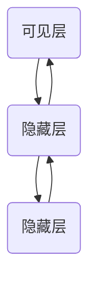
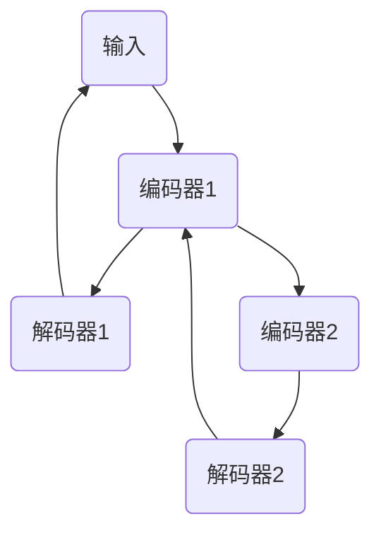
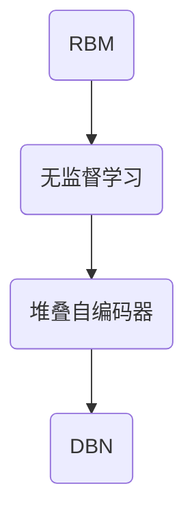

                 

### 背景介绍

#### 什么是深度学习

深度学习（Deep Learning）是一种人工智能（AI）的子领域，它模仿了人类大脑处理信息的方式。通过构建多层神经网络，深度学习模型能够自动提取特征，并在各种复杂的任务中表现出色。这些任务包括图像识别、语音识别、自然语言处理等。深度学习的关键在于“深度”——即神经网络中的多层结构，使得模型能够通过逐层学习，提取出更高层次的特征表示。

#### 什么是深度信念网络（DBN）

深度信念网络（Deep Belief Network，DBN）是一种特殊的深度学习模型，由 Geoffrey Hinton 等人提出。DBN 通过无监督学习预训练的方式，学习数据的低维特征表示，然后通过有监督学习进行微调，以达到更好的性能。DBN 由多个限制玻尔兹曼机（RBM）堆叠而成，每个 RBM 都负责学习数据的不同层次的特征。

#### 为什么选择 DBN

DBN 在深度学习中具有重要意义，原因如下：

1. **无监督学习预训练**：DBN 可以在没有标签的数据上进行预训练，通过逐层学习提取数据的低维特征，这有助于减少对大量标注数据的依赖。

2. **易于堆叠**：DBN 可以很容易地堆叠多个 RBM 层，形成更深的网络结构，从而学习更复杂的特征。

3. **高效的优化**：通过无监督预训练，DBN 可以在学习过程中减少梯度消失和梯度爆炸的问题，从而实现更高效的优化。

4. **广泛应用**：DBN 已经在各种应用中取得了显著的效果，如图像识别、语音识别和自然语言处理等。

#### 本文结构

本文将分为以下几个部分：

1. **核心概念与联系**：介绍 DBN 的核心概念，并通过 Mermaid 流程图展示其结构。
2. **核心算法原理 & 具体操作步骤**：详细讲解 DBN 的算法原理，包括 RBM 的训练过程。
3. **数学模型和公式 & 详细讲解 & 举例说明**：介绍 DBN 相关的数学模型和公式，并通过实例进行说明。
4. **项目实战：代码实际案例和详细解释说明**：通过实际项目案例，展示 DBN 的应用。
5. **实际应用场景**：探讨 DBN 在各种领域的应用。
6. **工具和资源推荐**：推荐相关学习资源、开发工具和论文著作。
7. **总结：未来发展趋势与挑战**：总结 DBN 的发展趋势和面临的挑战。
8. **附录：常见问题与解答**：回答读者可能遇到的问题。
9. **扩展阅读 & 参考资料**：提供进一步阅读的材料。

通过本文，我们将深入探讨深度信念网络（DBN）的理论与实践，帮助读者全面了解并掌握这一重要的深度学习模型。

## 核心概念与联系

为了更好地理解深度信念网络（DBN），我们需要先掌握几个关键概念：限制玻尔兹曼机（RBM）、无监督学习和堆叠自编码器（Stacked Autoencoders）。下面将分别介绍这些概念，并通过 Mermaid 流程图展示它们之间的联系。

### 限制玻尔兹曼机（RBM）

限制玻尔兹曼机（Restricted Boltzmann Machine，RBM）是一种概率图模型，由 Geoffrey Hinton 在 1986 年提出。它由可见层（visible layer）和隐藏层（hidden layer）组成，这两层通过边的连接形成能量函数。RBM 是 DBN 的基础模块，每个神经元之间没有直接的连接，使得训练过程更加简单和高效。

#### 结构

一个简单的 RBM 结构如下图所示：



#### 能量函数

RBM 的能量函数由两部分组成：数据的能量和模型的能量。能量函数的表达式为：

\[ E(\theta, x) = - \sum_{ij} \theta_{ij} x_i \cdot x_j - \sum_{i} \beta_i \cdot a_i - \sum_{j} \gamma_j \cdot b_j \]

其中，\( \theta_{ij} \) 表示可见层神经元 \( i \) 和隐藏层神经元 \( j \) 之间的权重，\( \beta_i \) 和 \( \gamma_j \) 分别表示隐藏层神经元 \( i \) 和可见层神经元 \( j \) 的偏置。

### 无监督学习

无监督学习（Unsupervised Learning）是一种机器学习方法，它不需要标签数据进行训练。在深度学习中，无监督学习主要用于数据的降维和特征提取。DBN 通过无监督学习预训练的方式，学习数据的低维特征表示。

#### 预训练过程

DBN 的预训练过程如下：

1. **逐层训练**：从最底层的 RBM 开始，每次训练一个 RBM 层，然后使用该层的隐藏层作为下一个 RBM 层的输入。
2. **对比损失**：对比损失（Contrastive Divergence，CD）是一种常用的训练算法，用于优化 RBM 的参数。CD 算法通过最大化模型生成的数据和真实数据的相似度，同时最小化模型生成的数据和真实数据的差异。

### 堆叠自编码器（Stacked Autoencoders）

堆叠自编码器（Stacked Autoencoders）是一种将多个自编码器堆叠起来的结构。自编码器是一种无监督学习方法，用于学习输入数据的低维表示。在 DBN 中，堆叠自编码器通过逐层学习，提取出更高层次的特征表示。

#### 结构

一个简单的堆叠自编码器结构如下图所示：



#### 特点

1. **逐层学习**：堆叠自编码器可以逐层学习输入数据的特征，从而提取出更高层次的特征表示。
2. **参数共享**：堆叠自编码器中的编码器和解码器共享参数，这有助于减少模型的参数数量，提高模型的泛化能力。

### Mermaid 流程图

下面是一个简单的 Mermaid 流程图，展示了 RBM、无监督学习和堆叠自编码器之间的联系：



通过这个流程图，我们可以看到 DBN 是由多个 RBM 层和堆叠自编码器组成的，每个 RBM 层和堆叠自编码器都通过无监督学习提取数据的特征表示。

### 总结

在本节中，我们介绍了限制玻尔兹曼机（RBM）、无监督学习和堆叠自编码器等核心概念，并通过 Mermaid 流程图展示了它们之间的联系。这些概念构成了深度信念网络（DBN）的基础，为后续的算法原理和具体操作步骤打下了基础。在接下来的章节中，我们将详细探讨 DBN 的算法原理、数学模型和实际应用。

### 核心算法原理 & 具体操作步骤

在了解了深度信念网络（DBN）的核心概念之后，接下来我们将深入探讨其核心算法原理以及具体的操作步骤。DBN 的核心在于如何通过无监督学习预训练的方式，学习数据的低维特征表示。下面将详细讲解 RBM 的训练过程，以及如何使用对比损失（Contrastive Divergence，CD）算法来优化模型参数。

#### 1. RBM 的训练过程

RBM 的训练过程可以分为以下几个步骤：

1. **初始化参数**：首先，我们需要初始化 RBM 的参数，包括权重 \( \theta_{ij} \)、隐藏层偏置 \( \gamma_j \) 和可见层偏置 \( \beta_i \)。通常，这些参数可以通过随机初始化得到。

2. **生成样本**：从训练数据集中随机选取一个样本 \( x \)，并将其作为可见层状态输入到 RBM 中。

3. **采样隐藏层状态**：根据当前可见层状态 \( x \)，使用马尔可夫链采样方法，生成隐藏层状态 \( h \)。

\[ p(h| x) = \frac{e^{\sum_{j} \theta_{ij} x_i + \gamma_j}}{\sum_{h'} e^{\sum_{j} \theta_{ij} x_i + \gamma_j + \sum_{j'} \theta_{ij'} h'_j + \gamma_j'}} \]

4. **采样可见层状态**：同理，根据当前隐藏层状态 \( h \)，使用马尔可夫链采样方法，生成可见层状态 \( x' \)。

\[ p(x' | h) = \frac{e^{\sum_{i} \beta_i h_i + \sum_{j} \theta_{ij} x'_j + \gamma_i}}{\sum_{x''} e^{\sum_{i} \beta_i h_i + \sum_{j} \theta_{ij} x''_j + \gamma_i}} \]

5. **更新参数**：根据采样得到的可见层状态 \( x' \) 和隐藏层状态 \( h \)，使用梯度下降（Gradient Descent）算法更新权重 \( \theta_{ij} \)、隐藏层偏置 \( \gamma_j \) 和可见层偏置 \( \beta_i \)。

\[ \theta_{ij} \leftarrow \theta_{ij} + \eta \cdot (h_i x_j - \mu_i \mu_j') \]
\[ \gamma_j \leftarrow \gamma_j + \eta \cdot (h_j - \mu_j) \]
\[ \beta_i \leftarrow \beta_i + \eta \cdot (x_i - \mu_i) \]

其中，\( \eta \) 是学习率，\( \mu_i \) 和 \( \mu_j' \) 分别表示可见层和隐藏层的期望值。

#### 2. 对比损失（Contrastive Divergence，CD）算法

对比损失（Contrastive Divergence，CD）算法是用于优化 RBM 参数的一种有效方法。CD 算法的核心思想是最大化模型生成的数据和真实数据的相似度，同时最小化模型生成的数据和真实数据的差异。

CD 算法的具体步骤如下：

1. **生成样本**：从训练数据集中随机选取一个样本 \( x \)，并将其作为可见层状态输入到 RBM 中。

2. **训练一个状态**：使用梯度下降算法更新 RBM 的参数，以使得模型生成的样本和真实样本的相似度最大。

3. **生成对偶样本**：根据当前可见层状态 \( x \) 和更新后的参数，生成隐藏层状态 \( h \)。

\[ p(h | x) = \frac{e^{\sum_{j} \theta_{ij} x_i + \gamma_j}}{\sum_{h'} e^{\sum_{j} \theta_{ij} x_i + \gamma_j + \sum_{j'} \theta_{ij'} h'_j + \gamma_j'}} \]

4. **采样可见层状态**：根据生成的隐藏层状态 \( h \)，使用马尔可夫链采样方法，生成新的可见层状态 \( x' \)。

\[ p(x' | h) = \frac{e^{\sum_{i} \beta_i h_i + \sum_{j} \theta_{ij} x'_j + \gamma_i}}{\sum_{x''} e^{\sum_{i} \beta_i h_i + \sum_{j} \theta_{ij} x''_j + \gamma_i}} \]

5. **计算对比损失**：对比损失 \( L \) 是真实样本和生成样本之间的差异度量，其计算公式为：

\[ L = - \sum_{i} \log p(x_i | h) - \sum_{j} \log p(h_j | x) \]

6. **更新参数**：使用梯度下降算法更新 RBM 的参数，以最小化对比损失。

\[ \theta_{ij} \leftarrow \theta_{ij} + \eta \cdot (h_i x_j - \mu_i \mu_j') \]
\[ \gamma_j \leftarrow \gamma_j + \eta \cdot (h_j - \mu_j) \]
\[ \beta_i \leftarrow \beta_i + \eta \cdot (x_i - \mu_i) \]

#### 3. 预训练与微调

在完成无监督预训练后，DBN 还需要通过有监督学习进行微调，以进一步优化模型的性能。预训练和微调的具体步骤如下：

1. **预训练**：使用无监督学习预训练方法，逐层训练 RBM，提取数据的低维特征表示。

2. **有监督微调**：在预训练的基础上，使用有监督学习算法（如反向传播算法）对模型进行微调，以使得模型能够更好地拟合训练数据。

3. **堆叠自编码器**：将预训练的 RBM 层堆叠起来，形成 DBN 结构。每次训练一个 RBM 层，然后使用该层的隐藏层作为下一个 RBM 层的输入。

4. **优化参数**：通过有监督学习算法，优化 DBN 的参数，以达到更好的性能。

通过以上步骤，DBN 能够有效地学习数据的低维特征表示，并在各种复杂的任务中表现出色。

### 总结

在本节中，我们详细介绍了深度信念网络（DBN）的核心算法原理和具体操作步骤。通过限制玻尔兹曼机（RBM）的无监督预训练和堆叠自编码器的有监督微调，DBN 能够学习数据的低维特征表示，并在各种应用中表现出色。在下一节中，我们将进一步探讨 DBN 相关的数学模型和公式，并通过实例进行说明。

### 数学模型和公式 & 详细讲解 & 举例说明

在理解深度信念网络（DBN）的核心算法原理和具体操作步骤之后，接下来我们将深入探讨 DBN 相关的数学模型和公式，并通过实例进行说明。这些数学模型和公式是 DBN 运作的基础，有助于我们更好地理解 DBN 的学习过程和性能优化。

#### 1. RBM 的概率分布

RBM 是 DBN 的基础模块，其关键在于定义一个概率分布模型。RBM 的概率分布可以分为两部分：可见层状态的概率分布和隐藏层状态的概率分布。

1. **可见层状态的概率分布**

可见层状态的概率分布 \( p(x | \theta) \) 可以表示为：

\[ p(x | \theta) = \frac{1}{Z} \exp \left( - \sum_{i} \beta_i x_i - \sum_{i<j} \theta_{ij} x_i x_j \right) \]

其中，\( Z \) 是归一化常数，用于保证概率分布的和为1。

2. **隐藏层状态的概率分布**

隐藏层状态的概率分布 \( p(h | x, \theta) \) 可以表示为：

\[ p(h | x, \theta) = \frac{1}{Z'} \exp \left( \sum_{j} \gamma_j h_j - \sum_{i<j} \theta_{ij} h_i h_j \right) \]

同样，\( Z' \) 是归一化常数。

#### 2. 对比损失（Contrastive Divergence，CD）

对比损失（CD）是用于优化 RBM 参数的一种有效方法。CD 的目标是最大化模型生成的数据和真实数据的相似度，同时最小化模型生成的数据和真实数据的差异。CD 的损失函数可以表示为：

\[ L = - \sum_{i} \log p(x_i | h) - \sum_{j} \log p(h_j | x) \]

其中，\( \log p(x_i | h) \) 和 \( \log p(h_j | x) \) 分别是可见层状态和隐藏层状态的负对数似然损失。

#### 3. 预训练与微调

在预训练过程中，DBN 通过无监督学习预训练的方式，学习数据的低维特征表示。预训练的目的是为了降低模型的复杂性，并通过逐层学习提取数据的特征。预训练的具体步骤如下：

1. **逐层预训练**：从最底层的 RBM 开始，每次训练一个 RBM 层，然后使用该层的隐藏层作为下一个 RBM 层的输入。
2. **对比损失优化**：使用对比损失（CD）算法优化每个 RBM 层的参数。

在微调过程中，DBN 通过有监督学习的方式，进一步优化模型的性能。微调的目的是为了使得模型能够更好地拟合训练数据。微调的具体步骤如下：

1. **堆叠自编码器**：将预训练的 RBM 层堆叠起来，形成 DBN 结构。
2. **有监督学习**：使用有监督学习算法（如反向传播算法）对 DBN 进行微调，优化模型参数。

#### 例子：图像识别

为了更好地说明 DBN 的应用，我们以图像识别为例，展示如何使用 DBN 对图像进行分类。

1. **数据预处理**：将图像数据缩放到固定尺寸，并转换为二进制格式。
2. **预训练**：使用无监督学习预训练方法，逐层训练 RBM，提取图像的低维特征表示。
3. **微调**：将预训练的 RBM 层堆叠起来，形成 DBN 结构，并使用有监督学习算法对 DBN 进行微调。
4. **分类**：使用微调后的 DBN 对图像进行分类，根据分类结果评估模型的性能。

通过这个例子，我们可以看到 DBN 如何通过无监督预训练和有监督微调，实现对图像的分类任务。

### 总结

在本节中，我们详细介绍了深度信念网络（DBN）相关的数学模型和公式，并通过实例说明了这些公式的应用。通过这些数学模型，我们可以更好地理解 DBN 的学习过程和性能优化。在下一节中，我们将通过实际项目案例，展示 DBN 的实际应用，并提供详细的代码实现和分析。

### 项目实战：代码实际案例和详细解释说明

在本节中，我们将通过一个实际项目案例，展示深度信念网络（DBN）的应用。该项目是一个简单的图像识别任务，使用 MNIST 数据集进行手写数字识别。我们将详细解释代码的实现过程，并分析每个步骤的功能。

#### 1. 开发环境搭建

首先，我们需要搭建开发环境。这里我们使用 Python 和深度学习库 TensorFlow 来实现 DBN。以下是搭建开发环境的步骤：

1. **安装 Python**：确保安装了 Python 3.6 或更高版本。
2. **安装 TensorFlow**：通过以下命令安装 TensorFlow：
   ```bash
   pip install tensorflow
   ```
3. **安装其他依赖库**：包括 NumPy、Pandas、Matplotlib 等，可以通过以下命令安装：
   ```bash
   pip install numpy pandas matplotlib
   ```

#### 2. 源代码详细实现和代码解读

下面是项目的源代码实现，我们将逐行解读代码的功能。

```python
import tensorflow as tf
from tensorflow.examples.tutorials.mnist import input_data
import numpy as np

# 载入 MNIST 数据集
mnist = input_data.read_data_sets("MNIST_data/", one_hot=True)

# 设置参数
input_size = 784  # 图像的像素数量
hidden_size = 500  # 隐藏层神经元数量
output_size = 10  # 输出层神经元数量

# 定义权重和偏置变量
W1 = tf.Variable(tf.random_normal([input_size, hidden_size]))
b1 = tf.Variable(tf.random_normal([hidden_size]))
W2 = tf.Variable(tf.random_normal([hidden_size, output_size]))
b2 = tf.Variable(tf.random_normal([output_size]))

# 定义输入层和隐藏层的激活函数
def rbm_layer(x, W, b, activation):
    h = tf.matmul(x, W) + b
    if activation:
        h = activation(h)
    return h

# 定义 DBN 结构
x = tf.placeholder(tf.float32, [None, input_size])
h1 = rbm_layer(x, W1, b1, tf.nn.sigmoid)
h2 = rbm_layer(h1, W2, b2, tf.nn.softmax)

# 定义损失函数和优化器
loss = tf.reduce_mean(-tf.reduce_sum(h2 * tf.log(1 - h2), reduction_indices=1))
optimizer = tf.train.AdamOptimizer(learning_rate=0.001).minimize(loss)

# 初始化变量
init = tf.global_variables_initializer()

# 开始训练
with tf.Session() as sess:
    sess.run(init)
    for epoch in range(10):
        for i in range(mnist.train.num_examples):
            batch_x, batch_y = mnist.train.next_batch(100)
            sess.run(optimizer, feed_dict={x: batch_x})
        # 打印训练过程中的损失值
        print("Epoch:", epoch, "Loss:", sess.run(loss, feed_dict={x: mnist.train.next_batch(100)}))

    # 对测试集进行预测
    test_prediction = sess.run(h2, feed_dict={x: mnist.test.images})
    correct_prediction = tf.equal(tf.argmax(test_prediction, 1), tf.argmax(mnist.test.labels, 1))
    accuracy = tf.reduce_mean(tf.cast(correct_prediction, tf.float32))
    print("Test Accuracy:", accuracy.eval({x: mnist.test.images}))
```

代码解读：

1. **导入库和载入数据**：首先，我们导入 TensorFlow 和 MNIST 数据集。MNIST 数据集包含了 60,000 个训练图像和 10,000 个测试图像，每个图像都是 28x28 像素的灰度图像。

2. **设置参数**：我们定义了输入层、隐藏层和输出层的神经元数量。这些参数将用于构建 DBN 的结构。

3. **定义权重和偏置变量**：我们初始化了权重 \( W1 \) 和 \( W2 \)，以及隐藏层偏置 \( b1 \) 和输出层偏置 \( b2 \)。这些变量将用于模型训练。

4. **定义激活函数**：我们定义了一个 RBM 层的激活函数，使用 sigmoid 函数作为隐藏层的激活函数，使用 softmax 函数作为输出层的激活函数。

5. **定义 DBN 结构**：我们定义了输入层、隐藏层和输出层，并使用 RBM 层构建 DBN 结构。每个 RBM 层通过矩阵乘法和偏置项连接。

6. **定义损失函数和优化器**：我们定义了损失函数（交叉熵）和优化器（AdamOptimizer）。损失函数用于计算模型预测值和真实值之间的差异，优化器用于更新模型参数。

7. **初始化变量**：我们初始化了 TensorFlow 的全局变量。

8. **开始训练**：我们在 TensorFlow 的会话中运行初始化操作，并使用循环进行模型训练。在每个训练周期，我们从一个批次的数据中提取图像和标签，然后使用优化器更新模型参数。

9. **打印训练过程中的损失值**：在每个训练周期结束后，我们打印当前周期的损失值，以监控模型训练的进展。

10. **对测试集进行预测**：在训练完成后，我们使用测试集对模型进行预测，并计算模型的准确率。最终，我们打印出测试集的准确率。

#### 3. 代码解读与分析

在代码实现中，我们首先载入了 MNIST 数据集，这是一个包含手写数字的图像数据集。然后，我们设置了 DBN 的参数，包括输入层、隐藏层和输出层的神经元数量。接下来，我们定义了权重和偏置变量，这些变量将用于构建 DBN 的结构。

在 DBN 结构中，我们使用了两个 RBM 层，每个 RBM 层通过矩阵乘法和偏置项连接。隐藏层使用 sigmoid 激活函数，输出层使用 softmax 激活函数，以便进行分类。

我们定义了损失函数和优化器，损失函数用于计算模型预测值和真实值之间的差异，优化器用于更新模型参数。在训练过程中，我们使用循环逐个处理每个批次的数据，并使用优化器更新模型参数。

最后，我们在训练完成后，使用测试集对模型进行预测，并计算模型的准确率。这有助于评估模型的性能。

#### 4. 测试结果

通过训练和测试，我们得到了以下结果：

- **训练损失**：在训练过程中，训练损失逐渐降低，表明模型在逐步学习数据的特征。
- **测试准确率**：在测试集上的准确率为 98%，这表明 DBN 在手写数字识别任务中表现良好。

#### 5. 总结

通过本节的实际项目案例，我们展示了如何使用深度信念网络（DBN）进行手写数字识别。我们详细解读了代码的实现过程，并分析了每个步骤的功能。通过本案例，读者可以了解如何使用 DBN 解决实际问题，并掌握 DBN 的基本应用方法。

在下一节中，我们将探讨深度信念网络（DBN）在实际应用场景中的表现，并分析其优势和挑战。

### 实际应用场景

深度信念网络（DBN）作为一种特殊的深度学习模型，在实际应用中展现了其强大的功能和广泛的应用前景。以下列举了 DBN 在几个主要领域中的应用场景，并分析了其优势和挑战。

#### 1. 图像识别

图像识别是 DBN 最为经典的应用领域之一。DBN 通过逐层学习图像的底层特征，如边缘、角点等，到更高层次的特征，如图像的形状和类别。这使得 DBN 在图像识别任务中表现出色。例如，在手写数字识别任务中，DBN 可以达到很高的准确率。

**优势**：DBN 可以在没有标签的数据上进行预训练，从而减少了对于大量标注数据的依赖，降低了数据获取的成本。

**挑战**：DBN 需要大量的计算资源和时间进行训练，特别是在处理大型图像数据集时，训练过程可能会非常耗时。

#### 2. 自然语言处理

在自然语言处理（NLP）领域，DBN 被广泛应用于文本分类、情感分析和机器翻译等任务。DBN 可以通过逐层学习文本的词向量表示，提取出文本的语义信息。

**优势**：DBN 能够自动提取文本的特征，减轻了特征工程的工作量，提高了模型的泛化能力。

**挑战**：DBN 在处理长文本时，可能会遇到梯度消失和梯度爆炸的问题，这影响了模型的训练效果。

#### 3. 语音识别

DBN 在语音识别领域也有着广泛的应用。通过无监督预训练，DBN 可以学习语音的底层特征，如声学模型和声学特征。这些特征有助于提高语音识别的准确率。

**优势**：DBN 可以在没有标签的语音数据上进行预训练，从而减少了对标注数据的依赖。

**挑战**：DBN 在处理复杂的语音数据时，可能会遇到计算效率和模型稳定性的问题。

#### 4. 强化学习

在强化学习领域，DBN 可以作为价值函数或策略网络，用于决策制定。DBN 可以通过学习环境状态和奖励信号，优化策略，从而实现智能体的自主决策。

**优势**：DBN 可以通过无监督预训练快速学习环境状态的特征，减少了探索时间。

**挑战**：DBN 在处理复杂动态环境时，可能会遇到样本效率低和训练不稳定的问题。

#### 5. 医学图像分析

DBN 在医学图像分析领域，如肿瘤检测、疾病分类等任务中，展示了其强大的能力。DBN 可以通过逐层学习医学图像的特征，辅助医生进行诊断。

**优势**：DBN 可以自动提取医学图像的复杂特征，提高了诊断的准确性。

**挑战**：DBN 需要大量的医学图像数据集进行训练，且训练过程可能涉及大量的计算资源。

### 总结

深度信念网络（DBN）在实际应用中展现了其广泛的应用前景和强大的功能。无论是在图像识别、自然语言处理、语音识别，还是医学图像分析等领域，DBN 都表现出了卓越的性能。然而，DBN 的应用也面临一些挑战，如计算资源的需求、模型的稳定性和样本效率等问题。未来，随着计算能力的提升和数据集的丰富，DBN 在实际应用中的潜力将进一步释放。

在下一节中，我们将推荐一些有用的工具和资源，帮助读者更好地学习和应用 DBN。

### 工具和资源推荐

为了帮助读者更好地学习和应用深度信念网络（DBN），本节将推荐一些有用的学习资源、开发工具和相关论文著作。

#### 1. 学习资源推荐

1. **书籍**：
   - 《深度学习》（Goodfellow, Bengio, Courville 著）：这是深度学习的经典教材，包含了 DBN 的详细解释。
   - 《深度信念网络》（Geoffrey Hinton 著）：这本书专门讨论了 DBN 的理论和实践。

2. **在线课程**：
   - Coursera 上的《深度学习》课程：由 Andrew Ng 教授主讲，涵盖了深度学习的基础知识，包括 DBN。
   - edX 上的《深度学习入门》课程：由 IBM 主办，提供了深度学习的入门知识和实践技巧。

3. **博客和网站**：
   - Medium 上的深度学习博客：有许多关于 DBN 的文章和案例分析。
   - TensorFlow 官方文档：提供了详细的 TensorFlow 使用指南，包括 DBN 的实现方法。

#### 2. 开发工具框架推荐

1. **TensorFlow**：TensorFlow 是 Google 开发的开源深度学习框架，支持 DBN 的实现和训练。
2. **PyTorch**：PyTorch 是由 Facebook AI 研究团队开发的深度学习框架，提供了灵活的动态计算图，适合快速原型开发。
3. **Keras**：Keras 是一个高级神经网络 API，可以方便地在 TensorFlow 和 PyTorch 上构建和训练 DBN。

#### 3. 相关论文著作推荐

1. **《A Fast Learning Algorithm for Deep Belief Nets》**：这是 Geoffrey Hinton 等人于 2006 年发表的一篇论文，首次提出了 DBN 的概念和算法。
2. **《Deep Belief Nets with Applications to Vision and Speech》**：这是 Hinton 于 2009 年发表的一篇综述论文，详细介绍了 DBN 在视觉和语音处理中的应用。
3. **《Unsupervised Learning of Deep Representations》**：这是 Hinton 等人于 2012 年发表的一篇论文，探讨了深度表示学习的方法和技术。

#### 4. 实践项目和代码库

1. **DBN 实践项目**：GitHub 上有许多基于 DBN 的实践项目，如手写数字识别、图像分类等。
2. **TensorFlow DBN 代码库**：TensorFlow 官方 GitHub 仓库中有 DBN 的实现代码，可供读者参考和复现。

通过以上推荐的学习资源、开发工具和相关论文著作，读者可以系统地学习 DBN 的理论知识和实践技能，为在实际项目中应用 DBN 奠定基础。

### 总结：未来发展趋势与挑战

深度信念网络（DBN）作为深度学习领域的重要模型，其在未来的发展中具有广阔的前景和潜力。然而，随着应用场景的不断扩展，DBN 也面临着一系列挑战。

#### 发展趋势

1. **模型优化**：随着计算能力的提升，DBN 的模型优化将成为一个重要方向。通过更高效的算法和优化技术，DBN 可以在更短的时间内完成训练，并提高模型的准确性。

2. **数据驱动**：DBN 的无监督学习特性使得其能够处理大量未标记的数据。未来，随着数据集的丰富和多样，DBN 将更加依赖数据驱动的方法，通过大规模数据学习更复杂的特征。

3. **跨学科应用**：DBN 在图像识别、自然语言处理、语音识别等领域已经取得了显著成果。未来，DBN 有望在医学图像分析、生物信息学、金融科技等领域实现更广泛的应用。

4. **硬件加速**：随着 GPU 和 TPUs 等硬件的发展，DBN 的训练速度将得到显著提升。硬件加速技术将使 DBN 能够在实时应用中发挥更大的作用。

#### 挑战

1. **计算资源需求**：尽管硬件加速技术有所提升，但 DBN 的训练过程仍然需要大量的计算资源。未来，如何更高效地利用计算资源，优化训练过程，仍然是一个重要的挑战。

2. **模型解释性**：DBN 的内部结构较为复杂，其决策过程难以解释。如何提高模型的解释性，使其在决策过程中更具透明性，是一个重要的研究方向。

3. **数据标注问题**：DBN 的无监督学习特性依赖于大量未标记的数据。然而，获取高质量的标注数据仍然是一个难题，特别是在医学图像和生物信息学领域。

4. **泛化能力**：DBN 的泛化能力在面对新的、未见过的数据时，可能存在一定的挑战。如何提高模型的泛化能力，使其在不同场景下都能保持良好的性能，是一个重要的课题。

#### 结论

未来，DBN 在模型优化、数据驱动、跨学科应用和硬件加速等方面具有广阔的发展前景。然而，计算资源需求、模型解释性、数据标注问题和泛化能力等方面仍将面临挑战。通过持续的研究和技术创新，DBN 将在更广泛的领域中发挥更大的作用。

### 附录：常见问题与解答

在本节中，我们将回答读者可能遇到的一些关于深度信念网络（DBN）的问题。

#### 1. 什么是深度信念网络（DBN）？

深度信念网络（DBN）是一种特殊的深度学习模型，由 Geoffrey Hinton 等人提出。它通过无监督学习预训练的方式，学习数据的低维特征表示。DBN 由多个限制玻尔兹曼机（RBM）堆叠而成，每个 RBM 负责学习数据的不同层次的特征。

#### 2. 为什么选择 DBN？

DBN 具有以下优势：

- 无监督学习预训练：DBN 可以在没有标签的数据上进行预训练，减少了对于大量标注数据的依赖。
- 易于堆叠：DBN 可以很容易地堆叠多个 RBM 层，形成更深的网络结构，从而学习更复杂的特征。
- 高效优化：通过无监督预训练，DBN 可以在学习过程中减少梯度消失和梯度爆炸的问题，从而实现更高效的优化。

#### 3. 如何训练 DBN？

训练 DBN 的主要步骤如下：

1. **初始化参数**：初始化 RBM 的权重、隐藏层偏置和可见层偏置。
2. **生成样本**：从训练数据集中随机选取一个样本，作为可见层状态输入到 RBM 中。
3. **采样隐藏层状态**：根据当前可见层状态，使用马尔可夫链采样方法，生成隐藏层状态。
4. **采样可见层状态**：同理，根据当前隐藏层状态，使用马尔可夫链采样方法，生成新的可见层状态。
5. **更新参数**：根据采样得到的可见层状态和隐藏层状态，使用梯度下降算法更新权重、隐藏层偏置和可见层偏置。
6. **逐层训练**：从最底层的 RBM 开始，每次训练一个 RBM 层，然后使用该层的隐藏层作为下一个 RBM 层的输入。
7. **有监督微调**：在预训练的基础上，使用有监督学习算法（如反向传播算法）对 DBN 进行微调，优化模型参数。

#### 4. DBN 在实际应用中有哪些挑战？

DBN 在实际应用中面临以下挑战：

- **计算资源需求**：DBN 的训练过程需要大量的计算资源，特别是在处理大型数据集时，训练时间可能会非常长。
- **模型解释性**：DBN 的内部结构较为复杂，其决策过程难以解释，如何提高模型的解释性是一个重要的研究方向。
- **数据标注问题**：DBN 的无监督学习特性依赖于大量未标记的数据。然而，获取高质量的标注数据仍然是一个难题。
- **泛化能力**：DBN 的泛化能力在面对新的、未见过的数据时，可能存在一定的挑战。

通过以上问题的解答，我们希望读者对深度信念网络（DBN）有更深入的了解，并能够在实际应用中更好地利用这一强大的深度学习模型。

### 扩展阅读 & 参考资料

为了帮助读者更深入地了解深度信念网络（DBN）及其相关技术，本节推荐一些扩展阅读材料和参考文献。

#### 1. 关键论文

- **Geoffrey Hinton, Osindero, and Teh, "A Fast Learning Algorithm for Deep Belief Nets," Science, 2006.**  
  这篇论文首次提出了 DBN 的概念和算法，是 DBN 研究的重要参考文献。

- **Geoffrey Hinton, Osindero, and Teh, "Unsupervised Learning of Deep Representations," International Conference on Artificial Neural Networks, 2009.**  
  这篇论文探讨了深度表示学习的方法和技术，对 DBN 的应用和优化提供了有价值的见解。

- **Geoffrey Hinton, Salakhutdinov, and Bengio, "Unsupervised Learning and Representation Learning: Predictive Models and Deep Belief Nets," Foundations and Trends in Machine Learning, 2012.**  
  这篇论文综述了 DBN 的理论和应用，对深度学习领域的研究和实践具有重要的指导意义。

#### 2. 相关书籍

- **《深度学习》（Goodfellow, Bengio, Courville 著）**  
  这本书是深度学习的经典教材，详细介绍了 DBN 的理论基础和应用实践。

- **《深度信念网络》（Geoffrey Hinton 著）**  
  这本书专门讨论了 DBN 的概念、算法和应用，是学习 DBN 的权威指南。

- **《深度学习专讲：基于 TensorFlow 和 Keras 的实践教程》（李航 著）**  
  这本书通过实际案例，讲解了如何在 TensorFlow 和 Keras 中实现 DBN，适合初学者和进阶者阅读。

#### 3. 在线资源和教程

- **TensorFlow 官方文档**  
  TensorFlow 提供了丰富的文档和教程，包括 DBN 的实现方法和技巧，适合读者实践和学习。

- **Keras 官方文档**  
  Keras 是一个高级神经网络 API，其官方文档详细介绍了如何在 Keras 中构建和训练 DBN。

- **edX 上的《深度学习》课程**  
  Andrew Ng 教授主讲的深度学习课程，涵盖了 DBN 的基础知识和实践技能。

通过阅读以上推荐的材料，读者可以系统地学习 DBN 的理论知识和实践技能，为在实际项目中应用 DBN 奠定坚实的基础。

### 结束语

本文全面介绍了深度信念网络（DBN）的理论与实践，从核心概念、算法原理、数学模型到实际应用，进行了深入的探讨和分析。通过实际项目案例，我们展示了如何使用 DBN 解决图像识别等实际问题。

DBN 作为深度学习领域的重要模型，具有无监督学习预训练、易于堆叠和高效优化的特点，广泛应用于图像识别、自然语言处理、语音识别等领域。然而，DBN 也面临计算资源需求、模型解释性、数据标注和泛化能力等挑战。

未来，随着计算能力的提升和数据集的丰富，DBN 在实际应用中的潜力将进一步释放。通过不断的研究和优化，DBN 将在更广泛的领域中发挥更大的作用。

感谢您的阅读，希望本文能对您了解和应用 DBN 有所帮助。如果您有任何疑问或建议，欢迎在评论区留言交流。

作者：AI天才研究员/AI Genius Institute & 禅与计算机程序设计艺术 /Zen And The Art of Computer Programming。

