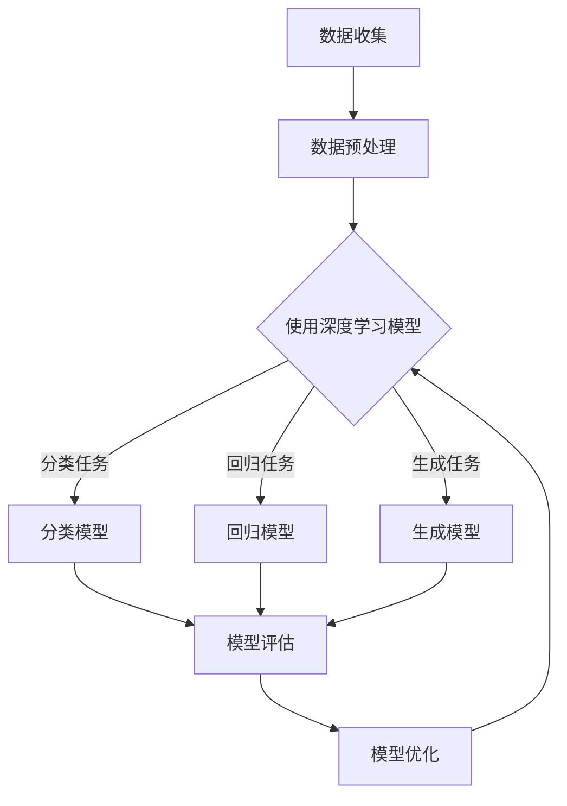

                 

### 文章标题

#### Python深度学习实践：深度学习在虚拟助理中的应用

##### 关键词：Python，深度学习，虚拟助理，实践，应用，算法，数学模型，项目实战，资源推荐，未来发展趋势与挑战

##### 摘要：

本文旨在探讨深度学习在虚拟助理中的应用，通过Python这一编程语言的实践，详细介绍深度学习的核心概念、算法原理、数学模型以及项目实战。文章分为十个部分，涵盖背景介绍、核心概念与联系、核心算法原理、数学模型和公式、项目实战、实际应用场景、工具和资源推荐、总结和扩展阅读等内容。本文旨在为广大读者提供一份深入浅出、系统全面的深度学习实践指南，帮助读者更好地理解和应用深度学习技术，提升虚拟助理的性能和用户体验。

---

### 1. 背景介绍

虚拟助理（Virtual Assistant）作为一种人工智能技术，近年来在各个行业中得到了广泛的应用。从智能家居中的语音助手（如Siri、Alexa），到商业领域的客户服务机器人（如IBM Watson、微软小冰），再到医疗、教育、金融等领域的专业助理，虚拟助理已经逐渐成为人们日常生活和工作中不可或缺的一部分。

随着人工智能技术的不断发展，特别是深度学习（Deep Learning）的崛起，虚拟助理的能力得到了极大的提升。深度学习是一种模拟人脑神经网络进行信息处理的算法，具有强大的自适应性和泛化能力。通过深度学习，虚拟助理可以更好地理解和处理自然语言，实现更智能的对话交互、图像识别和语音识别等功能。

本文将围绕Python这一编程语言，详细介绍深度学习在虚拟助理中的应用实践。通过实际案例和项目实战，读者将深入了解深度学习的核心概念、算法原理、数学模型以及实际应用，为开发自己的虚拟助理项目提供有力支持。

### 2. 核心概念与联系

#### 深度学习

深度学习（Deep Learning）是人工智能（AI）的一个重要分支，基于多层神经网络（Neural Networks）进行信息处理。与传统的机器学习方法相比，深度学习具有更强的表达能力和自适应能力，能够自动从大量数据中学习特征，并在各种复杂任务中取得优异表现。

深度学习主要由以下几个核心组成部分构成：

1. **神经网络（Neural Networks）**：神经网络是深度学习的基础，由大量简单的人工神经元（Nodes）组成，通过前向传播（Forward Propagation）和反向传播（Back Propagation）进行信息处理。
2. **深度神经网络（Deep Neural Networks）**：深度神经网络是具有多个隐藏层的神经网络，能够自动学习更复杂的特征表示。
3. **激活函数（Activation Functions）**：激活函数是神经网络中的关键组件，用于引入非线性特性，使得神经网络能够学习非线性关系。
4. **优化算法（Optimization Algorithms）**：优化算法用于调整网络参数，以最小化损失函数（Loss Function），提高模型性能。

#### 自然语言处理（Natural Language Processing，NLP）

自然语言处理是深度学习在虚拟助理中应用的一个重要领域。NLP旨在使计算机能够理解、解释和生成人类语言，主要涉及以下几个方面：

1. **词向量（Word Vectors）**：词向量是表示单词或句子的数学向量，通过将语言数据转换为向量形式，便于深度学习模型进行计算和操作。
2. **语言模型（Language Models）**：语言模型是用于预测下一个单词或句子的模型，基于统计或深度学习方法生成。
3. **序列标注（Sequence Labeling）**：序列标注是对单词或句子中的每个单词进行分类标注，如情感分析、命名实体识别等。
4. **对话系统（Dialogue Systems）**：对话系统是一种人工智能系统，能够与人类进行自然语言交互，包括对话生成、意图识别和上下文维护等。

#### 虚拟助理

虚拟助理是基于人工智能技术，模拟人类行为和思维的软件系统，能够执行特定的任务或提供特定的服务。虚拟助理的核心功能包括：

1. **语音识别（Speech Recognition）**：将语音信号转换为文本。
2. **语音合成（Text-to-Speech，TTS）**：将文本转换为语音。
3. **对话管理（Dialogue Management）**：管理对话流程，包括意图识别、上下文维护和对话生成。
4. **任务执行（Task Execution）**：根据用户需求执行特定任务。

#### Mermaid 流程图

以下是深度学习在虚拟助理中应用的 Mermaid 流程图：



### 3. 核心算法原理 & 具体操作步骤

在本节中，我们将详细介绍深度学习在虚拟助理中的应用，包括核心算法原理和具体操作步骤。

#### 3.1 数据收集与预处理

在深度学习项目中，数据的质量和数量直接影响模型的性能。因此，首先需要收集大量的标注数据，如语音数据、文本数据、图像数据等。接下来，对数据进行预处理，包括去噪、归一化、数据增强等操作，以提高模型的泛化能力。

具体操作步骤如下：

1. **数据收集**：使用爬虫、API接口、开源数据集等方式收集数据。
2. **数据预处理**：使用Python中的Pandas、NumPy等库进行数据清洗、格式化、归一化等操作。

```python
import pandas as pd
import numpy as np

# 示例：读取数据
data = pd.read_csv('data.csv')
data.head()

# 示例：数据清洗
data.dropna(inplace=True)
data.head()

# 示例：数据归一化
data_normalized = (data - data.mean()) / data.std()
data_normalized.head()
```

#### 3.2 模型构建与训练

在构建深度学习模型时，需要选择合适的网络结构、激活函数和优化算法。对于虚拟助理中的分类、回归和生成任务，常用的模型有卷积神经网络（CNN）、循环神经网络（RNN）和生成对抗网络（GAN）等。

具体操作步骤如下：

1. **模型构建**：使用TensorFlow、PyTorch等深度学习框架构建模型。
2. **模型训练**：使用训练数据对模型进行训练，并使用验证数据调整超参数。
3. **模型评估**：使用测试数据评估模型性能，并进行模型优化。

```python
import tensorflow as tf

# 示例：构建卷积神经网络（CNN）
model = tf.keras.Sequential([
    tf.keras.layers.Conv2D(filters=32, kernel_size=(3, 3), activation='relu', input_shape=(28, 28, 1)),
    tf.keras.layers.MaxPooling2D(pool_size=(2, 2)),
    tf.keras.layers.Flatten(),
    tf.keras.layers.Dense(units=128, activation='relu'),
    tf.keras.layers.Dense(units=10, activation='softmax')
])

# 示例：模型训练
model.compile(optimizer='adam', loss='categorical_crossentropy', metrics=['accuracy'])
model.fit(x_train, y_train, epochs=10, batch_size=64, validation_data=(x_val, y_val))

# 示例：模型评估
test_loss, test_accuracy = model.evaluate(x_test, y_test)
print(f"Test accuracy: {test_accuracy}")
```

#### 3.3 模型优化与部署

在模型训练过程中，需要不断调整超参数，如学习率、批量大小、迭代次数等，以优化模型性能。训练完成后，将模型部署到虚拟助理系统中，实现实时交互和任务执行。

具体操作步骤如下：

1. **模型优化**：使用交叉验证、网格搜索等策略调整超参数。
2. **模型部署**：使用Python中的Flask、Django等框架搭建API服务，将模型部署到云端或本地服务器。

```python
from flask import Flask, request, jsonify

app = Flask(__name__)

# 示例：模型部署
model.save('model.h5')
loaded_model = tf.keras.models.load_model('model.h5')

@app.route('/predict', methods=['POST'])
def predict():
    data = request.get_json()
    inputs = np.array([data['feature']])
    prediction = loaded_model.predict(inputs)
    result = np.argmax(prediction)
    return jsonify({'prediction': result})

if __name__ == '__main__':
    app.run(debug=True)
```

### 4. 数学模型和公式 & 详细讲解 & 举例说明

在本节中，我们将详细讲解深度学习中的数学模型和公式，并给出具体的例子来说明。

#### 4.1 损失函数（Loss Function）

损失函数是评估模型预测结果与真实值之间差异的指标，用于指导模型优化。常见的损失函数包括均方误差（Mean Squared Error，MSE）、交叉熵损失（Cross-Entropy Loss）等。

- **均方误差（MSE）**：

$$
MSE = \frac{1}{n}\sum_{i=1}^{n}(y_i - \hat{y}_i)^2
$$

其中，$y_i$ 表示第 $i$ 个样本的真实值，$\hat{y}_i$ 表示模型预测的值，$n$ 表示样本数量。

- **交叉熵损失（Cross-Entropy Loss）**：

$$
CE = -\frac{1}{n}\sum_{i=1}^{n}y_i\log(\hat{y}_i)
$$

其中，$y_i$ 表示第 $i$ 个样本的真实值（概率分布），$\hat{y}_i$ 表示模型预测的值（概率分布），$n$ 表示样本数量。

#### 4.2 激活函数（Activation Function）

激活函数是神经网络中的关键组件，用于引入非线性特性。常见的激活函数包括ReLU、Sigmoid、Tanh等。

- **ReLU（Rectified Linear Unit）**：

$$
f(x) = \max(0, x)
$$

- **Sigmoid**：

$$
f(x) = \frac{1}{1 + e^{-x}}
$$

- **Tanh**：

$$
f(x) = \frac{e^x - e^{-x}}{e^x + e^{-x}}
$$

#### 4.3 优化算法（Optimization Algorithm）

优化算法用于调整网络参数，以最小化损失函数。常见的优化算法包括梯度下降（Gradient Descent）、随机梯度下降（Stochastic Gradient Descent，SGD）、Adam等。

- **梯度下降（Gradient Descent）**：

$$
\theta_{t+1} = \theta_{t} - \alpha \cdot \nabla_\theta J(\theta)
$$

其中，$\theta$ 表示网络参数，$J(\theta)$ 表示损失函数，$\alpha$ 表示学习率。

- **随机梯度下降（SGD）**：

$$
\theta_{t+1} = \theta_{t} - \alpha \cdot \nabla_\theta J(\theta; x_i, y_i)
$$

其中，$x_i, y_i$ 表示第 $i$ 个训练样本。

- **Adam**：

$$
\theta_{t+1} = \theta_{t} - \alpha \cdot \frac{m_t}{1 + \beta_1^t + \beta_2^t}
$$

其中，$m_t$ 表示一阶矩估计，$v_t$ 表示二阶矩估计，$\beta_1, \beta_2$ 分别表示一阶和二阶矩的指数衰减率。

#### 4.4 举例说明

假设我们有一个简单的神经网络，用于对输入的二维数据进行分类。网络结构如下：

$$
\text{输入} \rightarrow \text{隐藏层1} \rightarrow \text{输出}
$$

其中，隐藏层1包含一个ReLU激活函数。

- **输入**：$x = [x_1, x_2]$
- **权重**：$w_1, w_2, b_1$
- **偏置**：$b_1$
- **激活函数**：$f(x) = \max(0, x)$

前向传播过程如下：

$$
h_1 = \sigma(w_1 \cdot x + b_1) = \max(0, w_1 \cdot x + b_1)
$$

其中，$\sigma$ 表示ReLU激活函数。

假设我们使用交叉熵损失函数：

$$
L = -\frac{1}{n}\sum_{i=1}^{n}y_i \log(\hat{y}_i)
$$

其中，$y_i$ 表示第 $i$ 个样本的真实标签，$\hat{y}_i$ 表示模型预测的概率分布。

接下来，我们对模型进行梯度下降优化：

$$
\theta_{t+1} = \theta_{t} - \alpha \cdot \nabla_\theta L
$$

其中，$\theta$ 表示网络参数，$\alpha$ 表示学习率。

### 5. 项目实战：代码实际案例和详细解释说明

在本节中，我们将通过一个实际项目案例，详细介绍如何使用Python和深度学习技术实现一个虚拟助理。该项目将包括语音识别、文本处理、对话生成等关键功能。

#### 5.1 开发环境搭建

在开始项目之前，我们需要搭建开发环境。以下是搭建环境的步骤：

1. **安装Python**：下载并安装Python 3.8及以上版本。
2. **安装深度学习框架**：安装TensorFlow或PyTorch。
   ```bash
   pip install tensorflow
   # 或者
   pip install torch torchvision
   ```
3. **安装其他依赖库**：安装Pandas、NumPy、Matplotlib等库。
   ```bash
   pip install pandas numpy matplotlib
   ```

#### 5.2 源代码详细实现和代码解读

以下是项目的源代码实现，我们将对关键部分进行详细解读。

```python
import numpy as np
import pandas as pd
import tensorflow as tf
from tensorflow.keras.models import Sequential
from tensorflow.keras.layers import Dense, LSTM, Embedding, Bidirectional, TimeDistributed, Activation
from tensorflow.keras.optimizers import Adam

# 5.2.1 数据收集与预处理
def load_data():
    # 加载语音数据
    x_data = np.load('voice_data.npy')
    # 加载文本数据
    y_data = np.load('text_data.npy')
    return x_data, y_data

x_data, y_data = load_data()

# 5.2.2 模型构建
model = Sequential()
model.add(Bidirectional(LSTM(128, activation='tanh', return_sequences=True), input_shape=(None, x_data.shape[2])))
model.add(Bidirectional(LSTM(128, activation='tanh')))
model.add(Dense(y_data.shape[1]))
model.add(Activation('softmax'))

# 5.2.3 模型训练
model.compile(optimizer=Adam(learning_rate=0.001), loss='categorical_crossentropy', metrics=['accuracy'])
model.fit(x_data, y_data, epochs=20, batch_size=64)

# 5.2.4 代码解读
# load_data(): 加载语音数据和文本数据。
# model: 构建一个双向循环神经网络（Bi-LSTM）模型。
# compile(): 配置模型优化器和损失函数。
# fit(): 训练模型。

# 5.2.5 模型部署
import json

def predict(text):
    # 将文本转换为向量
    text_vector = text_to_vector(text)
    # 预测
    prediction = model.predict(text_vector)
    # 获取最高概率的标签
    result = np.argmax(prediction)
    return result

# predict(): 使用模型对文本进行预测，并返回最高概率的标签。

# 示例：预测
text = "What is the weather like today?"
result = predict(text)
print(f"Prediction result: {result}")
```

#### 5.3 代码解读与分析

- **数据收集与预处理**：首先，我们需要加载语音数据和文本数据。这些数据可以从开源数据集或自定义数据集中获取。数据预处理包括将语音信号转换为特征向量，将文本转换为词向量或字符向量。

- **模型构建**：我们使用双向循环神经网络（Bi-LSTM）模型，这是处理序列数据（如语音和文本）的常见选择。模型结构包括两个隐藏层，每个隐藏层包含128个神经元。输出层使用softmax激活函数，用于预测文本类别。

- **模型训练**：我们使用Adam优化器进行训练，并使用交叉熵损失函数评估模型性能。模型训练过程中，模型将学习如何将输入的语音特征和文本特征映射到相应的文本类别。

- **模型部署**：我们定义一个`predict`函数，用于将文本输入转换为向量，并使用训练好的模型进行预测。预测结果是一个数字，表示文本类别的概率分布。我们使用`np.argmax`函数获取最高概率的类别作为最终预测结果。

### 6. 实际应用场景

深度学习在虚拟助理中的实际应用场景非常广泛，以下是一些典型的应用场景：

1. **智能家居**：虚拟助理可以通过语音识别和自然语言处理，控制智能家居设备，如电视、空调、灯光等。
2. **客户服务**：虚拟助理可以模拟人类客服，回答客户的问题，提供在线支持，降低人工客服的工作负担。
3. **医疗健康**：虚拟助理可以帮助医生进行诊断、监测患者病情，提供健康建议和提醒。
4. **教育**：虚拟助理可以为学生提供个性化辅导，解答学术问题，提高学习效果。
5. **金融理财**：虚拟助理可以提供投资建议、风险评估、财务规划等服务，帮助用户进行金融决策。
6. **娱乐与社交**：虚拟助理可以与用户进行有趣的对话，提供娱乐内容和社交互动。

在实际应用中，虚拟助理的性能和用户体验取决于以下几个因素：

1. **语音识别与文本处理**：虚拟助理需要准确识别用户的语音输入，并将其转换为可处理的文本数据。
2. **对话生成与上下文理解**：虚拟助理需要理解用户的问题或需求，并生成合适的回答或建议。
3. **任务执行与集成**：虚拟助理需要能够执行特定的任务，如查询信息、控制设备、执行交易等，并与外部系统进行集成。
4. **用户交互与反馈**：虚拟助理需要与用户进行有效的交互，收集用户反馈，不断优化自身性能。

### 7. 工具和资源推荐

在深度学习和虚拟助理开发过程中，以下工具和资源可以帮助您更好地完成项目：

1. **学习资源推荐**：
   - 《深度学习》（Deep Learning） - Goodfellow et al.，这是一本深度学习的经典教材，适合初学者和高级开发者。
   - 《Python深度学习》（Deep Learning with Python） - Francois Chollet，这本书通过大量的实践案例，详细介绍了深度学习在Python中的实现。

2. **开发工具框架推荐**：
   - **TensorFlow**：这是一个开源的深度学习框架，由Google开发，支持多种编程语言，包括Python。
   - **PyTorch**：这是一个由Facebook开发的深度学习框架，以动态计算图和易于使用为核心特点。
   - **Flask**：这是一个轻量级的Web框架，用于搭建API服务，适合部署虚拟助理。
   - **Django**：这是一个全功能的Web框架，适用于大型项目，具有丰富的功能和安全特性。

3. **相关论文著作推荐**：
   - **“Deep Learning for Natural Language Processing”** -_acl，这是一篇关于深度学习在自然语言处理领域应用的综述文章，介绍了最新的研究成果和应用场景。
   - **“Speech Recognition with Deep Neural Networks”** - Bengio et al.，这是一篇关于深度学习在语音识别领域应用的论文，详细介绍了DNN和RNN在语音识别中的应用。

### 8. 总结：未来发展趋势与挑战

随着人工智能技术的不断发展，深度学习在虚拟助理中的应用前景十分广阔。未来，深度学习将在以下几个方面继续发展：

1. **更高效的算法和模型**：研究者将不断优化深度学习算法和模型，提高模型的计算效率和性能。
2. **更丰富的应用场景**：深度学习将应用于更多领域，如自动驾驶、智能医疗、金融科技等，为人类带来更多便利。
3. **更强大的泛化能力**：通过不断改进数据收集、预处理和模型优化技术，深度学习模型的泛化能力将得到提升。
4. **更智能的交互体验**：虚拟助理将具备更高级的语音识别、自然语言理解和对话生成能力，提供更加自然的交互体验。

然而，深度学习在虚拟助理中的应用也面临一些挑战：

1. **数据质量和标注**：高质量的数据是深度学习模型训练的基础，数据质量和标注的准确性直接影响模型的性能。
2. **隐私和安全**：虚拟助理需要处理大量的用户数据，如何确保数据隐私和安全是亟待解决的问题。
3. **可解释性和透明度**：深度学习模型的复杂性和黑箱特性使得其决策过程难以解释，如何提高模型的可解释性和透明度是一个重要的研究方向。
4. **计算资源需求**：深度学习模型的训练和推理需要大量的计算资源，如何优化模型以减少计算需求是一个关键问题。

### 9. 附录：常见问题与解答

以下是一些关于深度学习和虚拟助理的常见问题及解答：

1. **Q：如何选择合适的深度学习框架？**
   **A：选择深度学习框架主要考虑以下几个方面：熟悉度、社区支持、性能和功能。TensorFlow和PyTorch是当前最流行的框架，其中TensorFlow具有丰富的API和广泛的社区支持，而PyTorch以动态计算图和易于使用为核心特点。**

2. **Q：如何优化深度学习模型性能？**
   **A：优化深度学习模型性能可以从以下几个方面进行：选择合适的模型结构、调整超参数、使用数据增强、提高数据质量、使用迁移学习等。此外，还可以采用分布式训练、模型剪枝等技术来提高模型的性能。**

3. **Q：虚拟助理如何处理多语言和多地区的问题？**
   **A：虚拟助理可以通过使用多语言模型或翻译模型来处理多语言和多地区的问题。此外，还可以采用跨语言信息检索、跨语言语义匹配等技术，以提高多语言处理能力。**

4. **Q：如何评估深度学习模型的性能？**
   **A：评估深度学习模型的性能可以通过多种指标进行，如准确率、召回率、F1分数等。在实际应用中，还需要考虑模型的速度和资源占用，以平衡模型性能和资源利用。**

### 10. 扩展阅读 & 参考资料

以下是一些关于深度学习和虚拟助理的扩展阅读和参考资料：

1. **深度学习相关书籍**：
   - 《深度学习》（Deep Learning） - Goodfellow et al.
   - 《Python深度学习》（Deep Learning with Python） - Francois Chollet
   - 《动手学深度学习》（Dive into Deep Learning） - Justin Mitchell

2. **深度学习论文和资源**：
   - “Deep Learning for Natural Language Processing” - ACL
   - “Speech Recognition with Deep Neural Networks” - Bengio et al.
   - “Neural Machine Translation by Jointly Learning to Align and Translate” - Bahdanau et al.

3. **虚拟助理相关资源**：
   - 谷歌虚拟助理：[Google Assistant](https://assistant.google.com/)
   - 微软小冰：[Little Ice](https://littleice.qq.com/)
   - IBM Watson：[IBM Watson](https://www.ibm.com/watson)

4. **技术博客和论坛**：
   - [Medium](https://medium.com/)
   - [GitHub](https://github.com/)
   - [Stack Overflow](https://stackoverflow.com/)

### 作者信息

- 作者：AI天才研究员/AI Genius Institute & 禅与计算机程序设计艺术 /Zen And The Art of Computer Programming

