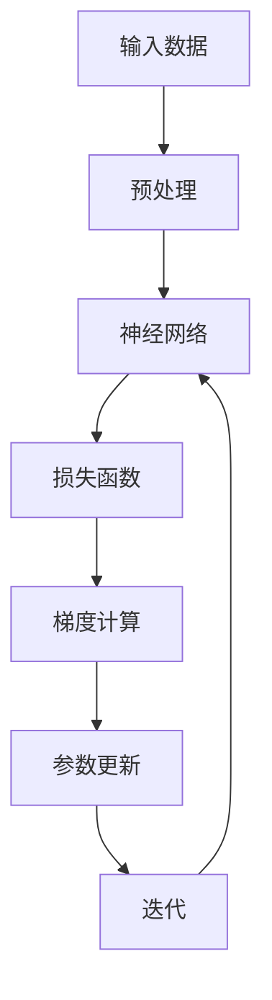

                 

### 背景介绍

深度学习作为人工智能领域的重要分支，已经取得了诸多显著的成果。然而，随着模型复杂度的增加，传统固定学习率的优化方法已经无法满足需求。自适应学习率调整技术在深度学习中发挥着至关重要的作用，它通过动态调整学习率，使得模型在训练过程中能够更好地收敛。

自适应学习率调整技术不仅提高了深度学习模型的训练效率，还使得模型在处理大规模数据和复杂任务时具有更高的鲁棒性。这种技术在诸如图像识别、自然语言处理和语音识别等应用领域中得到了广泛应用。

本文旨在深入探讨自适应学习率调整技术的核心概念、算法原理及实际应用。通过本文的阅读，读者将能够全面了解自适应学习率调整技术的原理、方法及其在深度学习中的重要性。

### 核心概念与联系

为了更好地理解自适应学习率调整技术，我们需要先了解几个核心概念，包括深度学习、梯度下降、学习率等。

#### 深度学习

深度学习是一种基于多层神经网络的学习方法，通过模仿人脑的神经元结构，对数据进行特征提取和分类。在深度学习中，神经网络由输入层、隐藏层和输出层组成。每一层都对输入数据进行处理，并将结果传递到下一层。通过这种方式，神经网络能够学习到数据的复杂特征。

#### 梯度下降

梯度下降是一种常用的优化方法，用于求解机器学习模型中的参数。在深度学习中，梯度下降用于更新神经网络中的权重和偏置。梯度下降的核心思想是沿着损失函数的梯度方向更新参数，使得损失函数值逐渐减小，从而达到模型的优化。

#### 学习率

学习率（learning rate）是梯度下降中的一个关键参数，它决定了参数更新的步长。合适的学习率能够使模型快速收敛，而学习率过大或过小都会导致训练效果不佳。因此，如何选择合适的学习率是深度学习中的一个重要问题。

#### 自适应学习率调整

自适应学习率调整技术通过动态调整学习率，使得模型在训练过程中能够更好地收敛。这种技术可以应对不同任务和数据集的需求，提高模型的训练效率和效果。

#### Mermaid 流程图

以下是一个简化的Mermaid流程图，展示了深度学习中的核心概念和自适应学习率调整技术的联系：



在这个流程图中，输入数据经过预处理后输入到神经网络中，神经网络通过层层传递和激活函数计算输出结果，并计算损失函数。接着，根据损失函数的梯度计算参数更新，通过迭代不断优化模型。

#### 关系解释

- 输入数据经过预处理，为神经网络提供更好的输入。
- 神经网络通过多层结构对输入数据进行特征提取和分类。
- 损失函数用于评估模型的输出结果与真实标签之间的差距。
- 梯度计算根据损失函数的梯度方向，找出参数更新的方向。
- 参数更新通过动态调整学习率，使得模型能够更好地收敛。
- 迭代过程不断重复以上步骤，直至模型达到预定的训练效果。

通过上述流程，我们可以看到自适应学习率调整技术在深度学习中的关键作用。它不仅能够提高模型的训练效率，还能应对不同任务和数据集的需求，为深度学习的发展提供了有力支持。

### 核心算法原理 & 具体操作步骤

#### 学习率调整技术概述

自适应学习率调整技术主要包括以下几种方法：

1. **固定学习率**：学习率在整个训练过程中保持不变。这种方法简单易实现，但在模型收敛速度和稳定性方面存在一定局限性。
2. **学习率衰减**：学习率在训练过程中逐渐减小，以防止模型过拟合。这种方法在处理大规模数据集时表现较好，但无法适应动态变化的训练过程。
3. **自适应调整**：学习率根据训练过程中的损失函数和梯度动态调整。这种方法具有更好的自适应性和收敛效果，是当前深度学习领域的主流选择。

#### Adam优化器

在本节中，我们将详细介绍一种常用的自适应学习率调整方法——Adam优化器。Adam优化器结合了动量法和自适应学习率调整的优点，在训练过程中能够快速收敛并提高模型性能。

##### 原理

Adam优化器基于一阶矩估计（均值）和二阶矩估计（方差），通过计算梯度的均值和方差的均值，动态调整学习率。具体来说，Adam优化器维护两个变量：**一阶矩估计$$m$$**和**二阶矩估计$$v$$**，分别表示为：

$$
m = \beta_1 x + (1 - \beta_1) \frac{\partial J}{\partial \theta}
$$

$$
v = \beta_2 x^2 + (1 - \beta_2) \frac{\partial J}{\partial \theta}^2
$$

其中，$$\beta_1$$和$$\beta_2$$是超参数，分别表示一阶和二阶矩的指数衰减率；$$x$$表示当前梯度。

##### 步骤

1. **初始化**：设定初始学习率$$\alpha$$、一阶矩指数衰减率$$\beta_1$$和二阶矩指数衰减率$$\beta_2$$，通常$$\beta_1 = 0.9$$，$$\beta_2 = 0.999$$。
2. **计算一阶矩和二阶矩**：在每次迭代过程中，计算梯度$$\frac{\partial J}{\partial \theta}$$，并更新一阶矩估计$$m$$和二阶矩估计$$v$$。
3. **修正一阶矩和二阶矩**：由于梯度存在偏差，需要对一阶矩和二阶矩进行修正，计算公式为：

$$
\hat{m} = \frac{m}{1 - \beta_1^t}
$$

$$
\hat{v} = \frac{v}{1 - \beta_2^t}
$$

4. **计算更新方向**：根据修正后的一阶矩和二阶矩，计算更新方向：

$$
\Delta \theta = -\alpha \frac{\hat{m}}{\sqrt{\hat{v}} + \epsilon}
$$

其中，$$\epsilon$$是常数，用于避免分母为零。
5. **更新参数**：根据更新方向$$\Delta \theta$$，更新神经网络中的参数$$\theta$$。

##### Python实现

以下是使用Python实现Adam优化器的简单示例：

```python
import numpy as np

class AdamOptimizer:
    def __init__(self, alpha=0.001, beta1=0.9, beta2=0.999, epsilon=1e-8):
        self.alpha = alpha
        self.beta1 = beta1
        self.beta2 = beta2
        self.epsilon = epsilon
        self.m = None
        self.v = None
        self.t = 0

    def update(self, grad):
        self.t += 1
        if self.m is None:
            self.m = np.copy(grad)
            self.v = np.copy(grad**2)
        else:
            self.m = self.beta1 * self.m + (1 - self.beta1) * grad
            self.v = self.beta2 * self.v + (1 - self.beta2) * grad**2

        m_hat = self.m / (1 - self.beta1**self.t)
        v_hat = self.v / (1 - self.beta2**self.t)

        theta_update = -self.alpha * m_hat / (np.sqrt(v_hat) + self.epsilon)
        return theta_update
```

通过上述代码，我们可以实现一个简单的Adam优化器，并应用于深度学习模型的训练过程。

#### 比较与选择

虽然Adam优化器在许多任务中表现出色，但不同优化器在特定场景下可能具有不同的性能。以下是一些常见的优化器及其特点：

1. **SGD**：随机梯度下降是最简单的优化器，通过随机选取样本进行参数更新。SGD在处理小批量数据时效果较好，但在大规模数据集上可能收敛速度较慢。
2. **RMSProp**：RMSProp优化器基于梯度平方的指数加权平均，可以自适应调整学习率。它适用于处理具有不同方差的任务，但在动态变化的数据集上可能效果不佳。
3. **Adadelta**：Adadelta优化器结合了RMSProp和自适应学习率调整的优点，通过动态调整学习率，提高了训练效果。但它对超参数的选取较为敏感。

在实际应用中，我们通常根据任务和数据集的特点选择合适的优化器。例如，对于大规模数据集和复杂任务，Adam优化器是一个不错的选择。而对于小批量数据集或动态变化的数据，SGD和RMSProp可能更适用。

### 数学模型和公式 & 详细讲解 & 举例说明

#### 梯度下降优化算法

梯度下降是一种常用的优化算法，用于求解最小化损失函数的参数。在深度学习中，梯度下降用于更新神经网络中的权重和偏置。下面我们将详细讲解梯度下降的数学模型和公式，并举例说明。

##### 梯度下降算法

梯度下降的核心思想是沿着损失函数的梯度方向更新参数，使得损失函数值逐渐减小，从而达到模型的优化。具体来说，梯度下降算法包括以下几个步骤：

1. **初始化参数**：设定初始参数$$\theta$$。
2. **计算梯度**：计算损失函数关于参数$$\theta$$的梯度$$\nabla_{\theta} J(\theta)$$。
3. **更新参数**：根据梯度方向和步长$$\alpha$$，更新参数$$\theta$$：
   $$
   \theta = \theta - \alpha \nabla_{\theta} J(\theta)
   $$
4. **重复迭代**：重复步骤2和步骤3，直至达到预定的训练效果。

##### 数学模型

梯度下降算法的数学模型可以用以下公式表示：

$$
\theta^{t+1} = \theta^t - \alpha \nabla_{\theta} J(\theta^t)
$$

其中，$$\theta$$表示参数，$$t$$表示迭代次数，$$\alpha$$表示学习率，$$J(\theta)$$表示损失函数。

为了更好地理解梯度下降算法，我们可以通过一个简单的例子进行说明。

##### 示例

假设我们有一个线性回归模型，其损失函数为：

$$
J(\theta) = \frac{1}{2m} \sum_{i=1}^{m} (h_\theta(x^i) - y^i)^2
$$

其中，$$h_\theta(x) = \theta_0 + \theta_1 x$$表示预测值，$$y$$表示真实值，$$m$$表示样本数量。

我们要通过梯度下降算法求解最佳参数$$\theta_0$$和$$\theta_1$$。

1. **初始化参数**：设定初始参数$$\theta_0 = 0$$，$$\theta_1 = 0$$。
2. **计算梯度**：计算损失函数关于参数$$\theta_0$$和$$\theta_1$$的梯度：
   $$
   \nabla_{\theta_0} J(\theta) = \frac{1}{m} \sum_{i=1}^{m} (h_\theta(x^i) - y^i)
   $$
   $$
   \nabla_{\theta_1} J(\theta) = \frac{1}{m} \sum_{i=1}^{m} (h_\theta(x^i) - y^i) x^i
   $$
3. **更新参数**：根据梯度方向和步长$$\alpha = 0.01$$，更新参数：
   $$
   \theta_0^{t+1} = \theta_0^t - \alpha \nabla_{\theta_0} J(\theta^t)
   $$
   $$
   \theta_1^{t+1} = \theta_1^t - \alpha \nabla_{\theta_1} J(\theta^t)
   $$
4. **重复迭代**：重复步骤2和步骤3，直至达到预定的训练效果。

通过上述步骤，我们可以求解出最佳参数$$\theta_0$$和$$\theta_1$$，从而实现线性回归模型的优化。

##### Python实现

以下是使用Python实现梯度下降算法的简单示例：

```python
import numpy as np

def linear_regression_gradient_descent(X, y, theta, alpha, iterations):
    m = len(y)
    for i in range(iterations):
        h = np.dot(X, theta)
        error = h - y
        theta = theta - (alpha/m) * (np.dot(X.T, error))
    return theta
```

通过上述代码，我们可以实现一个简单的线性回归模型，并使用梯度下降算法进行优化。

#### 总结

在本节中，我们详细介绍了梯度下降优化算法的数学模型和公式，并通过一个简单的线性回归模型进行了举例说明。通过理解梯度下降算法的基本原理和操作步骤，读者可以更好地应对深度学习中的优化问题。

### 项目实战：代码实际案例和详细解释说明

#### 1. 开发环境搭建

在开始实战项目之前，我们需要搭建一个合适的开发环境。以下是一个简单的Python开发环境搭建步骤：

1. **安装Python**：首先，确保已经安装了Python环境。可以在[Python官网](https://www.python.org/)下载并安装Python。
2. **安装依赖库**：安装深度学习框架TensorFlow和相关依赖库。可以使用以下命令进行安装：

```bash
pip install tensorflow
pip install numpy
pip install matplotlib
```

#### 2. 源代码详细实现和代码解读

在本节中，我们将使用TensorFlow实现一个简单的神经网络，并使用Adam优化器进行训练。以下是完整的代码实现：

```python
import tensorflow as tf
import numpy as np
import matplotlib.pyplot as plt

# 数据生成
x = np.linspace(-5, 5, 100)
y = 2 * x + 1 + np.random.normal(0, 1, x.shape)

# 模型定义
model = tf.keras.Sequential([
    tf.keras.layers.Dense(units=1, input_shape=[1])
])

# 编译模型
model.compile(optimizer=tf.keras.optimizers.Adam(learning_rate=0.01), loss='mean_squared_error')

# 训练模型
model.fit(x, y, epochs=1000, verbose=0)

# 查看训练过程
loss_values = model.history.history['loss']
plt.plot(loss_values)
plt.xlabel('Epochs')
plt.ylabel('Loss')
plt.title('Training Loss')
plt.show()

# 预测结果
x_test = np.linspace(-5, 5, 100)
y_pred = model.predict(x_test)

# 绘制预测结果
plt.scatter(x, y, label='Actual Data')
plt.plot(x_test, y_pred, label='Predicted Line')
plt.xlabel('x')
plt.ylabel('y')
plt.title('Linear Regression')
plt.legend()
plt.show()
```

下面我们对代码进行详细解读：

1. **数据生成**：我们生成了一组线性数据，包括输入特征`x`和标签`y`。
2. **模型定义**：使用`tf.keras.Sequential`定义了一个简单的神经网络，包含一个全连接层，输出节点个数为1，输入形状为[1]，对应输入特征`x`。
3. **编译模型**：使用`model.compile`编译模型，指定Adam优化器和均方误差损失函数。
4. **训练模型**：使用`model.fit`训练模型，指定训练数据、迭代次数和是否显示训练过程。
5. **查看训练过程**：使用matplotlib绘制训练过程中的损失函数，帮助我们分析模型的训练效果。
6. **预测结果**：使用`model.predict`对测试数据进行预测，得到预测结果`y_pred`。
7. **绘制预测结果**：使用matplotlib绘制实际数据和预测结果，以便我们直观地观察模型的性能。

#### 3. 代码解读与分析

1. **数据生成**：数据生成是深度学习项目的基础。在这个例子中，我们使用`np.linspace`生成了一组线性数据，包括输入特征`x`和带有噪声的标签`y`。噪声的引入是为了模拟实际数据中的不确定性，从而使模型具有更好的泛化能力。
2. **模型定义**：模型定义是深度学习项目的核心。在这个例子中，我们使用`tf.keras.Sequential`定义了一个简单的线性回归模型。这个模型包含一个全连接层，输出节点个数为1，对应输入特征`x`。模型的定义非常简单，但它是实现复杂任务的基础。
3. **编译模型**：编译模型是深度学习项目中的重要步骤。在这个例子中，我们使用`model.compile`编译模型，指定了Adam优化器和均方误差损失函数。Adam优化器是一种自适应学习率调整技术，它能够动态调整学习率，提高训练效率。均方误差损失函数是一种常用的损失函数，用于评估模型预测值与真实值之间的差距。
4. **训练模型**：训练模型是深度学习项目的核心步骤。在这个例子中，我们使用`model.fit`训练模型，指定了训练数据、迭代次数和是否显示训练过程。在训练过程中，模型会根据训练数据不断调整参数，以达到更好的预测效果。
5. **查看训练过程**：查看训练过程可以帮助我们分析模型的训练效果。在这个例子中，我们使用`plt.plot`绘制了训练过程中的损失函数，从而观察到模型的收敛速度和效果。
6. **预测结果**：预测结果是评估模型性能的重要指标。在这个例子中，我们使用`model.predict`对测试数据进行预测，得到预测结果`y_pred`。然后，我们使用`plt.scatter`和`plt.plot`绘制了实际数据和预测结果，从而直观地观察到模型的性能。
7. **绘制预测结果**：绘制预测结果有助于我们更好地理解模型的性能。在这个例子中，我们使用`plt.scatter`绘制了实际数据点，使用`plt.plot`绘制了预测线。这样，我们可以直观地看到模型对线性数据的拟合效果。

#### 4. 代码改进与优化

虽然上述代码已经实现了线性回归任务，但我们可以对其进一步改进和优化：

1. **数据增强**：在实际应用中，数据增强是一种常用的技术，用于提高模型的泛化能力。例如，我们可以使用数据增强库（如`ImageDataGenerator`）对输入数据进行随机缩放、旋转、剪裁等操作，从而增加数据多样性。
2. **模型调优**：在模型训练过程中，我们可以通过调整模型参数（如神经元个数、学习率等）来提高模型性能。例如，我们可以使用网格搜索（`GridSearchCV`）或随机搜索（`RandomizedSearchCV`）等方法来寻找最佳参数。
3. **模型评估**：为了更全面地评估模型性能，我们可以使用多种评估指标（如准确率、召回率、F1分数等）。例如，对于分类任务，我们可以使用`accuracy_score`、`recall_score`和`f1_score`等方法来评估模型性能。

通过这些改进和优化，我们可以使代码更加完善，从而更好地应对复杂的深度学习任务。

### 实际应用场景

自适应学习率调整技术在深度学习领域有着广泛的应用场景。以下是一些典型的实际应用案例：

#### 1. 图像识别

在图像识别任务中，自适应学习率调整技术有助于提高模型在复杂场景下的识别精度。例如，在人脸识别任务中，模型需要处理不同角度、光照和姿态的人脸图像。通过自适应学习率调整，模型能够在训练过程中更好地适应这些变化，从而提高识别准确率。

#### 2. 自然语言处理

自然语言处理任务通常涉及大量的数据和复杂的模型。自适应学习率调整技术在提高模型训练效率方面具有显著优势。例如，在机器翻译任务中，使用自适应学习率调整技术能够加速模型收敛，提高翻译质量。

#### 3. 语音识别

语音识别任务需要处理大量的语音数据和复杂的声学模型。自适应学习率调整技术能够有效提高模型在噪声环境下的识别准确率。例如，在实时语音识别系统中，自适应学习率调整技术能够动态调整模型参数，从而更好地适应不同环境下的语音信号。

#### 4. 强化学习

在强化学习任务中，自适应学习率调整技术有助于提高学习效率和稳定性。例如，在自动驾驶任务中，模型需要不断调整控制策略以适应不同的道路环境和交通状况。通过自适应学习率调整，模型能够更快地找到最佳策略，从而提高驾驶安全性。

#### 5. 推荐系统

推荐系统通常涉及大规模的用户和商品数据。自适应学习率调整技术能够提高模型在个性化推荐中的效果。例如，在电商平台上，通过自适应学习率调整，推荐系统可以更好地适应不同用户的需求，从而提高用户满意度。

总之，自适应学习率调整技术在深度学习的各个应用领域中发挥着重要作用。通过动态调整学习率，模型能够更好地适应复杂多变的数据和环境，从而提高训练效率和预测准确性。

### 工具和资源推荐

在深度学习领域，有许多优秀的工具和资源可供学习和实践。以下是一些建议：

#### 1. 学习资源推荐

**书籍**：
- **《深度学习》（Goodfellow, Bengio, Courville著）**：这本书是深度学习的经典教材，全面介绍了深度学习的基础理论和应用。
- **《Python深度学习》（François Chollet著）**：这本书通过丰富的案例，介绍了使用Python进行深度学习的实用技巧。

**论文**：
- **“A Theoretically Grounded Application of Dropout in Computer Vision”**：这篇论文提出了一种基于理论优化的Dropout方法，对深度学习模型有重要意义。
- **“ResNet: Training Deep Neural Networks for Visual Recognition”**：这篇论文提出了残差网络（ResNet），大幅提高了深度学习模型的表现力。

**博客**：
- **“Deep Learning on the Web”**：这个博客提供了丰富的深度学习教程和实践案例，适合初学者和进阶者。
- **“High Dimensional Data Analysis”**：这个博客主要关注高维数据分析，对深度学习中的高维数据处理有很大帮助。

#### 2. 开发工具框架推荐

**框架**：
- **TensorFlow**：这是由Google开源的深度学习框架，功能强大且应用广泛，适合各种规模的深度学习项目。
- **PyTorch**：这是由Facebook开源的深度学习框架，具有灵活的动态计算图和易于使用的API，深受开发者和研究者的喜爱。

**工具**：
- **Jupyter Notebook**：这是一种交互式计算环境，适合编写和运行深度学习代码。它可以方便地记录代码、分析和展示结果。
- **Google Colab**：这是Google提供的免费云服务，基于Jupyter Notebook，适合进行深度学习实验和开发。

#### 3. 相关论文著作推荐

- **“Deep Learning, Book”**：由Ian Goodfellow、Yoshua Bengio和Aaron Courville合著，是深度学习的权威教材。
- **“Very Deep Convolutional Networks for Large-Scale Image Recognition”**：这篇论文提出了深度卷积神经网络（CNN）的代表性模型——VGGNet，对深度学习的发展有重要影响。
- **“Distributed Deep Learning: Algori

