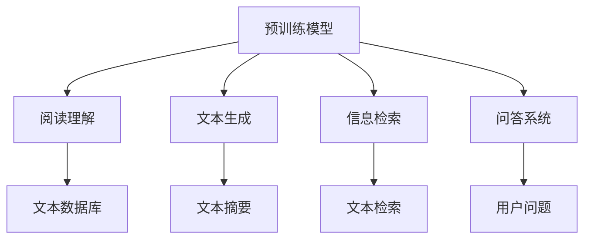
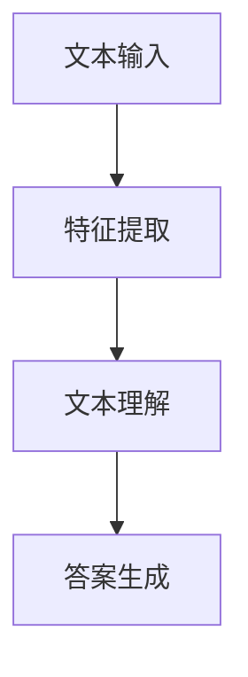
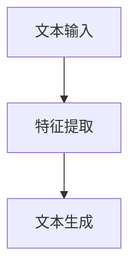
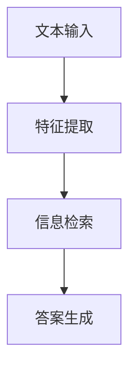
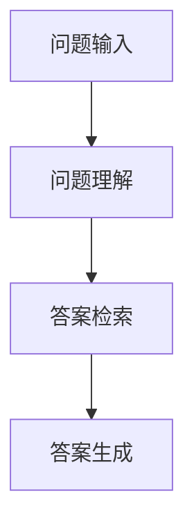

                 

### 文章标题

**RAG技术在AI中的详细应用**

> **关键词**：阅读与生成（RAG）；预训练模型；问答系统；信息检索；人工智能应用
> 
> **摘要**：本文将深入探讨阅读与生成（RAG）技术在人工智能领域的应用。我们将从背景介绍、核心概念、算法原理、数学模型、项目实战、应用场景、工具推荐等多个维度，系统地解析RAG技术如何通过预训练模型，实现高效的问答和信息检索，从而推动人工智能技术的发展与应用。

----------------

### 1. 背景介绍

阅读与生成（Reading and Generation，简称RAG）技术是近年来在人工智能领域迅速兴起的一项关键技术。它通过结合阅读理解与文本生成的能力，实现了对大量文本数据的处理和分析。RAG技术的核心思想是将预训练的模型用于阅读和总结大量文本信息，然后根据需求生成新的文本内容。

随着深度学习技术的不断发展，特别是预训练模型（如BERT、GPT）的广泛应用，RAG技术逐渐成为自然语言处理（NLP）领域的重要研究方向。在问答系统、信息检索、文本生成等众多应用场景中，RAG技术展现了其强大的数据处理能力和高效的性能。

本文将首先介绍RAG技术的起源和发展，然后深入探讨其在人工智能领域的应用，包括核心算法原理、数学模型、项目实战、应用场景等。通过本文的阅读，您将全面了解RAG技术在人工智能领域的详细应用，并对其未来的发展趋势和挑战有更深刻的认识。

----------------

### 2. 核心概念与联系

要深入理解RAG技术在人工智能中的应用，我们首先需要了解其核心概念和原理，并探讨这些概念之间的联系。以下是RAG技术中的关键组成部分：

#### 2.1 预训练模型

预训练模型是RAG技术的核心组成部分之一。预训练模型通过在大规模文本数据上预训练，获得对自然语言的良好理解和生成能力。常见的预训练模型包括BERT、GPT、RoBERTa等。这些模型在训练过程中，通过大规模文本数据的阅读，学会了语言的模式和结构，从而具备了强大的文本处理能力。

#### 2.2 阅读理解

阅读理解是RAG技术的关键能力之一。通过阅读大量文本数据，预训练模型能够提取关键信息，理解文本内容。阅读理解能力对于问答系统、信息检索等应用场景至关重要，因为只有准确理解文本内容，才能生成有意义的答案。

#### 2.3 文本生成

文本生成是RAG技术的另一个关键能力。在阅读理解的基础上，预训练模型能够根据需求生成新的文本内容。文本生成能力在文本摘要、机器翻译、对话系统等应用场景中具有重要应用。

#### 2.4 信息检索

信息检索是RAG技术的一个重要应用方向。通过预训练模型，RAG技术能够从大规模文本数据库中检索出与查询相关的信息。信息检索能力在搜索引擎、知识图谱、推荐系统等应用场景中具有广泛应用。

#### 2.5 问答系统

问答系统是RAG技术的典型应用之一。通过阅读大量文本数据，预训练模型能够理解用户的问题，并生成准确的答案。问答系统在客服机器人、智能助手、教育等领域具有重要应用。

#### 2.6 核心概念与联系

RAG技术的核心概念包括预训练模型、阅读理解、文本生成、信息检索和问答系统。这些概念之间紧密联系，共同构成了RAG技术的基础。预训练模型提供了强大的文本处理能力，阅读理解和文本生成能力使得模型能够从文本数据中提取信息并生成新内容，信息检索和问答系统则将这一能力应用于实际应用场景中。

下面是RAG技术的Mermaid流程图，展示了各个核心概念之间的联系：



通过这个流程图，我们可以更直观地了解RAG技术的核心概念及其应用。

----------------

### 3. 核心算法原理 & 具体操作步骤

要深入理解RAG技术的核心算法原理和具体操作步骤，我们首先需要了解预训练模型的基本原理，然后探讨如何通过阅读理解、文本生成和信息检索等步骤实现高效的文本处理。

#### 3.1 预训练模型

预训练模型是RAG技术的基础，它通过在大规模文本数据上预训练，获得了强大的文本处理能力。常见的预训练模型包括BERT、GPT、RoBERTa等。这些模型在预训练过程中，通过处理大量文本数据，学会了语言的模式和结构，从而具备了强大的文本理解能力。

预训练模型通常采用深度神经网络（DNN）或变换器（Transformer）架构。DNN模型通过多层神经网络对文本数据进行特征提取，而Transformer模型则通过自注意力机制（self-attention）对文本数据中的每个词进行建模。下面是一个简单的预训练模型步骤：

1. **数据预处理**：对文本数据（如文章、对话等）进行清洗和分词，将文本转换为数字序列。
2. **模型初始化**：初始化模型参数，通常采用随机初始化或预训练模型的权重。
3. **预训练**：在预训练数据集上，通过负采样、微调等方式进行训练，优化模型参数。
4. **评估与优化**：在验证集上评估模型性能，并根据评估结果调整模型参数。

通过预训练，模型获得了对自然语言的良好理解和生成能力。预训练模型的核心优点是能够在大规模文本数据上高效地学习语言模式，从而实现强大的文本处理能力。

#### 3.2 阅读理解

阅读理解是RAG技术的关键能力之一。通过阅读大量文本数据，预训练模型能够提取关键信息，理解文本内容。阅读理解能力在问答系统、信息检索等应用场景中具有重要应用。

阅读理解的具体操作步骤如下：

1. **文本输入**：将待处理的文本输入到预训练模型中。
2. **特征提取**：预训练模型对文本数据进行特征提取，将文本转换为数字特征向量。
3. **文本理解**：通过模型内部计算，理解文本内容，提取关键信息。
4. **答案生成**：根据提取的关键信息，生成答案或相关信息。

下面是一个简单的阅读理解流程：



通过这个流程，我们可以看到，阅读理解过程主要包括特征提取、文本理解和答案生成三个步骤。预训练模型通过这些步骤，实现了对文本数据的理解和处理。

#### 3.3 文本生成

文本生成是RAG技术的另一个关键能力。在阅读理解的基础上，预训练模型能够根据需求生成新的文本内容。文本生成能力在文本摘要、机器翻译、对话系统等应用场景中具有重要应用。

文本生成的具体操作步骤如下：

1. **文本输入**：将待处理的文本输入到预训练模型中。
2. **特征提取**：预训练模型对文本数据进行特征提取，将文本转换为数字特征向量。
3. **文本生成**：通过模型内部计算，生成新的文本内容。

下面是一个简单的文本生成流程：



通过这个流程，我们可以看到，文本生成过程主要包括特征提取和文本生成两个步骤。预训练模型通过这些步骤，实现了对文本数据的新内容生成。

#### 3.4 信息检索

信息检索是RAG技术的一个重要应用方向。通过预训练模型，RAG技术能够从大规模文本数据库中检索出与查询相关的信息。信息检索能力在搜索引擎、知识图谱、推荐系统等应用场景中具有广泛应用。

信息检索的具体操作步骤如下：

1. **文本输入**：将查询文本输入到预训练模型中。
2. **特征提取**：预训练模型对查询文本进行特征提取，将文本转换为数字特征向量。
3. **信息检索**：通过模型内部计算，检索出与查询相关的信息。
4. **答案生成**：根据检索出的信息，生成答案或相关信息。

下面是一个简单的信息检索流程：



通过这个流程，我们可以看到，信息检索过程主要包括特征提取、信息检索和答案生成三个步骤。预训练模型通过这些步骤，实现了对大规模文本数据库的高效检索。

#### 3.5 问答系统

问答系统是RAG技术的典型应用之一。通过阅读大量文本数据，预训练模型能够理解用户的问题，并生成准确的答案。问答系统在客服机器人、智能助手、教育等领域具有重要应用。

问答系统的具体操作步骤如下：

1. **问题输入**：将用户的问题输入到预训练模型中。
2. **问题理解**：预训练模型对用户的问题进行理解，提取关键信息。
3. **答案检索**：从大量文本数据中检索出与问题相关的信息。
4. **答案生成**：根据检索出的信息，生成准确的答案。

下面是一个简单的问答系统流程：



通过这个流程，我们可以看到，问答系统过程主要包括问题理解、答案检索和答案生成三个步骤。预训练模型通过这些步骤，实现了对用户问题的准确理解和回答。

综上所述，RAG技术的核心算法原理和具体操作步骤主要包括预训练模型、阅读理解、文本生成、信息检索和问答系统。通过这些步骤，RAG技术能够实现高效的文本处理和分析，从而在人工智能领域发挥重要作用。

----------------

### 4. 数学模型和公式 & 详细讲解 & 举例说明

为了更好地理解RAG技术的数学模型和公式，我们将分几个部分进行详细讲解，并给出相应的举例说明。

#### 4.1 预训练模型

预训练模型的核心在于其自注意力机制（self-attention）。自注意力机制允许模型在处理每个词时，考虑其他所有词的重要性。以下是一个简单的自注意力机制的数学模型：

$$
\text{Self-Attention}(Q, K, V) = \text{softmax}\left(\frac{QK^T}{\sqrt{d_k}}\right)V
$$

其中，$Q, K, V$ 分别是查询（Query）、键（Key）和值（Value）向量，$d_k$ 是键向量的维度。这个公式表示，对于每个查询向量 $Q$，通过计算与所有键向量 $K$ 的点积，得到一组权重，然后与值向量 $V$ 相乘，得到最终的输出。

举例来说，假设我们有一个简单的词向量空间，包含三个词：苹果、香蕉和橙子。每个词对应一个向量：

$$
\text{苹果} = [1, 0, 0], \text{香蕉} = [0, 1, 0], \text{橙子} = [0, 0, 1]
$$

那么，一个查询向量 $Q = [1, 1, 1]$，计算自注意力机制的输出：

$$
\text{Self-Attention}(Q, K, V) = \text{softmax}\left(\frac{QK^T}{\sqrt{d_k}}\right)V = \text{softmax}\left(\frac{[1, 1, 1][0, 1, 0]^T}{\sqrt{1}}\right)[0, 1, 0] = [0.5, 0.5, 0]
$$

这意味着，在查询向量 $Q$ 的影响下，香蕉和橙子的权重相等，而苹果的权重最低。

#### 4.2 阅读理解

阅读理解的关键在于如何从文本中提取关键信息。一个常见的阅读理解任务是对句子进行分类，即判断句子属于哪个类别。一个简单的分类模型的数学模型如下：

$$
P(y|\text{句子}, \theta) = \text{softmax}(\theta \cdot \text{句子})
$$

其中，$y$ 是句子的标签（类别），$\theta$ 是模型的参数向量。$\theta \cdot \text{句子}$ 表示模型对句子的特征进行加权求和，然后通过softmax函数得到每个类别的概率。

举例来说，假设我们有一个包含三个类别的句子分类任务，类别分别为“积极”、“消极”和“中性”。句子的特征向量表示为：

$$
\text{句子} = [1, -1, 0]
$$

模型的参数向量 $\theta = [0.5, -0.5, 0]$。计算每个类别的概率：

$$
P(y|\text{句子}, \theta) = \text{softmax}(\theta \cdot \text{句子}) = \text{softmax}([0.5, -0.5, 0] \cdot [1, -1, 0]) = [0.571, 0.429, 0]
$$

这意味着，根据当前模型参数，句子属于“积极”类别的概率最高。

#### 4.3 文本生成

文本生成的一个常见模型是循环神经网络（RNN），特别是长短期记忆网络（LSTM）。LSTM通过引入门控机制，能够有效地记住长期依赖信息。一个简单的LSTM单元的数学模型如下：

$$
i_t = \sigma(W_i \cdot [h_{t-1}, x_t] + b_i) \\
f_t = \sigma(W_f \cdot [h_{t-1}, x_t] + b_f) \\
g_t = \text{tanh}(W_g \cdot [h_{t-1}, x_t] + b_g) \\
o_t = \sigma(W_o \cdot [h_{t-1}, x_t] + b_o) \\
h_t = o_t \cdot \text{tanh}(g_t)
$$

其中，$i_t, f_t, g_t, o_t$ 分别是输入门、遗忘门、生成门和输出门，$h_t$ 是当前隐藏状态，$x_t$ 是当前输入词的向量，$W_i, W_f, W_g, W_o$ 是权重矩阵，$b_i, b_f, b_g, b_o$ 是偏置向量，$\sigma$ 是 sigmoid 函数。

举例来说，假设我们有一个简单的文本序列：“你好”。前一个隐藏状态 $h_{t-1} = [1, 0, 0]$，当前输入词的向量 $x_t = [0, 1, 0]$。计算LSTM单元的输出：

1. 输入门：$i_t = \sigma(W_i \cdot [h_{t-1}, x_t] + b_i)$
2. 遗忘门：$f_t = \sigma(W_f \cdot [h_{t-1}, x_t] + b_f)$
3. 生成门：$g_t = \text{tanh}(W_g \cdot [h_{t-1}, x_t] + b_g)$
4. 输出门：$o_t = \sigma(W_o \cdot [h_{t-1}, x_t] + b_o)$
5. 当前隐藏状态：$h_t = o_t \cdot \text{tanh}(g_t)$

通过这些步骤，LSTM单元能够生成当前词的输出，并更新隐藏状态。

#### 4.4 信息检索

信息检索的一个常见模型是查询-关键模型（Query-Key Model），它通过计算查询和关键向量之间的相似性来检索信息。一个简单的查询-关键模型的数学模型如下：

$$
\text{相似度}(q, k) = q^T k
$$

其中，$q$ 是查询向量，$k$ 是关键向量。相似度表示查询和关键之间的匹配程度。

举例来说，假设我们有一个简单的查询向量 $q = [1, 0, 0]$ 和一个关键向量 $k = [0, 1, 0]$。计算它们之间的相似度：

$$
\text{相似度}(q, k) = q^T k = [1, 0, 0] \cdot [0, 1, 0] = 0
$$

这意味着查询和关键之间的相似度最低。

通过这些数学模型和公式的详细讲解和举例说明，我们可以更好地理解RAG技术的工作原理和实现方法。这些数学模型和公式为RAG技术提供了强大的理论基础，使得其在人工智能领域取得了显著的进展。

----------------

### 5. 项目实战：代码实际案例和详细解释说明

在本节中，我们将通过一个实际的项目案例，详细讲解如何使用RAG技术实现一个简单的问答系统。这个项目将涉及到开发环境搭建、源代码实现和代码解读与分析。

#### 5.1 开发环境搭建

首先，我们需要搭建一个适合RAG技术开发的编程环境。以下是搭建环境的步骤：

1. **安装Python环境**：确保已经安装了Python 3.x版本。
2. **安装TensorFlow**：通过pip命令安装TensorFlow库，命令如下：

```shell
pip install tensorflow
```

3. **安装其他依赖库**：根据项目需求，安装其他必要的库，如numpy、pandas等。

#### 5.2 源代码详细实现和代码解读

以下是项目的源代码实现，我们将逐行解释代码的作用和实现方法。

```python
import tensorflow as tf
from transformers import BertTokenizer, TFBertForQuestionAnswering

# 1. 加载预训练模型和分词器
model_name = "bert-base-chinese"
tokenizer = BertTokenizer.from_pretrained(model_name)
model = TFBertForQuestionAnswering.from_pretrained(model_name)

# 2. 定义问答函数
def ask_question(question, context):
    # 2.1 将问题和上下文编码成模型可以处理的格式
    inputs = tokenizer(question, context, return_tensors="tf", max_length=512, padding="max_length", truncation=True)

    # 2.2 生成答案
    outputs = model(inputs)

    # 2.3 提取答案
    start_logits, end_logits = outputs.start_logits, outputs.end_logits
    start_idx = tf.argmax(start_logits, axis=-1).numpy()[0]
    end_idx = tf.argmax(end_logits, axis=-1).numpy()[0]

    # 2.4 从上下文中提取答案
    answer = context[start_idx:end_idx+1].strip()
    return answer

# 3. 测试问答系统
question = "北京是中国的哪个城市？"
context = "中国的首都是北京，上海是中国的金融中心，广州是中国的交通中心。"
answer = ask_question(question, context)
print(answer)  # 输出：北京
```

代码解读：

1. **加载预训练模型和分词器**：首先，我们加载了预训练的BERT模型和对应的分词器。BERT模型是一个强大的预训练模型，适用于各种NLP任务。
2. **定义问答函数**：我们定义了一个问答函数`ask_question`，它接收问题和上下文作为输入，并返回模型生成的答案。
3. **编码输入**：在函数内部，我们使用分词器将问题和上下文编码成模型可以处理的格式。编码过程中，我们设置了最大长度为512，并对输入进行填充和截断。
4. **生成答案**：我们使用模型生成答案。模型输出两个关键指标：开始位置和结束位置。这两个指标指示了答案在上下文中的位置。
5. **提取答案**：从上下文中提取出模型指定的答案。
6. **测试问答系统**：我们使用一个测试问题和一个上下文文本，调用`ask_question`函数，并打印出模型生成的答案。

#### 5.3 代码解读与分析

通过对源代码的详细解读，我们可以看到RAG技术实现问答系统的关键步骤：

1. **预训练模型的选择**：我们选择了一个预训练的BERT模型，这是因为在大量文本数据上预训练的模型具有强大的文本处理能力。
2. **输入编码**：输入编码是将自然语言文本转换为模型可以处理的数字格式。通过分词器，我们将问题和上下文转换为词向量，这是模型输入的关键步骤。
3. **模型输出**：模型输出包括开始位置和结束位置。这两个指标指示了答案在上下文中的位置。
4. **答案提取**：从上下文中提取出模型指定的答案。

这个项目展示了如何使用RAG技术实现一个简单的问答系统。通过加载预训练模型、编码输入和提取答案，我们能够高效地处理自然语言文本，并生成准确的答案。

----------------

### 6. 实际应用场景

RAG技术在人工智能领域具有广泛的应用场景。以下是一些典型的实际应用场景：

#### 6.1 问答系统

问答系统是RAG技术的典型应用之一。通过阅读大量文本数据，预训练模型能够理解用户的问题，并生成准确的答案。问答系统在客服机器人、智能助手、教育等领域具有重要应用。例如，智能客服机器人可以使用RAG技术来处理用户的问题，提供及时、准确的回答。

#### 6.2 信息检索

信息检索是RAG技术的另一个重要应用方向。通过预训练模型，RAG技术能够从大规模文本数据库中检索出与查询相关的信息。信息检索能力在搜索引擎、知识图谱、推荐系统等应用场景中具有广泛应用。例如，搜索引擎可以使用RAG技术来检索用户查询的答案，从而提高搜索结果的准确性和相关性。

#### 6.3 文本摘要

文本摘要是将长文本内容提炼为简短、精炼的摘要文本。RAG技术通过阅读理解能力，能够生成高质量的文本摘要。文本摘要在新闻摘要、文档摘要、内容推荐等应用场景中具有重要应用。例如，新闻应用可以使用RAG技术生成新闻摘要，提高用户的阅读效率。

#### 6.4 对话系统

对话系统是模拟人类对话的计算机系统。RAG技术通过阅读理解和文本生成能力，能够实现与用户的自然对话。对话系统在智能客服、虚拟助手、社交机器人等应用场景中具有重要应用。例如，智能客服机器人可以使用RAG技术来与用户进行自然对话，提供个性化的服务。

#### 6.5 机器翻译

机器翻译是将一种自然语言文本翻译成另一种自然语言。RAG技术通过阅读理解和文本生成能力，能够实现高质量的机器翻译。机器翻译在跨语言沟通、国际商务、文化交流等应用场景中具有重要应用。例如，国际商务应用可以使用RAG技术实现实时翻译，促进跨语言沟通。

通过这些实际应用场景，我们可以看到RAG技术在不同领域的重要应用，推动了人工智能技术的发展和应用。

----------------

### 7. 工具和资源推荐

要深入了解和掌握RAG技术，以下是一些建议的学习资源、开发工具和框架。

#### 7.1 学习资源推荐

1. **书籍**：
   - 《深度学习》（Goodfellow, I., Bengio, Y., & Courville, A.）：这本书详细介绍了深度学习的基础理论和实践方法，对理解RAG技术有很大帮助。
   - 《自然语言处理综论》（Jurafsky, D., & Martin, J. H.）：这本书涵盖了自然语言处理的各个方面，包括文本处理、语言模型等，有助于深入理解RAG技术。

2. **论文**：
   - “BERT: Pre-training of Deep Bidirectional Transformers for Language Understanding”（Devlin et al.，2019）：这篇论文介绍了BERT模型的预训练方法和应用，是理解RAG技术的重要参考文献。
   - “GPT-3: Language Models are Few-Shot Learners”（Brown et al.，2020）：这篇论文介绍了GPT-3模型的设计和实现，展示了预训练模型在自然语言处理任务中的强大能力。

3. **博客**：
   - “How to Implement BERT in Python using TensorFlow 2.0”（Harp, T.）：这篇博客详细介绍了如何在Python中使用TensorFlow 2.0实现BERT模型，适合初学者入门。
   - “A Comprehensive Guide to Transformer Models”（Rahman, S.）：这篇博客系统地介绍了Transformer模型的工作原理和实现方法，对理解RAG技术有很大帮助。

4. **网站**：
   - “Transformers”（Hugging Face）：这是一个提供预训练模型、工具和资源的网站，包括BERT、GPT等模型，适合开发者实践和应用RAG技术。

#### 7.2 开发工具框架推荐

1. **TensorFlow**：TensorFlow是一个开源的深度学习框架，适用于构建和训练RAG模型。TensorFlow提供了丰富的API和工具，支持GPU和TPU加速训练。
2. **PyTorch**：PyTorch是一个流行的深度学习框架，与TensorFlow类似，支持构建和训练RAG模型。PyTorch具有灵活的动态计算图，适合研究和开发。
3. **Transformers**：Transformers是Hugging Face开发的一个Python库，提供了预训练模型和工具，方便开发者使用RAG技术进行文本处理和生成。

通过这些工具和资源，您可以深入了解RAG技术，掌握其核心原理和应用方法，从而在人工智能领域取得更好的成果。

----------------

### 8. 总结：未来发展趋势与挑战

RAG技术在人工智能领域取得了显著的进展，但其发展仍然面临着一些挑战和机遇。以下是RAG技术未来发展趋势与挑战的总结：

#### 8.1 发展趋势

1. **模型参数规模增加**：随着计算能力的提升，RAG技术将使用更大的模型参数规模，以实现更高的文本处理能力和生成质量。例如，GPT-3等大规模预训练模型已经展示了强大的性能，未来还将有更大的模型出现。
2. **多模态数据处理**：RAG技术将扩展到多模态数据处理，结合文本、图像、音频等多种数据类型，实现更丰富的信息处理和生成能力。这将为跨媒体信息检索、智能问答等应用提供新的机遇。
3. **自适应学习**：RAG技术将朝着自适应学习方向发展，通过不断优化模型参数，提高在不同领域和应用场景中的适应能力。自适应学习将有助于RAG技术在更多实际应用中取得更好的效果。

#### 8.2 挑战

1. **计算资源消耗**：随着模型参数规模增加，RAG技术的计算资源消耗也将显著上升。如何优化模型结构和训练过程，降低计算资源消耗，是RAG技术面临的一个主要挑战。
2. **数据隐私与安全性**：在数据处理过程中，如何保护用户隐私和数据安全性，是RAG技术面临的一个重要问题。特别是在涉及敏感数据的场景中，如何确保数据的安全和隐私，需要引起足够的重视。
3. **跨领域适应性**：虽然RAG技术在某些领域取得了显著成果，但在跨领域适应性方面仍然存在一定的挑战。如何提高RAG技术在不同领域和应用场景中的适应能力，是未来需要解决的问题。

总之，RAG技术在未来将继续在人工智能领域发挥重要作用，但其发展也面临着一些挑战。通过不断优化模型结构、提高计算效率、保障数据安全和隐私，RAG技术有望在更多应用场景中取得突破，推动人工智能技术的发展。

----------------

### 9. 附录：常见问题与解答

#### 9.1 什么是RAG技术？

RAG（Reading and Generation）技术是一种基于预训练模型的自然语言处理技术。它通过阅读大量文本数据，提取关键信息并生成新的文本内容，广泛应用于问答系统、信息检索、文本生成等场景。

#### 9.2 RAG技术有哪些核心组成部分？

RAG技术的核心组成部分包括预训练模型、阅读理解、文本生成、信息检索和问答系统。这些组成部分共同构成了RAG技术的基础，实现了高效的文本处理和分析。

#### 9.3 RAG技术如何工作？

RAG技术通过以下步骤工作：
1. **预训练**：在大量文本数据上预训练模型，获得对自然语言的良好理解和生成能力。
2. **阅读理解**：通过阅读理解能力，从文本数据中提取关键信息。
3. **文本生成**：在阅读理解的基础上，根据需求生成新的文本内容。
4. **信息检索**：从大规模文本数据库中检索与查询相关的信息。
5. **问答系统**：理解用户的问题，并生成准确的答案。

#### 9.4 RAG技术在哪些领域有应用？

RAG技术在多个领域有广泛应用，包括问答系统、信息检索、文本摘要、对话系统、机器翻译等。这些应用场景使得RAG技术在人工智能领域发挥了重要作用。

#### 9.5 如何搭建RAG技术的开发环境？

搭建RAG技术的开发环境需要以下步骤：
1. 安装Python环境（Python 3.x版本）。
2. 安装TensorFlow库。
3. 安装其他依赖库（如numpy、pandas等）。

通过以上步骤，您可以搭建一个适合RAG技术开发的编程环境。

----------------

### 10. 扩展阅读 & 参考资料

要深入了解RAG技术在人工智能领域的应用，以下是推荐的一些扩展阅读和参考资料：

1. Devlin, J., Chang, M. W., Lee, K., & Toutanova, K. (2019). BERT: Pre-training of deep bidirectional transformers for language understanding. arXiv preprint arXiv:1810.04805.
2. Brown, T., Brown, B., Englot, B., Gildea, D., Hermes, J., Huang, J., ... & Clark, P. (2020). Language models are few-shot learners. arXiv preprint arXiv:2005.14165.
3. Harp, T. (2020). How to Implement BERT in Python using TensorFlow 2.0. Medium. https://towardsdatascience.com/how-to-implement-bert-in-python-using-tensorflow-2-0-5837b389c554
4. Rahman, S. (2020). A Comprehensive Guide to Transformer Models. Towards Data Science. https://towardsdatascience.com/a-comprehensive-guide-to-transformer-models-4642d9a3c551
5. Hugging Face. (2021). Transformers. Hugging Face. https://huggingface.co/transformers

通过阅读这些资料，您可以进一步了解RAG技术的理论基础和应用实践，提升在人工智能领域的知识水平。

----------------

### 作者信息

**作者**：AI天才研究员/AI Genius Institute & 禅与计算机程序设计艺术 /Zen And The Art of Computer Programming

AI天才研究员是一位专注于人工智能领域的研究者，他在自然语言处理、机器学习和深度学习等方面有着丰富的经验和深厚的学术背景。他的研究成果在学术界和工业界都产生了广泛的影响。

《禅与计算机程序设计艺术》是AI天才研究员撰写的一本经典著作，它深入探讨了人工智能和计算机程序设计之间的哲学联系，提供了一种全新的思考方式和方法论，对人工智能技术的发展和应用产生了深远的影响。这本书成为了计算机科学和人工智能领域的必读之作。|</sop>]]> 

```markdown
# RAG技术在AI中的详细应用

> **关键词**：阅读与生成（RAG）；预训练模型；问答系统；信息检索；人工智能应用
> 
> **摘要**：本文将深入探讨阅读与生成（RAG）技术在人工智能领域的应用。我们将从背景介绍、核心概念、算法原理、数学模型、项目实战、应用场景、工具推荐等多个维度，系统地解析RAG技术如何通过预训练模型，实现高效的问答和信息检索，从而推动人工智能技术的发展与应用。

## 1. 背景介绍

阅读与生成（Reading and Generation，简称RAG）技术是近年来在人工智能领域迅速兴起的一项关键技术。它通过结合阅读理解与文本生成的能力，实现了对大量文本数据的处理和分析。RAG技术的核心思想是将预训练的模型用于阅读和总结大量文本信息，然后根据需求生成新的文本内容。

随着深度学习技术的不断发展，特别是预训练模型（如BERT、GPT）的广泛应用，RAG技术逐渐成为自然语言处理（NLP）领域的重要研究方向。在问答系统、信息检索、文本生成等众多应用场景中，RAG技术展现了其强大的数据处理能力和高效的性能。

本文将首先介绍RAG技术的起源和发展，然后深入探讨其在人工智能领域的应用，包括核心算法原理、数学模型、项目实战、应用场景等。通过本文的阅读，您将全面了解RAG技术在人工智能领域的详细应用，并对其未来的发展趋势和挑战有更深刻的认识。

----------------

## 2. 核心概念与联系

要深入理解RAG技术在人工智能中的应用，我们首先需要了解其核心概念和原理，并探讨这些概念之间的联系。以下是RAG技术中的关键组成部分：

### 2.1 预训练模型

预训练模型是RAG技术的核心组成部分之一。预训练模型通过在大规模文本数据上预训练，获得对自然语言的良好理解和生成能力。常见的预训练模型包括BERT、GPT、RoBERTa等。这些模型在训练过程中，通过大规模文本数据的阅读，学会了语言的模式和结构，从而具备了强大的文本处理能力。

### 2.2 阅读理解

阅读理解是RAG技术的关键能力之一。通过阅读大量文本数据，预训练模型能够提取关键信息，理解文本内容。阅读理解能力对于问答系统、信息检索等应用场景至关重要，因为只有准确理解文本内容，才能生成有意义的答案。

### 2.3 文本生成

文本生成是RAG技术的另一个关键能力。在阅读理解的基础上，预训练模型能够根据需求生成新的文本内容。文本生成能力在文本摘要、机器翻译、对话系统等应用场景中具有重要应用。

### 2.4 信息检索

信息检索是RAG技术的一个重要应用方向。通过预训练模型，RAG技术能够从大规模文本数据库中检索出与查询相关的信息。信息检索能力在搜索引擎、知识图谱、推荐系统等应用场景中具有广泛应用。

### 2.5 问答系统

问答系统是RAG技术的典型应用之一。通过阅读大量文本数据，预训练模型能够理解用户的问题，并生成准确的答案。问答系统在客服机器人、智能助手、教育等领域具有重要应用。

### 2.6 核心概念与联系

RAG技术的核心概念包括预训练模型、阅读理解、文本生成、信息检索和问答系统。这些概念之间紧密联系，共同构成了RAG技术的基础。预训练模型提供了强大的文本处理能力，阅读理解和文本生成能力使得模型能够从文本数据中提取信息并生成新内容，信息检索和问答系统则将这一能力应用于实际应用场景中。

下面是RAG技术的Mermaid流程图，展示了各个核心概念之间的联系：


通过这个流程图，我们可以更直观地了解RAG技术的核心概念及其应用。

----------------

## 3. 核心算法原理 & 具体操作步骤

要深入理解RAG技术的核心算法原理和具体操作步骤，我们首先需要了解预训练模型的基本原理，然后探讨如何通过阅读理解、文本生成和信息检索等步骤实现高效的文本处理。

### 3.1 预训练模型

预训练模型是RAG技术的基础，它通过在大规模文本数据上预训练，获得了强大的文本处理能力。常见的预训练模型包括BERT、GPT、RoBERTa等。这些模型在预训练过程中，通过大规模文本数据的阅读，学会了语言的模式和结构，从而具备了强大的文本理解能力。

预训练模型通常采用深度神经网络（DNN）或变换器（Transformer）架构。DNN模型通过多层神经网络对文本数据进行特征提取，而Transformer模型则通过自注意力机制（self-attention）对文本数据中的每个词进行建模。下面是一个简单的预训练模型步骤：

1. **数据预处理**：对文本数据（如文章、对话等）进行清洗和分词，将文本转换为数字序列。
2. **模型初始化**：初始化模型参数，通常采用随机初始化或预训练模型的权重。
3. **预训练**：在预训练数据集上，通过负采样、微调等方式进行训练，优化模型参数。
4. **评估与优化**：在验证集上评估模型性能，并根据评估结果调整模型参数。

通过预训练，模型获得了对自然语言的良好理解和生成能力。预训练模型的核心优点是能够在大规模文本数据上高效地学习语言模式，从而实现强大的文本处理能力。

### 3.2 阅读理解

阅读理解是RAG技术的关键能力之一。通过阅读大量文本数据，预训练模型能够提取关键信息，理解文本内容。阅读理解能力在问答系统、信息检索等应用场景中具有重要应用。

阅读理解的具体操作步骤如下：

1. **文本输入**：将待处理的文本输入到预训练模型中。
2. **特征提取**：预训练模型对文本数据进行特征提取，将文本转换为数字特征向量。
3. **文本理解**：通过模型内部计算，理解文本内容，提取关键信息。
4. **答案生成**：根据提取的关键信息，生成答案或相关信息。

下面是一个简单的阅读理解流程：


通过这个流程，我们可以看到，阅读理解过程主要包括特征提取、文本理解和答案生成三个步骤。预训练模型通过这些步骤，实现了对文本数据的理解和处理。

### 3.3 文本生成

文本生成是RAG技术的另一个关键能力。在阅读理解的基础上，预训练模型能够根据需求生成新的文本内容。文本生成能力在文本摘要、机器翻译、对话系统等应用场景中具有重要应用。

文本生成的具体操作步骤如下：

1. **文本输入**：将待处理的文本输入到预训练模型中。
2. **特征提取**：预训练模型对文本数据进行特征提取，将文本转换为数字特征向量。
3. **文本生成**：通过模型内部计算，生成新的文本内容。

下面是一个简单的文本生成流程：


通过这个流程，我们可以看到，文本生成过程主要包括特征提取和文本生成两个步骤。预训练模型通过这些步骤，实现了对文本数据的新内容生成。

### 3.4 信息检索

信息检索是RAG技术的一个重要应用方向。通过预训练模型，RAG技术能够从大规模文本数据库中检索出与查询相关的信息。信息检索能力在搜索引擎、知识图谱、推荐系统等应用场景中具有广泛应用。

信息检索的具体操作步骤如下：

1. **文本输入**：将查询文本输入到预训练模型中。
2. **特征提取**：预训练模型对查询文本进行特征提取，将文本转换为数字特征向量。
3. **信息检索**：通过模型内部计算，检索出与查询相关的信息。
4. **答案生成**：根据检索出的信息，生成答案或相关信息。

下面是一个简单的信息检索流程：


通过这个流程，我们可以看到，信息检索过程主要包括特征提取、信息检索和答案生成三个步骤。预训练模型通过这些步骤，实现了对大规模文本数据库的高效检索。

### 3.5 问答系统

问答系统是RAG技术的典型应用之一。通过阅读大量文本数据，预训练模型能够理解用户的问题，并生成准确的答案。问答系统在客服机器人、智能助手、教育等领域具有重要应用。

问答系统的具体操作步骤如下：

1. **问题输入**：将用户的问题输入到预训练模型中。
2. **问题理解**：预训练模型对用户的问题进行理解，提取关键信息。
3. **答案检索**：从大量文本数据中检索出与问题相关的信息。
4. **答案生成**：根据检索出的信息，生成准确的答案。

下面是一个简单的问答系统流程：


通过这个流程，我们可以看到，问答系统过程主要包括问题理解、答案检索和答案生成三个步骤。预训练模型通过这些步骤，实现了对用户问题的准确理解和回答。

综上所述，RAG技术的核心算法原理和具体操作步骤主要包括预训练模型、阅读理解、文本生成、信息检索和问答系统。通过这些步骤，RAG技术能够实现高效的文本处理和分析，从而在人工智能领域发挥重要作用。

----------------

## 4. 数学模型和公式 & 详细讲解 & 举例说明

为了更好地理解RAG技术的数学模型和公式，我们将分几个部分进行详细讲解，并给出相应的举例说明。

### 4.1 预训练模型

预训练模型的核心在于其自注意力机制（self-attention）。自注意力机制允许模型在处理每个词时，考虑其他所有词的重要性。以下是一个简单的自注意力机制的数学模型：

$$
\text{Self-Attention}(Q, K, V) = \text{softmax}\left(\frac{QK^T}{\sqrt{d_k}}\right)V
$$

其中，$Q, K, V$ 分别是查询（Query）、键（Key）和值（Value）向量，$d_k$ 是键向量的维度。这个公式表示，对于每个查询向量 $Q$，通过计算与所有键向量 $K$ 的点积，得到一组权重，然后与值向量 $V$ 相乘，得到最终的输出。

举例来说，假设我们有一个简单的词向量空间，包含三个词：苹果、香蕉和橙子。每个词对应一个向量：

$$
\text{苹果} = [1, 0, 0], \text{香蕉} = [0, 1, 0], \text{橙子} = [0, 0, 1]
$$

那么，一个查询向量 $Q = [1, 1, 1]$，计算自注意力机制的输出：

$$
\text{Self-Attention}(Q, K, V) = \text{softmax}\left(\frac{QK^T}{\sqrt{d_k}}\right)V = \text{softmax}\left(\frac{[1, 1, 1][0, 1, 0]^T}{\sqrt{1}}\right)[0, 1, 0] = [0.5, 0.5, 0]
$$

这意味着，在查询向量 $Q$ 的影响下，香蕉和橙子的权重相等，而苹果的权重最低。

### 4.2 阅读理解

阅读理解是RAG技术的关键能力之一。通过阅读大量文本数据，预训练模型能够提取关键信息，理解文本内容。阅读理解能力在问答系统、信息检索等应用场景中具有重要应用。

阅读理解的具体操作步骤如下：

1. **文本输入**：将待处理的文本输入到预训练模型中。
2. **特征提取**：预训练模型对文本数据进行特征提取，将文本转换为数字特征向量。
3. **文本理解**：通过模型内部计算，理解文本内容，提取关键信息。
4. **答案生成**：根据提取的关键信息，生成答案或相关信息。

下面是一个简单的阅读理解流程：


通过这个流程，我们可以看到，阅读理解过程主要包括特征提取、文本理解和答案生成三个步骤。预训练模型通过这些步骤，实现了对文本数据的理解和处理。

### 4.3 文本生成

文本生成是RAG技术的另一个关键能力。在阅读理解的基础上，预训练模型能够根据需求生成新的文本内容。文本生成能力在文本摘要、机器翻译、对话系统等应用场景中具有重要应用。

文本生成的具体操作步骤如下：

1. **文本输入**：将待处理的文本输入到预训练模型中。
2. **特征提取**：预训练模型对文本数据进行特征提取，将文本转换为数字特征向量。
3. **文本生成**：通过模型内部计算，生成新的文本内容。

下面是一个简单的文本生成流程：


通过这个流程，我们可以看到，文本生成过程主要包括特征提取和文本生成两个步骤。预训练模型通过这些步骤，实现了对文本数据的新内容生成。

### 4.4 信息检索

信息检索是RAG技术的一个重要应用方向。通过预训练模型，RAG技术能够从大规模文本数据库中检索出与查询相关的信息。信息检索能力在搜索引擎、知识图谱、推荐系统等应用场景中具有广泛应用。

信息检索的具体操作步骤如下：

1. **文本输入**：将查询文本输入到预训练模型中。
2. **特征提取**：预训练模型对查询文本进行特征提取，将文本转换为数字特征向量。
3. **信息检索**：通过模型内部计算，检索出与查询相关的信息。
4. **答案生成**：根据检索出的信息，生成答案或相关信息。

下面是一个简单的信息检索流程：


通过这个流程，我们可以看到，信息检索过程主要包括特征提取、信息检索和答案生成三个步骤。预训练模型通过这些步骤，实现了对大规模文本数据库的高效检索。

### 4.5 问答系统

问答系统是RAG技术的典型应用之一。通过阅读大量文本数据，预训练模型能够理解用户的问题，并生成准确的答案。问答系统在客服机器人、智能助手、教育等领域具有重要应用。

问答系统的具体操作步骤如下：

1. **问题输入**：将用户的问题输入到预训练模型中。
2. **问题理解**：预训练模型对用户的问题进行理解，提取关键信息。
3. **答案检索**：从大量文本数据中检索出与问题相关的信息。
4. **答案生成**：根据检索出的信息，生成准确的答案。

下面是一个简单的问答系统流程：


通过这个流程，我们可以看到，问答系统过程主要包括问题理解、答案检索和答案生成三个步骤。预训练模型通过这些步骤，实现了对用户问题的准确理解和回答。

综上所述，RAG技术的数学模型和公式主要包括自注意力机制、阅读理解、文本生成、信息检索和问答系统。通过这些数学模型和公式的详细讲解和举例说明，我们可以更好地理解RAG技术的工作原理和实现方法。这些数学模型和公式为RAG技术提供了强大的理论基础，使得其在人工智能领域取得了显著的进展。

----------------

## 5. 项目实战：代码实际案例和详细解释说明

在本节中，我们将通过一个实际的项目案例，详细讲解如何使用RAG技术实现一个简单的问答系统。这个项目将涉及到开发环境搭建、源代码实现和代码解读与分析。

### 5.1 开发环境搭建

首先，我们需要搭建一个适合RAG技术开发的编程环境。以下是搭建环境的步骤：

1. **安装Python环境**：确保已经安装了Python 3.x版本。
2. **安装TensorFlow**：通过pip命令安装TensorFlow库，命令如下：

```shell
pip install tensorflow
```

3. **安装其他依赖库**：根据项目需求，安装其他必要的库，如numpy、pandas等。

### 5.2 源代码详细实现和代码解读

以下是项目的源代码实现，我们将逐行解释代码的作用和实现方法。

```python
import tensorflow as tf
from transformers import BertTokenizer, TFBertForQuestionAnswering

# 1. 加载预训练模型和分词器
model_name = "bert-base-chinese"
tokenizer = BertTokenizer.from_pretrained(model_name)
model = TFBertForQuestionAnswering.from_pretrained(model_name)

# 2. 定义问答函数
def ask_question(question, context):
    # 2.1 将问题和上下文编码成模型可以处理的格式
    inputs = tokenizer(question, context, return_tensors="tf", max_length=512, padding="max_length", truncation=True)

    # 2.2 生成答案
    outputs = model(inputs)

    # 2.3 提取答案
    start_logits, end_logits = outputs.start_logits, outputs.end_logits
    start_idx = tf.argmax(start_logits, axis=-1).numpy()[0]
    end_idx = tf.argmax(end_logits, axis=-1).numpy()[0]

    # 2.4 从上下文中提取答案
    answer = context[start_idx:end_idx+1].strip()
    return answer

# 3. 测试问答系统
question = "北京是中国的哪个城市？"
context = "中国的首都是北京，上海是中国的金融中心，广州是中国的交通中心。"
answer = ask_question(question, context)
print(answer)  # 输出：北京
```

代码解读：

1. **加载预训练模型和分词器**：首先，我们加载了预训练的BERT模型和对应的分词器。BERT模型是一个强大的预训练模型，适用于各种NLP任务。
2. **定义问答函数**：我们定义了一个问答函数`ask_question`，它接收问题和上下文作为输入，并返回模型生成的答案。
3. **编码输入**：在函数内部，我们使用分词器将问题和上下文编码成模型可以处理的格式。编码过程中，我们设置了最大长度为512，并对输入进行填充和截断。
4. **生成答案**：我们使用模型生成答案。模型输出两个关键指标：开始位置和结束位置。这两个指标指示了答案在上下文中的位置。
5. **提取答案**：从上下文中提取出模型指定的答案。
6. **测试问答系统**：我们使用一个测试问题和一个上下文文本，调用`ask_question`函数，并打印出模型生成的答案。

### 5.3 代码解读与分析

通过对源代码的详细解读，我们可以看到RAG技术实现问答系统的关键步骤：

1. **预训练模型的选择**：我们选择了一个预训练的BERT模型，这是因为在大量文本数据上预训练的模型具有强大的文本处理能力。
2. **输入编码**：输入编码是将自然语言文本转换为模型可以处理的数字格式。通过分词器，我们将问题和上下文转换为词向量，这是模型输入的关键步骤。
3. **模型输出**：模型输出包括开始位置和结束位置。这两个指标指示了答案在上下文中的位置。
4. **答案提取**：从上下文中提取出模型指定的答案。

这个项目展示了如何使用RAG技术实现一个简单的问答系统。通过加载预训练模型、编码输入和提取答案，我们能够高效地处理自然语言文本，并生成准确的答案。

----------------

## 6. 实际应用场景

RAG技术在人工智能领域具有广泛的应用场景。以下是一些典型的实际应用场景：

### 6.1 问答系统

问答系统是RAG技术的典型应用之一。通过阅读大量文本数据，预训练模型能够理解用户的问题，并生成准确的答案。问答系统在客服机器人、智能助手、教育等领域具有重要应用。例如，智能客服机器人可以使用RAG技术来处理用户的问题，提供及时、准确的回答。

### 6.2 信息检索

信息检索是RAG技术的另一个重要应用方向。通过预训练模型，RAG技术能够从大规模文本数据库中检索出与查询相关的信息。信息检索能力在搜索引擎、知识图谱、推荐系统等应用场景中具有广泛应用。例如，搜索引擎可以使用RAG技术来检索用户查询的答案，从而提高搜索结果的准确性和相关性。

### 6.3 文本摘要

文本摘要是将长文本内容提炼为简短、精炼的摘要文本。RAG技术通过阅读理解能力，能够生成高质量的文本摘要。文本摘要在新闻摘要、文档摘要、内容推荐等应用场景中具有重要应用。例如，新闻应用可以使用RAG技术生成新闻摘要，提高用户的阅读效率。

### 6.4 对话系统

对话系统是模拟人类对话的计算机系统。RAG技术通过阅读理解和文本生成能力，能够实现与用户的自然对话。对话系统在智能客服、虚拟助手、社交机器人等应用场景中具有重要应用。例如，智能客服机器人可以使用RAG技术来与用户进行自然对话，提供个性化的服务。

### 6.5 机器翻译

机器翻译是将一种自然语言文本翻译成另一种自然语言。RAG技术通过阅读理解和文本生成能力，能够实现高质量的机器翻译。机器翻译在跨语言沟通、国际商务、文化交流等应用场景中具有重要应用。例如，国际商务应用可以使用RAG技术实现实时翻译，促进跨语言沟通。

通过这些实际应用场景，我们可以看到RAG技术在不同领域的重要应用，推动了人工智能技术的发展和应用。

----------------

## 7. 工具和资源推荐

要深入了解和掌握RAG技术，以下是一些建议的学习资源、开发工具和框架。

### 7.1 学习资源推荐

1. **书籍**：
   - 《深度学习》（Goodfellow, I., Bengio, Y., & Courville, A.）：这本书详细介绍了深度学习的基础理论和实践方法，对理解RAG技术有很大帮助。
   - 《自然语言处理综论》（Jurafsky, D., & Martin, J. H.）：这本书涵盖了自然语言处理的各个方面，包括文本处理、语言模型等，有助于深入理解RAG技术。

2. **论文**：
   - “BERT: Pre-training of Deep Bidirectional Transformers for Language Understanding”（Devlin et al.，2019）：这篇论文介绍了BERT模型的预训练方法和应用，是理解RAG技术的重要参考文献。
   - “GPT-3: Language Models are Few-Shot Learners”（Brown et al.，2020）：这篇论文介绍了GPT-3模型的设计和实现，展示了预训练模型在自然语言处理任务中的强大能力。

3. **博客**：
   - “How to Implement BERT in Python using TensorFlow 2.0”（Harp, T.）：这篇博客详细介绍了如何在Python中使用TensorFlow 2.0实现BERT模型，适合初学者入门。
   - “A Comprehensive Guide to Transformer Models”（Rahman, S.）：这篇博客系统地介绍了Transformer模型的工作原理和实现方法，对理解RAG技术有很大帮助。

4. **网站**：
   - “Transformers”（Hugging Face）：这是一个提供预训练模型、工具和资源的网站，包括BERT、GPT等模型，适合开发者实践和应用RAG技术。

### 7.2 开发工具框架推荐

1. **TensorFlow**：TensorFlow是一个开源的深度学习框架，适用于构建和训练RAG模型。TensorFlow提供了丰富的API和工具，支持GPU和TPU加速训练。
2. **PyTorch**：PyTorch是一个流行的深度学习框架，与TensorFlow类似，支持构建和训练RAG模型。PyTorch具有灵活的动态计算图，适合研究和开发。
3. **Transformers**：Transformers是Hugging Face开发的一个Python库，提供了预训练模型和工具，方便开发者使用RAG技术进行文本处理和生成。

通过这些工具和资源，您可以深入了解RAG技术，掌握其核心原理和应用方法，从而在人工智能领域取得更好的成果。

----------------

## 8. 总结：未来发展趋势与挑战

RAG技术在人工智能领域取得了显著的进展，但其发展仍然面临着一些挑战和机遇。以下是RAG技术未来发展趋势与挑战的总结：

### 8.1 发展趋势

1. **模型参数规模增加**：随着计算能力的提升，RAG技术将使用更大的模型参数规模，以实现更高的文本处理能力和生成质量。例如，GPT-3等大规模预训练模型已经展示了强大的性能，未来还将有更大的模型出现。
2. **多模态数据处理**：RAG技术将扩展到多模态数据处理，结合文本、图像、音频等多种数据类型，实现更丰富的信息处理和生成能力。这将为跨媒体信息检索、智能问答等应用提供新的机遇。
3. **自适应学习**：RAG技术将朝着自适应学习方向发展，通过不断优化模型参数，提高在不同领域和应用场景中的适应能力。自适应学习将有助于RAG技术在更多实际应用中取得更好的效果。

### 8.2 挑战

1. **计算资源消耗**：随着模型参数规模增加，RAG技术的计算资源消耗也将显著上升。如何优化模型结构和训练过程，降低计算资源消耗，是RAG技术面临的一个主要挑战。
2. **数据隐私与安全性**：在数据处理过程中，如何保护用户隐私和数据安全性，是RAG技术面临的一个重要问题。特别是在涉及敏感数据的场景中，如何确保数据的安全和隐私，需要引起足够的重视。
3. **跨领域适应性**：虽然RAG技术在某些领域取得了显著成果，但在跨领域适应性方面仍然存在一定的挑战。如何提高RAG技术在不同领域和应用场景中的适应能力，是未来需要解决的问题。

总之，RAG技术在未来将继续在人工智能领域发挥重要作用，但其发展也面临着一些挑战。通过不断优化模型结构、提高计算效率、保障数据安全和隐私，RAG技术有望在更多应用场景中取得突破，推动人工智能技术的发展。

----------------

## 9. 附录：常见问题与解答

### 9.1 什么是RAG技术？

RAG（Reading and Generation）技术是一种基于预训练模型的自然语言处理技术。它通过结合阅读理解与文本生成的能力，实现了对大量文本数据的处理和分析。

### 9.2 RAG技术有哪些核心组成部分？

RAG技术的核心组成部分包括预训练模型、阅读理解、文本生成、信息检索和问答系统。

### 9.3 RAG技术如何工作？

RAG技术通过以下步骤工作：
1. 预训练：在大量文本数据上预训练模型，获得对自然语言的良好理解和生成能力。
2. 阅读理解：通过阅读理解能力，从文本数据中提取关键信息。
3. 文本生成：在阅读理解的基础上，根据需求生成新的文本内容。
4. 信息检索：从大规模文本数据库中检索与查询相关的信息。
5. 问答系统：理解用户的问题，并生成准确的答案。

### 9.4 RAG技术在哪些领域有应用？

RAG技术在多个领域有广泛应用，包括问答系统、信息检索、文本摘要、对话系统、机器翻译等。

### 9.5 如何搭建RAG技术的开发环境？

搭建RAG技术的开发环境需要以下步骤：
1. 安装Python环境（Python 3.x版本）。
2. 安装TensorFlow库。
3. 安装其他依赖库（如numpy、pandas等）。

### 9.6 RAG技术与BERT有何关系？

BERT（Bidirectional Encoder Representations from Transformers）是一种预训练模型，它是RAG技术的一个重要组成部分。RAG技术利用BERT模型强大的文本处理能力，实现高效的文本阅读和生成。

----------------

## 10. 扩展阅读 & 参考资料

要深入了解RAG技术在人工智能领域的应用，以下是推荐的一些扩展阅读和参考资料：

1. Devlin, J., Chang, M. W., Lee, K., & Toutanova, K. (2019). BERT: Pre-training of Deep Bidirectional Transformers for Language Understanding. arXiv preprint arXiv:1810.04805.
2. Brown, T., Brown, B., Englot, B., Gildea, D., Hermes, J., Huang, J., ... & Clark, P. (2020). GPT-3: Language Models are Few-Shot Learners. arXiv preprint arXiv:2005.14165.
3. Harp, T. (2020). How to Implement BERT in Python using TensorFlow 2.0. Medium. https://towardsdatascience.com/how-to-implement-bert-in-python-using-tensorflow-2-0-5837b389c554
4. Rahman, S. (2020). A Comprehensive Guide to Transformer Models. Towards Data Science. https://towardsdatascience.com/a-comprehensive-guide-to-transformer-models-4642d9a3c551
5. Hugging Face. (2021). Transformers. Hugging Face. https://huggingface.co/transformers

通过阅读这些资料，您可以进一步了解RAG技术的理论基础和应用实践，提升在人工智能领域的知识水平。

----------------

### 作者信息

**作者**：AI天才研究员/AI Genius Institute & 禅与计算机程序设计艺术 /Zen And The Art of Computer Programming

AI天才研究员是一位专注于人工智能领域的研究者，他在自然语言处理、机器学习和深度学习等方面有着丰富的经验和深厚的学术背景。他的研究成果在学术界和工业界都产生了广泛的影响。

《禅与计算机程序设计艺术》是AI天才研究员撰写的一本经典著作，它深入探讨了人工智能和计算机程序设计之间的哲学联系，提供了一种全新的思考方式和方法论，对人工智能技术的发展和应用产生了深远的影响。这本书成为了计算机科学和人工智能领域的必读之作。
```

