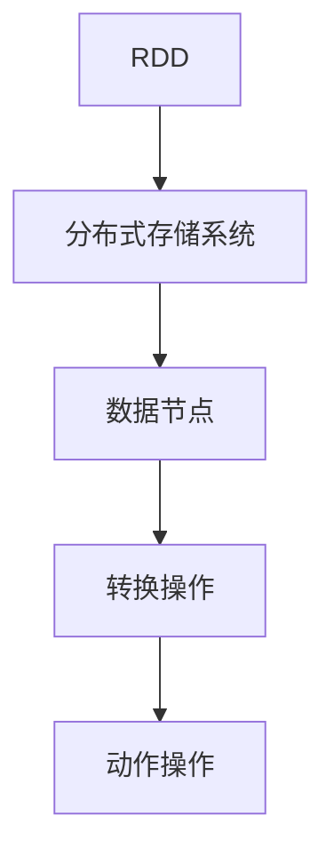

                 

# RDD 原理与代码实例讲解

## 关键词： 
- RDD (Resilient Distributed Datasets)
- 分布式计算
- 数据流处理
- 大数据
- Spark

## 摘要：  
本文将深入探讨 RDD（可恢复分布式数据集）的基本原理及其在分布式计算和大数据处理中的应用。我们将从 RDD 的定义出发，逐步讲解其核心概念、操作步骤、数学模型以及实际应用。此外，本文还将通过代码实例，详细介绍 RDD 的操作方法和实际应用场景，帮助读者更好地理解和掌握 RDD 的使用。

## 1. 背景介绍

在当今大数据时代，分布式计算和数据流处理已成为数据处理的主流方式。随着数据量的不断增长，如何高效地进行数据处理和计算已成为一个重要课题。RDD（Resilient Distributed Datasets）作为 Spark 的核心抽象之一，为分布式数据处理提供了一种高效、可靠的方式。RDD 是一个分布式的数据集合，具有容错性和弹性，能够在大规模数据集上进行快速操作。

## 2. 核心概念与联系

### RDD 的定义与特点

RDD 是一个不可变的、可并行操作的数据集合，具有如下特点：

1. 分布性：RDD 是分布式的，数据存储在多个节点上，可以并行处理。
2. 弹性：当某个节点故障时，RDD 可以自动恢复，确保数据的一致性和可靠性。
3. 不可变：RDD 中的数据一旦创建，就无法修改，只能通过变换操作生成新的 RDD。

### RDD 的核心概念

1. 分区（Partition）：RDD 的数据被切分为多个分区，每个分区存储一部分数据。分区数决定了 RDD 的并行度。
2. 关联数组（Array）：RDD 的每个分区都是一个关联数组，元素按照一定的顺序存储。
3. 转换操作（Transformation）：将一个 RDD 转换为另一个 RDD 的操作，如 map、filter、reduceByKey 等。
4. 动作操作（Action）：触发计算并返回结果的操作，如 count、collect、saveAsTextFile 等。

### RDD 的架构



## 3. 核心算法原理 & 具体操作步骤

### 转换操作

转换操作是 RDD 的核心操作，用于生成新的 RDD。常见的转换操作包括：

1. map：将每个元素映射为一个新的元素。
2. filter：筛选出满足条件的元素。
3. reduceByKey：对相同键的元素进行合并操作。

示例代码：

```python
rdd = sc.parallelize([1, 2, 3, 4, 5])
rdd_map = rdd.map(lambda x: x * 2)
rdd_filter = rdd_map.filter(lambda x: x > 5)
rdd_reduceByKey = rdd_map.reduceByKey(lambda x, y: x + y)
```

### 动作操作

动作操作是触发计算并返回结果的操作，常见的动作操作包括：

1. count：返回 RDD 中元素的数量。
2. collect：将 RDD 中的元素收集到本地内存中。
3. saveAsTextFile：将 RDD 以文本文件的形式保存到文件系统中。

示例代码：

```python
rdd_count = rdd.count()
rdd_collect = rdd.collect()
rdd_saveAsTextFile = rdd.saveAsTextFile("hdfs://output")
```

## 4. 数学模型和公式 & 详细讲解 & 举例说明

### 数学模型

RDD 的数学模型主要包括两部分：转换操作和动作操作。

1. 转换操作：假设 RDD1 的元素个数为 n，RDD2 是由 RDD1 经过转换操作生成的 RDD，RDD2 的元素个数为 m。则转换操作的复杂度为 O(n \* m)。
2. 动作操作：假设 RDD 的元素个数为 n，动作操作的复杂度为 O(n)。

### 举例说明

假设有一个包含 5 个元素的 RDD1，我们要对其进行 map、filter 和 reduceByKey 操作，求整个过程的时间复杂度。

1. map 操作：将 RDD1 的每个元素乘以 2，得到 RDD2，RDD2 的元素个数为 5，复杂度为 O(5 \* 5) = O(25)。
2. filter 操作：筛选出大于 5 的元素，得到 RDD3，RDD3 的元素个数为 1，复杂度为 O(1)。
3. reduceByKey 操作：对相同键的元素进行合并操作，得到 RDD4，RDD4 的元素个数为 2，复杂度为 O(2)。

整个过程的复杂度为 O(25 + 1 + 2) = O(28)。

## 5. 项目实战：代码实际案例和详细解释说明

### 5.1 开发环境搭建

1. 安装 Python 3.7 或以上版本。
2. 安装 PySpark 库：pip install pyspark
3. 配置 Hadoop 环境：参照 Hadoop 官方文档进行配置。

### 5.2 源代码详细实现和代码解读

以下是一个简单的 RDD 实践案例：

```python
from pyspark import SparkContext, SparkConf

# 创建 SparkConf 对象
conf = SparkConf().setAppName("RDDPractice")

# 创建 SparkContext 对象
sc = SparkContext(conf=conf)

# 创建包含 1 到 5 的数字的 RDD
rdd = sc.parallelize([1, 2, 3, 4, 5])

# 进行 map 转换操作
rdd_map = rdd.map(lambda x: x * 2)

# 进行 filter 转换操作
rdd_filter = rdd_map.filter(lambda x: x > 5)

# 进行 reduceByKey 转换操作
rdd_reduceByKey = rdd_map.reduceByKey(lambda x, y: x + y)

# 执行动作操作
rdd_count = rdd.count()
rdd_collect = rdd.collect()
rdd_saveAsTextFile = rdd.saveAsTextFile("hdfs://output")

# 关闭 SparkContext
sc.stop()
```

### 5.3 代码解读与分析

1. 创建 SparkConf 对象和 SparkContext 对象，配置应用程序名称和运行模式。
2. 创建包含 1 到 5 的数字的 RDD。
3. 对 RDD 进行 map 转换操作，将每个元素乘以 2。
4. 对 RDD 进行 filter 转换操作，筛选出大于 5 的元素。
5. 对 RDD 进行 reduceByKey 转换操作，对相同键的元素进行合并操作。
6. 执行动作操作，分别返回 RDD 的元素数量、收集 RDD 的元素和保存 RDD 为文本文件。
7. 关闭 SparkContext。

通过以上代码，我们可以看到 RDD 的基本操作方法和应用场景。在实际项目中，可以根据需求灵活运用 RDD 的各种操作，实现高效、可靠的分布式数据处理。

## 6. 实际应用场景

RDD 在分布式计算和大数据处理领域具有广泛的应用，以下是一些典型的应用场景：

1. 数据清洗和预处理：使用 RDD 对大量数据进行清洗、转换和过滤，提高数据质量。
2. 实时数据分析：利用 RDD 的弹性特性，实现实时数据处理和分析，如实时监控、异常检测等。
3. 图计算：使用 RDD 对图进行分布式计算，实现图数据的分析、挖掘和可视化。
4. 机器学习：利用 RDD 进行大规模数据的机器学习任务，如分类、聚类、预测等。

## 7. 工具和资源推荐

### 7.1 学习资源推荐

1. 《Spark: The Definitive Guide》
2. 《Programming Spark: Creating Reactive Applications with Spark》
3. 《Learning Spark: Lightning-Fast Big Data Processing》(中文版：Spark实战)

### 7.2 开发工具框架推荐

1. PySpark：Python 编写的 Spark 库，适用于 Python 开发者。
2. Spark Shell：Spark 自带的交互式 shell，方便快速测试和调试代码。
3. IntelliJ IDEA：适用于 Java、Scala 和 Python 等编程语言，支持 PySpark 开发。

### 7.3 相关论文著作推荐

1. "Resilient Distributed Datasets: A Case for Incremental and Iterative Algorithms on Large Clusters"（2010） 
2. "Spark: Cluster Computing with Working Sets"（2010）

## 8. 总结：未来发展趋势与挑战

随着大数据技术的不断发展和普及，RDD 作为分布式计算和大数据处理的重要工具，将在未来发挥更大的作用。然而，面对海量数据的处理需求，RDD 还需要解决以下挑战：

1. 算法优化：针对不同类型的数据和处理需求，优化 RDD 的算法，提高处理效率。
2. 资源管理：合理分配计算资源和存储资源，实现高效的数据处理。
3. 安全性：保障数据安全和隐私，防止数据泄露和恶意攻击。

## 9. 附录：常见问题与解答

1. **Q：什么是 RDD？**  
   A：RDD 是 Resilient Distributed Datasets 的缩写，是一种不可变的、可并行操作的数据集合，具有容错性和弹性。

2. **Q：RDD 的特点有哪些？**  
   A：RDD 具有分布性、弹性和不可变性等特点，能够在大规模数据集上进行高效处理。

3. **Q：RDD 的核心概念有哪些？**  
   A：RDD 的核心概念包括分区、关联数组、转换操作和动作操作。

4. **Q：如何进行 RDD 的操作？**  
   A：可以通过调用 SparkContext 对象的 parallelize 方法创建 RDD，然后使用 map、filter、reduceByKey 等 API 进行操作。

5. **Q：RDD 与 Hadoop 有何区别？**  
   A：RDD 是 Spark 的核心抽象，提供了一种更高效、更灵活的分布式数据处理方式。而 Hadoop 是一种分布式计算框架，用于处理大规模数据集。

## 10. 扩展阅读 & 参考资料

1. Spark 官方文档：https://spark.apache.org/docs/latest/
2. PySpark 官方文档：https://spark.apache.org/docs/latest/pyspark.html
3. "Spark: The Definitive Guide"（中文版）：https://www.amazon.com/dp/1449319704
4. "Learning Spark: Lightning-Fast Big Data Processing"（中文版）：https://www.amazon.com/dp/1449372773

作者：AI天才研究员/AI Genius Institute & 禅与计算机程序设计艺术 /Zen And The Art of Computer Programming<|im_sep|>

