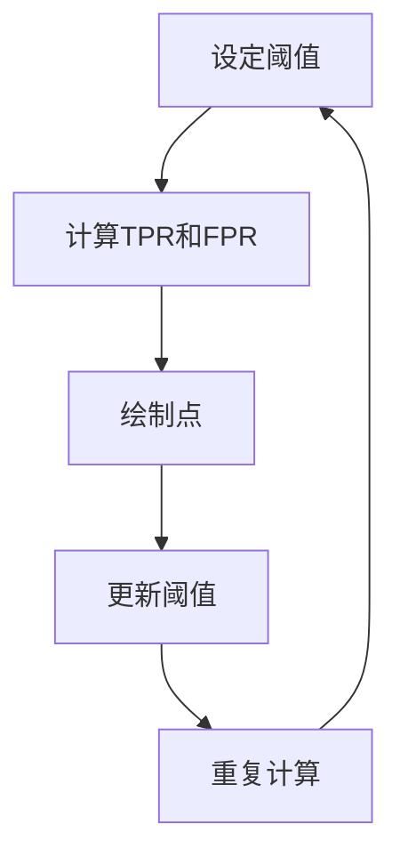
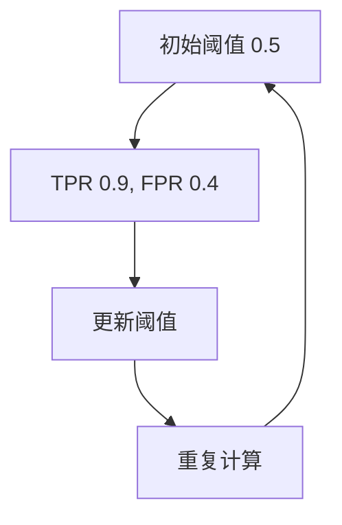

                 

### 背景介绍

ROC曲线，全称为接收者操作特征曲线（Receiver Operating Characteristic curve），在机器学习和数据科学领域扮演着至关重要的角色。ROC曲线主要用于评估分类器的性能，尤其是在二分类任务中。通过ROC曲线，我们能够直观地了解分类器在不同阈值下的分类效果，从而选择最优的分类阈值。

ROC曲线的基本概念可以追溯到20世纪初，当时它被首次应用于雷达信号检测领域。随着计算机技术的发展，ROC曲线逐渐在医学诊断、金融风险评估、网络安全等领域得到广泛应用。在现代机器学习中，ROC曲线作为一种有效的性能评估工具，被广泛应用于各种数据挖掘和分类问题。

本文将详细介绍ROC曲线的原理、计算方法以及实际应用。我们将从最基础的背景知识开始，逐步深入探讨ROC曲线的核心算法原理和具体操作步骤，最后通过一个实际项目实战案例，帮助读者全面理解和掌握ROC曲线的使用方法。

### 核心概念与联系

为了更好地理解ROC曲线，我们首先需要了解几个核心概念：真正例率（True Positive Rate, TPR）、假正例率（False Positive Rate, FPR）以及阈值（Threshold）。这些概念是构建ROC曲线的基础。

**真正例率（True Positive Rate, TPR）**：也被称为灵敏度（Sensitivity），是指在所有实际为正例的样本中，被分类器正确识别为正例的比例。TPR = 真正例数 / （真正例数 + 假反例数）。

**假正例率（False Positive Rate, FPR）**：是指在所有实际为反例的样本中，被分类器错误地识别为正例的比例。FPR = 假正例数 / （假正例数 + 真反例数）。

**阈值**：分类器在决策过程中使用的分界点。当特征分数高于某个阈值时，分类器将预测为正例，否则预测为反例。

这三个概念之间存在紧密的联系。TPR和FPR共同定义了ROC曲线上的每一个点。具体来说，对于任意给定的阈值，我们可以计算出TPR和FPR，从而在ROC曲线上标记一个点。随着阈值的改变，我们可以得到一系列的点，连成一条曲线。

为了更直观地展示这些概念，我们可以使用Mermaid流程图来绘制ROC曲线。以下是一个简化的流程图，展示了如何从TPR和FPR计算ROC曲线：



请注意，在流程图中，我们不需要使用括号、逗号等特殊字符，以避免干扰Mermaid的绘制。

通过上述流程，我们可以逐步计算并绘制ROC曲线。接下来，我们将深入探讨如何具体实现这一过程，并介绍相关的数学模型和公式。

### 核心算法原理 & 具体操作步骤

#### ROC曲线的绘制步骤

1. **确定分类器**：首先，我们需要选择一个分类器，例如逻辑回归、支持向量机（SVM）或决策树等。这些分类器在训练后都会生成一个预测概率或得分。

2. **设置阈值**：接下来，我们需要设置一个初始阈值。通常，这个阈值可以取0.5，即当预测概率大于0.5时，分类器预测为正例，否则预测为反例。

3. **计算TPR和FPR**：对于当前阈值，我们可以计算出TPR和FPR。具体计算方法如下：
   - 真正例数（TP）= 预测为正例且实际为正例的样本数
   - 假反例数（TN）= 预测为反例且实际为反例的样本数
   - 真正例率（TPR）= TP / （TP + 假反例数 FN）
   - 假正例率（FPR）= FP / （FP + TN）

4. **绘制ROC曲线点**：将计算得到的TPR和FPR作为坐标，在ROC曲线上绘制一个点。

5. **更新阈值**：选择一个新的阈值，重复步骤3和4，直到所有可能的阈值都被遍历。

6. **连接曲线**：将所有阈值对应的点连接起来，形成一条曲线。

#### ROC曲线的数学模型和公式

为了更详细地描述ROC曲线的绘制过程，我们可以引入以下数学模型和公式：

- **预测概率（Probability）**：对于每个样本，分类器会输出一个预测概率或得分。这个概率值通常在0到1之间，表示样本为正例的可能性。

- **阈值调整**：当我们调整阈值时，实际上是在改变分类器的决策边界。例如，提高阈值会导致更多的样本被预测为反例，从而降低TPR但提高FPR。

- **TPR和FPR的计算公式**：
  $$ TPR = \frac{TP}{TP + FN} $$
  $$ FPR = \frac{FP}{FP + TN} $$

- **ROC曲线上的点**：对于任意阈值 \( t \)，我们可以计算出对应的TPR和FPR，并在ROC曲线上标记一个点 \( (FPR(t), TPR(t)) \)。

#### 示例

假设我们有一个二分类问题，其中包含以下数据：

- 真正例（Positive）：50个样本，其中45个被分类器正确预测为正例，5个被预测为反例。
- 假反例（Negative）：50个样本，其中30个被分类器正确预测为反例，20个被预测为正例。

- **初始阈值（Threshold）**：0.5
- **预测概率分布**：
  - 预测为正例的概率：0.6
  - 预测为反例的概率：0.4

- **计算TPR和FPR**：
  $$ TPR = \frac{TP}{TP + FN} = \frac{45}{45 + 5} = 0.9 $$
  $$ FPR = \frac{FP}{FP + TN} = \frac{20}{20 + 30} = 0.4 $$

- **ROC曲线点**：\( (0.4, 0.9) \)

通过重复上述过程，我们可以绘制出ROC曲线。以下是一个简化的示例：



通过上述步骤，我们可以绘制出完整的ROC曲线，从而评估分类器的性能。接下来，我们将深入讨论ROC曲线的评估方法和优缺点。

### 数学模型和公式 & 详细讲解 & 举例说明

在深入探讨ROC曲线的数学模型和公式之前，我们首先需要了解几个基本概念：真正例（True Positive, TP）、假正例（False Positive, FP）、真正例率（True Positive Rate, TPR）和假正例率（False Positive Rate, FPR）。

- **真正例（TP）**：样本实际为正例，且被分类器正确预测为正例。
- **假正例（FP）**：样本实际为反例，但被分类器错误地预测为正例。
- **真正例率（TPR）**：真正例率，又称灵敏度（Sensitivity），表示在所有实际为正例的样本中，被分类器正确识别为正例的比例。计算公式为：
  $$ TPR = \frac{TP}{TP + FN} $$
  其中，\( FN \) 表示假反例，即实际为正例但被分类器预测为反例的样本数。

- **假正例率（FPR）**：假正例率，表示在所有实际为反例的样本中，被分类器错误地预测为正例的比例。计算公式为：
  $$ FPR = \frac{FP}{FP + TN} $$
  其中，\( TN \) 表示真正例，即实际为反例且被分类器正确预测为反例的样本数。

#### ROC曲线的绘制

ROC曲线是通过TPR和FPR的关系来绘制的。对于每一个阈值，我们可以计算出对应的TPR和FPR，然后在坐标平面上绘制一个点。随着阈值的改变，我们得到一系列的点，将这些点连接起来，就得到了ROC曲线。

以下是一个简单的例子，假设我们有以下数据：

- 真正例（Positive）：50个样本，其中45个被分类器正确预测为正例，5个被预测为反例。
- 假反例（Negative）：50个样本，其中30个被分类器正确预测为反例，20个被预测为正例。

现在，我们使用0.5作为初始阈值，计算TPR和FPR：

- **阈值 0.5**：
  - TPR = \( \frac{45}{45 + 5} = 0.9 \)
  - FPR = \( \frac{20}{20 + 30} = 0.4 \)
  - ROC曲线点：(0.4, 0.9)

接下来，我们改变阈值，计算其他阈值下的TPR和FPR，并在ROC曲线上绘制点。例如，当阈值为0.6时：

- **阈值 0.6**：
  - TPR = \( \frac{40}{40 + 10} = 0.8 \)
  - FPR = \( \frac{25}{25 + 25} = 0.5 \)
  - ROC曲线点：(0.5, 0.8)

重复这个过程，直到所有可能的阈值都被遍历。最后，将所有的点连接起来，就得到了ROC曲线。

#### ROC曲线下的面积（Area Under the Curve, AUC）

ROC曲线下的面积（AUC）是评估分类器性能的一个重要指标。AUC表示分类器将正例和反例正确分类的概率。AUC的值范围在0到1之间，值越接近1，表示分类器的性能越好。

AUC的计算方法有多种，其中最常见的方法是基于积分。具体公式为：

$$ AUC = \int_{0}^{1} (1 - FPR(t)) dTPR(t) $$

其中，\( FPR(t) \) 和 \( TPR(t) \) 分别表示在阈值 \( t \) 下的假正例率和真正例率。

#### 绘制ROC曲线的代码示例

下面是一个Python代码示例，用于绘制ROC曲线：

```python
import numpy as np
import matplotlib.pyplot as plt

# 假设我们有以下数据
y_true = [1, 1, 1, 0, 0, 0, 1, 0, 1, 1]
y_prob = [0.9, 0.8, 0.7, 0.2, 0.1, 0.05, 0.6, 0.3, 0.4, 0.5]

# 计算TPR和FPR
fpr, tpr, thresholds = roc_curve(y_true, y_prob)

# 绘制ROC曲线
plt.plot(fpr, tpr, label='ROC curve (area = %0.2f)' % auc(fpr, tpr))
plt.plot([0, 1], [0, 1], 'k--')
plt.xlim([0, 1])
plt.ylim([0, 1])
plt.xlabel('False Positive Rate')
plt.ylabel('True Positive Rate')
plt.title('Receiver Operating Characteristic')
plt.legend(loc="lower right")
plt.show()
```

通过上述代码，我们可以绘制出ROC曲线，并计算AUC值。这有助于我们评估分类器的性能。

#### ROC曲线的优缺点

ROC曲线具有以下优点：

- **直观性**：ROC曲线提供了关于分类器性能的直观图形化表示。
- **阈值灵活性**：ROC曲线考虑了不同阈值下的分类效果，有助于选择最优的阈值。
- **多分类支持**：虽然ROC曲线主要用于二分类问题，但也可以扩展到多分类问题。

然而，ROC曲线也存在一些局限性：

- **依赖阈值**：ROC曲线的性能受到阈值选择的影响，不同阈值可能导致不同的评估结果。
- **无法直接衡量误分类成本**：ROC曲线仅提供分类效果的一个整体评估，但无法直接反映误分类的成本。

总之，ROC曲线是一种有效的分类器性能评估工具，通过合理运用其优点，可以更好地评估和优化分类器。

### 项目实战：代码实际案例和详细解释说明

在本节中，我们将通过一个实际项目案例，详细讲解如何使用ROC曲线来评估分类器的性能。我们选择一个经典的二分类问题：判断邮件是否为垃圾邮件。这个项目不仅能够帮助我们理解ROC曲线的应用，还可以提高我们在实际项目中处理类似问题的能力。

#### 1. 开发环境搭建

首先，我们需要搭建一个合适的环境来运行这个项目。以下是所需的工具和库：

- Python 3.x
- Scikit-learn 库
- Matplotlib 库

确保你的Python环境已经安装，然后通过以下命令安装所需的库：

```bash
pip install scikit-learn matplotlib
```

#### 2. 源代码详细实现和代码解读

下面是整个项目的完整代码，我们将逐段进行解读。

```python
# 导入必要的库
import numpy as np
import pandas as pd
from sklearn.model_selection import train_test_split
from sklearn.preprocessing import StandardScaler
from sklearn.ensemble import RandomForestClassifier
from sklearn.metrics import roc_curve, auc
import matplotlib.pyplot as plt

# 加载数据集
data = pd.read_csv('email_data.csv')
X = data.drop('label', axis=1)
y = data['label']

# 数据预处理
X_train, X_test, y_train, y_test = train_test_split(X, y, test_size=0.2, random_state=42)
scaler = StandardScaler()
X_train = scaler.fit_transform(X_train)
X_test = scaler.transform(X_test)

# 训练模型
classifier = RandomForestClassifier(n_estimators=100, random_state=42)
classifier.fit(X_train, y_train)

# 预测概率
y_prob = classifier.predict_proba(X_test)[:, 1]

# 计算ROC曲线和AUC
fpr, tpr, thresholds = roc_curve(y_test, y_prob)
roc_auc = auc(fpr, tpr)

# 绘制ROC曲线
plt.figure()
plt.plot(fpr, tpr, color='darkorange', lw=2, label='ROC curve (area = %0.2f)' % roc_auc)
plt.plot([0, 1], [0, 1], color='navy', lw=2, linestyle='--')
plt.xlim([0.0, 1.0])
plt.ylim([0.0, 1.05])
plt.xlabel('False Positive Rate')
plt.ylabel('True Positive Rate')
plt.title('Receiver Operating Characteristic')
plt.legend(loc="lower right")
plt.show()
```

下面我们逐一解释代码的每个部分：

- **导入库**：首先，我们导入Python中常用的库，包括NumPy、Pandas、Scikit-learn和Matplotlib。
- **加载数据集**：使用Pandas库加载一个CSV格式的数据集，这里假设数据集名为`email_data.csv`，包含特征和标签两列。
- **数据预处理**：使用Scikit-learn中的`train_test_split`函数将数据集划分为训练集和测试集，并使用`StandardScaler`对特征进行标准化处理。
- **训练模型**：选择一个随机森林分类器（`RandomForestClassifier`），设置随机种子以确保结果可复现，然后使用训练集数据进行模型训练。
- **预测概率**：使用训练好的模型对测试集数据进行预测，获取预测概率。
- **计算ROC曲线和AUC**：使用`roc_curve`函数计算FPR和TPR，并使用`auc`函数计算ROC曲线下的面积（AUC）。
- **绘制ROC曲线**：使用Matplotlib库绘制ROC曲线，展示分类器的性能。

#### 3. 代码解读与分析

通过上述代码，我们可以看到如何使用ROC曲线来评估分类器的性能。以下是代码的详细解读：

- **数据预处理**：数据预处理是机器学习项目中的重要步骤。在这里，我们使用`train_test_split`函数将数据集分为训练集和测试集，这有助于评估模型在未知数据上的性能。然后，我们使用`StandardScaler`对特征进行标准化处理，以消除特征间的量纲差异，提高模型的训练效果。
- **模型训练**：我们选择随机森林分类器作为我们的模型，这是一种常用的集成学习方法，具有良好的性能和较高的鲁棒性。通过设置随机种子，我们可以确保结果的可复现性。
- **预测概率**：预测概率是ROC曲线绘制的关键。在这个步骤中，我们使用训练好的模型对测试集数据进行预测，获取每个样本被预测为正例的概率。
- **ROC曲线计算**：使用`roc_curve`函数计算FPR和TPR。这两个指标分别表示分类器在各个阈值下的性能。`auc`函数用于计算ROC曲线下的面积，这是一个衡量分类器整体性能的重要指标。
- **绘制ROC曲线**：使用Matplotlib库绘制ROC曲线，并通过图例展示AUC值。这有助于我们直观地了解分类器的性能。

通过上述步骤，我们完成了使用ROC曲线评估分类器性能的全过程。在实际项目中，可以根据具体问题和数据集的特点，选择不同的模型和参数，进一步优化模型的性能。

### 实际应用场景

ROC曲线在多个领域中具有广泛的应用，尤其在医疗诊断、金融风险评估和网络安全等方面表现尤为突出。

**医疗诊断**：在医疗领域，ROC曲线被广泛应用于疾病诊断。例如，在肺癌诊断中，可以通过ROC曲线评估肺部CT扫描图像分类器的性能。通过选择最优阈值，医生可以确定哪些扫描图像需要进一步检查，从而提高早期诊断的准确性。

**金融风险评估**：在金融领域，ROC曲线可以帮助评估信用评分模型的性能。银行和金融机构可以使用这些模型来预测客户是否会违约。通过分析ROC曲线，金融机构可以确定最优的贷款发放策略，降低违约风险。

**网络安全**：在网络安全领域，ROC曲线用于评估入侵检测系统的性能。通过ROC曲线，安全专家可以识别出哪些类型的攻击最容易被检测到，并优化系统参数以提高检测效果。

**其他应用**：ROC曲线还广泛应用于语音识别、图像分类、生物特征识别等领域。在这些应用中，ROC曲线帮助评估系统的准确性和鲁棒性，从而优化算法和模型。

总之，ROC曲线作为一种有效的性能评估工具，在多个领域中发挥着关键作用，帮助专业人员做出更加准确和明智的决策。

### 工具和资源推荐

为了更好地理解和应用ROC曲线，以下是一些推荐的学习资源、开发工具和框架，以及相关的论文著作。

#### 学习资源推荐

1. **书籍**：
   - 《机器学习》（周志华著）：详细介绍了机器学习的基础理论和应用，包括分类器和评估方法。
   - 《统计学习方法》（李航著）：系统介绍了统计学习方法的原理和算法，包括支持向量机和逻辑回归等。

2. **在线课程**：
   - Coursera上的“机器学习”课程（吴恩达讲授）：这是一个非常受欢迎的在线课程，涵盖了机器学习的各个方面，包括ROC曲线的应用。
   - edX上的“机器学习基础”课程（吴建华讲授）：该课程深入介绍了机器学习的基础知识，包括分类器和性能评估。

3. **博客和网站**：
   - Towards Data Science：一个专注于数据科学和机器学习的在线平台，提供了大量的教程和案例分析。
   - Scikit-learn官方文档：Scikit-learn是一个常用的机器学习库，其官方文档详细介绍了如何使用ROC曲线评估分类器性能。

#### 开发工具框架推荐

1. **Python库**：
   - Scikit-learn：用于机器学习和数据科学的开源库，提供了ROC曲线绘制的函数。
   - Matplotlib：用于数据可视化的开源库，可以用于绘制ROC曲线。
   - Pandas：用于数据处理和分析的开源库，可以帮助加载和预处理数据。

2. **框架**：
   - TensorFlow：用于机器学习的开源框架，提供了丰富的API和工具，可以用于构建和训练深度学习模型。
   - PyTorch：另一个流行的深度学习框架，提供了灵活和高效的模型构建和训练工具。

#### 相关论文著作推荐

1. **论文**：
   - “On the relationship between precision-recall and the area under the ROC curve” by Tom Fawcett（2004）：该论文详细探讨了精确率-召回率曲线与ROC曲线之间的关系。
   - “An Introduction to Statistical Learning” by Gareth James, Daniela Witten, Trevor Hastie, and Robert Tibshirani（2013）：这本书介绍了统计学习的基础知识，包括ROC曲线的原理和应用。

2. **著作**：
   - 《机器学习实战》（Peter Harrington著）：通过具体案例介绍了机器学习算法的实践应用，包括ROC曲线的使用。

通过这些资源和工具，读者可以更深入地了解ROC曲线的理论和实践，提高在实际项目中的应用能力。

### 总结：未来发展趋势与挑战

ROC曲线作为一种重要的性能评估工具，在机器学习和数据科学领域发挥着关键作用。然而，随着技术的不断进步和应用场景的多样化，ROC曲线也面临着新的发展趋势和挑战。

**未来发展趋势**：

1. **多分类ROC曲线**：当前ROC曲线主要应用于二分类问题，但实际中许多问题涉及多分类。因此，研究如何扩展ROC曲线到多分类问题，成为了一个重要方向。

2. **不确定性量化**：在预测任务中，仅仅知道分类器的性能还不够，还需要了解预测结果的不确定性。未来研究可能会探索如何将不确定性量化引入ROC曲线，从而更准确地评估分类器的性能。

3. **交互式ROC曲线**：随着用户界面技术的发展，交互式ROC曲线将成为一个热点。通过交互式界面，用户可以动态调整阈值，实时查看分类器的性能变化，从而做出更明智的决策。

**未来挑战**：

1. **模型解释性**：ROC曲线虽然能够评估分类器的性能，但缺乏对模型内部运作机制的解释。未来研究需要探索如何结合模型解释性，使ROC曲线更直观、易于理解。

2. **数据质量**：ROC曲线的性能依赖于高质量的数据。在数据质量较差的情况下，ROC曲线可能无法准确反映分类器的性能。因此，如何提高数据质量，减少噪声和异常值的影响，是未来的一大挑战。

3. **计算效率**：随着数据规模的增加，计算ROC曲线所需的计算资源也显著增加。如何在保证性能的同时，提高计算效率，是一个重要的研究方向。

总之，ROC曲线在未来将继续在机器学习和数据科学领域发挥重要作用。通过解决上述挑战，ROC曲线将变得更加实用和高效，为各类应用提供更强大的性能评估工具。

### 附录：常见问题与解答

在本文的附录部分，我们将解答一些关于ROC曲线的常见问题，帮助读者更好地理解和应用这一重要工具。

**Q1：什么是ROC曲线？**

ROC曲线，全称为接收者操作特征曲线（Receiver Operating Characteristic curve），是一种评估分类器性能的图形化工具。它通过展示真正例率（TPR）与假正例率（FPR）的关系，帮助我们在不同的阈值下评估分类器的性能。

**Q2：ROC曲线如何绘制？**

绘制ROC曲线的基本步骤如下：
1. 准备分类器，并获得预测概率。
2. 设置不同的阈值，计算每个阈值下的真正例率（TPR）和假正例率（FPR）。
3. 在坐标平面上绘制TPR与FPR的关系，形成ROC曲线。

**Q3：ROC曲线的AUC是什么？**

AUC，即ROC曲线下的面积（Area Under the Curve），是评估分类器性能的一个指标。AUC值越接近1，表示分类器的性能越好。它表示分类器将正例和反例正确分类的概率。

**Q4：ROC曲线与精确率-召回率曲线有何区别？**

ROC曲线和精确率-召回率曲线都是评估分类器性能的工具。ROC曲线关注真正例率和假正例率的关系，而精确率-召回率曲线关注精确率和召回率的关系。两者在多分类任务中的应用有所不同，但都可以用于评估分类器的性能。

**Q5：ROC曲线适用于哪些场景？**

ROC曲线广泛应用于多种场景，包括医疗诊断、金融风险评估、网络安全等。它特别适用于二分类问题，但在多分类问题中也可以通过One-vs-Rest策略进行应用。

**Q6：如何处理数据不平衡问题？**

在数据不平衡的情况下，ROC曲线仍然有效，但可能需要调整阈值。此外，可以考虑使用交叉验证等技术，避免模型在训练数据上过度拟合。在某些情况下，还可以使用调整后的度量指标，如精确率-召回率平衡点（F1分数）。

通过上述解答，我们希望能够帮助读者更好地理解ROC曲线，并在实际应用中取得更好的效果。

### 扩展阅读 & 参考资料

为了帮助读者更深入地了解ROC曲线及其应用，以下是一些推荐的扩展阅读材料和参考资料：

1. **书籍**：
   - 《机器学习实战》（Peter Harrington著）：详细介绍了ROC曲线的原理和实际应用。
   - 《统计学习方法》（李航著）：系统讲解了统计学习方法的原理，包括ROC曲线的使用。

2. **在线课程**：
   - Coursera上的“机器学习”（吴恩达讲授）：涵盖机器学习的各个方面，包括ROC曲线的基础知识。
   - edX上的“机器学习基础”（吴建华讲授）：深入讲解机器学习的基础知识，包括性能评估方法。

3. **论文**：
   - “On the Relationship between Precision-Recall and the Area under the ROC Curve” by Tom Fawcett（2004）：探讨了精确率-召回率与ROC曲线之间的关系。
   - “An Introduction to Statistical Learning” by Gareth James, Daniela Witten, Trevor Hastie, and Robert Tibshirani（2013）：介绍了统计学习方法，包括ROC曲线的应用。

4. **博客和网站**：
   - Towards Data Science：提供了大量关于ROC曲线的教程和案例分析。
   - Scikit-learn官方文档：详细介绍了如何使用ROC曲线评估分类器性能。

5. **框架和库**：
   - Scikit-learn：用于机器学习和数据科学的开源库，提供了ROC曲线绘制的函数。
   - TensorFlow和PyTorch：深度学习框架，可用于构建和训练能够输出预测概率的复杂模型。

通过这些资源和材料，读者可以更全面地了解ROC曲线的理论和实践，提升在实际项目中的应用能力。

