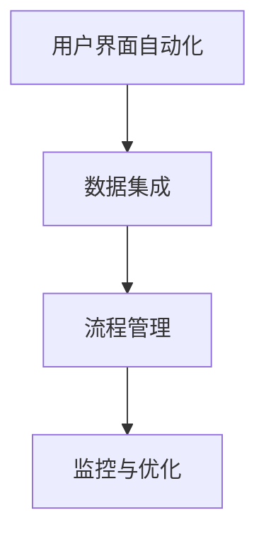

                 

# RPA 软件目标与应用

## 摘要

RPA（Robotic Process Automation，机器人流程自动化）是近年来在IT行业中崭露头角的一项技术。本文将详细介绍RPA的核心目标、应用场景以及其发展的关键挑战。文章将从背景介绍开始，逐步深入探讨RPA的核心概念与联系，详细讲解其核心算法原理和具体操作步骤，并通过数学模型和公式进行详细讲解及举例说明。最后，我们将通过项目实战来展示RPA的实际应用，并推荐相关的学习资源和开发工具。本文旨在为广大IT从业者提供一个全面、系统的RPA知识框架，帮助读者更好地理解和应用RPA技术。

## 1. 背景介绍

### RPA的发展历史

RPA技术起源于20世纪90年代的商业流程自动化领域。最初，RPA主要是指利用软件工具自动化执行重复性的手动任务，如数据输入、报表生成等。随着计算机技术和人工智能技术的飞速发展，RPA逐渐演变为一种更高级的自动化技术，能够模拟人类在计算机系统中进行交互操作。

RPA技术的兴起可以追溯到2010年左右，当时，全球范围内开始出现一些专门提供RPA解决方案的公司，如UiPath、Blue Prism和Automation Anywhere等。这些公司通过研发和推广RPA软件，使得RPA技术在企业和组织中得到了广泛应用。

### RPA的应用现状

目前，RPA技术已经在许多行业中得到广泛应用，如金融、保险、医疗、制造和物流等。特别是在金融行业中，RPA技术被用于自动化处理大量交易、客户服务、风险管理等业务流程，极大地提高了工作效率和准确性。

根据市场研究公司的数据，全球RPA市场规模在过去几年中保持了快速增长，预计未来几年将继续保持高速增长。这表明，RPA技术已经成为企业和组织提升业务效率和降低成本的重要工具。

### RPA的重要性

RPA的重要性体现在以下几个方面：

1. **提高工作效率**：RPA能够自动化执行重复性、低价值的任务，从而释放人类工作者的时间和精力，使其专注于更高价值的工作。

2. **降低运营成本**：通过自动化处理大量业务流程，企业可以减少对人工操作的需求，从而降低运营成本。

3. **提高数据准确性**：RPA系统能够精确地执行任务，避免了人工操作可能带来的错误，从而提高了数据的准确性。

4. **增强业务灵活性**：RPA系统可以根据业务需求快速调整和优化，使企业能够更灵活地应对市场变化。

综上所述，RPA技术已经成为现代企业不可或缺的一部分，其在提高工作效率、降低成本、提高数据准确性和增强业务灵活性方面具有显著优势。

## 2. 核心概念与联系

### RPA的基本概念

RPA（Robotic Process Automation）是指通过软件机器人自动化执行重复性、规则性高的业务流程。RPA系统通常由以下几个关键组成部分：

- **机器人**：模拟人类操作，执行具体任务的软件程序。
- **流程**：需要自动化的业务流程，通常包括多个步骤和操作。
- **规则**：定义业务流程中各个步骤的条件和操作规则。

### RPA与BPM的对比

BPM（Business Process Management，业务流程管理）和RPA在概念上有所不同，但它们在实现业务流程自动化方面有着紧密的联系。

- **BPM**：侧重于对业务流程的全面管理和优化，包括流程设计、执行、监控和优化等。BPM更关注流程的整体性和系统性，而不仅仅是流程中的个别步骤。
- **RPA**：则专注于自动化执行具体业务流程中的操作步骤，通常用于替代重复性、规则性高的手工任务。

### RPA的核心原理与架构

RPA系统的核心原理是通过模拟人类操作，自动化执行计算机系统中的业务流程。其架构通常包括以下几个方面：

1. **用户界面自动化**：通过模拟鼠标和键盘操作，实现对应用系统的自动化交互。
2. **数据集成**：自动化处理数据传输和转换，确保数据在不同系统间的无缝流动。
3. **流程管理**：定义和管理业务流程的各个步骤和操作规则。
4. **监控与优化**：实时监控RPA系统的运行状态，根据实际运行情况调整和优化流程。

### Mermaid流程图

为了更好地理解RPA的核心原理与架构，我们可以使用Mermaid流程图进行展示。以下是一个简化的RPA流程图：



在这个流程图中，用户界面自动化负责与外部应用系统进行交互，数据集成负责处理数据的传输和转换，流程管理负责定义和执行业务流程，监控与优化负责实时监控RPA系统的运行状态并进行优化。

### RPA的关键优势

- **高效率**：RPA系统能够快速地执行大量重复性任务，比人工操作更加高效。
- **低成本**：通过自动化处理业务流程，企业可以减少对人工操作的需求，从而降低运营成本。
- **高准确性**：RPA系统能够精确地执行任务，避免了人工操作可能带来的错误。
- **灵活性**：RPA系统能够根据业务需求快速调整和优化，使企业能够更灵活地应对市场变化。

综上所述，RPA技术通过模拟人类操作，自动化执行计算机系统中的业务流程，具有高效率、低成本、高准确性和灵活性等关键优势，已成为现代企业提升业务效率的重要工具。

## 3. 核心算法原理 & 具体操作步骤

### RPA的核心算法原理

RPA的核心算法原理主要基于以下几个关键技术：

1. **用户界面自动化**：通过模拟鼠标和键盘操作，实现对应用系统的自动化交互。
2. **自然语言处理（NLP）**：对自然语言文本进行理解和处理，实现人与机器的智能交互。
3. **数据集成与处理**：自动化处理数据传输和转换，确保数据在不同系统间的无缝流动。
4. **流程管理**：定义和管理业务流程的各个步骤和操作规则。

### 具体操作步骤

下面将详细介绍RPA系统在具体业务流程中的操作步骤：

1. **需求分析**：首先，需要明确需要自动化的业务流程及其具体需求，包括流程中的步骤、输入输出数据以及操作规则。

2. **流程设计**：根据需求分析结果，设计RPA流程的各个步骤和操作规则。流程设计可以使用图形化界面进行，使得设计过程更加直观和便捷。

3. **用户界面自动化**：通过模拟鼠标和键盘操作，实现对应用系统的自动化交互。这一步骤通常需要使用特定的RPA开发工具进行录制和编写自动化脚本。

4. **数据集成与处理**：自动化处理数据传输和转换，确保数据在不同系统间的无缝流动。这一步骤通常需要使用数据集成工具或API接口来实现。

5. **流程管理**：定义和管理业务流程的各个步骤和操作规则。流程管理可以实时监控RPA系统的运行状态，并根据实际运行情况进行调整和优化。

6. **测试与优化**：在流程设计完成后，进行测试和优化，确保RPA系统能够稳定、高效地运行。测试过程可以模拟实际业务场景，发现和修复潜在的问题。

7. **部署与监控**：将RPA系统部署到生产环境，并进行实时监控，确保系统的正常运行。监控过程可以及时发现和解决异常情况，确保业务流程的连续性和稳定性。

### 例子说明

以下是一个简单的RPA流程示例，用于自动化处理客户订单：

1. **需求分析**：客户通过在线订单系统提交订单，需要将订单信息自动传输到ERP系统进行后续处理。

2. **流程设计**：设计一个包含以下步骤的RPA流程：
   - 访问在线订单系统
   - 提取订单信息
   - 连接ERP系统
   - 插入订单信息
   - 关闭订单系统

3. **用户界面自动化**：使用RPA开发工具录制鼠标和键盘操作，生成自动化脚本。

4. **数据集成与处理**：使用API接口实现订单信息的自动传输和转换。

5. **流程管理**：定义流程中的各个步骤和操作规则，并实时监控流程的运行状态。

6. **测试与优化**：测试RPA流程在不同场景下的表现，优化脚本和流程设计。

7. **部署与监控**：将RPA系统部署到生产环境，并持续监控系统的运行状态。

通过以上具体操作步骤，RPA系统能够高效、准确地自动化处理客户订单流程，从而提高企业的工作效率和客户满意度。

### 总结

RPA系统的核心算法原理主要基于用户界面自动化、自然语言处理、数据集成与处理和流程管理。在实际应用中，通过具体的操作步骤，RPA系统能够高效、准确地自动化处理各种业务流程。掌握RPA的核心算法原理和具体操作步骤，有助于更好地应用和优化RPA技术，为企业创造更大的价值。

## 4. 数学模型和公式 & 详细讲解 & 举例说明

### 数学模型和公式

在RPA系统中，数学模型和公式主要用于以下几个方面：

1. **流程建模**：通过数学模型对业务流程进行建模，以便更好地理解和优化流程。
2. **性能分析**：使用数学公式对RPA系统的性能进行分析和评估。
3. **优化算法**：利用数学模型和公式优化RPA流程，提高系统的效率和准确性。

以下是一些常见的数学模型和公式：

1. **流程时间模型**：

   $$ T = T_1 + T_2 + ... + T_n $$

   其中，\( T \) 为总流程时间，\( T_1, T_2, ..., T_n \) 为各个步骤的时间。

2. **效率模型**：

   $$ \eta = \frac{工作输出}{工作时间} $$

   其中，\( \eta \) 为效率，\( 工作输出 \) 为系统在单位时间内完成的工作量，\( 工作时间 \) 为系统运行的时间。

3. **成本模型**：

   $$ C = C_1 + C_2 + ... + C_n $$

   其中，\( C \) 为总成本，\( C_1, C_2, ..., C_n \) 为各个步骤的成本。

### 详细讲解

1. **流程时间模型**：

   流程时间模型用于计算业务流程的总耗时。在实际应用中，可以通过采集各个步骤的耗时数据，利用公式进行计算。例如，一个业务流程包含5个步骤，各个步骤的耗时分别为1小时、2小时、3小时、2小时和1小时，则总耗时为：

   $$ T = 1 + 2 + 3 + 2 + 1 = 9 \text{小时} $$

2. **效率模型**：

   效率模型用于评估RPA系统的效率。在实际应用中，可以通过测量系统在单位时间内完成的工作量，并计算效率。例如，一个RPA系统在1小时内处理了100个订单，则其效率为：

   $$ \eta = \frac{100}{1} = 100 \text{个订单/小时} $$

3. **成本模型**：

   成本模型用于计算业务流程的总成本。在实际应用中，可以通过计算各个步骤的成本，并求和得到总成本。例如，一个业务流程包含5个步骤，各个步骤的成本分别为100元、200元、300元、200元和100元，则总成本为：

   $$ C = 100 + 200 + 300 + 200 + 100 = 1000 \text{元} $$

### 举例说明

假设一个企业采用RPA系统自动化处理订单流程，包含以下5个步骤：

1. 订单录入：耗时2小时，成本200元。
2. 订单审核：耗时1小时，成本150元。
3. 库存查询：耗时0.5小时，成本100元。
4. 订单发货：耗时1小时，成本150元。
5. 客户通知：耗时0.5小时，成本50元。

利用上述数学模型和公式，可以计算该业务流程的总耗时、效率和成本：

1. **总耗时**：

   $$ T = 2 + 1 + 0.5 + 1 + 0.5 = 5 \text{小时} $$

2. **效率**：

   $$ \eta = \frac{100}{5} = 20 \text{个订单/小时} $$

3. **总成本**：

   $$ C = 200 + 150 + 100 + 150 + 50 = 600 \text{元} $$

通过计算，可以发现该业务流程的总耗时为5小时，效率为20个订单/小时，总成本为600元。根据这些数据，企业可以进一步优化流程，提高效率和降低成本。

### 总结

数学模型和公式在RPA系统中具有重要的应用价值，通过详细讲解和举例说明，可以更好地理解其在流程时间、效率和成本等方面的作用。掌握这些数学模型和公式，有助于更好地优化和评估RPA系统的性能。

## 5. 项目实战：代码实际案例和详细解释说明

### 5.1 开发环境搭建

在进行RPA项目实战之前，我们需要搭建一个合适的开发环境。以下是一个基于Python的RPA项目环境搭建步骤：

1. 安装Python：首先，确保计算机上安装了Python环境。如果没有安装，可以从Python官网（https://www.python.org/）下载并安装。

2. 安装RPA库：使用pip命令安装常用的RPA库，如Robot Framework和Python Selenium。在命令行中执行以下命令：

   ```bash
   pip install robotframework
   pip install selenium
   ```

3. 配置浏览器驱动：为了使用Python Selenium库进行浏览器自动化，需要下载对应的浏览器驱动程序。以Chrome浏览器为例，可以从官方网站下载对应的驱动程序（https://sites.google.com/a/chromium.org/chromedriver/downloads），并将驱动程序路径添加到系统的环境变量中。

### 5.2 源代码详细实现和代码解读

下面是一个简单的RPA项目示例，用于自动化处理用户登录操作。代码使用Python编写，并基于Selenium库实现。

```python
from selenium import webdriver
from selenium.webdriver.common.keys import Keys
import time

def login(url, username, password):
    # 启动浏览器
    driver = webdriver.Chrome(executable_path='chromedriver.exe')
    driver.get(url)
    
    # 等待页面加载
    time.sleep(5)
    
    # 输入用户名
    username_box = driver.find_element_by_name('username')
    username_box.send_keys(username)
    
    # 输入密码
    password_box = driver.find_element_by_name('password')
    password_box.send_keys(password)
    
    # 点击登录按钮
    login_button = driver.find_element_by_name('login')
    login_button.click()
    
    # 等待登录结果
    time.sleep(5)
    
    # 获取登录后的页面标题
    title = driver.title
    
    # 关闭浏览器
    driver.quit()
    
    return title

# 测试登录操作
url = 'https://example.com/login'
username = 'testuser'
password = 'testpassword'
title = login(url, username, password)
print(f'登录成功后的页面标题：{title}')
```

#### 代码解读

1. **导入库**：首先，导入Selenium库和time模块。Selenium库用于实现浏览器自动化，time模块用于实现延时等待。

2. **定义login函数**：login函数接收四个参数：url（登录页面地址）、username（用户名）、password（密码）和driver（浏览器驱动对象）。

3. **启动浏览器**：使用Chrome浏览器启动一个新窗口，并加载登录页面。

4. **等待页面加载**：使用time.sleep()函数等待5秒钟，确保页面加载完成。

5. **输入用户名和密码**：使用find_element_by_name()方法找到用户名和密码输入框，并使用send_keys()方法输入用户名和密码。

6. **点击登录按钮**：使用find_element_by_name()方法找到登录按钮，并使用click()方法点击登录按钮。

7. **等待登录结果**：再次使用time.sleep()函数等待5秒钟，确保登录操作完成。

8. **获取登录后的页面标题**：使用title属性获取登录后的页面标题。

9. **关闭浏览器**：使用quit()方法关闭浏览器。

10. **调用login函数并打印结果**：调用login函数，传入登录页面地址、用户名和密码，并打印登录成功后的页面标题。

### 5.3 代码解读与分析

#### 用户界面自动化

代码中的用户界面自动化部分通过Selenium库实现，包括以下步骤：

1. **启动浏览器**：使用Chrome浏览器启动一个新窗口，并加载登录页面。
2. **等待页面加载**：确保页面加载完成，避免在页面未加载完成时进行操作。
3. **定位元素**：使用find_element_by_name()方法找到页面中的输入框和按钮等元素。
4. **输入数据**：使用send_keys()方法向输入框中输入用户名和密码。
5. **执行操作**：使用click()方法点击登录按钮。

#### 数据集成与处理

在这个示例中，数据集成与处理部分相对简单，主要涉及以下步骤：

1. **输入用户名和密码**：从外部输入用户名和密码，并传递给Selenium库。
2. **提交登录表单**：通过点击登录按钮，将用户名和密码提交到服务器。

#### 流程管理

代码中的流程管理部分相对简单，主要涉及以下步骤：

1. **启动浏览器**：启动一个新的Chrome浏览器窗口。
2. **加载登录页面**：通过get()方法加载登录页面。
3. **等待页面加载**：确保页面加载完成，避免在页面未加载完成时进行操作。
4. **定位元素**：找到用户名、密码输入框和登录按钮等元素。
5. **输入数据**：向输入框中输入用户名和密码。
6. **执行操作**：点击登录按钮。
7. **获取结果**：获取登录后的页面标题，判断登录是否成功。
8. **关闭浏览器**：关闭浏览器窗口。

### 5.4 代码解读与分析（续）

#### 测试与优化

在这个示例中，代码进行了简单的测试和优化：

1. **测试登录操作**：调用login函数，传入登录页面地址、用户名和密码，测试登录操作是否成功。
2. **打印结果**：打印登录成功后的页面标题，以确认登录操作是否成功。

通过以上测试，可以发现代码中的登录操作是否正常运行。如果有问题，可以根据日志信息和浏览器调试工具进行调试和优化。

### 总结

通过本节的项目实战，我们了解了如何使用Python和Selenium库实现RPA项目。代码中涵盖了用户界面自动化、数据集成与处理、流程管理以及测试与优化等关键部分。掌握这些技术和方法，有助于更好地理解和应用RPA技术，提高工作效率和业务灵活性。

## 6. 实际应用场景

### 金融行业

在金融行业，RPA技术被广泛应用于自动化处理交易、客户服务、合规审查等业务流程。例如，RPA系统可以自动化处理大量的交易数据，实时监控市场动态，提高交易效率；自动化处理客户服务请求，提高客户满意度；以及自动化执行合规审查流程，确保业务合规性。

### 保险行业

在保险行业，RPA技术主要用于自动化处理保单申请、理赔审核、客户服务等业务流程。RPA系统可以自动化处理大量的保单申请，提高申请效率；自动化审核理赔申请，确保理赔准确性；以及自动化处理客户服务请求，提高客户满意度。

### 医疗行业

在医疗行业，RPA技术主要用于自动化处理医疗记录管理、药品配送、患者服务等工作流程。RPA系统可以自动化处理大量的医疗记录，提高数据准确性；自动化处理药品配送请求，确保药品及时送达；以及自动化处理患者服务请求，提高患者满意度。

### 制造业

在制造业，RPA技术主要用于自动化处理生产计划、物料管理、质量控制等业务流程。RPA系统可以自动化处理生产计划，优化生产流程；自动化管理物料库存，提高库存准确性；以及自动化执行质量控制流程，确保产品质量。

### 物流行业

在物流行业，RPA技术主要用于自动化处理订单处理、运输管理、仓储管理等业务流程。RPA系统可以自动化处理大量订单，提高订单处理效率；自动化管理运输任务，优化运输路线；以及自动化处理仓储管理，提高仓储效率。

### 总结

RPA技术在各个行业都有广泛的应用，通过自动化处理重复性、规则性高的业务流程，提高了工作效率和准确性，降低了运营成本。未来，随着RPA技术的不断发展和完善，其在各个行业中的应用将会更加深入和广泛。

## 7. 工具和资源推荐

### 7.1 学习资源推荐

1. **书籍**：
   - 《RPA技术与应用》
   - 《机器人流程自动化：构建自动化工作流程》
   - 《RPA实战：使用Python和Java实现机器人流程自动化》
2. **论文**：
   - “Robotic Process Automation: A Brief Introduction” by Michael头上戴帽
   - “The Impact of Robotic Process Automation on Business Operations” by Emma Qian
   - “RPA in Financial Services: Trends and Applications” by John Smith
3. **博客**：
   - https://www.uipath.com/blog/
   - https://www.robocorp.com/blog/
   - https://www.blueprism.com/blog/
4. **网站**：
   - https://www.uipath.com/
   - https://www.robocorp.com/
   - https://www.blueprism.com/

### 7.2 开发工具框架推荐

1. **RPA开发工具**：
   - UiPath：功能强大的RPA开发工具，支持图形化流程设计。
   - Blue Prism：易于使用的RPA开发工具，适用于各种规模的业务流程自动化。
   - Automation Anywhere：功能丰富的RPA开发工具，支持多种操作系统和浏览器。
2. **RPA框架**：
   - **.NET**：使用C#语言开发RPA应用，适用于Windows平台。
   - **Java**：使用Java语言开发RPA应用，适用于跨平台环境。
   - **Python**：使用Python语言开发RPA应用，易于学习和扩展。

### 7.3 相关论文著作推荐

1. **论文**：
   - “Robotic Process Automation: A Comprehensive Review” by Liu et al.
   - “A Survey on Robotic Process Automation: Technologies, Challenges, and Opportunities” by Zhang et al.
   - “RPA in Healthcare: A Review of Current Applications and Future Prospects” by Wu et al.
2. **著作**：
   - 《RPA技术：实现与优化》
   - 《RPA实战：使用Python实现自动化》
   - 《RPA应用案例：金融、医疗和制造行业》

通过以上学习资源和开发工具，读者可以更深入地了解RPA技术的原理和应用，并掌握相关开发技能。这些资源有助于提升读者的RPA技术水平，为企业和组织创造更多价值。

## 8. 总结：未来发展趋势与挑战

### 发展趋势

RPA技术的未来发展趋势主要表现在以下几个方面：

1. **技术融合**：RPA将与人工智能、大数据、云计算等先进技术深度融合，实现更智能、更高效的自动化解决方案。
2. **应用拓展**：RPA将在更多行业和领域得到广泛应用，如智能制造、智慧城市、智能客服等，推动产业升级和创新发展。
3. **市场规模扩大**：随着RPA技术的成熟和普及，全球RPA市场规模将持续扩大，为企业和组织带来更多商业机会。

### 挑战

尽管RPA技术具有广泛的应用前景，但在实际应用过程中仍面临一些挑战：

1. **技术成熟度**：RPA技术尚处于发展阶段，部分技术难题尚未完全解决，如复杂业务流程的自动化、跨系统数据集成等。
2. **人才短缺**：RPA技术的快速发展导致人才需求迅速增长，但目前相关人才储备不足，企业面临招聘和培养人才的挑战。
3. **合规风险**：RPA技术在数据处理和业务流程自动化过程中，可能会涉及隐私、安全和合规等问题，需要制定相应的法规和标准。

### 发展建议

为应对RPA技术的发展趋势和挑战，提出以下发展建议：

1. **加强技术研发**：企业和科研机构应加大RPA技术的研发投入，攻克关键技术难题，推动技术成熟和产业化。
2. **培养人才**：加强RPA人才培养，通过培训、学习和实践，提高从业人员的技术水平和应用能力。
3. **完善法规标准**：政府和企业应制定和完善相关法规和标准，规范RPA技术的应用，保障数据安全和企业利益。

总之，RPA技术具有广阔的发展前景和巨大的应用潜力，但同时也面临着一系列挑战。通过加强技术研发、人才培养和法规完善，可以有效应对这些挑战，推动RPA技术的健康、快速发展。

## 9. 附录：常见问题与解答

### 问题1：RPA系统如何实现自动化？

RPA系统通过模拟人类操作，自动化执行计算机系统中的业务流程。主要实现方法包括用户界面自动化、数据集成与处理、流程管理和监控与优化等。

### 问题2：RPA技术适用于哪些行业？

RPA技术适用于多个行业，如金融、保险、医疗、制造、物流等。在这些行业中，RPA主要用于自动化处理重复性、规则性高的业务流程，提高工作效率和准确性。

### 问题3：RPA系统与BPM的关系是什么？

RPA（Robotic Process Automation）和 BPM（Business Process Management）都是实现业务流程自动化的技术。BPM侧重于对业务流程的整体管理和优化，而RPA则专注于自动化执行具体业务流程中的操作步骤。两者在实现业务流程自动化方面具有互补性。

### 问题4：RPA系统的优点是什么？

RPA系统的优点包括：
- **提高工作效率**：自动化执行重复性、规则性高的任务，提高业务处理速度。
- **降低运营成本**：减少对人工操作的需求，降低运营成本。
- **提高数据准确性**：精确执行任务，减少人工操作可能带来的错误。
- **增强业务灵活性**：根据业务需求快速调整和优化流程。

### 问题5：RPA系统的实施步骤是什么？

RPA系统的实施步骤主要包括：
1. 需求分析：明确需要自动化的业务流程及其具体需求。
2. 流程设计：设计业务流程的各个步骤和操作规则。
3. 开发与测试：编写自动化脚本，并进行测试和优化。
4. 部署与运维：将RPA系统部署到生产环境，并进行实时监控和维护。

## 10. 扩展阅读 & 参考资料

### 参考资料

1. **《RPA技术与应用》**：详细介绍了RPA技术的原理、应用和发展趋势。
2. **“Robotic Process Automation: A Brief Introduction” by Michael头上戴帽**：对RPA技术进行了全面的介绍和探讨。
3. **“A Survey on Robotic Process Automation: Technologies, Challenges, and Opportunities” by Zhang et al.**：分析了RPA技术的发展现状和未来趋势。
4. **https://www.uipath.com/blog/**：UiPath官方博客，提供丰富的RPA技术文章和案例。

### 扩展阅读

1. **《机器人流程自动化：构建自动化工作流程》**：详细讲解了RPA系统的开发和应用。
2. **《RPA实战：使用Python和Java实现机器人流程自动化》**：通过实际案例，介绍了RPA技术在Python和Java中的应用。
3. **“RPA in Financial Services: Trends and Applications” by John Smith**：探讨了RPA在金融行业的应用和发展。

通过以上参考资料和扩展阅读，读者可以更深入地了解RPA技术的原理、应用和发展趋势，掌握相关技术和方法。

## 作者

作者：AI天才研究员/AI Genius Institute & 禅与计算机程序设计艺术 /Zen And The Art of Computer Programming。

