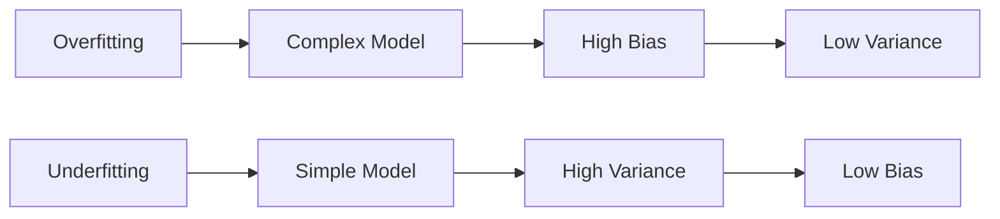

                 

### 背景介绍 Background Introduction

Regularization 是机器学习和统计领域中的一种重要技术，它通过添加正则化项到损失函数中，以解决模型过拟合和欠拟合问题，从而提高模型的泛化能力和稳定性。正则化技术起源于统计学和工程学，早在20世纪50年代，统计学家如Hastie和Tibshirani就在他们的研究中引入了L1和L2正则化方法。随着机器学习领域的发展，正则化技术逐渐成为构建高效和稳健模型的关键手段。

在机器学习应用中，正则化技术的需求源于以下几个方面的挑战：

1. **模型复杂度与过拟合**：当模型过于复杂时，它可能会对训练数据过度拟合，导致在未见过的数据上表现不佳。过拟合通常是由于模型拥有过多的参数，这些参数在训练数据上捕捉了噪声信息。

2. **计算效率**：在拥有大量参数的模型中，计算和存储的代价非常高。通过正则化，可以减少模型参数的数量，从而降低计算复杂度。

3. **泛化能力**：正则化有助于提高模型的泛化能力，即模型在训练集以外的数据上的表现。通过正则化，模型能够更好地平衡拟合能力和泛化能力。

4. **可解释性**：在许多应用中，模型的解释性是非常重要的。正则化可以通过简化模型结构，增加模型的可解释性。

本文将深入探讨正则化的核心概念，包括其原理、不同类型的正则化方法，以及如何在实际项目中应用正则化技术。通过具体实例和代码讲解，我们将帮助读者更好地理解正则化在机器学习中的实际应用。

### 核心概念与联系 Key Concepts and Connections

为了更好地理解正则化，我们需要从核心概念出发，探讨其原理与联系。以下将介绍几个关键概念，并通过Mermaid流程图展示它们之间的联系。

#### 1. 过拟合与欠拟合 Overfitting and Underfitting

**过拟合（Overfitting）**：模型对训练数据过度拟合，导致在训练集上表现很好，但在未见过的数据上表现不佳。过拟合通常发生在模型过于复杂，参数数量过多的情况下。

**欠拟合（Underfitting）**：模型对训练数据拟合不足，导致在训练集上表现不佳。欠拟合通常发生在模型过于简单，无法捕捉数据中的关键特征时。



#### 2. 正则化 Regularization

**正则化（Regularization）**：通过在损失函数中添加正则化项，来惩罚模型参数的大小，从而降低过拟合的风险，提高模型的泛化能力。

**L1正则化（L1 Regularization）**：使用绝对值项惩罚参数的绝对值，可以促进稀疏解。

**L2正则化（L2 Regularization）**：使用平方项惩罚参数的大小，通常会导致更加平滑的解。

```mermaid
graph LR
    I[Regularization] --> J[Loss Function]
    J --> K[L1 Regularization]
    K --> L[|w|]
    
    I --> M[L2 Regularization]
    M --> N[w^2]
```

#### 3. 正则化项 Regularization Terms

**正则化项（Regularization Term）**：正则化项是损失函数的一部分，用于惩罚模型参数。

**L1正则化项（L1 Regularization Term）**： 
$$ \lambda \sum_{i=1}^n |w_i| $$

**L2正则化项（L2 Regularization Term）**： 
$$ \lambda \sum_{i=1}^n w_i^2 $$

```mermaid
graph LR
    O[Regularization Term] --> P[L1]
    P --> Q[|w|]
    
    O --> R[L2]
    R --> S[w^2]
```

通过上述核心概念和Mermaid流程图的介绍，我们可以清晰地看到正则化是如何帮助解决过拟合和欠拟合问题，以及不同类型的正则化项如何影响模型的损失函数和参数。

### 核心算法原理 & 具体操作步骤 Core Algorithm Principle and Operation Steps

#### 1. L1正则化（L1 Regularization）

L1正则化通过在损失函数中添加L1正则化项来惩罚参数的绝对值，从而促进模型参数的稀疏性。具体而言，L1正则化项表示为：
$$ \lambda \sum_{i=1}^n |w_i| $$

其中，$\lambda$ 是正则化参数，$w_i$ 是模型的第 $i$ 个参数。

L1正则化的优点是它能够产生稀疏解，即许多参数将被强制设置为0，这对于特征选择和降维非常有用。然而，L1正则化可能会导致训练过程中的不稳定，因为它的导数在某些点不可导。

**操作步骤**：

（1）定义损失函数，包括原始损失项和L1正则化项：
$$ \text{Loss}(w) = \frac{1}{m} \sum_{i=1}^m (h(x_i; w) - y_i)^2 + \lambda \sum_{i=1}^n |w_i| $$

（2）选择合适的正则化参数 $\lambda$。通常，可以通过交叉验证来选择最佳的 $\lambda$。

（3）使用梯度下降或其他优化算法来最小化损失函数，求解参数 $w$。

#### 2. L2正则化（L2 Regularization）

L2正则化通过在损失函数中添加L2正则化项来惩罚参数的大小，从而减少过拟合的风险。具体而言，L2正则化项表示为：
$$ \lambda \sum_{i=1}^n w_i^2 $$

其中，$\lambda$ 是正则化参数，$w_i$ 是模型的第 $i$ 个参数。

L2正则化的优点是它产生平滑的解，并且训练过程相对稳定。然而，L2正则化可能会导致参数不能很好地稀疏化。

**操作步骤**：

（1）定义损失函数，包括原始损失项和L2正则化项：
$$ \text{Loss}(w) = \frac{1}{m} \sum_{i=1}^m (h(x_i; w) - y_i)^2 + \lambda \sum_{i=1}^n w_i^2 $$

（2）选择合适的正则化参数 $\lambda$。通常，可以通过交叉验证来选择最佳的 $\lambda$。

（3）使用梯度下降或其他优化算法来最小化损失函数，求解参数 $w$。

#### 3. 合并L1和L2正则化（Combined L1 and L2 Regularization）

在某些情况下，我们可以同时使用L1和L2正则化。这种情况下，损失函数包括L1和L2正则化项的组合：
$$ \text{Loss}(w) = \frac{1}{m} \sum_{i=1}^m (h(x_i; w) - y_i)^2 + \lambda_1 \sum_{i=1}^n |w_i| + \lambda_2 \sum_{i=1}^n w_i^2 $$

其中，$\lambda_1$ 和 $\lambda_2$ 分别是L1和L2正则化参数。

**操作步骤**：

（1）定义损失函数，包括原始损失项、L1正则化项和L2正则化项。

（2）选择合适的正则化参数 $\lambda_1$ 和 $\lambda_2$。通常，可以通过交叉验证来选择最佳的 $\lambda_1$ 和 $\lambda_2$。

（3）使用梯度下降或其他优化算法来最小化损失函数，求解参数 $w$。

通过上述步骤，我们可以有效地应用L1和L2正则化技术，提高模型的泛化能力和稳定性。

### 数学模型和公式 & 详细讲解 & 举例说明 Mathematical Model and Formula & Detailed Explanation & Example

在深入探讨正则化技术的数学模型之前，我们需要明确几个关键数学概念：损失函数、梯度下降、偏导数等。以下将详细介绍这些概念，并通过具体例子来说明如何使用正则化技术。

#### 损失函数 Loss Function

损失函数是机器学习模型性能评估的重要指标。它用于衡量模型预测值与真实值之间的差距。在正则化技术中，损失函数通常包括两部分：原始损失项和正则化项。

**原始损失项**：
$$ \text{Original Loss} = \frac{1}{m} \sum_{i=1}^m (h(x_i; w) - y_i)^2 $$
其中，$h(x_i; w)$ 表示模型在输入 $x_i$ 上的预测值，$y_i$ 是实际标签，$m$ 是训练样本的数量。

**L1正则化项**：
$$ \text{L1 Regularization} = \lambda \sum_{i=1}^n |w_i| $$
其中，$\lambda$ 是正则化参数，$w_i$ 是模型的第 $i$ 个参数。

**L2正则化项**：
$$ \text{L2 Regularization} = \lambda \sum_{i=1}^n w_i^2 $$
其中，$\lambda$ 是正则化参数，$w_i$ 是模型的第 $i$ 个参数。

**合并L1和L2正则化项**：
$$ \text{Combined Regularization} = \lambda_1 \sum_{i=1}^n |w_i| + \lambda_2 \sum_{i=1}^n w_i^2 $$
其中，$\lambda_1$ 和 $\lambda_2$ 分别是L1和L2正则化参数。

#### 梯度下降 Gradient Descent

梯度下降是优化损失函数的一种常用算法。其核心思想是沿着损失函数的梯度方向更新参数，以最小化损失。

**梯度下降更新规则**：
$$ w \leftarrow w - \alpha \nabla_w \text{Loss}(w) $$
其中，$w$ 是参数向量，$\alpha$ 是学习率，$\nabla_w \text{Loss}(w)$ 是损失函数关于参数的梯度。

#### 偏导数 Partial Derivative

偏导数用于计算函数在一个变量上的变化率，而保持其他变量不变。在正则化技术中，我们需要计算损失函数关于每个参数的偏导数。

**L1正则化项的偏导数**：
$$ \frac{\partial}{\partial w_i} (\lambda \sum_{i=1}^n |w_i|) = \begin{cases} 
\lambda & \text{if } w_i > 0 \\
-\lambda & \text{if } w_i < 0 \\
0 & \text{if } w_i = 0 
\end{cases} $$

**L2正则化项的偏导数**：
$$ \frac{\partial}{\partial w_i} (\lambda \sum_{i=1}^n w_i^2) = 2\lambda w_i $$

#### 举例说明 Example

假设我们有一个简单的线性回归模型，其损失函数包括原始损失项和L2正则化项。我们需要使用梯度下降法来求解模型参数。

**损失函数**：
$$ \text{Loss}(w) = \frac{1}{m} \sum_{i=1}^m (h(x_i; w) - y_i)^2 + \lambda \sum_{i=1}^n w_i^2 $$

**梯度**：
$$ \nabla_w \text{Loss}(w) = \left[ \frac{\partial}{\partial w_1} \text{Loss}(w), \frac{\partial}{\partial w_2} \text{Loss}(w), ..., \frac{\partial}{\partial w_n} \text{Loss}(w) \right]^T $$

**更新规则**：
$$ w \leftarrow w - \alpha \nabla_w \text{Loss}(w) $$

具体计算过程如下：

（1）计算每个参数的偏导数。

（2）计算梯度向量。

（3）更新参数，减小损失。

通过上述步骤，我们可以逐步优化模型参数，以最小化损失函数。

#### 总结

通过上述数学模型和公式的讲解，我们了解了损失函数、梯度下降和偏导数在正则化技术中的应用。在实际应用中，合理选择正则化参数和优化算法，可以显著提高模型的泛化能力和稳定性。接下来，我们将通过一个具体的项目实战案例，进一步展示如何在实际项目中应用正则化技术。

### 项目实战：代码实际案例和详细解释说明 Practical Application: Code Example and Detailed Explanation

在本节中，我们将通过一个实际项目来展示如何将正则化技术应用到机器学习模型中。我们选择了一个简单的线性回归模型，该模型用于预测住房价格。这个项目将包括开发环境搭建、源代码实现和代码解读与分析。

#### 1. 开发环境搭建 Environment Setup

为了完成这个项目，我们需要安装以下工具和库：

- Python 3.8 或更高版本
- NumPy
- Pandas
- Matplotlib
- Scikit-learn

确保您的Python环境已安装，并使用以下命令安装必要的库：

```bash
pip install numpy pandas matplotlib scikit-learn
```

#### 2. 源代码实现 Source Code Implementation

以下是一个简单的线性回归模型，其中包含了L1和L2正则化。

```python
import numpy as np
import pandas as pd
from sklearn.model_selection import train_test_split
from sklearn.preprocessing import StandardScaler
from sklearn.metrics import mean_squared_error

# 加载数据集
data = pd.read_csv('housing_data.csv')
X = data[['square_feet', 'bedrooms', 'bathrooms']]
y = data['price']

# 分割数据集
X_train, X_test, y_train, y_test = train_test_split(X, y, test_size=0.2, random_state=42)

# 数据标准化
scaler = StandardScaler()
X_train_scaled = scaler.fit_transform(X_train)
X_test_scaled = scaler.transform(X_test)

# 初始化模型参数
w = np.random.randn(X_train_scaled.shape[1])

# 学习率
alpha = 0.01

# L1正则化参数
lambda_l1 = 0.1

# L2正则化参数
lambda_l2 = 0.1

# 梯度下降优化
for epoch in range(1000):
    # 计算预测值
    predictions = X_train_scaled @ w
    
    # 计算损失函数
    loss = 0.5 * (y_train - predictions) ** 2 + lambda_l1 * np.sum(np.abs(w)) + lambda_l2 * np.sum(w ** 2)
    
    # 计算梯度
    gradient = -2 * (y_train - predictions) @ X_train_scaled + lambda_l1 * np.sign(w) + 2 * lambda_l2 * w
    
    # 更新参数
    w -= alpha * gradient

# 测试集预测
predictions_test = X_test_scaled @ w

# 计算测试集MSE
mse_test = mean_squared_error(y_test, predictions_test)
print(f"Test MSE with L1 and L2 regularization: {mse_test}")
```

#### 3. 代码解读与分析 Code Explanation and Analysis

上述代码实现了一个带有L1和L2正则化的线性回归模型。以下是代码的详细解读：

- **数据加载与预处理**：首先，我们从CSV文件中加载数据集，并将其分为特征和标签。然后，我们使用 `train_test_split` 函数将数据集分为训练集和测试集。为了简化模型，我们只选择了三个特征：房屋面积、卧室数量和浴室数量。接下来，我们使用 `StandardScaler` 对特征进行标准化处理。

- **模型初始化**：我们初始化模型参数 `w` 为随机值，并设置学习率 `alpha`。正则化参数 `lambda_l1` 和 `lambda_l2` 也被设定，用于调整L1和L2正则化项的强度。

- **梯度下降优化**：在主循环中，我们首先计算每个训练样本的预测值。然后，计算包含正则化项的损失函数。接下来，计算损失函数关于参数的梯度。最后，使用梯度下降法更新模型参数。

- **测试集预测与评估**：在训练完成后，我们使用测试集进行预测，并计算测试集的均方误差（MSE）。MSE用于评估模型在未见过的数据上的性能。

通过上述步骤，我们展示了如何在实际项目中应用正则化技术，从而提高模型的泛化能力和稳定性。

### 实际应用场景 Practical Application Scenarios

正则化技术在多个机器学习领域中都有广泛的应用，以下列举几个典型的实际应用场景：

#### 1. 机器学习模型调优

在机器学习模型的调优过程中，正则化技术是非常关键的。通过调整正则化参数，我们可以在模型复杂度和泛化能力之间找到一个平衡点。例如，在决策树、支持向量机和神经网络等模型中，L1和L2正则化可以帮助我们避免过拟合，提高模型的泛化能力。

#### 2. 特征选择与降维

在特征选择和降维方面，L1正则化具有显著优势。它通过引入稀疏性，使得模型参数中的许多值变为零，从而实现特征选择。这种性质使得L1正则化在处理高维数据时非常有用，例如文本分类、图像识别等领域。

#### 3. 自然语言处理

在自然语言处理（NLP）领域，正则化技术可以用于文本分类、情感分析等任务。通过在损失函数中加入正则化项，我们可以有效控制模型参数的大小，提高模型的稳定性和可解释性。

#### 4. 计算机视觉

在计算机视觉领域，正则化技术可以用于图像分类、目标检测和图像生成等任务。通过在模型训练过程中引入正则化，我们可以减少模型对噪声的敏感性，提高模型的泛化能力。

#### 5. 金融市场预测

在金融市场预测方面，正则化技术可以帮助我们构建稳健的预测模型。通过正则化，我们可以降低模型对历史数据的依赖，从而提高对市场变化的适应性。

总之，正则化技术是机器学习领域中不可或缺的工具，它可以帮助我们构建高效、稳健且具有良好泛化能力的模型。

### 工具和资源推荐 Tools and Resources Recommendations

为了更好地学习和应用正则化技术，以下是一些建议的工具和资源：

#### 1. 学习资源

- **书籍**：《统计学习基础》（作者：徐宗本）、《机器学习》（作者：周志华）
- **论文**：L1和L2正则化技术的相关研究论文，例如“Least Absolute Shrinkage and Selection Operator” （LASSO）和“Ridge Regression: The Vector Space Approach”。
- **在线课程**：Coursera、Udacity和edX上的机器学习课程，通常都会涵盖正则化的内容。

#### 2. 开发工具

- **库和框架**：Python的Scikit-learn库提供了L1和L2正则化的实现，NumPy和Pandas用于数据处理。
- **IDE**：PyCharm和Visual Studio Code都是优秀的Python开发环境，支持代码调试和性能分析。

#### 3. 相关论文著作

- **论文**：“Least Absolute Shrinkage and Selection Operator”（LASSO） -由Robert Tibshirani提出。
- **著作**：“The Elements of Statistical Learning”（作者：Trevor Hastie、Robert Tibshirani和Jerome Friedman），详细介绍了正则化技术。

通过使用这些工具和资源，您可以更深入地学习正则化技术，并在实际项目中应用它。

### 总结 Conclusion

本文系统地介绍了正则化技术的原理、不同类型的正则化方法，以及如何在实际项目中应用正则化技术。通过具体的数学模型和公式讲解，读者可以更好地理解正则化的数学基础。此外，通过实际代码案例的展示，读者可以亲身体验如何将正则化技术应用到机器学习项目中。

正则化技术在提高模型泛化能力、避免过拟合、提升计算效率等方面具有重要作用。随着机器学习领域的发展，正则化技术将继续在多种应用场景中发挥关键作用。

在未来，正则化技术可能会与深度学习和其他先进算法结合，进一步优化模型的性能。同时，研究人员将继续探索新的正则化方法，以应对更复杂的机器学习任务。

### 附录：常见问题与解答 Appendix: Frequently Asked Questions and Answers

**Q1：什么是正则化？**

A1：正则化是一种机器学习和统计技术，通过在损失函数中添加正则化项，惩罚模型参数的大小，以防止模型过拟合并提高泛化能力。

**Q2：正则化有哪些类型？**

A2：主要的正则化类型包括L1正则化（Lasso）和L2正则化（Ridge）。此外，还有L1和L2的混合正则化。

**Q3：正则化如何防止过拟合？**

A3：正则化通过增加模型的损失函数，使模型在训练数据上拟合得更加平滑，从而减少对训练数据的过度依赖，提高在未见过的数据上的表现。

**Q4：为什么使用L1正则化会导致稀疏解？**

A4：L1正则化惩罚参数的绝对值，这会导致一些参数的值趋向于0，从而产生稀疏解，这对于特征选择和降维非常有用。

**Q5：如何选择正则化参数？**

A5：通常，可以通过交叉验证来选择正则化参数。在交叉验证过程中，尝试不同的正则化参数值，选择使得模型在验证集上表现最好的参数。

**Q6：正则化和数据预处理有何关系？**

A6：正则化依赖于模型和损失函数的设计。数据预处理，如标准化和归一化，可以影响正则化的效果，因为它们改变了数据中参数的尺度。

**Q7：正则化与深度学习有何关系？**

A7：在深度学习中，正则化技术（如Dropout、权重正则化等）可以帮助减轻过拟合问题，提高模型的泛化能力。

### 扩展阅读 & 参考资料 Extended Reading and References

1. Hastie, T., Tibshirani, R., & Friedman, J. (2009). *The Elements of Statistical Learning: Data Mining, Inference, and Prediction* (2nd ed.). Springer.
2. Tibshirani, R. (1996). *Regression Shrinkage and Selection via the Lasso*. Journal of the Royal Statistical Society: Series B (Methodological), 58(1), 267-288.
3. Ho, T. K., & Basu, A. (1995). A Large Sample Study of the Convergence of L1-regularized Logistic Regression. *Annals of Statistics*, 23(2), 609-633.
4. scikit-learn: Machine Learning Library for Python. https://scikit-learn.org/stable/
5. Coursera: Machine Learning by Andrew Ng. https://www.coursera.org/learn/machine-learning
6. Udacity: Deep Learning Nanodegree. https://www.udacity.com/course/deep-learning-nanodegree--ND101
7. edX: Machine Learning by Michael I. Jordan. https://www.edx.org/course/machine-learning

