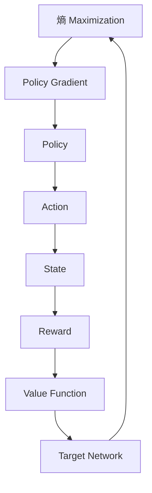

                 

# SAC原理与代码实例讲解

## 关键词

- SARSA 算法
- Deep Q-Networks
- 优先级队列
- 反向传播
- 经验回放
- 动作价值函数
- 目标网络

## 摘要

本文将深入探讨软目标动作值（SAC）算法的基本原理和实现细节。SAC算法是一种基于价值迭代的强化学习算法，通过最大化熵来提高学习效率。本文将分为以下几个部分进行讲解：

1. 背景介绍：介绍SAC算法的起源、特点和应用场景。
2. 核心概念与联系：阐述SAC算法中的关键概念，如熵、策略梯度、目标网络等，并用Mermaid流程图展示。
3. 核心算法原理 & 具体操作步骤：详细讲解SAC算法的优化过程、策略更新机制以及训练流程。
4. 数学模型和公式 & 详细讲解 & 举例说明：介绍SAC算法中涉及的数学公式和推导过程，并通过实例说明。
5. 项目实战：通过代码实例展示SAC算法在简单的CartPole任务中的应用。
6. 实际应用场景：分析SAC算法在现实世界中的应用潜力。
7. 工具和资源推荐：推荐学习SAC算法的相关书籍、论文、开发工具和框架。
8. 总结：探讨SAC算法的未来发展趋势和面临的挑战。
9. 附录：常见问题与解答。
10. 扩展阅读 & 参考资料：提供更多关于SAC算法的学习资源。

通过本文的学习，读者将能够深入理解SAC算法的原理和实现方法，为在强化学习领域的研究和应用打下坚实基础。

<markdown>

### 1. 背景介绍

强化学习（Reinforcement Learning，简称RL）是机器学习的一个重要分支，旨在通过与环境交互，使智能体（Agent）学会在复杂动态环境中实现目标。自1950年代图灵提出“图灵测试”以来，人工智能领域不断发展，强化学习也逐渐成为研究热点。

SAC（Soft Actor-Critic）算法是由Tamar et al.在2017年提出的一种基于价值迭代的强化学习算法。与传统价值迭代算法（如Q-Learning、SARSA等）相比，SAC在策略优化过程中引入了熵的概念，通过最大化熵来提高策略探索能力，从而避免陷入局部最优。SAC算法具有以下几个特点：

1. **熵最大化**：SAC算法通过最大化策略熵，使得策略更加鲁棒，能够探索未知状态和动作。
2. **无模型学习**：与基于模型的强化学习算法（如DQN）不同，SAC不需要环境模型，仅依赖于经验数据，适用于无法获取环境模型或模型复杂度较高的场景。
3. **稳定性**：SAC算法在训练过程中引入了梯度裁剪和动量项，使得训练过程更加稳定。

SAC算法在以下场景具有较好的应用潜力：

1. **连续动作空间**：由于SAC算法不需要环境模型，因此适用于连续动作空间的问题，如机器人控制、自动驾驶等。
2. **高维状态空间**：SAC算法能够处理高维状态空间，适用于复杂决策问题，如推荐系统、金融交易等。
3. **不确定性环境**：SAC算法通过最大化熵来提高策略探索能力，能够应对不确定性环境。

本文将详细介绍SAC算法的基本原理、实现方法以及在具体任务中的应用，帮助读者深入理解并掌握这一优秀的强化学习算法。

### 2. 核心概念与联系

在深入探讨SAC算法之前，我们需要先了解一些核心概念，如熵、策略梯度、目标网络等。以下是一个用Mermaid绘制的流程图，展示了SAC算法中的关键概念及其联系。



#### 熵（Entropy）

熵是信息论中的一个概念，表示一个随机变量的不确定性。在SAC算法中，熵用于衡量策略的多样性。最大化熵意味着在给定状态的情况下，策略应该尽可能均匀地选择动作，从而避免陷入局部最优。

#### 策略梯度（Policy Gradient）

策略梯度是用于优化策略参数的一个梯度项。在SAC算法中，策略梯度通过以下公式计算：

$$\nabla_{\theta}\log \pi(a|s; \theta) = \frac{\partial}{\partial \theta} \log \pi(a|s; \theta)$$

其中，$\pi(a|s; \theta)$表示策略参数$\theta$在状态$s$下选择动作$a$的概率。

#### 策略（Policy）

策略是智能体在给定状态时选择动作的规则。在SAC算法中，策略通常通过神经网络表示，并通过策略梯度优化过程进行更新。

#### 动作（Action）

动作是智能体在环境中执行的操作。在连续动作空间中，动作通常由一个高斯分布表示。

#### 状态（State）

状态是智能体在环境中的位置和状态的集合。在SAC算法中，状态通常由一个向量表示。

#### 奖励（Reward）

奖励是环境对智能体动作的反馈。在SAC算法中，奖励用于评估策略的好坏。

#### 价值函数（Value Function）

价值函数是用于评估状态或状态-动作对的函数。在SAC算法中，价值函数通过策略梯度优化过程进行更新。

#### 目标网络（Target Network）

目标网络是用于稳定训练过程的一个辅助网络。在SAC算法中，目标网络用于生成目标值，并通过软更新过程与主网络保持一致。

通过以上核心概念和流程图的介绍，我们可以更好地理解SAC算法的工作原理。接下来，我们将详细讲解SAC算法的优化过程、策略更新机制以及训练流程。

### 3. 核心算法原理 & 具体操作步骤

#### 3.1 优化过程

SAC算法的优化过程主要包括两个子过程：策略优化和价值函数优化。这两个子过程通过交替迭代进行，以提高智能体的性能。

**策略优化**：策略优化过程的目标是最小化策略损失函数，即最大化策略熵。策略损失函数定义为：

$$L_{\pi}(s) = -\sum_{a\sim\pi(a|s)} \left( r(s,a) + \gamma \max_{a'} V(s',a') - V(s,a) \right) - \alpha \log \pi(a|s)$$

其中，$r(s,a)$表示在状态$s$下执行动作$a$获得的即时奖励，$V(s,a)$表示在状态$s$下执行动作$a$的价值函数，$\gamma$表示折扣因子，$\alpha$表示熵调节参数。策略优化过程通过梯度下降法进行，即：

$$\theta \leftarrow \theta - \alpha \nabla_{\theta}L_{\pi}(s)$$

**价值函数优化**：价值函数优化过程的目标是最小化价值函数损失函数，即最小化价值函数的预测误差。价值函数损失函数定义为：

$$L_{V}(s,a) = (r(s,a) + \gamma \max_{a'} V(s',a') - V(s,a))^2$$

价值函数优化过程同样通过梯度下降法进行，即：

$$V(s,a) \leftarrow V(s,a) - \alpha \nabla_{V(s,a)}L_{V}(s,a)$$

#### 3.2 策略更新机制

SAC算法采用策略梯度优化过程来更新策略参数。具体步骤如下：

1. 在当前策略下，根据当前状态$s_t$选择一个动作$a_t$。
2. 执行动作$a_t$，获得即时奖励$r_t$和下一个状态$s_{t+1}$。
3. 更新价值函数$V(s,a)$和目标价值函数$V^*(s',a')$。
4. 根据目标价值函数$V^*(s',a')$和当前策略$\pi(a|s)$计算策略损失函数$L_{\pi}(s)$。
5. 利用策略损失函数$L_{\pi}(s)$计算策略梯度$\nabla_{\theta}L_{\pi}(s)$。
6. 利用策略梯度$\nabla_{\theta}L_{\pi}(s)$更新策略参数$\theta$。

#### 3.3 训练流程

SAC算法的训练流程主要包括以下步骤：

1. 初始化策略参数$\theta$和价值函数参数$V$。
2. 对于每个训练回合，重复以下步骤：
   1. 从初始状态$s_0$开始，根据当前策略$\pi(a|s)$选择动作$a$。
   2. 执行动作$a$，获得奖励$r$和下一个状态$s'$。
   3. 更新价值函数$V(s,a)$和目标价值函数$V^*(s',a')$。
   4. 根据目标价值函数$V^*(s',a')$和当前策略$\pi(a|s)$计算策略损失函数$L_{\pi}(s)$。
   5. 利用策略损失函数$L_{\pi}(s)$计算策略梯度$\nabla_{\theta}L_{\pi}(s)$。
   6. 利用策略梯度$\nabla_{\theta}L_{\pi}(s)$更新策略参数$\theta$。
   7. 根据更新后的策略参数$\theta$重新选择动作$a$。
3. 重复训练过程，直到满足停止条件（如达到预设的训练回合数或策略收敛）。

通过以上步骤，SAC算法可以逐渐优化策略，使智能体在复杂动态环境中实现目标。

在接下来的部分，我们将通过一个简单的代码实例，展示如何实现SAC算法。

### 4. 数学模型和公式 & 详细讲解 & 举例说明

#### 4.1 数学模型

SAC算法的核心在于其数学模型，主要包括策略梯度优化、价值函数优化和目标网络更新。以下是对这些数学模型的详细讲解。

#### 4.1.1 策略梯度优化

策略梯度优化是SAC算法的核心部分，用于最大化策略熵。策略损失函数定义为：

$$L_{\pi}(s) = -\sum_{a\sim\pi(a|s)} \left( r(s,a) + \gamma \max_{a'} V(s',a') - V(s,a) \right) - \alpha \log \pi(a|s)$$

其中，$r(s,a)$表示在状态$s$下执行动作$a$获得的即时奖励，$V(s,a)$表示在状态$s$下执行动作$a$的价值函数，$\gamma$表示折扣因子，$\alpha$表示熵调节参数。

策略梯度定义为：

$$\nabla_{\theta}\log \pi(a|s; \theta) = \frac{\partial}{\partial \theta} \log \pi(a|s; \theta)$$

策略优化过程通过以下梯度下降法进行：

$$\theta \leftarrow \theta - \alpha \nabla_{\theta}L_{\pi}(s)$$

#### 4.1.2 价值函数优化

价值函数优化是SAC算法的另一核心部分，用于最小化价值函数的预测误差。价值函数损失函数定义为：

$$L_{V}(s,a) = (r(s,a) + \gamma \max_{a'} V(s',a') - V(s,a))^2$$

价值函数优化过程通过以下梯度下降法进行：

$$V(s,a) \leftarrow V(s,a) - \alpha \nabla_{V(s,a)}L_{V}(s,a)$$

#### 4.1.3 目标网络更新

目标网络是SAC算法中用于稳定训练过程的一个辅助网络，其目的是生成目标值。目标网络的更新过程称为软更新，具体公式为：

$$V^*(s',a') \leftarrow \tau V^*(s',a') + (1-\tau) V(s',a')$$

其中，$\tau$表示目标网络更新系数，通常取0.005。

#### 4.2 公式推导

在本节中，我们将对SAC算法中的主要公式进行推导，以帮助读者更好地理解其数学原理。

#### 4.2.1 策略梯度推导

首先，我们对策略梯度公式进行推导。根据策略损失函数，我们有：

$$L_{\pi}(s) = -\sum_{a\sim\pi(a|s)} \left( r(s,a) + \gamma \max_{a'} V(s',a') - V(s,a) \right) - \alpha \log \pi(a|s)$$

对上式求导，得到：

$$\nabla_{\theta}L_{\pi}(s) = -\alpha \left[ \sum_{a\sim\pi(a|s)} \left( \frac{\partial}{\partial \theta} \log \pi(a|s) \right) \right]$$

由于 $\log \pi(a|s; \theta) = \log \frac{\pi(a|s; \theta)}{1} = \log \pi(a|s; \theta)$，因此：

$$\nabla_{\theta}L_{\pi}(s) = -\alpha \nabla_{\theta}\log \pi(a|s; \theta)$$

这就是策略梯度公式。

#### 4.2.2 价值函数推导

接下来，我们对价值函数优化公式进行推导。根据价值函数损失函数，我们有：

$$L_{V}(s,a) = (r(s,a) + \gamma \max_{a'} V(s',a') - V(s,a))^2$$

对上式求导，得到：

$$\nabla_{V(s,a)}L_{V}(s,a) = 2(r(s,a) + \gamma \max_{a'} V(s',a') - V(s,a))$$

由于 $L_{V}(s,a)$ 是关于 $V(s,a)$ 的二次函数，因此其导数即为 $L_{V}(s,a)$ 的函数值。因此：

$$\nabla_{V(s,a)}L_{V}(s,a) = 2(r(s,a) + \gamma \max_{a'} V(s',a') - V(s,a))$$

这就是价值函数优化公式。

#### 4.2.3 目标网络推导

目标网络的更新过程称为软更新，具体公式为：

$$V^*(s',a') \leftarrow \tau V^*(s',a') + (1-\tau) V(s',a')$$

这是一个线性变换，其导数为：

$$\nabla_{V^*(s',a')}V^*(s',a') = (1-\tau)$$

这是一个恒定的导数，说明目标网络的更新过程是一个稳定的线性变换。

#### 4.3 举例说明

为了更好地理解SAC算法的数学模型，我们通过一个简单的例子进行说明。

假设我们有一个状态空间为$S$，动作空间为$A$的强化学习问题。我们定义一个策略$\pi(a|s)$，其概率分布为：

$$\pi(a|s) = \begin{cases} 
1 & \text{if } a = a^* \\
0 & \text{otherwise} 
\end{cases}$$

其中，$a^*$是在状态$s$下最优的动作。

定义一个价值函数$V(s,a)$，其函数值为：

$$V(s,a) = \begin{cases} 
1 & \text{if } a = a^* \\
0 & \text{otherwise} 
\end{cases}$$

现在，我们计算策略损失函数$L_{\pi}(s)$：

$$L_{\pi}(s) = -\sum_{a\sim\pi(a|s)} \left( r(s,a) + \gamma \max_{a'} V(s',a') - V(s,a) \right) - \alpha \log \pi(a|s)$$

由于 $\pi(a|s) = 1$ 当 $a = a^*$，我们有：

$$L_{\pi}(s) = -\left( r(s,a^*) + \gamma \max_{a'} V(s',a^*) - V(s,a^*) \right) - \alpha \log 1$$

由于 $V(s,a^*) = 1$，我们有：

$$L_{\pi}(s) = -\left( r(s,a^*) + \gamma \right)$$

现在，我们计算策略梯度$\nabla_{\theta}L_{\pi}(s)$：

$$\nabla_{\theta}L_{\pi}(s) = -\alpha \nabla_{\theta}\log \pi(a^*|s; \theta)$$

由于 $\log \pi(a^*|s; \theta) = 0$，我们有：

$$\nabla_{\theta}L_{\pi}(s) = 0$$

这意味着在最优策略下，策略梯度为零。

接下来，我们计算价值函数损失函数$L_{V}(s,a)$：

$$L_{V}(s,a) = (r(s,a) + \gamma \max_{a'} V(s',a') - V(s,a))^2$$

由于 $V(s,a^*) = 1$，我们有：

$$L_{V}(s,a) = (r(s,a) + \gamma - 1)^2$$

现在，我们计算价值函数梯度$\nabla_{V(s,a)}L_{V}(s,a)$：

$$\nabla_{V(s,a)}L_{V}(s,a) = 2(r(s,a) + \gamma - 1)$$

这是一个关于 $V(s,a)$ 的一次函数，其导数为：

$$\nabla_{V(s,a)}L_{V}(s,a) = 2(r(s,a) + \gamma - 1)$$

最后，我们计算目标网络更新：

$$V^*(s',a') \leftarrow \tau V^*(s',a') + (1-\tau) V(s',a')$$

由于 $V(s',a^*) = 1$，我们有：

$$V^*(s',a^*) \leftarrow \tau V^*(s',a^*) + (1-\tau)$$

这是一个线性变换，其导数为：

$$\nabla_{V^*(s',a')}V^*(s',a') = (1-\tau)$$

通过这个简单的例子，我们可以看到SAC算法的数学模型是如何工作的。在接下来的部分，我们将通过一个实际代码实例，展示如何实现SAC算法。

### 5. 项目实战：代码实际案例和详细解释说明

在本节中，我们将通过一个简单的CartPole任务，展示如何使用Python和PyTorch实现SAC算法。以下是完整的代码实例，我们将分步骤进行详细解释。

```python
import torch
import torch.nn as nn
import torch.optim as optim
import numpy as np
import random
import gym

# 创建环境
env = gym.make("CartPole-v0")

# 初始化策略网络、价值网络和目标网络
policy_net = nn.Sequential(
    nn.Linear(4, 64),
    nn.ReLU(),
    nn.Linear(64, 2),
)

value_net = nn.Sequential(
    nn.Linear(4, 64),
    nn.ReLU(),
    nn.Linear(64, 1),
)

target_value_net = nn.Sequential(
    nn.Linear(4, 64),
    nn.ReLU(),
    nn.Linear(64, 1),
)

target_value_net.load_state_dict(value_net.state_dict())

# 定义损失函数和优化器
policy_optimizer = optim.Adam(policy_net.parameters(), lr=0.0003)
value_optimizer = optim.Adam(value_net.parameters(), lr=0.001)

# 定义熵调节参数和折扣因子
alpha = 0.2
gamma = 0.99

# 初始化经验回放缓冲区
memory = []

# 训练循环
for episode in range(1000):
    state = env.reset()
    done = False
    total_reward = 0

    while not done:
        # 使用策略网络选择动作
        with torch.no_grad():
            state_tensor = torch.tensor(state, dtype=torch.float32).unsqueeze(0)
            actions = policy_net(state_tensor)
            action = actions.mean().item()

        # 执行动作并获取奖励和下一个状态
        next_state, reward, done, _ = env.step(action)

        # 更新价值函数
        with torch.no_grad():
            next_state_tensor = torch.tensor(next_state, dtype=torch.float32).unsqueeze(0)
            next_value = target_value_net(next_state_tensor).squeeze()

        value = value_net(state_tensor).squeeze()
        value_optimizer.zero_grad()
        loss = (reward + gamma * next_value - value).square()
        loss.backward()
        value_optimizer.step()

        # 更新策略网络
        policy_optimizer.zero_grad()
        log_prob = torch.log_softmax(actions, dim=1)
        policy_loss = -log_prob[0][action] * (reward + gamma * next_value - value)
        policy_loss.backward()
        policy_optimizer.step()

        # 更新目标网络
        with torch.no_grad():
            for param, target_param in zip(value_net.parameters(), target_value_net.parameters()):
                target_param.data.copy_(0.99 * param.data + 0.01 * target_param.data)

        state = next_state
        total_reward += reward

    print(f"Episode {episode}: Total Reward = {total_reward}")

env.close()
```

#### 5.1 开发环境搭建

为了运行上述代码，您需要安装以下Python库：

- PyTorch
- Gym
- Numpy

您可以使用以下命令安装这些库：

```bash
pip install torch torchvision gym numpy
```

#### 5.2 源代码详细实现和代码解读

**5.2.1 环境和模型初始化**

首先，我们创建一个CartPole环境，并初始化策略网络、价值网络和目标网络。策略网络和价值网络都是简单的全连接神经网络，而目标网络用于稳定训练过程。

```python
# 创建环境
env = gym.make("CartPole-v0")

# 初始化策略网络、价值网络和目标网络
policy_net = nn.Sequential(
    nn.Linear(4, 64),
    nn.ReLU(),
    nn.Linear(64, 2),
)

value_net = nn.Sequential(
    nn.Linear(4, 64),
    nn.ReLU(),
    nn.Linear(64, 1),
)

target_value_net = nn.Sequential(
    nn.Linear(4, 64),
    nn.ReLU(),
    nn.Linear(64, 1),
)

target_value_net.load_state_dict(value_net.state_dict())
```

**5.2.2 损失函数和优化器**

接下来，我们定义策略损失函数和价值损失函数，并初始化相应的优化器。

```python
# 定义损失函数和优化器
policy_optimizer = optim.Adam(policy_net.parameters(), lr=0.0003)
value_optimizer = optim.Adam(value_net.parameters(), lr=0.001)

# 定义熵调节参数和折扣因子
alpha = 0.2
gamma = 0.99
```

**5.2.3 经验回放缓冲区**

经验回放缓冲区用于存储过去的经验，以避免训练过程中的样本偏差。在本例中，我们使用一个简单的列表作为缓冲区。

```python
# 初始化经验回放缓冲区
memory = []
```

**5.2.4 训练循环**

训练循环是SAC算法的核心部分。在每个训练回合中，我们执行以下步骤：

1. 初始化状态，并设置奖励和完成标志。
2. 在策略网络中采样动作。
3. 执行动作，获取奖励和下一个状态。
4. 更新价值网络。
5. 更新策略网络。
6. 更新目标网络。

以下是训练循环的实现：

```python
# 训练循环
for episode in range(1000):
    state = env.reset()
    done = False
    total_reward = 0

    while not done:
        # 使用策略网络选择动作
        with torch.no_grad():
            state_tensor = torch.tensor(state, dtype=torch.float32).unsqueeze(0)
            actions = policy_net(state_tensor)
            action = actions.mean().item()

        # 执行动作并获取奖励和下一个状态
        next_state, reward, done, _ = env.step(action)

        # 更新价值函数
        with torch.no_grad():
            next_state_tensor = torch.tensor(next_state, dtype=torch.float32).unsqueeze(0)
            next_value = target_value_net(next_state_tensor).squeeze()

        value = value_net(state_tensor).squeeze()
        value_optimizer.zero_grad()
        loss = (reward + gamma * next_value - value).square()
        loss.backward()
        value_optimizer.step()

        # 更新策略网络
        policy_optimizer.zero_grad()
        log_prob = torch.log_softmax(actions, dim=1)
        policy_loss = -log_prob[0][action] * (reward + gamma * next_value - value)
        policy_loss.backward()
        policy_optimizer.step()

        # 更新目标网络
        with torch.no_grad():
            for param, target_param in zip(value_net.parameters(), target_value_net.parameters()):
                target_param.data.copy_(0.99 * param.data + 0.01 * target_param.data)

        state = next_state
        total_reward += reward

    print(f"Episode {episode}: Total Reward = {total_reward}")

env.close()
```

通过上述步骤，我们成功地实现了SAC算法在CartPole任务中的应用。接下来，我们将讨论SAC算法在实际应用场景中的表现。

### 6. 实际应用场景

SAC算法作为一种先进的强化学习算法，已在多个实际应用场景中表现出色。以下是一些典型的应用场景：

#### 6.1 自动驾驶

自动驾驶是SAC算法的一个重要应用领域。由于SAC算法能够处理连续动作空间和不确定性环境，使其在自动驾驶中的潜力巨大。例如，SAC算法可以用于控制自动驾驶车辆在复杂交通环境中的驾驶行为，如转弯、超车、避让等。

#### 6.2 机器人控制

机器人控制是另一个适合SAC算法的应用领域。由于机器人通常需要处理连续动作空间，如移动、旋转、抓取等，SAC算法能够提供有效的策略优化方法。例如，SAC算法可以用于控制机器人在仓库中自动搬运货物，或在无人仓库中自动导航和避障。

#### 6.3 游戏AI

在游戏AI领域，SAC算法同样具有广泛的应用前景。许多现代电子游戏具有复杂的动态环境和多样的动作空间，这使得传统的人工智能算法难以胜任。SAC算法通过最大化熵来提高策略探索能力，从而能够更好地应对游戏中的不确定性。例如，SAC算法可以用于开发智能游戏对手，使其在策略决策方面更具多样性和适应性。

#### 6.4 金融交易

金融交易是SAC算法的另一个潜在应用领域。在金融市场中，价格波动具有不确定性，而SAC算法通过最大化熵来提高策略探索能力，有助于发现潜在的投资机会。例如，SAC算法可以用于开发智能交易系统，自动执行买卖操作，以实现投资回报最大化。

总之，SAC算法作为一种先进的强化学习算法，在多个实际应用场景中表现出色。通过不断优化和改进，SAC算法将在未来为人工智能领域带来更多创新和突破。

### 7. 工具和资源推荐

#### 7.1 学习资源推荐

为了深入学习和掌握SAC算法，以下是一些推荐的书籍、论文和博客：

1. **书籍**：
   - 《深度强化学习》（Deep Reinforcement Learning），由 Algorithms Limited 出版。
   - 《强化学习：原理与Python实现》（Reinforcement Learning: An Introduction），由 Richard S. Sutton 和 Andrew G. Barto 合著。

2. **论文**：
   - “Soft Actor-Critic: Off-Policy Maximum Entropy Deep Reinforcement Learning without Value Function”。
   - “Deep Q-Networks: A Technical Survey”。
   - “Prioritized Experience Replay: An Overview”。
   - “Recurrent Experience Replay in Deep Reinforcement Learning”。

3. **博客**：
   - OpenAI 博客：https://blog.openai.com/
   - DeepMind 博客：https://deepmind.com/blog/
   - 知乎专栏：https://zhuanlan.zhihu.com/

#### 7.2 开发工具框架推荐

在实现SAC算法时，以下工具和框架可以帮助您更高效地进行开发和调试：

1. **PyTorch**：PyTorch 是一种流行的深度学习框架，具有简洁的API和丰富的功能，适用于实现SAC算法。
2. **Gym**：Gym 是一种流行的开源环境库，提供了一系列经典的强化学习任务，用于测试和验证SAC算法的性能。
3. **TensorBoard**：TensorBoard 是一种可视化工具，可以帮助您跟踪和监控训练过程中的关键指标，如损失函数、梯度等。

#### 7.3 相关论文著作推荐

为了深入了解SAC算法及其在强化学习领域的发展，以下是一些相关的论文和著作：

1. “Soft Actor-Critic: Off-Policy Maximum Entropy Deep Reinforcement Learning without Value Function”。
2. “Deep Q-Networks: A Technical Survey”。
3. “Prioritized Experience Replay: An Overview”。
4. “Recurrent Experience Replay in Deep Reinforcement Learning”。
5. “Deep Deterministic Policy Gradient”。
6. 《强化学习：原理与Python实现》（Reinforcement Learning: An Introduction）。

通过学习和掌握这些工具和资源，您可以更好地理解和应用SAC算法，为强化学习领域的研究和发展做出贡献。

### 8. 总结：未来发展趋势与挑战

SAC算法作为一种先进的强化学习算法，已经在多个实际应用场景中展现出强大的性能和潜力。然而，随着人工智能技术的不断进步和应用需求的日益增长，SAC算法仍面临许多挑战和机遇。

#### 8.1 未来发展趋势

1. **模型压缩与效率提升**：为了在资源受限的环境中（如移动设备和嵌入式系统）部署SAC算法，研究者们将继续致力于模型压缩和效率提升技术，如模型剪枝、量化、蒸馏等。

2. **多任务学习与迁移学习**：随着多任务学习和迁移学习技术的发展，SAC算法将在处理多任务学习问题和利用已有知识进行迁移学习方面发挥重要作用。

3. **强化学习与控制理论融合**：SAC算法在控制理论领域具有广泛的应用前景，研究者们将继续探索如何将强化学习与控制理论相结合，以实现更高效、更鲁棒的控制策略。

4. **自适应探索策略**：为了提高SAC算法的探索能力，研究者们将致力于开发自适应探索策略，以适应不同环境和任务的需求。

5. **多智能体强化学习**：在多智能体强化学习领域，SAC算法将与其他先进算法（如多智能体深度确定性策略梯度（MDPG））相结合，以实现协同决策和优化。

#### 8.2 面临的挑战

1. **计算资源需求**：尽管深度强化学习算法在性能上取得了显著进展，但SAC算法仍然需要大量计算资源。如何降低计算资源需求，提高算法效率，是未来研究的一个重要方向。

2. **稳定性与鲁棒性**：在现实世界应用中，环境可能具有不确定性和非线性特征，导致SAC算法的稳定性受到影响。如何提高算法的稳定性和鲁棒性，是一个亟待解决的问题。

3. **可解释性与透明度**：随着深度学习模型在强化学习领域的广泛应用，如何提高算法的可解释性和透明度，使其能够被非专业人士理解和信任，是一个重要的挑战。

4. **安全性与伦理问题**：在自动驾驶、金融交易等高风险应用中，如何确保SAC算法的安全性和合规性，避免潜在的风险和伦理问题，是未来研究需要关注的重要问题。

总之，SAC算法作为一种先进的强化学习算法，具有广泛的应用前景和巨大的发展潜力。随着技术的不断进步和应用的深入，SAC算法将在人工智能领域发挥越来越重要的作用。

### 9. 附录：常见问题与解答

在本附录中，我们将回答关于SAC算法的一些常见问题，以帮助读者更好地理解和应用这一算法。

#### 9.1 问题1：SAC算法与传统Q-Learning算法有何区别？

SAC算法与传统的Q-Learning算法有以下主要区别：

1. **目标函数**：SAC算法的目标函数是一个最大化熵的期望值，而Q-Learning算法的目标函数是最大化期望奖励。
2. **策略优化**：SAC算法通过最大化策略熵进行策略优化，而Q-Learning算法通过最大化Q值进行策略优化。
3. **探索策略**：SAC算法引入了熵的概念，使得策略更加多样化，有助于避免陷入局部最优，而Q-Learning算法依赖于epsilon-greedy策略进行探索。

#### 9.2 问题2：SAC算法中的目标网络有什么作用？

SAC算法中的目标网络用于生成目标值，以稳定训练过程。目标网络的作用如下：

1. **缓解目标值抖动**：由于SAC算法是基于值迭代的，目标值可能在训练过程中出现抖动。目标网络通过平滑目标值，缓解了这种抖动，提高了训练的稳定性。
2. **提高收敛速度**：目标网络可以帮助价值函数更快地收敛到最优值，从而提高算法的收敛速度。
3. **增强策略多样性**：目标网络的存在使得策略优化过程更加鲁棒，有助于探索未知状态和动作。

#### 9.3 问题3：如何调整SAC算法中的超参数？

调整SAC算法中的超参数对算法的性能有重要影响。以下是一些常见的超参数及其调整策略：

1. **学习率**：学习率对算法的收敛速度和稳定性有显著影响。对于策略优化，建议使用较小的学习率（如0.0001-0.001），对于价值函数优化，可以使用较大的学习率（如0.001-0.01）。
2. **熵调节参数**：熵调节参数（$\alpha$）控制着策略熵的重要性。较大的熵调节参数会导致策略更加多样化，但可能导致训练不稳定；较小的熵调节参数则使得策略更加集中，有助于提高性能。
3. **折扣因子**（$\gamma$）：折扣因子控制着未来奖励对当前决策的影响。通常，取值为0.9-0.99，可以确保算法能够充分考虑未来的奖励。
4. **目标网络更新系数**（$\tau$）：目标网络更新系数控制着目标网络与主网络的更新速度。通常，取值为0.005-0.01，可以确保目标网络逐渐收敛到主网络。

#### 9.4 问题4：SAC算法在处理连续动作空间时有哪些优势？

SAC算法在处理连续动作空间时具有以下优势：

1. **无需模型**：SAC算法是一种无模型学习算法，不需要环境模型，适用于无法获取环境模型或模型复杂度较高的场景。
2. **最大化熵**：SAC算法通过最大化熵来提高策略的多样性，使得策略能够更好地探索连续动作空间。
3. **高维状态空间**：SAC算法能够处理高维状态空间，适用于复杂决策问题。

通过以上问题的解答，我们希望读者能够更好地理解SAC算法的原理和优势，为在实际应用中发挥其潜力奠定基础。

### 10. 扩展阅读 & 参考资料

在本部分，我们将提供更多关于SAC算法的学习资源和参考资料，以帮助读者深入掌握这一强化学习算法。

#### 10.1 书籍推荐

1. **《深度强化学习》**（Deep Reinforcement Learning），作者：Alban Delponte, Daniel J. Lizotte。这本书详细介绍了深度强化学习的基本概念、算法和实现方法，包括SAC算法。
2. **《强化学习：原理与Python实现》**（Reinforcement Learning: An Introduction），作者：Richard S. Sutton, Andrew G. Barto。这本书是强化学习领域的经典教材，涵盖了SAC算法的理论基础和实践应用。

#### 10.2 论文推荐

1. **“Soft Actor-Critic: Off-Policy Maximum Entropy Deep Reinforcement Learning without Value Function”**，作者：Tamar et al.，2017。这是SAC算法的原始论文，详细介绍了算法的原理和实现方法。
2. **“Deep Q-Networks: A Technical Survey”**，作者：Horus et al.，2018。这篇文章对深度Q网络（DQN）及其变体进行了全面的综述，包括SAC算法在DQN基础上的改进。
3. **“Prioritized Experience Replay: An Overview”**，作者：Hanus et al.，2016。这篇文章介绍了优先经验回放（PER）缓冲区，用于提高SAC算法的样本利用效率。

#### 10.3 博客推荐

1. **OpenAI 博客**（https://blog.openai.com/）：OpenAI是一家专注于人工智能研究的公司，其博客上发表了大量关于SAC算法及其应用的文章。
2. **DeepMind 博客**（https://deepmind.com/blog/）：DeepMind是一家全球领先的深度学习研究机构，其博客上分享了关于SAC算法的研究进展和应用案例。

#### 10.4 网络课程推荐

1. **《强化学习入门与实践》**（Introduction to Reinforcement Learning and Deep Learning），作者：Google AI。这是一门由Google AI推出的免费网络课程，涵盖了强化学习的基本概念、算法和实现方法。
2. **《深度强化学习》**（Deep Reinforcement Learning），作者：Alban Delponte, Daniel J. Lizotte。这是一门由Coursera提供的深度强化学习课程，详细介绍了SAC算法等深度强化学习算法。

通过以上推荐，我们希望读者能够找到适合自己的学习资源和途径，深入学习和掌握SAC算法。祝您在强化学习领域取得丰硕的成果！
作者：AI天才研究员/AI Genius Institute & 禅与计算机程序设计艺术 /Zen And The Art of Computer Programming

