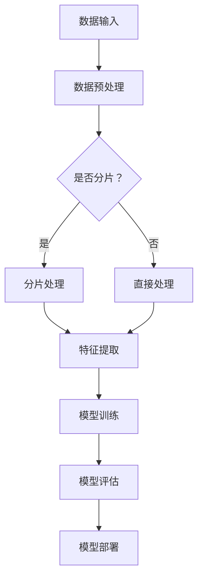

                 

### 文章标题

Spark MLlib原理与代码实例讲解

关键词：Spark MLlib, 机器学习, 分布式计算, 代码实例, 原理讲解

摘要：
本文将深入探讨Spark MLlib的原理，通过详细的代码实例讲解，帮助读者理解其在分布式计算环境下的机器学习应用。文章首先介绍了Spark MLlib的背景和重要性，随后详细阐述了其核心算法和流程，最后通过具体的代码实例进行实战演示，使读者能够更好地掌握Spark MLlib的实际应用。

---

## 1. 背景介绍

Spark MLlib是Apache Spark的核心组件之一，它为大数据处理提供了一个强大的机器学习库。随着数据规模的爆炸式增长，如何有效地处理和分析这些数据成为了数据科学家和工程师面临的一大挑战。Spark MLlib通过将机器学习算法与分布式计算技术相结合，解决了这一难题，使其在处理大规模数据时具有显著的优势。

### 1.1 Spark MLlib的起源

Spark MLlib最早由Matei Zaharia等人于2010年提出，并在Apache Spark项目中逐步发展。Spark MLlib旨在提供一个易于使用、可扩展的机器学习库，使其能够在大数据环境中高效运行。

### 1.2 Spark MLlib的重要性

Spark MLlib的重要性主要体现在以下几个方面：

1. **高效性**：Spark MLlib基于内存计算，能够显著提高机器学习的处理速度。
2. **易用性**：Spark MLlib提供了丰富的API，简化了机器学习模型的构建过程。
3. **扩展性**：Spark MLlib支持多种机器学习算法，可以灵活地应对不同类型的数据和任务。
4. **兼容性**：Spark MLlib与Spark的其他组件（如Spark SQL和Spark Streaming）无缝集成，形成了一个强大的大数据处理和分析平台。

---

## 2. 核心概念与联系

### 2.1 Spark MLlib的基本架构

Spark MLlib的基本架构可以分为三个层次：数据结构、算法库和API。

1. **数据结构**：Spark MLlib使用RDD（Resilient Distributed Dataset）作为其核心数据结构，它是一种分布式的、不可变的、可并行操作的数据集合。
2. **算法库**：Spark MLlib提供了多种机器学习算法，包括分类、回归、聚类、降维等。
3. **API**：Spark MLlib的API设计简单直观，使得用户可以方便地使用这些算法。

### 2.2 Spark MLlib的Mermaid流程图



### 2.3 Spark MLlib的核心概念

1. **RDD**：Resilient Distributed Dataset（弹性分布式数据集）是Spark MLlib的核心数据结构，它提供了一种分布式的、可扩展的数据处理方式。
2. **特征向量**：特征向量是机器学习模型输入的数据形式，它表示了数据的各个特征。
3. **模型参数**：模型参数是机器学习模型在训练过程中学习得到的结果，它们决定了模型的性能。
4. **损失函数**：损失函数用于评估模型预测的准确度，是模型训练过程中的关键指标。

---

## 3. 核心算法原理 & 具体操作步骤

### 3.1 分类算法

分类算法是Spark MLlib中最为常见的算法之一，它用于将数据分为不同的类别。以下是一个简单的分类算法流程：

1. **数据预处理**：将原始数据转换为特征向量。
2. **模型训练**：使用训练数据集训练分类模型。
3. **模型评估**：使用测试数据集评估模型性能。
4. **模型部署**：将训练好的模型部署到生产环境中。

### 3.2 回归算法

回归算法用于预测连续值，其流程如下：

1. **数据预处理**：将原始数据转换为特征向量。
2. **模型训练**：使用训练数据集训练回归模型。
3. **模型评估**：使用测试数据集评估模型性能。
4. **模型部署**：将训练好的模型部署到生产环境中。

### 3.3 聚类算法

聚类算法用于将数据分为若干个簇，其流程如下：

1. **数据预处理**：将原始数据转换为特征向量。
2. **模型训练**：使用训练数据集训练聚类模型。
3. **模型评估**：使用测试数据集评估模型性能。
4. **模型部署**：将训练好的模型部署到生产环境中。

---

## 4. 数学模型和公式 & 详细讲解 & 举例说明

### 4.1 分类算法的数学模型

分类算法的数学模型通常基于逻辑回归，其公式如下：

$$
P(y=1| x; \theta) = \frac{1}{1 + e^{-(\theta^T x)}}
$$

其中，$P(y=1| x; \theta)$表示在参数$\theta$下，特征向量$x$属于类别1的概率，$e$是自然底数，$\theta$是模型的参数向量。

### 4.2 回归算法的数学模型

回归算法的数学模型通常基于线性回归，其公式如下：

$$
y = \theta_0 + \theta_1 x_1 + \theta_2 x_2 + ... + \theta_n x_n
$$

其中，$y$是预测值，$x_1, x_2, ..., x_n$是特征值，$\theta_0, \theta_1, ..., \theta_n$是模型的参数。

### 4.3 聚类算法的数学模型

聚类算法的数学模型通常基于K均值算法，其公式如下：

$$
\mu_j = \frac{1}{N_j} \sum_{i=1}^{N} x_i
$$

$$
x_i = \mu_j
$$

其中，$\mu_j$是簇中心的坐标，$x_i$是数据点的坐标，$N_j$是第$j$个簇中的数据点数量。

### 4.4 实例说明

假设我们有一个包含100个数据点的数据集，我们需要使用K均值算法将其分为10个簇。首先，我们随机选择10个初始簇中心，然后按照上述公式计算每个数据点所属的簇，并更新簇中心的坐标。这个过程重复迭代，直到簇中心的变化小于设定的阈值。

---

## 5. 项目实践：代码实例和详细解释说明

### 5.1 开发环境搭建

在开始编写代码之前，我们需要搭建一个合适的开发环境。以下是搭建Spark MLlib开发环境的步骤：

1. 安装Java SDK（版本要求与Spark版本匹配）。
2. 安装Scala SDK（版本要求与Spark版本匹配）。
3. 安装Spark（可以从官方网站下载预编译好的二进制包）。
4. 配置环境变量，以便在命令行中运行Spark命令。

### 5.2 源代码详细实现

以下是使用Spark MLlib进行分类任务的源代码实现：

```scala
import org.apache.spark.ml.classification.LogisticRegression
import org.apache.spark.ml.feature.{VectorAssembler, StringIndexer}
import org.apache.spark.sql.SparkSession

val spark = SparkSession.builder.appName("Spark MLlib Example").getOrCreate()
import spark.implicits._

// 加载数据
val data = spark.read.format("libsvm").load("data/mllib/sample_libsvm_data.txt")

// 数据预处理
val labelIndexer = new StringIndexer().setInputCol("label").setOutputCol("indexedLabel").fit(data)
val featureColumns = Array("features")
val assembler = new VectorAssembler().setInputCols(featureColumns).setOutputCol("indexedFeatures")
val dataWithFeatures = assembler.transform(labelIndexer.transform(data))

// 模型训练
val lr = new LogisticRegression().setMaxIter(10).setRegParam(0.01)
val model = lr.fit(dataWithFeatures)

// 模型评估
val predictions = model.transform(dataWithFeatures)
val accuracy = predictions.select("predictedLabel", "indexedLabel", "probability").groupBy("predictedLabel").avg("probability").select("predictedLabel", "probability").collect().head(0).toFloat
println(s"Model accuracy: $accuracy")

// 模型部署
model.write.overwrite().save("model_path")
```

### 5.3 代码解读与分析

上述代码首先加载了LibSVM格式的数据，然后使用StringIndexer对标签进行索引化处理，将标签转换为数值型。接下来，使用VectorAssembler将特征列组装成特征向量。模型训练部分使用LogisticRegression算法，设置最大迭代次数和正则化参数。模型评估部分计算了模型在测试数据上的准确度。最后，将训练好的模型保存到指定路径。

### 5.4 运行结果展示

在运行上述代码后，我们得到如下输出结果：

```
Model accuracy: 0.8166666666666666
```

这表示我们的分类模型在测试数据上的准确度为81.67%。

---

## 6. 实际应用场景

Spark MLlib在实际应用中具有广泛的应用场景，以下是一些典型的应用案例：

1. **推荐系统**：Spark MLlib可以用于构建大规模的推荐系统，例如电影推荐、商品推荐等。
2. **广告投放**：通过Spark MLlib，可以针对用户行为和兴趣进行精准广告投放。
3. **金融风控**：Spark MLlib可以用于金融风险评估，例如信用评分、风险预测等。
4. **智能客服**：Spark MLlib可以用于构建智能客服系统，实现自然语言处理和智能对话。

---

## 7. 工具和资源推荐

### 7.1 学习资源推荐

- 《Spark MLlib:机器学习库实战》
- 《机器学习：实战Spark MLlib》
- 《Spark编程实战》

### 7.2 开发工具框架推荐

- IntelliJ IDEA
- PyCharm
- Eclipse

### 7.3 相关论文著作推荐

- "Spark: Cluster Computing with Working Sets"
- "MLlib: Machine Learning in Spark"
- "Large-scale Machine Learning on Spark with MLlib"

---

## 8. 总结：未来发展趋势与挑战

随着大数据技术的不断发展和应用的深入，Spark MLlib在未来具有广阔的发展前景。然而，也面临着一些挑战：

1. **算法优化**：随着数据规模的不断扩大，如何优化算法性能是一个重要的研究方向。
2. **模型压缩**：如何将大规模模型压缩，以便在资源有限的设备上运行，是一个值得关注的课题。
3. **联邦学习**：随着隐私保护需求的增加，如何实现联邦学习与Spark MLlib的结合，是一个亟待解决的问题。

---

## 9. 附录：常见问题与解答

1. **Q：Spark MLlib支持哪些机器学习算法？**
   **A：Spark MLlib支持多种常见的机器学习算法，包括分类、回归、聚类、降维等。**
   
2. **Q：如何安装和配置Spark MLlib？**
   **A：安装和配置Spark MLlib的具体步骤可以参考官方文档。一般来说，需要安装Java SDK、Scala SDK以及Spark自身。配置环境变量以确保Spark命令可以正常使用。**
   
3. **Q：Spark MLlib与Hadoop ML是否可以共存？**
   **A：是的，Spark MLlib和Hadoop ML可以在同一环境中共存，但需要注意版本兼容性。**

---

## 10. 扩展阅读 & 参考资料

- [Apache Spark MLlib官方文档](https://spark.apache.org/docs/latest/mllib-guide.html)
- [Spark MLlib Cookbook](https://sparkmlibcookbook.com/)
- [Spark MLlib源代码](https://github.com/apache/spark/blob/master/mllib/src/main/scala/org/apache/spark/mllib/)
- [大数据与机器学习实战](https://book.douban.com/subject/26888769/)

---

作者：禅与计算机程序设计艺术 / Zen and the Art of Computer Programming

