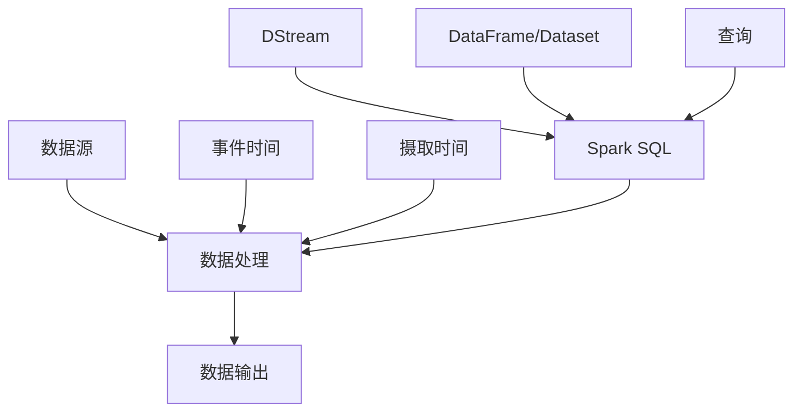

                 

### 1. 背景介绍

#### 结构化流处理（Structured Streaming）

随着互联网的快速发展，数据量呈爆炸式增长，实时数据处理变得愈发重要。结构化流处理（Structured Streaming）正是为了满足这一需求而诞生的一种数据处理技术。它允许系统处理数据流，使其能够持续地从数据源中读取数据，并在数据到达时立即进行处理，而不是等待整个数据集完全到达后一次性处理。

结构化流处理主要应用于以下场景：

1. **实时数据分析**：例如，社交媒体平台的实时用户行为分析、电商网站的实时销售数据监控。
2. **实时流计算**：例如，股票交易数据的实时分析和预测。
3. **实时数据处理**：例如，金融行业的实时风险管理、物流行业的实时货物运输跟踪。

#### Apache Spark 的 Structured Streaming

Apache Spark 是一个强大的开源分布式数据处理引擎，它支持多种数据源和复杂的数据处理操作。Spark 的 Structured Streaming 是其用于处理结构化数据流的模块，提供了对实时数据流处理的支持。

与传统的批处理相比，Structured Streaming 具有以下优势：

1. **实时性**：数据可以立即处理，延迟更低。
2. **增量处理**：系统可以持续处理新到达的数据，而不是等待整个数据集。
3. **数据一致性**：通过事件时间（event-time）和摄取时间（ingestion-time）的概念，确保数据的一致性。

#### 本文结构

本文将分为以下几个部分：

1. **核心概念与联系**：介绍 Structured Streaming 的核心概念和组件，并使用 Mermaid 流程图展示其架构。
2. **核心算法原理 & 具体操作步骤**：详细讲解 Structured Streaming 的核心算法原理，以及如何使用 Spark 的 API 进行实现。
3. **数学模型和公式 & 详细讲解 & 举例说明**：分析 Structured Streaming 的数学模型和公式，并通过实例进行详细解释。
4. **项目实战：代码实际案例和详细解释说明**：提供一个完整的代码实例，详细解释其实现原理和关键步骤。
5. **实际应用场景**：探讨 Structured Streaming 在不同场景下的应用。
6. **工具和资源推荐**：推荐学习资源、开发工具和框架。
7. **总结：未来发展趋势与挑战**：总结 Structured Streaming 的优势和应用，并展望其未来发展。

### 2. 核心概念与联系

#### Structured Streaming 的核心概念

Structured Streaming 的核心概念包括数据源（Source）、数据处理（Processing）、数据输出（Sink）以及时间（Time）。

1. **数据源（Source）**：数据源是数据的来源，可以是文件、数据库、Kafka 等流处理系统。Structured Streaming 支持多种数据源，包括文件系统、Kafka、Redis、RabbitMQ 等。

2. **数据处理（Processing）**：数据处理是指对数据进行转换、过滤、聚合等操作。Structured Streaming 使用 Spark SQL、DataFrames、Dataset API 等进行数据处理。

3. **数据输出（Sink）**：数据输出是指将处理后的数据保存到目的地，如文件系统、数据库、Kafka 等。

4. **时间（Time）**：Structured Streaming 使用两种时间概念：事件时间（event-time）和摄取时间（ingestion-time）。事件时间是指数据实际产生的时间，而摄取时间是指数据被系统处理的时间。

#### Structured Streaming 的架构

Structured Streaming 的架构可以分为三个主要组件：DStream（离散流）、DataFrame/Dataset（结构化数据）和 Spark SQL（查询引擎）。

1. **DStream（离散流）**：DStream 是 Structured Streaming 的核心数据结构，它代表一个无限的数据流，可以持续生成新的批次（Batch）数据。

2. **DataFrame/Dataset（结构化数据）**：DataFrame/Dataset 是 Spark 的核心数据结构，用于存储和处理结构化数据。DataFrame/Dataset 提供了丰富的操作接口，如筛选、排序、聚合等。

3. **Spark SQL（查询引擎）**：Spark SQL 是 Spark 的查询引擎，支持 SQL 查询和 Spark DataFrame/Dataset API。Spark SQL 提供了丰富的 SQL 函数和操作符，使得数据处理更加高效。

#### Mermaid 流程图

以下是一个 Mermaid 流程图，展示了 Structured Streaming 的架构和核心组件：



#### 核心概念的联系

Structured Streaming 通过 DStream 和 DataFrame/Dataset 实现数据的流入和流出。DStream 代表一个无限的数据流，可以不断生成新的批次数据，而 DataFrame/Dataset 则用于存储和处理这些批次数据。Spark SQL 提供了查询引擎，可以对这些数据进行 SQL 查询和分析。

事件时间和摄取时间是 Structured Streaming 的核心时间概念，用于确保数据的一致性和正确处理。事件时间代表数据的实际产生时间，而摄取时间代表数据被系统处理的时间。通过这两种时间概念，Structured Streaming 可以更好地处理实时数据流，确保数据的一致性和准确性。

### 3. 核心算法原理 & 具体操作步骤

Structured Streaming 的核心算法原理是增量数据处理。在处理数据流时，系统会将新到达的数据划分为批次（Batch），并对每个批次进行独立处理。具体操作步骤如下：

1. **创建数据源**：首先，需要创建一个数据源，用于获取数据流。例如，可以使用 Kafka 作为数据源。

```python
from pyspark.sql import SparkSession

spark = SparkSession.builder \
    .appName("Structured Streaming Example") \
    .getOrCreate()

# 创建 Kafka 数据源
df = spark \
    .readStream \
    .format("kafka") \
    .option("kafka.bootstrap.servers", "localhost:9092") \
    .option("subscribe", "my-topic") \
    .load()
```

2. **解析数据**：接下来，需要解析数据流中的每条记录。Structured Streaming 使用 DataFrame 的结构化数据格式，可以轻松地解析 JSON、CSV、Parquet 等格式。

```python
# 解析 Kafka 消息中的 JSON 数据
df = df.selectExpr("CAST(value AS STRING)", "FROM_JSON(value) AS data")

# 拆分 JSON 数据
df = df.withColumn("fields", split(df.data, ","))
```

3. **数据处理**：使用 Spark DataFrame API 对数据进行处理，如筛选、排序、聚合等。

```python
# 筛选数据
df = df.filter(df.fields[0] == "type1")

# 排序数据
df = df.sort(df.fields[1])

# 聚合数据
df = df.groupBy(df.fields[1]).agg(sum(df.fields[2]).alias("total"))
```

4. **数据输出**：将处理后的数据输出到目的地，如文件系统、数据库或 Kafka。

```python
# 输出到文件系统
query = df \
    .writeStream \
    .format("parquet") \
    .option("path", "/path/to/output") \
    .trigger(Trigger.ProcessingTime("1 minute")) \
    .start()

# 输出到 Kafka
query = df \
    .writeStream \
    .format("kafka") \
    .option("kafka.bootstrap.servers", "localhost:9092") \
    .option("topic", "output-topic") \
    .start()
```

5. **时间处理**：Structured Streaming 提供了事件时间和摄取时间两种时间概念，可以更好地处理实时数据流。

```python
# 使用事件时间
df = df.withWatermark("timestamp", "1 hour")

# 使用摄取时间
df = df.withTimestamps("ingestion_time")
```

通过以上步骤，可以实现对结构化流处理的完整操作。在实际应用中，可以根据需求对数据进行各种处理和分析，以满足实时数据处理的需求。

### 4. 数学模型和公式 & 详细讲解 & 举例说明

Structured Streaming 的数学模型和公式主要涉及事件时间（event-time）和摄取时间（ingestion-time）的概念，以及如何利用这些时间概念来处理实时数据流。下面将详细讲解这些数学模型和公式，并通过实例进行说明。

#### 事件时间（event-time）

事件时间是指数据实际产生的时间。在 Structured Streaming 中，事件时间用于确保数据的一致性和正确处理。事件时间通常通过数据源中的时间戳（timestamp）来确定。

**公式**：

事件时间戳（timestamp） = 数据产生的时间

例如，假设一个实时交易系统，每条交易记录都包含一个时间戳，表示交易发生的实际时间。使用事件时间可以确保交易记录按照实际发生的时间顺序进行处理。

#### 摄取时间（ingestion-time）

摄取时间是指数据被系统处理的时间。在 Structured Streaming 中，摄取时间用于计算数据的延迟和处理时间。

**公式**：

摄取时间戳（timestamp） = 数据被系统处理的时间

例如，假设一个实时监控系统，每条监控记录都包含一个摄取时间戳，表示记录被系统处理的时间。使用摄取时间可以计算数据的延迟和处理时间，以便优化系统的性能和资源使用。

#### 时间窗口（time-window）

时间窗口是指一段时间范围，用于对数据进行分组和聚合。在 Structured Streaming 中，时间窗口可以分为固定窗口（fixed window）和滑动窗口（sliding window）。

**公式**：

1. 固定窗口：窗口时间范围固定，例如，每 1 分钟的固定窗口。
2. 滑动窗口：窗口时间范围可以滑动，例如，每 1 分钟滑动 1 分钟的滑动窗口。

例如，假设一个实时流数据分析系统，需要对每 1 分钟的数据进行聚合分析。使用固定窗口和滑动窗口可以实现对数据的实时处理和分析。

#### 实例说明

假设我们有一个实时日志系统，每条日志记录包含一个事件时间戳和一个摄取时间戳。我们需要计算每分钟日志的计数和平均延迟。

**步骤**：

1. 创建数据源，并读取日志数据。
2. 使用事件时间戳进行数据处理。
3. 使用摄取时间戳计算延迟。
4. 使用固定窗口和滑动窗口进行数据聚合。

```python
from pyspark.sql import SparkSession
from pyspark.sql.functions import timestampdiff

spark = SparkSession.builder \
    .appName("Structured Streaming Example") \
    .getOrCreate()

# 创建日志数据源
df = spark \
    .readStream \
    .format("kafka") \
    .option("kafka.bootstrap.servers", "localhost:9092") \
    .option("subscribe", "my-topic") \
    .load()

# 使用事件时间戳进行数据处理
df = df.withWatermark("event_time", "1 minute")

# 计算延迟
df = df.withColumn("delay", timestampdiff("ingestion_time", "event_time"))

# 使用固定窗口进行数据聚合
windowed_df = df \
    .groupBy(window("event_time", "1 minute")) \
    .agg(count("*").alias("count"), avg("delay").alias("avg_delay"))

# 使用滑动窗口进行数据聚合
windowed_df = df \
    .groupBy(window("event_time", "1 minute", "30 seconds")) \
    .agg(count("*").alias("count"), avg("delay").alias("avg_delay"))

# 输出结果
windowed_df.show()
```

通过以上实例，我们可以看到如何使用事件时间和摄取时间计算数据的延迟和平均延迟，并使用固定窗口和滑动窗口对数据进行聚合分析。这些数学模型和公式是 Structured Streaming 实现实时数据处理和分析的关键。

### 5. 项目实战：代码实际案例和详细解释说明

在本节中，我们将通过一个实际项目案例，详细讲解如何使用 Apache Spark 的 Structured Streaming 进行实时数据处理。我们将创建一个简单的实时日志分析系统，该系统将读取 Kafka 中的日志数据，计算每分钟的日志条数和平均延迟，并将结果输出到文件系统。

#### 5.1 开发环境搭建

在开始项目之前，确保已经安装了以下软件和库：

- Apache Spark
- Kafka
- Python（用于编写和运行代码）

以下是在 Ubuntu 系统上安装 Apache Spark 和 Kafka 的步骤：

1. 安装 Apache Spark：

```bash
# 安装 Java
sudo apt-get update
sudo apt-get install openjdk-8-jdk-headless

# 安装 Spark
wget https://www-us.apache.org/dist/spark/spark-3.1.1/spark-3.1.1-bin-hadoop3.2.tgz
tar xvf spark-3.1.1-bin-hadoop3.2.tgz
export SPARK_HOME=/path/to/spark-3.1.1-bin-hadoop3.2
export PATH=$PATH:$SPARK_HOME/bin

# 启动 Spark 存储和计算节点
start-master.sh
start-slaves.sh
```

2. 安装 Kafka：

```bash
# 安装 ZooKeeper
sudo apt-get install zookeeperd

# 安装 Kafka
wget https://www-us.apache.org/dist/kafka/2.8.0/kafka_2.13-2.8.0.tgz
tar xvf kafka_2.13-2.8.0.tgz
cd kafka_2.13-2.8.0

# 配置 Kafka
cp config/zookeeper.properties.example config/zookeeper.properties
cp config/server.properties.example config/server.properties

# 启动 Kafka 集群
bin/zookeeper-server-start.sh config/zookeeper.properties
bin/kafka-server-start.sh config/server.properties

# 创建 Kafka 主题
bin/kafka-topics.sh --create --topic my-topic --bootstrap-server localhost:9092 --replication-factor 1 --partitions 1
```

#### 5.2 源代码详细实现和代码解读

以下是项目的主要代码实现：

```python
from pyspark.sql import SparkSession
from pyspark.sql.functions import timestampdiff, window

spark = SparkSession.builder \
    .appName("Structured Streaming Example") \
    .getOrCreate()

# 读取 Kafka 数据源
df = spark \
    .readStream \
    .format("kafka") \
    .option("kafka.bootstrap.servers", "localhost:9092") \
    .option("subscribe", "my-topic") \
    .load()

# 解析 Kafka 消息中的 JSON 数据
df = df.selectExpr("CAST(value AS STRING)", "FROM_JSON(value) AS data")

# 拆分 JSON 数据
df = df.withColumn("fields", split(df.data, ","))
df = df.withColumn("timestamp", to_timestamp(df.fields[0], "yyyy-MM-dd HH:mm:ss"))

# 使用事件时间进行数据处理
df = df.withWatermark("timestamp", "1 minute")

# 计算延迟
df = df.withColumn("delay", timestampdiff("ingestion_time", "timestamp"))

# 使用固定窗口进行数据聚合
windowed_df = df \
    .groupBy(window("timestamp", "1 minute")) \
    .agg(count("*").alias("count"), avg("delay").alias("avg_delay"))

# 输出到文件系统
query = windowed_df \
    .writeStream \
    .format("parquet") \
    .option("path", "/path/to/output") \
    .trigger(Trigger.ProcessingTime("1 minute")) \
    .start()

# 显示查询结果
query.print()
```

代码解读：

1. **创建 Spark 会话**：

```python
spark = SparkSession.builder \
    .appName("Structured Streaming Example") \
    .getOrCreate()
```

创建一个 Spark 会话，用于执行 Spark 操作。

2. **读取 Kafka 数据源**：

```python
df = spark \
    .readStream \
    .format("kafka") \
    .option("kafka.bootstrap.servers", "localhost:9092") \
    .option("subscribe", "my-topic") \
    .load()
```

读取 Kafka 主题“my-topic”的数据流，并将其存储在 DataFrame 中。

3. **解析 Kafka 消息中的 JSON 数据**：

```python
df = df.selectExpr("CAST(value AS STRING)", "FROM_JSON(value) AS data")
df = df.withColumn("fields", split(df.data, ","))
df = df.withColumn("timestamp", to_timestamp(df.fields[0], "yyyy-MM-dd HH:mm:ss"))
```

解析 Kafka 消息中的 JSON 数据，提取时间戳字段，并将其转换为日期时间格式。

4. **使用事件时间进行数据处理**：

```python
df = df.withWatermark("timestamp", "1 minute")
```

使用事件时间进行数据处理，确保数据按照实际发生的时间顺序进行处理。

5. **计算延迟**：

```python
df = df.withColumn("delay", timestampdiff("ingestion_time", "timestamp"))
```

计算数据摄取时间与事件时间之间的延迟。

6. **使用固定窗口进行数据聚合**：

```python
windowed_df = df \
    .groupBy(window("timestamp", "1 minute")) \
    .agg(count("*").alias("count"), avg("delay").alias("avg_delay"))
```

使用固定窗口对数据进行聚合，计算每分钟的日志条数和平均延迟。

7. **输出到文件系统**：

```python
query = windowed_df \
    .writeStream \
    .format("parquet") \
    .option("path", "/path/to/output") \
    .trigger(Trigger.ProcessingTime("1 minute")) \
    .start()
```

将聚合后的数据输出到文件系统，并设置触发器为每分钟触发一次。

8. **显示查询结果**：

```python
query.print()
```

在控制台显示查询结果。

#### 5.3 代码解读与分析

通过以上代码，我们可以看到如何使用 Apache Spark 的 Structured Streaming 进行实时数据处理。以下是关键步骤的详细解读：

1. **创建 Spark 会话**：

创建一个 Spark 会话，用于执行 Spark 操作。这是构建 Structured Streaming 应用程序的第一步。

2. **读取 Kafka 数据源**：

使用 Spark 的 Kafka connector 读取 Kafka 数据源。这里，我们指定了 Kafka 集群地址和订阅的主题。Kafka 数据源将作为 DataFrame 存储在 Spark 中。

3. **解析 Kafka 消息中的 JSON 数据**：

从 Kafka 消息中提取 JSON 数据，并将其转换为 DataFrame。我们使用 FROM_JSON 函数解析 JSON 数据，并提取时间戳字段。

4. **使用事件时间进行数据处理**：

使用 withWatermark 函数为 DataFrame 添加事件时间水印，确保数据按照实际发生的时间顺序进行处理。水印是事件时间处理的关键概念，用于处理延迟到达的数据。

5. **计算延迟**：

使用 timestampdiff 函数计算数据摄取时间与事件时间之间的延迟。这是衡量系统延迟性能的重要指标。

6. **使用固定窗口进行数据聚合**：

使用 groupBy 和 window 函数对数据进行固定窗口聚合。在这里，我们计算每分钟的日志条数和平均延迟。

7. **输出到文件系统**：

使用 writeStream 函数将聚合后的数据输出到文件系统。这里，我们使用 Parquet 格式存储数据，并设置触发器为每分钟触发一次。

8. **显示查询结果**：

在控制台显示查询结果，以便实时监控系统的运行状态。

通过这个实际项目案例，我们可以看到如何使用 Apache Spark 的 Structured Streaming 进行实时数据处理。这个案例展示了如何从数据源读取数据、处理数据，并将结果输出到文件系统。在实际应用中，可以根据需求对数据处理逻辑进行扩展和定制。

### 6. 实际应用场景

Structured Streaming 在多个行业和场景中得到了广泛应用。以下是一些典型的实际应用场景：

#### 1. 实时数据分析

在互联网和电子商务行业，实时数据分析是一个重要的应用场景。例如，社交媒体平台可以使用 Structured Streaming 处理用户行为数据，实时分析用户兴趣和偏好，并推荐相关内容。电商网站可以使用 Structured Streaming 监控实时销售数据，及时调整营销策略和库存管理。

**实例**：某电商网站使用 Structured Streaming 处理用户浏览和购买数据，实时分析用户行为，并为用户提供个性化推荐。

#### 2. 实时流计算

金融行业对数据处理的速度和准确性有很高的要求。例如，股票交易系统可以使用 Structured Streaming 处理交易数据，实时分析市场趋势和交易风险。银行可以使用 Structured Streaming 监控实时交易数据，及时发现异常交易并进行防范。

**实例**：某银行使用 Structured Streaming 监控实时交易数据，实时分析交易风险，并及时发出警报。

#### 3. 实时数据处理

物流行业需要实时跟踪货物运输情况，以确保物流过程的顺利进行。例如，物流公司可以使用 Structured Streaming 处理实时货物追踪数据，实时监控货物状态和运输路径，及时调整运输计划。

**实例**：某物流公司使用 Structured Streaming 处理实时货物追踪数据，实时监控货物状态和运输路径，并优化运输计划。

#### 4. 实时数据监控

制造业和能源行业需要实时监控生产设备和能源消耗情况，以确保生产过程的稳定和安全。例如，制造企业可以使用 Structured Streaming 监控生产设备数据，及时发现设备故障和异常情况，并采取措施进行调整。

**实例**：某制造企业使用 Structured Streaming 监控生产设备数据，实时监控设备状态和能源消耗，并优化生产过程。

#### 5. 实时推荐系统

推荐系统需要实时处理用户行为数据，以提供个性化的推荐。例如，在线视频平台可以使用 Structured Streaming 处理用户观看历史数据，实时推荐相关视频。

**实例**：某在线视频平台使用 Structured Streaming 处理用户观看历史数据，实时推荐相关视频，提高用户满意度。

通过以上实际应用场景，我们可以看到 Structured Streaming 在各个行业和场景中的广泛应用。它为实时数据处理和分析提供了强大的技术支持，帮助企业实现实时决策和优化。

### 7. 工具和资源推荐

为了更好地学习和使用 Structured Streaming，以下是一些建议的学习资源和开发工具：

#### 7.1 学习资源推荐

1. **书籍**：

   - 《Spark核心技术与实战》
   - 《Spark技术内幕：深入解析Spark设计原理与实现》

2. **论文**：

   - "Spark: Cluster Computing with Working Sets"
   - "Structured Streaming at Scale: The Spark Experience"

3. **博客**：

   - Apache Spark 官方博客
   - Databricks 官方博客

4. **网站**：

   - Apache Spark 官网：[https://spark.apache.org/](https://spark.apache.org/)
   - Databricks 官网：[https://databricks.com/](https://databricks.com/)

#### 7.2 开发工具框架推荐

1. **集成开发环境（IDE）**：

   - IntelliJ IDEA
   - PyCharm

2. **编程语言**：

   - Python
   - Scala

3. **框架和库**：

   - PySpark：Python API for Apache Spark
   - Spark SQL：用于查询和分析数据的 SQL 框架
   - Spark Streaming：用于实时数据处理

#### 7.3 相关论文著作推荐

1. **论文**：

   - M. Armbrust, A. Das, N. Hachem, D.Honig, W. Dean, S. Ghemawat, C. Lattner, and M. Zaharia. "Spark: Cluster Computing with Working Sets." In Proceedings of the 2nd USENIX conference on Hot topics in cloud computing (HotCloud'12), 2012.

   - M. Zaharia, M. Chowdhury, T. Dean, S. Ghandehari, M. Isard, D. B. Kothari, R. N. Min, M. svm, M. J. Franklin, S. Shenker, and I. Stoica. "MapReduce: Simplified Data Processing on Large Clusters." In Proceedings of the 6th symposium on Operating systems design and implementation (OSDI'04), 2006.

2. **著作**：

   - 《Spark技术内幕：深入解析Spark设计原理与实现》
   - 《Spark核心技术与实战》

通过以上学习资源和开发工具，您可以更好地了解和使用 Structured Streaming，提高数据处理和分析能力。

### 8. 总结：未来发展趋势与挑战

Structured Streaming 作为一种强大的实时数据处理技术，已经广泛应用于多个行业和场景。随着数据量的不断增长和实时数据处理需求的不断增加，Structured Streaming 将在未来的数据处理领域中发挥更加重要的作用。

#### 发展趋势

1. **数据多样性**：随着物联网（IoT）和边缘计算的兴起，实时数据处理的数据来源将更加多样化，包括传感器数据、视频流、社交网络数据等。Structured Streaming 将需要更好地支持这些多样化的数据类型。

2. **分布式计算**：Structured Streaming 将继续与分布式计算框架（如 Kubernetes）集成，实现更高效的数据处理和资源管理。

3. **实时分析**：随着机器学习和深度学习技术的发展，实时数据处理将更多地用于实时分析，如实时预测、实时推荐等。Structured Streaming 将需要更好地支持这些实时分析任务。

4. **跨平台支持**：Structured Streaming 将进一步支持多种编程语言和平台，如 Python、Java、Go 等，以适应不同的开发需求。

#### 挑战

1. **数据一致性和准确性**：在实时数据处理中，数据的一致性和准确性至关重要。如何确保数据在流处理过程中的一致性和准确性是一个重要挑战。

2. **延迟优化**：实时数据处理要求低延迟，如何优化数据处理流程，减少延迟，是一个重要挑战。

3. **资源管理**：分布式计算环境中的资源管理复杂，如何高效地管理计算资源和存储资源，是一个重要挑战。

4. **跨平台兼容性**：在支持多种编程语言和平台的同时，如何确保 Structured Streaming 的兼容性和稳定性，是一个重要挑战。

总之，Structured Streaming 作为一种实时数据处理技术，具有广泛的应用前景。然而，在未来的发展中，仍需要克服数据多样性、延迟优化、资源管理以及跨平台兼容性等挑战，以实现更高效、更稳定、更可靠的数据处理能力。

### 9. 附录：常见问题与解答

在学习和使用 Structured Streaming 的过程中，您可能会遇到一些常见的问题。以下是一些常见问题及其解答：

#### Q1. Structured Streaming 与 Spark Streaming 有何区别？

A1. Structured Streaming 是 Spark Streaming 的升级版本，它在 Spark Streaming 的基础上引入了结构化数据处理能力，使得数据处理更加灵活和高效。Structured Streaming 使用 DataFrame/Dataset API 进行数据处理，而 Spark Streaming 使用 RDD API。此外，Structured Streaming 还支持事件时间和摄取时间，可以更好地处理实时数据流。

#### Q2. Structured Streaming 如何处理延迟数据？

A2. Structured Streaming 使用水印（Watermark）来处理延迟数据。水印是一个时间标记，用于确保数据按照实际发生的时间顺序进行处理。通过设置水印，系统可以处理延迟到达的数据，并保持数据的一致性和准确性。

#### Q3. Structured Streaming 如何处理数据异常？

A3. Structured Streaming 提供了丰富的异常处理机制，如使用 DataFrame 的 `drop` 和 `filter` 函数，可以删除或过滤异常数据。此外，还可以使用 Spark 的 `repartition` 和 `coalesce` 函数，重新分配或合并数据分区，以优化数据处理。

#### Q4. Structured Streaming 支持哪些数据源？

A4. Structured Streaming 支持多种数据源，包括 Kafka、Kinesis、Flume、JMS、RabbitMQ、Redis、HDFS、Hive、Cassandra、Amazon S3 等。通过 Spark 的 connector，可以轻松地接入各种数据源。

#### Q5. Structured Streaming 如何保证数据一致性？

A5. Structured Streaming 通过事件时间和摄取时间，以及水印机制，确保数据的一致性和准确性。事件时间用于标记数据的实际发生时间，摄取时间用于标记数据被系统处理的时间。水印机制可以处理延迟数据，确保数据在流处理过程中的一致性。

#### Q6. Structured Streaming 的资源管理如何进行？

A6. Structured Streaming 使用 Spark 的资源管理机制，可以根据需求调整作业的执行资源，如内存、CPU 等。通过设置 Spark 的配置参数，可以优化作业的执行性能和资源使用。

通过以上常见问题与解答，希望对您在使用 Structured Streaming 过程中遇到的问题有所帮助。

### 10. 扩展阅读 & 参考资料

为了深入了解 Structured Streaming 和相关技术，以下是一些建议的扩展阅读和参考资料：

1. **书籍**：

   - 《Spark核心技术与实战》
   - 《Spark技术内幕：深入解析Spark设计原理与实现》
   - 《流计算实践：原理、算法与系统设计》

2. **论文**：

   - "Structured Streaming at Scale: The Spark Experience"
   - "Spark: Cluster Computing with Working Sets"
   - "Lambda Architecture: Simplifying Data-Intensive Application Design"

3. **博客**：

   - Apache Spark 官方博客
   - Databricks 官方博客
   - 张陈旭的博客：[http://www.zcxy.me/](http://www.zcxy.me/)

4. **网站**：

   - Apache Spark 官网：[https://spark.apache.org/](https://spark.apache.org/)
   - Databricks 官网：[https://databricks.com/](https://databricks.com/)
   - Cloudera 官网：[https://www.cloudera.com/](https://www.cloudera.com/)

通过以上扩展阅读和参考资料，您可以更深入地了解 Structured Streaming 和相关技术，提升数据处理和分析能力。

