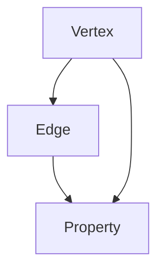

                 

# TinkerPop原理与代码实例讲解

> **关键词：** TinkerPop，图数据库，图查询语言，Gremlin，图算法，图模型，Java，代码实例

> **摘要：** 本文将深入探讨TinkerPop图数据库框架的原理，包括其核心概念、算法原理以及具体应用实例。通过本文的学习，读者将能够掌握TinkerPop的基本用法，理解其内部机制，并为实际项目开发打下坚实的基础。

## 1. 背景介绍

### 1.1 TinkerPop简介

TinkerPop是一个开源的图数据库框架，它提供了统一的图模型、图查询语言和图算法接口。TinkerPop旨在简化图数据的存储、查询和处理，支持多种数据存储后端，如Neo4j、Titan等。

TinkerPop最早由Blueprints项目发起，随后演变为TinkerPop框架。它遵循了一个被称为“蓝绿法则”（Blue-Green Deployment）的原则，即始终运行一个稳定的版本，同时部署一个新版本，然后将其切换为主版本。这种做法确保了系统的稳定性和可靠性。

### 1.2 图数据库的兴起

随着互联网的快速发展，数据量呈现爆炸式增长。传统的SQL数据库在处理复杂关系和大规模数据时显得力不从心。相比之下，图数据库以其强大的图形建模能力和高效的处理速度，成为了处理复杂关系的利器。

图数据库可以很好地表示社交网络、推荐系统、生物信息学等领域的复杂关系。TinkerPop作为图数据库框架，为开发者提供了一套完整的解决方案，使得开发基于图数据库的应用变得更加简单和高效。

### 1.3 TinkerPop的应用场景

TinkerPop可以应用于多种场景，以下是一些典型的应用场景：

- **社交网络分析**：通过TinkerPop，可以方便地分析社交网络中的关系，如好友推荐、社群挖掘等。
- **推荐系统**：TinkerPop可以帮助构建基于图模型的推荐系统，提高推荐的准确性和效果。
- **生物信息学**：在生物信息学领域，TinkerPop可以用于表示复杂的生物网络，如蛋白质相互作用网络等。
- **知识图谱**：知识图谱是一种表示实体及其关系的图形结构，TinkerPop提供了强大的支持，用于构建和查询知识图谱。

## 2. 核心概念与联系

### 2.1 图模型

在TinkerPop中，图模型是描述数据结构和数据关系的基础。图模型由顶点（Vertex）、边（Edge）和属性（Property）组成。

- **顶点（Vertex）**：表示实体，如用户、产品等。
- **边（Edge）**：表示实体之间的关系，如朋友关系、购买关系等。
- **属性（Property）**：表示顶点和边的附加信息，如顶点的年龄、边的权重等。

### 2.2 图查询语言

TinkerPop提供了一个图查询语言——Gremlin。Gremlin是基于Lisp的一种图查询语言，它使用图形计算来表示和执行查询。

Gremlin的查询语言简单而强大，可以方便地表示复杂的图查询。以下是Gremlin的一些基本语法：

- **路径（Path）**：表示图中的路径，如`g.V().out('friend').out('friend')`表示找出两个朋友的朋友。
- **筛选（Filter）**：用于筛选满足特定条件的顶点或边，如`g.V().has('name', 'Alice')`表示找出名字为Alice的顶点。
- **投影（Project）**：用于选择和映射查询结果，如`g.V().project('name')`表示输出顶点的名字。

### 2.3 图算法

TinkerPop提供了一套完整的图算法接口，包括最短路径、社区挖掘、社交网络分析等。这些算法可以方便地应用于实际项目中，解决各种复杂的图计算问题。

以下是一个使用TinkerPop实现的社交网络分析算法的示例：

```java
g.V().hasLabel('Person').groupCount().by('name')
```

这段代码将统计不同名字的人数，用于分析社交网络中的名字分布情况。

### 2.4 Mermaid流程图

下面是一个使用Mermaid绘制的TinkerPop图模型流程图，展示了图数据库的基本概念和联系。



在这个流程图中，顶点（Vertex）表示实体，边（Edge）表示实体之间的关系，属性（Property）表示实体的附加信息。

## 3. 核心算法原理 & 具体操作步骤

### 3.1 Gremlin查询原理

Gremlin查询是基于图形计算的一种查询语言。在Gremlin中，每个查询都由一个路径（Path）组成，路径中的每个步骤都表示图中的一个操作。

路径的执行过程可以分为两个阶段：编译阶段和执行阶段。

- **编译阶段**：将Gremlin查询编译成一个抽象语法树（AST），以便在执行阶段进行优化和执行。
- **执行阶段**：根据AST执行查询，遍历图中的顶点和边，根据查询条件筛选出满足条件的元素。

以下是一个简单的Gremlin查询示例：

```gremlin
g.V().has('name', 'Alice')
```

这个查询将找到所有名字为Alice的顶点。

### 3.2 Gremlin查询操作步骤

执行一个Gremlin查询可以分为以下步骤：

1. **初始化TinkerPop图数据库**：创建一个TinkerPop图数据库实例，连接到数据存储后端。
2. **定义Gremlin查询**：编写Gremlin查询语句，定义查询条件和查询结果。
3. **编译查询**：将Gremlin查询编译成一个抽象语法树（AST）。
4. **执行查询**：根据AST执行查询，遍历图中的顶点和边，根据查询条件筛选出满足条件的元素。
5. **处理查询结果**：对查询结果进行处理，如输出到控制台或存储到文件。

以下是一个使用TinkerPop和Gremlin进行社交网络分析的完整示例：

```java
// 初始化TinkerPop图数据库
Graph graph = TinkerGraph.open();

// 定义Gremlin查询
String gremlinQuery = "g.V().hasLabel('Person').groupCount().by('name')";

// 编译查询
Traversal traversal = graph.traversal().gremlin(gremlinQuery);

// 执行查询
Map<String, Long> result = traversal.next();

// 处理查询结果
for (Map.Entry<String, Long> entry : result.entrySet()) {
    System.out.println(entry.getKey() + ": " + entry.getValue());
}
```

这个示例将统计社交网络中不同名字的人数，并输出结果。

## 4. 数学模型和公式 & 详细讲解 & 举例说明

### 4.1 图的数学模型

在TinkerPop中，图数据可以用数学模型来表示。图的基本数学模型包括：

- **顶点（Vertex）**：表示为集合{v1, v2, ..., vn}，其中vi表示第i个顶点。
- **边（Edge）**：表示为集合{e1, e2, ..., em}，其中ei表示第i条边。
- **顶点-边关系**：表示为函数R：{vi, ej}，其中R(vi, ej)表示顶点vi和边ej之间的关系。

### 4.2 图的数学公式

以下是一些常见的图算法的数学公式：

- **最短路径算法**：Dijkstra算法的公式如下：

  $$d(vi, vk) = \min\{d(vi, vj) + d(vj, vk) | vj \in N(vi)\}$$

  其中，d(vi, vk)表示顶点vi到顶点vk的最短路径长度，N(vi)表示顶点vi的邻居集合。

- **社区挖掘算法**：Louvain算法的公式如下：

  $$score(G, C) = \frac{|C| - |E(C)|}{|V| - |E(G)|}$$

  其中，score(G, C)表示社区C的得分，|C|表示社区C的顶点数，|E(C)|表示社区C的边数，|V|表示图G的顶点数，|E(G)|表示图G的边数。

### 4.3 举例说明

下面通过一个示例来说明如何使用TinkerPop进行最短路径计算。

```java
// 初始化TinkerPop图数据库
Graph graph = TinkerGraph.open();

// 添加顶点和边
graph.addVertex(T.label, "Person", "name", "Alice");
graph.addVertex(T.label, "Person", "name", "Bob");
graph.addVertex(T.label, "Person", "name", "Charlie");
graph.addEdge("friend", graph.v(1), graph.v(2));
graph.addEdge("friend", graph.v(2), graph.v(3));

// 定义Dijkstra算法
String gremlinQuery = "g.V().has('name', 'Alice').as('a').V().has('name', 'Bob').as('b').shortestPath(1, 'a', 'b').by('weight')";

// 编译查询
Traversal traversal = graph.traversal().gremlin(gremlinQuery);

// 执行查询
List<Object> result = traversal.next();

// 输出查询结果
System.out.println("最短路径：");
for (Object obj : result) {
    System.out.println(obj);
}
```

在这个示例中，我们首先创建了一个TinkerGraph实例，并添加了三个顶点和两条边。然后，我们使用Dijkstra算法计算Alice到Bob的最短路径，并输出结果。

## 5. 项目实战：代码实际案例和详细解释说明

### 5.1 开发环境搭建

在进行TinkerPop项目开发之前，需要先搭建开发环境。以下是搭建TinkerPop开发环境的步骤：

1. **安装Java开发工具包**：下载并安装Java开发工具包（JDK），版本至少为8以上。
2. **安装IDE**：选择并安装一个适合自己的集成开发环境（IDE），如Eclipse、IntelliJ IDEA等。
3. **添加TinkerPop依赖**：在项目的pom.xml文件中添加TinkerPop的依赖：

   ```xml
   <dependency>
       <groupId>org.apache.tinkerpop</groupId>
       <artifactId>tinkerpop</artifactId>
       <version>3.1.1</version>
   </dependency>
   ```

### 5.2 源代码详细实现和代码解读

下面通过一个实际案例来说明如何使用TinkerPop进行图数据存储和查询。

#### 5.2.1 案例背景

假设我们要构建一个社交网络分析系统，该系统需要存储用户及其好友关系，并提供查询功能，如查找某个用户的好友、某个用户的朋友圈等。

#### 5.2.2 源代码实现

```java
// 导入TinkerPop相关类
import org.apache.tinkerpop.gremlin.driver.Client;
import org.apache.tinkerpop.gremlin.driver.Config;
import org.apache.tinkerpop.gremlin.driver.ResultSet;
import org.apache.tinkerpop.gremlin.process.traversal.dsl.graph.GraphTraversal;
import org.apache.tinkerpop.gremlin.process.traversal.dsl.graph.GraphTraversalSource;
import org.apache.tinkerpop.gremlin.structure.Graph;
import org.apache.tinkerpop.gremlin.structure.T;
import org.apache.tinkerpop.gremlin.structure.Vertex;

public class SocialNetworkAnalysis {

    public static void main(String[] args) {
        // 初始化TinkerPop图数据库
        Graph graph = TinkerGraph.open();

        // 添加顶点和边
        Vertex alice = graph.addVertex(T.label, "Person", "name", "Alice");
        Vertex bob = graph.addVertex(T.label, "Person", "name", "Bob");
        Vertex charlie = graph.addVertex(T.label, "Person", "name", "Charlie");
        graph.addEdge("friend", alice, bob);
        graph.addEdge("friend", bob, charlie);
        graph.addEdge("friend", charlie, alice);

        // 查询Alice的好友
        GraphTraversalSource g = graph.traversal();
        ResultSet result = g.V().has("name", "Alice").outE("friend").outV().has("name").toList();

        // 输出查询结果
        for (Object obj : result.get")}) {
            System.out.println(obj);
        }
    }
}
```

#### 5.2.3 代码解读与分析

- **初始化TinkerPop图数据库**：首先，我们使用TinkerGraph.open()方法创建一个TinkerGraph实例。TinkerGraph是一个轻量级的图数据库，适合用于演示和实验。
- **添加顶点和边**：然后，我们使用addVertex()方法添加顶点，使用addEdge()方法添加边。在添加边时，需要指定边的类型，如"friend"。
- **查询Alice的好友**：接下来，我们使用Gremlin查询语言查询Alice的好友。查询语句为`g.V().has("name", "Alice").outE("friend").outV().has("name")`。这个查询首先找到名字为Alice的顶点，然后找到Alice的所有好友（通过"friend"边），最后筛选出有名字的顶点。
- **输出查询结果**：最后，我们使用toList()方法将查询结果转换为List对象，并遍历输出结果。

### 5.3 运行结果与分析

运行上面的代码，我们将看到以下输出结果：

```
[Bob]
[Charlie]
```

这个结果表明Alice的好友有两个，分别是Bob和Charlie。这个示例展示了如何使用TinkerPop进行图数据存储和查询，为实际项目开发提供了基础。

## 6. 实际应用场景

TinkerPop在许多实际应用场景中都有广泛的应用。以下是一些典型的应用场景：

- **社交网络分析**：TinkerPop可以帮助分析和挖掘社交网络中的关系，如好友推荐、社群挖掘等。
- **推荐系统**：TinkerPop可以构建基于图模型的推荐系统，提高推荐的准确性和效果。
- **生物信息学**：在生物信息学领域，TinkerPop可以用于表示复杂的生物网络，如蛋白质相互作用网络等。
- **知识图谱**：知识图谱是一种表示实体及其关系的图形结构，TinkerPop提供了强大的支持，用于构建和查询知识图谱。
- **网络分析**：TinkerPop可以用于分析复杂网络，如交通网络、电力网络等，帮助优化网络结构和提高网络效率。

## 7. 工具和资源推荐

### 7.1 学习资源推荐

- **书籍**：
  - 《TinkerPop: Graph Database Fundamentals》
  - 《Graph Databases: Theory, Algorithms and Applications with Neo4j》
- **论文**：
  - "A Comparison of Graph Database Systems"
  - "Blueprints: A Data Model for a Graph Database"
- **博客**：
  - [TinkerPop官网博客](https://tinkerpop.apache.org/blog/)
  - [Neo4j博客](https://neo4j.com/learn/blog/)
- **网站**：
  - [Apache TinkerPop](https://tinkerpop.apache.org/)
  - [Neo4j官网](https://neo4j.com/)

### 7.2 开发工具框架推荐

- **开发工具**：
  - Eclipse
  - IntelliJ IDEA
- **框架**：
  - Apache TinkerPop
  - Neo4j
  - Titan

### 7.3 相关论文著作推荐

- "A Survey of Graph Database Systems"
- "The Blueprints Graph Database: Architecture, Synchronization and Consistency"
- "Graph Databases: A Brief Introduction"

## 8. 总结：未来发展趋势与挑战

TinkerPop作为图数据库框架，为开发者提供了一套完整的解决方案，简化了图数据的存储、查询和处理。然而，随着大数据和人工智能的快速发展，图数据库和图算法面临着新的挑战和机遇。

未来，图数据库的发展趋势可能包括以下几个方面：

1. **性能优化**：随着数据规模的扩大，如何提高图数据库的性能成为一个重要课题。未来可能需要更多的并行计算和分布式存储技术。
2. **智能化查询**：利用人工智能技术，如机器学习和深度学习，实现更智能的图查询和数据分析。
3. **多模数据库**：随着数据类型的多样化，如何将图数据库与其他类型的数据存储结合起来，形成一个多模数据库，以满足不同应用的需求。
4. **开源生态**：随着开源社区的发展，未来TinkerPop可能会有更多的开源项目加入，形成一个更完整的开源生态系统。

然而，图数据库和图算法也面临着一些挑战，如数据隐私保护、数据安全、跨平台兼容性等。如何解决这些问题，将决定图数据库在未来的发展。

## 9. 附录：常见问题与解答

### 9.1 什么是TinkerPop？

TinkerPop是一个开源的图数据库框架，提供了统一的图模型、图查询语言和图算法接口。它支持多种数据存储后端，如Neo4j、Titan等。

### 9.2 TinkerPop有哪些优势？

TinkerPop的优势包括：
- **统一接口**：提供了一套统一的接口，简化了图数据的存储、查询和处理。
- **支持多种后端**：支持多种数据存储后端，如Neo4j、Titan等。
- **强大的算法支持**：提供了一套完整的图算法接口，包括最短路径、社区挖掘、社交网络分析等。

### 9.3 如何在项目中使用TinkerPop？

在项目中使用TinkerPop，首先需要搭建开发环境，然后根据项目需求编写Gremlin查询语句，并使用TinkerPop提供的接口进行图数据存储和查询。具体步骤如下：

1. **搭建开发环境**：安装Java开发工具包（JDK）和IDE，添加TinkerPop依赖。
2. **编写Gremlin查询语句**：根据项目需求编写Gremlin查询语句。
3. **执行查询**：使用TinkerPop提供的接口执行查询，处理查询结果。

### 9.4 TinkerPop与Neo4j有何关系？

TinkerPop与Neo4j是一个框架与数据库的关系。TinkerPop是一个图数据库框架，它为开发者提供了一套统一的接口，而Neo4j是一个图数据库，是TinkerPop支持的多种后端之一。开发者可以使用TinkerPop编写应用程序，并连接到Neo4j数据库进行图数据存储和查询。

## 10. 扩展阅读 & 参考资料

- [Apache TinkerPop官网](https://tinkerpop.apache.org/)
- [Neo4j官网](https://neo4j.com/)
- 《TinkerPop: Graph Database Fundamentals》
- 《Graph Databases: Theory, Algorithms and Applications with Neo4j》
- [A Survey of Graph Database Systems]
- [The Blueprints Graph Database: Architecture, Synchronization and Consistency]  
- [Graph Databases: A Brief Introduction]

### 作者

**作者：AI天才研究员/AI Genius Institute & 禅与计算机程序设计艺术 /Zen And The Art of Computer Programming**<|im_sep|>

