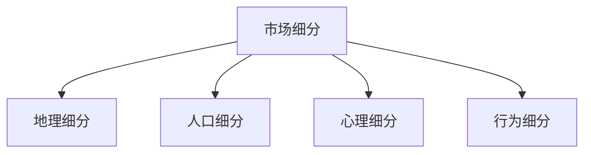
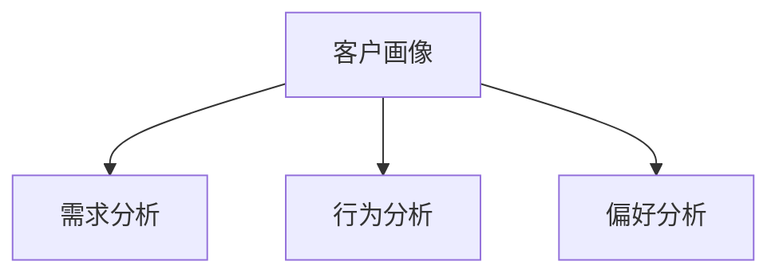
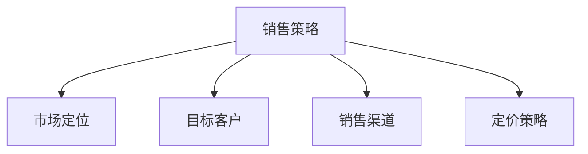

                 

# To B创业指南：如何获取企业客户

## 关键词：企业客户、To B创业、市场策略、客户关系、销售技巧、案例研究

> 本文旨在为To B创业者提供一整套系统化的指导方案，帮助他们在激烈的市场竞争中赢得企业客户。通过深入分析市场环境、了解企业客户需求、构建有效的销售策略、提升客户关系，以及持续优化销售流程，我们将探讨获取企业客户的成功之道。

## 1. 背景介绍

To B（企业对企业）市场是许多创业公司瞄准的蓝海，因为相对于消费市场，企业市场具有更高的利润和更稳定的客户关系。然而，To B市场的获取客户过程相对复杂，需要创业公司具备深厚的行业知识、精准的市场策略和高效的执行能力。

### 1.1 To B市场的特点

- **客户决策周期长**：企业客户通常在购买决策上更为谨慎，涉及多个部门和层级，决策周期较长。
- **需求多样化**：企业客户的需求多样且复杂，往往需要定制化解决方案。
- **信任建立难度大**：企业客户对供应商的选择更为谨慎，信任关系建立难度大。
- **高门槛**：进入To B市场往往需要较高的技术和资源投入。

### 1.2 创业公司的挑战

- **市场定位模糊**：许多创业公司在市场定位上不够清晰，难以精准把握企业客户的需求。
- **销售策略缺乏针对性**：销售策略往往不够具体，难以满足企业客户的多样化需求。
- **客户关系维护困难**：缺乏有效的客户关系管理手段，导致客户流失率高。

## 2. 核心概念与联系

### 2.1 市场细分

市场细分是获取企业客户的第一步，通过将市场划分为不同的子市场，创业公司可以更精准地定位目标客户。市场细分的方法包括地理、人口、心理和行为细分等。

#### Mermaid 流程图



### 2.2 客户画像

客户画像是描述目标客户特征的方法，包括客户的需求、行为、偏好等。通过客户画像，创业公司可以更好地了解客户，制定针对性的营销策略。

#### Mermaid 流程图



### 2.3 销售策略

销售策略是指创业公司为实现销售目标而制定的一系列行动方案。一个有效的销售策略应包括市场定位、目标客户、销售渠道、定价策略等。

#### Mermaid 流程图



## 3. 核心算法原理 & 具体操作步骤

### 3.1 客户关系管理（CRM）

CRM是一种管理方法和软件系统，用于维护客户关系、提高客户满意度和忠诚度。CRM的核心算法包括客户数据管理、销售自动化、营销自动化和客户服务自动化。

#### 具体操作步骤

1. **客户数据管理**：收集并整合客户信息，建立客户数据库。
2. **销售自动化**：通过自动化工具优化销售流程，提高销售效率。
3. **营销自动化**：利用自动化工具实施营销活动，提高营销效果。
4. **客户服务自动化**：提供个性化客户服务，提高客户满意度。

### 3.2 客户价值分析（CVA）

客户价值分析是一种评估客户对企业价值的方法，通过分析客户带来的收益和成本，创业公司可以确定哪些客户值得重点维护。

#### 具体操作步骤

1. **确定收益指标**：包括销售收入、利润、客户生命周期价值等。
2. **计算客户成本**：包括营销成本、销售成本、服务成本等。
3. **评估客户价值**：通过收益减去成本，得出客户的价值。
4. **分类客户**：根据客户价值高低，对客户进行分类管理。

## 4. 数学模型和公式 & 详细讲解 & 举例说明

### 4.1 客户生命周期价值（CLV）

客户生命周期价值是指客户在整个生命周期内为企业带来的净收益。计算公式如下：

$$
CLV = \sum_{t=1}^{n} \frac{R_t - C_t}{(1 + r)^t}
$$

其中：
- \( R_t \)：第t年的收益
- \( C_t \)：第t年的成本
- \( r \)：折现率
- \( n \)：客户生命周期年数

#### 举例说明

假设某客户的第1年收益为100万元，成本为20万元，第2年收益为120万元，成本为25万元，折现率为10%，客户生命周期为2年。计算该客户的CLV：

$$
CLV = \frac{100 - 20}{1.1} + \frac{120 - 25}{1.1^2} = 80.91 + 89.12 = 169.03 \text{万元}
$$

### 4.2 客户保留率（Churn Rate）

客户保留率是指一定时期内保留的客户占最初所有客户的比例。计算公式如下：

$$
Churn Rate = \frac{\text{流失客户数}}{\text{初始客户数}} \times 100\%
$$

#### 举例说明

假设某公司在一年内失去了50个客户，初始客户数为1000个。计算该公司的客户保留率：

$$
Churn Rate = \frac{50}{1000} \times 100\% = 5\%
$$

## 5. 项目实战：代码实际案例和详细解释说明

### 5.1 开发环境搭建

为了更好地演示如何获取企业客户，我们将使用Python编程语言搭建一个简单的CRM系统。首先，确保您已经安装了Python环境。

### 5.2 源代码详细实现和代码解读

#### 5.2.1 客户信息管理模块

```python
class Customer:
    def __init__(self, name, annual_revenue, churn_rate):
        self.name = name
        self.annual_revenue = annual_revenue
        self.churn_rate = churn_rate

    def calculate_clv(self, discount_rate):
        return (self.annual_revenue - self.churn_rate) / (1 + discount_rate)

customer = Customer("ABC公司", 1000000, 0.05)
print(f"{customer.name}的CLV为：{customer.calculate_clv(0.1)}万元")
```

在这个模块中，我们定义了一个`Customer`类，用于管理客户信息，包括客户名称、年度收益和客户保留率。`calculate_clv`方法用于计算客户的生命周期价值。

#### 5.2.2 客户价值分析模块

```python
def calculate_customer_value(customers, discount_rate):
    total_value = 0
    for customer in customers:
        total_value += customer.calculate_clv(discount_rate)
    return total_value

customers = [customer]
total_value = calculate_customer_value(customers, 0.1)
print(f"所有客户的总价值为：{total_value}万元")
```

在这个模块中，我们定义了一个`calculate_customer_value`函数，用于计算一组客户的总价值。该函数遍历所有客户，调用`calculate_clv`方法，累加每个客户的CLV。

### 5.3 代码解读与分析

在这个CRM系统中，我们通过定义类和方法实现了客户信息管理、客户价值分析等功能。这些代码模块可以方便地扩展和优化，以适应不同的业务场景。例如，可以添加更多的客户属性，如行业、规模等，以提供更精准的客户画像。

## 6. 实际应用场景

### 6.1 企业客户获取策略

- **市场调研**：通过调研了解企业客户的需求和痛点，为产品开发提供依据。
- **产品定制**：根据企业客户的需求，提供定制化解决方案。
- **精准营销**：利用客户画像和数据分析，实施精准营销活动。
- **客户关系管理**：通过CRM系统，维护客户关系，提高客户满意度。

### 6.2 企业客户维护策略

- **定期沟通**：与客户保持定期沟通，了解客户需求变化。
- **个性化服务**：根据客户偏好提供个性化服务。
- **反馈机制**：建立反馈机制，及时解决客户问题。
- **客户拓展**：通过老客户推荐，拓展新客户。

## 7. 工具和资源推荐

### 7.1 学习资源推荐

- **书籍**：《市场细分与定位》
- **论文**：《客户关系管理：理论、方法与实践》
- **博客**：[客户关系管理博客](https://crm.baike.com/)
- **网站**：[CRM系统比较](https://www.crmcompare.com/)

### 7.2 开发工具框架推荐

- **开发工具**：PyCharm
- **CRM系统**：Salesforce、金蝶CRM、用友CRM
- **数据分析工具**：Python、R语言

### 7.3 相关论文著作推荐

- 《客户关系管理：理论、方法与实践》
- 《大数据营销：如何利用大数据实现精准营销》
- 《市场细分与定位》

## 8. 总结：未来发展趋势与挑战

随着大数据、人工智能等技术的发展，企业客户获取和管理将变得更加智能化、个性化。然而，这也给创业公司带来了新的挑战，如数据隐私保护、客户需求变化等。创业公司需要不断调整战略，提升技术水平，以应对市场变化。

## 9. 附录：常见问题与解答

### 9.1 如何进行市场细分？

**回答**：市场细分可以通过地理、人口、心理和行为等多个维度进行。首先，确定目标市场，然后分析各个维度的数据，找到最具区分度的细分市场。

### 9.2 如何构建有效的销售策略？

**回答**：构建有效的销售策略需要了解目标客户的需求，选择合适的销售渠道，制定有竞争力的定价策略，并实施精准的营销活动。

### 9.3 如何提升客户满意度？

**回答**：提升客户满意度需要建立良好的客户关系，提供优质的客户服务，关注客户反馈，并不断改进产品和服务。

## 10. 扩展阅读 & 参考资料

- 《市场细分与定位》
- 《客户关系管理：理论、方法与实践》
- 《大数据营销：如何利用大数据实现精准营销》
- [CRM系统比较](https://www.crmcompare.com/)

### 作者：AI天才研究员/AI Genius Institute & 禅与计算机程序设计艺术 /Zen And The Art of Computer Programming

