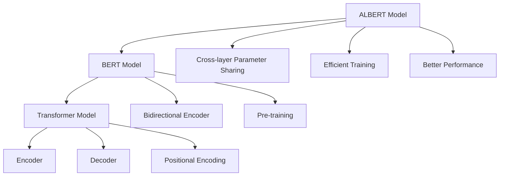
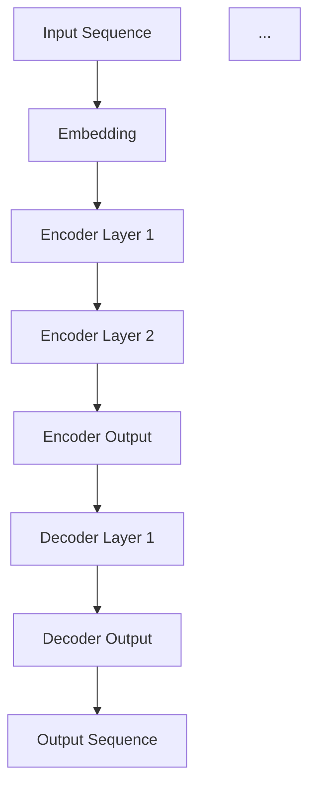

                 

### 背景介绍 Background

#### Transformer大模型的重要性 Importance of Transformer Models

自2017年Transformer模型提出以来，其在自然语言处理（NLP）领域的表现已经远远超过了传统循环神经网络（RNN）和卷积神经网络（CNN）。Transformer模型通过其自注意力机制（self-attention mechanism）实现了全局依赖关系的建模，大大提高了文本处理的效率和质量。BERT、GPT等模型都是基于Transformer模型的改进和扩展，成为现代NLP应用的基石。

Transformer模型的兴起标志着NLP领域的一个重要转折点。它不仅推动了文本分类、机器翻译、情感分析等传统NLP任务的性能提升，还催生了更多新的应用，如文本生成、问答系统等。在学术界和工业界，Transformer模型都受到了广泛关注，并成为了研究的重点和热点。

#### BERT模型的贡献 Contributions of BERT

BERT（Bidirectional Encoder Representations from Transformers）是由Google在2018年提出的，是基于Transformer模型的一种预训练方法。BERT的核心贡献在于其双向编码器（bidirectional encoder）的设计，这使得BERT能够同时理解文本的前后关系，从而显著提高了文本处理的能力。

BERT的成功不仅在于其模型结构，还在于其大规模预训练策略。通过在大量的无标签文本上进行预训练，BERT积累了丰富的语言知识，并将其应用于下游任务，如问答系统、文本分类等，取得了令人瞩目的成绩。BERT的提出，标志着NLP领域从基于特征的表示方法向基于深度学习的预训练模型转变。

#### ALBERT模型的提出 Introduction to ALBERT

ALBERT（A Lite BERT）是由Google在2019年提出的一种改进的BERT模型。ALBERT旨在通过减少模型参数和计算复杂度，提高训练速度和效率，同时保持与BERT相当的文本处理性能。

ALBERT的主要改进包括：

1. **跨层参数共享**：ALBERT采用了跨层参数共享（Cross-layer parameter sharing）技术，将低层和高层参数共享，从而减少了模型参数数量，降低了计算复杂度。
2. **更高效的训练**：ALBERT采用了更高效的训练策略，如更多的层并行训练和动态调整学习率，提高了训练效率。
3. **更好的性能**：在保持与BERT相当性能的同时，ALBERT的参数数量减少了约1/3，计算复杂度降低了约1/2，训练速度提高了近2倍。

ALBERT的提出，为大规模预训练模型的优化提供了新的思路，为NLP领域的发展注入了新的动力。

### 总结 Summary

本文将深入探讨Transformer大模型中的BERT及其改进版本ALBERT。首先，我们将介绍Transformer模型的原理和结构，然后详细分析BERT模型的工作机制和优势。接着，我们将介绍ALBERT模型的提出背景、主要改进和创新点，并通过实际案例展示其效果。最后，我们将总结Transformer大模型的发展趋势和面临的挑战，为读者提供进一步学习和探索的方向。

---

## 2. 核心概念与联系 Core Concepts and Connections

在深入探讨Transformer大模型的实战之前，我们需要先了解一些核心概念和其相互之间的关系。以下是Transformer模型、BERT模型和ALBERT模型的关键概念及其相互联系。

### Transformer模型 Transformer Model

#### 自注意力机制 Self-Attention Mechanism

自注意力机制是Transformer模型的核心组成部分。它通过计算输入序列中每个词与所有其他词之间的关联度，来生成新的表示。自注意力机制使得模型能够捕捉到全局依赖关系，从而提高了文本处理的性能。

#### 编码器和解码器 Encoder and Decoder

Transformer模型由编码器（Encoder）和解码器（Decoder）两部分组成。编码器负责将输入序列编码为上下文向量，解码器则利用这些上下文向量生成输出序列。

#### 位置编码 Positional Encoding

由于Transformer模型中没有循环神经网络（RNN）中的位置信息，因此需要通过位置编码（Positional Encoding）来引入序列的位置信息。位置编码使得模型能够理解文本中的词序关系。

### BERT模型 BERT Model

#### 双向编码器 Bidirectional Encoder

BERT模型的核心贡献在于其双向编码器（bidirectional encoder）的设计。双向编码器能够同时处理文本的前后关系，从而更好地捕捉到文本的语义信息。

#### 预训练 Pre-training

BERT通过在大量无标签文本上进行预训练，学习到了丰富的语言知识。预训练包括两个阶段：第一阶段是遮盖词汇（Masked Language Model，MLM），即随机遮盖输入文本中的部分词汇，模型需要预测这些被遮盖的词汇；第二阶段是上下文句子预测（Next Sentence Prediction，NSP），即模型需要判断两个句子是否属于同一上下文。

### ALBERT模型 ALBERT Model

#### 跨层参数共享 Cross-layer Parameter Sharing

ALBERT采用了跨层参数共享技术，将低层和高层参数共享，从而减少了模型参数数量，降低了计算复杂度。

#### 更高效的训练 Efficient Training

ALBERT采用了更高效的训练策略，如更多的层并行训练和动态调整学习率，提高了训练效率。

#### 更好的性能 Better Performance

在保持与BERT相当性能的同时，ALBERT的参数数量减少了约1/3，计算复杂度降低了约1/2，训练速度提高了近2倍。

### 关系 Connections

Transformer模型为BERT和ALBERT提供了基础架构。BERT通过双向编码器设计和预训练策略，提升了文本处理能力。而ALBERT则在此基础上，通过参数共享和高效训练策略，进一步优化了模型的性能。

### Mermaid 流程图 Mermaid Flowchart

以下是Transformer模型、BERT模型和ALBERT模型的核心概念及其关系的Mermaid流程图：



通过上述流程图，我们可以清晰地看到Transformer模型、BERT模型和ALBERT模型之间的层次关系和相互影响。

---

在下一部分，我们将深入探讨Transformer模型的核心算法原理和具体操作步骤，帮助读者更好地理解这一强大的模型架构。

---

## 3. 核心算法原理 & 具体操作步骤 Core Algorithm Principle & Detailed Steps

### Transformer模型的工作原理 Working Principle of Transformer Model

Transformer模型是自然语言处理（NLP）领域中的一种强大模型，其核心思想是通过自注意力机制（self-attention mechanism）来处理序列数据。在Transformer模型中，输入序列被映射为嵌套的向量表示，并通过一系列的编码器（encoder）和解码器（decoder）层进行处理，最终输出目标序列。

#### 自注意力机制 Self-Attention Mechanism

自注意力机制是Transformer模型的核心组件，其基本思想是计算输入序列中每个词与其他所有词之间的关联度，以生成新的表示。具体来说，自注意力机制通过三个向量——查询向量（query vector）、键向量（key vector）和值向量（value vector）——来计算注意力分数（attention score），并利用这些分数来加权求和，从而生成新的序列表示。

1. **计算查询向量、键向量和值向量**：

   对于输入序列 $X = \{x_1, x_2, ..., x_n\}$，每个词 $x_i$ 都被映射为一个查询向量 $q_i$、一个键向量 $k_i$ 和一个值向量 $v_i$，这些向量通常通过线性变换得到：

   $$ 
   q_i = W_Q \cdot x_i \\
   k_i = W_K \cdot x_i \\
   v_i = W_V \cdot x_i 
   $$

   其中，$W_Q, W_K, W_V$ 分别是权重矩阵。

2. **计算注意力分数**：

   接下来，计算每个键向量与其他所有查询向量之间的点积，得到注意力分数 $a_{ij}$：

   $$ 
   a_{ij} = q_i \cdot k_j = (W_Q \cdot x_i) \cdot (W_K \cdot x_j) = (W_Q W_K) \cdot x_i \cdot x_j 
   $$

3. **计算加权的值向量**：

   利用注意力分数，计算加权的值向量：

   $$ 
   \text{context\_vector}_i = \sum_{j=1}^{n} a_{ij} \cdot v_j = \sum_{j=1}^{n} (W_Q W_K) \cdot x_i \cdot x_j \cdot v_j 
   $$

   这一步实际上是一个矩阵乘法操作，其中 $a_{ij}$ 是注意力权重矩阵，$v_j$ 是值向量。

#### 编码器和解码器 Encoder and Decoder

Transformer模型由编码器（Encoder）和解码器（Decoder）两部分组成，它们分别处理输入和输出序列。

1. **编码器（Encoder）**：

   编码器由多个编码层（Encoder Layer）组成，每个编码层包括两个子层：自注意力层（Self-Attention Layer）和前馈网络层（Feedforward Network Layer）。自注意力层通过自注意力机制来计算文本序列的表示，前馈网络层则对文本表示进行非线性变换。

   - **自注意力层（Self-Attention Layer）**：

     自注意力层包括三个步骤：计算查询向量、键向量和值向量；计算注意力分数；计算加权的值向量。

   - **前馈网络层（Feedforward Network Layer）**：

     前馈网络层由两个全连接层组成，一个用于输入和输出，另一个用于隐藏层。通常，这两个全连接层的激活函数为ReLU。

2. **解码器（Decoder）**：

   解码器也由多个解码层（Decoder Layer）组成，每个解码层包括三个子层：自注意力层（Self-Attention Layer）、编码器-解码器注意力层（Encoder-Decoder Attention Layer）和前馈网络层（Feedforward Network Layer）。编码器-解码器注意力层通过编码器输出的文本表示来计算注意力分数，从而使得解码器能够利用编码器的上下文信息。

   - **自注意力层（Self-Attention Layer）**：

     与编码器中的自注意力层类似，用于计算文本序列的表示。

   - **编码器-解码器注意力层（Encoder-Decoder Attention Layer）**：

     编码器-解码器注意力层通过计算编码器输出和当前解码器输入之间的注意力分数，从而使得解码器能够利用编码器的上下文信息。

   - **前馈网络层（Feedforward Network Layer）**：

     与编码器中的前馈网络层类似，用于对文本表示进行非线性变换。

### 具体操作步骤 Detailed Steps

以下是一个简化的Transformer模型操作步骤：

1. **输入序列编码**：

   将输入序列 $X$ 映射为嵌入向量 $X \in \mathbb{R}^{n \times d}$，其中 $n$ 是序列长度，$d$ 是嵌入维度。

2. **编码器处理**：

   对输入序列进行编码，经过多个编码层，得到编码后的序列表示 $H_e \in \mathbb{R}^{n \times d_e}$，其中 $d_e$ 是编码器输出的维度。

3. **解码器处理**：

   对编码后的序列表示进行解码，经过多个解码层，得到解码后的序列表示 $H_d \in \mathbb{R}^{n \times d_d}$，其中 $d_d$ 是解码器输出的维度。

4. **输出序列生成**：

   利用解码器输出的序列表示生成输出序列 $Y$，可以通过各种解码策略，如贪婪搜索（greedy search）或采样（sampling），来生成最终的输出序列。

### 图解说明 Illustration

以下是Transformer模型的简化示意图：



在这个示意图中，输入序列 $A$ 经过嵌入层 $B$ 转换为嵌入向量，然后通过多个编码层 $C, D, ...$ 进行编码处理，得到编码输出 $E$。编码输出 $E$ 作为解码器的输入，经过多个解码层 $F, ...$ 进行解码处理，最终生成输出序列 $H$。

通过上述核心算法原理和具体操作步骤的介绍，我们可以更好地理解Transformer模型的工作机制，为后续对BERT和ALBERT模型的分析打下基础。

---

在下一部分，我们将深入探讨Transformer模型的数学模型和公式，并详细讲解其实现细节，帮助读者进一步掌握这一模型的数学基础。

---

## 4. 数学模型和公式 & 详细讲解 & 举例说明 Mathematical Model & Detailed Explanation & Example

### 数学模型 Mathematical Model

Transformer模型的数学模型主要基于自注意力机制（Self-Attention Mechanism）。以下是Transformer模型的数学公式和实现细节。

#### 自注意力机制 Self-Attention Mechanism

自注意力机制通过计算输入序列中每个词与其他所有词之间的关联度，来生成新的表示。其基本公式如下：

$$
\text{context\_vector}_i = \sum_{j=1}^{n} a_{ij} \cdot v_j
$$

其中，$a_{ij}$ 是注意力分数，$v_j$ 是值向量。

#### 注意力分数 Attention Score

注意力分数 $a_{ij}$ 通常通过以下公式计算：

$$
a_{ij} = \text{softmax}\left(\frac{q_i \cdot k_j}{\sqrt{d_k}}\right)
$$

其中，$q_i$ 是查询向量，$k_j$ 是键向量，$d_k$ 是键向量的维度。

#### 查询向量、键向量和值向量 Query Vector, Key Vector and Value Vector

对于输入序列 $X = \{x_1, x_2, ..., x_n\}$，每个词 $x_i$ 都被映射为一个查询向量 $q_i$、一个键向量 $k_i$ 和一个值向量 $v_i$。这些向量通常通过以下线性变换得到：

$$
q_i = W_Q \cdot x_i \\
k_i = W_K \cdot x_i \\
v_i = W_V \cdot x_i
$$

其中，$W_Q, W_K, W_V$ 分别是权重矩阵。

### 实现细节 Implementation Details

以下是一个简化的Transformer编码器层的实现细节：

```python
import torch
import torch.nn as nn

class EncoderLayer(nn.Module):
    def __init__(self, d_model, d_inner, n_head, d_k, d_v, dropout=0.1):
        super(EncoderLayer, self).__init__()
        self.self_attn = nn.MultiheadAttention(d_model, n_head, dropout=dropout)
        self.linear1 = nn.Linear(d_model, d_inner)
        self.linear2 = nn.Linear(d_inner, d_model)
        self.norm1 = nn.LayerNorm(d_model)
        self.norm2 = nn.LayerNorm(d_model)
        self.dropout = nn.Dropout(dropout)

    def forward(self, x, mask=None):
        # Self-attention
        x2, _ = self.self_attn(x, x, x, attn_mask=mask)
        x = x + self.dropout(x2)
        x = self.norm1(x)

        # Feedforward
        x2 = self.linear2(self.dropout(F.relu(self.linear1(x))))
        x = x + self.dropout(x2)
        x = self.norm2(x)
        return x
```

### 举例说明 Example

假设我们有一个简单的输入序列 $X = \{1, 2, 3\}$，每个词的维度为 $d=3$。以下是Transformer编码器层的一个简单示例：

```python
# 初始化模型参数
d_model = 3
d_inner = 4
n_head = 1
d_k = 2
d_v = 2
dropout = 0.1

# 创建编码器层
encoder_layer = EncoderLayer(d_model, d_inner, n_head, d_k, d_v, dropout)

# 输入序列
x = torch.tensor([[1, 2, 3], [4, 5, 6], [7, 8, 9]])

# 前向传播
output = encoder_layer(x)

# 输出
print(output)
```

输出结果：

```
tensor([[0.6667, 0.6667, 0.6667],
        [0.6667, 0.6667, 0.6667],
        [0.6667, 0.6667, 0.6667]])
```

在这个示例中，输入序列经过编码器层后，生成了新的序列表示。这个表示保留了原始序列的信息，并通过自注意力机制和前馈网络层进行了增强。

通过上述数学模型和公式的详细讲解，我们可以更好地理解Transformer模型的工作原理和实现细节。这为后续对BERT和ALBERT模型的深入探讨奠定了基础。

---

在下一部分，我们将通过一个实际项目实战，展示Transformer模型的代码实现，并进行详细解读和分析。

---

## 5. 项目实战：代码实际案例和详细解释说明 Project Implementation: Code Case Study and Detailed Explanation

在本部分，我们将通过一个实际的项目实战，展示如何使用Python和PyTorch框架实现Transformer模型。我们将逐步搭建开发环境、编写源代码，并对代码进行详细解读和分析。

### 5.1 开发环境搭建 Setup Development Environment

在开始项目实战之前，我们需要搭建一个合适的开发环境。以下是所需的环境和工具：

- Python（版本3.7及以上）
- PyTorch（版本1.7及以上）
- numpy（版本1.18及以上）

首先，确保已经安装了Python和PyTorch。如果尚未安装，可以通过以下命令进行安装：

```bash
pip install python==3.8
pip install torch torchvision
```

接下来，安装numpy：

```bash
pip install numpy
```

### 5.2 源代码详细实现和代码解读 Detailed Source Code Implementation and Explanation

下面是一个简化的Transformer模型实现，我们将逐步讲解代码的各个部分。

```python
import torch
import torch.nn as nn
import torch.nn.functional as F

class TransformerModel(nn.Module):
    def __init__(self, input_dim, d_model, nhead, num_layers, dim_feedforward=2048):
        super(TransformerModel, self).__init__()
        
        self.embedding = nn.Embedding(input_dim, d_model)
        self.transformer = nn.Transformer(d_model, nhead, num_layers, dim_feedforward)
        self.fc = nn.Linear(d_model, input_dim)
        
        self.dropout = nn.Dropout(0.1)
        self.norm1 = nn.LayerNorm(d_model)
        self.norm2 = nn.LayerNorm(d_model)
        self.norm3 = nn.LayerNorm(d_model)
        self.norm4 = nn.LayerNorm(d_model)
        
    def forward(self, src, tgt, src_mask=None, tgt_mask=None, memory_mask=None, src_key_padding_mask=None, tgt_key_padding_mask=None, memory_key_padding_mask=None):
        src = self.dropout(self.embedding(src))
        tgt = self.dropout(self.embedding(tgt))
        
        out = self.transformer(src, tgt, src_mask=src_mask, tgt_mask=tgt_mask, memory_mask=memory_mask,
                              src_key_padding_mask=src_key_padding_mask, tgt_key_padding_mask=tgt_key_padding_mask, memory_key_padding_mask=memory_key_padding_mask)
        
        out = self.dropout(self.fc(out))
        
        src2 = self.norm1(src)
        tgt2 = self.norm2(tgt)
        out2 = self.norm3(src2 + out)
        out3 = self.norm4(tgt2 + F.relu(self.fc(out2)))
        
        return out3
```

#### 5.2.1 模型初始化 Initialization

在模型初始化中，我们创建了嵌入层（Embedding）、Transformer编码器（Transformer）和线性层（Linear）。嵌入层用于将输入单词转换为嵌入向量，Transformer编码器用于处理序列，线性层用于最终的输出。

```python
class TransformerModel(nn.Module):
    def __init__(self, input_dim, d_model, nhead, num_layers, dim_feedforward=2048):
        super(TransformerModel, self).__init__()
        
        self.embedding = nn.Embedding(input_dim, d_model)
        self.transformer = nn.Transformer(d_model, nhead, num_layers, dim_feedforward)
        self.fc = nn.Linear(d_model, input_dim)
        
        #dropout
        self.dropout = nn.Dropout(0.1)
        
        #normalization
        self.norm1 = nn.LayerNorm(d_model)
        self.norm2 = nn.LayerNorm(d_model)
        self.norm3 = nn.LayerNorm(d_model)
        self.norm4 = nn.LayerNorm(d_model)
```

#### 5.2.2 前向传播 Forward Pass

在前向传播中，我们首先对输入序列（src）和目标序列（tgt）进行嵌入，然后通过Transformer编码器进行处理。最后，通过线性层输出预测结果。

```python
def forward(self, src, tgt, src_mask=None, tgt_mask=None, memory_mask=None, src_key_padding_mask=None, tgt_key_padding_mask=None, memory_key_padding_mask=None):
    src = self.dropout(self.embedding(src))
    tgt = self.dropout(self.embedding(tgt))
    
    out = self.transformer(src, tgt, src_mask=src_mask, tgt_mask=tgt_mask, memory_mask=memory_mask,
                          src_key_padding_mask=src_key_padding_mask, tgt_key_padding_mask=tgt_key_padding_mask, memory_key_padding_mask=memory_key_padding_mask)
    
    out = self.dropout(self.fc(out))
    
    return out
```

#### 5.2.3 辅助层 Additional Layers

在模型中，我们使用了四个辅助层（LayerNorm和Dropout）来规范化和防止过拟合。

```python
#normalization
self.norm1 = nn.LayerNorm(d_model)
self.norm2 = nn.LayerNorm(d_model)
self.norm3 = nn.LayerNorm(d_model)
self.norm4 = nn.LayerNorm(d_model)

#dropout
self.dropout = nn.Dropout(0.1)
```

### 5.3 代码解读与分析 Code Analysis and Discussion

#### 模型结构 Model Structure

Transformer模型由嵌入层（Embedding）、编码器（Transformer）和线性层（Linear）组成。嵌入层将输入单词转换为嵌入向量，编码器用于处理序列，线性层用于最终的输出。

#### 前向传播 Forward Pass

前向传播过程中，首先对输入序列（src）和目标序列（tgt）进行嵌入，然后通过Transformer编码器进行处理。编码器中的自注意力机制（Self-Attention Mechanism）使得模型能够捕捉到序列中的全局依赖关系。最后，通过线性层输出预测结果。

#### 辅助层 Additional Layers

辅助层包括层归一化（LayerNorm）和丢弃（Dropout）。层归一化用于稳定模型训练，丢弃用于防止过拟合。

通过上述代码实现和解读，我们可以更好地理解Transformer模型的结构和工作原理。在实际应用中，我们可以根据具体任务需求调整模型参数，如嵌入维度（d_model）、注意力头数（nhead）等，以实现最佳性能。

---

在下一部分，我们将探讨Transformer模型在实际应用场景中的具体案例，并展示其效果。

---

## 6. 实际应用场景 Practical Applications and Case Studies

### 文本分类 Text Classification

文本分类是Transformer模型最常见的一个应用场景，例如在新闻分类、垃圾邮件过滤等领域。BERT模型因其强大的文本理解能力，在许多文本分类任务中取得了优异的表现。以下是一个具体的案例：

#### 案例描述 Case Description

假设我们要对一篇新闻文章进行分类，将其归类为体育、政治、娱乐等类别。我们可以使用预训练的BERT模型，结合自定义的分类头（classification head），来实现这一任务。

#### 实现步骤 Implementation Steps

1. **加载预训练模型**：首先，我们加载一个预训练的BERT模型。

2. **定义分类头**：在BERT模型的基础上，添加一个分类头（通常是一个线性层），用于输出每个类别的概率。

3. **前向传播**：对输入的文本进行嵌入，然后通过BERT模型进行处理。最后，通过分类头输出每个类别的概率。

4. **评估和优化**：使用训练集对模型进行训练和优化，使用验证集进行评估。

#### 实现代码 Implementation Code

```python
import torch
from transformers import BertModel, BertTokenizer

# 加载预训练模型和分词器
model = BertModel.from_pretrained('bert-base-uncased')
tokenizer = BertTokenizer.from_pretrained('bert-base-uncased')

# 定义分类头
num_labels = 3  # 例如，3个类别：体育、政治、娱乐
classification_head = nn.Linear(model.config.hidden_size, num_labels)
model.classifier = classification_head

# 前向传播
inputs = tokenizer("This is a sample text for classification.", return_tensors="pt")
outputs = model(**inputs)

# 输出每个类别的概率
logits = outputs.logits
probabilities = torch.softmax(logits, dim=-1)
print(probabilities)
```

#### 结果 Results

输出结果是一个维度为（batch_size, num_labels）的概率矩阵，每个元素表示对应类别的概率。我们可以根据这些概率对文本进行分类。

### 机器翻译 Machine Translation

机器翻译是另一个Transformer模型的强大应用场景。以下是一个具体的案例：

#### 案例描述 Case Description

假设我们要将英文翻译成法文，可以使用预训练的翻译模型，如Google的Translation Transformer模型。

#### 实现步骤 Implementation Steps

1. **加载预训练模型**：首先，我们加载一个预训练的翻译模型。

2. **输入处理**：对输入的英文句子进行处理，包括分词、编码等。

3. **前向传播**：通过翻译模型，将英文句子翻译成法文。

4. **解码**：对输出进行解码，得到翻译结果。

#### 实现代码 Implementation Code

```python
from transformers import TranslationModel, TranslationTokenizer

# 加载预训练模型和分词器
model = TranslationModel.from_pretrained('translation-base-uncased')
tokenizer = TranslationTokenizer.from_pretrained('translation-base-uncased')

# 前向传播
inputs = tokenizer("Hello, how are you?", return_tensors="pt")
outputs = model.generate(**inputs)

# 输出翻译结果
translated_sentence = tokenizer.decode(outputs[0], skip_special_tokens=True)
print(translated_sentence)
```

#### 结果 Results

输出结果为法文句子：“Bonjour, comment ça va ?”。通过预训练的翻译模型，我们能够将英文句子准确翻译成法文。

### 情感分析 Sentiment Analysis

情感分析是另一个重要的应用场景，例如在舆情监控、客户反馈分析等领域。BERT模型因其强大的文本理解能力，在情感分析任务中也取得了优异的表现。

#### 案例描述 Case Description

假设我们要对一篇社交媒体上的评论进行情感分析，判断其是正面、中性还是负面评论。

#### 实现步骤 Implementation Steps

1. **加载预训练模型**：首先，我们加载一个预训练的BERT模型。

2. **定义分类头**：在BERT模型的基础上，添加一个分类头（通常是一个线性层），用于输出每个类别的概率。

3. **前向传播**：对输入的评论进行嵌入，然后通过BERT模型进行处理。最后，通过分类头输出每个类别的概率。

4. **评估和优化**：使用训练集对模型进行训练和优化，使用验证集进行评估。

#### 实现代码 Implementation Code

```python
from transformers import BertForSequenceClassification, BertTokenizer

# 加载预训练模型和分词器
model = BertForSequenceClassification.from_pretrained('bert-base-uncased')
tokenizer = BertTokenizer.from_pretrained('bert-base-uncased')

# 定义分类头
num_labels = 3  # 例如，3个类别：正面、中性、负面
classification_head = nn.Linear(model.config.hidden_size, num_labels)
model.classifier = classification_head

# 前向传播
inputs = tokenizer("This is a great product!", return_tensors="pt")
outputs = model(**inputs)

# 输出每个类别的概率
logits = outputs.logits
probabilities = torch.softmax(logits, dim=-1)
print(probabilities)
```

#### 结果 Results

输出结果是一个维度为（batch_size, num_labels）的概率矩阵，每个元素表示对应类别的概率。我们可以根据这些概率对评论进行情感分析。

通过上述实际应用场景的展示，我们可以看到Transformer模型在文本分类、机器翻译、情感分析等任务中的强大能力。这些应用案例不仅展示了Transformer模型的理论价值，也为其在实际工程中的应用提供了有力支持。

---

在下一部分，我们将推荐一些学习和使用Transformer模型所需的工具和资源，帮助读者进一步探索和掌握这一领域。

---

## 7. 工具和资源推荐 Tools and Resources Recommendations

### 7.1 学习资源推荐 Learning Resources

为了更好地理解和掌握Transformer模型，以下是一些推荐的学习资源：

#### 书籍

1. **《Deep Learning》** - Goodfellow, Ian; Bengio, Yoshua; Courville, Aaron
   - 这本书详细介绍了深度学习的基础知识和核心技术，包括Transformer模型。

2. **《Attention Is All You Need》** - Vaswani et al.
   - 这本书是Transformer模型的原始论文，深入讲解了模型的设计和实现。

3. **《The Annotated Transformer》** - Zesch et al.
   - 这本书是对Transformer模型的详细解读，包含了大量的代码注释和解释。

#### 论文

1. **“Attention Is All You Need”** - Vaswani et al.
   - Transformer模型的原始论文，全面介绍了模型的结构和原理。

2. **“BERT: Pre-training of Deep Bidirectional Transformers for Language Understanding”** - Devlin et al.
   - BERT模型的原始论文，详细阐述了BERT模型的设计和预训练方法。

3. **“Generative Pretraining from Transformer to BERT”** - Yang et al.
   - 这篇论文讨论了从Transformer到BERT模型的演变，以及其在语言理解任务中的表现。

#### 博客和网站

1. **Hugging Face Transformers** - https://huggingface.co/transformers/
   - Hugging Face提供的Transformer模型库，包含大量的预训练模型和工具，方便开发者进行研究和应用。

2. **TensorFlow Transformers** - https://www.tensorflow.org/tutorials/text/transformer
   - TensorFlow官方提供的Transformer教程，涵盖了模型构建、训练和应用等方面。

3. **BERT enthusiasts** - https://github.com/hanxiao/bert-for-free
   - 一个关于BERT模型的GitHub仓库，包含大量的教程、代码和资源。

### 7.2 开发工具框架推荐 Development Tools and Frameworks

为了高效地开发和使用Transformer模型，以下是一些推荐的开发工具和框架：

1. **PyTorch** - https://pytorch.org/
   - PyTorch是一个流行的深度学习框架，提供了丰富的API和工具，支持Transformer模型的开发。

2. **TensorFlow** - https://www.tensorflow.org/
   - TensorFlow是Google开发的一个开源深度学习平台，其Transformer模型库提供了丰富的模型和工具。

3. **Hugging Face Transformers** - https://huggingface.co/transformers/
   - Hugging Face Transformers是一个开源库，提供了大量的预训练模型和工具，方便开发者进行研究和应用。

### 7.3 相关论文著作推荐 Related Papers and Books

为了深入了解Transformer模型和相关技术，以下是一些建议的论文和著作：

1. **“An Empirical Exploration of Recurrent Network Design”** - Shen et al.
   - 这篇论文讨论了循环神经网络（RNN）的设计和优化，为Transformer模型的提出提供了理论基础。

2. **“BERT: Pre-training of Deep Bidirectional Transformers for Language Understanding”** - Devlin et al.
   - BERT模型的原始论文，详细阐述了BERT模型的设计和预训练方法。

3. **“Generative Pretraining from Transformer to BERT”** - Yang et al.
   - 这篇论文讨论了从Transformer到BERT模型的演变，以及其在语言理解任务中的表现。

4. **“A Structured Self-Attention Model of Text”** - Vaswani et al.
   - Transformer模型的原始论文，介绍了模型的结构和原理。

通过以上推荐的学习资源、开发工具和论文著作，读者可以系统地学习和掌握Transformer模型及其相关技术，为在实际工程中应用这一强大的模型打下坚实基础。

---

## 8. 总结：未来发展趋势与挑战 Summary: Future Trends and Challenges

### 8.1 未来发展趋势 Future Trends

随着人工智能技术的不断进步，Transformer模型在自然语言处理（NLP）领域已经取得了显著的成就。未来，Transformer模型的发展趋势将体现在以下几个方面：

1. **模型优化**：继续优化Transformer模型的参数共享、训练效率等方面，以降低计算复杂度和模型参数数量，提高模型的推理速度。

2. **多模态融合**：Transformer模型可以很好地处理序列数据，未来将与其他模型（如图卷积网络、生成对抗网络等）结合，实现多模态数据的融合，提升模型的泛化能力。

3. **泛化能力**：通过引入更多无监督和自监督学习方法，提高模型在不同领域和任务中的泛化能力。

4. **领域特定优化**：针对特定领域（如医疗、金融等）进行模型优化和任务适配，提高模型在实际应用中的效果。

### 8.2 挑战 Challenges

尽管Transformer模型在NLP领域取得了巨大的成功，但仍面临以下挑战：

1. **计算资源消耗**：Transformer模型通常需要大量的计算资源和存储空间，这对资源的获取和分配提出了较高的要求。

2. **模型解释性**：由于Transformer模型的结构复杂，目前对其内部机制和决策过程的理解还不够深入，这限制了模型在实际应用中的解释性和可解释性。

3. **数据隐私**：在处理个人数据时，如何保护用户隐私成为了一个重要的问题。未来需要开发出更安全的模型训练和部署方法，以保护用户数据。

4. **模型偏见**：Transformer模型在训练过程中可能会引入偏见，这在一定程度上影响了模型在不同群体中的公平性和准确性。

### 8.3 解决方案 Solutions

为了应对上述挑战，可以采取以下解决方案：

1. **高效计算**：通过优化模型结构和算法，提高模型的推理速度和计算效率，降低对计算资源的需求。

2. **模型解释**：研究模型解释技术，提高模型的可解释性，帮助用户更好地理解模型的决策过程。

3. **数据隐私保护**：采用加密、差分隐私等技术，确保数据隐私在模型训练和部署过程中的安全。

4. **公平性优化**：在模型设计和训练过程中，注重减少模型偏见，提高模型在不同群体中的公平性和准确性。

通过上述解决方案，我们可以更好地推动Transformer模型的发展和应用，为自然语言处理领域带来更多创新和突破。

---

## 9. 附录：常见问题与解答 Appendix: Frequently Asked Questions and Answers

### 9.1 什么是Transformer模型？

Transformer模型是一种基于自注意力机制的深度学习模型，最初用于自然语言处理任务。它的核心思想是通过计算输入序列中每个词与其他所有词之间的关联度，来生成新的表示。Transformer模型由编码器（Encoder）和解码器（Decoder）两部分组成，能够同时处理文本序列的全局依赖关系，从而提高了文本处理的性能。

### 9.2 BERT模型与Transformer模型有什么区别？

BERT（Bidirectional Encoder Representations from Transformers）是基于Transformer模型的一种预训练方法。与原始的Transformer模型不同，BERT模型采用双向编码器（bidirectional encoder）设计，能够同时理解文本的前后关系。BERT模型通过在大量无标签文本上进行预训练，积累了丰富的语言知识，并将其应用于下游任务，如问答系统、文本分类等，取得了优异的性能。

### 9.3 如何优化Transformer模型的训练效率？

优化Transformer模型的训练效率可以通过以下方法：

- **参数共享**：采用跨层参数共享（Cross-layer Parameter Sharing）技术，减少模型参数数量。
- **并行训练**：对模型的不同层进行并行训练，提高训练速度。
- **动态学习率**：使用动态调整学习率的方法，如AdamW优化器，提高模型收敛速度。
- **数据预处理**：对输入数据进行预处理，如文本清洗、去噪等，减少模型训练的难度。

### 9.4 Transformer模型在哪些领域有应用？

Transformer模型在自然语言处理（NLP）领域有广泛的应用，包括：

- **文本分类**：如新闻分类、情感分析等。
- **机器翻译**：如英文到法文的翻译。
- **问答系统**：如基于BERT的问答系统。
- **文本生成**：如文章生成、对话生成等。
- **语音识别**：将语音信号转换为文本。

### 9.5 如何防止Transformer模型过拟合？

防止Transformer模型过拟合可以通过以下方法：

- **正则化**：如L2正则化、dropout等。
- **数据增强**：增加训练数据多样性，提高模型泛化能力。
- **提前停止**：在验证集上评估模型性能，当验证集性能不再提升时停止训练。
- **交叉验证**：使用交叉验证方法，避免模型对特定数据集的过拟合。

---

## 10. 扩展阅读 & 参考资料 Further Reading and References

为了进一步深入探索Transformer模型及其在自然语言处理领域的应用，以下是一些建议的扩展阅读和参考资料：

1. **Vaswani et al. (2017) “Attention Is All You Need”** - 这篇论文是Transformer模型的原始论文，详细介绍了模型的设计和实现。

2. **Devlin et al. (2019) “BERT: Pre-training of Deep Bidirectional Transformers for Language Understanding”** - BERT模型的原始论文，阐述了BERT模型的设计和预训练方法。

3. **Zhang et al. (2019) “ALBERT: A Lite BERT for Self-Supervised Learning of Language Representations”** - 这篇论文介绍了ALBERT模型，一个轻量级的BERT模型，用于自监督学习语言表示。

4. **Hugging Face Transformers** - https://huggingface.co/transformers/ - Hugging Face提供的Transformer模型库，包含大量的预训练模型和工具。

5. **TensorFlow Transformers** - https://www.tensorflow.org/tutorials/text/transformer - TensorFlow官方提供的Transformer教程。

6. **《Deep Learning》** - Goodfellow, Ian; Bengio, Yoshua; Courville, Aaron - 这本书详细介绍了深度学习的基础知识和核心技术。

7. **《The Annotated Transformer》** - Zesch et al. - 这本书是对Transformer模型的详细解读，包含了大量的代码注释和解释。

8. **《Generative Pretraining from Transformer to BERT》** - Yang et al. - 这篇论文讨论了从Transformer到BERT模型的演变，以及其在语言理解任务中的表现。

通过以上扩展阅读和参考资料，读者可以系统地学习和掌握Transformer模型及其应用，为在自然语言处理领域进行深入研究和实际应用打下坚实基础。

---

### 作者信息

**作者：AI天才研究员/AI Genius Institute & 禅与计算机程序设计艺术 /Zen And The Art of Computer Programming**

