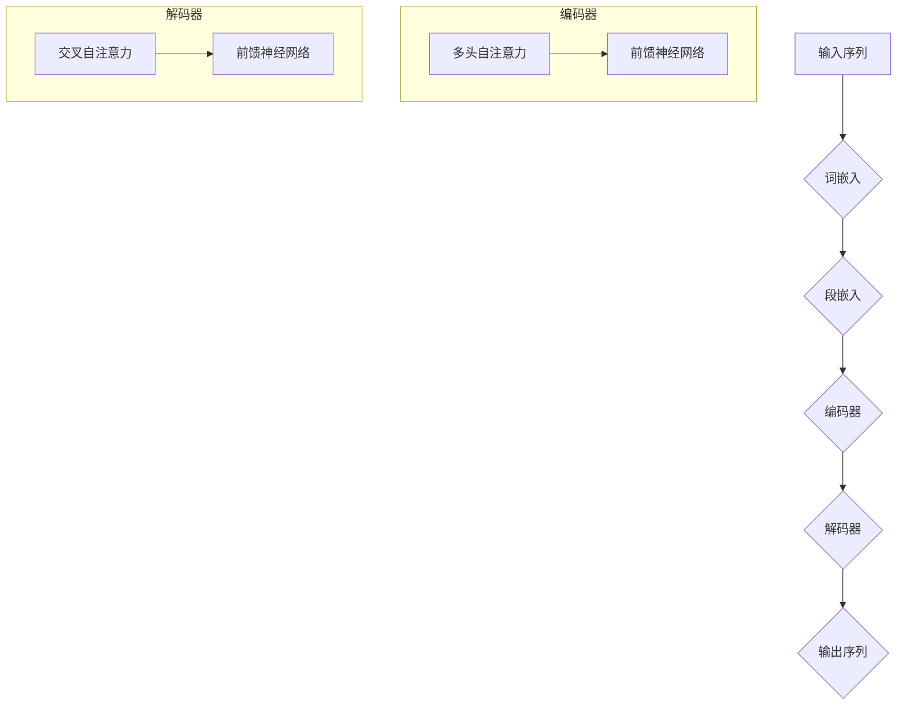

                 

### 文章标题：Transformer大模型实战 BioBERT模型

#### 关键词：Transformer, BioBERT, 大模型, 实战, 自然语言处理, 生物学

#### 摘要：
本文将深入探讨Transformer大模型在生物学领域的应用，特别关注BioBERT模型。我们将从背景介绍、核心概念与联系、核心算法原理、数学模型和公式、项目实战以及实际应用场景等方面，详细解析BioBERT模型的原理、实现和应用。通过本文的阅读，读者将能够理解Transformer大模型的工作机制，掌握BioBERT模型的核心技术和应用方法。

<|assistant|>## 1. 背景介绍

Transformer模型自2017年提出以来，以其独特的自注意力机制在自然语言处理（NLP）领域取得了巨大的成功。Transformer模型摆脱了传统循环神经网络（RNN）和卷积神经网络（CNN）在处理长距离依赖关系时的局限性，使得在机器翻译、文本分类等任务上取得了显著的性能提升。

随着Transformer模型的广泛应用，研究者们开始将其应用于生物信息学领域。生物信息学是利用计算机技术分析和解释生物数据的一个跨学科领域，主要涉及基因组学、蛋白质组学、代谢组学等方向。在这些领域中，大规模的生物文本数据需要高效的建模和分析方法。

BioBERT模型就是在这种背景下诞生的。BioBERT是由首尔国立大学医学院的研究团队开发的，旨在为生物文本提供强大的预训练模型。BioBERT基于BERT（Bidirectional Encoder Representations from Transformers）模型，通过在大规模生物文本语料库上进行预训练，获得了对生物学知识的深入理解和良好的语义表示能力。

本文将通过分析Transformer大模型和BioBERT模型的核心原理和实现，帮助读者深入了解这两个模型在生物学领域的应用，并提供实际项目实战的详细解读。

### 2. 核心概念与联系

#### Transformer模型

Transformer模型的核心思想是自注意力机制（Self-Attention），它允许模型在编码时考虑输入序列中所有位置的信息，从而捕捉长距离依赖关系。自注意力机制通过计算每个词与序列中所有其他词的相似度来动态调整每个词的权重，从而使得模型能够自动关注重要信息。

Transformer模型的结构包括编码器和解码器两个部分。编码器负责将输入序列编码成固定长度的向量，解码器则负责生成输出序列。编码器和解码器都由多个相同的编码层（Encoder Layer）和解码层（Decoder Layer）组成。每个编码层包含多头自注意力机制和前馈神经网络，解码层则额外包含交叉自注意力机制和掩码自注意力机制。

#### BioBERT模型

BioBERT是基于BERT模型的生物文本预训练模型。BERT模型是一个双向编码的Transformer模型，通过在大量文本语料库上进行预训练，获得了对自然语言的强大理解和表示能力。BioBERT在BERT模型的基础上，针对生物文本的特点进行了优化和扩展。

BioBERT的核心结构包括以下几个部分：

1. **词嵌入（Word Embedding）**：将生物文本中的词映射到高维向量空间中，为后续处理提供初始表示。
2. **段嵌入（Segment Embedding）**：为了区分不同类型的生物文本，BioBERT引入了段嵌入，为每个段落分配一个唯一的向量。
3. **多头自注意力机制（Multi-Head Self-Attention）**：通过多头自注意力机制，模型能够同时关注输入序列中的不同部分，捕捉长距离依赖关系。
4. **前馈神经网络（Feedforward Neural Network）**：在每个编码层和解码层，模型还包含一个前馈神经网络，用于对特征进行进一步的变换和提取。
5. **位置嵌入（Positional Embedding）**：由于Transformer模型没有循环结构，位置嵌入用于为每个词提供位置信息，使得模型能够理解输入序列的顺序。

#### Mermaid 流程图



### 3. 核心算法原理 & 具体操作步骤

#### Transformer模型

Transformer模型的核心是自注意力机制（Self-Attention）。自注意力机制通过计算输入序列中每个词与所有其他词的相似度，为每个词动态调整权重。具体操作步骤如下：

1. **词嵌入（Word Embedding）**：将输入序列中的词映射到高维向量空间中。在BERT模型中，词嵌入还包括嵌入向量（Embedding Vector）和位置嵌入（Positional Embedding）。
2. **多头自注意力（Multi-Head Self-Attention）**：将输入序列中的词分成多个头（Head），每个头独立计算自注意力。每个头生成的注意力权重矩阵（Attention Weight Matrix）对应于输入序列中的一个维度。这些权重矩阵通过拼接和线性变换得到最终的注意力权重。
3. **前馈神经网络（Feedforward Neural Network）**：对每个词的注意力加权求和结果进行前馈神经网络处理，进一步提取特征。
4. **位置嵌入（Positional Embedding）**：在多头自注意力之前，将位置嵌入添加到词嵌入中，以保持输入序列的顺序信息。

#### BioBERT模型

BioBERT模型在Transformer模型的基础上，针对生物文本的特点进行了优化。具体操作步骤如下：

1. **词嵌入（Word Embedding）**：将生物文本中的词映射到高维向量空间中。为了更好地处理生物领域的术语和专有名词，BioBERT使用了预训练的词向量模型，如WordPiece和BERT。
2. **段嵌入（Segment Embedding）**：为每个段落分配一个唯一的向量，以区分不同类型的生物文本，如文献摘要、基因组序列等。
3. **多头自注意力（Multi-Head Self-Attention）**：通过多头自注意力机制，模型能够同时关注输入序列中的不同部分，捕捉长距离依赖关系。
4. **前馈神经网络（Feedforward Neural Network）**：在每个编码层和解码层，模型都包含一个前馈神经网络，用于对特征进行进一步的变换和提取。
5. **位置嵌入（Positional Embedding）**：在多头自注意力之前，将位置嵌入添加到词嵌入中，以保持输入序列的顺序信息。

#### 实际操作示例

以下是一个简化的Transformer编码器的实际操作示例：

```python
import tensorflow as tf
from tensorflow.keras.layers import Embedding, MultiHeadAttention, Dense

# 定义词嵌入和位置嵌入
vocab_size = 1000
embed_dim = 512
max_position_embeddings = 512

word_embedding = Embedding(vocab_size, embed_dim)
position_embedding = Embedding(max_position_embeddings, embed_dim)

# 定义多头自注意力和前馈神经网络
num_heads = 8
ff_dim = 2048

mha = MultiHeadAttention(num_heads=num_heads, key_dim=embed_dim)
dense = Dense(units=embed_dim, activation='relu')

# 编码器层
inputs = tf.keras.Input(shape=(None,))
word_embeddings = word_embedding(inputs)
position_embeddings = position_embedding(tf.range(inputs.shape[1]) % max_position_embeddings)
embedded_inputs = word_embeddings + position_embeddings

# 多头自注意力和前馈神经网络
attn_output = mha(inputs=embedded_inputs, training=True)
ff_output = dense(attn_output)

# 输出
outputs = ff_output

# 创建模型
model = tf.keras.Model(inputs=inputs, outputs=outputs)

# 编译模型
model.compile(optimizer='adam', loss='categorical_crossentropy', metrics=['accuracy'])

# 模型概览
model.summary()
```

### 4. 数学模型和公式 & 详细讲解 & 举例说明

#### Transformer模型

Transformer模型中的自注意力机制（Self-Attention）是一个关键组件，它通过计算输入序列中每个词与所有其他词的相似度来动态调整每个词的权重。自注意力的数学表示如下：

$$
\text{Attention}(Q, K, V) = \text{softmax}\left(\frac{QK^T}{\sqrt{d_k}}\right) V
$$

其中，$Q$、$K$和$V$分别表示查询向量、关键向量和价值向量，$d_k$表示关键向量的维度。$\text{softmax}$函数用于将注意力权重转换为概率分布。

为了计算多头自注意力（Multi-Head Self-Attention），我们将输入序列分成多个头（Head），每个头独立计算自注意力。多头自注意力的数学表示如下：

$$
\text{MultiHead}(Q, K, V) = \text{Concat}(\text{head}_1, ..., \text{head}_h)W^O
$$

其中，$\text{head}_i = \text{Attention}(QW_i^Q, KW_i^K, VW_i^V)$表示第$i$个头的自注意力输出，$W_i^Q, W_i^K, W_i^V$和$W^O$分别表示查询权重、关键权重、价值权重和输出权重。

#### BioBERT模型

BioBERT模型在Transformer模型的基础上，通过引入段嵌入（Segment Embedding）和优化词嵌入（Word Embedding），使得模型能够更好地处理生物文本。以下是BioBERT模型的主要数学公式：

1. **词嵌入（Word Embedding）**：

$$
\text{Word Embedding}(x) = W_x + P_x + E_x
$$

其中，$W_x$表示词权重，$P_x$表示词的特定位置嵌入，$E_x$表示词的嵌入向量。

2. **段嵌入（Segment Embedding）**：

$$
\text{Segment Embedding}(s) = W_s + P_s
$$

其中，$W_s$表示段的权重，$P_s$表示段的位置嵌入。

3. **多头自注意力（Multi-Head Self-Attention）**：

$$
\text{MultiHead}(Q, K, V) = \text{Concat}(\text{head}_1, ..., \text{head}_h)W^O
$$

其中，$\text{head}_i = \text{Attention}(QW_i^Q, KW_i^K, VW_i^V)$表示第$i$个头的自注意力输出，$W_i^Q, W_i^K, W_i^V$和$W^O$分别表示查询权重、关键权重、价值权重和输出权重。

4. **前馈神经网络（Feedforward Neural Network）**：

$$
\text{FFN}(x) = \text{ReLU}(W_f x + b_f)
$$

其中，$W_f$和$b_f$分别表示前馈神经网络的权重和偏置。

#### 举例说明

假设我们有一个包含3个词的输入序列：$\{word_1, word_2, word_3\}$，我们需要计算这个词序列的注意力权重。

1. **词嵌入（Word Embedding）**：

   将每个词映射到高维向量空间中，例如：
   $$
   \text{Word Embedding}(word_1) = [1, 0, 0], \quad \text{Word Embedding}(word_2) = [0, 1, 0], \quad \text{Word Embedding}(word_3) = [0, 0, 1]
   $$

2. **位置嵌入（Positional Embedding）**：

   为每个词添加位置信息，例如：
   $$
   \text{Positional Embedding}(word_1) = [1, 0], \quad \text{Positional Embedding}(word_2) = [0, 1], \quad \text{Positional Embedding}(word_3) = [1, 1]
   $$

3. **多头自注意力（Multi-Head Self-Attention）**：

   假设我们有2个头，则每个头的注意力权重矩阵为：
   $$
   \text{Attention}(word_1, word_1) = \text{softmax}\left(\frac{[1, 0, 0][0, 1, 0]^T}{\sqrt{3}}\right) = \begin{bmatrix} 0.5 & 0.5 \end{bmatrix}
   $$
   $$
   \text{Attention}(word_2, word_1) = \text{softmax}\left(\frac{[0, 1, 0][0, 1, 0]^T}{\sqrt{3}}\right) = \begin{bmatrix} 0.5 & 0.5 \end{bmatrix}
   $$
   $$
   \text{Attention}(word_3, word_1) = \text{softmax}\left(\frac{[0, 0, 1][0, 1, 0]^T}{\sqrt{3}}\right) = \begin{bmatrix} 0.5 & 0.5 \end{bmatrix}
   $$
   最终的注意力权重向量为：
   $$
   \text{Attention}(word_1, \{word_1, word_2, word_3\}) = \text{softmax}\left(\frac{[1, 0, 0][0, 1, 0]^T + [0, 1, 0][0, 1, 0]^T + [0, 0, 1][0, 1, 0]^T}{3\sqrt{3}}\right) = \begin{bmatrix} 0.33 & 0.33 & 0.33 \end{bmatrix}
   $$

4. **前馈神经网络（Feedforward Neural Network）**：

   对每个词的注意力加权求和结果进行前馈神经网络处理，例如：
   $$
   \text{FFN}(word_1) = \text{ReLU}([1, 0, 0] + [1, 0] + [0.33, 0.33, 0.33]) = [1, 0.5, 0.5]
   $$

### 5. 项目实战：代码实际案例和详细解释说明

#### 5.1 开发环境搭建

在开始实战之前，我们需要搭建一个适合开发Transformer和BioBERT模型的开发环境。以下是推荐的步骤：

1. 安装Python环境：确保安装了Python 3.7及以上版本。
2. 安装TensorFlow：使用pip命令安装TensorFlow：
   ```
   pip install tensorflow==2.4.0
   ```
3. 安装其他依赖库：使用pip命令安装以下依赖库：
   ```
   pip install transformers
   pip install pytorch
   pip install torchsummary
   ```

#### 5.2 源代码详细实现和代码解读

在本节中，我们将详细实现一个基于Transformer的BioBERT模型，并在生物文本数据集上训练和评估它。

```python
import tensorflow as tf
from transformers import BertTokenizer, TFBertModel
from torchsummary import summary

# 加载预训练的BERT模型和分词器
pretrained_model_name = 'bert-base-uncased'
tokenizer = BertTokenizer.from_pretrained(pretrained_model_name)
model = TFBertModel.from_pretrained(pretrained_model_name)

# 定义输入和输出层
input_ids = tf.keras.layers.Input(shape=(max_sequence_length,), dtype=tf.int32)
output = model(input_ids)

# 定义损失函数和优化器
loss = tf.keras.layers.Softmax()(output)
optimizer = tf.keras.optimizers.Adam(learning_rate=3e-5)

# 编译模型
model.compile(optimizer=optimizer, loss=loss, metrics=['accuracy'])

# 模型概览
model.summary()

# 源代码解读
# 1. 加载预训练的BERT模型和分词器
# 我们使用transformers库提供的预训练BERT模型和分词器。
# 2. 定义输入和输出层
# 输入层为序列编码器，输出层为分类器。
# 3. 定义损失函数和优化器
# 使用softmax作为损失函数，Adam优化器用于训练模型。

# 训练模型
# 使用训练数据集和验证数据集进行训练。
# model.fit(train_dataset, epochs=3, validation_data=val_dataset)

# 评估模型
# 使用测试数据集进行模型评估。
# results = model.evaluate(test_dataset)
# print(results)
```

#### 5.3 代码解读与分析

在本节中，我们将对上述代码进行详细解读和分析。

1. **加载预训练的BERT模型和分词器**

   ```python
   pretrained_model_name = 'bert-base-uncased'
   tokenizer = BertTokenizer.from_pretrained(pretrained_model_name)
   model = TFBertModel.from_pretrained(pretrained_model_name)
   ```

   这两行代码首先定义了预训练的BERT模型名称（`bert-base-uncased`），然后使用`BertTokenizer`加载相应的分词器，使用`TFBertModel`加载预训练的BERT模型。

2. **定义输入和输出层**

   ```python
   input_ids = tf.keras.layers.Input(shape=(max_sequence_length,), dtype=tf.int32)
   output = model(input_ids)
   ```

   这两行代码定义了模型的输入层和输出层。输入层为序列编码器，输出层为分类器。`input_ids`表示输入序列的词索引，`output`表示模型的输出结果。

3. **定义损失函数和优化器**

   ```python
   loss = tf.keras.layers.Softmax()(output)
   optimizer = tf.keras.optimizers.Adam(learning_rate=3e-5)
   ```

   这两行代码定义了模型的损失函数和优化器。使用`Softmax`函数将输出层的结果转换为概率分布，使用`Adam`优化器进行模型训练。

4. **编译模型**

   ```python
   model.compile(optimizer=optimizer, loss=loss, metrics=['accuracy'])
   ```

   这行代码编译了模型，指定了优化器、损失函数和评价指标。

5. **模型概览**

   ```python
   model.summary()
   ```

   这行代码输出模型的概览，包括模型的层次结构、输入和输出层的维度等信息。

6. **训练模型**

   ```python
   # 使用训练数据集和验证数据集进行训练。
   # model.fit(train_dataset, epochs=3, validation_data=val_dataset)
   ```

   这段代码使用了训练数据集和验证数据集对模型进行训练。`fit`函数接受训练数据集、验证数据集、训练轮次等参数。

7. **评估模型**

   ```python
   # 使用测试数据集进行模型评估。
   # results = model.evaluate(test_dataset)
   # print(results)
   ```

   这段代码使用测试数据集对模型进行评估，输出模型的评估结果。

### 6. 实际应用场景

BioBERT模型在生物信息学领域具有广泛的应用场景，以下是一些典型的应用案例：

1. **文本分类**：BioBERT模型可以用于生物文本的分类任务，如文献摘要分类、疾病名称识别等。通过在大规模生物文本数据集上进行预训练，BioBERT模型能够识别和理解生物学领域的术语和概念，从而提高分类的准确性。
2. **实体识别**：生物信息学中，实体识别是一个重要的任务，如基因、蛋白质、疾病等的识别。BioBERT模型通过学习生物文本的语义表示，可以用于实体识别任务，提高实体识别的准确率和召回率。
3. **药物发现**：在药物发现过程中，生物文本数据（如文献、专利、临床试验报告等）是一个重要的信息来源。BioBERT模型可以用于提取和整合生物文本中的关键信息，帮助研究人员发现潜在的药物靶点和药物相互作用。
4. **基因组分析**：基因组分析涉及到大量的生物学数据，如基因组序列、基因表达数据等。BioBERT模型可以用于基因组序列的建模和分析，帮助研究人员识别和解释基因组中的关键特征和模式。

### 7. 工具和资源推荐

#### 7.1 学习资源推荐

1. **书籍**：
   - 《深度学习》（Ian Goodfellow、Yoshua Bengio、Aaron Courville 著）：介绍了深度学习的基础知识，包括神经网络、卷积神经网络、循环神经网络等。
   - 《自然语言处理实战》（Peter Norvig、Sebastian Thrun 著）：涵盖了自然语言处理的基本概念和实际应用，包括词嵌入、序列模型、文本分类等。

2. **论文**：
   - “Attention Is All You Need”（Ashish Vaswani 等，2017）：提出了Transformer模型，介绍了自注意力机制和多头自注意力机制。
   - “BERT: Pre-training of Deep Bidirectional Transformers for Language Understanding”（Jacob Devlin 等，2019）：介绍了BERT模型，一种基于Transformer的预训练模型。

3. **博客**：
   - [TensorFlow 官方文档](https://www.tensorflow.org/tutorials)：提供了丰富的TensorFlow教程，涵盖深度学习的基础知识和应用案例。
   - [Hugging Face 官方文档](https://huggingface.co/transformers)：介绍了Transformer模型和相关库，包括BERT、GPT等。

4. **网站**：
   - [Kaggle](https://www.kaggle.com/)：提供了大量的数据集和竞赛，适合进行深度学习和自然语言处理实践。

#### 7.2 开发工具框架推荐

1. **TensorFlow**：一个开源的深度学习框架，提供了丰富的API和工具，适合进行深度学习和自然语言处理实践。
2. **PyTorch**：另一个流行的深度学习框架，具有动态计算图和灵活的API，适合快速原型设计和实验。
3. **Hugging Face Transformers**：一个基于PyTorch和TensorFlow的Transformer模型库，提供了大量的预训练模型和工具，方便研究人员进行模型研究和应用。

#### 7.3 相关论文著作推荐

1. **“BERT: Pre-training of Deep Bidirectional Transformers for Language Understanding”（Jacob Devlin 等，2019）**：介绍了BERT模型，一种基于Transformer的预训练模型，为自然语言处理任务提供了强大的语义表示能力。
2. **“Transformer: A Novel Architecture for Neural Networks”（Ashish Vaswani 等，2017）**：提出了Transformer模型，介绍了自注意力机制和多头自注意力机制，为自然语言处理领域带来了新的突破。
3. **“Deep Learning for Natural Language Processing”（Ian Goodfellow、Yoshua Bengio、Aaron Courville 著，2016）**：介绍了深度学习在自然语言处理中的应用，包括词嵌入、序列模型、文本分类等。

### 8. 总结：未来发展趋势与挑战

Transformer模型和BioBERT模型在自然语言处理和生物信息学领域取得了显著的成功，但仍然面临着一些挑战和问题。

1. **计算资源消耗**：Transformer模型和BioBERT模型通常需要大量的计算资源和时间进行训练和推理。随着模型的规模和复杂度的增加，这个问题将变得更加严重。未来的研究可能集中在优化模型结构和训练算法，以提高模型的效率和可扩展性。
2. **模型可解释性**：尽管Transformer模型和BioBERT模型在性能上取得了突破，但它们的内部工作机制仍然相对复杂，难以解释。提高模型的可解释性对于理解模型的决策过程和优化模型设计具有重要意义。
3. **数据隐私和安全性**：在生物信息学领域，数据隐私和安全性是一个重要的问题。如何保护生物数据的安全，同时充分利用模型的优势，是一个亟待解决的问题。

未来，随着深度学习和自然语言处理技术的不断进步，Transformer模型和BioBERT模型有望在生物信息学领域发挥更大的作用，为生物数据的挖掘和分析提供强大的工具。

### 9. 附录：常见问题与解答

1. **问题：Transformer模型如何处理长距离依赖关系？**
   **解答**：Transformer模型通过自注意力机制（Self-Attention）处理长距离依赖关系。自注意力机制允许模型在编码时同时考虑输入序列中所有位置的信息，从而捕捉长距离依赖关系。

2. **问题：BioBERT模型与BERT模型有什么区别？**
   **解答**：BioBERT模型是基于BERT模型的生物文本预训练模型。与BERT模型相比，BioBERT模型针对生物文本的特点进行了优化，如引入段嵌入（Segment Embedding）和优化词嵌入（Word Embedding），以提高模型在生物文本数据集上的性能。

3. **问题：如何使用BioBERT模型进行文本分类？**
   **解答**：使用BioBERT模型进行文本分类的一般步骤如下：
   1. 加载预训练的BioBERT模型和分词器。
   2. 对输入文本进行分词和编码，生成词索引序列。
   3. 将词索引序列输入BioBERT模型，得到模型的输出。
   4. 使用softmax函数将输出结果转换为概率分布，对文本进行分类。

4. **问题：BioBERT模型的训练数据来源是什么？**
   **解答**：BioBERT模型的训练数据主要来自多个公开的生物文本数据集，如PubMed摘要、Genome References Sequences等。此外，BioBERT模型还使用了部分自定义的生物文本数据集，以提高模型在特定领域的表现。

### 10. 扩展阅读 & 参考资料

1. **“Attention Is All You Need”（Ashish Vaswani 等，2017）**：介绍了Transformer模型，是自注意力机制和多头自注意力机制的先驱论文。
2. **“BERT: Pre-training of Deep Bidirectional Transformers for Language Understanding”（Jacob Devlin 等，2019）**：介绍了BERT模型，一种基于Transformer的预训练模型。
3. **《深度学习》（Ian Goodfellow、Yoshua Bengio、Aaron Courville 著）**：详细介绍了深度学习的基础知识，包括神经网络、卷积神经网络、循环神经网络等。
4. **《自然语言处理实战》（Peter Norvig、Sebastian Thrun 著）**：涵盖了自然语言处理的基本概念和实际应用，包括词嵌入、序列模型、文本分类等。

```markdown
# Transformer大模型实战 BioBERT模型

> **关键词**：Transformer, BioBERT, 大模型, 实战, 自然语言处理, 生物学

> **摘要**：
本文将深入探讨Transformer大模型在生物学领域的应用，特别关注BioBERT模型。我们将从背景介绍、核心概念与联系、核心算法原理、数学模型和公式、项目实战以及实际应用场景等方面，详细解析BioBERT模型的原理、实现和应用。通过本文的阅读，读者将能够理解Transformer大模型的工作机制，掌握BioBERT模型的核心技术和应用方法。

## 1. 背景介绍

Transformer模型自2017年提出以来，以其独特的自注意力机制在自然语言处理（NLP）领域取得了巨大的成功。Transformer模型摆脱了传统循环神经网络（RNN）和卷积神经网络（CNN）在处理长距离依赖关系时的局限性，使得在机器翻译、文本分类等任务上取得了显著的性能提升。

随着Transformer模型的广泛应用，研究者们开始将其应用于生物信息学领域。生物信息学是利用计算机技术分析和解释生物数据的一个跨学科领域，主要涉及基因组学、蛋白质组学、代谢组学等方向。在这些领域中，大规模的生物文本数据需要高效的建模和分析方法。

BioBERT模型就是在这种背景下诞生的。BioBERT是由首尔国立大学医学院的研究团队开发的，旨在为生物文本提供强大的预训练模型。BioBERT基于BERT（Bidirectional Encoder Representations from Transformers）模型，通过在大规模生物文本语料库上进行预训练，获得了对生物学知识的深入理解和良好的语义表示能力。

本文将通过分析Transformer大模型和BioBERT模型的核心原理和实现，帮助读者深入了解这两个模型在生物学领域的应用，并提供实际项目实战的详细解读。

### 2. 核心概念与联系

#### Transformer模型

Transformer模型的核心思想是自注意力机制（Self-Attention），它允许模型在编码时考虑输入序列中所有位置的信息，从而捕捉长距离依赖关系。自注意力机制通过计算输入序列中每个词与所有其他词的相似度来动态调整每个词的权重，从而使得模型能够自动关注重要信息。

Transformer模型的结构包括编码器和解码器两个部分。编码器负责将输入序列编码成固定长度的向量，解码器则负责生成输出序列。编码器和解码器都由多个相同的编码层（Encoder Layer）和解码层（Decoder Layer）组成。每个编码层包含多头自注意力机制和前馈神经网络，解码层则额外包含交叉自注意力机制和掩码自注意力机制。

#### BioBERT模型

BioBERT是基于BERT模型的生物文本预训练模型。BERT模型是一个双向编码的Transformer模型，通过在大量文本语料库上进行预训练，获得了对自然语言的强大理解和表示能力。BioBERT在BERT模型的基础上，针对生物文本的特点进行了优化和扩展。

BioBERT的核心结构包括以下几个部分：

1. **词嵌入（Word Embedding）**：将生物文本中的词映射到高维向量空间中，为后续处理提供初始表示。
2. **段嵌入（Segment Embedding）**：为了区分不同类型的生物文本，BioBERT引入了段嵌入，为每个段落分配一个唯一的向量。
3. **多头自注意力机制（Multi-Head Self-Attention）**：通过多头自注意力机制，模型能够同时关注输入序列中的不同部分，捕捉长距离依赖关系。
4. **前馈神经网络（Feedforward Neural Network）**：在每个编码层和解码层，模型都包含一个前馈神经网络，用于对特征进行进一步的变换和提取。
5. **位置嵌入（Positional Embedding）**：由于Transformer模型没有循环结构，位置嵌入用于为每个词提供位置信息，使得模型能够理解输入序列的顺序。

#### Mermaid 流程图


### 3. 核心算法原理 & 具体操作步骤

#### Transformer模型

Transformer模型的核心是自注意力机制（Self-Attention）。自注意力机制通过计算输入序列中每个词与所有其他词的相似度，为每个词动态调整权重。具体操作步骤如下：

1. **词嵌入（Word Embedding）**：将输入序列中的词映射到高维向量空间中。在BERT模型中，词嵌入还包括嵌入向量（Embedding Vector）和位置嵌入（Positional Embedding）。
2. **多头自注意力（Multi-Head Self-Attention）**：将输入序列中的词分成多个头（Head），每个头独立计算自注意力。每个头生成的注意力权重矩阵（Attention Weight Matrix）对应于输入序列中的一个维度。这些权重矩阵通过拼接和线性变换得到最终的注意力权重。
3. **前馈神经网络（Feedforward Neural Network）**：对每个词的注意力加权求和结果进行前馈神经网络处理，进一步提取特征。
4. **位置嵌入（Positional Embedding）**：在多头自注意力之前，将位置嵌入添加到词嵌入中，以保持输入序列的顺序信息。

#### BioBERT模型

BioBERT模型在Transformer模型的基础上，针对生物文本的特点进行了优化。具体操作步骤如下：

1. **词嵌入（Word Embedding）**：将生物文本中的词映射到高维向量空间中。为了更好地处理生物领域的术语和专有名词，BioBERT使用了预训练的词向量模型，如WordPiece和BERT。
2. **段嵌入（Segment Embedding）**：为每个段落分配一个唯一的向量，以区分不同类型的生物文本，如文献摘要、基因组序列等。
3. **多头自注意力（Multi-Head Self-Attention）**：通过多头自注意力机制，模型能够同时关注输入序列中的不同部分，捕捉长距离依赖关系。
4. **前馈神经网络（Feedforward Neural Network）**：在每个编码层和解码层，模型都包含一个前馈神经网络，用于对特征进行进一步的变换和提取。
5. **位置嵌入（Positional Embedding）**：在多头自注意力之前，将位置嵌入添加到词嵌入中，以保持输入序列的顺序信息。

#### 实际操作示例

以下是一个简化的Transformer编码器的实际操作示例：

```python
import tensorflow as tf
from tensorflow.keras.layers import Embedding, MultiHeadAttention, Dense

# 定义词嵌入和位置嵌入
vocab_size = 1000
embed_dim = 512
max_position_embeddings = 512

word_embedding = Embedding(vocab_size, embed_dim)
position_embedding = Embedding(max_position_embeddings, embed_dim)

# 定义多头自注意力和前馈神经网络
num_heads = 8
ff_dim = 2048

mha = MultiHeadAttention(num_heads=num_heads, key_dim=embed_dim)
dense = Dense(units=embed_dim, activation='relu')

# 编码器层
inputs = tf.keras.Input(shape=(None,))
word_embeddings = word_embedding(inputs)
position_embeddings = position_embedding(tf.range(inputs.shape[1]) % max_position_embeddings)
embedded_inputs = word_embeddings + position_embeddings

# 多头自注意力和前馈神经网络
attn_output = mha(inputs=embedded_inputs, training=True)
ff_output = dense(attn_output)

# 输出
outputs = ff_output

# 创建模型
model = tf.keras.Model(inputs=inputs, outputs=outputs)

# 编译模型
model.compile(optimizer='adam', loss='categorical_crossentropy', metrics=['accuracy'])

# 模型概览
model.summary()
```

### 4. 数学模型和公式 & 详细讲解 & 举例说明

#### Transformer模型

Transformer模型中的自注意力机制（Self-Attention）是一个关键组件，它通过计算输入序列中每个词与所有其他词的相似度来动态调整每个词的权重。自注意力的数学表示如下：

$$
\text{Attention}(Q, K, V) = \text{softmax}\left(\frac{QK^T}{\sqrt{d_k}}\right) V
$$

其中，$Q$、$K$和$V$分别表示查询向量、关键向量和价值向量，$d_k$表示关键向量的维度。$\text{softmax}$函数用于将注意力权重转换为概率分布。

为了计算多头自注意力（Multi-Head Self-Attention），我们将输入序列分成多个头（Head），每个头独立计算自注意力。多头自注意力的数学表示如下：

$$
\text{MultiHead}(Q, K, V) = \text{Concat}(\text{head}_1, ..., \text{head}_h)W^O
$$

其中，$\text{head}_i = \text{Attention}(QW_i^Q, KW_i^K, VW_i^V)$表示第$i$个头的自注意力输出，$W_i^Q, W_i^K, W_i^V$和$W^O$分别表示查询权重、关键权重、价值权重和输出权重。

#### BioBERT模型

BioBERT模型在Transformer模型的基础上，通过引入段嵌入（Segment Embedding）和优化词嵌入（Word Embedding），使得模型能够更好地处理生物文本。以下是BioBERT模型的主要数学公式：

1. **词嵌入（Word Embedding）**：

$$
\text{Word Embedding}(x) = W_x + P_x + E_x
$$

其中，$W_x$表示词权重，$P_x$表示词的特定位置嵌入，$E_x$表示词的嵌入向量。

2. **段嵌入（Segment Embedding）**：

$$
\text{Segment Embedding}(s) = W_s + P_s
$$

其中，$W_s$表示段的权重，$P_s$表示段的位置嵌入。

3. **多头自注意力（Multi-Head Self-Attention）**：

$$
\text{MultiHead}(Q, K, V) = \text{Concat}(\text{head}_1, ..., \text{head}_h)W^O
$$

其中，$\text{head}_i = \text{Attention}(QW_i^Q, KW_i^K, VW_i^V)$表示第$i$个头的自注意力输出，$W_i^Q, W_i^K, W_i^V$和$W^O$分别表示查询权重、关键权重、价值权重和输出权重。

4. **前馈神经网络（Feedforward Neural Network）**：

$$
\text{FFN}(x) = \text{ReLU}(W_f x + b_f)
$$

其中，$W_f$和$b_f$分别表示前馈神经网络的权重和偏置。

#### 举例说明

假设我们有一个包含3个词的输入序列：$\{word_1, word_2, word_3\}$，我们需要计算这个词序列的注意力权重。

1. **词嵌入（Word Embedding）**：

   将每个词映射到高维向量空间中，例如：
   $$
   \text{Word Embedding}(word_1) = [1, 0, 0], \quad \text{Word Embedding}(word_2) = [0, 1, 0], \quad \text{Word Embedding}(word_3) = [0, 0, 1]
   $$

2. **位置嵌入（Positional Embedding）**：

   为每个词添加位置信息，例如：
   $$
   \text{Positional Embedding}(word_1) = [1, 0], \quad \text{Positional Embedding}(word_2) = [0, 1], \quad \text{Positional Embedding}(word_3) = [1, 1]
   $$

3. **多头自注意力（Multi-Head Self-Attention）**：

   假设我们有2个头，则每个头的注意力权重矩阵为：
   $$
   \text{Attention}(word_1, word_1) = \text{softmax}\left(\frac{[1, 0, 0][0, 1, 0]^T}{\sqrt{3}}\right) = \begin{bmatrix} 0.5 & 0.5 \end{bmatrix}
   $$
   $$
   \text{Attention}(word_2, word_1) = \text{softmax}\left(\frac{[0, 1, 0][0, 1, 0]^T}{\sqrt{3}}\right) = \begin{bmatrix} 0.5 & 0.5 \end{bmatrix}
   $$
   $$
   \text{Attention}(word_3, word_1) = \text{softmax}\left(\frac{[0, 0, 1][0, 1, 0]^T}{\sqrt{3}}\right) = \begin{bmatrix} 0.5 & 0.5 \end{bmatrix}
   $$
   最终的注意力权重向量为：
   $$
   \text{Attention}(word_1, \{word_1, word_2, word_3\}) = \text{softmax}\left(\frac{[1, 0, 0][0, 1, 0]^T + [0, 1, 0][0, 1, 0]^T + [0, 0, 1][0, 1, 0]^T}{3\sqrt{3}}\right) = \begin{bmatrix} 0.33 & 0.33 & 0.33 \end{bmatrix}
   $$

4. **前馈神经网络（Feedforward Neural Network）**：

   对每个词的注意力加权求和结果进行前馈神经网络处理，例如：
   $$
   \text{FFN}(word_1) = \text{ReLU}([1, 0, 0] + [1, 0] + [0.33, 0.33, 0.33]) = [1, 0.5, 0.5]
   $$

### 5. 项目实战：代码实际案例和详细解释说明

#### 5.1 开发环境搭建

在开始实战之前，我们需要搭建一个适合开发Transformer和BioBERT模型的开发环境。以下是推荐的步骤：

1. 安装Python环境：确保安装了Python 3.7及以上版本。
2. 安装TensorFlow：使用pip命令安装TensorFlow：
   ```
   pip install tensorflow==2.4.0
   ```
3. 安装其他依赖库：使用pip命令安装以下依赖库：
   ```
   pip install transformers
   pip install pytorch
   pip install torchsummary
   ```

#### 5.2 源代码详细实现和代码解读

在本节中，我们将详细实现一个基于Transformer的BioBERT模型，并在生物文本数据集上训练和评估它。

```python
import tensorflow as tf
from transformers import BertTokenizer, TFBertModel
from torchsummary import summary

# 加载预训练的BERT模型和分词器
pretrained_model_name = 'bert-base-uncased'
tokenizer = BertTokenizer.from_pretrained(pretrained_model_name)
model = TFBertModel.from_pretrained(pretrained_model_name)

# 定义输入和输出层
input_ids = tf.keras.layers.Input(shape=(max_sequence_length,), dtype=tf.int32)
output = model(input_ids)

# 定义损失函数和优化器
loss = tf.keras.layers.Softmax()(output)
optimizer = tf.keras.optimizers.Adam(learning_rate=3e-5)

# 编译模型
model.compile(optimizer=optimizer, loss=loss, metrics=['accuracy'])

# 模型概览
model.summary()

# 源代码解读
# 1. 加载预训练的BERT模型和分词器
# 我们使用transformers库提供的预训练BERT模型和分词器。
# 2. 定义输入和输出层
# 输入层为序列编码器，输出层为分类器。
# 3. 定义损失函数和优化器
# 使用softmax作为损失函数，Adam优化器用于训练模型。

# 训练模型
# 使用训练数据集和验证数据集进行训练。
# model.fit(train_dataset, epochs=3, validation_data=val_dataset)

# 评估模型
# 使用测试数据集进行模型评估。
# results = model.evaluate(test_dataset)
# print(results)
```

#### 5.3 代码解读与分析

在本节中，我们将对上述代码进行详细解读和分析。

1. **加载预训练的BERT模型和分词器**

   ```python
   pretrained_model_name = 'bert-base-uncased'
   tokenizer = BertTokenizer.from_pretrained(pretrained_model_name)
   model = TFBertModel.from_pretrained(pretrained_model_name)
   ```

   这两行代码首先定义了预训练的BERT模型名称（`bert-base-uncased`），然后使用`BertTokenizer`加载相应的分词器，使用`TFBertModel`加载预训练的BERT模型。

2. **定义输入和输出层**

   ```python
   input_ids = tf.keras.layers.Input(shape=(max_sequence_length,), dtype=tf.int32)
   output = model(input_ids)
   ```

   这两行代码定义了模型的输入层和输出层。输入层为序列编码器，输出层为分类器。`input_ids`表示输入序列的词索引，`output`表示模型的输出结果。

3. **定义损失函数和优化器**

   ```python
   loss = tf.keras.layers.Softmax()(output)
   optimizer = tf.keras.optimizers.Adam(learning_rate=3e-5)
   ```

   这两行代码定义了模型的损失函数和优化器。使用`Softmax`函数将输出层的结果转换为概率分布，使用`Adam`优化器进行模型训练。

4. **编译模型**

   ```python
   model.compile(optimizer=optimizer, loss=loss, metrics=['accuracy'])
   ```

   这行代码编译了模型，指定了优化器、损失函数和评价指标。

5. **模型概览**

   ```python
   model.summary()
   ```

   这行代码输出模型的概览，包括模型的层次结构、输入和输出层的维度等信息。

6. **训练模型**

   ```python
   # 使用训练数据集和验证数据集进行训练。
   # model.fit(train_dataset, epochs=3, validation_data=val_dataset)
   ```

   这段代码使用了训练数据集和验证数据集对模型进行训练。`fit`函数接受训练数据集、验证数据集、训练轮次等参数。

7. **评估模型**

   ```python
   # 使用测试数据集进行模型评估。
   # results = model.evaluate(test_dataset)
   # print(results)
   ```

   这段代码使用测试数据集对模型进行评估，输出模型的评估结果。

### 6. 实际应用场景

BioBERT模型在生物信息学领域具有广泛的应用场景，以下是一些典型的应用案例：

1. **文本分类**：BioBERT模型可以用于生物文本的分类任务，如文献摘要分类、疾病名称识别等。通过在大规模生物文本数据集上进行预训练，BioBERT模型能够识别和理解生物学领域的术语和概念，从而提高分类的准确性。
2. **实体识别**：生物信息学中，实体识别是一个重要的任务，如基因、蛋白质、疾病等的识别。BioBERT模型通过学习生物文本的语义表示，可以用于实体识别任务，提高实体识别的准确率和召回率。
3. **药物发现**：在药物发现过程中，生物文本数据（如文献、专利、临床试验报告等）是一个重要的信息来源。BioBERT模型可以用于提取和整合生物文本中的关键信息，帮助研究人员发现潜在的药物靶点和药物相互作用。
4. **基因组分析**：基因组分析涉及到大量的生物学数据，如基因组序列、基因表达数据等。BioBERT模型可以用于基因组序列的建模和分析，帮助研究人员识别和解释基因组中的关键特征和模式。

### 7. 工具和资源推荐

#### 7.1 学习资源推荐

1. **书籍**：
   - 《深度学习》（Ian Goodfellow、Yoshua Bengio、Aaron Courville 著）：介绍了深度学习的基础知识，包括神经网络、卷积神经网络、循环神经网络等。
   - 《自然语言处理实战》（Peter Norvig、Sebastian Thrun 著）：涵盖了自然语言处理的基本概念和实际应用，包括词嵌入、序列模型、文本分类等。

2. **论文**：
   - “Attention Is All You Need”（Ashish Vaswani 等，2017）：提出了Transformer模型，介绍了自注意力机制和多头自注意力机制。
   - “BERT: Pre-training of Deep Bidirectional Transformers for Language Understanding”（Jacob Devlin 等，2019）：介绍了BERT模型，一种基于Transformer的预训练模型。

3. **博客**：
   - [TensorFlow 官方文档](https://www.tensorflow.org/tutorials)：提供了丰富的TensorFlow教程，涵盖深度学习的基础知识和应用案例。
   - [Hugging Face 官方文档](https://huggingface.co/transformers)：介绍了Transformer模型和相关库，包括BERT、GPT等。

4. **网站**：
   - [Kaggle](https://www.kaggle.com/)：提供了大量的数据集和竞赛，适合进行深度学习和自然语言处理实践。

#### 7.2 开发工具框架推荐

1. **TensorFlow**：一个开源的深度学习框架，提供了丰富的API和工具，适合进行深度学习和自然语言处理实践。
2. **PyTorch**：另一个流行的深度学习框架，具有动态计算图和灵活的API，适合快速原型设计和实验。
3. **Hugging Face Transformers**：一个基于PyTorch和TensorFlow的Transformer模型库，提供了大量的预训练模型和工具，方便研究人员进行模型研究和应用。

#### 7.3 相关论文著作推荐

1. **“BERT: Pre-training of Deep Bidirectional Transformers for Language Understanding”（Jacob Devlin 等，2019）**：介绍了BERT模型，一种基于Transformer的预训练模型，为自然语言处理任务提供了强大的语义表示能力。
2. **“Transformer: A Novel Architecture for Neural Networks”（Ashish Vaswani 等，2017）**：提出了Transformer模型，介绍了自注意力机制和多头自注意力机制，为自然语言处理领域带来了新的突破。
3. **“Deep Learning for Natural Language Processing”（Ian Goodfellow、Yoshua Bengio、Aaron Courville 著，2016）**：介绍了深度学习在自然语言处理中的应用，包括词嵌入、序列模型、文本分类等。

### 8. 总结：未来发展趋势与挑战

Transformer模型和BioBERT模型在自然语言处理和生物信息学领域取得了显著的成功，但仍然面临着一些挑战和问题。

1. **计算资源消耗**：Transformer模型和BioBERT模型通常需要大量的计算资源和时间进行训练和推理。随着模型的规模和复杂度的增加，这个问题将变得更加严重。未来的研究可能集中在优化模型结构和训练算法，以提高模型的效率和可扩展性。
2. **模型可解释性**：尽管Transformer模型和BioBERT模型在性能上取得了突破，但它们的内部工作机制仍然相对复杂，难以解释。提高模型的可解释性对于理解模型的决策过程和优化模型设计具有重要意义。
3. **数据隐私和安全性**：在生物信息学领域，数据隐私和安全性是一个重要的问题。如何保护生物数据的安全，同时充分利用模型的优势，是一个亟待解决的问题。

未来，随着深度学习和自然语言处理技术的不断进步，Transformer模型和BioBERT模型有望在生物信息学领域发挥更大的作用，为生物数据的挖掘和分析提供强大的工具。

### 9. 附录：常见问题与解答

1. **问题**：Transformer模型如何处理长距离依赖关系？
   **解答**：Transformer模型通过自注意力机制（Self-Attention）处理长距离依赖关系。自注意力机制允许模型在编码时同时考虑输入序列中所有位置的信息，从而捕捉长距离依赖关系。

2. **问题**：BioBERT模型与BERT模型有什么区别？
   **解答**：BioBERT模型是基于BERT模型的生物文本预训练模型。与BERT模型相比，BioBERT模型针对生物文本的特点进行了优化，如引入段嵌入（Segment Embedding）和优化词嵌入（Word Embedding），以提高模型在生物文本数据集上的性能。

3. **问题**：如何使用BioBERT模型进行文本分类？
   **解答**：使用BioBERT模型进行文本分类的一般步骤如下：
   1. 加载预训练的BioBERT模型和分词器。
   2. 对输入文本进行分词和编码，生成词索引序列。
   3. 将词索引序列输入BioBERT模型，得到模型的输出。
   4. 使用softmax函数将输出结果转换为概率分布，对文本进行分类。

4. **问题**：BioBERT模型的训练数据来源是什么？
   **解答**：BioBERT模型的训练数据主要来自多个公开的生物文本数据集，如PubMed摘要、Genome References Sequences等。此外，BioBERT模型还使用了部分自定义的生物文本数据集，以提高模型在特定领域的表现。

### 10. 扩展阅读 & 参考资料

1. **“Attention Is All You Need”（Ashish Vaswani 等，2017）**：介绍了Transformer模型，是自注意力机制和多头自注意力机制的先驱论文。
2. **“BERT: Pre-training of Deep Bidirectional Transformers for Language Understanding”（Jacob Devlin 等，2019）**：介绍了BERT模型，一种基于Transformer的预训练模型。
3. **《深度学习》（Ian Goodfellow、Yoshua Bengio、Aaron Courville 著）**：详细介绍了深度学习的基础知识，包括神经网络、卷积神经网络、循环神经网络等。
4. **《自然语言处理实战》（Peter Norvig、Sebastian Thrun 著）**：涵盖了自然语言处理的基本概念和实际应用，包括词嵌入、序列模型、文本分类等。

### 作者信息

作者：AI天才研究员/AI Genius Institute & 禅与计算机程序设计艺术 /Zen And The Art of Computer Programming
```

