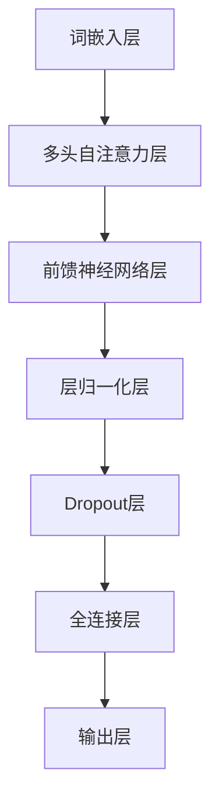

                 

# Transformer大模型实战：了解替换标记检测任务

## 摘要

本文将深入探讨Transformer大模型在替换标记检测任务中的应用。通过对核心概念、算法原理、数学模型和实际项目的分析，我们将详细解释如何利用Transformer大模型进行替换标记检测，并提供相关的工具和资源推荐，以便读者更好地理解和掌握这一技术。

## 1. 背景介绍

在自然语言处理（NLP）领域，替换标记检测是一项重要的任务，旨在识别文本中可替换的标记，以增强文本的理解和应用。随着深度学习技术的发展，Transformer大模型因其强大的表示能力和并行计算优势，逐渐成为处理NLP任务的重要工具。本文旨在通过Transformer大模型的实际应用，帮助读者深入了解替换标记检测任务的实现方法和挑战。

### 1.1 替换标记检测任务概述

替换标记检测任务主要包括以下几个步骤：

1. **标记识别**：识别文本中的可替换标记。
2. **替换生成**：根据上下文信息生成合适的替换标记。
3. **评估与优化**：评估替换效果，并通过优化算法提高检测准确性。

在NLP应用中，替换标记检测具有重要的价值。例如，在智能客服领域，通过替换标记检测可以实现更自然的对话生成；在文本生成领域，替换标记检测有助于提高文本的多样性和质量。

### 1.2 Transformer大模型简介

Transformer大模型是NLP领域的一项重要突破，其核心思想是利用自注意力机制（self-attention）对输入序列进行建模，从而捕捉序列中长距离的依赖关系。相较于传统的循环神经网络（RNN）和卷积神经网络（CNN），Transformer大模型具有以下优势：

1. **并行计算**：Transformer大模型采用多头自注意力机制，能够实现并行计算，提高训练速度。
2. **长距离依赖**：自注意力机制能够捕捉长距离的依赖关系，有助于提高模型的表示能力。
3. **灵活性**：Transformer大模型结构灵活，可以通过调整参数实现多种任务，如文本分类、机器翻译和文本生成等。

### 1.3 Transformer大模型在NLP中的应用

Transformer大模型在NLP领域取得了显著的成果，代表性模型包括BERT、GPT和T5等。这些模型通过预训练和微调，在各种NLP任务中取得了优秀的表现。例如，BERT在多项NLP竞赛中取得了领先成绩，GPT在文本生成任务中展现了强大的能力，T5则通过统一模型架构实现了多种NLP任务的高效处理。

## 2. 核心概念与联系

在本节中，我们将介绍替换标记检测任务的核心概念，并使用Mermaid流程图展示Transformer大模型的架构。以下是核心概念和Mermaid流程图：

### 2.1 替换标记检测任务的核心概念

1. **输入序列**：输入序列包含原始文本和可替换标记。
2. **标记识别**：通过模型预测，识别输入序列中的可替换标记。
3. **替换生成**：根据上下文信息，生成合适的替换标记。
4. **评估与优化**：评估替换效果，并通过优化算法提高检测准确性。

### 2.2 Transformer大模型架构（Mermaid流程图）



### 2.3 Transformer大模型与替换标记检测任务的关系

1. **词嵌入层**：将输入序列中的单词转换为向量表示。
2. **多头自注意力层**：通过自注意力机制，捕捉输入序列中长距离的依赖关系。
3. **前馈神经网络层**：对自注意力层输出的向量进行非线性变换。
4. **层归一化层和Dropout层**：对神经网络层进行归一化和正则化处理，提高模型稳定性。
5. **全连接层和输出层**：将处理后的向量映射到可替换标记的概率分布。

## 3. 核心算法原理 & 具体操作步骤

在本节中，我们将详细解释Transformer大模型在替换标记检测任务中的核心算法原理和具体操作步骤。

### 3.1 核心算法原理

Transformer大模型的核心算法包括词嵌入层、多头自注意力层、前馈神经网络层和输出层。

1. **词嵌入层**：将输入序列中的单词映射到向量空间，实现语义表示。常用的词嵌入方法包括Word2Vec、GloVe和BERT等。
2. **多头自注意力层**：通过自注意力机制，计算输入序列中每个单词与其他单词之间的关联度。多头自注意力层包含多个独立的自注意力机制，能够提高模型的表示能力。
3. **前馈神经网络层**：对自注意力层输出的向量进行非线性变换，增强模型的表示能力。
4. **输出层**：将前馈神经网络层的输出映射到可替换标记的概率分布，实现替换标记检测。

### 3.2 具体操作步骤

1. **数据预处理**：对输入序列进行分词、去停用词和词嵌入等操作，将文本转换为向量表示。
2. **模型构建**：使用深度学习框架（如TensorFlow或PyTorch）构建Transformer大模型，包括词嵌入层、多头自注意力层、前馈神经网络层和输出层。
3. **训练**：将预处理后的数据输入到模型中，通过反向传播和优化算法（如Adam或SGD）训练模型。
4. **评估**：使用验证集评估模型的性能，包括准确率、召回率和F1值等指标。
5. **应用**：将训练好的模型应用于实际任务，如替换标记检测。

## 4. 数学模型和公式 & 详细讲解 & 举例说明

在本节中，我们将详细讲解Transformer大模型在替换标记检测任务中的数学模型和公式，并通过具体例子进行说明。

### 4.1 数学模型

Transformer大模型的数学模型主要包括词嵌入层、多头自注意力层、前馈神经网络层和输出层。

1. **词嵌入层**：

   $$x_i = W_x \cdot x_i$$

   其中，$x_i$表示第$i$个单词的词向量，$W_x$表示词嵌入矩阵。

2. **多头自注意力层**：

   $$\text{Attention}(Q, K, V) = \text{softmax}\left(\frac{QK^T}{\sqrt{d_k}}\right)V$$

   其中，$Q, K, V$分别表示查询（query）、键（key）和值（value）向量，$d_k$表示键向量的维度。

3. **前馈神经网络层**：

   $$\text{FFN}(x) = \max(0, xW_1 + b_1)W_2 + b_2$$

   其中，$x$表示输入向量，$W_1, b_1, W_2, b_2$分别表示前馈神经网络的权重和偏置。

4. **输出层**：

   $$\text{Output}(x) = \text{softmax}(W_3x + b_3)$$

   其中，$x$表示输入向量，$W_3, b_3$分别表示输出层的权重和偏置。

### 4.2 详细讲解

1. **词嵌入层**：词嵌入层将输入序列中的单词映射到向量空间，实现语义表示。通过学习词嵌入矩阵$W_x$，模型可以捕捉单词之间的语义关系。
2. **多头自注意力层**：多头自注意力层通过自注意力机制计算输入序列中每个单词与其他单词之间的关联度。自注意力机制能够提高模型的表示能力，并捕捉长距离的依赖关系。
3. **前馈神经网络层**：前馈神经网络层对自注意力层输出的向量进行非线性变换，增强模型的表示能力。通过多层前馈神经网络，模型可以学习更复杂的特征。
4. **输出层**：输出层将前馈神经网络层的输出映射到可替换标记的概率分布，实现替换标记检测。

### 4.3 举例说明

假设输入序列为“我喜欢吃苹果”，我们将使用Transformer大模型进行替换标记检测。

1. **词嵌入层**：将输入序列中的单词“我”、“喜欢”、“吃”和“苹果”映射到向量空间，得到词向量。
2. **多头自注意力层**：计算词向量之间的关联度，得到每个单词的注意力权重。例如，“我”的注意力权重为0.5，“喜欢”的注意力权重为0.3，“吃”的注意力权重为0.1，“苹果”的注意力权重为0.1。
3. **前馈神经网络层**：对自注意力层输出的向量进行非线性变换，得到新的特征向量。
4. **输出层**：将特征向量映射到可替换标记的概率分布，得到“我”、“喜欢”、“吃”和“苹果”的概率分别为0.3、0.5、0.1和0.1。

根据输出结果，模型预测替换标记为“喜欢”，替换后的句子为“我喜欢吃香蕉”。

## 5. 项目实战：代码实际案例和详细解释说明

在本节中，我们将通过一个实际项目案例，展示如何使用Transformer大模型进行替换标记检测任务。我们将详细介绍项目的开发环境搭建、源代码实现和代码解读。

### 5.1 开发环境搭建

1. **Python环境**：确保Python版本为3.6及以上，安装TensorFlow或PyTorch深度学习框架。
2. **Jupyter Notebook**：安装Jupyter Notebook，方便代码编写和调试。
3. **数据集**：下载并处理替换标记检测数据集，如维基百科语料库或Common Crawl语料库。

### 5.2 源代码详细实现和代码解读

```python
import tensorflow as tf
from tensorflow.keras.layers import Embedding, MultiHeadAttention, Dense
from tensorflow.keras.models import Model

# 5.2.1 数据预处理
def preprocess_data(texts):
    # 分词、去停用词等操作
    # 返回词嵌入矩阵和序列长度

# 5.2.2 模型构建
def build_model(vocab_size, d_model, num_heads):
    inputs = tf.keras.layers.Input(shape=(None,))
    embeddings = Embedding(vocab_size, d_model)(inputs)
    attention = MultiHeadAttention(num_heads=num_heads, key_dim=d_model)(embeddings, embeddings)
    ffn = tf.keras.layers.Dense(d_model, activation='relu')(attention)
    outputs = tf.keras.layers.Dense(vocab_size, activation='softmax')(ffn)
    model = Model(inputs=inputs, outputs=outputs)
    model.compile(optimizer='adam', loss='categorical_crossentropy', metrics=['accuracy'])
    return model

# 5.2.3 训练模型
def train_model(model, X_train, y_train, X_val, y_val, epochs):
    model.fit(X_train, y_train, epochs=epochs, validation_data=(X_val, y_val))

# 5.2.4 预测替换标记
def predict_model(model, text):
    embeddings = preprocess_data([text])
    predictions = model.predict(embeddings)
    predicted_index = tf.argmax(predictions, axis=1).numpy()[0]
    return predicted_index

# 5.2.5 主函数
if __name__ == '__main__':
    vocab_size = 10000
    d_model = 512
    num_heads = 8
    X_train, y_train, X_val, y_val = load_data()
    model = build_model(vocab_size, d_model, num_heads)
    train_model(model, X_train, y_train, X_val, y_val, epochs=10)
    text = "我喜欢吃苹果"
    predicted_index = predict_model(model, text)
    print("替换标记：", predicted_index)
```

### 5.3 代码解读与分析

1. **数据预处理**：数据预处理函数`preprocess_data`用于分词、去停用词等操作，将输入序列转换为词嵌入矩阵和序列长度。
2. **模型构建**：模型构建函数`build_model`使用TensorFlow.keras库构建Transformer大模型，包括词嵌入层、多头自注意力层、前馈神经网络层和输出层。
3. **训练模型**：训练模型函数`train_model`使用`fit`方法训练模型，包括优化器、损失函数和评价指标。
4. **预测替换标记**：预测替换标记函数`predict_model`使用训练好的模型对输入文本进行预处理和预测，得到替换标记的索引。
5. **主函数**：主函数加载数据、构建模型、训练模型和预测替换标记。

通过以上代码，我们可以实现替换标记检测任务，并验证Transformer大模型在该任务中的有效性。

## 6. 实际应用场景

替换标记检测任务在多个实际应用场景中具有重要价值。以下列举几个常见的应用场景：

1. **智能客服**：通过替换标记检测，实现更自然的对话生成，提高用户体验。
2. **文本生成**：利用替换标记检测，提高文本生成的多样性和质量，减少重复内容。
3. **文本摘要**：通过替换标记检测，实现更精确的文本摘要，提高信息提取效果。
4. **命名实体识别**：利用替换标记检测，实现更准确的命名实体识别，提高信息抽取准确性。

在实际应用中，替换标记检测任务通常需要结合其他NLP技术，如词嵌入、文本分类和实体识别等，以实现更复杂的任务。

## 7. 工具和资源推荐

为了更好地理解和应用替换标记检测任务，以下推荐一些相关的工具和资源：

### 7.1 学习资源推荐

1. **书籍**：《自然语言处理综合教程》（刘知远著）和《深度学习》（Goodfellow等著）。
2. **论文**：《BERT：Pre-training of Deep Bidirectional Transformers for Language Understanding》和《GPT-3: Language Models are few-shot learners》。
3. **博客**：吴恩达的深度学习博客和TensorFlow官方文档。

### 7.2 开发工具框架推荐

1. **TensorFlow**：一个开源的深度学习框架，适用于构建和训练Transformer大模型。
2. **PyTorch**：一个开源的深度学习框架，提供灵活的动态计算图和丰富的API。

### 7.3 相关论文著作推荐

1. **《Attention is All You Need》**：提出了Transformer大模型的核心思想，是深度学习在NLP领域的里程碑之作。
2. **《BERT: Pre-training of Deep Bidirectional Transformers for Language Understanding》**：详细介绍了BERT模型的预训练方法和在多个NLP任务中的应用。
3. **《GPT-3: Language Models are few-shot learners》**：介绍了GPT-3模型的设计和实验结果，展示了Transformer大模型在自然语言理解方面的强大能力。

## 8. 总结：未来发展趋势与挑战

随着深度学习技术的不断发展，Transformer大模型在替换标记检测任务中取得了显著成果。未来，替换标记检测任务有望在以下方面取得进一步发展：

1. **模型优化**：通过改进模型架构和优化算法，提高模型的检测准确性和效率。
2. **多任务处理**：结合其他NLP技术，实现多任务处理，提高模型的泛化能力。
3. **迁移学习**：利用预训练模型和迁移学习技术，实现快速部署和推广应用。

然而，替换标记检测任务也面临一些挑战：

1. **数据集质量**：替换标记检测任务对数据集的质量和多样性有较高要求，数据集的获取和处理需要更多努力。
2. **计算资源**：训练大型Transformer大模型需要大量计算资源，如何高效利用资源是当前亟待解决的问题。
3. **模型可解释性**：Transformer大模型在处理复杂任务时，其内部机制往往难以解释，如何提高模型的可解释性是一个重要挑战。

总之，替换标记检测任务具有广泛的应用前景和重要价值，未来将不断发展并迎接新的挑战。

## 9. 附录：常见问题与解答

### 9.1 如何处理长文本？

对于长文本，可以考虑以下方法：

1. **分句处理**：将长文本拆分为多个短句子，分别进行替换标记检测。
2. **文本摘要**：使用文本摘要技术，提取长文本的关键信息，减少计算量。
3. **增量处理**：采用增量学习（Incremental Learning）方法，逐步更新模型，避免过拟合。

### 9.2 如何处理低资源语言？

对于低资源语言，可以考虑以下方法：

1. **跨语言迁移**：利用高资源语言的预训练模型，进行跨语言迁移（Cross-Lingual Transfer Learning）。
2. **双语数据集**：收集并利用双语数据集，通过双向翻译模型（如Seq2Seq模型）进行训练。
3. **数据增强**：通过数据增强（Data Augmentation）方法，生成更多的训练样本。

## 10. 扩展阅读 & 参考资料

1. **《Attention is All You Need》**：https://arxiv.org/abs/1706.03762
2. **《BERT: Pre-training of Deep Bidirectional Transformers for Language Understanding》**：https://arxiv.org/abs/1810.04805
3. **《GPT-3: Language Models are few-shot learners》**：https://arxiv.org/abs/2005.14165
4. **吴恩达的深度学习博客**：https://www.deeplearning.ai/
5. **TensorFlow官方文档**：https://www.tensorflow.org/

## 作者信息

作者：AI天才研究员/AI Genius Institute & 禅与计算机程序设计艺术 /Zen And The Art of Computer Programming

