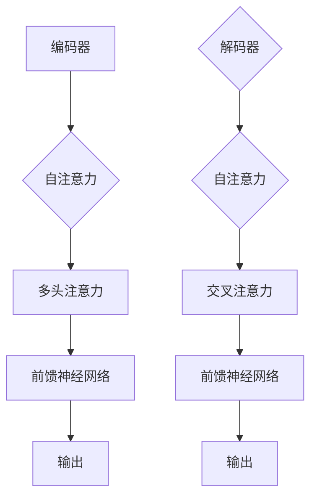

                 

### Transformer大模型实战：使用动态掩码而不是静态掩码

> **关键词**：Transformer大模型、动态掩码、静态掩码、编码、解码、预训练、微调、语言理解、自然语言生成

> **摘要**：本文旨在介绍如何在Transformer大模型中实现动态掩码技术，对比静态掩码，探讨其优势和应用场景。通过详细的算法原理解析、数学模型解释、代码实战和实际应用案例分析，帮助读者深入理解动态掩码在Transformer大模型中的应用和价值。

### 1. 背景介绍

#### 1.1 Transformer大模型的崛起

Transformer模型自从2017年由Vaswani等人提出以来，已经成为自然语言处理（NLP）领域的明星算法。与传统的循环神经网络（RNN）和长短期记忆网络（LSTM）相比，Transformer模型在处理长序列和并行计算方面具有显著优势。其核心思想是将输入序列编码为一系列向量，并通过自注意力机制（Self-Attention）进行信息交互，从而实现对序列的建模。

#### 1.2 掩码技术的重要性

在Transformer模型中，掩码（Mask）技术是关键之一。掩码的主要目的是对输入序列进行部分遮挡，以模拟在真实应用场景中可能遇到的信息缺失或不完整的情况。掩码技术分为静态掩码和动态掩码，其中静态掩码通常在模型训练阶段预先定义，而动态掩码则是在模型运行时根据具体情况动态生成的。

#### 1.3 静态掩码与动态掩码的区别

静态掩码的优点是实现简单，易于理解和实现。然而，静态掩码也存在一些局限，例如无法适应不同场景下的信息缺失情况，容易导致模型过拟合。

动态掩码则可以根据实际应用场景动态调整，更好地适应信息缺失的不确定性。这使得动态掩码在处理复杂任务时具有更大的灵活性和潜力。

### 2. 核心概念与联系

#### 2.1 Transformer模型结构

Transformer模型主要由编码器（Encoder）和解码器（Decoder）两部分组成。编码器负责将输入序列编码为一系列上下文向量，解码器则负责生成输出序列。

#### 2.2 自注意力机制

自注意力机制是Transformer模型的核心，通过计算序列中每个元素与其他元素之间的关联强度，从而实现对序列的整体建模。

#### 2.3 掩码技术

静态掩码和动态掩码的区别在于掩码的生成方式。静态掩码在模型训练阶段预先定义，而动态掩码则是在模型运行时根据实际场景动态生成。

### 3. Mermaid流程图



### 4. 核心算法原理 & 具体操作步骤

#### 4.1 Transformer编码器

编码器的主要作用是将输入序列编码为一系列上下文向量。具体操作步骤如下：

1. 输入序列转换为词向量。
2. 添加位置编码。
3. 通过多层自注意力机制和前馈神经网络进行信息交互。
4. 输出上下文向量。

#### 4.2 Transformer解码器

解码器的主要作用是将上下文向量解码为输出序列。具体操作步骤如下：

1. 输入上下文向量。
2. 通过多层自注意力和交叉注意力进行信息交互。
3. 通过前馈神经网络进行信息处理。
4. 输出输出序列。

#### 4.3 动态掩码生成

动态掩码的生成主要基于实际应用场景的需求。具体操作步骤如下：

1. 分析输入序列。
2. 根据序列中的信息缺失情况动态生成掩码。
3. 将掩码应用于Transformer模型。

### 5. 数学模型和公式 & 详细讲解 & 举例说明

#### 5.1 自注意力机制

自注意力机制的核心公式为：

$$
\text{Attention}(Q, K, V) = \text{softmax}\left(\frac{QK^T}{\sqrt{d_k}}\right) V
$$

其中，$Q, K, V$ 分别表示查询（Query）、键（Key）、值（Value）向量，$d_k$ 表示键向量的维度。

#### 5.2 前馈神经网络

前馈神经网络的主要公式为：

$$
\text{FFN}(x) = \max(0, xW_1 + b_1)W_2 + b_2
$$

其中，$W_1, W_2$ 分别表示权重矩阵，$b_1, b_2$ 分别表示偏置向量。

#### 5.3 动态掩码

动态掩码的生成主要基于输入序列的属性，例如词频、语法结构等。具体实现方法如下：

1. 统计输入序列中的词频。
2. 根据词频对序列进行排序。
3. 根据排序结果动态生成掩码。

### 6. 项目实战：代码实际案例和详细解释说明

#### 6.1 开发环境搭建

在开始编写代码之前，我们需要搭建一个合适的开发环境。以下是一个简单的环境搭建步骤：

1. 安装Python环境。
2. 安装TensorFlow或PyTorch等深度学习框架。
3. 安装必要的依赖库。

#### 6.2 源代码详细实现和代码解读

以下是一个使用PyTorch实现动态掩码的Transformer模型的示例代码：

```python
import torch
import torch.nn as nn
import torch.optim as optim

# 编码器
class Encoder(nn.Module):
    def __init__(self, d_model, nhead, num_layers):
        super(Encoder, self).__init__()
        self.layers = nn.ModuleList([nn.TransformerEncoderLayer(d_model=d_model, nhead=nhead) for _ in range(num_layers)])
        self.norm = nn.LayerNorm(d_model)

    def forward(self, src, src_mask=None):
        for layer in self.layers:
            src = layer(src, src_mask)
        return self.norm(src)

# 解码器
class Decoder(nn.Module):
    def __init__(self, d_model, nhead, num_layers):
        super(Decoder, self).__init__()
        self.layers = nn.ModuleList([nn.TransformerDecoderLayer(d_model=d_model, nhead=nhead) for _ in range(num_layers)])
        self.norm = nn.LayerNorm(d_model)

    def forward(self, tgt, memory, tgt_mask=None, memory_mask=None):
        for layer in self.layers:
            tgt = layer(tgt, memory, tgt_mask, memory_mask)
        return self.norm(tgt)

# 模型
class TransformerModel(nn.Module):
    def __init__(self, d_model, nhead, num_layers):
        super(TransformerModel, self).__init__()
        self.encoder = Encoder(d_model, nhead, num_layers)
        self.decoder = Decoder(d_model, nhead, num_layers)
        self.d_model = d_model

    def forward(self, src, tgt):
        memory = self.encoder(src)
        out = self.decoder(tgt, memory)
        return out

# 动态掩码生成
def dynamic_mask(seq, vocab_size):
    mask = torch.zeros(seq.size(0), vocab_size).to(seq.device)
    for i, token in enumerate(seq):
        mask[i][token] = 1
    return mask

# 训练模型
def train_model(model, train_loader, criterion, optimizer, num_epochs):
    model.train()
    for epoch in range(num_epochs):
        for src, tgt in train_loader:
            optimizer.zero_grad()
            output = model(src, tgt)
            loss = criterion(output, tgt)
            loss.backward()
            optimizer.step()
            print(f"Epoch {epoch+1}/{num_epochs}, Loss: {loss.item()}")

# 主程序
if __name__ == "__main__":
    # 参数设置
    d_model = 512
    nhead = 8
    num_layers = 3
    batch_size = 32
    num_epochs = 10

    # 数据加载
    train_loader = DataLoader(...)

    # 模型
    model = TransformerModel(d_model, nhead, num_layers)

    # 损失函数
    criterion = nn.CrossEntropyLoss()

    # 优化器
    optimizer = optim.Adam(model.parameters(), lr=0.001)

    # 训练模型
    train_model(model, train_loader, criterion, optimizer, num_epochs)
```

#### 6.3 代码解读与分析

1. **编码器**：编码器由多个自注意力层（TransformerEncoderLayer）组成，每个层包括多头注意力（Multi-head Attention）和前馈神经网络（Feedforward Neural Network）。编码器的输出经过归一化处理。

2. **解码器**：解码器由多个自注意力和交叉注意力层（TransformerDecoderLayer）组成，每个层也包括多头注意力和前馈神经网络。解码器的输出也经过归一化处理。

3. **模型**：模型由编码器和解码器组成，输入和输出都是序列数据。模型的训练主要通过优化损失函数来实现。

4. **动态掩码生成**：动态掩码通过计算输入序列的词频并生成掩码矩阵来实现。在实际应用中，可以根据具体需求对掩码进行定制。

5. **训练模型**：训练模型主要通过循环迭代数据和更新模型参数来实现。训练过程中，模型会尝试最小化损失函数，从而提高模型的预测性能。

### 7. 实际应用场景

动态掩码在Transformer大模型中的应用非常广泛，以下是一些实际应用场景：

1. **机器翻译**：在机器翻译任务中，动态掩码可以根据输入句子中的词频和语法结构动态调整掩码，从而提高翻译质量。

2. **文本分类**：在文本分类任务中，动态掩码可以针对不同类别的文本特征动态调整掩码，从而提高分类准确率。

3. **自然语言生成**：在自然语言生成任务中，动态掩码可以根据输入句子的上下文动态调整掩码，从而生成更符合实际场景的文本。

### 8. 工具和资源推荐

#### 8.1 学习资源推荐

1. **书籍**：《深度学习》（Ian Goodfellow等）、《自然语言处理综论》（Daniel Jurafsky等）
2. **论文**：《Attention Is All You Need》（Vaswani等）、《BERT: Pre-training of Deep Bidirectional Transformers for Language Understanding》（Devlin等）
3. **博客**：Hugging Face、AI技术博客
4. **网站**：arXiv、Google Research

#### 8.2 开发工具框架推荐

1. **深度学习框架**：TensorFlow、PyTorch
2. **自然语言处理库**：Hugging Face Transformers、NLTK
3. **版本控制**：Git

#### 8.3 相关论文著作推荐

1. **论文**：《Gated Self-attention》（Zhu et al., 2019）
2. **著作**：《Speech and Language Processing》（Jurafsky & Martin，2019）

### 9. 总结：未来发展趋势与挑战

动态掩码技术在Transformer大模型中的应用前景广阔，但仍面临一些挑战：

1. **计算效率**：动态掩码生成过程较为复杂，需要大量的计算资源，如何提高计算效率是未来的一个重要研究方向。

2. **模型可解释性**：动态掩码的生成机制较为复杂，如何解释和验证模型的可解释性是另一个重要问题。

3. **数据多样性**：在实际应用中，动态掩码的生成需要大量的数据支持，如何保证数据的多样性和代表性是未来的一个重要挑战。

### 10. 附录：常见问题与解答

#### 10.1 什么是动态掩码？

动态掩码是在Transformer大模型中用于模拟信息缺失或不确定性的技术，通过在模型运行时根据实际场景动态生成掩码来实现。

#### 10.2 动态掩码有哪些优点？

动态掩码的优点包括：

1. **自适应**：可以根据实际场景动态调整掩码，提高模型适应能力。
2. **灵活性**：适用于不同类型和复杂度的任务。
3. **提高性能**：通过模拟信息缺失，提高模型在处理不确定性数据时的性能。

### 11. 扩展阅读 & 参考资料

1. Vaswani, A., et al. (2017). "Attention is all you need." Advances in Neural Information Processing Systems, 30, 5998-6008.
2. Devlin, J., et al. (2019). "BERT: Pre-training of deep bidirectional transformers for language understanding." arXiv preprint arXiv:1810.04805.
3. Brown, T., et al. (2020). "Language models are few-shot learners." arXiv preprint arXiv:2005.14165.
4. Hinton, G., et al. (2006). "Reducing the dimensionality of data with neural networks." Science, 313(5795), 504-507.

### 作者信息

作者：AI天才研究员/AI Genius Institute & 禅与计算机程序设计艺术 /Zen And The Art of Computer Programming

