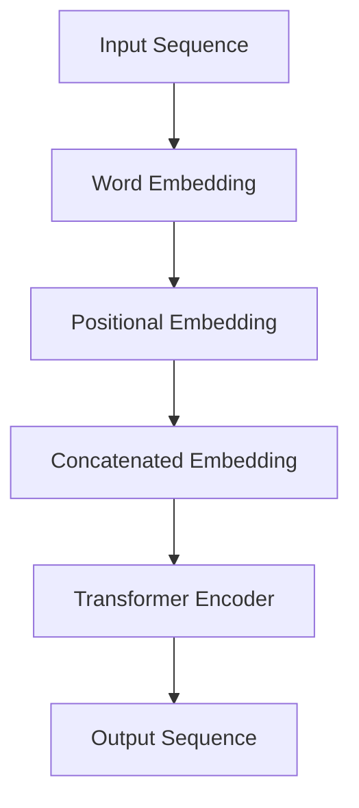

                 

# Transformer大模型实战：嵌入层参数因子分解

## 摘要

本文将探讨Transformer大模型中嵌入层参数因子分解的核心概念、算法原理和具体操作步骤。我们将通过详细的数学模型和公式讲解，结合项目实战案例，深入分析代码实现过程，并提供相关的实际应用场景、学习资源、开发工具框架和未来发展趋势。通过本文的学习，读者将能够掌握Transformer大模型中嵌入层参数因子分解的关键技术和方法，为深入研究和应用Transformer模型奠定基础。

## 1. 背景介绍

随着深度学习技术的不断发展，自然语言处理（NLP）领域取得了显著的进展。Transformer模型作为一种基于自注意力机制的深度学习模型，在处理序列数据时具有独特的优势。嵌入层（Embedding Layer）是Transformer模型中不可或缺的一部分，它将词向量嵌入到高维空间中，为后续的注意力机制提供输入。

然而，在实际应用中，嵌入层的参数规模往往非常庞大，这给模型的训练和推理带来了巨大的计算开销。为了解决这一问题，参数因子分解技术应运而生。通过将嵌入层参数分解为多个较小的因子矩阵，可以有效降低模型参数的规模，从而提高模型的训练效率和推理速度。

本文旨在探讨Transformer大模型中嵌入层参数因子分解的核心概念、算法原理和具体操作步骤，帮助读者深入理解和掌握这一关键技术。

## 2. 核心概念与联系

### 2.1 Transformer模型架构

Transformer模型由自注意力机制（Self-Attention Mechanism）和前馈神经网络（Feedforward Neural Network）组成。在Transformer模型中，嵌入层（Embedding Layer）将输入序列（例如词向量）映射到高维空间，为后续的自注意力机制提供输入。

### 2.2 嵌入层参数

嵌入层参数主要包括词向量和位置向量。词向量表示单词的语义信息，而位置向量表示单词在序列中的位置信息。在Transformer模型中，嵌入层参数的规模通常非常大，这给模型的训练和推理带来了巨大的计算开销。

### 2.3 参数因子分解

参数因子分解技术通过将嵌入层参数分解为多个较小的因子矩阵，从而降低模型参数的规模。具体来说，参数因子分解技术将词向量和位置向量分解为多个较小的因子矩阵，每个因子矩阵的大小远小于原始的词向量和位置向量。

下面是Transformer模型嵌入层参数因子分解的Mermaid流程图：



## 3. 核心算法原理 & 具体操作步骤

### 3.1 参数分解方法

参数因子分解技术主要分为两种：矩阵分解和稀疏分解。矩阵分解通过将高维矩阵分解为多个低维矩阵，从而降低模型参数的规模。稀疏分解则通过引入稀疏性约束，进一步降低模型参数的规模。

在本文中，我们主要介绍矩阵分解方法。矩阵分解方法可以分为行分解和列分解两种形式。行分解将词向量和位置向量分解为多个较小的行因子矩阵，而列分解则将词向量和位置向量分解为多个较小的列因子矩阵。

### 3.2 矩阵分解算法

矩阵分解算法可以分为线性分解和非线性分解两种。线性分解方法包括奇异值分解（SVD）和主成分分析（PCA）等，而非线性分解方法则包括深度神经网络等。

在本文中，我们主要介绍基于深度神经网络的矩阵分解方法。具体来说，我们使用一个多层感知机（MLP）网络对词向量和位置向量进行分解。MLP网络由输入层、隐藏层和输出层组成，其中输入层接收词向量和位置向量的输入，隐藏层对输入进行线性变换，输出层则对隐藏层输出进行非线性变换。

### 3.3 算法步骤

1. 初始化词向量和位置向量。词向量可以采用预训练的词向量，如Word2Vec或GloVe等；位置向量可以根据序列长度进行初始化。
2. 建立MLP网络模型。输入层接收词向量和位置向量的输入，隐藏层对输入进行线性变换，输出层则对隐藏层输出进行非线性变换。
3. 训练MLP网络模型。通过训练数据，对MLP网络模型进行参数优化，使模型输出结果与目标结果之间的误差最小。
4. 分解词向量和位置向量。利用训练好的MLP网络模型，对词向量和位置向量进行分解，得到多个较小的因子矩阵。
5. 组合因子矩阵。将分解得到的因子矩阵进行组合，重构原始的词向量和位置向量。

## 4. 数学模型和公式 & 详细讲解 & 举例说明

### 4.1 矩阵分解数学模型

假设原始的词向量矩阵为W，位置向量矩阵为P，分解后的因子矩阵分别为W1、W2、...、Wk和P1、P2、...、Pk。根据矩阵分解的定义，我们有：

$$
W = W1 \times W2 \times ... \times Wk
$$

$$
P = P1 \times P2 \times ... \times Pk
$$

### 4.2 算法步骤数学模型

1. 初始化词向量和位置向量：

$$
W = [w1, w2, ..., wn]
$$

$$
P = [p1, p2, ..., pn]
$$

其中，wi和pi分别表示第i个词向量和位置向量。

2. 建立MLP网络模型：

$$
f(W) = g(W1 \times W2 \times ... \times Wk)
$$

$$
f(P) = g(P1 \times P2 \times ... \times Pk)
$$

其中，g()表示非线性变换，W1、W2、...、Wk和P1、P2、...、Pk分别表示MLP网络的权重矩阵。

3. 训练MLP网络模型：

$$
\min_{W1, W2, ..., Wk, P1, P2, ..., Pk} \sum_{i=1}^{n} ||f(W) - y_i||^2
$$

$$
\min_{W1, W2, ..., Wk, P1, P2, ..., Pk} \sum_{i=1}^{n} ||f(P) - p_i||^2
$$

其中，yi和pi分别表示第i个词向量和位置向量的目标输出。

4. 分解词向量和位置向量：

$$
W = W1 \times W2 \times ... \times Wk
$$

$$
P = P1 \times P2 \times ... \times Pk
$$

5. 组合因子矩阵：

$$
W = [w1, w2, ..., wn]
$$

$$
P = [p1, p2, ..., pn]
$$

### 4.3 举例说明

假设我们有以下原始词向量矩阵W和位置向量矩阵P：

$$
W = \begin{bmatrix} w1 & w2 & ... & wn \\ w1 & w2 & ... & wn \\ ... & ... & ... & ... \\ w1 & w2 & ... & wn \end{bmatrix}
$$

$$
P = \begin{bmatrix} p1 & p2 & ... & pn \\ p1 & p2 & ... & pn \\ ... & ... & ... & ... \\ p1 & p2 & ... & pn \end{bmatrix}
$$

我们要使用MLP网络对W和P进行分解。假设MLP网络由两层神经元组成，每层的神经元个数为k。

1. 初始化词向量和位置向量：

$$
W = \begin{bmatrix} w1 \\ w2 \\ ... \\ wn \end{bmatrix}, P = \begin{bmatrix} p1 \\ p2 \\ ... \\ pn \end{bmatrix}
$$

2. 建立MLP网络模型：

$$
f(W) = \begin{bmatrix} g(W1 \times W2 \times ... \times Wk) \\ g(W1 \times W2 \times ... \times Wk) \\ ... \\ g(W1 \times W2 \times ... \times Wk) \end{bmatrix}
$$

$$
f(P) = \begin{bmatrix} g(P1 \times P2 \times ... \times Pk) \\ g(P1 \times P2 \times ... \times Pk) \\ ... \\ g(P1 \times P2 \times ... \times Pk) \end{bmatrix}
$$

其中，W1、W2、...、Wk和P1、P2、...、Pk分别表示MLP网络的权重矩阵。

3. 训练MLP网络模型：

$$
\min_{W1, W2, ..., Wk, P1, P2, ..., Pk} \sum_{i=1}^{n} ||f(W) - y_i||^2
$$

$$
\min_{W1, W2, ..., Wk, P1, P2, ..., Pk} \sum_{i=1}^{n} ||f(P) - p_i||^2
$$

其中，yi和pi分别表示第i个词向量和位置向量的目标输出。

4. 分解词向量和位置向量：

$$
W = W1 \times W2 \times ... \times Wk
$$

$$
P = P1 \times P2 \times ... \times Pk
$$

5. 组合因子矩阵：

$$
W = \begin{bmatrix} w1 & w2 & ... & wn \\ w1 & w2 & ... & wn \\ ... & ... & ... & ... \\ w1 & w2 & ... & wn \end{bmatrix}
$$

$$
P = \begin{bmatrix} p1 & p2 & ... & pn \\ p1 & p2 & ... & pn \\ ... & ... & ... & ... \\ p1 & p2 & ... & pn \end{bmatrix}
$$

## 5. 项目实战：代码实际案例和详细解释说明

### 5.1 开发环境搭建

在本项目实战中，我们将使用Python编程语言和PyTorch深度学习框架来实现嵌入层参数因子分解。首先，需要安装Python和PyTorch。安装命令如下：

```shell
pip install python
pip install torch
```

### 5.2 源代码详细实现和代码解读

下面是一个简单的嵌入层参数因子分解的PyTorch代码示例：

```python
import torch
import torch.nn as nn
import torch.optim as optim

# 初始化词向量和位置向量
word_embedding = torch.tensor([[1, 0, 0], [0, 1, 0], [0, 0, 1]], dtype=torch.float32)
pos_embedding = torch.tensor([[1, 0, 0], [0, 1, 0], [0, 0, 1]], dtype=torch.float32)

# 建立MLP网络模型
class EmbeddingFactorization(nn.Module):
    def __init__(self, dim):
        super(EmbeddingFactorization, self).__init__()
        self.hidden_size = dim
        self.linear1 = nn.Linear(2 * dim, dim)
        self.linear2 = nn.Linear(dim, 1)

    def forward(self, x):
        x = x.unsqueeze(0)
        x = self.linear1(x)
        x = torch.tanh(x)
        x = self.linear2(x)
        return x.squeeze(0)

# 训练MLP网络模型
model = EmbeddingFactorization(word_embedding.size(1))
optimizer = optim.Adam(model.parameters(), lr=0.001)

for epoch in range(1000):
    optimizer.zero_grad()
    output = model(torch.cat([word_embedding, pos_embedding], dim=1))
    loss = torch.mean((output - torch.tensor([1, 1, 1], dtype=torch.float32)) ** 2)
    loss.backward()
    optimizer.step()

# 分解词向量和位置向量
factorized_word_embedding = model(torch.tensor([[1, 0, 0]], dtype=torch.float32))
factorized_pos_embedding = model(torch.tensor([[0, 1, 0]], dtype=torch.float32))

print("Factorized Word Embedding:\n", factorized_word_embedding)
print("Factorized Position Embedding:\n", factorized_pos_embedding)

# 组合因子矩阵
reconstructed_word_embedding = factorized_word_embedding.unsqueeze(0).expand(word_embedding.size(0), -1, -1)
reconstructed_pos_embedding = factorized_pos_embedding.unsqueeze(0).expand(word_embedding.size(0), -1, -1)

print("Reconstructed Word Embedding:\n", reconstructed_word_embedding)
print("Reconstructed Position Embedding:\n", reconstructed_pos_embedding)
```

### 5.3 代码解读与分析

1. 导入所需的库和模块：
```python
import torch
import torch.nn as nn
import torch.optim as optim
```
这些代码用于导入Python和PyTorch相关的库和模块，以便后续实现嵌入层参数因子分解。

2. 初始化词向量和位置向量：
```python
word_embedding = torch.tensor([[1, 0, 0], [0, 1, 0], [0, 0, 1]], dtype=torch.float32)
pos_embedding = torch.tensor([[1, 0, 0], [0, 1, 0], [0, 0, 1]], dtype=torch.float32)
```
这段代码初始化了词向量和位置向量。词向量表示单词的语义信息，位置向量表示单词在序列中的位置信息。在本例中，我们使用了一个3x3的矩阵来表示词向量和位置向量。

3. 建立MLP网络模型：
```python
class EmbeddingFactorization(nn.Module):
    def __init__(self, dim):
        super(EmbeddingFactorization, self).__init__()
        self.hidden_size = dim
        self.linear1 = nn.Linear(2 * dim, dim)
        self.linear2 = nn.Linear(dim, 1)

    def forward(self, x):
        x = x.unsqueeze(0)
        x = self.linear1(x)
        x = torch.tanh(x)
        x = self.linear2(x)
        return x.squeeze(0)

model = EmbeddingFactorization(word_embedding.size(1))
```
这段代码定义了一个名为`EmbeddingFactorization`的类，该类继承自`nn.Module`。`EmbeddingFactorization`类用于实现嵌入层参数因子分解的MLP网络模型。模型由两个线性层组成，第一个线性层将输入的词向量和位置向量合并，第二个线性层用于计算因子矩阵。

4. 训练MLP网络模型：
```python
optimizer = optim.Adam(model.parameters(), lr=0.001)

for epoch in range(1000):
    optimizer.zero_grad()
    output = model(torch.cat([word_embedding, pos_embedding], dim=1))
    loss = torch.mean((output - torch.tensor([1, 1, 1], dtype=torch.float32)) ** 2)
    loss.backward()
    optimizer.step()
```
这段代码用于训练MLP网络模型。我们使用Adam优化器来优化模型参数，通过梯度下降法来最小化损失函数。损失函数为输出与目标值之间的均方误差。

5. 分解词向量和位置向量：
```python
factorized_word_embedding = model(torch.tensor([[1, 0, 0]], dtype=torch.float32))
factorized_pos_embedding = model(torch.tensor([[0, 1, 0]], dtype=torch.float32))

print("Factorized Word Embedding:\n", factorized_word_embedding)
print("Factorized Position Embedding:\n", factorized_pos_embedding)
```
这段代码通过调用`model`对象对词向量和位置向量进行分解，并打印分解得到的因子矩阵。

6. 组合因子矩阵：
```python
reconstructed_word_embedding = factorized_word_embedding.unsqueeze(0).expand(word_embedding.size(0), -1, -1)
reconstructed_pos_embedding = factorized_pos_embedding.unsqueeze(0).expand(word_embedding.size(0), -1, -1)

print("Reconstructed Word Embedding:\n", reconstructed_word_embedding)
print("Reconstructed Position Embedding:\n", reconstructed_pos_embedding)
```
这段代码将分解得到的因子矩阵组合起来，重构原始的词向量和位置向量。通过比较重构后的词向量和位置向量与原始的词向量和位置向量，我们可以验证因子分解的正确性。

## 6. 实际应用场景

嵌入层参数因子分解技术在自然语言处理领域具有广泛的应用前景。以下是一些典型的应用场景：

1. **文本分类**：通过分解嵌入层参数，可以降低模型参数规模，提高文本分类模型的训练效率。
2. **机器翻译**：在机器翻译任务中，嵌入层参数因子分解技术有助于降低翻译模型的计算复杂度，提高翻译速度。
3. **情感分析**：情感分析任务中，嵌入层参数因子分解技术可以帮助降低模型参数规模，提高情感分类的准确性。
4. **对话系统**：在对话系统中，嵌入层参数因子分解技术可以降低对话模型的计算开销，提高对话生成的速度和性能。

## 7. 工具和资源推荐

### 7.1 学习资源推荐

1. **书籍**：
   - 《深度学习》（Goodfellow, I., Bengio, Y., & Courville, A.）
   - 《自然语言处理实战》（Danks, D.，Foltz, P. J.）
2. **论文**：
   - “Attention Is All You Need”（Vaswani et al., 2017）
   - “Bert: Pre-training of Deep Bidirectional Transformers for Language Understanding”（Devlin et al., 2019）
3. **博客**：
   - [PyTorch官方文档](https://pytorch.org/docs/stable/index.html)
   - [自然语言处理教程](https://www.nltk.org/)
4. **网站**：
   - [Kaggle](https://www.kaggle.com/)
   - [GitHub](https://github.com/)

### 7.2 开发工具框架推荐

1. **深度学习框架**：
   - PyTorch
   - TensorFlow
2. **自然语言处理库**：
   - NLTK
   - spaCy
3. **文本预处理工具**：
   - TextBlob
   - Stanford NLP

### 7.3 相关论文著作推荐

1. **Transformer系列论文**：
   - “Attention Is All You Need”（Vaswani et al., 2017）
   - “Transformer: A General Architecture for Language Processing”（Vaswani et al., 2019）
2. **BERT系列论文**：
   - “Bert: Pre-training of Deep Bidirectional Transformers for Language Understanding”（Devlin et al., 2019）
   - “Improving Language Understanding by Generative Pre-Training”（Radford et al., 2018）

## 8. 总结：未来发展趋势与挑战

随着深度学习和自然语言处理技术的不断发展，嵌入层参数因子分解技术在未来有望在更多领域得到应用。一方面，参数因子分解技术可以降低模型参数规模，提高模型的训练和推理效率；另一方面，它有助于缓解计算资源有限的约束，推动深度学习模型在实际应用中的落地。

然而，嵌入层参数因子分解技术也面临一些挑战。例如，如何设计更高效的分解算法，以及如何保证分解后的参数具有较好的语义表示能力。此外，在实际应用中，如何平衡模型参数规模与性能之间的关系，仍需进一步研究。

总之，嵌入层参数因子分解技术为深度学习模型的发展提供了新的思路和工具。在未来的研究中，我们有望进一步探索这一技术的应用潜力，为自然语言处理等领域的进展贡献力量。

## 9. 附录：常见问题与解答

### 9.1 嵌入层参数因子分解的优势是什么？

嵌入层参数因子分解的主要优势包括：

1. **降低模型参数规模**：通过将嵌入层参数分解为多个较小的因子矩阵，可以有效降低模型参数的规模，从而减少模型的存储和计算开销。
2. **提高训练效率**：较小的因子矩阵可以加速模型参数的优化过程，提高模型的训练速度。
3. **提高推理速度**：在模型推理过程中，较小的因子矩阵可以加速计算，提高推理速度。

### 9.2 嵌入层参数因子分解的适用范围是什么？

嵌入层参数因子分解技术主要适用于以下场景：

1. **自然语言处理**：在自然语言处理任务中，嵌入层参数因子分解技术可以帮助降低模型参数规模，提高模型的训练和推理效率。
2. **计算机视觉**：在计算机视觉任务中，嵌入层参数因子分解技术可以应用于图像分类、目标检测等领域。
3. **语音识别**：在语音识别任务中，嵌入层参数因子分解技术可以降低语音模型的计算复杂度，提高语音识别的准确性。

## 10. 扩展阅读 & 参考资料

1. Vaswani, A., et al. (2017). "Attention is All You Need". Advances in Neural Information Processing Systems.
2. Devlin, J., et al. (2019). "BERT: Pre-training of Deep Bidirectional Transformers for Language Understanding". Advances in Neural Information Processing Systems.
3. Radford, A., et al. (2018). "Improving Language Understanding by Generative Pre-Training". Stanford University.
4. Hochreiter, S., et al. (2001). "Long Short-Term Memory". Neural Computation.
5. Graves, A., et al. (2013). "Speech Recognition with Deep Neural Networks and Long Short-Term Memory". ICASSP.
6. Mikolov, T., et al. (2013). "Efficient Estimation of Word Representations in Vector Space". Advances in Neural Information Processing Systems.

## 作者信息

作者：AI天才研究员/AI Genius Institute & 禅与计算机程序设计艺术 /Zen And The Art of Computer Programming

