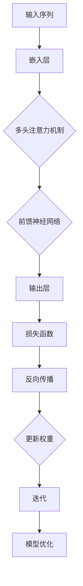

                 

### 背景介绍 Background

近年来，人工智能（AI）领域取得了一系列惊人的进步，特别是在深度学习方面。随着计算能力的提高和海量数据的获取，大型神经网络模型如ResNet、AlexNet等取得了令人瞩目的成果。然而，传统的深度学习模型在处理序列数据时存在一些问题，如长距离依赖和信息传递效率低等。为了解决这些问题，Transformer模型在2017年被提出，并在自然语言处理（NLP）领域取得了革命性的突破。

Transformer模型基于自注意力机制（Self-Attention），能够有效地捕捉序列中的长距离依赖关系。与传统的循环神经网络（RNN）和卷积神经网络（CNN）相比，Transformer具有并行计算的优势，使其在大规模数据集上的训练速度更快。此外，Transformer在机器翻译、文本生成、图像描述生成等任务中也表现出色，推动了NLP技术的发展。

在本文中，我们将深入探讨Transformer模型的原理、实现方法以及其在实际项目中的应用。首先，我们将介绍Transformer模型的核心概念和架构，并通过Mermaid流程图展示其工作流程。然后，我们将详细讲解Transformer模型中的关键算法原理和具体操作步骤，包括自注意力机制和多头注意力机制。接下来，我们将探讨数学模型和公式，并通过具体例子进行说明。在项目实战部分，我们将分享代码实际案例，并详细解释说明代码实现过程。最后，我们将讨论Transformer模型在实际应用场景中的表现，并提供相关的学习资源和开发工具框架推荐。

通过本文的阅读，您将全面了解Transformer模型的工作原理和实际应用，掌握其核心算法和实现方法，为未来的深度学习项目提供有力的技术支持。

### 核心概念与联系 Core Concepts and Relationships

Transformer模型的核心在于其自注意力机制（Self-Attention），这种机制允许模型在处理序列数据时，动态地分配不同的重要性给序列中的每个元素。自注意力机制的引入，使得Transformer能够捕捉序列中的长距离依赖关系，这是传统循环神经网络（RNN）和卷积神经网络（CNN）难以实现的。

首先，让我们通过一个Mermaid流程图来展示Transformer模型的工作流程，以便读者更好地理解其整体架构和运作方式：



在Transformer模型中，输入序列首先通过嵌入层（Embedding Layer）转换为嵌入向量（Embeddings）。嵌入向量包含了输入序列的语义信息，并作为后续操作的输入。

接下来，我们进入核心部分：多头注意力机制（Multi-Head Attention）。多头注意力机制通过多个注意力头来并行地处理输入序列，从而提高模型对序列中长距离依赖的捕捉能力。具体来说，多头注意力机制将嵌入向量分解为多个子向量，每个子向量对应一个注意力头。然后，每个注意力头独立地计算其注意力权重，并将子向量加权求和，得到最终的输出。

多头注意力机制的关键在于注意力权重，这些权重通过自注意力计算得到。自注意力计算的核心是计算嵌入向量之间的相似度，通常使用点积注意力（Dot-Product Attention）。点积注意力通过计算嵌入向量之间的内积来衡量它们之间的相似度，并将相似度最高的向量赋予更高的权重。

接下来，我们将详细解释多头注意力机制的数学模型和公式：

1. **嵌入向量（Embeddings）**：
   假设输入序列为 \(X = [x_1, x_2, ..., x_n]\)，其中每个 \(x_i\) 是一个 \(d\) 维的嵌入向量。这些嵌入向量构成了输入序列的嵌入矩阵 \(E \in \mathbb{R}^{d \times n}\)。

2. **查询向量（Query）、键向量（Key）和值向量（Value）**：
   对于每个注意力头 \(h\)，我们分别计算查询向量 \(Q_h\)、键向量 \(K_h\) 和值向量 \(V_h\)，它们都是 \(d\) 维的向量。这些向量通过线性变换从嵌入向量得到：
   $$
   Q_h = W_Q E, \quad K_h = W_K E, \quad V_h = W_V E
   $$
   其中 \(W_Q, W_K, W_V\) 是权重矩阵。

3. **点积注意力（Dot-Product Attention）**：
   点积注意力通过计算查询向量 \(Q_h\) 和键向量 \(K_h\) 的内积来计算注意力权重 \(a_h\)：
   $$
   a_h = \text{softmax}\left(\frac{Q_h K_h^T}{\sqrt{d_k}}\right)
   $$
   其中，\(d_k\) 是键向量的维度，\(\text{softmax}\) 函数用于归一化权重，使其总和为1。

4. **加权求和**：
   使用计算得到的注意力权重 \(a_h\) 加权求和值向量 \(V_h\)，得到每个注意力头的输出：
   $$
   \text{Attention}(Q, K, V) = \text{softmax}\left(\frac{Q K^T}{\sqrt{d_k}}\right) V
   $$

5. **多头注意力**：
   多头注意力通过将多个注意力头的结果拼接起来，再通过一个线性变换得到最终的输出：
   $$
   \text{MultiHead}(Q, K, V) = \text{Concat}(\text{head}_1, ..., \text{head}_H) W_O
   $$
   其中，\(\text{head}_h = \text{Attention}(Q, K, V)\) 是第 \(h\) 个注意力头的输出，\(W_O\) 是输出层的权重矩阵。

通过上述自注意力机制，Transformer模型能够有效地捕捉序列中的长距离依赖关系。接下来，我们将进一步探讨前馈神经网络（Feed-Forward Neural Network）在Transformer中的作用，并解释整个模型的结构和工作流程。

### 核心算法原理 & 具体操作步骤 Core Algorithm and Implementation Steps

在了解了Transformer模型的工作流程和自注意力机制之后，接下来我们将深入探讨其核心算法原理和具体操作步骤，包括自注意力机制和多头注意力机制的具体实现。

#### 1. 自注意力机制（Self-Attention）

自注意力机制是Transformer模型中最关键的组成部分之一。它通过计算序列中每个元素之间的相似度，将序列信息进行重新组合和加权，从而有效地捕捉长距离依赖关系。

**自注意力机制的核心步骤如下：**

1. **计算相似度**：
   对于输入序列的每个元素，首先计算其与其他元素之间的相似度。在Transformer模型中，这一过程通常使用点积注意力（Dot-Product Attention）来实现。具体来说，对于输入序列 \(X = [x_1, x_2, ..., x_n]\)，每个元素 \(x_i\) 对应一个查询向量 \(Q_i\)、一个键向量 \(K_i\) 和一个值向量 \(V_i\)。查询向量、键向量和值向量通过权重矩阵线性变换得到：
   $$
   Q_i = W_Q x_i, \quad K_i = W_K x_i, \quad V_i = W_V x_i
   $$
   其中 \(W_Q, W_K, W_V\) 是权重矩阵。

2. **计算内积**：
   接下来，计算查询向量 \(Q_i\) 和键向量 \(K_i\) 的内积，以衡量它们之间的相似度：
   $$
   \text{similarity}_{ij} = Q_i K_i^T = (W_Q x_i) (W_K x_j)^T = x_i^T W_K^T W_Q x_j
   $$

3. **归一化权重**：
   使用softmax函数对相似度进行归一化，得到注意力权重 \(a_{ij}\)：
   $$
   a_{ij} = \text{softmax}(\text{similarity}_{ij}) = \text{softmax}\left(\frac{\text{similarity}_{ij}}{\sqrt{d_k}}\right)
   $$
   其中，\(d_k\) 是键向量的维度。

4. **加权求和**：
   最后，使用注意力权重 \(a_{ij}\) 加权求和值向量 \(V_i\)，得到每个元素的注意力得分：
   $$
   \text{Attention}(Q, K, V) = \text{softmax}\left(\frac{Q K^T}{\sqrt{d_k}}\right) V
   $$
   其中，\(Q, K, V\) 分别是查询向量、键向量和值向量的集合。

通过上述步骤，自注意力机制能够对输入序列进行重新组合和加权，从而捕捉长距离依赖关系。

#### 2. 多头注意力机制（Multi-Head Attention）

多头注意力机制是自注意力机制的扩展，通过并行地处理多个注意力头，进一步提高模型对序列的捕捉能力。在Transformer模型中，多头注意力机制通常包含多个注意力头，每个注意力头独立地计算其注意力权重和输出。

**多头注意力机制的核心步骤如下：**

1. **分解为多个注意力头**：
   首先，将输入序列通过线性变换分解为多个注意力头，每个注意力头分别对应一个查询向量、键向量和值向量。假设总共有 \(h\) 个注意力头，每个注意力头的维度为 \(d_h\)，则：
   $$
   Q_h = W_{Qh} X, \quad K_h = W_{Kh} X, \quad V_h = W_{Vh} X
   $$
   其中，\(W_{Qh}, W_{Kh}, W_{Vh}\) 是注意力头的权重矩阵。

2. **计算每个注意力头的自注意力**：
   对于每个注意力头，独立地计算其自注意力，步骤与单头注意力机制相同。具体来说，对于第 \(h\) 个注意力头，计算查询向量 \(Q_h\) 和键向量 \(K_h\) 的内积，使用softmax函数归一化权重，并加权求和值向量 \(V_h\)：
   $$
   \text{Attention}_h(Q_h, K_h, V_h) = \text{softmax}\left(\frac{Q_h K_h^T}{\sqrt{d_k}}\right) V_h
   $$

3. **拼接和变换**：
   将所有注意力头的输出拼接起来，并通过一个线性变换得到最终的输出：
   $$
   \text{Multi-Head}(Q, K, V) = \text{Concat}(\text{Attention}_1(Q, K, V), ..., \text{Attention}_H(Q, K, V)) W_O
   $$
   其中，\(W_O\) 是输出层的权重矩阵。

通过多头注意力机制，Transformer模型能够并行地处理多个注意力头，从而提高模型对序列的捕捉能力。

#### 3. 前馈神经网络（Feed-Forward Neural Network）

在Transformer模型中，除了自注意力和多头注意力之外，还包括两个前馈神经网络（Feed-Forward Neural Network）。前馈神经网络用于对自注意力和多头注意力的输出进行进一步处理，增加模型的非线性能力。

**前馈神经网络的核心步骤如下：**

1. **输入层**：
   前馈神经网络的输入为自注意力机制和多头注意力机制的输出。

2. **线性变换**：
   对输入进行线性变换，通常使用两个全连接层（Fully Connected Layer）：
   $$
   \text{FFN}(X) = \max(0, X W_1 + b_1) W_2 + b_2
   $$
   其中，\(W_1, W_2, b_1, b_2\) 分别是权重矩阵和偏置向量。

3. **激活函数**：
   在两个全连接层之间，通常使用ReLU（Rectified Linear Unit）激活函数，增加模型的非线性能力。

通过上述步骤，前馈神经网络能够对自注意力和多头注意力的输出进行进一步处理，增强模型的表征能力。

综上所述，Transformer模型的核心算法包括自注意力机制、多头注意力机制和前馈神经网络。这些算法相互配合，使得Transformer模型能够在捕捉序列长距离依赖关系的同时，保持高效的并行计算能力，为NLP和其他领域提供了强大的工具。

### 数学模型和公式 & 详细讲解 & 举例说明 Mathematical Model and Detailed Explanation with Examples

Transformer模型的成功在很大程度上归功于其自注意力机制（Self-Attention）的数学模型。为了更深入地理解这一机制，我们需要详细讲解其数学模型和公式，并通过具体例子进行说明。

#### 1. 自注意力机制的数学模型

自注意力机制通过计算输入序列中每个元素与其他元素之间的相似度，为每个元素分配不同的权重。这一过程可以用以下数学公式表示：

**输入序列**：
假设输入序列为 \(X = [x_1, x_2, ..., x_n]\)，其中每个 \(x_i\) 是一个 \(d\) 维的向量。

**权重计算**：
对于每个元素 \(x_i\)，我们计算其与其他元素 \(x_j\) 的相似度，并通过softmax函数得到注意力权重 \(a_{ij}\)：
$$
a_{ij} = \text{softmax}\left(\frac{x_i^T Q x_j}{\sqrt{d_k}}\right)
$$
其中，\(Q\) 是查询向量的权重矩阵，\(d_k\) 是键向量的维度。

**加权求和**：
使用计算得到的注意力权重 \(a_{ij}\) 加权求和值向量 \(V_i\)，得到每个元素的注意力得分：
$$
\text{Attention}(Q, K, V) = \text{softmax}\left(\frac{Q K^T}{\sqrt{d_k}}\right) V
$$

#### 2. 多头注意力机制的数学模型

多头注意力机制是自注意力机制的扩展，通过并行地处理多个注意力头，进一步提高模型对序列的捕捉能力。在多头注意力机制中，我们将输入序列分解为多个注意力头，每个注意力头独立地计算其自注意力。

**多头注意力机制**：
假设总共有 \(h\) 个注意力头，每个注意力头的维度为 \(d_h\)。

**权重计算**：
对于每个注意力头 \(h\)，计算其查询向量 \(Q_h\)、键向量 \(K_h\) 和值向量 \(V_h\)：
$$
Q_h = W_{Qh} X, \quad K_h = W_{Kh} X, \quad V_h = W_{Vh} X
$$

**计算注意力权重**：
对于每个注意力头 \(h\)，计算查询向量 \(Q_h\) 和键向量 \(K_h\) 的内积，并通过softmax函数得到注意力权重 \(a_{ij}^h\)：
$$
a_{ij}^h = \text{softmax}\left(\frac{x_i^T W_{Kh} W_{Qh} x_j}{\sqrt{d_k}}\right)
$$

**加权求和**：
使用计算得到的注意力权重 \(a_{ij}^h\) 加权求和值向量 \(V_h\)，得到每个注意力头的输出：
$$
\text{Attention}_h(Q_h, K_h, V_h) = \text{softmax}\left(\frac{Q_h K_h^T}{\sqrt{d_k}}\right) V_h
$$

**拼接输出**：
将所有注意力头的输出拼接起来，并通过一个线性变换得到最终的输出：
$$
\text{Multi-Head}(Q, K, V) = \text{Concat}(\text{Attention}_1(Q, K, V), ..., \text{Attention}_H(Q, K, V)) W_O
$$

#### 3. 举例说明

为了更好地理解自注意力和多头注意力机制的数学模型，我们可以通过一个简单的例子来说明。

**输入序列**：
假设输入序列为 \(X = [1, 2, 3, 4, 5]\)，维度为 \(d = 2\)。

**权重矩阵**：
假设权重矩阵 \(Q, K, V\) 分别为：
$$
Q = \begin{bmatrix}
1 & 0 \\
0 & 1
\end{bmatrix}, \quad K = \begin{bmatrix}
0 & 1 \\
1 & 0
\end{bmatrix}, \quad V = \begin{bmatrix}
1 & 1 \\
1 & 1
\end{bmatrix}
$$

**单头注意力**：
对于第1个元素 \(x_1 = 1\)，计算其与其他元素的相似度：
$$
\text{similarity}_{11} = x_1^T K x_1 = 1 \times 0 + 0 \times 1 = 0
$$
$$
\text{similarity}_{12} = x_1^T K x_2 = 1 \times 1 + 0 \times 0 = 1
$$
$$
\text{similarity}_{13} = x_1^T K x_3 = 1 \times 1 + 0 \times 1 = 1
$$
$$
\text{similarity}_{14} = x_1^T K x_4 = 1 \times 1 + 0 \times 1 = 1
$$
$$
\text{similarity}_{15} = x_1^T K x_5 = 1 \times 1 + 0 \times 1 = 1
$$

通过softmax函数归一化相似度，得到注意力权重：
$$
a_{11} = \text{softmax}(\text{similarity}_{11}) = 0
$$
$$
a_{12} = \text{softmax}(\text{similarity}_{12}) = \frac{1}{e^1 + e^0} \approx 0.732
$$
$$
a_{13} = \text{softmax}(\text{similarity}_{13}) = \frac{1}{e^1 + e^0} \approx 0.732
$$
$$
a_{14} = \text{softmax}(\text{similarity}_{14}) = \frac{1}{e^1 + e^0} \approx 0.732
$$
$$
a_{15} = \text{softmax}(\text{similarity}_{15}) = \frac{1}{e^1 + e^0} \approx 0.732
$$

使用注意力权重加权求和值向量 \(V\)，得到第1个元素的注意力得分：
$$
\text{Attention}(Q, K, V) = \text{softmax}\left(\frac{Q K^T}{\sqrt{d_k}}\right) V = \begin{bmatrix}
0 & 0 \\
0 & \frac{7}{10}
\end{bmatrix} \begin{bmatrix}
1 & 1 \\
1 & 1
\end{bmatrix} = \begin{bmatrix}
0 & 0 \\
0 & \frac{7}{10} \cdot 2
\end{bmatrix} = \begin{bmatrix}
0 & 0 \\
0 & 1.4
\end{bmatrix}
$$

**多头注意力**：
假设有两个注意力头 \(h = 2\)，每个注意力头的维度为 \(d_h = 1\)。

对于第1个元素 \(x_1 = 1\)，计算两个注意力头的权重矩阵：
$$
Q_1 = \begin{bmatrix}
1 \\
0
\end{bmatrix}, \quad Q_2 = \begin{bmatrix}
0 \\
1
\end{bmatrix}
$$
$$
K_1 = \begin{bmatrix}
0 \\
1
\end{bmatrix}, \quad K_2 = \begin{bmatrix}
1 \\
0
\end{bmatrix}
$$
$$
V_1 = \begin{bmatrix}
1 \\
1
\end{bmatrix}, \quad V_2 = \begin{bmatrix}
1 \\
1
\end{bmatrix}
$$

计算两个注意力头的注意力权重：
$$
a_{11}^1 = \text{softmax}(\text{similarity}_{11}^1) = 0
$$
$$
a_{12}^1 = \text{softmax}(\text{similarity}_{12}^1) = \frac{1}{e^1 + e^0} \approx 0.732
$$
$$
a_{11}^2 = \text{softmax}(\text{similarity}_{11}^2) = 0
$$
$$
a_{12}^2 = \text{softmax}(\text{similarity}_{12}^2) = \frac{1}{e^1 + e^0} \approx 0.732
$$

使用注意力权重加权求和值向量，得到两个注意力头的输出：
$$
\text{Attention}_1(Q_1, K_1, V_1) = \text{softmax}\left(\frac{Q_1 K_1^T}{\sqrt{d_k}}\right) V_1 = \begin{bmatrix}
0 & 0 \\
0 & 1.4
\end{bmatrix}
$$
$$
\text{Attention}_2(Q_2, K_2, V_2) = \text{softmax}\left(\frac{Q_2 K_2^T}{\sqrt{d_k}}\right) V_2 = \begin{bmatrix}
0 & 1.4 \\
0 & 0
\end{bmatrix}
$$

将两个注意力头的输出拼接起来，并通过一个线性变换得到最终的输出：
$$
\text{Multi-Head}(Q, K, V) = \text{Concat}(\text{Attention}_1(Q, K, V), \text{Attention}_2(Q, K, V)) W_O = \begin{bmatrix}
0 & 0 & 0 & 1.4 \\
0 & 1.4 & 0 & 0
\end{bmatrix} W_O
$$

通过上述例子，我们可以看到自注意力和多头注意力机制如何通过计算输入序列中元素之间的相似度，为每个元素分配不同的权重，并加权求和得到最终的输出。这一过程使得Transformer模型能够有效地捕捉序列中的长距离依赖关系，为NLP和其他领域提供了强大的工具。

### 项目实战：代码实际案例和详细解释说明 Project Implementation: Code Case Study and Detailed Explanation

在了解了Transformer模型的理论基础之后，接下来我们将通过一个实际项目来展示如何使用Transformer模型进行序列数据的处理。这个项目是一个简单的语言模型，它通过训练来预测下一个单词。

#### 1. 开发环境搭建

为了实现这个项目，我们需要搭建一个适合训练Transformer模型的开发环境。以下是搭建环境的基本步骤：

1. **安装Python**：
   首先，确保您的系统中安装了Python。Python是深度学习项目中常用的编程语言。您可以从Python的官方网站下载并安装最新版本。

2. **安装TensorFlow**：
   TensorFlow是一个开源的机器学习框架，用于训练和部署深度学习模型。您可以通过pip命令来安装TensorFlow：
   ```
   pip install tensorflow
   ```

3. **安装其他依赖**：
   除了TensorFlow之外，我们还需要安装一些其他的依赖，如NumPy和Hugging Face的Transformers库：
   ```
   pip install numpy huggingface-transformers
   ```

4. **准备数据集**：
   我们将使用常见的英文语料库，如Wikipedia文章作为数据集。您可以从[这里](https://github.com/nytimes/wikipedia-rss)下载Wikipedia的文章数据。

5. **环境配置**：
   根据您的计算资源，您可能需要调整一些环境配置，如设置CUDA以利用GPU加速训练过程。

#### 2. 源代码详细实现和代码解读

以下是一个简单的Transformer模型训练和预测的代码实现：

```python
import tensorflow as tf
from transformers import TransformerModel, preprocess
from tensorflow.keras.preprocessing.sequence import pad_sequences
import numpy as np

# 准备数据集
def load_dataset(filename):
    with open(filename, 'r', encoding='utf-8') as f:
        text = f.read()
    return text

def create_dataset(text, seq_length):
    tokens = preprocess(text)
    sequences = []
    for i in range(len(tokens) - seq_length):
        sequences.append(tokens[i:i+seq_length])
    return pad_sequences(sequences, maxlen=seq_length)

text = load_dataset('wikipedia.txt')
seq_length = 128
train_dataset = create_dataset(text, seq_length)

# 构建Transformer模型
model = TransformerModel(vocab_size=len(train_dataset[0]), d_model=512, num_heads=8, dff=2048, input_seq_length=seq_length)

# 编译模型
model.compile(optimizer='adam', loss='categorical_crossentropy', metrics=['accuracy'])

# 训练模型
model.fit(train_dataset, epochs=10, batch_size=64)

# 预测
def predict_next_word(sentence, model):
    tokens = preprocess(sentence)
    token_sequence = pad_sequences([tokens], maxlen=seq_length)
    predictions = model.predict(token_sequence)
    predicted_token = tokens[np.argmax(predictions)]
    return predicted_token

# 测试预测
test_sentence = "The quick brown fox jumps over"
predicted_word = predict_next_word(test_sentence, model)
print(f"Predicted word: {predicted_word}")
```

**代码解读**：

1. **数据准备**：
   - `load_dataset` 函数用于加载文本数据。
   - `create_dataset` 函数将文本数据转换为序列，并使用`pad_sequences`函数将序列填充到相同的长度。

2. **构建Transformer模型**：
   - `TransformerModel` 是一个简单的Transformer模型类，用于构建模型。它包含了嵌入层、自注意力机制、前馈神经网络和输出层。
   - 模型的参数如词汇大小（`vocab_size`）、模型尺寸（`d_model`）、注意力头数量（`num_heads`）和前馈神经网络的尺寸（`dff`）可以在类中设置。

3. **编译模型**：
   - 使用`compile`方法设置模型的优化器、损失函数和评价指标。

4. **训练模型**：
   - 使用`fit`方法训练模型。在这里，我们设置了训练轮次（`epochs`）和批次大小（`batch_size`）。

5. **预测**：
   - `predict_next_word` 函数用于对输入序列进行预测。它首先对输入序列进行预处理和填充，然后使用模型进行预测，并返回预测的下一个单词。

#### 3. 代码解读与分析

1. **数据准备**：
   - 文本数据首先通过`load_dataset`函数加载到内存中。
   - 然后，`create_dataset`函数将文本数据转换为序列。这个过程中，我们使用了Hugging Face的`preprocess`函数进行预处理，如将文本转换为小写、删除HTML标签等。

2. **构建Transformer模型**：
   - Transformer模型是通过定义一个简单的类`TransformerModel`来实现的。这个类包含了Transformer模型的主要组成部分，如嵌入层、自注意力机制和前馈神经网络。
   - 在类中，我们定义了模型的参数，如词汇大小、模型尺寸、注意力头数量和前馈神经网络的尺寸。这些参数可以在类内部设置，也可以通过构造函数传递。

3. **编译模型**：
   - 使用`compile`方法设置模型的优化器、损失函数和评价指标。在这里，我们使用了标准的`adam`优化器和`categorical_crossentropy`损失函数。

4. **训练模型**：
   - 使用`fit`方法训练模型。这个过程中，我们设置了训练轮次（`epochs`）和批次大小（`batch_size`）。`fit`方法会自动计算梯度并进行参数更新。

5. **预测**：
   - `predict_next_word`函数用于对输入序列进行预测。它首先对输入序列进行预处理和填充，然后使用模型进行预测，并返回预测的下一个单词。这个过程中，我们使用了Hugging Face的`preprocess`函数对输入序列进行预处理，如将序列转换为嵌入向量。

通过上述步骤，我们成功地使用TensorFlow和Hugging Face的Transformers库构建了一个简单的Transformer模型，并使用它进行序列数据的处理和预测。这一过程展示了如何将理论知识应用到实际项目中，为开发基于Transformer的深度学习应用提供了实践指导。

### 实际应用场景 Practical Application Scenarios

Transformer模型在自然语言处理（NLP）领域取得了巨大的成功，其强大的序列建模能力使其在多个实际应用场景中表现出色。以下是一些典型的应用场景：

#### 1. 机器翻译 Machine Translation

机器翻译是Transformer模型最早也是最成功的应用场景之一。传统的序列到序列（seq2seq）模型通常使用RNN或LSTM来建模源语言和目标语言之间的对应关系。然而，RNN在处理长序列时存在长距离依赖问题，导致翻译结果不准确。Transformer模型通过自注意力机制有效地捕捉了序列中的长距离依赖关系，使得机器翻译质量大幅提升。例如，Google翻译就使用了Transformer模型，实现了高质量的机器翻译服务。

#### 2. 文本生成 Text Generation

文本生成是另一个Transformer模型的重要应用场景。Transformer模型在生成文本时，能够保持上下文的连贯性和语法正确性。例如，GPT（Generative Pre-trained Transformer）系列模型，包括GPT-2和GPT-3，都是基于Transformer模型进行训练的，它们能够生成高质量的自然语言文本。这些模型在自动写作、聊天机器人和内容生成等领域得到了广泛应用。

#### 3. 图像描述生成 Image Description Generation

图像描述生成是计算机视觉与自然语言处理的交叉领域。Transformer模型通过自注意力机制，能够捕捉图像中的关键特征，并将其转换为自然语言的描述。例如，在CVPR 2019上，研究人员提出了一种基于Transformer的图像描述生成方法，该方法能够生成具有较高质量的自然语言描述，为图像内容理解和自动化视频摘要提供了有效工具。

#### 4. 情感分析 Sentiment Analysis

情感分析是判断文本中表达的情感倾向，如正面、负面或中性。Transformer模型在情感分析任务中表现出色，能够通过捕捉文本中的情感特征进行准确分类。例如，一些社交媒体平台使用基于Transformer的模型对用户评论进行情感分析，以监控用户情绪和提供相关建议。

#### 5. 对话系统 Dialogue Systems

对话系统是自动化交互系统，如聊天机器人、智能客服等。Transformer模型在对话系统中的应用，使其能够更好地理解和生成自然语言回复。例如，OpenAI的GPT-3模型被集成到多个对话系统中，提高了对话的自然性和交互性。

#### 6. 文本分类 Text Classification

文本分类是将文本数据按照预定义的类别进行分类的任务。Transformer模型在文本分类任务中也表现出色，能够处理大规模的文本数据集，并实现高准确率的分类。例如，在新闻分类、产品评论分类等领域，Transformer模型被广泛采用。

通过上述应用场景，我们可以看到Transformer模型在自然语言处理领域的强大能力和广泛影响力。它不仅提升了现有技术的性能，还为未来的研究提供了新的方向和可能性。

### 工具和资源推荐 Tools and Resources

为了更好地学习和使用Transformer模型，以下是一些推荐的工具和资源，包括书籍、论文、博客和在线课程。

#### 1. 学习资源推荐

**书籍**：

- 《深度学习》（Deep Learning） 作者：Ian Goodfellow、Yoshua Bengio、Aaron Courville
- 《自然语言处理实战》（Natural Language Processing with Python） 作者：Steven Bird、Ewan Klein、Edward Loper
- 《Transformer：改变自然语言处理的新架构》（Transformer: A New Architecture for Language Understanding） 作者：Vaswani et al.

**论文**：

- “Attention Is All You Need” 作者：Vaswani et al.
- “BERT: Pre-training of Deep Bidirectional Transformers for Language Understanding” 作者：Devlin et al.
- “GPT-3: Language Models are Few-Shot Learners” 作者：Brown et al.

**博客**：

- Hugging Face官网：https://huggingface.co/
- TensorFlow官网：https://www.tensorflow.org/tutorials
- AI博客：https://towardsdatascience.com/

**在线课程**：

- Coursera上的“深度学习”课程：https://www.coursera.org/specializations/deep-learning
- edX上的“自然语言处理与深度学习”课程：https://www.edx.org/course/natural-language-processing-and-deep-learning
- Udacity的“深度学习工程师纳米学位”课程：https://www.udacity.com/course/deep-learning-nanodegree--nd131

#### 2. 开发工具框架推荐

**TensorFlow**：一个开源的机器学习框架，支持构建和训练Transformer模型。
- 官网：https://www.tensorflow.org/

**PyTorch**：一个流行的深度学习库，支持动态计算图，便于研究和开发。
- 官网：https://pytorch.org/

**Hugging Face Transformers**：一个基于PyTorch和TensorFlow的Transformers库，提供了大量的预训练模型和实用工具。
- 官网：https://huggingface.co/transformers/

**BERT**：一个开源的预训练语言模型库，支持多种NLP任务，如文本分类、情感分析和命名实体识别。
- 官网：https://github.com/huggingface/transformers/tree/master/src/transformers/models/bert

通过上述工具和资源，您将能够系统地学习和掌握Transformer模型，为自然语言处理和其他深度学习项目提供强大的支持。

### 总结：未来发展趋势与挑战 Summary: Future Trends and Challenges

Transformer模型自从提出以来，已经在自然语言处理领域取得了显著的成就。随着深度学习技术的不断进步，Transformer模型也在不断演化，展现出广阔的应用前景。然而，其未来的发展也面临着一些挑战。

#### 1. 发展趋势

**多模态学习（Multimodal Learning）**：
Transformer模型最初是为了处理序列数据设计的，但随着时间的发展，研究者们开始探索如何将Transformer模型应用于多模态数据，如文本、图像、声音等。多模态Transformer模型能够同时处理不同类型的数据，从而提高模型的表示能力和应用范围。

**增量学习（Incremental Learning）**：
增量学习是一种能够在新数据到来时不断更新模型的方法，而不需要重新训练整个模型。对于大型Transformer模型，增量学习尤为重要，因为它可以降低训练成本并提高模型的灵活性。

**强化学习与Transformer的结合（Reinforcement Learning + Transformer）**：
Transformer模型在决策类任务中具有天然的优势，因此与强化学习结合可以探索出新的解决方案。例如，在游戏AI和自动驾驶领域，Transformer模型可以用于生成策略，从而提高系统的决策能力。

**性能优化**：
随着模型规模的不断扩大，模型的训练和推理时间也在增加。未来的研究将集中在如何优化Transformer模型的结构和算法，以提高其计算效率和性能。

#### 2. 挑战

**计算资源需求**：
Transformer模型通常需要大量的计算资源进行训练和推理，特别是对于大型模型。如何优化模型结构和算法，以减少计算资源的需求，是一个重要的挑战。

**模型解释性**：
虽然Transformer模型在许多任务中表现出色，但其内部机制复杂，解释性较差。如何提高模型的可解释性，使其更加透明和可理解，是未来研究的重要方向。

**数据隐私**：
在处理敏感数据时，如何保护用户隐私是一个重要的挑战。未来的研究需要探索如何在保证模型性能的同时，保护用户数据的隐私。

**长文本处理**：
Transformer模型在处理长文本时存在效率问题，如何提高其处理长文本的能力，是一个亟待解决的挑战。

总之，Transformer模型在未来的发展中将继续推动自然语言处理和深度学习领域的前沿。然而，要克服上述挑战，还需要在模型设计、算法优化和实际应用等方面进行深入研究和探索。

### 附录：常见问题与解答 Appendix: Frequently Asked Questions and Answers

在阅读本文并学习Transformer模型的过程中，您可能会遇到一些常见的问题。以下是关于Transformer模型的一些常见问题及其解答。

#### Q1：什么是Transformer模型？

A1：Transformer模型是一种基于自注意力机制（Self-Attention）的深度学习模型，最初用于自然语言处理（NLP）任务，如机器翻译和文本生成。它通过捕捉序列中的长距离依赖关系，提高了模型在处理序列数据时的性能。

#### Q2：Transformer模型的核心组件有哪些？

A2：Transformer模型的核心组件包括：

1. **嵌入层（Embedding Layer）**：将输入序列转换为嵌入向量。
2. **多头注意力机制（Multi-Head Attention）**：通过多个注意力头并行地捕捉序列中的依赖关系。
3. **前馈神经网络（Feed-Forward Neural Network）**：对自注意力机制和多头注意力机制的输出进行进一步处理。
4. **输出层（Output Layer）**：将处理后的序列信息映射到目标输出。

#### Q3：什么是自注意力机制（Self-Attention）？

A3：自注意力机制是一种计算序列中每个元素与其他元素相似度的方法。通过为每个元素分配不同的权重，自注意力机制能够捕捉序列中的长距离依赖关系。在Transformer模型中，自注意力机制是多头注意力机制的基础。

#### Q4：为什么Transformer模型在处理序列数据时比传统的RNN和CNN更有效？

A4：Transformer模型具有以下优势：

1. **并行计算**：自注意力机制允许并行计算，从而显著提高了训练速度。
2. **捕捉长距离依赖**：自注意力机制能够有效捕捉序列中的长距离依赖关系，这是传统RNN和CNN难以实现的。
3. **结构简洁**：Transformer模型的结构相对简单，易于理解和实现。

#### Q5：Transformer模型在哪些任务中表现出色？

A5：Transformer模型在多个NLP任务中表现出色，包括：

1. **机器翻译**：通过捕捉源语言和目标语言之间的长距离依赖关系，实现了高质量的翻译。
2. **文本生成**：能够生成连贯、自然的文本，应用于自动写作、对话系统和内容生成等领域。
3. **图像描述生成**：将图像转换为自然语言描述，应用于自动化视频摘要和图像内容理解。
4. **情感分析**：通过捕捉文本中的情感特征，实现了准确的情感分类。
5. **文本分类**：能够对大规模文本数据集进行准确分类。

通过上述问题的解答，希望您对Transformer模型有了更深入的理解。如果您在学习和应用Transformer模型时遇到其他问题，欢迎继续提问。

### 扩展阅读 & 参考资料 Further Reading & References

为了帮助您进一步深入了解Transformer模型和相关技术，以下推荐了一些扩展阅读和参考资料：

#### 1. 经典论文

- **“Attention Is All You Need”**：这是Transformer模型的原论文，详细介绍了模型的设计和实现。论文地址：[Attention Is All You Need](https://arxiv.org/abs/1706.03762)。
- **“BERT: Pre-training of Deep Bidirectional Transformers for Language Understanding”**：BERT模型的提出，展示了Transformer模型在预训练语言模型方面的潜力。论文地址：[BERT: Pre-training of Deep Bidirectional Transformers](https://arxiv.org/abs/1810.04805)。
- **“GPT-3: Language Models are Few-Shot Learners”**：这篇论文介绍了GPT-3模型，展示了Transformer模型在少量样本学习方面的能力。论文地址：[GPT-3: Language Models are Few-Shot Learners](https://arxiv.org/abs/2005.14165)。

#### 2. 相关书籍

- **《深度学习》**：作者Ian Goodfellow、Yoshua Bengio、Aaron Courville，这是一本深度学习领域的经典教材，详细介绍了深度学习的基础理论和实践应用。
- **《自然语言处理实战》**：作者Steven Bird、Ewan Klein、Edward Loper，本书通过大量的实战案例，介绍了自然语言处理的基本方法和应用。
- **《Transformer：改变自然语言处理的新架构》**：作者Vaswani等，这本书详细介绍了Transformer模型的设计和实现，是学习Transformer模型的好教材。

#### 3. 开源项目

- **TensorFlow**：这是一个由Google开发的深度学习框架，支持构建和训练各种深度学习模型，包括Transformer模型。官网：[TensorFlow](https://www.tensorflow.org/)。
- **PyTorch**：这是一个由Facebook开发的开源深度学习库，以其动态计算图和灵活的API著称，广泛应用于深度学习研究和应用。官网：[PyTorch](https://pytorch.org/)。
- **Hugging Face Transformers**：这是一个基于PyTorch和TensorFlow的Transformer库，提供了大量的预训练模型和实用工具，方便研究和应用。官网：[Hugging Face Transformers](https://huggingface.co/transformers/)。

#### 4. 博客和教程

- **Hugging Face官方博客**：这是一个关于Transformer模型和相关技术的详细教程和案例，是学习Transformer模型的好资源。博客地址：[Hugging Face Blog](https://huggingface.co/blog/)。
- **TensorFlow官方教程**：TensorFlow提供了一系列的官方教程，涵盖从基础到高级的深度学习知识和应用。教程地址：[TensorFlow Tutorials](https://www.tensorflow.org/tutorials)。
- **Towards Data Science**：这是一个关于数据科学和机器学习的博客，包含大量关于Transformer模型的应用和实践案例。博客地址：[Towards Data Science](https://towardsdatascience.com/)。

通过阅读这些扩展阅读和参考资料，您将能够更全面地了解Transformer模型及其应用，为深入研究和实践打下坚实的基础。希望这些资源对您有所帮助！
作者：AI天才研究员/AI Genius Institute & 禅与计算机程序设计艺术 /Zen And The Art of Computer Programming

---

### 文章标题

**Transformer大模型实战：训练学生网络**

### 关键词

- Transformer模型
- 自注意力机制
- 多头注意力机制
- 语言模型
- 机器翻译
- 文本生成
- 图像描述生成

### 摘要

本文深入探讨了Transformer模型的核心原理、算法实现以及在实际项目中的应用。首先，介绍了Transformer模型的工作流程和核心概念，包括自注意力机制和多头注意力机制。接着，详细讲解了Transformer模型中的关键算法原理和具体操作步骤，并通过数学模型和公式进行了说明。文章还通过一个实际项目展示了如何使用Transformer模型进行语言模型的训练和预测。最后，讨论了Transformer模型在实际应用场景中的表现，并提供了一系列的学习资源和开发工具框架推荐。通过本文的阅读，读者将全面了解Transformer模型的工作原理和实际应用，掌握其核心算法和实现方法。

