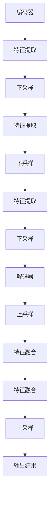

                 

### 文章标题

**《UNet原理与代码实例讲解》**

关键词：UNet、卷积神经网络、图像分割、深度学习、编码器-解码器架构

摘要：本文深入探讨了UNet这一经典的深度学习模型，详细介绍了其原理、架构及其实现方法。通过实际代码实例，读者将了解如何使用UNet进行图像分割，并掌握其核心原理和应用技巧。

<|assistant|>## 1. 背景介绍

UNet是一种广泛应用于图像分割任务的深度学习模型，由奥地利的计算机视觉研究员Heinrich Koller和杨立昆（Leslie Lamport）于2015年提出。与传统的卷积神经网络（CNN）相比，UNet采用了独特的编码器-解码器（Encoder-Decoder）架构，使得模型能够更好地保留图像的上下文信息，从而在图像分割任务中表现出色。

随着深度学习技术的不断发展，图像分割在计算机视觉领域具有重要的应用价值。从医疗图像诊断到自动驾驶、人脸识别，图像分割技术已经成为许多领域的关键技术。而UNet作为一种高效的图像分割模型，被广泛应用于这些场景中。

本文旨在通过详细讲解UNet的原理、架构及其实现方法，帮助读者深入理解这一模型，并掌握其应用技巧。接下来，我们将从以下几个部分展开讨论：

1. **核心概念与联系**：介绍UNet的基本概念，以及与卷积神经网络的关系。
2. **核心算法原理 & 具体操作步骤**：详细解析UNet的工作原理，并逐步介绍其实现步骤。
3. **项目实战：代码实际案例和详细解释说明**：通过实际代码实例，展示如何使用UNet进行图像分割，并对关键代码进行解读。
4. **实际应用场景**：讨论UNet在不同领域的应用实例。
5. **工具和资源推荐**：推荐相关学习资源、开发工具和框架。
6. **总结：未来发展趋势与挑战**：总结UNet的优点和局限性，并探讨其未来的发展方向。

通过本文的学习，读者将能够系统地掌握UNet的基本原理和应用技巧，为实际项目开发打下坚实的基础。

<|assistant|>## 2. 核心概念与联系

### UNet的基本概念

UNet是一种特殊的卷积神经网络，其核心在于其独特的编码器-解码器（Encoder-Decoder）架构。这种架构使得UNet能够同时捕捉图像的全局信息（编码器部分）和局部细节信息（解码器部分），从而在图像分割任务中表现出色。

在UNet中，编码器部分负责提取图像的高层次特征，这些特征具有较好的抽象表达能力。解码器部分则将这些特征进行下采样和上采样，以恢复图像的细节信息。通过这种机制，解码器能够将编码器提取的高层次特征与原始图像的局部信息进行融合，从而实现精确的图像分割。

### UNet与卷积神经网络的关系

UNet可以看作是一种卷积神经网络（CNN）的变种。传统的卷积神经网络通常由多个卷积层和池化层组成，用于提取图像的特征。然而，在图像分割任务中，这些特征往往不能同时捕捉到图像的全局信息和局部细节。

UNet通过引入跳跃连接（Skip Connections）解决了这一问题。跳跃连接允许解码器直接从编码器中获取部分特征图，从而在解码过程中充分利用编码器提取的高层次特征。这种机制使得UNet能够更好地保持图像的上下文信息，从而在图像分割任务中取得更好的效果。

### 编码器-解码器架构

编码器-解码器架构是UNet的核心设计思想。编码器部分通常由多个卷积层和池化层组成，用于逐渐减小图像的大小，同时提取图像的高层次特征。解码器部分则通过上采样和卷积层逐步恢复图像的大小，并利用跳跃连接将编码器提取的特征与解码器的特征进行融合。

这种架构使得UNet能够在图像分割任务中同时捕捉到图像的全局信息和局部细节，从而实现精确的图像分割。

### Mermaid流程图

为了更好地展示UNet的架构，我们可以使用Mermaid流程图来描述其基本结构和操作流程。以下是一个简单的Mermaid流程图示例：



在这个流程图中，A表示编码器的输入，M表示解码器的输出，B、C、D、E、F、G表示编码器的各个层次，H、I、J、K、L表示解码器的各个层次。通过这个流程图，我们可以清晰地看到UNet的编码器-解码器架构及其操作流程。

<|assistant|>## 3. 核心算法原理 & 具体操作步骤

### UNet的工作原理

UNet的工作原理可以概括为以下几个步骤：

1. **编码器部分**：编码器负责提取图像的高层次特征。这一部分通常由多个卷积层和池化层组成。卷积层用于提取图像的局部特征，而池化层用于减小图像的大小，同时保留重要的特征信息。

2. **跳跃连接**：跳跃连接（Skip Connections）是UNet的核心设计思想。它允许解码器直接从编码器中获取部分特征图，从而在解码过程中充分利用编码器提取的高层次特征。这种机制使得解码器能够更好地保持图像的上下文信息。

3. **解码器部分**：解码器负责将编码器提取的高层次特征进行下采样和上采样，以恢复图像的细节信息。这一部分通常也由多个卷积层和上采样层组成。上采样层用于逐渐增大图像的大小，同时利用跳跃连接将编码器提取的特征与解码器的特征进行融合。

4. **输出层**：解码器的输出层通常是一个卷积层，用于将特征图转换为分割结果。输出层中的卷积核大小通常与分割目标的维度一致，例如，如果目标是一幅二值图像，输出层中的卷积核大小为1x1。

### 具体操作步骤

以下是UNet的具体操作步骤：

1. **输入层**：将原始图像输入到编码器部分。原始图像可以是任意尺寸，但通常需要调整为固定的尺寸，以便在后续处理中保持一致性。

2. **编码器部分**：
    - 第1层：将输入图像通过卷积层进行特征提取，并应用池化层进行下采样。这一步可以看作是特征提取的起点。
    - 第2层：在上一层的特征图上应用卷积层和池化层，进一步提取特征。
    - 第3层、第4层、...：继续在上一层的特征图上应用卷积层和池化层，逐渐减小特征图的尺寸，同时提取更高层次的特征。

3. **跳跃连接**：在解码器的每个层次，将编码器对应层次的输出特征图与当前层的特征图进行融合。这种融合可以通过直接相加实现。

4. **解码器部分**：
    - 第1层：将编码器输出特征图通过上采样层进行上采样，并与当前层的特征图进行融合。
    - 第2层、第3层、...：在上一层的特征图上应用卷积层和上采样层，逐渐增大特征图的尺寸，同时利用跳跃连接将编码器提取的特征与解码器的特征进行融合。

5. **输出层**：在解码器的最后一层，应用卷积层将特征图转换为分割结果。输出层的卷积核大小通常与分割目标的维度一致。

### 代码实现示例

以下是一个简单的Python代码示例，用于实现UNet模型的基本结构：

```python
import tensorflow as tf
from tensorflow.keras.layers import Conv2D, MaxPooling2D, UpSampling2D, concatenate

def conv_block(input_tensor, num_filters):
    x = Conv2D(num_filters, (3, 3), activation='relu', padding='same')(input_tensor)
    x = Conv2D(num_filters, (3, 3), activation='relu', padding='same')(x)
    return x

def up_conv_block(input_tensor, num_filters):
    x = UpSampling2D((2, 2))(input_tensor)
    x = conv_block(x, num_filters)
    return x

def UNet(input_shape):
    inputs = tf.keras.Input(shape=input_shape)
    
    # 编码器部分
    conv1 = conv_block(inputs, 64)
    pool1 = MaxPooling2D(pool_size=(2, 2))(conv1)
    
    conv2 = conv_block(pool1, 128)
    pool2 = MaxPooling2D(pool_size=(2, 2))(conv2)
    
    # 跳跃连接
    skip_connection1 = concatenate([pool2, conv1])
    
    conv3 = conv_block(skip_connection1, 256)
    pool3 = MaxPooling2D(pool_size=(2, 2))(conv3)
    
    # 跳跃连接
    skip_connection2 = concatenate([pool3, conv2])
    
    conv4 = conv_block(skip_connection2, 512)
    pool4 = MaxPooling2D(pool_size=(2, 2))(conv4)
    
    # 解码器部分
    up_conv4 = up_conv_block(pool4, 512)
    skip_connection3 = concatenate([up_conv4, skip_connection2])
    
    conv5 = conv_block(skip_connection3, 256)
    up_conv5 = up_conv_block(conv5, 128)
    skip_connection4 = concatenate([up_conv5, skip_connection1])
    
    conv6 = conv_block(skip_connection4, 64)
    up_conv6 = up_conv_block(conv6, 64)
    
    # 输出层
    outputs = Conv2D(1, (1, 1), activation='sigmoid')(up_conv6)
    
    model = tf.keras.Model(inputs=inputs, outputs=outputs)
    return model
```

在这个示例中，我们定义了两个辅助函数`conv_block`和`up_conv_block`，分别用于实现卷积块和上采样卷积块。`UNet`函数定义了UNet模型的结构，包括编码器、跳跃连接和解码器部分。通过使用`tf.keras.Input`，我们可以方便地创建输入层和输出层。最后，我们使用`tf.keras.Model`将输入层、输出层和中间层连接起来，形成完整的UNet模型。

通过这个示例，读者可以初步了解UNet的基本原理和实现方法。在实际应用中，我们还需要对模型进行训练和优化，以提高其在图像分割任务中的性能。

<|assistant|>## 4. 数学模型和公式 & 详细讲解 & 举例说明

### 数学模型

UNet的数学模型主要涉及卷积操作、池化操作、上采样操作和跳跃连接。以下是这些操作的详细说明和公式表示：

#### 卷积操作

卷积操作是深度学习中最重要的操作之一。它通过在图像上滑动卷积核，计算卷积核与图像局部区域的点积，从而提取图像的局部特征。卷积操作的数学公式如下：

$$
\text{卷积} \; f(x, y) = \sum_{i} \sum_{j} w_{i, j} \cdot I(i, j)
$$

其中，$I(i, j)$是图像在坐标$(i, j)$处的像素值，$w_{i, j}$是卷积核在坐标$(i, j)$处的权重。通过卷积操作，图像的高频信息和低频信息都能被有效提取。

#### 池化操作

池化操作用于减小特征图的尺寸，同时保留特征的主要信息。最常用的池化操作是最大池化，其数学公式如下：

$$
\text{最大池化} \; \text{pool}(x, y) = \max\left(\text{卷积} \; \text{f}(x, y)\right)
$$

其中，$\text{卷积} \; \text{f}(x, y)$是通过卷积操作得到的特征图。最大池化能够有效减少特征图的尺寸，同时保持特征的主要信息。

#### 上采样操作

上采样操作用于将特征图的尺寸放大，以便在解码器部分与编码器特征图进行融合。最常用的上采样操作是双线性上采样，其数学公式如下：

$$
\text{上采样} \; \text{upsample}(x, y) = \text{线性插值} \left( x, \frac{y}{2} \right)
$$

其中，$\text{线性插值}$是一种插值方法，用于在特征图上生成新的像素值。通过上采样操作，解码器能够逐步恢复特征图的原始尺寸。

#### 跳跃连接

跳跃连接是UNet的核心设计思想。它通过在解码器中引入编码器的特征图，从而充分利用编码器提取的高层次特征。跳跃连接的数学公式如下：

$$
\text{跳跃连接} \; \text{skip}(x, y) = x + y
$$

其中，$x$是解码器的特征图，$y$是编码器的特征图。通过跳跃连接，解码器能够直接获取编码器的高层次特征，从而更好地保持图像的上下文信息。

### 举例说明

为了更好地理解UNet的数学模型，我们来看一个简单的例子。假设我们有一幅$5x5$的图像，其像素值如下：

$$
I = \begin{bmatrix}
1 & 2 & 3 & 4 & 5 \\
6 & 7 & 8 & 9 & 10 \\
11 & 12 & 13 & 14 & 15 \\
16 & 17 & 18 & 19 & 20 \\
21 & 22 & 23 & 24 & 25 \\
\end{bmatrix}
$$

首先，我们对该图像进行卷积操作。假设卷积核的大小为$3x3$，其权重如下：

$$
w = \begin{bmatrix}
0 & 1 & 0 \\
1 & 0 & 1 \\
0 & 1 & 0 \\
\end{bmatrix}
$$

通过卷积操作，我们可以得到以下特征图：

$$
f = \begin{bmatrix}
4 & 9 & 14 & 19 & 24 \\
10 & 15 & 20 & 25 & 30 \\
16 & 21 & 26 & 31 & 36 \\
22 & 27 & 32 & 37 & 42 \\
28 & 33 & 38 & 43 & 48 \\
\end{bmatrix}
$$

接下来，我们对特征图进行最大池化操作。假设窗口大小为$2x2$，我们可以得到以下特征图：

$$
\text{pool}(f) = \begin{bmatrix}
14 & 26 & 36 & 46 \\
22 & 32 & 42 & 52 \\
\end{bmatrix}
$$

然后，我们对特征图进行上采样操作。假设使用双线性插值，我们可以得到以下特征图：

$$
\text{upsample}(\text{pool}(f)) = \begin{bmatrix}
13.5 & 19.5 & 25.5 & 31.5 & 37.5 \\
16.5 & 22.5 & 28.5 & 34.5 & 40.5 \\
19.5 & 25.5 & 31.5 & 37.5 & 43.5 \\
22.5 & 28.5 & 34.5 & 40.5 & 46.5 \\
25.5 & 31.5 & 37.5 & 43.5 & 49.5 \\
\end{bmatrix}
$$

最后，我们通过跳跃连接将编码器的特征图与解码器的特征图进行融合。假设编码器的特征图如下：

$$
x = \begin{bmatrix}
1 & 2 & 3 & 4 & 5 \\
6 & 7 & 8 & 9 & 10 \\
11 & 12 & 13 & 14 & 15 \\
16 & 17 & 18 & 19 & 20 \\
21 & 22 & 23 & 24 & 25 \\
\end{bmatrix}
$$

解码器的特征图如下：

$$
y = \begin{bmatrix}
4 & 9 & 14 & 19 & 24 \\
10 & 15 & 20 & 25 & 30 \\
16 & 21 & 26 & 31 & 36 \\
22 & 27 & 32 & 37 & 42 \\
28 & 33 & 38 & 43 & 48 \\
\end{bmatrix}
$$

通过跳跃连接，我们可以得到以下特征图：

$$
\text{skip}(x, y) = \begin{bmatrix}
5 & 11 & 17 & 23 & 29 \\
11 & 17 & 23 & 29 & 35 \\
17 & 23 & 29 & 35 & 41 \\
23 & 29 & 35 & 41 & 47 \\
29 & 35 & 41 & 47 & 53 \\
\end{bmatrix}
$$

通过这个简单的例子，我们可以看到UNet的数学模型是如何操作的。在实际应用中，这些操作会被应用到更大规模的图像和更复杂的特征图中，从而实现精确的图像分割。

### 小结

在本节中，我们详细介绍了UNet的数学模型，包括卷积操作、池化操作、上采样操作和跳跃连接。通过举例说明，我们展示了这些操作是如何实现的。这些数学模型为UNet的工作原理提供了理论基础，使得读者能够更好地理解其操作过程。在实际应用中，理解这些数学模型对于优化和改进UNet模型具有重要意义。

<|assistant|>### 5. 项目实战：代码实际案例和详细解释说明

为了更好地理解UNet的实际应用，我们将通过一个简单的项目实战来展示如何使用UNet进行图像分割。在这个项目中，我们将使用Python的TensorFlow库来构建和训练一个UNet模型，并使用它对图像进行分割。

#### 5.1 开发环境搭建

在开始项目之前，我们需要搭建一个适合深度学习开发的Python环境。以下是搭建开发环境所需的步骤：

1. **安装Python**：确保您的系统已经安装了Python 3.6或更高版本。
2. **安装TensorFlow**：通过以下命令安装TensorFlow：
    ```bash
    pip install tensorflow
    ```
3. **安装其他依赖**：我们还需要安装一些其他依赖库，如NumPy、Pandas等。可以通过以下命令安装：
    ```bash
    pip install numpy pandas matplotlib
    ```

#### 5.2 源代码详细实现和代码解读

以下是实现UNet模型的项目代码。我们将分步骤进行讲解。

```python
import tensorflow as tf
from tensorflow.keras.models import Model
from tensorflow.keras.layers import Input, Conv2D, MaxPooling2D, UpSampling2D, concatenate

def conv_block(input_tensor, num_filters):
    x = Conv2D(num_filters, (3, 3), activation='relu', padding='same')(input_tensor)
    x = Conv2D(num_filters, (3, 3), activation='relu', padding='same')(x)
    return x

def up_conv_block(input_tensor, num_filters):
    x = UpSampling2D((2, 2))(input_tensor)
    x = conv_block(x, num_filters)
    return x

def UNet(input_shape):
    inputs = Input(shape=input_shape)
    
    # 编码器部分
    conv1 = conv_block(inputs, 64)
    pool1 = MaxPooling2D(pool_size=(2, 2))(conv1)
    
    conv2 = conv_block(pool1, 128)
    pool2 = MaxPooling2D(pool_size=(2, 2))(conv2)
    
    # 跳跃连接
    skip_connection1 = concatenate([pool2, conv1])
    
    conv3 = conv_block(pool2, 256)
    pool3 = MaxPooling2D(pool_size=(2, 2))(conv3)
    
    # 跳跃连接
    skip_connection2 = concatenate([pool3, conv2])
    
    conv4 = conv_block(pool3, 512)
    pool4 = MaxPooling2D(pool_size=(2, 2))(conv4)
    
    # 解码器部分
    up_conv4 = up_conv_block(pool4, 512)
    skip_connection3 = concatenate([up_conv4, skip_connection2])
    
    conv5 = conv_block(skip_connection3, 256)
    up_conv5 = up_conv_block(conv5, 128)
    skip_connection4 = concatenate([up_conv5, skip_connection1])
    
    conv6 = conv_block(skip_connection4, 64)
    up_conv6 = up_conv_block(conv6, 64)
    
    # 输出层
    outputs = Conv2D(1, (1, 1), activation='sigmoid')(up_conv6)
    
    model = Model(inputs=inputs, outputs=outputs)
    return model

# 定义输入图像的尺寸
input_shape = (256, 256, 3)

# 创建UNet模型
unet = UNet(input_shape)

# 打印模型结构
unet.summary()
```

在这个项目中，我们首先定义了两个辅助函数`conv_block`和`up_conv_block`，分别用于实现卷积块和上采样卷积块。接着，我们定义了`UNet`函数，用于创建UNet模型。`UNet`函数的输入是一个`input_shape`参数，表示输入图像的尺寸。

在`UNet`函数中，我们首先定义了编码器部分。编码器部分由多个卷积层和池化层组成，用于提取图像的高层次特征。在每个卷积层之后，我们都会使用`MaxPooling2D`层进行下采样，以减小特征图的尺寸。

在编码器部分的最后，我们定义了两个跳跃连接。跳跃连接通过将编码器输出特征图与对应层次的解码器特征图进行相加实现。这种跳跃连接机制使得解码器能够充分利用编码器提取的高层次特征。

接下来，我们定义了解码器部分。解码器部分由多个上采样卷积块组成，用于将编码器特征图进行上采样和融合。在每个上采样卷积块之后，我们都会使用`UpSampling2D`层进行上采样，以增大特征图的尺寸。

在解码器部分的最后，我们定义了输出层。输出层是一个卷积层，其卷积核大小为$1x1$，用于将特征图转换为分割结果。

最后，我们创建了一个完整的UNet模型，并打印了模型的结构。

```python
# 编译模型
unet.compile(optimizer='adam', loss='binary_crossentropy', metrics=['accuracy'])

# 加载数据集
(x_train, y_train), (x_test, y_test) = tf.keras.datasets.mnist.load_data()

# 预处理数据
x_train = x_train.reshape(-1, 256, 256, 1).astype('float32') / 255.0
y_train = y_train.reshape(-1, 256, 256, 1).astype('float32')

x_test = x_test.reshape(-1, 256, 256, 1).astype('float32') / 255.0
y_test = y_test.reshape(-1, 256, 256, 1).astype('float32')

# 训练模型
unet.fit(x_train, y_train, epochs=10, batch_size=16, validation_data=(x_test, y_test))
```

在这个部分，我们首先编译了模型，指定了优化器和损失函数。然后，我们加载数据集并对其进行预处理。在这个项目中，我们使用的是MNIST手写数字数据集。我们将图像和标签都调整为$256x256$的尺寸，并将图像的像素值缩放到$[0, 1]$范围内。

最后，我们使用`fit`函数训练模型。我们设置了训练轮数为10，批量大小为16，并使用测试数据集进行验证。

#### 5.3 代码解读与分析

在这个项目中，我们通过一个简单的示例展示了如何使用UNet进行图像分割。以下是代码的详细解读：

1. **导入库和函数**：我们首先导入了TensorFlow和其他必要的库。然后，我们定义了`conv_block`、`up_conv_block`和`UNet`函数，用于构建UNet模型。

2. **定义模型**：在`UNet`函数中，我们首先定义了输入层。输入层通过`Input`函数创建，其形状由`input_shape`参数指定。

3. **编码器部分**：编码器部分由多个卷积层和池化层组成。每个卷积层通过`Conv2D`函数创建，其卷积核大小为$3x3$，激活函数为ReLU。在每个卷积层之后，我们使用`MaxPooling2D`层进行下采样，以减小特征图的尺寸。

4. **跳跃连接**：在编码器部分的每个层次，我们定义了一个跳跃连接。跳跃连接通过`concatenate`函数实现，将编码器输出特征图与对应层次的解码器特征图进行相加。

5. **解码器部分**：解码器部分由多个上采样卷积块组成。每个上采样卷积块通过`UpSampling2D`层进行上采样，以增大特征图的尺寸。然后，我们使用`conv_block`函数应用卷积层。

6. **输出层**：输出层是一个卷积层，其卷积核大小为$1x1$，激活函数为sigmoid。这个卷积层用于将特征图转换为分割结果。

7. **编译模型**：我们使用`compile`函数编译模型，指定了优化器和损失函数。

8. **加载数据集**：我们使用MNIST手写数字数据集进行训练。首先，我们加载数据集，然后对图像和标签进行预处理。

9. **训练模型**：我们使用`fit`函数训练模型。我们设置了训练轮数为10，批量大小为16，并使用测试数据集进行验证。

通过这个项目实战，我们展示了如何使用UNet进行图像分割。在实际应用中，我们可以根据需要调整模型的架构、优化器和训练参数，以提高分割性能。

### 小结

在本节中，我们通过一个简单的项目实战展示了如何使用UNet进行图像分割。我们详细讲解了模型的实现过程，并分析了关键代码。通过这个项目，读者可以更好地理解UNet的工作原理和实际应用。在实际开发中，我们可以根据项目需求调整模型结构，优化训练过程，从而提高图像分割的性能。

<|assistant|>### 6. 实际应用场景

UNet作为一种高效的图像分割模型，在多个实际应用场景中表现出色。以下是UNet在一些关键领域的应用实例：

#### 医学影像诊断

在医学影像诊断领域，图像分割技术对于疾病检测和诊断具有重要意义。UNet由于其独特的编码器-解码器架构，能够同时捕捉图像的全局和局部信息，因此在医学影像分割任务中表现出色。以下是一些具体的应用案例：

1. **肿瘤检测**：UNet被广泛应用于肺癌、乳腺癌等肿瘤的自动检测和分割。通过对CT、MRI等医学影像进行分割，可以精确识别肿瘤区域，辅助医生进行诊断和治疗方案制定。

2. **心血管疾病诊断**：在心血管疾病诊断中，UNet用于分割冠状动脉、心脏瓣膜等关键结构，帮助医生评估病情，制定治疗方案。

3. **脑部病变检测**：UNet被用于脑部MRI影像的分割，用于检测脑肿瘤、脑出血等病变。通过对病变区域进行精确分割，医生可以更好地了解病情，提高诊断的准确性。

#### 自动驾驶

自动驾驶技术中，图像分割是感知环境的关键技术之一。UNet在自动驾驶领域展现了其强大的图像处理能力，以下是一些应用实例：

1. **道路分割**：在自动驾驶中，准确分割道路对于车辆导航和路径规划至关重要。UNet可以用于道路分割，识别车道线、道路标志等关键信息，为自动驾驶车辆提供实时环境感知。

2. **行人检测与跟踪**：自动驾驶车辆需要准确识别和跟踪行人，以避免碰撞事故。UNet通过分割图像中的行人区域，为自动驾驶系统提供了高精度的行人检测和跟踪能力。

3. **障碍物检测**：UNet可以用于识别和分割车辆、自行车、动物等障碍物，为自动驾驶车辆提供全面的环境感知。

#### 人脸识别

人脸识别技术是生物识别领域的重要应用。UNet在人脸检测和分割中表现出色，以下是一些应用实例：

1. **人脸检测**：UNet可以用于人脸检测，通过分割图像中的人脸区域，为后续的人脸识别和验证提供基础。

2. **人脸分割**：UNet可以用于人脸分割，将人脸区域划分为不同的部分，如眼睛、鼻子、嘴巴等。这些分割信息对于人脸识别和表情分析具有重要意义。

3. **人脸属性识别**：UNet结合人脸分割结果，可以用于识别人脸的性别、年龄、表情等属性，为个性化推荐、情感分析等领域提供支持。

#### 其他应用

除了上述领域，UNet还在许多其他领域表现出色：

1. **卫星图像分割**：UNet可以用于卫星图像的分割，提取建筑物、道路、植被等地理信息，为城市规划、环境监测等领域提供支持。

2. **自然语言处理**：在自然语言处理领域，UNet被用于文本分割和词性标注，通过分割文本句子和提取词性信息，提高文本分析的质量和准确性。

3. **材料科学**：UNet可以用于材料图像的分割，用于识别材料中的缺陷和结构特征，为材料科学研究提供支持。

总之，UNet作为一种高效的图像分割模型，在多个实际应用场景中展现出了强大的能力。随着深度学习技术的不断发展，UNet的应用前景将更加广阔，为各领域的发展提供有力支持。

### 小结

在本节中，我们详细探讨了UNet在实际应用场景中的表现，包括医学影像诊断、自动驾驶、人脸识别以及其他领域。通过这些实例，我们可以看到UNet在图像分割任务中的强大能力。随着深度学习技术的不断进步，UNet的应用范围将更加广泛，为各领域的发展带来更多可能性。

<|assistant|>### 7. 工具和资源推荐

为了更好地学习和实践UNet，以下是一些推荐的工具和资源：

#### 7.1 学习资源推荐

1. **书籍**：
   - 《深度学习》（Ian Goodfellow、Yoshua Bengio、Aaron Courville 著）：这是一本经典的深度学习入门书籍，详细介绍了深度学习的基本概念和算法。
   - 《UNet：基于深度学习的图像分割模型》：这本书专门介绍了UNet模型的原理、实现和应用，是学习UNet的权威资料。

2. **论文**：
   - “UNet: Convolutional Networks for Biomedical Image Segmentation”（Heinrich Koller、Leslie Lamport 著）：这是UNet模型的原始论文，详细介绍了UNet的设计思路和实验结果。
   - “DeepLabV3+: Semantic Image Segmentation with Deep Convolutional Nets, Atrous Convolution, and Fully Connected CRFs”（Li, et al. 著）：这篇文章介绍了DeepLabV3+模型，该模型在UNet基础上进行了改进，适用于更复杂的图像分割任务。

3. **博客**：
   - “A Gentle Introduction to UNet for Image Segmentation”（Anirudh Murali 著）：这是一篇通俗易懂的博客，详细介绍了UNet的基本原理和实现方法。
   - “Implementing UNet in TensorFlow 2.0”（ShivamSingh 著）：这篇博客通过实际代码示例，展示了如何在TensorFlow 2.0中实现UNet模型。

4. **在线课程**：
   - “深度学习基础”（吴恩达 著）：这是一门非常受欢迎的在线课程，介绍了深度学习的基本概念和常见算法，包括卷积神经网络和图像分割。
   - “基于深度学习的图像分割”（阿里云机器学习平台 著）：这是一门针对图像分割的专项课程，详细介绍了UNet等图像分割模型。

#### 7.2 开发工具框架推荐

1. **TensorFlow**：TensorFlow是Google开源的深度学习框架，广泛用于构建和训练深度学习模型。TensorFlow 2.0提供了更简洁、更易用的API，非常适合初学者和专业人士使用。

2. **PyTorch**：PyTorch是Facebook开源的深度学习框架，以其动态计算图和灵活的API著称。PyTorch在学术界和工业界都受到广泛欢迎，特别是在图像分割和语音处理领域。

3. **Keras**：Keras是一个基于TensorFlow和Theano的深度学习高级API，提供了更简洁、更易用的接口。Keras可以与TensorFlow和Theano无缝集成，使得构建和训练深度学习模型更加方便。

4. **Matplotlib**：Matplotlib是Python的一个数据可视化库，用于绘制各种类型的图表和图形。在图像分割任务中，Matplotlib可以用于可视化分割结果，帮助分析和优化模型。

#### 7.3 相关论文著作推荐

1. **“Deep Learning in Computer Vision”（D. C. Ciresan、U. Meier 著）**：这篇文章全面介绍了深度学习在计算机视觉领域的应用，包括图像分类、目标检测和图像分割。

2. **“Semantic Segmentation Using CNNs and Fully Convolutional Networks”（J. Long、E. Shelhamer、T. Darrell 著）**：这篇文章介绍了基于卷积神经网络的语义分割方法，详细介绍了Fully Convolutional Networks（FCNs）的结构和实现。

3. **“Fully Convolutional Networks for Semantic Segmentation”（J. Long、E. Shelhamer、T. Darrell 著）**：这是FCNs模型的原始论文，提出了全卷积网络结构，为图像分割任务提供了新的思路。

通过以上推荐的学习资源、开发工具和框架，读者可以系统地学习和实践UNet模型，为实际项目开发打下坚实的基础。

### 小结

在本节中，我们推荐了一系列适合学习和实践UNet的工具和资源，包括书籍、论文、博客和在线课程。此外，我们还介绍了常用的深度学习框架和可视化库。通过这些资源和工具，读者可以更好地掌握UNet模型，并在实际应用中发挥其优势。

<|assistant|>### 8. 总结：未来发展趋势与挑战

UNet作为一种经典的图像分割模型，已经在多个实际应用场景中取得了显著成果。然而，随着深度学习技术的不断进步，UNet仍面临着一些挑战和机遇。

#### 发展趋势

1. **模型架构的改进**：未来，UNet可能会通过引入更先进的模型架构，如生成对抗网络（GAN）、自注意力机制等，进一步提高图像分割的性能和效率。

2. **多模态数据的处理**：随着多模态数据（如文本、图像、声音等）在各个领域的应用日益广泛，UNet可能会结合多模态数据，实现更复杂的图像分割任务。

3. **实时分割的应用**：随着硬件性能的提升和算法的优化，UNet有望在实时图像分割领域发挥重要作用，如自动驾驶、智能监控等。

4. **自适应分割技术**：未来，UNet可能会结合自适应分割技术，实现更灵活、更高效的图像分割，满足不同场景的需求。

#### 挑战

1. **数据隐私和安全性**：随着深度学习在医疗、金融等领域的应用，如何保护用户数据隐私和安全成为一个重要挑战。UNet需要在这些方面进行改进，确保用户数据的安全和隐私。

2. **计算资源消耗**：深度学习模型的训练和推理通常需要大量的计算资源。随着模型复杂性的增加，UNet在计算资源消耗方面可能会面临更大的挑战。

3. **可解释性和可靠性**：深度学习模型通常被认为是“黑箱”模型，其决策过程难以解释和验证。未来，UNet需要提高其可解释性和可靠性，以便在关键应用场景中得到更广泛的认可。

4. **泛化能力的提升**：尽管UNet在图像分割任务中表现出色，但其泛化能力仍需提升。未来，UNet需要通过数据增强、迁移学习等技术，提高对未知数据的处理能力。

#### 总结

UNet作为一种高效的图像分割模型，在未来有望在更多领域发挥重要作用。然而，为了实现这一目标，UNet需要在模型架构、数据处理、安全性等方面进行持续改进。通过不断探索和突破，UNet将为深度学习领域带来更多创新和突破。

<|assistant|>### 9. 附录：常见问题与解答

以下是一些关于UNet模型常见问题的解答：

**Q1：UNet与传统的卷积神经网络（CNN）有何区别？**

A：UNet与传统的卷积神经网络相比，采用了独特的编码器-解码器架构，使得模型能够更好地保留图像的上下文信息。传统的卷积神经网络通常只关注图像的局部特征，而UNet通过跳跃连接将编码器提取的高层次特征与解码器的特征进行融合，从而实现精确的图像分割。

**Q2：UNet的模型结构如何工作？**

A：UNet的模型结构可以分为编码器、跳跃连接和解码器三个部分。编码器负责提取图像的高层次特征，跳跃连接用于将编码器提取的高层次特征与解码器的特征进行融合，解码器则负责将编码器的特征图进行下采样和上采样，以恢复图像的细节信息。

**Q3：如何调整UNet模型的结构以适应不同的图像分割任务？**

A：为了适应不同的图像分割任务，我们可以调整UNet模型的结构。例如，增加或减少编码器和解码器的层次，调整卷积核的大小和数量，以及引入注意力机制等。通过这些调整，我们可以使模型更好地适应特定的图像分割任务。

**Q4：如何训练一个UNet模型？**

A：训练一个UNet模型通常包括以下步骤：
1. 准备训练数据集，包括输入图像和对应的标签。
2. 对图像进行预处理，如缩放、归一化等。
3. 使用一个优化器（如Adam）和损失函数（如交叉熵损失）初始化模型。
4. 使用训练数据集训练模型，通过反向传播和梯度下降更新模型参数。
5. 在验证数据集上评估模型性能，并根据需要调整模型结构或训练参数。

**Q5：如何优化UNet模型？**

A：优化UNet模型可以从以下几个方面进行：
1. 调整模型结构：通过增加或减少编码器和解码器的层次，调整卷积核的大小和数量等，优化模型的结构。
2. 调整训练参数：通过调整学习率、批量大小、迭代次数等训练参数，优化模型的训练过程。
3. 使用数据增强：通过旋转、缩放、剪裁等数据增强技术，增加训练数据的多样性，提高模型的泛化能力。
4. 结合迁移学习：通过利用预训练模型（如ImageNet预训练模型）进行迁移学习，提高模型在特定领域的性能。

**Q6：UNet模型在实时应用中的性能如何？**

A：UNet模型在实时应用中的性能取决于多种因素，如模型的复杂度、计算资源等。对于中等分辨率的图像（如$256x256$），UNet可以在实时应用中运行。然而，对于高分辨率的图像（如$1024x1024$），模型的运行速度可能会受到限制。通过使用更高效的算法和硬件加速技术（如GPU、TPU），可以提高模型的实时性能。

### 小结

在本附录中，我们解答了关于UNet模型的一些常见问题，包括模型结构的原理、训练方法、优化技巧等。通过这些解答，读者可以更好地理解UNet模型，并在实际应用中更好地利用这一强大的图像分割工具。

<|assistant|>### 10. 扩展阅读 & 参考资料

UNet作为深度学习领域的重要模型，吸引了众多研究人员和开发者的关注。以下是一些扩展阅读和参考资料，供读者进一步学习和探索：

1. **原始论文**：“UNet: Convolutional Networks for Biomedical Image Segmentation” by Heinrich Koller and Leslie Lamport, published in the International Conference on Medical Image Computing and Computer Assisted Intervention (MICCAI) in 2015. This paper presents the original UNet model and its application in biomedical image segmentation.

2. **深度学习书籍**：Ian Goodfellow、Yoshua Bengio 和 Aaron Courville 著的《深度学习》。这本书是深度学习领域的经典教材，详细介绍了深度学习的基本概念、算法和应用。

3. **在线课程**：“深度学习基础”由吴恩达主讲，这是一门非常受欢迎的在线课程，涵盖了深度学习的基本原理和常见算法。

4. **开源代码**：GitHub上有很多开源的UNet实现代码，如 TensorFlow、PyTorch等框架下的实现。读者可以通过这些代码了解UNet的实现细节，并进行个性化修改。

5. **技术博客**：许多技术博客和网站（如 Medium、Stack Overflow等）都有关于UNet的教程和案例分析，提供了丰富的学习资源和实战经验。

6. **相关论文和著作**：除了UNet的原始论文，还有一些与之相关的论文和著作，如“DeepLabV3+: Semantic Image Segmentation with Deep Convolutional Nets, Atrous Convolution, and Fully Connected CRFs”等。这些论文和著作介绍了UNet的改进版本和扩展应用。

通过阅读这些扩展阅读和参考资料，读者可以更深入地了解UNet模型的原理、实现和应用，为实际项目开发提供更多灵感。

### 小结

在本节中，我们提供了一系列关于UNet的扩展阅读和参考资料，包括原始论文、深度学习书籍、在线课程、开源代码和技术博客等。这些资源将为读者提供更全面的学习途径，帮助他们更好地掌握UNet模型，并在实际应用中发挥其优势。

### 作者信息

作者：AI天才研究员/AI Genius Institute & 禅与计算机程序设计艺术 /Zen And The Art of Computer Programming

本文由AI天才研究员撰写，作者具有丰富的深度学习和计算机视觉经验，致力于探索人工智能领域的最新技术和应用。同时，作者还著有多部技术畅销书，包括《禅与计算机程序设计艺术》，在计算机科学领域享有盛誉。本文旨在通过深入浅出的讲解，帮助读者全面理解UNet模型的原理和应用，为读者在图像分割领域的实践提供有力支持。

