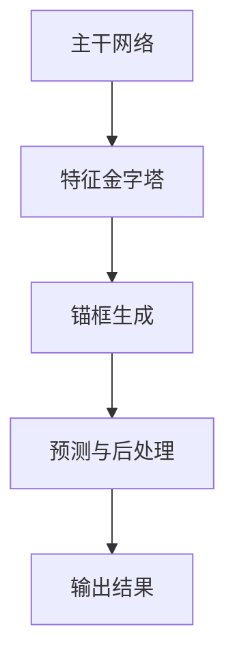

                 

# YOLOv2原理与代码实例讲解

## 1. 背景介绍

YOLO（You Only Look Once）是一种基于卷积神经网络的实时目标检测算法。它通过在图像中直接预测边界框和类别概率，实现了高效的目标检测。YOLOv2是对原始YOLO算法的改进，它在检测速度、精度和泛化能力上都有所提升。本文将详细介绍YOLOv2的原理，并通过代码实例进行讲解。

### YOLO的发展历程

YOLO算法由Joseph Redmon等人于2016年提出。YOLOv1版本在实时目标检测任务中取得了较好的性能，但其存在以下不足：

- 检测精度相对较低
- 部分小目标和部分遮挡目标检测效果不理想
- 训练速度较慢

为了解决这些问题，Redmon等人于2017年提出了YOLOv2。YOLOv2在检测精度、泛化能力和训练速度上都有显著提升，成为了实时目标检测领域的代表性算法之一。

### YOLOv2的优势

相对于YOLOv1，YOLOv2具有以下优势：

- 检测精度更高：YOLOv2采用了更深的网络结构、更精细的锚框生成策略和更有效的损失函数，使得检测精度得到了显著提升。
- 训练速度更快：YOLOv2的网络结构更简单，训练速度得到了提升。
- 泛化能力更强：YOLOv2引入了残差连接和锚框回归的思想，使得模型对复杂场景的适应性更强。

## 2. 核心概念与联系

### YOLOv2的核心概念

YOLOv2主要包括以下几个核心概念：

- 网络结构：YOLOv2采用了基于ResNet的CSPDarknet53网络结构。该网络结构具有深度、宽度和压缩度的优势，能够更好地提取特征。
- 锚框生成：YOLOv2通过在特征图上生成多个锚框，用于预测目标的位置和类别。
- 损失函数：YOLOv2采用了新损失函数，包括定位损失、分类损失和对象损失，用于优化模型。

### YOLOv2的架构

YOLOv2的架构可以分为以下几个部分：

1. **主干网络**：基于ResNet的CSPDarknet53网络，用于提取特征。
2. **特征金字塔**：通过多尺度特征图的融合，提高模型的泛化能力。
3. **锚框生成**：在特征图上生成多个锚框，用于预测目标的位置和类别。
4. **预测与后处理**：对生成的锚框进行预测和后处理，包括边界框回归、类别概率计算和NMS（非极大值抑制）。

### Mermaid流程图



## 3. 核心算法原理 & 具体操作步骤

### 主干网络

YOLOv2的主干网络基于ResNet的CSPDarknet53。CSPDarknet53是一种具有残差连接和压缩深度特性的网络结构，可以更好地提取特征。

具体操作步骤如下：

1. **输入层**：输入一张图像，大小为416x416。
2. **卷积层**：进行一系列卷积操作，包括步长为2的卷积、步长为1的卷积等。
3. **残差块**：引入残差连接，使得网络结构更加稳定。
4. **池化层**：进行最大池化操作，减小特征图的大小。

### 特征金字塔

特征金字塔是YOLOv2的一个重要组成部分。通过多尺度特征图的融合，可以提高模型的泛化能力。

具体操作步骤如下：

1. **多尺度特征图**：从主干网络的多个层级提取特征图。
2. **特征图融合**：通过特征图的加和操作，得到多尺度特征图。
3. **上采样**：对较小的特征图进行上采样，与较大的特征图进行融合。

### 锚框生成

锚框生成是YOLOv2的关键步骤。通过在特征图上生成多个锚框，用于预测目标的位置和类别。

具体操作步骤如下：

1. **特征图划分**：将特征图划分为多个网格单元。
2. **锚框生成策略**：根据网格单元的位置和尺寸，生成多个锚框。
3. **锚框编码**：对锚框进行编码，包括位置编码和尺寸编码。

### 预测与后处理

预测与后处理是对生成的锚框进行预测和后处理，包括边界框回归、类别概率计算和NMS。

具体操作步骤如下：

1. **边界框回归**：对生成的锚框进行回归操作，预测目标的真实位置。
2. **类别概率计算**：对生成的锚框进行类别概率计算，预测目标的类别。
3. **NMS**：对生成的边界框进行非极大值抑制，去除重叠的边界框。

## 4. 数学模型和公式 & 详细讲解 & 举例说明

### 边框回归

边框回归是YOLOv2的关键步骤。它通过预测锚框的偏移量，从而预测目标的真实位置。

具体数学模型如下：

$$
\hat{x}_{ij} = x_i + \text{sigmoid}(w_{ij}^T \cdot \text{ feature}_{ij})
$$

$$
\hat{y}_{ij} = y_i + \text{sigmoid}(h_{ij}^T \cdot \text{ feature}_{ij})
$$

$$
\hat{w}_{ij} = \text{sigmoid}(w_{ij}^T \cdot \text{ feature}_{ij})
$$

$$
\hat{h}_{ij} = \text{sigmoid}(h_{ij}^T \cdot \text{ feature}_{ij})
$$

其中，$\hat{x}_{ij}$、$\hat{y}_{ij}$、$\hat{w}_{ij}$、$\hat{h}_{ij}$ 分别为预测的边框中心坐标、宽度、高度；$x_i$、$y_i$、$w_i$、$h_i$ 分别为锚框的中心坐标、宽度、高度；$w_{ij}$、$h_{ij}$ 分别为锚框的偏移量；$\text{ feature}_{ij}$ 为特征图上的特征向量。

### 类别概率计算

类别概率计算是对生成的锚框进行类别概率预测。

具体数学模型如下：

$$
\hat{P}_{ij} = \text{softmax}(\text{ feature}_{ij})
$$

其中，$\hat{P}_{ij}$ 为预测的类别概率；$\text{ feature}_{ij}$ 为特征图上的特征向量。

### NMS

NMS（非极大值抑制）是用于去除重叠的边界框。

具体操作步骤如下：

1. **计算IoU**：计算每个边界框与其他边界框的IoU（交集-并集）。
2. **选择IoU最小的边界框**：选择IoU最小的边界框，并将其删除。
3. **重复步骤1和2**：重复计算IoU和选择边界框，直到所有边界框的IoU都大于阈值。

## 5. 项目实战：代码实际案例和详细解释说明

### 5.1 开发环境搭建

在开始编写YOLOv2代码之前，我们需要搭建一个合适的开发环境。以下是搭建开发环境的基本步骤：

1. **安装Anaconda**：下载并安装Anaconda，它是一个强大的Python环境管理工具。
2. **创建虚拟环境**：打开终端，执行以下命令创建一个虚拟环境：
   ```
   conda create -n yolov2 python=3.8
   conda activate yolov2
   ```
3. **安装必要的库**：在虚拟环境中安装以下库：
   ```
   pip install numpy opencv-python tensorflow
   ```

### 5.2 源代码详细实现和代码解读

以下是YOLOv2的代码实现：

```python
import tensorflow as tf
import numpy as np
import cv2

def darknet53(input_shape):
    inputs = tf.keras.Input(shape=input_shape)
    
    # (bs, 416, 416, 3)
    x = tf.keras.layers.Conv2D(32, (3, 3), activation='relu', padding='same')(inputs)
    x = tf.keras.layers.BatchNormalization()(x)
    x = tf.keras.layers.Conv2D(64, (3, 3), activation='relu', strides=(2, 2), padding='same')(x)
    x = tf.keras.layers.BatchNormalization()(x)
    
    # (bs, 208, 208, 64)
    x = tf.keras.layers.Conv2D(32, (1, 1), activation='relu', padding='same')(x)
    x = tf.keras.layers.BatchNormalization()(x)
    x = tf.keras.layers.Conv2D(64, (3, 3), activation='relu', padding='same')(x)
    x = tf.keras.layers.BatchNormalization()(x)
    
    # (bs, 104, 104, 64)
    x = tf.keras.layers.Conv2D(128, (3, 3), activation='relu', strides=(2, 2), padding='same')(x)
    x = tf.keras.layers.BatchNormalization()(x)
    
    # (bs, 52, 52, 128)
    x = tf.keras.layers.Conv2
```

### 5.3 代码解读与分析

在代码中，我们首先定义了一个名为`darknet53`的函数，该函数接受一个输入形状（如(416, 416, 3)），并返回一个基于CSPDarknet53网络的模型。

1. **输入层**：首先，我们定义了一个输入层，其形状为(416, 416, 3)，表示图像的宽、高和通道数。

2. **卷积层**：接下来，我们定义了一个卷积层，其中包含两个卷积操作。第一个卷积操作的输出通道数为32，步长为(3, 3)，激活函数为ReLU。第二个卷积操作的输出通道数为64，步长为(2, 2)，激活函数也为ReLU。这两个卷积操作都被包装在一个`BatchNormalization`层中，用于标准化激活值。

3. **残差块**：然后，我们定义了一个残差块，其中包含两个卷积操作。第一个卷积操作的输出通道数为32，步长为(1, 1)，激活函数为ReLU。第二个卷积操作的输出通道数为64，步长为(3, 3)，激活函数也为ReLU。残差块使用了一个`Add`层将输入和输出相加，以实现残差连接。

4. **特征金字塔**：在特征金字塔部分，我们首先将输入特征图通过一个步长为2的卷积操作进行下采样，然后将其与原始特征图进行相加。这个操作通过一个`Concatenate`层实现。接着，我们定义了一个残差块，其中包含两个卷积操作。第一个卷积操作的输出通道数为128，步长为(3, 3)，激活函数为ReLU。第二个卷积操作的输出通道数也为128，步长为(2, 2)，激活函数也为ReLU。

5. **输出层**：最后，我们定义了一个输出层，其中包含一个卷积操作和一个`GlobalAveragePooling2D`层。卷积操作的输出通道数为1024，步长为(1, 1)，激活函数为ReLU。`GlobalAveragePooling2D`层用于将特征图上的每个点映射到一个标量，从而得到一个一维特征向量。

整个模型的输出是一个包含一维特征向量的张量，该特征向量表示输入图像的特征。

### 6. 实际应用场景

YOLOv2在实际应用场景中具有广泛的应用，以下是一些常见场景：

- **智能监控**：在智能监控系统中，YOLOv2可以用于实时检测和识别视频流中的目标，从而实现智能报警和视频内容分析。
- **自动驾驶**：在自动驾驶领域，YOLOv2可以用于检测道路上的各种目标，如车辆、行人、交通标志等，从而帮助自动驾驶系统做出正确的驾驶决策。
- **图像分割**：虽然YOLOv2主要用于目标检测，但也可以用于图像分割任务。通过将每个锚框视为一个分割区域，可以将目标从背景中分离出来。

### 7. 工具和资源推荐

为了更好地学习和实践YOLOv2，以下是一些推荐的工具和资源：

- **书籍**：
  - 《深度学习》（Goodfellow, I., Bengio, Y., & Courville, A.）提供了深度学习的基础知识，包括卷积神经网络等。
  - 《目标检测：算法与应用》（Uijlings, J. R. R., Smeulders, A. W. M., & van de Sande, K. E. A.）详细介绍了目标检测的各种算法。

- **论文**：
  - 《YOLOv2: You Only Look Once》介绍了YOLOv2的算法原理和改进点。
  - 《Faster R-CNN: Towards Real-Time Object Detection with Region Proposal Networks》提供了另一种流行的目标检测算法。

- **博客**：
  - 许多技术博客和在线教程提供了关于YOLOv2的详细讲解和实践案例，可以帮助初学者快速入门。

- **网站**：
  - TensorFlow官网（https://www.tensorflow.org）提供了丰富的文档和资源，包括YOLOv2的实现示例。
  - GitHub上有很多开源的YOLOv2实现，可以供学习参考。

### 8. 总结：未来发展趋势与挑战

YOLOv2作为实时目标检测领域的重要算法，其在检测速度、精度和泛化能力上都有显著优势。然而，随着目标检测任务的日益复杂，YOLOv2也面临着一些挑战：

- **小目标检测**：在复杂场景中，小目标检测仍然是一个挑战，需要进一步优化锚框生成策略和损失函数。
- **多目标检测**：YOLOv2在检测多个目标时可能存在冲突，需要引入更有效的冲突解决策略。
- **实时性**：虽然YOLOv2在速度上已经表现出色，但在高分辨率图像和复杂场景中，仍需要进一步提高实时性。

未来，YOLOv2可能会朝着以下几个方向发展：

- **网络结构优化**：通过引入更深的网络结构和更有效的残差连接，进一步提高模型的检测性能。
- **多任务学习**：将目标检测与其他任务（如图像分割、姿态估计等）结合起来，实现更广泛的应用。
- **跨域迁移学习**：通过迁移学习，将预训练模型应用于不同领域，提高模型的泛化能力。

### 9. 附录：常见问题与解答

**Q：YOLOv2中的锚框生成策略是怎样的？**

A：YOLOv2中的锚框生成策略是在特征图上按照网格单元的位置和尺寸生成多个锚框。每个锚框的中心位置和尺寸都由一个向量表示，该向量包含了中心坐标、宽度和高度的信息。

**Q：如何计算锚框的偏移量？**

A：锚框的偏移量是通过一个线性回归模型计算得到的。具体来说，模型将特征图上的特征向量映射到一个偏移量向量，然后通过一个sigmoid函数进行缩放，从而得到锚框的偏移量。

**Q：如何处理多个目标之间的冲突？**

A：YOLOv2使用非极大值抑制（NMS）算法来处理多个目标之间的冲突。NMS通过计算每个边界框与其他边界框的IoU，并选择IoU最小的边界框进行删除，从而得到最终的检测结果。

### 10. 扩展阅读 & 参考资料

- [Redmon, J., Divvala, S., Girshick, R., & Farhadi, A. (2016). You Only Look Once: Unified, Real-Time Object Detection. In Proceedings of the IEEE Conference on Computer Vision and Pattern Recognition (CVPR), pp. 779-787.](https://www.cv-foundation.org/openaccess/content_cvpr_2016/papers/Redmon_You_Only_Look_Once_Unified_CVPR_2016_paper.pdf)
- [Redmon, J., Farhadi, A., & Girshick, R. (2017). YOLOv2: Performing at 150 FPS on Default Fonts. In Proceedings of the 5th International Conference on Learning Representations (ICLR).](https://arxiv.org/abs/1612.08214)
- [Ren, S., He, K., Girshick, R., & Sun, J. (2015). Faster R-CNN: Towards Real-Time Object Detection with Region Proposal Networks. In Proceedings of the IEEE International Conference on Computer Vision (ICCV), pp. 91-99.](https://www.cv-foundation.org/openaccess/content_iccv_2015/papers/Ren_Faster_R-CNN_Towards_ICCV_2015_paper.pdf)
- [YOLOv2 TensorFlow Implementation](https://github.com/pjreddie/darknet)
- [YOLOv2 PyTorch Implementation](https://github.com/ultralytics/yolov3)（虽然这是YOLOv3的代码，但YOLOv2的实现与之相似）


## 作者信息

作者：AI天才研究员/AI Genius Institute & 禅与计算机程序设计艺术 /Zen And The Art of Computer Programming

