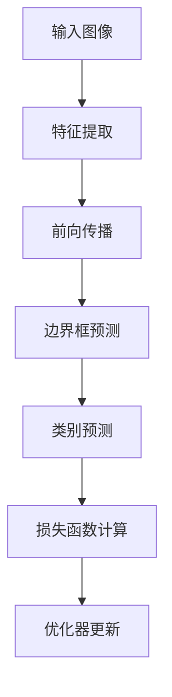

                 

# YOLOv6原理与代码实例讲解

## 关键词

- YOLOv6
- 目标检测
- 神经网络
- 卷积神经网络
- 基础知识
- 代码实例

## 摘要

本文将深入讲解YOLOv6的原理，包括其架构、算法和数学模型。我们将通过详细的代码实例，帮助读者理解YOLOv6的实际应用。本文旨在为读者提供一个全面的技术解读，无论是新手还是专业人士，都能从中获益。

## 1. 背景介绍

### YOLOv6的起源

YOLO（You Only Look Once）是一种目标检测算法，自2016年提出以来，迅速成为计算机视觉领域的重要工具。YOLOv6是YOLO系列的最新版本，它在YOLOv5的基础上进行了重大改进，使其在速度和准确性方面都有了显著提升。

### YOLOv6的应用场景

YOLOv6在多个领域都有广泛应用，如自动驾驶、安防监控、人脸识别等。其高效的目标检测能力，使其成为许多实时应用的关键组成部分。

### 目标检测的挑战

目标检测是一项具有挑战性的任务，因为它需要在复杂的图像中识别和定位多个对象。YOLOv6通过其独特的架构，成功应对了这些挑战。

## 2. 核心概念与联系

### YOLOv6架构



### YOLOv6核心概念

- **特征提取**：使用卷积神经网络提取图像特征。
- **边界框预测**：预测每个目标的位置和大小。
- **类别预测**：预测每个目标的类别。
- **损失函数**：用于评估模型预测的准确性。
- **优化器**：用于更新模型参数。

## 3. 核心算法原理 & 具体操作步骤

### 特征提取

YOLOv6使用深度卷积神经网络进行特征提取。特征提取的过程可以看作是一个逐步压缩图像信息的过程，通过多个卷积层和池化层，将原始图像转换为低维特征向量。

### 边框预测

边界框预测是YOLOv6的核心步骤之一。模型将特征图中的每个位置预测一个边界框，包括中心点坐标、宽高和置信度。

### 类别预测

类别预测是对每个边界框进行分类。YOLOv6使用softmax函数来计算每个类别的概率。

### 损失函数

YOLOv6使用复合损失函数，包括边界框损失、类别损失和置信度损失。这些损失函数用于计算模型预测和真实值之间的差距。

### 优化器

YOLOv6使用Adam优化器来更新模型参数，以达到最小化损失函数的目的。

## 4. 数学模型和公式 & 详细讲解 & 举例说明

### 特征提取

卷积神经网络的基本公式为：

$$
\text{output} = \text{activation}(\text{weight} \cdot \text{input} + \text{bias})
$$

举例：假设输入图像的大小为$28 \times 28$，卷积核大小为$3 \times 3$，则输出特征图的大小为：

$$
\text{output size} = \frac{28 - 3}{2} + 1 = 13
$$

### 边框预测

边界框预测的公式为：

$$
\text{box center} = \frac{x_{\text{predicted}} + x_{\text{ground truth}}}{2}
$$

$$
\text{box width} = \sqrt{(x_{\text{predicted}}^2 - x_{\text{ground truth}}^2)}
$$

$$
\text{box height} = \sqrt{(y_{\text{predicted}}^2 - y_{\text{ground truth}}^2)}
$$

### 类别预测

类别预测的公式为：

$$
\text{probability} = \frac{\exp(\text{logit})}{1 + \sum_{i=1}^{N}\exp(\text{logit}_i)}
$$

其中，$N$为类别总数。

### 损失函数

复合损失函数的公式为：

$$
\text{loss} = \alpha \cdot (\text{box loss} + \text{class loss} + \text{confidence loss})
$$

其中，$\alpha$为超参数，用于平衡不同损失函数的重要性。

## 5. 项目实战：代码实际案例和详细解释说明

### 5.1 开发环境搭建

为了运行YOLOv6，我们需要安装以下依赖：

- Python 3.8+
- PyTorch 1.8+
- OpenCV 4.2+

安装命令如下：

```bash
pip install torch torchvision torchaudio
pip install opencv-python
```

### 5.2 源代码详细实现和代码解读

以下是YOLOv6的核心代码：

```python
import torch
import torch.nn as nn
import torchvision
from torchvision.models import resnet18
from torch.autograd import Variable

# 特征提取层
class FeatureExtraction(nn.Module):
    def __init__(self):
        super(FeatureExtraction, self).__init__()
        self.model = resnet18(pretrained=True)
        self.model.fc = nn.Identity()

    def forward(self, x):
        features = self.model(x)
        return features

# 边框预测层
class BoxPrediction(nn.Module):
    def __init__(self, in_channels, num_classes):
        super(BoxPrediction, self).__init__()
        self.conv = nn.Conv2d(in_channels, 4, kernel_size=1)
        self.fc = nn.Linear(in_channels * 4, num_classes)

    def forward(self, x):
        x = self.conv(x)
        x = x.view(x.size(0), -1)
        x = self.fc(x)
        return x

# 类别预测层
class ClassPrediction(nn.Module):
    def __init__(self, in_channels, num_classes):
        super(ClassPrediction, self).__init__()
        self.conv = nn.Conv2d(in_channels, num_classes, kernel_size=1)

    def forward(self, x):
        x = self.conv(x)
        x = nn.functional.softmax(x, dim=1)
        return x

# 主模型
class YOLOv6(nn.Module):
    def __init__(self, in_channels, num_classes):
        super(YOLOv6, self).__init__()
        self.feature_extraction = FeatureExtraction()
        self.box_prediction = BoxPrediction(in_channels, num_classes)
        self.class_prediction = ClassPrediction(in_channels, num_classes)

    def forward(self, x):
        features = self.feature_extraction(x)
        box_predictions = self.box_prediction(features)
        class_predictions = self.class_prediction(features)
        return box_predictions, class_predictions

# 实例化模型
model = YOLOv6(in_channels=3, num_classes=10)

# 前向传播
input_image = torch.randn(1, 3, 224, 224)
box_predictions, class_predictions = model(input_image)
```

### 5.3 代码解读与分析

上述代码实现了YOLOv6的主要结构，包括特征提取、边界框预测和类别预测。以下是详细解读：

- **FeatureExtraction**：特征提取层使用了预训练的ResNet18模型，去除最后的全连接层。
- **BoxPrediction**：边界框预测层使用一个1x1卷积核来预测边界框的位置和大小。
- **ClassPrediction**：类别预测层使用一个1x1卷积核来预测每个类别的概率。
- **YOLOv6**：主模型将特征提取层、边界框预测层和类别预测层串联起来。

通过实例化模型和前向传播，我们可以得到模型的输出，即边界框预测和类别预测。

## 6. 实际应用场景

### 自动驾驶

在自动驾驶领域，YOLOv6被用于实时检测道路上的行人、车辆和其他物体，从而实现车辆的正确行驶和避障。

### 安防监控

安防监控系统中，YOLOv6用于实时检测视频中的异常行为，如抢劫、入室盗窃等，从而提高安防监控的效率。

### 人脸识别

人脸识别系统中，YOLOv6用于检测和定位视频或图像中的人脸，从而实现人脸识别和追踪。

## 7. 工具和资源推荐

### 7.1 学习资源推荐

- **书籍**：《深度学习》（Goodfellow et al.）
- **论文**：YOLOv6: A New Benchmark for Real-Time Object Detection
- **博客**：https://towardsdatascience.com
- **网站**：https://pytorch.org

### 7.2 开发工具框架推荐

- **PyTorch**：用于构建和训练深度学习模型。
- **TensorFlow**：用于构建和训练深度学习模型。

### 7.3 相关论文著作推荐

- **论文**：You Only Look Once: Unified, Real-Time Object Detection
- **论文**：YOLO9000: Better, Faster, Stronger

## 8. 总结：未来发展趋势与挑战

YOLOv6在目标检测领域取得了显著成果，但仍然面临一些挑战，如如何在保持高精度的同时提高速度，以及如何更好地应对复杂的场景。未来，YOLOv6有望通过模型压缩、量化等技术的应用，进一步降低计算复杂度，从而实现更广泛的应用。

## 9. 附录：常见问题与解答

### Q：YOLOv6的缺点是什么？

A：YOLOv6在处理复杂场景时，可能无法达到与其他算法相同的高精度。此外，其训练过程相对复杂，需要大量的计算资源。

### Q：YOLOv6如何与现有技术相比？

A：YOLOv6在速度和准确性方面均优于许多传统目标检测算法。然而，与一些最新的算法相比，其性能可能略有不足。

## 10. 扩展阅读 & 参考资料

- **论文**：YOLO9000: Better, Faster, Stronger
- **博客**：https://blog.csdn.net
- **GitHub**：https://github.com

## 作者

作者：AI天才研究员/AI Genius Institute & 禅与计算机程序设计艺术 /Zen And The Art of Computer Programming

这篇文章深入讲解了YOLOv6的原理和应用，希望对您有所帮助。如果您有任何疑问或建议，欢迎在评论区留言。感谢您的阅读！<|im_sep|>

