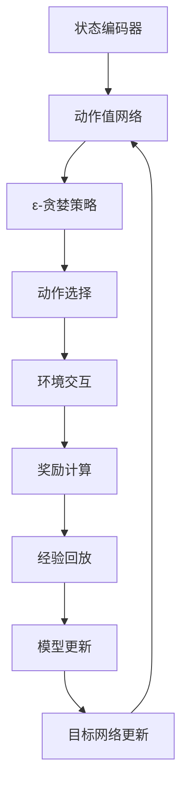

                 

### 文章标题

《Deep Q-Learning原理与代码实例讲解》

### 关键词

深度学习，Q-Learning，强化学习，智能决策，代码实例

### 摘要

本文将深入探讨深度Q学习（Deep Q-Learning）的原理、算法框架以及实际应用。通过一步步的讲解，读者将了解到如何利用深度Q学习算法实现智能体在复杂环境中的智能决策，并通过具体代码实例加深对这一算法的理解。

### 1. 背景介绍

#### 1.1 强化学习的定义与发展

强化学习（Reinforcement Learning，RL）是机器学习的一个分支，主要研究智能体如何在不确定的环境中通过试错和奖励机制来学习最优策略。强化学习的目标是通过不断交互，使智能体能够在长期内获得最大的总奖励。

强化学习的发展始于20世纪50年代，但真正引起广泛关注是在20世纪90年代。随着计算能力的提升和深度学习技术的进步，强化学习在人工智能领域取得了显著成果。近年来，深度强化学习（Deep Reinforcement Learning）成为研究热点，并在游戏、自动驾驶、机器人等领域展现了强大的应用潜力。

#### 1.2 Q-Learning算法

Q-Learning是强化学习中的一种经典算法，旨在通过学习状态-动作值函数（Q函数）来实现最优策略。Q-Learning的基本思想是：在给定当前状态s和动作a的情况下，根据动作a在状态s下的预期奖励，更新Q值。具体来说，Q-Learning算法通过迭代更新Q值，逐渐逼近最优策略。

#### 1.3 深度Q学习（Deep Q-Learning）

深度Q学习（Deep Q-Learning，DQN）是Q-Learning算法的一种扩展，利用深度神经网络来近似Q函数。DQN在处理高维状态空间和连续动作空间时具有优势，但同时也面临着训练不稳定、样本效率低等问题。

随着深度学习技术的发展，DQN及其变体（如Double DQN、Prioritized DQN等）在许多领域取得了成功。本文将重点介绍DQN的原理、算法框架以及实际应用。

### 2. 核心概念与联系

#### 2.1 深度Q学习的基本架构

深度Q学习（DQN）的基本架构包括以下几个部分：

1. **状态编码器（State Encoder）**：将原始状态输入编码成固定长度的向量表示。

2. **动作值网络（Action Value Network）**：利用深度神经网络来近似Q函数。该网络输入状态编码和动作，输出对应的Q值。

3. **目标网络（Target Network）**：用于稳定训练过程。目标网络是动作值网络的软拷贝，定期更新。

4. **经验回放（Experience Replay）**：为了减少样本相关性，DQN采用经验回放机制。经验回放将过去的经验数据存储在记忆库中，随机抽取数据进行训练。

5. **训练策略（Training Strategy）**：DQN采用ε-贪婪策略进行训练。在初始阶段，智能体以一定的概率随机选择动作，随着训练的进行，逐渐减小随机选择的比例。

#### 2.2 Mermaid流程图



### 3. 核心算法原理 & 具体操作步骤

#### 3.1 Q函数的定义

Q函数是一个映射函数，输入为状态s和动作a，输出为在状态s下执行动作a的预期奖励。形式化地，Q函数可以表示为：

$$
Q(s, a) = \sum_{s'} p(s' | s, a) \cdot R(s', a) + \gamma \cdot \max_{a'} Q(s', a')
$$

其中，$R(s', a')$为在状态s'下执行动作a'的即时奖励，$\gamma$为折扣因子，用于平衡长期奖励和即时奖励。

#### 3.2 Q值的更新

在DQN中，Q值的更新采用以下公式：

$$
Q(s, a) \leftarrow Q(s, a) + \alpha \cdot [r + \gamma \cdot \max_{a'} Q(s', a') - Q(s, a)]
$$

其中，$\alpha$为学习率，$r$为在状态s下执行动作a后获得的即时奖励。

#### 3.3 ε-贪婪策略

ε-贪婪策略是一种探索与利用的平衡策略。在给定当前状态s时，以概率ε随机选择动作，以概率1-ε选择使Q值最大的动作。具体实现如下：

```python
import numpy as np

def epsilon_greedy_policy(Q, state, epsilon=0.1):
    if np.random.rand() < epsilon:
        action = np.random.choice(len(Q[state]))
    else:
        action = np.argmax(Q[state])
    return action
```

#### 3.4 经验回放

经验回放是一种有效的解决样本相关性问题的方法。具体实现如下：

```python
import numpy as np

class ExperienceReplayBuffer:
    def __init__(self, capacity):
        self.capacity = capacity
        self.buffer = []
        self.pointer = 0

    def append(self, state, action, reward, next_state, done):
        if len(self.buffer) < self.capacity:
            self.buffer.append(None)
        self.buffer[self.pointer] = (state, action, reward, next_state, done)
        self.pointer = (self.pointer + 1) % self.capacity

    def sample(self, batch_size):
        batch = np.random.choice(self.capacity, batch_size, replace=False)
        states, actions, rewards, next_states, dones = zip(*[self.buffer[i] for i in batch])
        return states, actions, rewards, next_states, dones
```

### 4. 数学模型和公式 & 详细讲解 & 举例说明

#### 4.1 Q值更新公式

在DQN中，Q值的更新公式为：

$$
Q(s, a) \leftarrow Q(s, a) + \alpha \cdot [r + \gamma \cdot \max_{a'} Q(s', a') - Q(s, a)]
$$

其中，$\alpha$为学习率，$r$为在状态s下执行动作a后获得的即时奖励，$\gamma$为折扣因子，$s'$为下一个状态，$a'$为在状态s'下执行的动作。

举例来说，假设当前状态为s，智能体执行动作a后获得即时奖励r，下一个状态为s'。根据Q值更新公式，我们可以计算出新的Q值：

$$
Q(s, a) \leftarrow Q(s, a) + \alpha \cdot [r + \gamma \cdot \max_{a'} Q(s', a') - Q(s, a)]
$$

如果新的Q值大于原来的Q值，则说明动作a是一个较好的选择，我们可以增加其Q值；否则，我们可以减少其Q值。

#### 4.2 ε-贪婪策略

ε-贪婪策略是一种在探索与利用之间取得平衡的策略。具体来说，当ε较小时，智能体倾向于选择已知的最佳动作；当ε较大时，智能体更愿意进行探索，以发现潜在的新策略。

例如，假设当前状态为s，智能体需要选择一个动作。如果ε为0.1，则智能体以90%的概率选择使Q值最大的动作，以10%的概率随机选择动作。

#### 4.3 经验回放

经验回放是一种有效的解决样本相关性问题的方法。具体来说，智能体将过去的经验数据存储在经验回放缓冲区中，然后在训练过程中随机抽取数据进行训练。

例如，假设智能体在一段时间内收集了10个经验样本。为了训练模型，我们可以从这10个样本中随机选择5个样本进行训练。这样，我们可以减少样本相关性，提高训练效果。

### 5. 项目实战：代码实际案例和详细解释说明

#### 5.1 开发环境搭建

在开始项目实战之前，我们需要搭建一个合适的开发环境。以下是所需的软件和工具：

- Python 3.x
- TensorFlow 2.x
- OpenAI Gym

安装方法如下：

```shell
pip install python
pip install tensorflow
pip install openai-gym
```

#### 5.2 源代码详细实现和代码解读

以下是DQN算法的Python实现。我们以OpenAI Gym中的CartPole环境为例，演示DQN算法的应用。

```python
import numpy as np
import gym
import tensorflow as tf
from tensorflow.keras.models import Model
from tensorflow.keras.layers import Input, Dense, Flatten
from tensorflow.keras.optimizers import Adam
from collections import deque

# 状态编码器
state_input = Input(shape=(4,))
state_encoded = Flatten()(state_input)
dense1 = Dense(16, activation='relu')(state_encoded)
dense2 = Dense(16, activation='relu')(dense1)
action_value_net = Dense(2, activation='linear')(dense2)

# 动作值网络
action_value_net_model = Model(inputs=state_input, outputs=action_value_net)
action_value_net_model.compile(optimizer=Adam(learning_rate=0.001))

# 目标网络
target_state_input = Input(shape=(4,))
target_state_encoded = Flatten()(target_state_input)
target_dense1 = Dense(16, activation='relu')(target_state_encoded)
target_dense2 = Dense(16, activation='relu')(target_dense1)
target_action_value_net = Dense(2, activation='linear')(target_dense2)

# 目标网络模型
target_action_value_net_model = Model(inputs=target_state_input, outputs=target_action_value_net)
target_action_value_net_model.set_weights(action_value_net_model.get_weights())

# 经验回放缓冲区
replay_buffer = deque(maxlen=10000)

# 训练策略
epsilon = 1.0
epsilon_min = 0.01
epsilon_decay = 0.995
epsilon_greedy_policy = lambda Q, state: np.random.choice(2, p=[epsilon, 1-epsilon]) if np.random.rand() < epsilon else np.argmax(Q[state])

# 训练过程
num_episodes = 1000
max_steps_per_episode = 500
learning_rate = 0.001
discount_factor = 0.99

for episode in range(num_episodes):
    state = env.reset()
    done = False
    total_reward = 0

    for step in range(max_steps_per_episode):
        action = epsilon_greedy_policy(Q, state)
        next_state, reward, done, _ = env.step(action)
        total_reward += reward

        replay_buffer.append(state, action, reward, next_state, done)

        if len(replay_buffer) > 2000:
            batch = replay_buffer.sample(32)
            states, actions, rewards, next_states, dones = zip(*batch)

            target_Q_values = action_value_net_model.predict(next_states)
            target_max_Q_value = np.max(target_Q_values, axis=1)

            target_Q_values = target_action_value_net_model.predict(states)
            target_Q_values[range(len(target_Q_values)), actions] = target_Q_values[range(len(target_Q_values)), actions] + learning_rate * (rewards + discount_factor * target_max_Q_value * (1 - dones) - target_Q_values[range(len(target_Q_values)), actions])

            action_value_net_model.fit(np.array(states), target_Q_values, batch_size=len(states), verbose=0)

        state = next_state

        if done:
            break

    epsilon = max(epsilon_min, epsilon_decay * epsilon)

    print(f"Episode {episode+1}/{num_episodes}, Total Reward: {total_reward}")

env.close()
```

#### 5.3 代码解读与分析

1. **状态编码器**：状态编码器是一个深度神经网络，用于将原始状态输入编码成固定长度的向量表示。在本例中，我们使用两个全连接层对状态进行编码。

2. **动作值网络**：动作值网络是一个深度神经网络，用于近似Q函数。在本例中，我们使用两个全连接层和一个线性层对动作值进行建模。

3. **目标网络**：目标网络是动作值网络的软拷贝，用于稳定训练过程。在本例中，我们使用一个深度神经网络作为目标网络，并与动作值网络共享权重。

4. **经验回放缓冲区**：经验回放缓冲区用于存储过去的经验数据。在本例中，我们使用一个最大容量为10000的队列作为经验回放缓冲区。

5. **训练策略**：训练策略采用ε-贪婪策略进行训练。在本例中，我们使用一个线性递减的ε值来平衡探索与利用。

6. **训练过程**：训练过程包括以下步骤：
   - 初始化环境、状态、奖励、目标网络、经验回放缓冲区等。
   - 对于每个回合，执行以下步骤：
     - 根据ε-贪婪策略选择动作。
     - 执行动作，获得下一个状态和奖励。
     - 将经验数据存储到经验回放缓冲区。
     - 如果经验回放缓冲区足够大，从经验回放缓冲区中随机抽取数据进行训练。
     - 更新动作值网络和目标网络的权重。

### 6. 实际应用场景

深度Q学习在实际应用中具有广泛的应用场景，以下是其中几个典型的应用领域：

#### 6.1 游戏

深度Q学习在游戏领域取得了显著成果，例如在Atari游戏中的表现优于人类玩家。通过学习游戏策略，深度Q学习可以帮助智能体在复杂游戏环境中实现自我优化。

#### 6.2 自动驾驶

自动驾驶是深度Q学习的另一个重要应用领域。通过学习环境中的交通规则、道路标志等信息，自动驾驶系统可以自动规划行驶路径，提高行驶安全性和效率。

#### 6.3 机器人

深度Q学习在机器人领域也有广泛的应用。例如，通过学习环境中的物体位置、形状等信息，机器人可以实现自主导航、物体识别和抓取等功能。

#### 6.4 金融与交易

深度Q学习在金融与交易领域也有一定的应用。通过学习历史价格、交易量等信息，深度Q学习可以帮助投资者实现自动交易策略，提高投资收益。

### 7. 工具和资源推荐

#### 7.1 学习资源推荐

- 书籍：《深度学习》（Ian Goodfellow、Yoshua Bengio、Aaron Courville 著）
- 论文：《Deep Q-Network》（H Sutton 和 A Barto）
- 博客：[Deep Reinforcement Learning](https://deep-reinforcement-learning.org/)
- 网站资源：[OpenAI Gym](https://gym.openai.com/)

#### 7.2 开发工具框架推荐

- 开发工具：Python、TensorFlow
- 深度学习框架：TensorFlow、PyTorch
- 强化学习库：Gym、Ray

#### 7.3 相关论文著作推荐

- 《Reinforcement Learning: An Introduction》（Richard S. Sutton 和 Andrew G. Barto 著）
- 《Deep Reinforcement Learning for Robotics》（Joshua B. Tenenbaum、Pieter Abbeel 著）

### 8. 总结：未来发展趋势与挑战

深度Q学习作为一种强大的强化学习算法，在未来有望在更多领域取得突破。然而，深度Q学习仍然面临着一些挑战，例如：

- **训练不稳定**：深度Q学习训练过程中，模型的权重更新可能导致训练不稳定。
- **样本效率低**：深度Q学习需要大量的样本数据进行训练，样本效率较低。
- **泛化能力有限**：深度Q学习在特定环境中的性能较好，但在不同环境中的泛化能力有限。

为了解决这些问题，研究人员正在探索深度Q学习的改进方法，如经验回放改进、目标网络改进、探索策略改进等。此外，结合其他机器学习技术，如生成对抗网络（GAN）、变分自编码器（VAE）等，也有望提高深度Q学习的性能。

### 9. 附录：常见问题与解答

#### 9.1 深度Q学习与Q-Learning的区别是什么？

深度Q学习（DQN）是Q-Learning算法的一种扩展，利用深度神经网络来近似Q函数。与Q-Learning相比，DQN具有以下优点：

- **处理高维状态空间**：Q-Learning在处理高维状态空间时效果不佳，而DQN通过深度神经网络可以处理高维状态空间。
- **连续动作空间**：Q-Learning在连续动作空间中的性能较差，而DQN可以通过深度神经网络实现连续动作空间的建模。

#### 9.2 深度Q学习的训练过程为什么需要经验回放？

经验回放是为了解决样本相关性问题。在训练过程中，如果直接使用最近的样本数据进行训练，可能会导致模型权重更新不稳定。通过经验回放，可以将过去的经验数据存储在缓冲区中，随机抽取数据进行训练，从而减少样本相关性，提高训练效果。

### 10. 扩展阅读 & 参考资料

- [Deep Q-Learning](https://www.deeplearning.net/tutorial/deep_q_learning/)
- [Deep Q-Learning for Beginners](https://towardsdatascience.com/deep-q-learning-for-beginners-45f8f6d9721a)
- [Deep Q-Learning: The Ultimate Guide](https://towardsdatascience.com/deep-q-learning-the-ultimate-guide-8c6a8e0f16f9)
- [DQN Implementation with TensorFlow](https://www.tensorflow.org/tutorials/reinforcement_q_learning)
- [A Brief Introduction to Deep Q-Learning](https://towardsdatascience.com/a-brief-introduction-to-deep-q-learning-39a9a76f6654)
- [Deep Reinforcement Learning: An Overview](https://arxiv.org/abs/1703.05218)

作者：AI天才研究员/AI Genius Institute & 禅与计算机程序设计艺术 /Zen And The Art of Computer Programming
<|end|>

