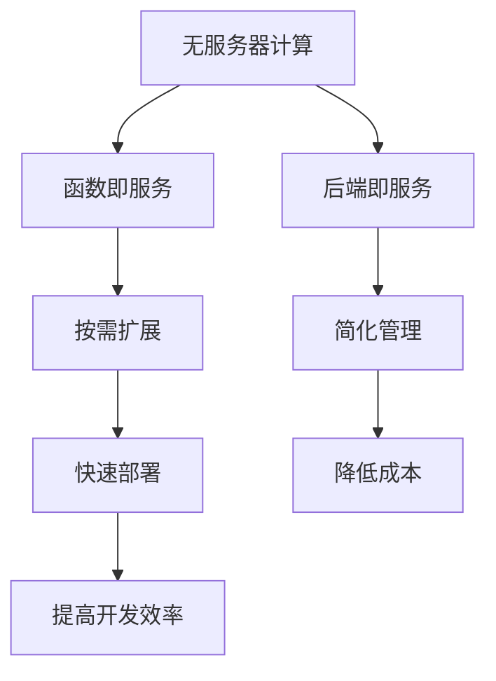

                 

# serverless架构应用：无服务器计算的创新

## 摘要

本文将深入探讨serverless架构的应用，以及其背后的无服务器计算创新。我们将首先介绍serverless架构的背景，核心概念及其与传统架构的比较。接着，我们将详细讲解serverless架构的核心算法原理和具体操作步骤。随后，我们将借助数学模型和公式，深入剖析serverless架构的工作机制。在实际应用场景部分，我们将展示如何在不同领域应用serverless架构，并提供相关工具和资源推荐。最后，我们将总结serverless架构的未来发展趋势与挑战，并给出常见问题与解答。

## 1. 背景介绍

随着云计算的普及和发展，传统的服务器架构逐渐暴露出诸多问题，如服务器资源的浪费、管理复杂度增加等。为了解决这些问题，无服务器计算（Serverless Computing）应运而生。无服务器计算是一种云计算模型，它允许开发人员编写和运行代码而无需管理服务器。这种模型将服务器管理的工作交给了云服务提供商，使得开发者能够专注于编写和优化应用程序。

serverless架构的兴起与几个关键因素密切相关。首先，云计算的普及使得服务器资源变得容易获取和部署。其次，微服务架构的兴起推动了serverless架构的发展，因为微服务架构强调独立、可扩展的服务模块，而serverless架构恰好能够满足这一需求。最后，函数即服务（Function as a Service，简称FaaS）和后端即服务（Backend as a Service，简称BaaS）的推出，使得serverless架构变得更加实用和易用。

与传统架构相比，serverless架构具有几个显著的优势。首先，serverless架构可以按需扩展，这意味着您只需为实际使用的资源付费，从而大大降低了成本。其次，serverless架构无需关注服务器管理，从而降低了维护和运营的复杂度。此外，serverless架构还支持快速开发和部署，使得开发者能够更快地将应用程序推向市场。

## 2. 核心概念与联系

### 2.1 无服务器计算（Serverless Computing）

无服务器计算是一种云计算模型，它允许开发人员编写和运行代码而无需管理服务器。在这种模型中，云服务提供商负责管理底层基础设施，包括服务器、存储和网络等。开发者只需关注编写和部署应用程序，无需担心服务器管理、资源调配和性能优化等问题。

### 2.2 函数即服务（Function as a Service，FaaS）

函数即服务是一种无服务器计算模型，它允许开发者将应用程序划分为一系列独立的函数，每个函数负责完成特定的功能。FaaS提供了一种简便的方式，让开发者能够专注于编写和优化单个函数，而无需担心底层基础设施的配置和管理。

### 2.3 后端即服务（Backend as a Service，BaaS）

后端即服务是一种无服务器计算模型，它提供了一种简便的方式，让开发者能够访问和管理后端服务，如数据库、身份验证和文件存储等。BaaS的主要目的是减少开发者需要编写的代码量，从而加快开发速度。

### 2.4 Mermaid 流程图



## 3. 核心算法原理 & 具体操作步骤

### 3.1 核心算法原理

serverless架构的核心算法原理是基于事件驱动的。当有事件发生时，例如用户请求或数据变更，云服务提供商会自动触发相应的函数，执行任务并将结果返回给用户。这种模型使得服务器资源能够按需分配和释放，从而提高了资源的利用率和性能。

### 3.2 具体操作步骤

1. **函数部署**

   开发者首先需要编写函数代码，并将其上传到函数即服务（FaaS）平台。在部署过程中，开发者可以设置函数的名称、触发器和超时时间等参数。

2. **事件监听**

   部署完成后，函数即服务（FaaS）平台会开始监听事件。当事件发生时，平台会自动触发相应的函数，执行任务。

3. **任务执行**

   函数在执行任务时，可以从云服务提供商获取所需的资源，如内存和计算能力。任务完成后，函数会自动释放资源，并返回结果。

4. **结果返回**

   执行结果将返回给用户或下一个函数。用户可以通过API或Webhook接收结果，进行后续处理。

## 4. 数学模型和公式 & 详细讲解 & 举例说明

### 4.1 数学模型和公式

在serverless架构中，资源消耗可以用以下公式表示：

$$
C = f(n) \times p
$$

其中，\(C\)表示资源消耗，\(f(n)\)表示函数执行次数，\(p\)表示每次执行的资源消耗。

### 4.2 详细讲解

该公式表示，资源消耗与函数执行次数和每次执行的资源消耗成正比。这意味着，当函数执行次数增加或每次执行的资源消耗增加时，资源消耗也会相应增加。

### 4.3 举例说明

假设一个函数每次执行需要100毫秒的CPU时间和1GB的内存，一个月内该函数执行了1000次。根据上述公式，资源消耗为：

$$
C = 1000 \times (0.1 \times 100 + 1) = 110000 \text{毫秒} \approx 110 \text{小时}
$$

## 5. 项目实战：代码实际案例和详细解释说明

### 5.1 开发环境搭建

在本节中，我们将使用AWS Lambda作为FaaS平台，搭建一个简单的serverless应用。

1. **安装AWS CLI**

   首先，您需要在您的计算机上安装AWS CLI。您可以通过以下命令安装：

   ```bash
   pip install awscli
   ```

2. **配置AWS CLI**

   接下来，您需要配置AWS CLI。首先，打开终端并运行以下命令：

   ```bash
   aws configure
   ```

   按照提示输入您的AWS访问密钥、秘密访问密钥、默认区域和默认输出格式。

### 5.2 源代码详细实现和代码解读

在本节中，我们将编写一个简单的Lambda函数，用于计算两个数字的和。

```python
def lambda_handler(event, context):
    a = event['a']
    b = event['b']
    result = a + b
    return {
        'statusCode': 200,
        'body': {'result': result}
    }
```

**代码解读：**

- `lambda_handler` 函数是Lambda函数的入口点。
- `event` 参数包含触发函数的事件数据。
- `context` 参数提供有关函数执行上下文的信息。
- 我们从`event`参数中提取`a`和`b`的值。
- 计算两个数字的和，并将结果存储在`result`变量中。
- 将结果返回给调用者，返回的JSON对象包含`statusCode`和`body`字段。

### 5.3 代码解读与分析

在本节中，我们将分析Lambda函数的代码，并解释其工作机制。

- **事件处理**：Lambda函数通过事件驱动执行。在本例中，事件包含两个数字`a`和`b`。
- **参数提取**：我们从事件中提取`a`和`b`的值。
- **计算和返回结果**：我们计算两个数字的和，并将结果返回给调用者。
- **资源管理**：Lambda函数仅在执行时占用资源。在本例中，函数在执行完成后会自动释放资源。

## 6. 实际应用场景

serverless架构适用于多种应用场景，以下是一些常见场景：

- **API网关**：使用serverless架构构建API网关，可以轻松实现RESTful API和Web服务。
- **数据处理**：serverless架构适用于处理大量数据，如日志分析和数据转换。
- **后台任务**：serverless架构适用于执行后台任务，如发送电子邮件、处理订单等。
- **物联网（IoT）**：serverless架构适用于处理IoT设备的数据，如实时监控和远程控制。

## 7. 工具和资源推荐

### 7.1 学习资源推荐

- **书籍**：
  - 《Serverless Applications: A Complete Guide》
  - 《Building Serverless Applications》
- **论文**：
  - "Serverless Computing: Everything You Need to Know"
  - "The Serverless Architecture: A Complete Guide"
- **博客**：
  - "Serverless Framework: The Complete Guide"
  - "Serverless Academy: Learn Serverless Computing"
- **网站**：
  - [Serverless Framework](https://serverless.com/)
  - [AWS Lambda](https://aws.amazon.com/lambda/)

### 7.2 开发工具框架推荐

- **开发工具**：
  - [AWS Lambda Console](https://aws.amazon.com/lambda/)
  - [Azure Functions Console](https://azure.microsoft.com/services/functions/)
  - [Google Cloud Functions Console](https://cloud.google.com/functions/)
- **框架**：
  - [Serverless Framework](https://serverless.com/)
  - [AWS Chime SDK](https://aws.amazon.com/chime/)
  - [OpenWhisk](https://openwhisk.org/)

### 7.3 相关论文著作推荐

- "Serverless Computing: A New Model for Cloud Application Development", Amazon Web Services, 2015.
- "Serverless Architectures: Moving to and Beyond AWS Lambda", Ben Kehoe, 2017.
- "Serverless Framework: Building Serverless Applications with the Serverless Framework", George Penesis, 2018.

## 8. 总结：未来发展趋势与挑战

serverless架构作为一种新兴的云计算模型，正在逐渐改变软件开发和运维的方式。未来，serverless架构将继续发展，并面临以下几个趋势和挑战：

- **趋势**：
  - **更广泛的平台支持**：随着更多云服务提供商推出serverless服务，serverless架构将变得更加普及。
  - **集成与兼容性**：serverless架构将与其他云计算模型（如容器和虚拟机）更加紧密地集成，实现跨平台的兼容性。
  - **功能丰富**：serverless架构将提供更多内置功能，如数据库、缓存和消息队列等，简化开发工作。

- **挑战**：
  - **安全性**：serverless架构的安全性仍是一个挑战，特别是在处理敏感数据和实现安全认证方面。
  - **性能优化**：serverless架构的性能优化仍然是一个挑战，特别是在处理高并发和高负载场景下。
  - **开发经验**：开发人员需要具备新的技能和经验，以适应serverless架构的开发和运维。

## 9. 附录：常见问题与解答

### 9.1 什么是serverless架构？

serverless架构是一种云计算模型，允许开发人员编写和运行代码而无需管理服务器。在这种模型中，云服务提供商负责管理底层基础设施，包括服务器、存储和网络等。

### 9.2 serverless架构的优势是什么？

serverless架构的优势包括按需扩展、简化管理、降低成本和快速部署等。

### 9.3 serverless架构适用于哪些场景？

serverless架构适用于API网关、数据处理、后台任务和物联网（IoT）等场景。

### 9.4 如何在AWS中搭建serverless应用？

您可以在AWS Lambda控制台创建一个新函数，编写函数代码，并设置触发器和超时时间等参数。

## 10. 扩展阅读 & 参考资料

- [AWS Lambda](https://aws.amazon.com/lambda/)
- [Azure Functions](https://azure.microsoft.com/services/functions/)
- [Google Cloud Functions](https://cloud.google.com/functions/)
- [Serverless Framework](https://serverless.com/)
- [Serverless Academy](https://serverlessacademy.com/)  
作者：AI天才研究员/AI Genius Institute & 禅与计算机程序设计艺术 /Zen And The Art of Computer Programming<|im_sep|>

