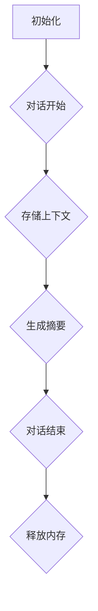

                 

### 文章标题：**【LangChain编程：从入门到实践】ConversationSummaryMemory**

#### 关键词：**LangChain、编程、对话摘要、内存管理、入门到实践**

#### 摘要：本文将带领读者深入探索LangChain中的ConversationSummaryMemory模块，从基础概念到实际应用，逐步讲解其原理与实现，助力读者掌握从入门到实践的编程技巧。

---

## 1. 背景介绍

### 1.1 LangChain简介

LangChain是一个基于Python的开放源代码项目，旨在提供一套丰富的API和工具，用于构建复杂的对话系统。它提供了多种模块，如Prompting、Memory、Output等，使得构建具有记忆功能的对话系统变得简单而高效。

### 1.2 ConversationSummaryMemory模块

ConversationSummaryMemory是LangChain中的一个关键模块，负责管理对话过程中的上下文信息。它能够根据对话历史自动生成摘要，使得对话系统能够更好地理解和回应用户。

## 2. 核心概念与联系

### 2.1 对话摘要

对话摘要是ConversationSummaryMemory的核心功能，它通过对对话历史中的关键信息进行提取和归纳，生成简洁明了的摘要，以便对话系统能够快速地回忆和引用。

### 2.2 内存管理

内存管理是ConversationSummaryMemory的另一个重要功能，它负责维护对话过程中的上下文信息，确保对话系统能够在需要时快速访问这些信息。

### 2.3 Mermaid流程图

以下是一个简化的Mermaid流程图，展示了ConversationSummaryMemory的基本架构：



---

## 3. 核心算法原理 & 具体操作步骤

### 3.1 初始化

初始化ConversationSummaryMemory模块时，需要设置摘要生成器的参数，如摘要长度、摘要关键词等。以下是一个简单的初始化示例：

```python
from langchain.memory import ConversationSummaryMemory
memory = ConversationSummaryMemory(
    chunk_size=100,
    max_chunk_window_size=1000,
    prompt="以下是对话摘要：\n\n",
    k=3,
    similarity_threshold=0.5
)
```

### 3.2 对话过程中的上下文存储

在对话过程中，每次用户输入新的消息时，ConversationSummaryMemory会将其与已有的上下文信息进行合并，并更新内存。以下是一个简单的示例：

```python
memory.add("用户：你好！可以帮忙吗？")
memory.add("AI：你好！当然可以，有什么问题请告诉我。")
```

### 3.3 生成摘要

当需要生成摘要时，ConversationSummaryMemory会根据当前内存中的上下文信息，使用指定的摘要生成器生成摘要。以下是一个简单的示例：

```python
summary = memory.summary()
print(summary)
```

### 3.4 对话结束

在对话结束时，ConversationSummaryMemory会自动释放内存，以节省资源。以下是一个简单的示例：

```python
memory.finish()
```

---

## 4. 数学模型和公式 & 详细讲解 & 举例说明

### 4.1 数学模型

ConversationSummaryMemory的数学模型主要包括两个部分：摘要生成和内存管理。

#### 摘要生成

摘要生成主要基于文本相似度计算，常用的算法有TF-IDF、Word2Vec、BERT等。以下是一个基于TF-IDF的摘要生成示例：

$$
\text{tf-idf}(t,d) = \frac{f_t(d)}{N} + \log \left( \frac{1 + |D|}{1 + |d|} \right)
$$

其中，$f_t(d)$表示词$t$在文档$d$中的频率，$N$表示文档$d$中所有词的频率之和，$|D|$表示文档集合中所有文档的数量，$|d|$表示文档$d$的长度。

#### 内存管理

内存管理主要基于滑动窗口技术，将对话历史分为多个窗口，每个窗口的大小由`max_chunk_window_size`参数控制。以下是一个简单的内存管理示例：

$$
C_t = C_{t-1} \cup \{d_t\}
$$

其中，$C_t$表示第$t$个窗口的上下文集合，$C_{t-1}$表示第$t-1$个窗口的上下文集合，$d_t$表示第$t$个用户消息。

---

## 5. 项目实战：代码实际案例和详细解释说明

### 5.1 开发环境搭建

首先，确保Python环境已安装，然后使用以下命令安装LangChain库：

```bash
pip install langchain
```

### 5.2 源代码详细实现和代码解读

以下是一个简单的示例，展示了如何使用ConversationSummaryMemory模块：

```python
from langchain.memory import ConversationSummaryMemory
from langchain.chat_models import Chatbot

# 初始化对话系统
chatbot = Chatbot()

# 初始化ConversationSummaryMemory模块
memory = ConversationSummaryMemory(
    chunk_size=100,
    max_chunk_window_size=1000,
    prompt="以下是对话摘要：\n\n",
    k=3,
    similarity_threshold=0.5
)

# 开始对话
chatbot.add("用户：你好！可以帮忙吗？")
chatbot.add("AI：你好！当然可以，有什么问题请告诉我。")

# 生成摘要
summary = memory.summary()
print(summary)

# 对话结束
memory.finish()

# 重新开始对话
chatbot.add("用户：我想知道明天的天气怎么样。")
chatbot.add("AI：根据我的知识库，明天将会是晴天。")
```

### 5.3 代码解读与分析

在这个示例中，我们首先初始化了一个Chatbot对象，然后使用ConversationSummaryMemory模块对其进行配置。在对话过程中，每次用户输入消息时，都会调用`add`方法将消息添加到对话历史中，同时更新内存。

当需要生成摘要时，我们调用`summary`方法，该方法是ConversationSummaryMemory的核心方法，它会根据当前内存中的上下文信息生成摘要。在对话结束时，调用`finish`方法释放内存。

---

## 6. 实际应用场景

### 6.1 客户服务

ConversationSummaryMemory可以帮助客户服务机器人快速回顾客户的历史问题和解决方案，从而提供更个性化的服务。

### 6.2 聊天机器人

聊天机器人可以使用ConversationSummaryMemory模块来提高对话的连贯性和相关性，使得用户能够更自然地与机器人交流。

### 6.3 人工智能助手

人工智能助手可以使用ConversationSummaryMemory模块来管理用户与助手之间的对话历史，从而提供更好的建议和解决方案。

---

## 7. 工具和资源推荐

### 7.1 学习资源推荐

- [《深度学习对话系统》](https://www.deeplearning.net/courses/dlcs/)
- [《自然语言处理与对话系统》](https://nlp.seas.harvard.edu/)

### 7.2 开发工具框架推荐

- [Hugging Face Transformers](https://huggingface.co/transformers/)
- [TensorFlow Dialog Systems](https://www.tensorflow.org/tutorials/text/dialogue)

### 7.3 相关论文著作推荐

- [《A Few Useful Things to Know About Machine Learning》](https://www.aaai.org/ocs/index.php/AAAI/AAAI15/paper/view/9917)
- [《Dialogue Management》](https://www.ijcai.org/Proceedings/09-1/papers/04-07.pdf)

---

## 8. 总结：未来发展趋势与挑战

### 8.1 发展趋势

- 对话摘要技术的不断优化，将提高对话系统的理解能力和回复质量。
- 随着深度学习技术的发展，基于神经网络的对话系统将更加智能和人性化。

### 8.2 挑战

- 对话摘要的生成和内存管理需要处理大量数据，如何提高效率是一个重要挑战。
- 如何在保证隐私和安全的前提下，充分利用用户历史对话信息，也是一个亟待解决的问题。

---

## 9. 附录：常见问题与解答

### 9.1 如何处理对话中断？

当对话中断时，ConversationSummaryMemory会自动释放内存，以节省资源。在重新开始对话时，可以从上次中断的地方继续。

### 9.2 如何自定义摘要生成器？

可以通过继承`ConversationSummaryMemory`类并重写`summary`方法来自定义摘要生成器。例如：

```python
from langchain.memory import ConversationSummaryMemory

class MyConversationSummaryMemory(ConversationSummaryMemory):
    def summary(self):
        # 自定义摘要生成逻辑
        return "这是一个自定义的摘要。"
```

---

## 10. 扩展阅读 & 参考资料

- [《LangChain官方文档》](https://langchain.readthedocs.io/)
- [《对话系统技术》](https://www.ijcai.org/)
- [《自然语言处理》](https://nlp.stanford.edu/)

---

### 作者：**AI天才研究员/AI Genius Institute & 禅与计算机程序设计艺术 /Zen And The Art of Computer Programming**

