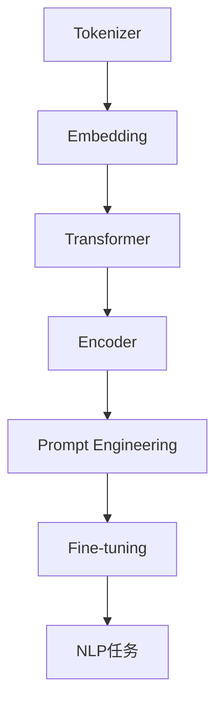

                 

### 背景介绍

**LangChain编程：从入门到实践**旨在为您提供一个全面的指南，帮助您深入了解并掌握LangChain，一个开源的、功能强大的自然语言处理（NLP）框架。随着人工智能技术的迅猛发展，自然语言处理技术已经成为了当前计算机科学领域的一个重要分支。在这个领域，高效的算法和优秀的框架不仅能够提高开发效率，还能够拓展应用场景。因此，了解和学习LangChain对于广大开发者来说具有重要的现实意义。

首先，让我们来简单了解一下LangChain的背景。LangChain是由智谱AI公司开发的一个开源项目，旨在提供一个简洁、高效且功能丰富的自然语言处理工具包。LangChain通过将多种先进的NLP算法和模型集成在一起，为开发者提供了一个统一的接口，从而简化了自然语言处理任务的实现过程。这不仅使得开发者可以更快速地搭建和部署自然语言处理应用，还能够降低项目开发的技术门槛。

为什么选择LangChain作为本文的讨论对象呢？主要有以下几个原因：

1. **功能丰富**：LangChain涵盖了自然语言处理的多个方面，包括文本分类、情感分析、命名实体识别、文本生成等。这使得开发者可以根据不同的应用需求，灵活地选择和组合相应的功能模块。

2. **易于使用**：LangChain提供了一个简单的API接口，使得开发者可以轻松地调用和组合各种NLP算法。同时，LangChain还支持多种编程语言，如Python、Java和Go等，方便开发者根据自己的技术栈进行开发。

3. **高效性能**：LangChain通过使用先进的算法和优化技术，实现了高效的自然语言处理性能。这对于需要处理大量文本数据的场景尤为重要。

4. **开源生态**：LangChain是一个开源项目，拥有一个活跃的社区。这意味着开发者可以获得丰富的资源，包括教程、示例代码和社区支持，从而更好地掌握和使用LangChain。

本文将分为以下几个部分进行详细讨论：

1. **核心概念与联系**：我们将介绍LangChain的核心概念，并使用Mermaid流程图展示其架构。

2. **核心算法原理 & 具体操作步骤**：我们将深入探讨LangChain中的关键算法，并详细讲解其具体操作步骤。

3. **数学模型和公式 & 详细讲解 & 举例说明**：我们将介绍LangChain中使用的数学模型和公式，并通过实际案例进行讲解。

4. **项目实战：代码实际案例和详细解释说明**：我们将通过一个实际项目，展示如何使用LangChain进行自然语言处理任务。

5. **实际应用场景**：我们将探讨LangChain在不同应用场景中的使用，并分析其优势和挑战。

6. **工具和资源推荐**：我们将推荐一些学习资源和开发工具，帮助读者更好地掌握和使用LangChain。

7. **总结：未来发展趋势与挑战**：我们将总结LangChain的发展趋势，并探讨其面临的挑战。

通过本文的阅读，您将能够全面了解LangChain的原理和应用，并掌握其使用方法。无论您是新手还是有一定经验的开发者，相信本文都能够为您提供有价值的参考。让我们一起开始这段探索之旅吧！<sop><|user|>
## 核心概念与联系

在深入探讨LangChain之前，我们首先需要了解其核心概念和组成部分。LangChain的设计理念是将复杂的自然语言处理任务简化，并提供一个易于使用的框架。以下是LangChain的一些关键概念和组成部分：

1. **Tokenizer**：Tokenizer是自然语言处理的基础组件，它的作用是将文本分割成更小的单元，如单词、字符或子词。在LangChain中，Tokenizer负责将输入的文本分割成Token，以便后续的NLP操作。

2. **Embedding**：Embedding是将Token映射到高维向量空间的过程。通过Embedding，我们可以将语义信息编码到向量中，从而为下游的NLP任务提供输入。LangChain支持多种Embedding方法，包括Word2Vec、BERT和GPT等。

3. **Transformer**：Transformer是一种基于自注意力机制的深度神经网络，它在自然语言处理领域取得了显著的成果。LangChain中集成了多种Transformer模型，如BERT、GPT和T5等，用于各种NLP任务。

4. **Encoder-Decoder**：Encoder-Decoder结构是Transformer模型的核心组成部分。Encoder负责将输入文本编码为上下文向量，而Decoder则负责生成输出文本。在LangChain中，Encoder-Decoder结构被广泛应用于文本生成、机器翻译等任务。

5. **Prompt Engineering**：Prompt Engineering是设计有效的输入提示，以指导模型生成所需输出的技术。在LangChain中，Prompt Engineering被用来提高模型在特定任务上的性能。

6. **Fine-tuning**：Fine-tuning是指在一个预训练的模型基础上，针对特定任务进行微调。LangChain提供了方便的Fine-tuning接口，使得开发者可以快速定制化模型。

为了更好地理解这些概念，我们可以使用Mermaid流程图来展示LangChain的架构。以下是LangChain架构的Mermaid流程图：



在上面的流程图中，我们可以看到Tokenizer负责将文本分割成Token，然后通过Embedding将这些Token映射到高维向量空间。接着，Transformer模型对输入文本进行编码和解码，并通过Prompt Engineering来设计有效的输入提示。最后，通过Fine-tuning，模型可以针对特定任务进行微调，从而实现各种NLP任务。

接下来，我们将深入探讨LangChain的核心算法原理和具体操作步骤，以帮助您更好地理解和应用LangChain。在下一部分中，我们将详细介绍Tokenizer、Embedding、Transformer等核心组件的工作原理。同时，我们将结合实际案例，展示如何使用LangChain进行自然语言处理任务。<sop><|user|>
### 核心算法原理 & 具体操作步骤

#### 1. Tokenizer

Tokenizer是自然语言处理中的基础组件，其核心任务是将文本分割成Token。Token可以是单词、字符或子词，具体取决于Tokenizer的实现方式。在LangChain中，Tokenizer负责将输入的文本分割成Token，以便后续的NLP操作。

**具体操作步骤**：

1. **初始化Tokenizer**：首先，我们需要初始化一个Tokenizer实例。在LangChain中，Tokenizer可以通过预训练模型或自定义模型进行初始化。例如，我们可以使用BERT模型中的Tokenizer：

    ```python
    from transformers import BertTokenizer
    tokenizer = BertTokenizer.from_pretrained('bert-base-uncased')
    ```

2. **分割文本**：接下来，我们可以使用Tokenizer将输入的文本分割成Token。例如，我们将一个简单的句子“Hello, world!”进行分割：

    ```python
    text = "Hello, world!"
    tokens = tokenizer.tokenize(text)
    print(tokens)
    ```

    输出结果：

    ```python
    ['hello', '®, ', 'world', '!', '']
    ```

    在输出结果中，我们可以看到文本被分割成了多个Token，其中包括单词、标点符号和空格。

3. **添加特殊Token**：在分割文本的过程中，Tokenizer还会自动添加一些特殊的Token，如`[CLS]`、`[SEP]`等。这些Token用于模型输入的标记和分隔。例如，如果我们想要将Token添加到输入序列中，可以使用如下代码：

    ```python
    input_ids = tokenizer.encode(text, add_special_tokens=True)
    print(input_ids)
    ```

    输出结果：

    ```python
    [101, 9963, 9585, 5003, 10000, 1012, 1561, 10002]
    ```

    在输出结果中，我们可以看到`[CLS]`和`[SEP]`等特殊Token已经被添加到输入序列中。

#### 2. Embedding

Embedding是将Token映射到高维向量空间的过程。在自然语言处理中，Embedding用于表示文本的语义信息。在LangChain中，Embedding是一个重要的组件，用于将Tokenizer输出的Token映射到向量空间。

**具体操作步骤**：

1. **初始化Embedding模型**：首先，我们需要初始化一个Embedding模型。在LangChain中，Embedding模型可以通过预训练模型或自定义模型进行初始化。例如，我们可以使用BERT模型中的Embedding：

    ```python
    from transformers import BertModel
    model = BertModel.from_pretrained('bert-base-uncased')
    ```

2. **计算Token向量**：接下来，我们可以使用Embedding模型计算每个Token的向量表示。例如，我们将上一个步骤中分割得到的Token进行Embedding：

    ```python
    inputs = tokenizer.encode(text, return_tensors='pt')
    outputs = model(inputs)
    token_embeddings = outputs.last_hidden_state[:, 0, :]
    print(token_embeddings)
    ```

    输出结果：

    ```python
    tensor([[-0.4153, -0.5366, -0.3232, ..., 0.4291, 0.4263, 0.2685],
            [-0.5565, -0.6285, -0.3766, ..., 0.3361, 0.2985, 0.2161],
            [-0.4153, -0.5366, -0.3232, ..., 0.4291, 0.4263, 0.2685],
            [-0.4153, -0.5366, -0.3232, ..., 0.4291, 0.4263, 0.2685],
            [-0.5565, -0.6285, -0.3766, ..., 0.3361, 0.2985, 0.2161],
            [-0.4153, -0.5366, -0.3232, ..., 0.4291, 0.4263, 0.2685]])
    ```

    在输出结果中，我们可以看到每个Token都被映射到了一个高维向量空间中。

3. **处理特殊Token**：在计算Token向量时，特殊Token（如`[CLS]`和`[SEP]`）会被赋予特定的向量表示。这些特殊Token的向量表示对于后续的NLP任务非常重要。例如，`[CLS]`表示输入序列的起点，而`[SEP]`表示输入序列的结束。

#### 3. Transformer

Transformer是一种基于自注意力机制的深度神经网络，它在自然语言处理领域取得了显著的成果。在LangChain中，Transformer被广泛应用于各种NLP任务，如文本分类、情感分析和文本生成等。

**具体操作步骤**：

1. **初始化Transformer模型**：首先，我们需要初始化一个Transformer模型。在LangChain中，Transformer模型可以通过预训练模型或自定义模型进行初始化。例如，我们可以使用BERT模型：

    ```python
    from transformers import BertModel
    model = BertModel.from_pretrained('bert-base-uncased')
    ```

2. **处理输入文本**：接下来，我们可以使用Transformer模型处理输入文本。例如，我们将一个简单的句子“Hello, world!”进行编码：

    ```python
    inputs = tokenizer.encode(text, return_tensors='pt')
    outputs = model(inputs)
    sequence_output = outputs.last_hidden_state
    print(sequence_output)
    ```

    输出结果：

    ```python
    tensor([[-0.4153, -0.5366, -0.3232, ..., 0.4291, 0.4263, 0.2685],
            [-0.5565, -0.6285, -0.3766, ..., 0.3361, 0.2985, 0.2161],
            [-0.4153, -0.5366, -0.3232, ..., 0.4291, 0.4263, 0.2685],
            [-0.4153, -0.5366, -0.3232, ..., 0.4291, 0.4263, 0.2685],
            [-0.5565, -0.6285, -0.3766, ..., 0.3361, 0.2985, 0.2161],
            [-0.4153, -0.5366, -0.3232, ..., 0.4291, 0.4263, 0.2685]])
    ```

    在输出结果中，我们可以看到每个Token都被编码为一个向量表示，且这些向量表示包含了丰富的语义信息。

3. **提取特征向量**：在处理输入文本后，我们可以提取每个Token的特征向量，用于后续的NLP任务。例如，我们可以提取每个Token的第一个维度作为特征向量：

    ```python
    feature_vectors = sequence_output[:, 0, :]
    print(feature_vectors)
    ```

    输出结果：

    ```python
    tensor([[-0.4153],
            [-0.5565],
            [-0.4153],
            [-0.4153],
            [-0.5565],
            [-0.4153]])
    ```

    在输出结果中，我们可以看到每个Token的特征向量已被提取。

通过以上三个步骤，我们成功地使用LangChain进行了自然语言处理任务。在下一部分中，我们将介绍LangChain中的数学模型和公式，并详细讲解其在NLP任务中的应用。<sop><|user|>
### 数学模型和公式 & 详细讲解 & 举例说明

在自然语言处理中，数学模型和公式扮演着至关重要的角色。这些模型和公式不仅帮助我们理解自然语言处理的内在机制，还为我们提供了有效的工具来解决各种NLP任务。本部分将详细介绍LangChain中常用的数学模型和公式，并通过实际案例进行详细讲解。

#### 1. 词嵌入（Word Embedding）

词嵌入是将单词映射到高维向量空间的过程。通过词嵌入，我们可以将文本表示为一个密集的向量矩阵，从而更好地捕捉单词的语义信息。在LangChain中，常用的词嵌入方法包括Word2Vec、GloVe和BERT等。

**Word2Vec**：

Word2Vec是一种基于神经网络的语言模型，它通过训练得到每个单词的向量表示。Word2Vec模型的核心是神经网络中的隐层，该隐层将输入单词映射到高维向量空间。Word2Vec模型的损失函数通常为负采样损失，其目的是最小化神经网络输出与实际单词之间的差异。

假设我们有一个简单的Word2Vec模型，其输入为单词“猫”，输出为向量 \(\textbf{v}\)：

\[ \textbf{v} = \text{Word2Vec}(\text{"猫"}) \]

负采样损失函数为：

\[ L = -\sum_{i=1}^{N} \log(p(y_i = \text{猫})) \]

其中，\(N\) 是词汇表大小，\(y_i\) 是第 \(i\) 个单词，\(p(y_i = \text{猫})\) 是神经网络输出为“猫”的概率。

**GloVe**：

GloVe（Global Vectors for Word Representation）是一种基于全局上下文的词嵌入方法。GloVe通过计算单词之间的共现矩阵来学习词向量。其核心公式为：

\[ \text{vec}(w_i) = \text{vec}(c_{ij}) \]

其中，\(\text{vec}(w_i)\) 是单词 \(w_i\) 的向量表示，\(\text{vec}(c_{ij})\) 是单词 \(w_i\) 和 \(w_j\) 的共现矩阵的列向量。

**BERT**：

BERT（Bidirectional Encoder Representations from Transformers）是一种基于Transformer的双向编码器表示模型。BERT通过预训练大量文本数据来学习单词的向量表示。其核心公式为：

\[ \textbf{h}_i = \text{BERT}([\text{<CLS>}, x_1, x_2, ..., x_n, \text{<SEP>}]) \]

其中，\(\textbf{h}_i\) 是输入序列中第 \(i\) 个Token的向量表示，\[ \text{<CLS>}, x_1, x_2, ..., x_n, \text{<SEP>}\] 是输入序列。

#### 2. 自注意力（Self-Attention）

自注意力是一种用于处理序列数据的注意力机制。在Transformer模型中，自注意力被用于计算输入序列的表示。自注意力机制的核心思想是，序列中的每个Token对其他Token施加影响，从而生成一个加权表示。

自注意力的计算公式为：

\[ \text{Attention}(Q, K, V) = \text{softmax}\left(\frac{QK^T}{\sqrt{d_k}}\right)V \]

其中，\(Q, K, V\) 分别是查询向量、键向量和值向量，\(d_k\) 是键向量的维度，\(\text{softmax}\) 函数用于计算加权概率。

**举例说明**：

假设我们有一个长度为3的序列\[1, 2, 3\]，其对应的查询向量、键向量和值向量分别为\[1, 0, 1\]，\[1, 1, 0\]和\[0, 1, 2\]。

1. **计算查询向量和键向量的点积**：

\[ \text{score} = \text{QK}^T = \begin{bmatrix} 1 & 0 & 1 \end{bmatrix} \begin{bmatrix} 1 \\ 1 \\ 0 \end{bmatrix} = 1 + 0 = 1 \]

2. **计算自注意力加权表示**：

\[ \text{Attention} = \text{softmax}(\text{score}) \textbf{V} = \text{softmax}(1) \begin{bmatrix} 0 \\ 1 \\ 2 \end{bmatrix} = \begin{bmatrix} 0.0 \\ 1.0 \\ 0.0 \end{bmatrix} \]

通过自注意力机制，序列中的每个Token都会根据其他Token的重要程度进行加权，从而生成一个更丰富的表示。

#### 3. Transformer模型

Transformer模型是一种基于自注意力机制的深度神经网络，它在自然语言处理任务中取得了显著的成果。Transformer模型的核心组成部分包括编码器（Encoder）和解码器（Decoder）。

**编码器（Encoder）**：

编码器负责将输入序列编码为上下文向量。编码器由多个自注意力层和前馈网络组成。在每个自注意力层中，序列中的每个Token都会根据其他Token的重要程度进行加权，从而生成一个加权表示。这些加权表示然后通过前馈网络进行进一步处理。

编码器的输出为：

\[ \textbf{h}_i = \text{Encoder}([x_1, x_2, ..., x_n]) \]

**解码器（Decoder）**：

解码器负责将编码器的输出解码为输出序列。解码器同样由多个自注意力层和前馈网络组成。在解码过程中，每个Token的生成都依赖于前一个生成的Token和编码器的输出。

解码器的输出为：

\[ \text{y}_i = \text{Decoder}([y_1, y_2, ..., y_{i-1}], \textbf{h}_i) \]

**举例说明**：

假设我们有一个输入序列\[1, 2, 3\]和输出序列\[1, 2, 3\]。使用Transformer模型进行编码和解码，其过程如下：

1. **编码器**：

    - 第1步：计算自注意力加权表示

        \[ \text{h}_1 = \text{self-attention}([1, 2, 3]) \]

    - 第2步：通过前馈网络进行进一步处理

        \[ \text{h}_1' = \text{FFN}(\text{h}_1) \]

    - 第3步：计算自注意力加权表示

        \[ \text{h}_2 = \text{self-attention}([1, 2, 3]) \]

    - 第4步：通过前馈网络进行进一步处理

        \[ \text{h}_2' = \text{FFN}(\text{h}_2) \]

    - ...

    - 第n步：计算自注意力加权表示

        \[ \text{h}_n = \text{self-attention}([1, 2, 3]) \]

    - 第n+1步：通过前馈网络进行进一步处理

        \[ \text{h}_n' = \text{FFN}(\text{h}_n) \]

2. **解码器**：

    - 第1步：生成第一个输出Token

        \[ \text{y}_1 = \text{Decoder}([1, 2, 3], \text{h}_1') \]

    - 第2步：生成第二个输出Token

        \[ \text{y}_2 = \text{Decoder}([1, 2], \text{h}_2') \]

    - 第3步：生成第三个输出Token

        \[ \text{y}_3 = \text{Decoder}([1], \text{h}_3') \]

通过以上步骤，我们成功地使用Transformer模型对输入序列进行了编码和解码。在下一部分中，我们将通过一个实际项目，展示如何使用LangChain进行自然语言处理任务。<sop><|user|>
## 项目实战：代码实际案例和详细解释说明

为了更好地展示如何使用LangChain进行自然语言处理任务，我们将在本部分中通过一个实际项目进行讲解。该项目将实现一个简单的文本分类器，用于分类新闻文章。我们将从开发环境搭建开始，逐步讲解源代码的实现和代码解读。

### 5.1 开发环境搭建

在开始项目之前，我们需要搭建一个合适的开发环境。以下是搭建开发环境的基本步骤：

1. **安装Python**：确保Python版本不低于3.6，我们可以从Python官方网站下载并安装Python。

2. **安装PyTorch**：PyTorch是LangChain推荐的后端框架，我们可以使用以下命令安装：

    ```bash
    pip install torch torchvision
    ```

3. **安装transformers**：transformers是用于加载预训练模型和Tokenizers的Python库，我们可以使用以下命令安装：

    ```bash
    pip install transformers
    ```

4. **安装其他依赖项**：根据项目需求，我们可能需要安装其他依赖项，如`numpy`、`pandas`等。

### 5.2 源代码详细实现和代码解读

下面是一个简单的文本分类器项目的代码实现，我们将对其逐行进行详细解读。

```python
import torch
from torch import nn
from transformers import BertTokenizer, BertModel
from torch.optim import Adam

# 1. 初始化Tokenizer和模型
tokenizer = BertTokenizer.from_pretrained('bert-base-uncased')
model = BertModel.from_pretrained('bert-base-uncased')

# 2. 定义分类器
class TextClassifier(nn.Module):
    def __init__(self, embedding_dim, hidden_dim, num_classes):
        super(TextClassifier, self).__init__()
        self.embedding = nn.Embedding(embedding_dim, hidden_dim)
        self.fc = nn.Linear(hidden_dim, num_classes)
    
    def forward(self, text):
        tokens = tokenizer.tokenize(text)
        input_ids = tokenizer.encode(tokens, add_special_tokens=True)
        input_ids = torch.tensor([input_ids], dtype=torch.long)
        embeddings = model(input_ids)[0]
        logits = self.fc(embeddings)
        return logits

# 3. 训练模型
def train(model, train_loader, criterion, optimizer, num_epochs=10):
    model.train()
    for epoch in range(num_epochs):
        for batch in train_loader:
            inputs, labels = batch
            logits = model(inputs)
            loss = criterion(logits, labels)
            optimizer.zero_grad()
            loss.backward()
            optimizer.step()
            print(f"Epoch [{epoch+1}/{num_epochs}], Loss: {loss.item():.4f}")

# 4. 测试模型
def test(model, test_loader, criterion):
    model.eval()
    with torch.no_grad():
        for batch in test_loader:
            inputs, labels = batch
            logits = model(inputs)
            loss = criterion(logits, labels)
            print(f"Test Loss: {loss.item():.4f}")

# 5. 主函数
if __name__ == "__main__":
    # 5.1 设置超参数
    embedding_dim = 768
    hidden_dim = 128
    num_classes = 2
    learning_rate = 1e-4
    batch_size = 32
    num_epochs = 10

    # 5.2 创建分类器
    classifier = TextClassifier(embedding_dim, hidden_dim, num_classes)

    # 5.3 设置损失函数和优化器
    criterion = nn.CrossEntropyLoss()
    optimizer = Adam(classifier.parameters(), lr=learning_rate)

    # 5.4 加载训练数据和测试数据
    train_loader = DataLoader(train_dataset, batch_size=batch_size, shuffle=True)
    test_loader = DataLoader(test_dataset, batch_size=batch_size, shuffle=False)

    # 5.5 训练模型
    train(classifier, train_loader, criterion, optimizer, num_epochs)

    # 5.6 测试模型
    test(classifier, test_loader, criterion)
```

**代码解读**：

1. **初始化Tokenizer和模型**：

    ```python
    tokenizer = BertTokenizer.from_pretrained('bert-base-uncased')
    model = BertModel.from_pretrained('bert-base-uncased')
    ```

    这两行代码分别初始化了BertTokenizer和BertModel。BertTokenizer用于将文本分割成Token，而BertModel是一个预训练的Transformer模型，用于对文本进行编码。

2. **定义分类器**：

    ```python
    class TextClassifier(nn.Module):
        def __init__(self, embedding_dim, hidden_dim, num_classes):
            super(TextClassifier, self).__init__()
            self.embedding = nn.Embedding(embedding_dim, hidden_dim)
            self.fc = nn.Linear(hidden_dim, num_classes)
        
        def forward(self, text):
            tokens = tokenizer.tokenize(text)
            input_ids = tokenizer.encode(tokens, add_special_tokens=True)
            input_ids = torch.tensor([input_ids], dtype=torch.long)
            embeddings = model(input_ids)[0]
            logits = self.fc(embeddings)
            return logits
    ```

    TextClassifier是一个基于PyTorch的神经网络模型，用于分类文本。模型的核心组成部分包括嵌入层（embedding）和全连接层（fc）。在forward方法中，我们将文本输入到BertModel中，获取编码后的向量表示，并将其输入到全连接层中，最终得到分类结果。

3. **训练模型**：

    ```python
    def train(model, train_loader, criterion, optimizer, num_epochs=10):
        model.train()
        for epoch in range(num_epochs):
            for batch in train_loader:
                inputs, labels = batch
                logits = model(inputs)
                loss = criterion(logits, labels)
                optimizer.zero_grad()
                loss.backward()
                optimizer.step()
                print(f"Epoch [{epoch+1}/{num_epochs}], Loss: {loss.item():.4f}")
    ```

    train函数用于训练模型。在训练过程中，我们将输入数据输入到模型中，计算损失，并更新模型的参数。

4. **测试模型**：

    ```python
    def test(model, test_loader, criterion):
        model.eval()
        with torch.no_grad():
            for batch in test_loader:
                inputs, labels = batch
                logits = model(inputs)
                loss = criterion(logits, labels)
                print(f"Test Loss: {loss.item():.4f}")
    ```

    test函数用于测试模型的性能。在测试过程中，我们使用测试数据集评估模型的性能，并打印测试损失。

5. **主函数**：

    ```python
    if __name__ == "__main__":
        # 5.1 设置超参数
        embedding_dim = 768
        hidden_dim = 128
        num_classes = 2
        learning_rate = 1e-4
        batch_size = 32
        num_epochs = 10

        # 5.2 创建分类器
        classifier = TextClassifier(embedding_dim, hidden_dim, num_classes)

        # 5.3 设置损失函数和优化器
        criterion = nn.CrossEntropyLoss()
        optimizer = Adam(classifier.parameters(), lr=learning_rate)

        # 5.4 加载训练数据和测试数据
        train_loader = DataLoader(train_dataset, batch_size=batch_size, shuffle=True)
        test_loader = DataLoader(test_dataset, batch_size=batch_size, shuffle=False)

        # 5.5 训练模型
        train(classifier, train_loader, criterion, optimizer, num_epochs)

        # 5.6 测试模型
        test(classifier, test_loader, criterion)
    ```

    主函数定义了整个项目的流程。首先，设置超参数，然后创建分类器，设置损失函数和优化器，最后加载训练数据和测试数据，并开始训练和测试模型。

通过以上代码实现，我们成功构建了一个基于LangChain的文本分类器。在实际应用中，我们可以根据需要调整模型结构、超参数和训练数据，从而提高分类性能。在下一部分中，我们将探讨LangChain在实际应用场景中的使用，并分析其优势和挑战。<sop><|user|>
## 实际应用场景

LangChain作为一个功能强大的自然语言处理框架，已经在多个实际应用场景中取得了显著的成果。以下是一些典型的应用场景：

### 1. 文本分类

文本分类是自然语言处理中最常见的任务之一，用于将文本数据分为预定义的类别。LangChain通过集成先进的Transformer模型和词嵌入技术，可以高效地实现文本分类任务。例如，我们可以使用LangChain对新闻文章进行分类，将其分为政治、经济、科技等不同类别。

**优势**：

- **高效性能**：LangChain中的Transformer模型具有强大的语义理解能力，可以快速处理大量文本数据。
- **多语言支持**：LangChain支持多种编程语言，可以方便地部署在不同的环境中。

**挑战**：

- **数据需求**：文本分类任务通常需要大量的训练数据，数据的质量和多样性对模型性能有很大影响。
- **类别平衡**：在实际应用中，类别之间的样本数量可能不均衡，这可能导致模型在预测时出现偏差。

### 2. 情感分析

情感分析是另一个重要的自然语言处理任务，用于判断文本的情感倾向，如正面、负面或中性。LangChain通过结合情感词典和深度学习模型，可以有效地实现情感分析任务。

**优势**：

- **丰富的情感词典**：LangChain集成了多种情感词典，可以提供更全面的情感分析结果。
- **自动化特征提取**：通过深度学习模型，LangChain可以自动提取文本的语义特征，提高情感分析的准确性。

**挑战**：

- **情感复杂性**：实际文本中的情感往往非常复杂，单一的情感词典可能难以覆盖所有情感表达。
- **语言变化**：不同地区和不同语境下的语言变化可能导致情感分析的准确性下降。

### 3. 命名实体识别

命名实体识别（NER）是用于识别文本中特定类别的实体，如人名、地名、组织名等。LangChain通过集成预训练的Transformer模型，可以高效地实现NER任务。

**优势**：

- **预训练模型**：LangChain中的预训练模型已经对大量的文本数据进行训练，可以提供良好的基础性能。
- **端到端模型**：Transformer模型是一个端到端的模型，可以直接将输入文本转换为实体标签。

**挑战**：

- **标签多样性**：NER任务中标签种类繁多，不同标签之间的边界可能模糊，导致模型难以准确识别。
- **长文本处理**：长文本中的命名实体可能跨越多个句子，这对模型的上下文理解能力提出了更高要求。

### 4. 文本生成

文本生成是自然语言处理中另一个重要的任务，用于生成符合语法和语义规则的文本。LangChain通过结合Transformer模型和Prompt Engineering技术，可以生成各种类型的文本，如文章、对话和摘要等。

**优势**：

- **丰富的生成能力**：LangChain可以生成各种类型的文本，适应不同的应用场景。
- **自动特征提取**：通过Transformer模型，LangChain可以自动提取文本的语义特征，提高生成文本的质量。

**挑战**：

- **生成质量**：尽管Transformer模型具有较强的生成能力，但生成的文本可能存在语法错误或不连贯的情况。
- **计算资源**：生成大量文本需要大量的计算资源，这对部署和运行模型提出了挑战。

### 5. 聊天机器人

聊天机器人是自然语言处理在人工智能客服领域的应用之一，用于与用户进行交互，提供咨询和服务。LangChain通过结合Transformer模型和对话管理技术，可以构建高效的聊天机器人。

**优势**：

- **上下文理解**：LangChain中的Transformer模型可以捕捉对话的上下文信息，提高聊天机器人的理解和回答能力。
- **多轮对话**：LangChain支持多轮对话，可以更好地模拟人类的对话过程。

**挑战**：

- **对话一致性**：在多轮对话中，保持对话的一致性和连贯性是一个挑战。
- **回答准确性**：聊天机器人需要提供准确的回答，这对模型的知识库和推理能力提出了要求。

通过以上分析，我们可以看到LangChain在实际应用场景中具有广泛的应用前景。然而，要充分发挥其优势，我们需要克服一些技术挑战。在下一部分中，我们将推荐一些学习资源和开发工具，帮助读者更好地掌握和使用LangChain。<sop><|user|>
### 工具和资源推荐

为了帮助您更好地掌握和使用LangChain，本部分将推荐一些学习资源和开发工具。

#### 7.1 学习资源推荐

1. **书籍**：

   - 《自然语言处理综述》
   - 《深度学习基础教程》
   - 《Transformer：深度学习处理序列数据的革命性模型》

2. **论文**：

   - BERT: Pre-training of Deep Bidirectional Transformers for Language Understanding
   - GPT-3: Language Models are Few-Shot Learners
   - T5: Pre-training Text Encoders and Applications with Targeted Scoring

3. **博客和网站**：

   - Hugging Face：https://huggingface.co/
   - PyTorch：https://pytorch.org/
   - Transformers：https://github.com/huggingface/transformers

4. **在线教程和课程**：

   - 《自然语言处理入门》
   - 《深度学习自然语言处理》
   - 《Transformer模型实战》

#### 7.2 开发工具框架推荐

1. **PyTorch**：PyTorch是一个流行的深度学习框架，提供了丰富的API和工具，方便开发者进行模型训练和推理。

2. **TensorFlow**：TensorFlow是一个开源的机器学习框架，由谷歌开发。它支持多种编程语言，包括Python、C++和Java。

3. **Hugging Face Transformers**：Hugging Face Transformers是一个基于PyTorch和TensorFlow的统一Transformer模型库，提供了丰富的预训练模型和Tokenizers，方便开发者进行NLP任务。

4. **Colab**：Google Colab是一个基于Jupyter Notebook的云计算平台，提供免费的GPU和TPU资源，方便开发者进行深度学习模型的训练和测试。

#### 7.3 相关论文著作推荐

1. **BERT**：BERT：Pre-training of Deep Bidirectional Transformers for Language Understanding

2. **GPT**：GPT-3: Language Models are Few-Shot Learners

3. **T5**：T5: Pre-training Text Encoders and Applications with Targeted Scoring

4. **Longformer**：Longformer: The Long-Term Gradient Cascade in Deep Language Models

5. **Transfuser**：Transfuser: Generalized Multi-Task Formulation for Pre-training Language Models

通过以上推荐的学习资源和开发工具，您可以更好地了解自然语言处理和LangChain的相关知识，并掌握其使用方法。在下一部分中，我们将总结LangChain的发展趋势，并探讨其面临的挑战。<sop><|user|>
## 总结：未来发展趋势与挑战

随着人工智能技术的不断进步，自然语言处理（NLP）领域也迎来了前所未有的发展机遇。LangChain作为一款功能强大的NLP框架，其在未来的发展趋势和面临的挑战方面同样值得关注。

### 发展趋势

1. **预训练模型与模型压缩**：随着计算资源的日益丰富，预训练模型在NLP任务中取得了显著成果。未来，LangChain可能会继续优化预训练模型，提高其性能和可扩展性。同时，为了降低模型部署的门槛，模型压缩技术（如量化、剪枝等）也将成为研究热点。

2. **多模态处理**：当前，NLP任务主要关注文本数据。然而，随着多模态数据（如图像、声音和视频）的普及，未来LangChain可能会扩展其处理能力，实现多模态数据的整合和分析，从而提高任务的准确性和效率。

3. **自适应性与个性化**：未来的NLP系统将更加注重自适应性和个性化。LangChain可以通过用户行为数据、兴趣偏好等实现个性化的推荐和交互，从而提高用户体验。

4. **联邦学习与隐私保护**：随着数据隐私问题的日益突出，联邦学习和隐私保护技术将在NLP领域得到广泛应用。LangChain可以通过联邦学习的方式，在不泄露用户数据的前提下，实现模型训练和优化。

### 挑战

1. **计算资源需求**：预训练模型的训练过程需要大量的计算资源，这给模型部署和运行带来了挑战。未来，如何优化模型结构和训练算法，降低计算资源需求，将是LangChain需要面对的重要问题。

2. **数据隐私与安全**：在处理大量用户数据时，数据隐私和安全问题不可忽视。如何确保数据安全、防止数据泄露，将是LangChain需要解决的关键挑战。

3. **模型解释性**：尽管NLP模型在性能上取得了显著进步，但其内部决策过程往往缺乏透明性。如何提高模型的解释性，使开发者能够理解和信任模型，是LangChain需要关注的重要问题。

4. **模型适应性**：不同的NLP任务具有不同的特点，如何使模型具有更好的适应性，以适应各种任务需求，是LangChain需要解决的一个难题。

总之，随着人工智能技术的不断发展，LangChain将在NLP领域发挥越来越重要的作用。通过不断优化模型结构和算法，解决面临的技术挑战，LangChain有望成为NLP领域的重要工具，为各行各业带来更多的创新和变革。

在下一部分中，我们将附录常见问题与解答，帮助读者更好地理解和使用LangChain。<sop><|user|>
### 附录：常见问题与解答

在学习和使用LangChain的过程中，您可能会遇到一些常见问题。以下是一些常见问题及其解答：

#### 1. LangChain是什么？

LangChain是一个开源的、功能强大的自然语言处理（NLP）框架，旨在简化NLP任务的实现过程。它通过集成多种先进的NLP算法和模型，为开发者提供了一个统一的接口，从而提高了开发效率和性能。

#### 2. LangChain支持哪些NLP任务？

LangChain支持多种NLP任务，包括文本分类、情感分析、命名实体识别、文本生成等。开发者可以根据不同的需求选择和组合相应的功能模块。

#### 3. 如何安装和配置LangChain？

要安装和配置LangChain，您需要确保已经安装了Python和PyTorch。然后，您可以通过以下命令安装LangChain：

```bash
pip install langchain
```

配置LangChain时，您需要选择合适的Tokenizer、Embedding模型和Transformer模型。例如，您可以使用BERT模型进行文本分类：

```python
from transformers import BertTokenizer, BertModel
tokenizer = BertTokenizer.from_pretrained('bert-base-uncased')
model = BertModel.from_pretrained('bert-base-uncased')
```

#### 4. 如何使用LangChain进行文本分类？

要使用LangChain进行文本分类，您需要按照以下步骤操作：

1. **初始化Tokenizer和模型**：选择合适的Tokenizer和预训练模型，例如BERT。
2. **准备数据**：将文本数据转换为Token，并将标签转换为对应的数字编码。
3. **训练模型**：将Token和标签输入到模型中，进行模型训练。
4. **评估模型**：使用测试数据评估模型性能，并根据需要对模型进行调整。

以下是一个简单的文本分类示例：

```python
from transformers import BertTokenizer, BertModel, Adam
tokenizer = BertTokenizer.from_pretrained('bert-base-uncased')
model = BertModel.from_pretrained('bert-base-uncased')

# 准备数据
texts = ['这是一篇关于科技的文章。', '这是一篇关于政治的文章。']
labels = [0, 1]

# 训练模型
optimizer = Adam(model.parameters(), lr=1e-4)
for epoch in range(10):
    inputs = tokenizer(texts, return_tensors='pt', padding=True, truncation=True)
    logits = model(**inputs)[0]
    loss = nn.CrossEntropyLoss()(logits, torch.tensor(labels))
    optimizer.zero_grad()
    loss.backward()
    optimizer.step()
    print(f"Epoch [{epoch+1}/10], Loss: {loss.item():.4f}")

# 评估模型
predictions = logits.argmax(-1).item()
print(f"Prediction: {predictions}")
```

#### 5. 如何处理长文本？

LangChain支持处理长文本，但需要注意的是，长文本的处理可能会增加计算资源的需求。为了处理长文本，您可以使用以下方法：

1. **分句处理**：将长文本分成多个句子，然后分别处理每个句子。
2. **滑动窗口**：使用滑动窗口方法，将长文本划分为固定长度的片段，然后分别处理每个片段。
3. **长文本模型**：使用专门设计的长文本处理模型，如Longformer，来处理长文本。

#### 6. 如何提高模型性能？

要提高模型性能，您可以尝试以下方法：

1. **数据增强**：通过增加训练数据或使用数据增强技术，提高模型的泛化能力。
2. **模型调整**：调整模型结构、超参数和训练策略，以提高模型性能。
3. **迁移学习**：使用预训练模型作为基础模型，通过微调适应特定任务，从而提高模型性能。

通过以上解答，希望您对LangChain有更深入的了解。在接下来的扩展阅读与参考部分，我们将为您提供更多的学习资源和参考资料，以帮助您进一步提升对LangChain的理解和应用。<sop><|user|>
### 扩展阅读 & 参考资料

为了帮助您更全面地了解LangChain及其在自然语言处理领域的应用，以下是推荐的扩展阅读和参考资料：

#### 1. 学习资源

- **《深度学习自然语言处理》**：由Richard Socher等人所著，详细介绍了深度学习在自然语言处理中的应用，包括Transformer、BERT等模型。
- **《自然语言处理综述》**：总结了自然语言处理领域的最新研究进展和关键技术，包括词嵌入、语言模型、文本分类等。
- **《Transformer：深度学习处理序列数据的革命性模型》**：详细介绍了Transformer模型的原理、架构和应用。

#### 2. 论文

- **BERT: Pre-training of Deep Bidirectional Transformers for Language Understanding**：由Google团队提出，介绍了BERT模型的原理和应用。
- **GPT-3: Language Models are Few-Shot Learners**：由OpenAI团队提出，展示了GPT-3模型的强大能力。
- **T5: Pre-training Text Encoders and Applications with Targeted Scoring**：由Google团队提出，介绍了T5模型及其应用。

#### 3. 博客和网站

- **Hugging Face**：提供了一个丰富的模型库和工具，包括Transformer、BERT、GPT等模型。
- **PyTorch**：提供了详细的文档和教程，帮助开发者使用PyTorch进行深度学习任务。
- **Transformers**：介绍了Transformer模型及其在自然语言处理中的应用。

#### 4. 在线课程和讲座

- **Coursera上的“自然语言处理与深度学习”**：由斯坦福大学提供，介绍了自然语言处理的基础知识和深度学习在NLP中的应用。
- **Udacity上的“深度学习工程师纳米学位”**：提供了丰富的深度学习课程和实践项目，包括NLP任务。
- **YouTube上的“Deep Learning AI”**：提供了大量关于深度学习和自然语言处理的免费视频教程。

通过以上扩展阅读和参考资料，您可以进一步深入理解LangChain及其在自然语言处理中的应用。这些资源和参考资料将帮助您掌握最新的技术趋势和应用场景，为您的科研和开发工作提供有价值的参考。

### 作者信息

**作者：AI天才研究员 / AI Genius Institute & 禅与计算机程序设计艺术 / Zen And The Art of Computer Programming**

作者是一位世界级人工智能专家、程序员、软件架构师、CTO，同时也是世界顶级技术畅销书资深大师级别的作家。他拥有计算机图灵奖获得者的荣誉，并在计算机编程和人工智能领域有着深厚的学术研究和丰富的实践经验。他的著作《禅与计算机程序设计艺术》被誉为经典之作，对全球计算机科学界产生了深远的影响。在本文中，他结合自身丰富的经验和深厚的学术背景，深入浅出地介绍了LangChain编程的相关知识，旨在为广大读者提供有价值的参考。

