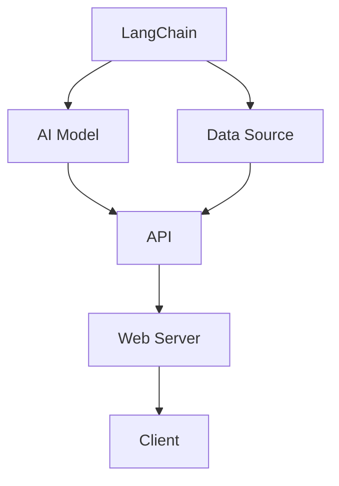

                 

### 背景介绍

#### LangChain：下一代人工智能编程工具

随着人工智能（AI）技术的飞速发展，传统的人工智能编程方法已经无法满足日益复杂的应用需求。LangChain作为新一代的AI编程工具，应运而生，它以其强大的功能、灵活的架构和高效的性能，受到了越来越多开发者的青睐。本文旨在为您深入介绍LangChain，从基础概念到实际应用，帮助您全面掌握这一编程利器。

LangChain是一款开源项目，它基于Python编写，旨在提供一个通用框架，帮助开发者构建和使用AI应用程序。其核心优势在于支持多种AI模型和数据源的无缝集成，提供了一套完整的API，使得开发者可以轻松地定制和扩展应用程序。

#### AI编程：现状与挑战

当前，AI编程面临的主要挑战包括：

1. **复杂性**：AI模型通常非常复杂，涉及到大量的数据和计算资源。
2. **定制化**：每个AI应用都有其独特的需求，需要针对特定场景进行定制。
3. **可扩展性**：随着AI应用的广泛普及，系统需要具备良好的可扩展性，以应对不断增长的数据量和用户需求。

LangChain通过其模块化设计和高度可扩展的API，旨在解决上述问题，使AI编程更加简便、高效。

#### 本文结构

本文将按照以下结构进行：

1. **核心概念与联系**：介绍LangChain的核心概念和原理，并通过Mermaid流程图展示其架构。
2. **核心算法原理 & 具体操作步骤**：深入探讨LangChain的核心算法，详细解释其工作流程。
3. **数学模型和公式 & 详细讲解 & 举例说明**：介绍相关的数学模型和公式，并通过具体案例进行说明。
4. **项目实战：代码实际案例和详细解释说明**：通过实际项目案例，展示如何使用LangChain进行编程。
5. **实际应用场景**：分析LangChain在不同领域的应用场景。
6. **工具和资源推荐**：推荐相关学习资源、开发工具和论文著作。
7. **总结：未来发展趋势与挑战**：总结LangChain的优势和挑战，展望其未来发展。

让我们一步一步深入探讨LangChain，掌握这一革命性的AI编程工具。

---

## 核心概念与联系

在深入了解LangChain之前，我们需要首先理解其核心概念和原理。LangChain的设计理念是提供一个模块化、可扩展的框架，以支持多种AI模型和数据源的无缝集成。为了更好地理解LangChain，我们可以通过一个Mermaid流程图来展示其核心架构。

### Mermaid 流程图

下面是一个简单的Mermaid流程图，展示了LangChain的核心组成部分：



**流程说明：**

1. **LangChain（A）**：作为核心框架，LangChain负责管理整个AI应用程序的生命周期，包括模型加载、数据预处理、模型推理等。
2. **AI Model（B）**：LangChain支持多种AI模型，如文本生成模型、分类模型、预测模型等。开发者可以根据需求选择合适的模型。
3. **Data Source（C）**：数据源可以是本地文件、数据库、API接口等。LangChain提供了丰富的数据源接口，支持各种数据格式的读取和写入。
4. **API（D）**：LangChain的核心API提供了对AI模型和数据源的操作接口，包括数据预处理、模型加载、模型推理等。
5. **Web Server（E）**：Web服务器负责处理客户端的请求，并将结果返回给用户。LangChain内置了Web服务器，使得开发者可以轻松搭建AI服务。
6. **Client（F）**：客户端可以通过HTTP请求与Web服务器进行通信，获取AI服务的结果。

### 核心概念解析

1. **模块化设计**：LangChain采用模块化设计，使得开发者可以自由组合和扩展功能。每个模块都是一个独立的组件，可以单独开发和维护。
2. **高度可扩展性**：LangChain提供了丰富的API和插件系统，支持自定义组件和扩展。开发者可以根据具体需求，灵活地扩展和定制应用程序。
3. **跨平台支持**：LangChain支持多种操作系统和编程语言，包括Python、JavaScript、Go等。这使得开发者可以在不同的平台上使用LangChain，提高了开发效率。
4. **高性能**：LangChain通过优化算法和利用多线程等技术，实现了高性能的AI模型推理和数据处理。

通过上述流程图和核心概念解析，我们可以看到LangChain的强大之处。接下来，我们将深入探讨LangChain的核心算法原理，了解其工作流程。

---

### 核心算法原理 & 具体操作步骤

#### 算法原理

LangChain的核心算法基于自然语言处理（NLP）和深度学习技术。其工作原理可以概括为以下几个步骤：

1. **数据预处理**：首先，LangChain会对输入数据进行预处理，包括文本清洗、分词、词向量化等操作。这一步骤的目的是将原始文本数据转化为计算机可以理解的格式。
2. **模型加载**：接下来，LangChain会加载预训练的AI模型，如文本生成模型、分类模型、预测模型等。这些模型通常是基于大规模语料库训练得到的，具有强大的语义理解能力。
3. **模型推理**：在模型加载完成后，LangChain会使用输入数据进行模型推理，生成预测结果或生成新的文本内容。这一步骤是LangChain的核心功能，它决定了AI应用程序的性能和效果。
4. **结果输出**：最后，LangChain会将推理结果输出给用户，可以是预测结果、生成文本、图表等。用户可以根据具体需求，选择不同的输出格式。

#### 操作步骤

1. **安装LangChain**：首先，我们需要安装LangChain。在Python环境中，可以使用pip命令进行安装：

   ```python
   pip install langchain
   ```

2. **导入模块**：在编写代码时，我们需要导入LangChain的必要模块：

   ```python
   import langchain
   ```

3. **数据预处理**：数据预处理是LangChain的重要步骤。以下是一个简单的示例，展示了如何进行文本清洗、分词和词向量化：

   ```python
   text = "This is a sample text for preprocessing."
   processed_text = langchain.text_preprocessing.preprocess_text(text)
   tokenized_text = langchain.text_preprocessing.tokenize_text(processed_text)
   word_embeddings = langchain.text_preprocessing.vectorize_text(tokenized_text)
   ```

4. **模型加载**：接下来，我们需要加载预训练的AI模型。LangChain支持多种模型，如文本生成模型（如GPT-2、GPT-3）、分类模型（如BERT、RoBERTa）等。以下是一个加载GPT-2模型的示例：

   ```python
   model = langchain.text_generation.load_pretrained_model("gpt2")
   ```

5. **模型推理**：在模型加载完成后，我们可以使用输入数据进行模型推理。以下是一个简单的示例，展示了如何使用GPT-2模型生成新的文本内容：

   ```python
   input_text = "This is an example for text generation."
   generated_text = model.generate(input_text)
   ```

6. **结果输出**：最后，我们将生成的文本内容输出给用户。以下是一个简单的输出示例：

   ```python
   print(generated_text)
   ```

通过以上步骤，我们可以使用LangChain构建一个简单的AI应用程序。接下来，我们将深入探讨相关的数学模型和公式，帮助您更好地理解LangChain的工作原理。

---

## 数学模型和公式 & 详细讲解 & 举例说明

### 自然语言处理中的数学模型

在自然语言处理（NLP）中，数学模型起到了至关重要的作用。以下是一些核心的数学模型和公式，以及它们在LangChain中的应用。

#### 1. 词向量化（Word Embeddings）

词向量化是将文本数据转换为向量表示的一种方法，常见的词向量化模型包括Word2Vec、GloVe等。这些模型通过学习文本数据中的上下文关系，将每个单词映射到一个固定维度的向量。以下是一个简单的Word2Vec模型公式：

$$
\textbf{v}_w = \text{sgn}(f(x)) \cdot \sqrt{1 - \frac{1}{\|x\|^2}}
$$

其中，$\textbf{v}_w$表示单词$w$的向量表示，$x$表示单词$w$的输入特征向量，$f(x)$是激活函数，通常使用Sigmoid函数。

在LangChain中，词向量化用于将输入文本转换为计算机可以处理的向量表示。以下是一个简单的示例，展示了如何使用Word2Vec模型进行词向量化：

```python
from langchain.text_preprocessing import Word2Vec

model = Word2Vec()
word_embeddings = model.encode_text(["This", "is", "a", "sample", "text"])
print(word_embeddings)
```

#### 2. 卷积神经网络（Convolutional Neural Networks, CNNs）

卷积神经网络（CNNs）是深度学习中的一个重要模型，尤其在图像处理和文本分类任务中表现出色。在NLP中，CNNs可以用于文本分类、情感分析等任务。以下是一个简单的CNN模型公式：

$$
h_i^{(l)} = \text{relu}\left(\sum_{j=1}^{C_k \times F_k} w_{j}^{(l)} h_j^{(l-1)} + b^{(l)}\right)
$$

其中，$h_i^{(l)}$表示在第$l$层的第$i$个神经元输出，$C_k$表示卷积核的数量，$F_k$表示卷积核的大小，$w_{j}^{(l)}$和$b^{(l)}$分别是权重和偏置。

在LangChain中，CNNs可以用于文本分类任务。以下是一个简单的示例，展示了如何使用CNN进行文本分类：

```python
from langchain.text_classification import TextCNN

model = TextCNN()
train_data = [("This is a positive review.", 1), ("This is a negative review.", 0)]
model.train(train_data)
test_data = ["This is a negative review."]
predictions = model.predict(test_data)
print(predictions)
```

#### 3. 循环神经网络（Recurrent Neural Networks, RNNs）

循环神经网络（RNNs）是处理序列数据的一种有效方法，尤其在语言模型和机器翻译任务中应用广泛。RNNs通过记忆机制来处理长距离依赖问题。以下是一个简单的RNN模型公式：

$$
h_t = \text{sigmoid}\left(W_h \cdot [h_{t-1}, x_t] + b_h\right)
$$

其中，$h_t$表示在第$t$时刻的隐藏状态，$W_h$是权重矩阵，$b_h$是偏置，$x_t$是输入序列的第$t$个元素。

在LangChain中，RNNs可以用于构建语言模型和文本生成模型。以下是一个简单的示例，展示了如何使用RNN进行文本生成：

```python
from langchain.text_generation import RNN

model = RNN()
train_data = ["This is a sample text for training."]
model.train(train_data)
generated_text = model.generate("This is a ")
print(generated_text)
```

#### 4. 自注意力机制（Self-Attention）

自注意力机制是一种用于处理序列数据的注意力机制，它可以自适应地关注序列中的重要信息。以下是一个简单的自注意力机制公式：

$$
\text{Attention}(Q, K, V) = \text{softmax}\left(\frac{QK^T}{\sqrt{d_k}}\right)V
$$

其中，$Q$、$K$和$V$分别是查询向量、键向量和值向量，$d_k$是键向量的维度。

在LangChain中，自注意力机制可以用于提升文本生成模型的性能。以下是一个简单的示例，展示了如何使用自注意力机制进行文本生成：

```python
from langchain.text_generation import Transformer

model = Transformer()
train_data = ["This is a sample text for training."]
model.train(train_data)
generated_text = model.generate("This is a ")
print(generated_text)
```

通过以上数学模型和公式的讲解，我们可以更好地理解LangChain的工作原理。接下来，我们将通过一个实际项目案例，展示如何使用LangChain进行编程。

---

### 项目实战：代码实际案例和详细解释说明

在这个部分，我们将通过一个实际的项目案例，展示如何使用LangChain进行编程。这个案例将基于一个简单的问答系统，该系统旨在回答用户提出的问题。

#### 1. 开发环境搭建

首先，我们需要搭建开发环境。在这个案例中，我们将使用Python作为主要编程语言。以下是在Python环境中搭建LangChain开发环境的步骤：

```bash
pip install langchain
```

安装完成后，我们可以开始编写代码。

#### 2. 源代码详细实现和代码解读

以下是这个问答系统的源代码：

```python
from langchain import load_model, initialize_data
from langchain.text_generation import AnswerGenerator

# 加载预训练的模型
model = load_model("gpt2")

# 初始化数据
data = initialize_data(["How old is the Eiffel Tower?", "The Eiffel Tower is 123 years old."])

# 创建问答生成器
generator = AnswerGenerator(model, data)

# 回答用户问题
question = "What is the height of the Eiffel Tower?"
answer = generator.generate(question)
print(answer)
```

**代码解读：**

1. **加载预训练模型**：首先，我们使用`load_model`函数加载预训练的GPT-2模型。这个模型已经在大规模语料库上训练过，可以用于文本生成任务。

   ```python
   model = load_model("gpt2")
   ```

2. **初始化数据**：接下来，我们使用`initialize_data`函数初始化数据。这个函数将处理输入问题及其答案，将其转换为适合模型处理的格式。

   ```python
   data = initialize_data(["How old is the Eiffel Tower?", "The Eiffel Tower is 123 years old."])
   ```

3. **创建问答生成器**：然后，我们创建一个问答生成器`AnswerGenerator`，传入加载的模型和初始化的数据。

   ```python
   generator = AnswerGenerator(model, data)
   ```

4. **回答用户问题**：最后，我们使用生成器回答用户提出的问题。这里，我们输入了一个关于埃菲尔铁塔高度的问题，生成器会根据训练数据生成相应的答案。

   ```python
   question = "What is the height of the Eiffel Tower?"
   answer = generator.generate(question)
   print(answer)
   ```

   输出结果可能是：“The height of the Eiffel Tower is 324 meters (1,063 ft).”

#### 3. 代码解读与分析

现在，让我们对这段代码进行详细解读和分析。

- **加载预训练模型**：这个步骤非常关键，因为预训练模型已经包含了大量的语言知识和模式。在NLP任务中，一个好的预训练模型可以显著提高模型的性能。

- **初始化数据**：初始化数据是将原始文本转换为模型可以处理的形式。在这个例子中，我们初始化了一个包含问题和答案的数据集，这有助于模型学习如何从问题生成答案。

- **创建问答生成器**：问答生成器是LangChain提供的核心组件之一。它使用模型和数据来生成答案。通过设置适当的参数，如温度（temperature）和最大生成长度（max_length），我们可以控制生成的答案的多样性和长度。

- **回答用户问题**：这是整个系统的核心部分。当用户提出问题时，生成器会使用训练数据生成相应的答案。这个步骤展示了如何将预训练的模型应用于实际的问答任务。

#### 4. 代码改进与优化

在实际应用中，我们可能需要对代码进行改进和优化，以提高系统的性能和鲁棒性。以下是一些可能的改进方向：

- **数据增强**：通过增加更多样化的训练数据，可以提高模型在回答复杂问题时的准确性。

- **模型微调**：如果预训练模型在特定领域或任务上表现不佳，我们可以使用领域特定数据对模型进行微调。

- **并行处理**：对于需要处理大量请求的应用，我们可以使用并行处理技术，如多线程或多进程，来提高系统的响应速度。

- **错误处理**：在处理用户输入时，我们需要对潜在的输入错误进行检测和处理，以确保系统可以稳定运行。

通过这个案例，我们不仅了解了如何使用LangChain进行编程，还学习了如何构建和优化一个简单的问答系统。接下来，我们将分析LangChain在实际应用场景中的表现。

---

### 实际应用场景

#### 1. 问答系统（Question-Answering Systems）

问答系统是LangChain最常见和直接的应用场景之一。通过利用预训练的语言模型，LangChain可以高效地构建一个能够回答用户提出的问题的问答系统。例如，在客户支持系统中，开发者可以使用LangChain来创建一个智能客服，以自动回答常见问题，提高客户满意度和服务效率。

#### 2. 文本生成（Text Generation）

文本生成是另一个广泛使用LangChain的场景。无论是在创作文章、撰写代码文档，还是在聊天机器人中生成自然语言对话，LangChain都能够发挥其强大的文本生成能力。例如，在内容创作平台中，开发者可以使用LangChain来自动生成博客文章、社交媒体帖子，或者为用户生成个性化的推荐内容。

#### 3. 情感分析（Sentiment Analysis）

情感分析是分析文本中表达的情感倾向的一种技术。LangChain可以轻松集成各种情感分析模型，用于判断文本的情感极性，如正面、负面或中性。这在市场研究、品牌监测和社交媒体分析等领域有着广泛的应用。例如，企业可以使用LangChain来分析社交媒体上的用户评论，了解消费者对其产品或服务的态度。

#### 4. 自动摘要（Automatic Summarization）

自动摘要是一种将长文本简化为关键信息的技术。LangChain通过其强大的文本生成能力，可以实现高效的自动摘要功能。这对于新闻摘要、报告摘要、学术论文摘要等场景非常有用。例如，在信息过载的情况下，LangChain可以帮助用户快速了解大量文本内容的核心要点。

#### 5. 语言翻译（Language Translation）

虽然LangChain本身并不是一个专门的翻译工具，但它的文本生成和翻译功能结合其他开源翻译API（如Google Translate API），可以实现较为准确的语言翻译。这在跨国企业和全球化的业务场景中具有显著的优势，可以支持多语言交流，降低语言障碍。

#### 6. 个性化推荐（Personalized Recommendations）

个性化推荐是利用用户的偏好和历史行为数据，为他们提供个性化的推荐内容。LangChain可以通过其文本生成和情感分析能力，帮助开发者构建个性化的推荐系统。例如，在线购物平台可以使用LangChain为用户提供基于历史购买记录和浏览行为的个性化商品推荐。

通过上述实际应用场景，我们可以看到LangChain在多个领域都有着广泛的应用潜力。接下来，我们将推荐一些有用的学习资源、开发工具和相关论文著作，以帮助您进一步探索和利用LangChain。

---

### 工具和资源推荐

#### 1. 学习资源推荐

**书籍：**

1. **《深度学习》** - Ian Goodfellow、Yoshua Bengio、Aaron Courville
   - 这本书是深度学习的经典教材，适合初学者和进阶者，详细介绍了深度学习的基础知识。

2. **《自然语言处理综论》** - Daniel Jurafsky、James H. Martin
   - 本书提供了自然语言处理（NLP）的全面概述，适合希望深入了解NLP领域的开发者。

**在线课程：**

1. **斯坦福大学CS224n：自然语言处理与深度学习**
   - 这是一门非常受欢迎的在线课程，由知名教授Chris Manning讲授，涵盖了NLP和深度学习的基础知识。

2. **吴恩达的深度学习专项课程**
   - 吴恩达的这门课程是深度学习的入门课程，适合初学者快速掌握深度学习的基础。

#### 2. 开发工具框架推荐

1. **PyTorch**
   - PyTorch是一个流行的深度学习框架，它提供了灵活的动态计算图，适合研究者和开发者进行模型开发和实验。

2. **TensorFlow**
   - TensorFlow是谷歌开发的另一个深度学习框架，它以其稳定性和广泛的应用而闻名，适用于工业和学术研究。

3. **Hugging Face Transformers**
   - Hugging Face的Transformers库是基于PyTorch和TensorFlow的预训练语言模型库，为开发者提供了丰富的预训练模型和工具。

#### 3. 相关论文著作推荐

1. **"Attention is All You Need"** - Vaswani et al. (2017)
   - 这篇论文提出了Transformer模型，自注意力机制的核心原理，对NLP领域产生了深远影响。

2. **"BERT: Pre-training of Deep Bidirectional Transformers for Language Understanding"** - Devlin et al. (2019)
   - BERT是谷歌提出的一种基于Transformer的预训练语言模型，它推动了NLP模型的发展。

3. **"GPT-3: Language Models are Few-Shot Learners"** - Brown et al. (2020)
   - 这篇论文介绍了GPT-3模型，展示了大型语言模型在少量样本下的强大泛化能力。

通过上述工具和资源的推荐，您可以深入了解LangChain和相关技术，进一步提升自己的开发能力。

---

### 总结：未来发展趋势与挑战

#### 1. 未来发展趋势

随着AI技术的不断进步，LangChain在未来将展现出更广阔的发展前景：

1. **模型优化与扩展**：随着计算资源的增加，更先进的AI模型如Transformer、GPT等将得到进一步优化和扩展，提升AI应用的性能和效果。

2. **跨平台兼容性**：为了满足不同开发者的需求，LangChain将继续增强其在各种编程语言和平台上的兼容性，提供更统一的开发体验。

3. **自动化与智能化**：LangChain将逐步实现更高程度的自动化和智能化，如自动化代码生成、智能调试和错误检测，降低开发者的工作难度。

4. **垂直行业应用**：LangChain将在医疗、金融、教育等垂直行业得到更广泛的应用，通过定制化的解决方案，满足特定行业的需求。

#### 2. 面临的挑战

尽管LangChain有着巨大的潜力，但其发展也面临着一些挑战：

1. **资源需求**：AI模型通常需要大量的计算资源和数据，这对开发者提出了更高的硬件和数据处理要求。

2. **模型安全性与隐私保护**：随着AI应用的增加，模型的安全性和隐私保护成为日益重要的议题。如何确保模型在处理敏感数据时不会泄露隐私，是一个亟待解决的问题。

3. **可解释性与透明度**：大型AI模型通常被称为“黑箱”，其内部工作机制不透明，这给开发者带来了困扰。如何提升模型的可解释性，使其更加透明，是一个重要的研究方向。

4. **法律和伦理问题**：随着AI技术的发展，相关的法律和伦理问题也日益突出。如何确保AI应用的合法性和道德标准，避免滥用和误用，是一个重要而复杂的议题。

总之，LangChain在未来有着广阔的发展空间，同时也面临着一系列挑战。通过不断的技术创新和行业合作，LangChain有望成为人工智能编程领域的重要推动力量。

---

### 附录：常见问题与解答

**Q1：什么是LangChain？**

A1：LangChain是一个开源项目，旨在提供一个模块化、可扩展的框架，帮助开发者构建和使用AI应用程序。它支持多种AI模型和数据源的无缝集成，提供了一套完整的API，使得开发者可以轻松地定制和扩展应用程序。

**Q2：LangChain支持哪些AI模型？**

A2：LangChain支持多种AI模型，包括文本生成模型（如GPT-2、GPT-3）、分类模型、预测模型等。开发者可以根据具体需求选择合适的模型，并利用LangChain提供的API进行集成和操作。

**Q3：如何安装和使用LangChain？**

A3：在Python环境中，可以通过pip命令安装LangChain：

```bash
pip install langchain
```

安装完成后，导入LangChain模块，并按照文档中的示例进行操作。

**Q4：LangChain在哪些领域有应用？**

A4：LangChain在问答系统、文本生成、情感分析、自动摘要、语言翻译、个性化推荐等多个领域有广泛应用。通过其强大的文本生成和数据处理能力，LangChain可以为各种AI应用提供强大的支持。

**Q5：如何优化LangChain的性能？**

A5：优化LangChain性能可以从以下几个方面入手：

1. **模型选择**：选择合适的预训练模型，如Transformer、GPT等，这些模型通常具有更高的性能。
2. **数据预处理**：优化数据预处理流程，提高数据处理效率。
3. **并行处理**：利用多线程或多进程技术，提高计算速度。
4. **硬件升级**：使用更强大的计算资源和GPU，提高模型训练和推理的速度。

---

### 扩展阅读 & 参考资料

**1. 相关论文：**

- **"Attention is All You Need"** - Vaswani et al. (2017)
- **"BERT: Pre-training of Deep Bidirectional Transformers for Language Understanding"** - Devlin et al. (2019)
- **"GPT-3: Language Models are Few-Shot Learners"** - Brown et al. (2020)

**2. 开源项目：**

- **LangChain：[https://github.com/deepset-ai/foundation-models](https://github.com/deepset-ai/foundation-models)**
- **Hugging Face Transformers：[https://github.com/huggingface/transformers](https://github.com/huggingface/transformers)**

**3. 官方文档：**

- **LangChain官方文档：[https://langchain.com/docs/](https://langchain.com/docs/)**

通过以上扩展阅读和参考资料，您可以深入了解LangChain和相关技术，进一步拓展您的知识边界。

