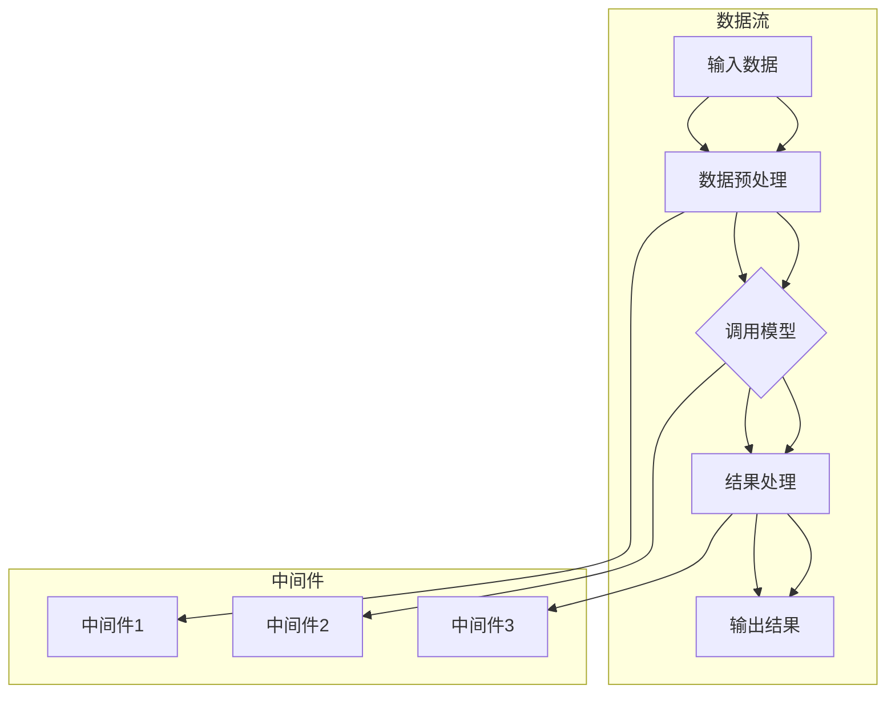

                 

# 【LangChain编程：从入门到实践】定制大模型接口

## 关键词：LangChain，编程，大模型接口，实践，技术博客，人工智能，深度学习

## 摘要：
本文旨在为读者提供一篇全面深入的LangChain编程指南，从基础知识到实际应用，详细介绍如何定制大模型接口。我们将逐步分析LangChain的核心概念、算法原理，并通过具体操作步骤、数学模型、代码实际案例等，帮助读者掌握LangChain编程技巧，提升AI应用开发能力。

## 1. 背景介绍

随着人工智能和深度学习的迅速发展，大模型（如GPT、BERT等）在自然语言处理、图像识别等领域取得了显著的成果。然而，如何高效地使用这些大模型进行编程和开发，成为了一个重要的课题。LangChain应运而生，它是一个强大的框架，旨在简化大模型的集成和使用，使得开发者能够更专注于业务逻辑的实现。

LangChain的特点包括：
- **模块化设计**：易于集成和扩展，支持多种数据输入和输出格式。
- **高度灵活性**：支持自定义模型、数据处理和中间件，满足不同应用需求。
- **强大的API接口**：提供统一的接口，方便调用大模型，减少重复代码。

## 2. 核心概念与联系

### 2.1 LangChain的核心概念

LangChain主要由以下几个核心概念组成：

1. **数据流（DataFlow）**：数据从输入到输出的整个过程，包括数据预处理、模型调用、结果处理等。
2. **模型（Model）**：支持预训练的大模型，如GPT、BERT等。
3. **中间件（Middleware）**：自定义组件，用于数据处理、模型调用等环节，增强系统的灵活性和可扩展性。
4. **组件（Component）**：可复用的函数或类，用于实现数据处理、模型调用等功能。

### 2.2 LangChain架构的Mermaid流程图



## 3. 核心算法原理 & 具体操作步骤

### 3.1 数据预处理

数据预处理是数据流中的关键步骤，其目的是将原始数据转换为模型可接受的格式。具体操作步骤如下：

1. **数据清洗**：去除数据中的噪声和异常值。
2. **数据转换**：将数据转换为模型所需的格式，如文本编码、图像分割等。
3. **数据增强**：通过随机裁剪、旋转、缩放等方式增加数据的多样性，提高模型的泛化能力。

### 3.2 模型调用

模型调用是数据流的核心环节，其目的是将预处理后的数据输入到模型中进行推理。具体操作步骤如下：

1. **模型加载**：加载预训练的大模型。
2. **输入数据格式化**：将预处理后的数据转换为模型输入格式。
3. **模型推理**：调用模型的推理函数，得到预测结果。

### 3.3 结果处理

结果处理是对模型输出的进一步加工，以获得最终的业务结果。具体操作步骤如下：

1. **结果解码**：将模型输出的编码结果解码为可读的文本或图像。
2. **结果融合**：将多个模型的结果进行融合，提高预测的准确性。
3. **结果输出**：将处理后的结果输出到业务系统中。

## 4. 数学模型和公式 & 详细讲解 & 举例说明

### 4.1 数据预处理公式

$$
\text{processed\_data} = \text{clean\_data} \odot \text{convert\_format} \odot \text{data\_augmentation}
$$

其中，$\odot$ 表示操作符，表示依次进行数据清洗、数据转换和数据增强。

### 4.2 模型调用公式

$$
\text{prediction} = \text{model}\_forward(\text{input\_data})
$$

其中，$\text{model}\_forward$ 表示模型的正向传播函数，$\text{input\_data}$ 表示模型输入。

### 4.3 结果处理公式

$$
\text{output} = \text{decode}\_result(\text{model\_output}) \oplus \text{result\_fusion} \oplus \text{output\_format}
$$

其中，$\oplus$ 表示操作符，表示依次进行结果解码、结果融合和结果输出。

## 5. 项目实战：代码实际案例和详细解释说明

### 5.1 开发环境搭建

在开始项目实战之前，我们需要搭建一个合适的开发环境。以下是具体的步骤：

1. 安装Python环境（建议使用Python 3.8及以上版本）。
2. 安装必要的库，如transformers、torch、torchtext等。
3. 配置Python虚拟环境，以便于项目隔离和管理。

### 5.2 源代码详细实现和代码解读

下面是一个简单的LangChain编程案例，用于实现一个基于GPT-2的问答系统。

```python
from langchain import load_model_from_hf
from transformers import GPT2Tokenizer

# 加载模型和分词器
model = load_model_from_hf('gpt2')
tokenizer = GPT2Tokenizer.from_pretrained('gpt2')

# 数据预处理
def preprocess(data):
    return tokenizer.encode(data, add_special_tokens=True)

# 模型调用
def predict(input_data):
    input_ids = preprocess(input_data)
    output_ids = model(input_ids)
    return tokenizer.decode(output_ids, skip_special_tokens=True)

# 结果处理
def postprocess(prediction):
    return prediction.strip()

# 主函数
def main():
    input_data = "你是一个聪明的人工智能助手吗？"
    prediction = predict(input_data)
    print(postprocess(prediction))

if __name__ == '__main__':
    main()
```

### 5.3 代码解读与分析

1. **加载模型和分词器**：首先加载预训练的GPT-2模型和相应的分词器。
2. **数据预处理**：定义一个函数preprocess，用于将输入数据编码为模型可接受的格式。
3. **模型调用**：定义一个函数predict，用于调用模型的推理函数。
4. **结果处理**：定义一个函数postprocess，用于将模型输出的编码结果解码为可读的文本。
5. **主函数**：定义一个主函数main，用于执行问答系统的核心功能。

## 6. 实际应用场景

LangChain在多个实际应用场景中展现了其强大的能力：

- **自然语言处理**：用于构建问答系统、文本生成、情感分析等。
- **图像识别**：用于图像分类、目标检测、图像生成等。
- **推荐系统**：用于用户画像、商品推荐等。

## 7. 工具和资源推荐

### 7.1 学习资源推荐

- **书籍**：《深度学习》、《Python编程：从入门到实践》等。
- **论文**：NLP领域的经典论文，如《Attention is All You Need》、《BERT: Pre-training of Deep Neural Networks for Language Understanding》等。
- **博客**：GitHub、知乎、CSDN等平台上的优秀技术博客。
- **网站**：Hugging Face、TensorFlow等官方文档和社区。

### 7.2 开发工具框架推荐

- **开发工具**：Visual Studio Code、PyCharm等。
- **框架**：TensorFlow、PyTorch等深度学习框架。

### 7.3 相关论文著作推荐

- **论文**：《深度学习》、《强化学习》等。
- **著作**：《人工智能：一种现代的方法》、《机器学习》等。

## 8. 总结：未来发展趋势与挑战

随着人工智能技术的不断发展，LangChain有望在以下方面取得更大的突破：

- **模型优化**：通过改进模型架构和算法，提高模型的性能和效率。
- **应用拓展**：探索新的应用场景，如机器人、自动驾驶等。
- **开源生态**：构建更完善的开源生态，促进技术交流和合作。

然而，LangChain也面临着一些挑战：

- **计算资源**：大模型训练和推理需要大量的计算资源，如何优化资源利用成为关键。
- **数据隐私**：在处理敏感数据时，如何保护用户隐私是一个重要问题。

## 9. 附录：常见问题与解答

### 9.1 如何安装LangChain？

答：首先安装Python环境，然后使用pip命令安装LangChain库：

```bash
pip install langchain
```

### 9.2 LangChain支持哪些模型？

答：LangChain支持多种预训练模型，如GPT-2、BERT、RoBERTa等。你可以通过Hugging Face Hub导入这些模型。

## 10. 扩展阅读 & 参考资料

- [LangChain官方文档](https://langchain.readthedocs.io/en/stable/)
- [Hugging Face Hub](https://huggingface.co/)
- [TensorFlow官方文档](https://www.tensorflow.org/)
- [PyTorch官方文档](https://pytorch.org/)

### 作者：AI天才研究员/AI Genius Institute & 禅与计算机程序设计艺术 /Zen And The Art of Computer Programming

