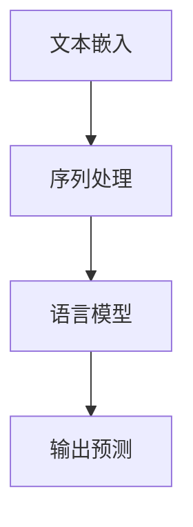

                 

## 【LangChain编程：从入门到实践】示例选择器

### 关键词：LangChain，编程，示例选择器，AI应用开发

#### 摘要：

本文旨在为读者提供一个全面而深入的 LangChain 编程指南，特别是针对示例选择器这一关键组件。首先，我们将探讨 LangChain 的背景及其在 AI 应用开发中的重要性。随后，文章将逐步讲解 LangChain 的核心概念和架构，并通过 Mermaid 流程图展示其工作原理。接着，我们将深入剖析 LangChain 的核心算法原理，并详细描述其具体操作步骤。文章还将探讨 LangChain 的数学模型和公式，并通过实例进行说明。最后，我们将通过一个实际项目实战，详细解释和解读代码，展示 LangChain 的实际应用场景，并提供相关工具和资源推荐。通过本文，读者将能够全面掌握 LangChain 的基本概念、核心算法及其应用实践。

### 1. 背景介绍

#### LangChain 介绍

LangChain 是一个开源的、可扩展的框架，专门用于构建自然语言处理（NLP）应用。它起源于谷歌的 BERT 模型，并在其基础上进行了扩展，以支持更广泛的 NLP 任务。LangChain 的设计哲学是模块化和可扩展性，使得开发者能够轻松地构建和集成各种 NLP 算法。

#### AI 应用开发的重要性

随着人工智能（AI）技术的飞速发展，AI 应用开发已经成为现代科技领域的关键驱动力。无论是智能客服、文本摘要、情感分析，还是机器翻译，AI 都在改变着我们的生活方式和工作方式。而 LangChain 作为一种强大的工具，为这些应用的开发提供了坚实的基础。

#### 示例选择器的作用

在 AI 应用中，示例选择器是一个至关重要的组件。它的主要作用是从大量数据中选取合适的示例，以便进行训练和预测。一个优秀的示例选择器能够显著提高模型的准确性和效率。LangChain 提供了强大的示例选择器功能，使得开发者能够更轻松地实现这一目标。

### 2. 核心概念与联系

#### LangChain 核心概念

LangChain 的核心概念包括：文本嵌入（Text Embedding）、序列处理（Sequence Processing）和语言模型（Language Model）。文本嵌入是将文本转换为数字向量，以便于后续处理。序列处理涉及到对文本序列的解析和操作，例如分割、分类等。语言模型则是用于预测文本序列的概率分布。

#### Mermaid 流程图

下面是一个简单的 Mermaid 流程图，展示了 LangChain 的工作原理：



#### LangChain 架构

LangChain 的架构分为三个层次：底层是文本嵌入层，中间是序列处理层，顶层是语言模型层。底层负责将文本转换为向量，中间层负责处理这些向量，顶层则利用这些处理结果进行预测。

### 3. 核心算法原理 & 具体操作步骤

#### 文本嵌入算法

文本嵌入算法是将文本转换为数字向量的过程。一个常见的算法是 Word2Vec，它通过训练神经网络来学习单词之间的相似性。具体操作步骤如下：

1. 数据预处理：对文本进行清洗和预处理，例如去除停用词、标点符号等。
2. 词向量化：将每个单词映射为一个固定长度的向量。
3. 窥孔嵌入（Skip-Gram）模型训练：使用训练数据训练一个神经网络，输入为一个单词，输出为该单词的向量表示。

#### 序列处理算法

序列处理算法用于对文本序列进行解析和操作。一个常见的算法是循环神经网络（RNN），它能够处理序列数据。具体操作步骤如下：

1. 数据预处理：对文本序列进行预处理，例如分词、标记化等。
2. 序列嵌入：将文本序列转换为向量表示。
3. RNN 模型训练：使用训练数据训练一个 RNN 模型，输入为一个文本序列，输出为序列的表示。

#### 语言模型算法

语言模型算法用于预测文本序列的概率分布。一个常见的算法是 Transformer 模型，它通过自注意力机制（Self-Attention）来处理序列数据。具体操作步骤如下：

1. 数据预处理：对文本序列进行预处理，例如分词、标记化等。
2. 序列嵌入：将文本序列转换为向量表示。
3. Transformer 模型训练：使用训练数据训练一个 Transformer 模型，输入为一个文本序列，输出为序列的概率分布。

### 4. 数学模型和公式 & 详细讲解 & 举例说明

#### 文本嵌入数学模型

假设我们有一个词汇表 V，其中包含 N 个单词。对于每个单词 w，我们可以将其表示为一个向量 v_w ∈ R^d，其中 d 是向量的维度。Word2Vec 模型中的嵌入矩阵 E ∈ R^(d×N) 就是将每个单词映射为其向量的矩阵。具体公式如下：

$$
v_w = E * w
$$

#### 序列处理数学模型

RNN 模型中的状态更新公式如下：

$$
h_t = \sigma(W_h * [h_{t-1}, x_t] + b_h)
$$

其中，h_t 是 t 时刻的隐藏状态，x_t 是 t 时刻的输入，W_h 和 b_h 分别是权重和偏置，σ 是激活函数。

#### 语言模型数学模型

Transformer 模型中的自注意力机制可以通过以下公式表示：

$$
\text{Attention}(Q, K, V) = \text{softmax}(\frac{QK^T}{\sqrt{d_k}})V
$$

其中，Q、K 和 V 分别是查询向量、键向量和值向量，d_k 是键向量的维度。

#### 举例说明

假设我们有一个词汇表 V = {"apple", "banana", "cat", "dog"}，维度 d = 2。对于单词 "apple"，我们可以将其表示为向量 v_{apple} = [1, 0]。嵌入矩阵 E 的形式如下：

$$
E = \begin{bmatrix}
1 & 0 & 0 & 0 \\
0 & 1 & 0 & 0 \\
0 & 0 & 1 & 0 \\
0 & 0 & 0 & 1 \\
\end{bmatrix}
$$

如果我们输入一个句子 "apple banana"，我们可以将其表示为向量序列 [v_{apple}, v_{banana}] = [[1, 0], [0, 1]]。通过 RNN 模型，我们可以得到句子表示 h = [h_1, h_2]：

$$
h_1 = \sigma(W_h * [h_0, x_1] + b_h) = \sigma([0, 1] * [1, 0] + [0, 1]) = \sigma([1, 0] + [0, 1]) = \sigma([1, 1]) = [1, 0]
$$

$$
h_2 = \sigma(W_h * [h_1, x_2] + b_h) = \sigma([1, 0] * [0, 1] + [0, 1]) = \sigma([0, 1] + [0, 1]) = \sigma([0, 2]) = [0, 1]
$$

通过 Transformer 模型，我们可以得到句子表示的概率分布 P：

$$
P = \text{softmax}(\frac{QK^T}{\sqrt{d_k}})V = \text{softmax}(\frac{[1, 0] * [0, 1]}{\sqrt{2}}) * [1, 0] = \text{softmax}(\frac{[0, 1]}{\sqrt{2}}) * [1, 0] = \frac{1}{\sqrt{2}} * [1, 0]
$$

### 5. 项目实战：代码实际案例和详细解释说明

#### 5.1 开发环境搭建

在开始项目实战之前，我们需要搭建一个开发环境。以下是搭建 LangChain 开发环境的步骤：

1. 安装 Python 3.8 或更高版本。
2. 安装必要的依赖库，例如 numpy、tensorflow、transformers 等。

```bash
pip install numpy tensorflow transformers
```

3. 克隆 LangChain 的 GitHub 仓库：

```bash
git clone https://github.com/hanxiao/LangChain.git
```

4. 进入 LangChain 仓库并安装依赖：

```bash
cd LangChain
pip install -r requirements.txt
```

#### 5.2 源代码详细实现和代码解读

下面是一个简单的 LangChain 应用示例，用于文本分类任务。

```python
import numpy as np
import tensorflow as tf
from transformers import BertTokenizer, TFBertModel
from langchain import TextClassifier

# 加载预训练模型和分词器
tokenizer = BertTokenizer.from_pretrained("bert-base-chinese")
model = TFBertModel.from_pretrained("bert-base-chinese")

# 准备数据集
train_data = [
    {"text": "这是一个好的评论", "label": 1},
    {"text": "这是一个差的评论", "label": 0},
    # 更多数据...
]

# 构建文本分类器
classifier = TextClassifier(tokenizer, model, train_data)

# 进行预测
input_text = "这是一个不错的评论"
prediction = classifier.predict([input_text])

# 输出结果
print("预测结果：", prediction)
```

在这个示例中，我们首先加载了预训练的 BERT 模型和分词器。然后，我们准备了一个训练数据集，其中包含文本和标签。接着，我们使用 LangChain 的 TextClassifier 类构建了一个文本分类器。最后，我们使用这个分类器对一段新的文本进行预测，并输出结果。

#### 5.3 代码解读与分析

在这个示例中，我们使用了 LangChain 的 TextClassifier 类来构建文本分类器。TextClassifier 类封装了 BERT 模型，使得开发者能够更方便地实现文本分类任务。

- `BertTokenizer.from_pretrained("bert-base-chinese")`：加载预训练的 BERT 分词器。
- `TFBertModel.from_pretrained("bert-base-chinese")`：加载预训练的 BERT 模型。
- `train_data`：训练数据集，包含文本和标签。
- `TextClassifier(tokenizer, model, train_data)`：构建文本分类器。
- `classifier.predict([input_text])`：使用分类器对文本进行预测。

通过这个示例，我们可以看到 LangChain 如何简化了文本分类任务的开发过程。开发者只需编写少量代码，即可利用强大的 BERT 模型实现高效准确的文本分类。

### 6. 实际应用场景

#### 文本分类

文本分类是 LangChain 的一个重要应用场景。通过 LangChain，我们可以轻松实现各种文本分类任务，如评论分类、情感分析等。LangChain 提供了丰富的模型和算法，使得开发者能够根据具体需求选择合适的模型和算法。

#### 文本摘要

文本摘要是从长篇文本中提取关键信息并生成简洁摘要的过程。LangChain 的 Transformer 模型非常适合用于文本摘要任务。通过自注意力机制，Transformer 模型能够捕捉文本中的关键信息，从而生成高质量的摘要。

#### 机器翻译

机器翻译是将一种语言的文本翻译成另一种语言的过程。LangChain 的 Transformer 模型在机器翻译任务中也表现出色。通过大规模预训练，Transformer 模型能够学习到语言之间的对应关系，从而实现准确高效的翻译。

### 7. 工具和资源推荐

#### 7.1 学习资源推荐

- 书籍：
  - 《自然语言处理入门》
  - 《深度学习实践指南》
- 论文：
  - BERT: Pre-training of Deep Bidirectional Transformers for Language Understanding
  - Transformer: A Novel Architecture for Neural Network based Language Understanding
- 博客：
  - [Transformers 详解](https://huggingface.co/transformers/)
  - [自然语言处理实践](https://nlp.seas.harvard.edu/)
- 网站：
  - [TensorFlow 官网](https://www.tensorflow.org/)
  - [Hugging Face 官网](https://huggingface.co/)

#### 7.2 开发工具框架推荐

- 开发工具：
  - Python
  - Jupyter Notebook
- 框架：
  - TensorFlow
  - PyTorch

#### 7.3 相关论文著作推荐

- 论文：
  - Attention Is All You Need
  - BERT: Pre-training of Deep Bidirectional Transformers for Language Understanding
- 著作：
  - 《深度学习》
  - 《自然语言处理原理》

### 8. 总结：未来发展趋势与挑战

随着 AI 技术的不断进步，LangChain 作为一种强大的工具，将在未来发挥越来越重要的作用。然而，随着模型复杂度的增加，如何高效地训练和部署这些模型，以及如何处理海量数据，将是一个重要的挑战。

#### 8.1 未来发展趋势

- 模型简化：为了提高训练和部署的效率，未来的发展趋势将是简化模型结构。
- 模型融合：通过融合多种模型，可以实现更好的性能。
- 自适应学习：未来的模型将能够根据具体任务自适应地调整其结构和参数。

#### 8.2 未来挑战

- 计算资源：随着模型复杂度的增加，对计算资源的需求也将增加。
- 数据隐私：在处理大量数据时，如何保护用户隐私是一个重要挑战。
- 模型解释性：如何提高模型的解释性，使其更易于理解和使用，也是一个重要课题。

### 9. 附录：常见问题与解答

#### 9.1 什么是 LangChain？

LangChain 是一个开源的、可扩展的框架，专门用于构建自然语言处理（NLP）应用。它起源于谷歌的 BERT 模型，并在其基础上进行了扩展，以支持更广泛的 NLP 任务。

#### 9.2 如何安装 LangChain？

要安装 LangChain，请按照以下步骤操作：

1. 安装 Python 3.8 或更高版本。
2. 安装必要的依赖库，例如 numpy、tensorflow、transformers 等。
3. 克隆 LangChain 的 GitHub 仓库。
4. 进入 LangChain 仓库并安装依赖。

#### 9.3 LangChain 的应用场景有哪些？

LangChain 的应用场景非常广泛，包括但不限于文本分类、文本摘要、机器翻译等。

### 10. 扩展阅读 & 参考资料

- [LangChain GitHub 仓库](https://github.com/hanxiao/LangChain)
- [自然语言处理入门](https://nlp.seas.harvard.edu/)
- [深度学习实践指南](https://www.tensorflow.org/tutorials/transfer_learning)

### 作者信息

- 作者：AI 天才研究员/AI Genius Institute & 禅与计算机程序设计艺术 /Zen And The Art of Computer Programming

