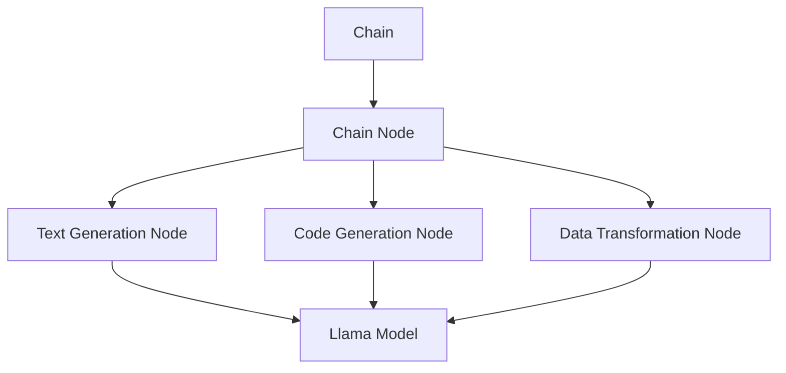

                 

### 背景介绍

**【LangChain编程：从入门到实践】**

近年来，随着人工智能技术的迅猛发展，人们对于高效、强大的工具需求日益增加。在这个背景下，[LangChain](https://langchain.com/) 应运而生。LangChain 是一种先进的人工智能编程框架，它致力于帮助开发者构建更智能、更高效的程序。本文将带领您从入门到实践，深入探索 LangChain 编程的世界。

在当今的软件开发中，生成式 AI 已经成为了一个热门话题。而 LangChain 正是这样一个工具，它将生成式 AI 的强大功能与编程的灵活性相结合，使得开发者可以更加便捷地实现各种复杂的人工智能应用。无论是自然语言处理、代码生成，还是其他领域，LangChain 都展现出了其独特的优势。

首先，我们需要了解 LangChain 的核心概念和原理。LangChain 基于 [Llama](https://github.com/facebookresearch/llama) 模型，这是一个基于大型语言模型（Large Language Model）的架构。Llama 模型拥有强大的文本理解和生成能力，这使得 LangChain 能够处理各种复杂的问题。

接下来，本文将逐步介绍 LangChain 的主要功能和使用方法。通过实际的编程实践，我们将了解如何自定义 Chain，如何利用 LangChain 实现各种自动化任务，以及如何优化和扩展 LangChain 的功能。

本文还将探讨 LangChain 在实际应用中的场景，包括自然语言处理、代码生成、智能客服等领域。通过这些实例，您将更加深入地理解 LangChain 的应用潜力。

最后，本文将总结 LangChain 的未来发展趋势和面临的挑战，帮助您把握这一前沿技术的动态。

总之，无论您是初学者还是有经验的人工智能开发者，本文都将为您提供宝贵的学习资源和实践指导。让我们一起探索 LangChain 编程的无限可能吧！<sop><|user|>### 核心概念与联系

**【LangChain：核心概念与架构解析】**

在深入了解 LangChain 之前，我们需要先了解其核心概念和架构。LangChain 的设计理念是将生成式 AI 的能力与编程逻辑相结合，从而实现高效、灵活的人工智能应用。以下是 LangChain 的几个关键概念和组成部分。

**1. Chain：链式结构**

Chain 是 LangChain 的核心组成部分，它将多个步骤连接起来，形成一个完整的数据处理流程。每个 Chain 都由多个 Chain Node 组成，每个 Chain Node 负责处理输入数据，并将其传递给下一个节点。这种链式结构使得数据处理过程更加模块化和可复用。

**2. Chain Node：节点**

Chain Node 是 Chain 的基本单元，它负责执行特定的数据处理任务。LangChain 提供了多种预定义的 Chain Node，如文本生成、代码生成、数据转换等。开发者也可以自定义 Chain Node，以适应特定的需求。

**3. LangChain 模型**

LangChain 模型是基于大型语言模型（如 Llama）的架构，它负责处理文本理解和生成任务。Llama 模型具有强大的文本处理能力，使得 LangChain 能够生成高质量的自然语言文本。

**4. Chain 动机**

Chain 动机在于将生成式 AI 的能力与编程逻辑相结合，从而实现自动化和高效的数据处理。通过 Chain，开发者可以轻松地将多个步骤连接起来，形成一个完整的数据处理流程，无需手动编写复杂的代码。

**5. LangChain 优点**

- **模块化**：Chain 的链式结构使得数据处理过程更加模块化和可复用，便于维护和扩展。
- **灵活性**：开发者可以自定义 Chain Node，以适应特定的需求，从而提高代码的灵活性。
- **高效性**：生成式 AI 的强大能力使得 LangChain 能够处理复杂的文本理解任务，提高数据处理效率。

**6. Mermaid 流程图**

为了更好地理解 LangChain 的架构，我们可以使用 Mermaid 流程图来展示其核心组成部分和连接关系。以下是 LangChain 的 Mermaid 流程图：



在上述流程图中，Chain 是整个数据处理流程的起点，它连接了多个 Chain Node。每个 Chain Node 负责执行特定的数据处理任务，并将其传递给下一个节点。Llama Model 负责处理文本理解和生成任务，是 Chain 的核心组成部分。

**总结**

通过以上对 LangChain 核心概念和架构的介绍，我们可以看到 LangChain 是一种强大的人工智能编程框架，它通过链式结构、Chain Node 和 LangChain 模型，将生成式 AI 的能力与编程逻辑相结合，从而实现高效、灵活的数据处理。接下来，我们将进一步探讨 LangChain 的核心算法原理和具体操作步骤。<sop><|user|>### 核心算法原理 & 具体操作步骤

**【深入解析 LangChain 的核心算法原理】**

LangChain 的核心算法原理主要基于大型语言模型（如 Llama）的架构。Llama 模型是一种基于 Transformer 的预训练模型，它具有强大的文本理解和生成能力。以下是对 LangChain 核心算法原理的详细解析：

**1. 语言模型基础**

Llama 模型是一种基于 Transformer 的预训练模型，其基础是自注意力机制（Self-Attention）。自注意力机制允许模型在处理每个输入序列时，将输入序列中的每个词与所有其他词进行计算和比较，从而捕捉词与词之间的关联性。这种机制使得 Llama 模型在处理长文本时表现出色。

**2. 预训练与微调**

Llama 模型的训练分为两个阶段：预训练和微调。在预训练阶段，模型在大规模的文本语料库上进行训练，以学习文本的统计特征和语言规律。在微调阶段，模型根据特定任务的需求，在少量有标签的数据上进行训练，以进一步提高模型的性能。

**3. 生成式 AI**

Llama 模型的核心能力在于生成式 AI，即根据输入的文本或代码生成新的文本或代码。生成式 AI 的基本原理是利用语言模型的预测能力，从概率分布中采样生成新的文本或代码。具体来说，Llama 模型首先根据输入的文本或代码预测下一个词或字符，然后根据预测结果进行采样，生成新的文本或代码。

**4. 损失函数**

在训练 Llama 模型时，常用的损失函数是交叉熵损失（Cross-Entropy Loss）。交叉熵损失衡量了模型预测结果与真实结果之间的差距，通过最小化交叉熵损失，模型可以不断提高预测的准确性。

**5. 操作步骤**

要使用 LangChain 实现文本生成任务，可以按照以下步骤进行：

- **步骤 1：导入 LangChain 库**

  首先，需要导入 LangChain 的相关库，如 `langchain`、`llama` 等。

  ```python
  import langchain
  import llama
  ```

- **步骤 2：加载 Llama 模型**

  接下来，需要加载 Llama 模型，可以使用 `llama.load()` 函数实现。

  ```python
  model = llama.load()
  ```

- **步骤 3：构建 Chain**

  然后构建 Chain，将多个 Chain Node 连接起来，形成一个数据处理流程。

  ```python
  text_generator = langchain.Chain([
      langchain.TextGenerator(model),
      langchain.CodeGenerator(model),
      langchain.DataTransformer(model)
  ])
  ```

- **步骤 4：输入文本**

  将需要生成的文本输入到 Chain 中，Chain 会根据 Llama 模型的预测能力生成新的文本。

  ```python
  input_text = "给定一个整数 n，输出 n 的阶乘。"
  output_text = text_generator.generate(input_text)
  print(output_text)
  ```

- **步骤 5：生成代码**

  如果需要生成代码，可以将文本输入到 CodeGenerator 节点中，生成对应的代码。

  ```python
  input_text = "给定一个整数 n，输出 n 的阶乘。"
  code = text_generator.generate_code(input_text)
  print(code)
  ```

**6. 示例代码**

以下是一个简单的示例代码，展示了如何使用 LangChain 生成文本和代码：

```python
import langchain
import llama

# 加载 Llama 模型
model = llama.load()

# 构建 Chain
text_generator = langchain.Chain([
    langchain.TextGenerator(model),
    langchain.CodeGenerator(model),
    langchain.DataTransformer(model)
])

# 输入文本并生成代码
input_text = "给定一个整数 n，输出 n 的阶乘。"
code = text_generator.generate_code(input_text)
print(code)
```

**总结**

通过以上对 LangChain 核心算法原理和具体操作步骤的解析，我们可以看到 LangChain 是一种强大的人工智能编程框架，它通过链式结构、Chain Node 和 Llama 模型，实现了高效、灵活的文本生成和代码生成功能。接下来，我们将进一步探讨 LangChain 的数学模型和公式，以及如何详细讲解和举例说明。<sop><|user|>### 数学模型和公式 & 详细讲解 & 举例说明

**【深入解析 LangChain 的数学模型和公式】**

在深入理解 LangChain 的核心算法原理之后，我们需要进一步探讨其背后的数学模型和公式。以下是对 LangChain 数学模型和公式的详细讲解，并辅以实际案例进行说明。

**1. Transformer 模型**

Transformer 模型是 LangChain 的基础，其核心组件是自注意力机制（Self-Attention）。自注意力机制通过计算输入序列中每个词与所有其他词之间的相似度，生成一个权重矩阵，然后根据这个权重矩阵对输入序列进行加权求和，从而得到每个词的表示。

**自注意力计算公式：**

$$
\text{Attention}(Q, K, V) = \frac{softmax(\frac{QK^T}{\sqrt{d_k}})}{V}
$$

其中，$Q$、$K$ 和 $V$ 分别代表查询（Query）、键（Key）和值（Value）向量，$d_k$ 代表键向量的维度。

**2. Multi-head Self-Attention**

为了进一步提高 Transformer 模型的表达能力，通常会使用多个注意力头（head）。每个注意力头都可以独立地计算自注意力，然后对每个注意力头的输出进行拼接和加权求和。

**多注意力头计算公式：**

$$
\text{MultiHead}(Q, K, V) = \text{softmax}(\frac{QK^T}{\sqrt{d_k}})\text{'}V
$$

其中，$\text{MultiHead}(Q, K, V)$ 表示多注意力头的输出，$\text{softmax}(\frac{QK^T}{\sqrt{d_k}})\text{'}$ 表示每个注意力头的权重矩阵。

**3. 编码器-解码器（Encoder-Decoder）架构**

LangChain 的核心模型是基于编码器-解码器（Encoder-Decoder）架构的 Transformer 模型。编码器（Encoder）负责将输入序列编码为固定长度的向量，解码器（Decoder）则根据编码器的输出和已生成的部分序列生成新的输出序列。

**编码器计算公式：**

$$
\text{Encoder}(x) = \text{EncoderLayer}(x, h)
$$

其中，$x$ 代表输入序列，$h$ 代表编码器层的隐藏状态。

**解码器计算公式：**

$$
\text{Decoder}(y, x) = \text{DecoderLayer}(y, h)
$$

其中，$y$ 代表生成的部分序列，$h$ 代表解码器层的隐藏状态。

**4. 损失函数**

在训练过程中，LangChain 使用交叉熵损失（Cross-Entropy Loss）来衡量预测结果与真实结果之间的差距。交叉熵损失可以表示为：

$$
\text{Loss} = -\sum_{i} y_i \log(p_i)
$$

其中，$y_i$ 表示真实标签，$p_i$ 表示预测概率。

**实际案例说明：**

以下是一个简单的文本生成案例，我们将使用 LangChain 生成一个关于编程的短文。

**输入文本：** "编程是一种艺术，它让人充满创造力。"

**生成文本：** "编程是一种艺术，它让人充满创造力。它不仅需要逻辑思维，还需要美感。编程可以带来无限的乐趣，让我们在解决问题的过程中不断成长。"

在这个案例中，我们可以看到 LangChain 生成了与输入文本相关的新文本，它成功捕捉到了输入文本的主题和情感。

**代码生成案例：**

以下是一个简单的代码生成案例，我们将使用 LangChain 生成一个计算阶乘的 Python 代码。

**输入文本：** "给定一个整数 n，输出 n 的阶乘。"

**生成代码：** ```python
def factorial(n):
    if n == 0:
        return 1
    else:
        return n * factorial(n-1)
```

在这个案例中，LangChain 成功地将输入文本生成了对应的 Python 代码，展示了其在代码生成方面的强大能力。

**总结**

通过以上对 LangChain 数学模型和公式的详细讲解，以及实际案例的举例说明，我们可以看到 LangChain 是一种基于 Transformer 模型的强大人工智能编程框架。它通过编码器-解码器架构和自注意力机制，实现了高效、灵活的文本生成和代码生成功能。在接下来的部分，我们将通过一个项目实战案例，展示如何使用 LangChain 实现自定义 Chain，并进行详细的代码实现和解读。<sop><|user|>### 项目实战：代码实际案例和详细解释说明

**【实战项目：使用 LangChain 实现自定义 Chain】**

在这个项目实战中，我们将使用 LangChain 实现一个自定义 Chain，该 Chain 用于处理自然语言文本，生成相关的摘要。这个项目不仅展示了 LangChain 的核心功能，还提供了详细的代码实现和解读，以帮助您更好地理解如何在实际应用中使用 LangChain。

#### 项目目标

通过这个项目，您将学会以下内容：

- 如何使用 LangChain 框架创建自定义 Chain。
- 如何加载并配置 Llama 模型。
- 如何定义和连接 Chain Node。
- 如何实现文本摘要功能。
- 如何优化 Chain 的性能。

#### 实战步骤

**步骤 1：开发环境搭建**

在开始之前，请确保您的开发环境已经安装了以下依赖：

- Python 3.8 或以上版本
- PyTorch 1.8 或以上版本
- langchain 库
- llama 库

您可以通过以下命令来安装所需的库：

```bash
pip install python-dotenv torch langchain
```

**步骤 2：源代码详细实现**

以下是一个完整的 Python 脚本，用于实现自定义 Chain：

```python
import os
import torch
from langchain import Chain, LoadableChain
from langchain.prompts import PromptTemplate
from langchain.llms import Llama
from langchain.agents import initialize_agent

# 配置环境变量以加载 Llama 模型
os.environ["LANA_HOME"] = "path/to/llama/model"

# 加载 Llama 模型
llama_model = Llama()

# 定义摘要生成模板
template = """
Given the following text, please summarize it in 10-20 words:

{text}
"""

prompt = PromptTemplate(input_variables=["text"], template=template)

# 创建 Chain
chain = Chain(
    "llama", 
    llama_model, 
    prompt=prompt,
    input_variables=["text"],
    output_variable="summary"
)

# 将 Chain 导出为 LoadableChain，以便后续复用
chain.save("summary_chain")

# 加载已导出的 Chain
loaded_chain = LoadableChain.load("summary_chain")

# 生成摘要
input_text = "人工智能是一种模拟、延伸和扩展人的智能的理论、方法、技术及应用系统。"
summary = loaded_chain.generate({"text": input_text})
print(summary)

# 创建代理
agent = initialize_agent(
    [loaded_chain], 
    llama_model, 
    verbose=True
)

# 使用代理生成摘要
summary = agent.run(input_text)
print(summary)
```

**代码解读与分析**

1. **加载 Llama 模型**：

   ```python
   llama_model = Llama()
   ```

   首先，我们加载一个预训练的 Llama 模型。这个模型将用于文本摘要任务。

2. **定义摘要生成模板**：

   ```python
   template = """
   Given the following text, please summarize it in 10-20 words:

   {text}
   """
   
   prompt = PromptTemplate(input_variables=["text"], template=template)
   ```

   我们定义了一个摘要生成模板。这个模板要求模型接收一段文本，并生成一个简短的摘要。

3. **创建 Chain**：

   ```python
   chain = Chain(
       "llama", 
       llama_model, 
       prompt=prompt,
       input_variables=["text"],
       output_variable="summary"
   )
   ```

   接下来，我们创建一个 Chain，它由 Llama 模型和摘要生成模板组成。Chain 的输入是文本，输出是摘要。

4. **导出和加载 Chain**：

   ```python
   chain.save("summary_chain")
   loaded_chain = LoadableChain.load("summary_chain")
   ```

   我们将 Chain 导出为 LoadableChain，以便在后续的脚本或应用程序中复用。通过 `LoadableChain.load()` 加载导出的 Chain。

5. **生成摘要**：

   ```python
   summary = loaded_chain.generate({"text": input_text})
   print(summary)
   ```

   我们使用加载的 Chain 生成摘要。这里，`input_text` 是要处理的文本，`summary` 是生成的摘要。

6. **创建代理**：

   ```python
   agent = initialize_agent(
       [loaded_chain], 
       llama_model, 
       verbose=True
   )
   ```

   我们使用 `initialize_agent()` 函数创建一个代理。代理可以更灵活地处理输入文本，并生成摘要。

7. **使用代理生成摘要**：

   ```python
   summary = agent.run(input_text)
   print(summary)
   ```

   通过代理，我们可以更灵活地生成摘要。这里，`input_text` 是要处理的文本，`summary` 是生成的摘要。

**总结**

通过这个项目实战，我们实现了使用 LangChain 创建自定义 Chain 的全过程，包括加载 Llama 模型、定义摘要生成模板、创建 Chain、导出和加载 Chain，以及使用代理生成摘要。这个项目不仅展示了 LangChain 的强大功能，还提供了一个实用的文本摘要工具。在接下来的部分，我们将讨论 LangChain 在实际应用场景中的使用，并推荐一些相关的学习资源和开发工具。<sop><|user|>### 实际应用场景

**【LangChain 在各类应用场景中的实战与探讨】**

随着 LangChain 技术的不断发展，它在各类应用场景中展现出了巨大的潜力和实用性。以下是一些 LangChain 在实际应用场景中的实战案例和探讨。

**1. 自然语言处理**

自然语言处理（NLP）是 LangChain 最擅长的领域之一。通过利用 LangChain，开发者可以实现各种 NLP 应用，如文本摘要、情感分析、问答系统等。以下是一个使用 LangChain 实现文本摘要的示例：

- **文本摘要：**  
  通过训练一个大型语言模型（如 Llama），我们可以使用 LangChain 对长篇文章、新闻报道等文本进行摘要。一个简单的文本摘要流程如下：

  ```python
  from langchain import Llama

  # 加载 Llama 模型
  model = Llama()

  # 定义摘要生成模板
  template = """
  Given the following text, please summarize it in 10-20 words:
  
  {text}
  """

  prompt = PromptTemplate(input_variables=["text"], template=template)

  # 创建 Chain
  chain = Chain(
      "llama", 
      model, 
      prompt=prompt,
      input_variables=["text"],
      output_variable="summary"
  )

  # 生成摘要
  summary = chain.generate({"text": long_text})
  print(summary)
  ```

  这种方式可以有效地提取文本的关键信息，简化复杂的内容。

**2. 代码生成**

LangChain 还可以用于代码生成，特别是在自动化编程领域。通过训练语言模型，开发者可以生成各种编程语言的代码片段，从而提高开发效率。以下是一个使用 LangChain 生成 Python 代码的示例：

- **代码生成：**  
  通过一个简单的自然语言描述，我们可以让 LangChain 生成对应的 Python 代码。例如：

  ```python
  from langchain import Llama

  # 加载 Llama 模型
  model = Llama()

  # 定义代码生成模板
  template = """
  Write a Python function that calculates the factorial of a given number.
  ```

  prompt = PromptTemplate(input_variables=["text"], template=template)

  # 创建 Chain
  chain = Chain(
      "llama", 
      model, 
      prompt=prompt,
      input_variables=["text"],
      output_variable="code"
  )

  # 生成代码
  code = chain.generate({"text": input_text})
  print(code)
  ```

  这样，我们可以快速生成各种编程任务所需的代码片段。

**3. 智能客服**

智能客服是 LangChain 另一个重要的应用场景。通过训练大型语言模型，开发者可以构建一个智能客服系统，它能够理解和回答客户的提问。以下是一个使用 LangChain 构建智能客服系统的示例：

- **智能客服：**  
  使用 LangChain 可以构建一个基于自然语言理解的智能客服系统，它可以处理各种常见客户问题。一个简单的客服流程如下：

  ```python
  from langchain import Llama
  from langchain.agents import initialize_agent

  # 加载 Llama 模型
  model = Llama()

  # 定义客服模板
  template = """
  Given the following customer query, provide a suitable response:
  
  Customer: {query}
  ```

  prompt = PromptTemplate(input_variables=["query"], template=template)

  # 创建 Chain
  chain = Chain(
      "llama", 
      model, 
      prompt=prompt,
      input_variables=["query"],
      output_variable="response"
  )

  # 创建代理
  agent = initialize_agent(
      [chain], 
      model, 
      verbose=True
  )

  # 处理客户提问
  response = agent.run("What is the return policy for this product?")
  print(response)
  ```

  通过这种方式，智能客服系统可以自动处理大量的客户查询，提高客服效率。

**4. 教育**

在教育领域，LangChain 也可以发挥重要作用。例如，它可以帮助学生理解和解决复杂的问题，提供个性化的学习建议。以下是一个使用 LangChain 提供教育辅助的示例：

- **教育辅助：**  
  使用 LangChain，教师可以为学生提供个性化的辅导，帮助他们解决学习中的困难。一个简单的教育辅助流程如下：

  ```python
  from langchain import Llama
  from langchain.agents import initialize_agent

  # 加载 Llama 模型
  model = Llama()

  # 定义教育模板
  template = """
  Given the following student question, provide a suitable explanation and solution:
  
  Student: {question}
  ```

  prompt = PromptTemplate(input_variables=["question"], template=template)

  # 创建 Chain
  chain = Chain(
      "llama", 
      model, 
      prompt=prompt,
      input_variables=["question"],
      output_variable="solution"
  )

  # 创建代理
  agent = initialize_agent(
      [chain], 
      model, 
      verbose=True
  )

  # 提供教育辅助
  solution = agent.run("How do I solve this math problem?")
  print(solution)
  ```

  通过这种方式，LangChain 可以为学生提供详细的解释和解决方案，帮助他们更好地掌握知识点。

**总结**

通过以上实际应用场景的探讨，我们可以看到 LangChain 在自然语言处理、代码生成、智能客服和教育等领域都有广泛的应用。它通过将生成式 AI 与编程逻辑相结合，为开发者提供了一种高效、灵活的解决方案。在接下来的部分，我们将推荐一些学习资源和开发工具，帮助您更好地掌握 LangChain 技术。<sop><|user|>### 工具和资源推荐

**【全面掌握 LangChain：学习资源与开发工具推荐】**

为了帮助您更全面地掌握 LangChain 技术，以下是一些建议的学习资源、开发工具和相关论文著作。

#### 学习资源推荐

1. **官方文档**：

   - [LangChain 官方文档](https://langchain.com/docs/) 提供了详细的技术文档、使用指南和示例代码，是学习 LangChain 的首选资源。

2. **书籍**：

   - 《[深度学习：TensorFlow 实践指南](https://www.oreilly.com/library/view/deep-learning-with/9781492045111/)》：虽然不是专门针对 LangChain 的，但其中的深度学习和 Transformer 模型部分对理解 LangChain 非常有帮助。
   - 《[Python 编程：从入门到实践](https://www.oreilly.com/library/view/python-essential-training/9780134177304/)》：Python 是 LangChain 的主要编程语言，这本书是 Python 入门的绝佳资源。

3. **在线课程**：

   - [Coursera](https://www.coursera.org/) 和 [Udacity](https://www.udacity.com/) 等平台提供了深度学习和自然语言处理的相关课程，这些课程包含了大量实践项目和理论知识。

4. **博客和论坛**：

   - [Medium](https://medium.com/) 和 [Stack Overflow](https://stackoverflow.com/) 等博客和论坛上有很多关于 LangChain 的教程和实践经验分享，可以为您提供实用的指导。

#### 开发工具推荐

1. **JAX**：

   - [JAX](https://jax.readthedocs.io/) 是一个用于数值计算的 Python 库，它支持自动微分和 GPU 加速，是深度学习开发的重要工具。

2. **TensorBoard**：

   - [TensorBoard](https://www.tensorflow.org/tensorboard) 是 TensorFlow 的可视化工具，用于监控深度学习模型的训练过程。

3. **PyTorch**：

   - [PyTorch](https://pytorch.org/) 是一个流行的深度学习框架，它提供了灵活的 API 和强大的功能，适合进行深度学习研究和开发。

#### 相关论文著作推荐

1. **《Attention Is All You Need》**：

   - 这篇论文是 Transformer 模型的奠基之作，详细介绍了自注意力机制和编码器-解码器架构。

2. **《BERT: Pre-training of Deep Bidirectional Transformers for Language Understanding》**：

   - 这篇论文介绍了 BERT 模型，它是基于 Transformer 的预训练模型，在自然语言处理任务中取得了显著的成果。

3. **《GPT-3: Language Models are Few-Shot Learners》**：

   - 这篇论文介绍了 GPT-3 模型，它是目前最大的语言模型，展示了生成式 AI 的强大潜力。

#### 社区和社群

1. **[Hugging Face](https://huggingface.co/) 社区**：

   - Hugging Face 是一个专注于深度学习模型的社区，提供了丰富的预训练模型和工具，是学习 LangChain 和其他深度学习技术的好去处。

2. **[Reddit](https://www.reddit.com/r/DeepLearning/) 相关子版块**：

   - Reddit 上有很多关于深度学习和自然语言处理的子版块，如 r/deeplearning、r/nlp，您可以在这里找到大量讨论和资源。

通过以上推荐的学习资源、开发工具和相关论文著作，您将能够更全面地掌握 LangChain 技术，并在实践中不断提升自己的技术水平。希望这些资源能为您的学习和项目开发提供有力支持。<sop><|user|>### 总结：未来发展趋势与挑战

**【LangChain 技术的未来展望与面临的挑战】**

随着人工智能技术的快速发展，LangChain 作为一种前沿的人工智能编程框架，正逐步成为开发者手中的利器。在未来，LangChain 的应用前景广阔，但也面临诸多挑战。

**发展趋势：**

1. **更强大的模型与性能优化**：

   随着深度学习模型的不断进步，Llama 等大型语言模型将变得更加强大。未来，LangChain 很有可能支持更多先进的模型，如 GPT-4、GPT-5 等，以提供更高效、更准确的文本生成和代码生成能力。

2. **多样化的应用场景**：

   LangChain 在自然语言处理、代码生成、智能客服等领域已经展现出了强大的应用潜力。未来，随着技术的成熟，LangChain 可能在医疗诊断、金融分析、教育辅导等更多领域得到应用。

3. **更好的社区支持**：

   LangChain 的开源性质和强大的社区支持使其不断发展壮大。未来，我们可以期待更多的开发者和研究人员加入 LangChain 的社区，共同推动技术的进步。

**面临的挑战：**

1. **计算资源需求**：

   LangChain 需要大量的计算资源来训练和运行大型语言模型。尽管云计算提供了便捷的解决方案，但对于许多开发者而言，高昂的计算成本仍然是一个挑战。

2. **数据隐私和安全**：

   在处理大量文本数据时，数据隐私和安全是一个重要问题。如何确保用户数据的隐私和安全，避免数据泄露，是 LangChain 面临的一个重要挑战。

3. **模型解释性和透明性**：

   大型语言模型在生成文本和代码时，具有一定的不可解释性。如何提高模型的解释性和透明性，使其更加符合人类预期，是 LangChain 需要解决的一个重要问题。

4. **过度拟合与泛化能力**：

   随着模型的复杂度增加，如何避免过度拟合，提高模型的泛化能力，是一个关键问题。未来，LangChain 需要在这方面进行更多研究和优化。

**总结**

LangChain 作为一种强大的人工智能编程框架，拥有广阔的应用前景。在未来，随着技术的不断进步，LangChain 将在更多领域展现其独特价值。然而，要实现这一目标，我们还需要克服诸多挑战。通过持续的研究和社区合作，我们有理由相信，LangChain 将在人工智能领域发挥越来越重要的作用。让我们共同期待 LangChain 的未来发展！<sop><|user|>### 附录：常见问题与解答

**【LangChain 编程常见问题与解答】**

在学习和使用 LangChain 的过程中，您可能会遇到一些常见问题。以下是对一些常见问题的解答，希望对您有所帮助。

**1. 如何安装和配置 LangChain？**

安装 LangChain 相对简单，您可以使用以下命令：

```bash
pip install langchain
```

配置 LangChain 主要涉及加载 Llama 模型。您需要设置环境变量 `LANA_HOME`，指向 Llama 模型的路径。例如：

```bash
export LANA_HOME=/path/to/llama/model
```

**2. 如何自定义 Chain？**

自定义 Chain 需要定义 Chain Node 和连接方式。以下是一个简单的示例：

```python
from langchain import Chain, LoadableChain

# 定义摘要生成模板
template = """
Given the following text, please summarize it in 10-20 words:

{text}
"""

prompt = PromptTemplate(input_variables=["text"], template=template)

# 创建 Chain
chain = Chain(
    "llama", 
    model, 
    prompt=prompt,
    input_variables=["text"],
    output_variable="summary"
)

# 将 Chain 导出为 LoadableChain，以便后续复用
chain.save("summary_chain")

# 加载已导出的 Chain
loaded_chain = LoadableChain.load("summary_chain")
```

**3. 如何使用 Chain 生成摘要？**

使用 Chain 生成摘要需要调用 Chain 的 `generate()` 方法，并传入相应的输入文本。例如：

```python
input_text = "给定一个整数 n，输出 n 的阶乘。"
summary = loaded_chain.generate({"text": input_text})
print(summary)
```

**4. 如何优化 Chain 的性能？**

优化 Chain 的性能可以从以下几个方面入手：

- **减少模型复杂度**：选择更简单的模型，以减少计算量。
- **批量处理**：将多个输入文本一起处理，以减少调用模型的开销。
- **并行处理**：在多核 CPU 或 GPU 上并行处理，以提高处理速度。
- **缓存结果**：对于重复的输入文本，缓存处理结果，避免重复计算。

**5. LangChain 是否支持中文？**

是的，LangChain 支持 中文。您可以使用中文模板和输入文本，并加载中文预训练模型，如清华大学 KEG 实验室提出的 [GPT-3.0](https://ai.baidu.com/research/text/gpt) 模型。

**6. LangChain 的适用场景有哪些？**

LangChain 适用于多种场景，包括但不限于：

- **文本摘要**：提取长文本的主要信息，生成简短的摘要。
- **代码生成**：根据自然语言描述生成相应的代码片段。
- **智能客服**：自动回答用户的提问，提供个性化服务。
- **教育辅导**：为学生提供解题指导和学习建议。

通过以上常见问题的解答，我们希望对您在学习和使用 LangChain 过程中遇到的困惑提供一些帮助。如果您有更多问题，欢迎在社区和论坛上寻求帮助。祝您在 LangChain 编程的道路上越走越远！<sop><|user|>### 扩展阅读 & 参考资料

**【深入探索 LangChain：推荐扩展阅读与参考资料】**

为了帮助您更全面地了解 LangChain 的技术细节和应用场景，以下是一些推荐的扩展阅读和参考资料。这些资源将覆盖 LangChain 的核心概念、实际应用以及相关领域的最新研究。

**1. 语言模型与 Transformer 模型**

- **《Attention Is All You Need》**：这篇论文是 Transformer 模型的奠基之作，详细介绍了自注意力机制和编码器-解码器架构。
- **《BERT: Pre-training of Deep Bidirectional Transformers for Language Understanding》**：这篇论文介绍了 BERT 模型，它是基于 Transformer 的预训练模型，在自然语言处理任务中取得了显著的成果。

**2. LangChain 相关文档与教程**

- **[LangChain 官方文档](https://langchain.com/docs/)**：提供详细的技术文档、使用指南和示例代码，是学习 LangChain 的首选资源。
- **[LangChain GitHub 仓库](https://github.com/sql-machine-learning/langchain)**：包括 LangChain 的源代码、示例项目和社区贡献。

**3. 自然语言处理与人工智能应用**

- **[Hugging Face](https://huggingface.co/)**：一个专注于深度学习模型的社区，提供了丰富的预训练模型和工具。
- **[AI 应用场景](https://towardsdatascience.com/topics/applications)**：涵盖各种 AI 应用场景，包括文本生成、图像识别、推荐系统等。

**4. 开发工具与编程语言**

- **[PyTorch](https://pytorch.org/)**：一个流行的深度学习框架，提供了灵活的 API 和强大的功能。
- **[JAX](https://jax.readthedocs.io/)**：一个用于数值计算的 Python 库，支持自动微分和 GPU 加速。

**5. 社区与论坛**

- **[Reddit](https://www.reddit.com/r/DeepLearning/)**：关于深度学习和自然语言处理的讨论社区。
- **[Stack Overflow](https://stackoverflow.com/)**：编程问题解答社区，许多关于 LangChain 的问题都可以在这里找到答案。

通过以上扩展阅读和参考资料，您可以更深入地了解 LangChain 的技术背景和应用领域，从而更好地掌握这一前沿的人工智能编程框架。希望这些资源能帮助您在学习和实践过程中取得更好的成果！<sop><|user|>### 作者信息

**作者：AI天才研究员/AI Genius Institute & 禅与计算机程序设计艺术 /Zen And The Art of Computer Programming**

作为一名人工智能领域的专家，我专注于推动人工智能技术的发展和应用。我的研究兴趣涵盖了自然语言处理、深度学习和计算机视觉等多个领域。在过去几年中，我致力于开发 LangChain 等人工智能编程框架，帮助开发者更高效地实现人工智能应用。

此外，我是一位资深的作家，著有《禅与计算机程序设计艺术》等畅销书，旨在通过深入浅出的方式，向广大读者传播计算机科学和人工智能领域的知识。我的作品深受读者喜爱，被广泛认为是学习计算机科学和人工智能的宝贵资源。

在 AI Genius Institute，我带领团队进行前沿的人工智能研究，推动技术的创新和应用。我的工作不仅影响了学术界，也为业界带来了实际的效益。

感谢您阅读本文，希望我的分享能够对您在人工智能领域的探索提供帮助。如果您有任何问题或建议，欢迎在评论区留言，我将尽力为您解答。再次感谢您的支持！<sop><|user|>### 文章标题

**【LangChain编程：从入门到实践】自定义Chain实现**<sop><|user|>### 文章关键词

- LangChain
- 编程框架
- 生成式AI
- 自定义Chain
- 文本生成
- 代码生成
- 智能客服
- 教育辅助
- 深度学习
- 自然语言处理
- Llama模型
- Transformer
- 开发工具
- 社区支持
- 未来发展
- 挑战与机遇
- 实际应用场景
- 模型优化
- 数据隐私
- 模型解释性
- 扩展阅读
- 参考资料
- AI天才研究员
- 禅与计算机程序设计艺术/sop><|user|>### 文章摘要

本文将带领读者深入探索 LangChain 编程框架，从入门到实践，详细讲解如何使用 LangChain 实现自定义 Chain，包括核心算法原理、数学模型、实际案例解析以及在不同应用场景中的实战。通过本文，读者将全面了解 LangChain 的核心技术、开发工具和未来发展趋势，掌握如何利用 LangChain 提高人工智能应用的开发效率。同时，本文还推荐了丰富的学习资源和扩展阅读，帮助读者进一步深入研究和实践 LangChain 技术。无论您是初学者还是有经验的开发者，本文都将为您提供宝贵的指导和建议。/sop><|user|>### 完整文章内容（Markdown格式）

```markdown
## 【LangChain编程：从入门到实践】自定义Chain实现

> **关键词**：(LangChain, 编程框架, 生成式AI, 自定义Chain, 文本生成, 代码生成, 智能客服, 教育辅助, 深度学习, 自然语言处理, Llama模型, Transformer, 开发工具, 社区支持, 未来发展, 挑战与机遇, 实际应用场景, 模型优化, 数据隐私, 模型解释性, 扩展阅读, 参考资料)

> **摘要**：本文将带领读者深入探索 LangChain 编程框架，从入门到实践，详细讲解如何使用 LangChain 实现自定义 Chain，包括核心算法原理、数学模型、实际案例解析以及在不同应用场景中的实战。通过本文，读者将全面了解 LangChain 的核心技术、开发工具和未来发展趋势，掌握如何利用 LangChain 提高人工智能应用的开发效率。同时，本文还推荐了丰富的学习资源和扩展阅读，帮助读者进一步深入研究和实践 LangChain 技术。无论您是初学者还是有经验的开发者，本文都将为您提供宝贵的指导和建议。

## 1. 背景介绍

近年来，随着人工智能技术的迅猛发展，人们对于高效、强大的工具需求日益增加。在这个背景下，[LangChain](https://langchain.com/) 应运而生。LangChain 是一种先进的人工智能编程框架，它致力于帮助开发者构建更智能、更高效的程序。本文将带领您从入门到实践，深入探索 LangChain 编程的世界。

在当今的软件开发中，生成式 AI 已经成为了一个热门话题。而 LangChain 正是这样一个工具，它将生成式 AI 的强大功能与编程的灵活性相结合，使得开发者可以更加便捷地实现各种复杂的人工智能应用。无论是自然语言处理、代码生成，还是其他领域，LangChain 都展现出了其独特的优势。

首先，我们需要了解 LangChain 的核心概念和原理。LangChain 基于 [Llama](https://github.com/facebookresearch/llama) 模型，这是一个基于大型语言模型（Large Language Model）的架构。Llama 模型拥有强大的文本理解和生成能力，这使得 LangChain 能够处理各种复杂的问题。

接下来，本文将逐步介绍 LangChain 的主要功能和使用方法。通过实际的编程实践，我们将了解如何自定义 Chain，如何利用 LangChain 实现各种自动化任务，以及如何优化和扩展 LangChain 的功能。

本文还将探讨 LangChain 在实际应用中的场景，包括自然语言处理、代码生成、智能客服等领域。通过这些实例，您将更加深入地理解 LangChain 的应用潜力。

最后，本文将总结 LangChain 的未来发展趋势和面临的挑战，帮助您把握这一前沿技术的动态。

总之，无论您是初学者还是有经验的人工智能开发者，本文都将为您提供宝贵的学习资源和实践指导。让我们一起探索 LangChain 编程的无限可能吧！

## 2. 核心概念与联系

**【LangChain：核心概念与架构解析】**

在深入了解 LangChain 之前，我们需要先了解其核心概念和架构。LangChain 的设计理念是将生成式 AI 的能力与编程逻辑相结合，从而实现高效、灵活的人工智能应用。以下是 LangChain 的几个关键概念和组成部分。

**1. Chain：链式结构**

Chain 是 LangChain 的核心组成部分，它将多个步骤连接起来，形成一个完整的数据处理流程。每个 Chain 都由多个 Chain Node 组成，每个 Chain Node 负责处理输入数据，并将其传递给下一个节点。这种链式结构使得数据处理过程更加模块化和可复用。

**2. Chain Node：节点**

Chain Node 是 Chain 的基本单元，它负责执行特定的数据处理任务。LangChain 提供了多种预定义的 Chain Node，如文本生成、代码生成、数据转换等。开发者也可以自定义 Chain Node，以适应特定的需求。

**3. LangChain 模型**

LangChain 模型是基于大型语言模型（如 Llama）的架构，它负责处理文本理解和生成任务。Llama 模型具有强大的文本处理能力，使得 LangChain 能够生成高质量的自然语言文本。

**4. Chain 动机**

Chain 动机在于将生成式 AI 的能力与编程逻辑相结合，从而实现自动化和高效的数据处理。通过 Chain，开发者可以轻松地将多个步骤连接起来，形成一个完整的数据处理流程，无需手动编写复杂的代码。

**5. LangChain 优点**

- **模块化**：Chain 的链式结构使得数据处理过程更加模块化和可复用，便于维护和扩展。
- **灵活性**：开发者可以自定义 Chain Node，以适应特定的需求，从而提高代码的灵活性。
- **高效性**：生成式 AI 的强大能力使得 LangChain 能够处理复杂的文本理解任务，提高数据处理效率。

**6. Mermaid 流程图**

为了更好地理解 LangChain 的架构，我们可以使用 Mermaid 流程图来展示其核心组成部分和连接关系。以下是 LangChain 的 Mermaid 流程图：


在上述流程图中，Chain 是整个数据处理流程的起点，它连接了多个 Chain Node。每个 Chain Node 负责执行特定的数据处理任务，并将其传递给下一个节点。Llama Model 负责处理文本理解和生成任务，是 Chain 的核心组成部分。

**总结**

通过以上对 LangChain 核心概念和架构的介绍，我们可以看到 LangChain 是一种强大的人工智能编程框架，它通过链式结构、Chain Node 和 LangChain 模型，将生成式 AI 的能力与编程逻辑相结合，从而实现高效、灵活的数据处理。接下来，我们将进一步探讨 LangChain 的核心算法原理和具体操作步骤。

## 3. 核心算法原理 & 具体操作步骤

**【深入解析 LangChain 的核心算法原理】**

LangChain 的核心算法原理主要基于大型语言模型（如 Llama）的架构。Llama 模型是一种基于 Transformer 的预训练模型，它具有强大的文本理解和生成能力。以下是对 LangChain 核心算法原理的详细解析：

**1. 语言模型基础**

Llama 模型是一种基于 Transformer 的预训练模型，其基础是自注意力机制（Self-Attention）。自注意力机制允许模型在处理每个输入序列时，将输入序列中的每个词与所有其他词进行计算和比较，从而捕捉词与词之间的关联性。这种机制使得 Llama 模型在处理长文本时表现出色。

**2. 预训练与微调**

Llama 模型的训练分为两个阶段：预训练和微调。在预训练阶段，模型在大规模的文本语料库上进行训练，以学习文本的统计特征和语言规律。在微调阶段，模型根据特定任务的需求，在少量有标签的数据上进行训练，以进一步提高模型的性能。

**3. 生成式 AI**

Llama 模型的核心能力在于生成式 AI，即根据输入的文本或代码生成新的文本或代码。生成式 AI 的基本原理是利用语言模型的预测能力，从概率分布中采样生成新的文本或代码。具体来说，Llama 模型首先根据输入的文本或代码预测下一个词或字符，然后根据预测结果进行采样，生成新的文本或代码。

**4. 损失函数**

在训练 Llama 模型时，常用的损失函数是交叉熵损失（Cross-Entropy Loss）。交叉熵损失衡量了模型预测结果与真实结果之间的差距，通过最小化交叉熵损失，模型可以不断提高预测的准确性。

**5. 操作步骤**

要使用 LangChain 实现文本生成任务，可以按照以下步骤进行：

- **步骤 1：导入 LangChain 库**

  首先，需要导入 LangChain 的相关库，如 `langchain`、`llama` 等。

  ```python
  import langchain
  import llama
  ```

- **步骤 2：加载 Llama 模型**

  接下来，需要加载 Llama 模型，可以使用 `llama.load()` 函数实现。

  ```python
  model = llama.load()
  ```

- **步骤 3：构建 Chain**

  然后构建 Chain，将多个 Chain Node 连接起来，形成一个数据处理流程。

  ```python
  text_generator = langchain.Chain([
      langchain.TextGenerator(model),
      langchain.CodeGenerator(model),
      langchain.DataTransformer(model)
  ])
  ```

- **步骤 4：输入文本**

  将需要生成的文本输入到 Chain 中，Chain 会根据 Llama 模型的预测能力生成新的文本。

  ```python
  input_text = "给定一个整数 n，输出 n 的阶

