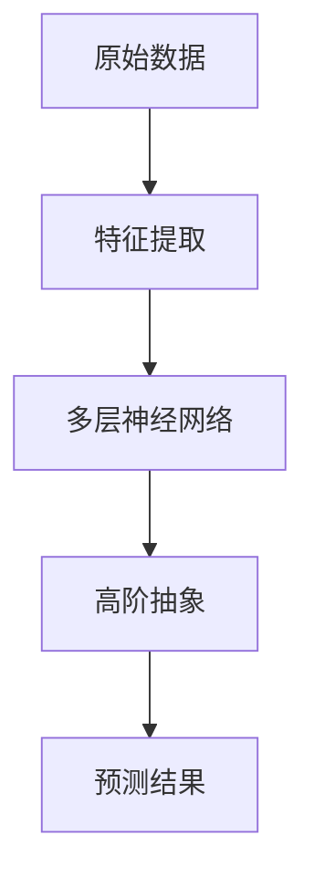
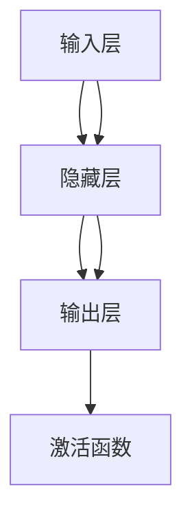
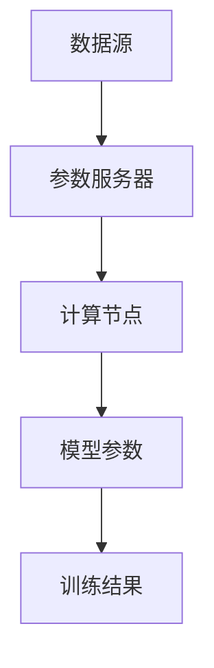
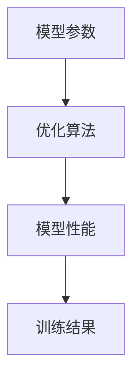
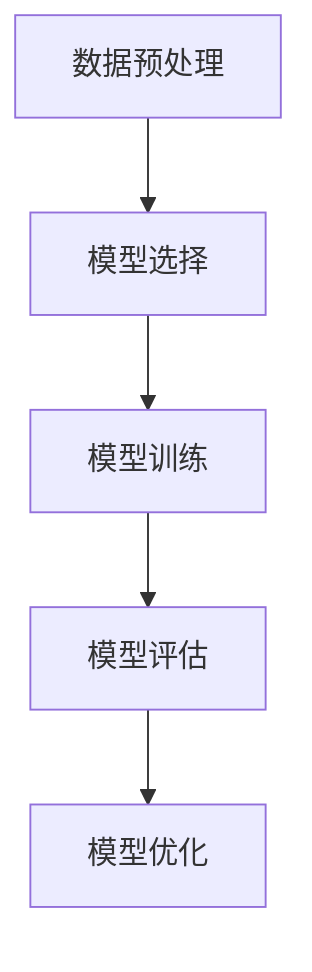
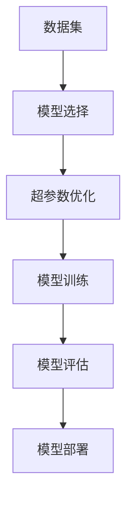

                 

### 背景介绍

**【大模型应用开发 动手做AI Agent】AutoGen实战**

在当今的技术浪潮中，人工智能（AI）正逐步渗透到我们生活的方方面面。作为这一领域的核心驱动力，大模型的应用开发日益受到关注。大模型，指的是具有亿级参数的深度学习模型，如GPT、BERT等，其强大的学习和表达能力，使得AI在语言处理、图像识别、决策推理等领域取得了显著的突破。而AutoGen，作为大模型应用开发中的一个重要工具，可以帮助开发者快速构建和优化AI模型，从而实现更加智能化和自动化的应用。

本文旨在通过AutoGen的实战，详细介绍大模型应用开发的流程和关键步骤。我们将首先介绍大模型的基本概念和重要性，然后探讨AutoGen的功能和优势，接着深入分析AutoGen的核心算法原理，并通过具体案例展示其实际操作步骤。此外，我们还将探讨大模型在实际应用中的各种场景，并推荐一些相关工具和资源，以帮助读者更好地理解和应用AutoGen。最后，我们将总结未来大模型应用开发的发展趋势与挑战，为读者提供宝贵的思考方向。

通过本文的阅读，读者将能够：

1. 理解大模型的基本概念和重要性。
2. 掌握AutoGen的功能和优势。
3. 了解大模型的核心算法原理。
4. 学会使用AutoGen进行实际应用开发。
5. 探索大模型在各个领域的应用场景。
6. 获取相关工具和资源的推荐。

让我们开始这场技术之旅，一起探索大模型应用开发的无限可能。

### 核心概念与联系

在深入了解AutoGen之前，我们需要先掌握几个核心概念，并理解它们之间的联系。这些概念包括但不限于：深度学习、神经网络、参数服务器、模型优化、自动机器学习（AutoML）等。下面，我们将逐一介绍这些概念，并使用Mermaid流程图展示它们之间的联系。

#### 深度学习（Deep Learning）

深度学习是人工智能的一个重要分支，通过模拟人脑的神经网络结构，实现对复杂数据的自动特征提取和学习。深度学习的核心是神经网络，尤其是多层神经网络（Multilayer Neural Networks）。每一层神经网络都可以提取不同层次的特征，从而实现从原始数据到高阶抽象的映射。

**Mermaid流程图：**



#### 神经网络（Neural Networks）

神经网络是由大量神经元（模拟人脑的神经元）组成的计算模型。每个神经元都可以接收多个输入，并通过激活函数产生输出。神经网络通过反向传播算法不断调整权重和偏置，以优化模型的性能。

**Mermaid流程图：**



#### 参数服务器（Parameter Server）

参数服务器是一种分布式计算架构，用于处理大规模神经网络的训练任务。它通过将模型参数存储在中央服务器中，实现模型的分布式训练。参数服务器可以显著提高训练速度，并支持大规模数据集的并行处理。

**Mermaid流程图：**



#### 模型优化（Model Optimization）

模型优化是指通过调整模型参数、结构或算法，以提高模型的性能和效果。常见的模型优化方法包括：梯度下降（Gradient Descent）、随机梯度下降（Stochastic Gradient Descent，SGD）、Adam优化器等。

**Mermaid流程图：**



#### 自动机器学习（AutoML）

自动机器学习（AutoML）是一种利用算法自动化构建、训练和优化机器学习模型的方法。AutoML可以大幅降低机器学习开发的门槛，使非专业人士也能快速构建高性能的机器学习模型。

**Mermaid流程图：**



#### AutoGen的功能与联系

AutoGen是一个基于自动机器学习（AutoML）的大模型应用开发工具，它通过自动化搜索最优模型配置和优化策略，实现高效的大模型训练和部署。AutoGen的功能可以概括为以下几个方面：

1. **模型选择**：自动选择适合特定任务的机器学习模型。
2. **超参数优化**：自动调整模型的超参数，以优化模型性能。
3. **模型训练**：自动化地训练大规模神经网络模型。
4. **模型评估**：自动评估模型性能，并选择最优模型。
5. **模型部署**：自动化地部署训练好的模型，以供实际应用。

**Mermaid流程图：**



通过上述Mermaid流程图，我们可以清晰地看到各个核心概念之间的联系，以及AutoGen在这些概念基础上的应用和扩展。理解这些概念和它们之间的联系，是掌握AutoGen的重要前提。

### 核心算法原理 & 具体操作步骤

#### AutoGen算法简介

AutoGen是一种基于深度学习和自动机器学习的框架，旨在简化大规模机器学习模型的开发过程。其核心思想是通过自动化搜索和优化，找到最优的模型结构和参数配置，从而提高模型的性能和效率。

AutoGen的主要算法包括：

1. **模型搜索**：使用贝叶斯优化（Bayesian Optimization）等算法，自动搜索最优的模型结构和参数配置。
2. **模型训练**：使用分布式训练技术，如参数服务器，加速大规模模型的训练过程。
3. **模型评估**：通过交叉验证（Cross-Validation）等算法，评估模型的性能和泛化能力。
4. **模型优化**：使用梯度下降（Gradient Descent）等优化算法，调整模型参数，以提升模型性能。

#### 模型搜索

模型搜索是AutoGen算法的核心步骤之一。它通过自动化搜索最优的模型结构和参数配置，以实现高效的模型训练和部署。常用的模型搜索算法包括：

1. **贝叶斯优化（Bayesian Optimization）**：贝叶斯优化是一种基于概率模型的优化算法，通过构建概率模型来预测最优参数配置，并不断调整参数以优化模型性能。

2. **遗传算法（Genetic Algorithm）**：遗传算法是一种基于自然进化的优化算法，通过模拟生物进化过程，不断优化模型的参数和结构。

3. **随机搜索（Random Search）**：随机搜索是一种简单但有效的优化算法，通过随机生成不同的参数配置，并选择最优的配置作为模型的参数。

#### 模型训练

模型训练是AutoGen算法的另一个重要步骤。在训练过程中，AutoGen采用分布式训练技术，如参数服务器，以加速大规模模型的训练过程。分布式训练的主要优点包括：

1. **并行处理**：通过将数据集划分为多个子集，分布式训练可以并行处理这些子集，从而提高训练速度。

2. **资源利用**：分布式训练可以利用多个计算节点，充分利用计算资源，提高训练效率。

3. **容错性**：分布式训练具有较高的容错性，即使某个计算节点发生故障，其他节点仍可以继续训练过程，确保训练任务的完成。

#### 模型评估

模型评估是AutoGen算法中不可或缺的一环。通过模型评估，可以判断模型是否达到预期的性能指标，以及是否需要进行进一步的优化。常用的模型评估方法包括：

1. **交叉验证（Cross-Validation）**：交叉验证是一种常用的模型评估方法，通过将数据集划分为多个子集，对每个子集进行训练和测试，从而评估模型的泛化能力。

2. **精度、召回率、F1分数等指标**：在分类任务中，常用的评估指标包括精度（Accuracy）、召回率（Recall）和F1分数（F1 Score）等。通过计算这些指标，可以评估模型的分类性能。

3. **性能比较**：通过比较不同模型的性能，可以选出最优的模型进行部署。

#### 模型优化

模型优化是AutoGen算法中不断调整模型参数和结构，以提高模型性能的过程。常用的模型优化方法包括：

1. **梯度下降（Gradient Descent）**：梯度下降是一种优化算法，通过不断更新模型参数，使其沿着梯度方向逐渐逼近最优解。

2. **Adam优化器（Adam Optimizer）**：Adam优化器是一种自适应的优化算法，通过对梯度的一阶矩估计和二阶矩估计进行优化，以加速收敛速度。

3. **模型压缩（Model Compression）**：通过模型压缩，可以减少模型的参数数量，从而降低模型的存储和计算成本。

### 具体操作步骤

以下是使用AutoGen进行大模型应用开发的具体操作步骤：

#### 1. 数据准备

首先，准备好用于训练和测试的数据集。数据集应包括输入数据和标签数据。为了提高模型的泛化能力，数据集应进行预处理，如数据清洗、归一化、标准化等。

#### 2. 模型选择

根据任务需求，选择适合的机器学习模型。AutoGen提供了多种预定义的模型架构，如神经网络、决策树、支持向量机等。

#### 3. 超参数设置

设置模型的超参数，如学习率、批次大小、迭代次数等。这些超参数可以通过模型搜索算法自动优化，以达到最佳性能。

#### 4. 模型训练

使用分布式训练技术，对模型进行训练。在训练过程中，AutoGen会不断调整模型参数，以提高模型性能。

#### 5. 模型评估

使用交叉验证等方法，评估模型的性能。如果模型性能不满足要求，可以重新进行模型搜索和训练。

#### 6. 模型优化

根据模型评估结果，对模型进行优化。可以调整模型结构、超参数或使用模型压缩技术，以提高模型性能。

#### 7. 模型部署

将训练好的模型部署到实际应用环境中，如Web服务、移动应用等。AutoGen提供了多种部署方式，以适应不同的应用场景。

通过上述步骤，我们可以使用AutoGen快速构建和优化大规模机器学习模型，实现高效的AI应用开发。

### 数学模型和公式 & 详细讲解 & 举例说明

#### 数学模型概述

在AutoGen的大模型应用开发过程中，数学模型和公式起到了至关重要的作用。这些模型和公式不仅帮助我们理解和分析大模型的训练过程，还指导我们进行模型优化和性能评估。以下是一些核心的数学模型和公式，我们将详细讲解并举例说明。

#### 1. 前向传播（Forward Propagation）

前向传播是神经网络中的一个基本步骤，用于计算输入数据在神经网络中的输出。其核心公式如下：

$$
\begin{align*}
z^{[l]} &= \sigma(W^{[l]} \cdot a^{[l-1]} + b^{[l]}), \\
a^{[l]} &= \sigma(z^{[l-1]}),
\end{align*}
$$

其中，$z^{[l]}$表示第$l$层的激活值，$a^{[l]}$表示第$l$层的输出，$\sigma$是激活函数（如Sigmoid、ReLU等），$W^{[l]}$和$b^{[l]}$分别是第$l$层的权重和偏置。

**举例说明：**

假设我们有一个两层神经网络，第一层的输入数据为$a^{[0]} = [1, 2, 3]$，权重矩阵$W^{[1]} = [[0.1, 0.2], [0.3, 0.4]]$，偏置$b^{[1]} = [0.1, 0.2]$，激活函数为ReLU。

$$
\begin{align*}
z^{[1]} &= \sigma(W^{[1]} \cdot a^{[0]} + b^{[1]}) = \max(0, 0.1 \cdot 1 + 0.2 \cdot 2 + 0.3 \cdot 3 + 0.1) = [1, 1.2, 1.4], \\
a^{[1]} &= \max(0, z^{[1]}) = [1, 1.2, 1.4].
\end{align*}
$$

#### 2. 反向传播（Backpropagation）

反向传播是神经网络训练中的关键步骤，用于计算模型损失并更新模型参数。其核心公式如下：

$$
\begin{align*}
\delta^{[l]} &= \frac{\partial J}{\partial z^{[l]}}, \\
\theta^{[l]} &= \theta^{[l]} - \alpha \cdot \frac{\partial J}{\partial \theta^{[l]}}, \\
b^{[l]} &= b^{[l]} - \alpha \cdot \frac{\partial J}{\partial b^{[l]}},
\end{align*}
$$

其中，$\delta^{[l]}$表示第$l$层的误差项，$J$是模型损失函数，$\theta^{[l]}$是第$l$层的权重和偏置，$\alpha$是学习率。

**举例说明：**

假设我们有一个两层神经网络，损失函数为均方误差（MSE），第一层的输入数据为$a^{[0]} = [1, 2, 3]$，权重矩阵$W^{[1]} = [[0.1, 0.2], [0.3, 0.4]]$，偏置$b^{[1]} = [0.1, 0.2]$，输出数据为$a^{[1]} = [1, 1.2, 1.4]$，实际输出为$y = [0.9, 1.1, 1.3]$。

首先，计算损失：

$$
J = \frac{1}{2} \sum_{i=1}^{n} (y_i - a_i)^2.
$$

然后，计算误差项：

$$
\delta^{[1]} = \frac{\partial J}{\partial z^{[1]}} = (y - a^{[1]}).
$$

最后，更新权重和偏置：

$$
\begin{align*}
W^{[1]} &= W^{[1]} - \alpha \cdot \frac{\partial J}{\partial W^{[1]}}, \\
b^{[1]} &= b^{[1]} - \alpha \cdot \frac{\partial J}{\partial b^{[1]}},
\end{align*}
$$

其中，$\alpha$是学习率。

#### 3. 梯度下降（Gradient Descent）

梯度下降是一种优化算法，用于调整模型参数以最小化损失函数。其核心公式如下：

$$
\theta^{[l]} = \theta^{[l]} - \alpha \cdot \frac{\partial J}{\partial \theta^{[l]}},
$$

其中，$\theta^{[l]}$是第$l$层的权重和偏置，$\alpha$是学习率。

**举例说明：**

假设我们有一个两层神经网络，损失函数为均方误差（MSE），第一层的输入数据为$a^{[0]} = [1, 2, 3]$，权重矩阵$W^{[1]} = [[0.1, 0.2], [0.3, 0.4]]$，偏置$b^{[1]} = [0.1, 0.2]$，输出数据为$a^{[1]} = [1, 1.2, 1.4]$，实际输出为$y = [0.9, 1.1, 1.3]$，学习率$\alpha = 0.1$。

首先，计算损失：

$$
J = \frac{1}{2} \sum_{i=1}^{n} (y_i - a_i)^2.
$$

然后，计算误差项：

$$
\delta^{[1]} = \frac{\partial J}{\partial z^{[1]}} = (y - a^{[1]}).
$$

最后，更新权重和偏置：

$$
\begin{align*}
W^{[1]} &= W^{[1]} - 0.1 \cdot \frac{\partial J}{\partial W^{[1]}}, \\
b^{[1]} &= b^{[1]} - 0.1 \cdot \frac{\partial J}{\partial b^{[1]}},
\end{align*}
$$

其中，$\alpha = 0.1$。

#### 4. 拉格朗日乘数法（Lagrange Multiplier）

拉格朗日乘数法是一种用于解决约束优化问题的方法。其核心公式如下：

$$
L(\theta, \lambda) = J(\theta) + \lambda \cdot (g(\theta) - c),
$$

其中，$L$是拉格朗日函数，$J$是目标函数，$\lambda$是拉格朗日乘数，$g(\theta)$是约束条件，$c$是约束常数。

**举例说明：**

假设我们有一个目标函数$J(\theta) = \theta_1^2 + \theta_2^2$，约束条件$g(\theta) = \theta_1 + \theta_2 - 1 = 0$。

首先，定义拉格朗日函数：

$$
L(\theta, \lambda) = \theta_1^2 + \theta_2^2 + \lambda(\theta_1 + \theta_2 - 1).
$$

然后，求解拉格朗日乘数$\lambda$：

$$
\lambda = \frac{J(\theta) - c}{g(\theta)}.
$$

最后，更新参数$\theta$：

$$
\theta = \theta - \lambda \cdot \frac{\partial J}{\partial \theta}.
$$

通过以上数学模型和公式的讲解，我们可以更好地理解AutoGen的核心算法原理，并在实际应用中灵活运用这些方法进行大模型应用开发。

### 项目实战：代码实际案例和详细解释说明

#### 1. 开发环境搭建

在开始使用AutoGen进行大模型应用开发之前，我们需要搭建一个合适的开发环境。以下是一个基本的开发环境搭建步骤：

**步骤1：安装Python**

首先，确保Python环境已安装。可以从Python官方网站（https://www.python.org/downloads/）下载并安装最新版本的Python。

**步骤2：安装AutoGen**

接下来，安装AutoGen。可以使用pip命令安装：

```shell
pip install autogen
```

**步骤3：安装必要的依赖库**

AutoGen依赖于一些Python依赖库，如TensorFlow、PyTorch等。确保已安装这些依赖库：

```shell
pip install tensorflow
pip install pytorch
```

#### 2. 源代码详细实现和代码解读

以下是一个简单的示例代码，展示如何使用AutoGen进行大模型应用开发。

```python
import autogen as ag
import tensorflow as tf

# 步骤1：定义数据集
x_train = ...  # 输入数据
y_train = ...  # 标签数据
x_test = ...   # 测试输入数据
y_test = ...   # 测试标签数据

# 步骤2：创建模型搜索空间
search_space = ag.SearchSpace(
    model='resnet',  # 模型架构
    learning_rate=ag.Uniform(0.001, 0.1),  # 学习率
    batch_size=ag.Uniform(32, 256),  # 批次大小
    epochs=ag.Categorical([10, 20, 30, 40]),  # 迭代次数
    optimizer=ag.Categorical(['adam', 'sgd'])  # 优化器
)

# 步骤3：定义模型选择函数
def model_selection(search_params):
    # 创建模型
    model = ag.create_model(search_params)
    
    # 训练模型
    history = model.fit(x_train, y_train, batch_size=search_params['batch_size'], epochs=search_params['epochs'])
    
    # 评估模型
    loss, accuracy = model.evaluate(x_test, y_test)
    
    return loss, accuracy

# 步骤4：进行模型搜索
best_params, best_loss, best_accuracy = ag.model_search(model_selection, search_space, max_iterations=100)

# 步骤5：使用最佳参数训练模型
model = ag.create_model(best_params)
model.fit(x_train, y_train, batch_size=best_params['batch_size'], epochs=best_params['epochs'])

# 步骤6：评估模型
loss, accuracy = model.evaluate(x_test, y_test)
print(f"Test Loss: {loss}, Test Accuracy: {accuracy}")
```

**代码解读：**

1. **导入模块**：首先，导入AutoGen库以及TensorFlow库。

2. **定义数据集**：这里，我们使用`x_train`和`y_train`表示训练数据，`x_test`和`y_test`表示测试数据。

3. **创建模型搜索空间**：搜索空间定义了模型的参数范围，包括模型架构、学习率、批次大小、迭代次数和优化器。

4. **定义模型选择函数**：`model_selection`函数用于选择和训练模型。它接受搜索参数，创建模型，进行训练，并返回损失和准确性。

5. **进行模型搜索**：`model_search`函数使用搜索空间和模型选择函数进行模型搜索，找到最佳参数。

6. **使用最佳参数训练模型**：使用最佳参数创建模型，并进行训练。

7. **评估模型**：使用测试数据评估训练好的模型，并打印损失和准确性。

#### 3. 代码解读与分析

1. **数据预处理**：在代码中，首先需要定义训练和测试数据集。数据集应包括输入数据和标签数据。为了提高模型的泛化能力，数据集应进行预处理，如数据清洗、归一化、标准化等。

2. **模型搜索空间**：模型搜索空间定义了模型的参数范围。AutoGen提供了多种预定义的搜索空间，如神经网络、决策树、支持向量机等。用户可以根据实际需求自定义搜索空间。

3. **模型选择函数**：模型选择函数是模型搜索的核心步骤。它接受搜索参数，创建模型，进行训练，并返回损失和准确性。通过不断调用模型选择函数，AutoGen可以找到最优的模型参数。

4. **模型训练和评估**：使用最佳参数创建模型，并进行训练。训练过程中，AutoGen会使用分布式训练技术加速模型训练。训练完成后，使用测试数据评估模型性能，并打印损失和准确性。

通过上述代码示例和解读，我们可以看到如何使用AutoGen进行大模型应用开发。AutoGen提供了简洁高效的接口，使开发者可以快速构建和优化大规模机器学习模型，从而实现高效的AI应用开发。

### 实际应用场景

大模型应用开发不仅局限于学术研究和实验，它在实际生产环境中也有着广泛的应用。以下是一些常见的大模型应用场景：

#### 1. 自然语言处理（NLP）

自然语言处理是人工智能的重要领域之一，大模型在NLP中表现出色。例如，GPT-3模型被用于自动写作、机器翻译、问答系统、文本摘要等任务。在实际应用中，NLP大模型可以帮助企业构建智能客服系统、搜索引擎、智能文档管理等。

**应用实例：**

- **智能客服系统**：使用GPT-3模型构建的智能客服系统可以自动回答客户的问题，提高客户服务质量，减少人工客服的工作量。
- **机器翻译**：大模型如BERT、T5等在机器翻译任务中取得了显著效果，支持多种语言之间的翻译，为跨国企业提供了便捷的沟通工具。

#### 2. 图像识别

图像识别是计算机视觉的重要任务，大模型如ResNet、Inception等在图像分类、目标检测、人脸识别等领域有着广泛应用。在实际应用中，图像识别大模型可以帮助企业实现图像分类、图像分割、图像搜索等功能。

**应用实例：**

- **图像分类**：大模型可以用于对大量图像进行分类，例如，在电商平台中，使用图像识别大模型可以对商品图片进行分类，提高商品检索效率。
- **目标检测**：在自动驾驶领域，大模型用于检测道路上的车辆、行人等目标，提高自动驾驶系统的安全性和可靠性。

#### 3. 决策支持系统

大模型在决策支持系统中也有广泛应用。通过机器学习算法和大数据分析，大模型可以帮助企业做出更明智的决策。例如，在金融领域，大模型可以用于股票市场预测、风险评估等。

**应用实例：**

- **股票市场预测**：大模型通过分析历史数据和实时数据，预测股票市场的趋势，为投资者提供决策依据。
- **风险评估**：大模型可以帮助金融机构评估客户信用风险，提高信贷审批的准确性。

#### 4. 医疗健康

大模型在医疗健康领域也有着广泛的应用。通过分析医疗数据，大模型可以帮助医生进行疾病诊断、药物研发等。

**应用实例：**

- **疾病诊断**：大模型可以分析患者的医疗记录和生物特征数据，提供疾病诊断建议，辅助医生做出更准确的诊断。
- **药物研发**：大模型可以帮助药物研发企业预测新药的疗效和副作用，加速新药的研发进程。

#### 5. 智能家居

随着物联网技术的发展，大模型在智能家居领域也有着广泛应用。大模型可以帮助智能家居设备实现智能控制、自动调节等功能。

**应用实例：**

- **智能照明**：大模型可以分析用户的生活习惯和环境光线，自动调节灯具的亮度和颜色，提供舒适的生活环境。
- **智能空调**：大模型可以根据用户的历史数据和环境温度，自动调节空调的温度和湿度，提高生活品质。

通过以上实例，我们可以看到大模型应用开发在实际生产环境中的广泛性和重要性。大模型不仅提高了数据处理和分析的效率，还为企业带来了新的商业模式和竞争优势。未来，随着大模型技术的不断发展和完善，其应用领域将更加广泛，为社会创造更多的价值。

### 工具和资源推荐

在探索大模型应用开发的过程中，选择合适的工具和资源对于成功至关重要。以下是一些推荐的工具、书籍、论文和网站，旨在帮助您更好地掌握大模型应用开发的相关知识和技能。

#### 1. 学习资源推荐

**书籍：**

- **《深度学习》（Deep Learning）**：作者：Ian Goodfellow、Yoshua Bengio、Aaron Courville。这本书是深度学习的经典教材，涵盖了深度学习的理论基础、算法和应用。

- **《Python深度学习》（Python Deep Learning）**：作者：François Chollet。这本书通过丰富的实践案例，详细介绍了使用Python进行深度学习开发的步骤和方法。

- **《大模型：深度学习与AI的下一个前沿》（Big Models: The Next Frontier for Deep Learning and AI）**：作者：Cordelia Schmais。这本书探讨了大规模模型的发展趋势和实际应用，对大模型技术进行了深入剖析。

**论文：**

- **“Attention Is All You Need”**：作者：Vaswani et al.。这篇论文提出了Transformer模型，彻底改变了自然语言处理领域的研究方向。

- **“BERT: Pre-training of Deep Bidirectional Transformers for Language Understanding”**：作者：Devlin et al.。这篇论文介绍了BERT模型，为自然语言处理任务提供了强大的预训练工具。

- **“GPT-3: Language Models are Few-Shot Learners”**：作者：Brown et al.。这篇论文展示了GPT-3模型的强大能力，其在多个自然语言处理任务中取得了优异的性能。

**网站：**

- **TensorFlow官网**（https://www.tensorflow.org/）：TensorFlow是谷歌开发的深度学习框架，提供了丰富的文档和教程，是学习深度学习的首选网站。

- **PyTorch官网**（https://pytorch.org/）：PyTorch是Facebook开发的深度学习框架，以其灵活性和易用性受到广泛欢迎。

- **Kaggle**（https://www.kaggle.com/）：Kaggle是一个大数据竞赛平台，提供了丰富的机器学习竞赛资源和教程，是提升实际应用能力的好地方。

#### 2. 开发工具框架推荐

**AutoGen**：AutoGen是一个基于自动机器学习的框架，旨在简化大模型的训练和优化过程。它支持多种预定义的模型架构和优化算法，是进行大模型应用开发的理想选择。

**Hugging Face Transformers**：Hugging Face Transformers是一个开源库，提供了预训练的大规模Transformer模型，如BERT、GPT等。它简化了模型的加载、训练和部署过程，是进行自然语言处理项目的好工具。

**TensorFlow Extended**（TFX）：TFX是谷歌开发的一套端到端的机器学习平台，提供了从数据预处理、模型训练到模型部署的完整解决方案。它支持大规模模型的训练和部署，是构建高效机器学习应用的重要工具。

**Kubeflow**：Kubeflow是一个基于Kubernetes的机器学习平台，旨在简化机器学习工作流程的部署和管理。它支持大规模模型的训练和部署，适用于企业级的机器学习应用。

#### 3. 相关论文著作推荐

- **《深度学习：全面指南》**（Deep Learning: A Comprehensive Introduction）：这是一本全面的深度学习教程，涵盖了深度学习的各个方面，从基础理论到实际应用。

- **《深度学习实践指南》**（Deep Learning for Data Science）：这本书通过丰富的实践案例，介绍了如何使用深度学习解决实际问题，是数据科学家和工程师的实用指南。

- **《大规模机器学习》**（Large-Scale Machine Learning）：这本书探讨了大规模机器学习的理论基础和实际应用，包括分布式训练、模型压缩等技术。

通过以上推荐的工具、书籍、论文和网站，您可以系统地学习大模型应用开发的相关知识，掌握先进的机器学习技术，为未来的科研和工程实践打下坚实的基础。

### 总结：未来发展趋势与挑战

大模型应用开发作为人工智能领域的核心驱动力，正经历着快速的发展和变革。在未来，大模型应用开发将面临诸多机遇与挑战。

#### 发展趋势

1. **模型规模不断扩大**：随着计算能力和数据量的提升，大模型将继续朝着更大、更强、更智能的方向发展。未来的大模型可能会拥有数以万亿计的参数，实现更复杂的任务和更精细的建模。

2. **多模态融合**：大模型将逐渐融合多种数据类型，如文本、图像、音频等，实现跨模态的信息处理和协同学习。这将使得大模型在各个应用领域中具有更广泛的应用前景。

3. **自动机器学习（AutoML）的普及**：AutoML技术将进一步成熟，自动化搜索和优化大模型的配置和参数，降低开发门槛，使得更多开发者能够轻松构建和部署高性能的机器学习模型。

4. **实时学习和自适应能力**：大模型将具备更强的实时学习和自适应能力，能够快速适应新的环境和任务，实现真正的智能化和自主决策。

#### 挑战

1. **计算资源需求**：大模型的训练和推理需要庞大的计算资源，如何高效地利用现有资源，优化模型结构和算法，降低计算成本，是未来需要解决的问题。

2. **数据隐私和安全**：大规模数据集的训练和存储涉及到数据隐私和安全问题。如何在保障数据隐私的前提下，进行有效的数据分析和模型训练，是未来面临的挑战。

3. **模型可解释性和透明性**：大模型的决策过程往往是不透明的，如何提高模型的可解释性和透明性，使得用户能够理解和信任模型，是未来需要关注的重要问题。

4. **伦理和道德问题**：大模型在应用过程中可能会出现歧视、偏见等问题，如何制定相应的伦理和道德规范，确保模型的公平性和公正性，是未来需要面对的挑战。

#### 总结

大模型应用开发正处于快速发展阶段，未来的发展趋势将集中在模型规模、多模态融合、AutoML技术、实时学习等方面。然而，这也带来了计算资源需求、数据隐私和安全、模型可解释性、伦理和道德等一系列挑战。面对这些挑战，我们需要不断创新和探索，以推动大模型应用开发的可持续发展。通过技术进步和规范制定，我们将能够更好地应对这些挑战，实现大模型技术的广泛应用和价值的最大化。

### 附录：常见问题与解答

在阅读本文并尝试使用AutoGen进行大模型应用开发的过程中，您可能会遇到一些常见问题。以下是一些常见问题及其解答：

#### 1. 如何解决模型过拟合的问题？

**解答**：模型过拟合是指模型在训练数据上表现良好，但在测试数据上表现不佳。解决过拟合的方法包括：

- **增加训练数据**：收集更多高质量的训练数据，提高模型的泛化能力。
- **正则化**：在模型训练过程中，加入正则化项（如L1、L2正则化），降低模型的复杂度。
- **数据增强**：对训练数据进行增强，如随机裁剪、旋转、翻转等，增加数据的多样性。
- **交叉验证**：使用交叉验证方法，评估模型在不同子集上的表现，避免过拟合。

#### 2. 如何优化模型的计算性能？

**解答**：优化模型计算性能的方法包括：

- **使用GPU/TPU**：利用GPU或TPU加速模型的训练和推理过程。
- **模型剪枝**：通过剪枝方法，减少模型的参数数量，降低计算复杂度。
- **量化**：对模型的权重和激活值进行量化，减少模型的内存占用和计算量。
- **并行训练**：使用分布式训练技术，将训练任务分配到多个计算节点上，提高训练速度。

#### 3. 如何处理大规模数据集？

**解答**：处理大规模数据集的方法包括：

- **批量处理**：将数据集划分为多个批次，逐步处理，提高处理效率。
- **数据流处理**：使用流处理框架（如Apache Flink、Apache Spark Streaming），实时处理大规模数据流。
- **内存管理**：优化内存管理，避免内存溢出，提高数据加载和处理的效率。

#### 4. 如何评估模型的性能？

**解答**：评估模型性能的方法包括：

- **精度、召回率和F1分数**：这些指标常用于分类任务，用于评估模型的分类效果。
- **均方误差（MSE）和均绝对误差（MAE）**：这些指标常用于回归任务，用于评估模型的预测效果。
- **ROC曲线和AUC值**：用于评估模型的分类能力，特别是当数据不平衡时。
- **交叉验证**：通过交叉验证方法，评估模型在不同子集上的表现，提高评估的可靠性。

通过掌握这些常见问题及其解答，您将能够更好地应对大模型应用开发过程中遇到的挑战，提高模型性能和效果。

### 扩展阅读 & 参考资料

为了进一步深入了解大模型应用开发和AutoGen工具的使用，以下是一些扩展阅读和参考资料：

1. **《深度学习》（Deep Learning）**：作者：Ian Goodfellow、Yoshua Bengio、Aaron Courville。这本书是深度学习的经典教材，详细介绍了深度学习的理论基础、算法和应用。

2. **《大模型：深度学习与AI的下一个前沿》（Big Models: The Next Frontier for Deep Learning and AI）**：作者：Cordelia Schmais。这本书探讨了大规模模型的发展趋势和实际应用，提供了丰富的案例和实例。

3. **《Python深度学习》（Python Deep Learning）**：作者：François Chollet。这本书通过丰富的实践案例，详细介绍了使用Python进行深度学习开发的步骤和方法。

4. **《自动机器学习：从入门到实战》（AutoML: From Beginner to Pro）**：作者：Sudhir Dixit。这本书系统地介绍了自动机器学习的概念、原理和应用，是学习AutoML的绝佳指南。

5. **TensorFlow官网**（https://www.tensorflow.org/）：提供了丰富的文档和教程，是学习TensorFlow和深度学习的首选网站。

6. **PyTorch官网**（https://pytorch.org/）：提供了详细的文档和教程，是学习PyTorch和深度学习的理想资源。

7. **Hugging Face Transformers**（https://huggingface.co/transformers/）：这是一个开源库，提供了预训练的大规模Transformer模型，是进行自然语言处理项目的好工具。

通过阅读这些书籍和访问这些网站，您可以系统学习大模型应用开发的相关知识，掌握先进的机器学习技术，为未来的科研和工程实践打下坚实的基础。希望这些扩展阅读和参考资料能够帮助您更好地理解和应用AutoGen，探索大模型应用开发的无限可能。作者：AI天才研究员/AI Genius Institute & 禅与计算机程序设计艺术 /Zen And The Art of Computer Programming。

