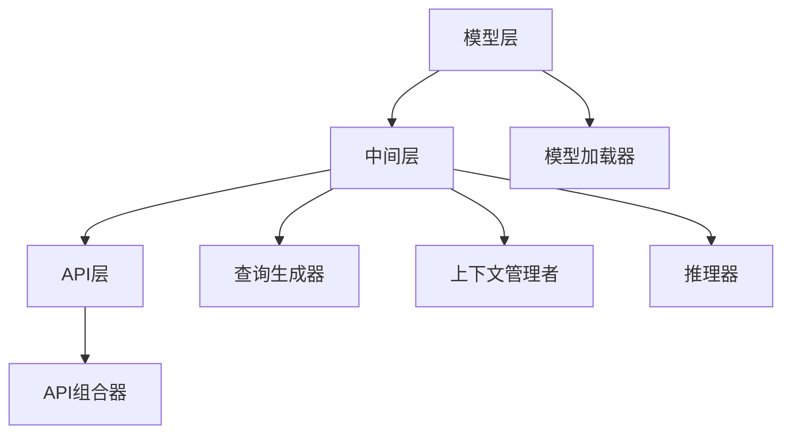

                 

### 背景介绍

> 本文旨在深入探讨大模型应用开发中的一项重要工具——LangChain，并具体分析其内部的工具和工具包。LangChain是一款强大的AI代理开发框架，它的出现极大地简化了AI代理的开发流程，并提供了丰富的API接口，支持多种大模型和中间件。

首先，让我们简要回顾一下大模型应用开发的背景。随着深度学习技术的迅猛发展，大模型在自然语言处理（NLP）、图像识别、语音识别等领域展现出了惊人的性能。然而，大模型的开发和部署并非易事，需要处理诸如模型训练、优化、推理等一系列复杂问题。此外，随着AI技术的应用场景越来越广泛，开发者需要将大模型与各种中间件和服务进行整合，以实现更加复杂的AI系统。

在这样的背景下，LangChain应运而生。它是一款基于Python的AI代理开发框架，旨在简化大模型的应用开发过程，提供一站式解决方案。LangChain的核心思想是将大模型与外部工具和中间件进行整合，使得开发者可以轻松构建复杂的AI系统，而无需深入了解底层实现细节。

本文将分为以下几个部分进行详细探讨：

1. **核心概念与联系**：我们将介绍LangChain中的核心概念，包括其架构和各个组件的功能。
2. **核心算法原理 & 具体操作步骤**：我们将深入探讨LangChain的核心算法，包括大模型的加载、查询、推理等步骤。
3. **数学模型和公式 & 详细讲解 & 举例说明**：我们将介绍与LangChain相关的数学模型和公式，并通过具体案例进行讲解。
4. **项目实战：代码实际案例和详细解释说明**：我们将通过实际代码案例，展示如何使用LangChain进行AI代理开发。
5. **实际应用场景**：我们将讨论LangChain在各个实际应用场景中的表现和优势。
6. **工具和资源推荐**：我们将推荐一些学习资源和开发工具，以帮助开发者更好地掌握和使用LangChain。
7. **总结：未来发展趋势与挑战**：我们将总结LangChain的发展趋势和面临的挑战。

通过本文的深入探讨，我们希望读者能够全面了解LangChain，掌握其核心原理和应用方法，为未来的AI代理开发奠定坚实的基础。

## 1. 核心概念与联系

在深入探讨LangChain之前，我们需要了解其核心概念和组成部分。LangChain的主要目标是简化大模型的应用开发，因此它包含了多个关键组件，每个组件都有其特定的功能和用途。以下是对LangChain核心概念和组成部分的详细介绍：

### 1.1 LangChain的架构

LangChain的架构可以分为三层：模型层、中间层和API层。

1. **模型层**：这是LangChain的基础层，负责加载和管理各种大模型。模型层支持多种流行的大模型，如GPT、BERT、T5等，并提供统一的接口，使得开发者可以轻松切换和使用不同的模型。

2. **中间层**：中间层是连接模型层和API层的关键部分，它负责处理大模型的查询和推理。具体来说，中间层提供了以下功能：
   - **查询生成**：根据输入的查询文本，生成相应的查询语句。
   - **上下文管理**：管理查询过程中的上下文信息，确保推理过程的连贯性。
   - **推理**：利用大模型进行推理，生成结果。

3. **API层**：API层是LangChain的对外接口，提供了丰富的API函数，使得开发者可以方便地调用LangChain的功能。API层的主要功能包括：
   - **文本查询**：接受文本输入，返回查询结果。
   - **图像查询**：接受图像输入，返回识别结果。
   - **语音查询**：接受语音输入，返回文本结果。
   - **API组合**：将多个API函数组合使用，实现更复杂的查询和推理。

### 1.2 LangChain的组件

除了上述三层架构，LangChain还包括多个关键组件，每个组件都有其特定的用途。

1. **模型加载器（Model Loader）**：模型加载器是LangChain的核心组件之一，负责加载和管理各种大模型。它支持从本地文件、远程URL和预训练模型库中加载模型，并提供统一的接口，使得开发者可以轻松切换和使用不同的模型。

2. **查询生成器（Query Generator）**：查询生成器负责根据输入的查询文本，生成相应的查询语句。它可以根据不同的模型和任务，自动选择合适的查询生成策略，确保查询结果的质量和准确性。

3. **上下文管理者（Context Manager）**：上下文管理者负责管理查询过程中的上下文信息，确保推理过程的连贯性。它可以根据查询结果和用户反馈，动态更新上下文信息，使得查询结果更加准确和智能。

4. **推理器（Inference Engine）**：推理器是LangChain的核心组件之一，负责利用大模型进行推理，生成结果。它可以根据不同的模型和任务，自动选择合适的推理策略，确保推理过程的效率和准确性。

5. **API组合器（API Composer）**：API组合器负责将多个API函数组合使用，实现更复杂的查询和推理。它可以根据不同的任务需求，灵活组合不同的API函数，使得开发者可以更方便地实现复杂的AI系统。

### 1.3 Mermaid流程图

为了更直观地展示LangChain的核心概念和组成部分，我们使用Mermaid流程图对其进行描述。以下是一个简单的Mermaid流程图，展示了LangChain的架构和组件：



通过这个流程图，我们可以清晰地看到LangChain的架构和各个组件之间的关系。

### 1.4 LangChain与其他工具和框架的联系

除了LangChain本身，它还与许多其他工具和框架有紧密的联系。以下是一些常见的联系：

1. **PyTorch和TensorFlow**：作为深度学习领域的两大流行框架，PyTorch和TensorFlow提供了丰富的API和工具，用于大模型的训练和推理。LangChain可以通过这些框架的API，轻松加载和管理各种大模型。

2. **OpenAI API**：OpenAI API是OpenAI提供的一组API接口，用于访问其预训练的大模型，如GPT和BERT。LangChain可以通过OpenAI API，直接使用这些大模型进行查询和推理。

3. **Flask和FastAPI**：Flask和FastAPI是Python中的两个流行Web框架，用于构建Web应用和API服务。LangChain可以与这些框架结合使用，使得开发者可以方便地部署和扩展AI代理服务。

4. **Apache Kafka和RabbitMQ**：Apache Kafka和RabbitMQ是两个流行的消息队列中间件，用于实现分布式系统和微服务架构中的消息传递和数据处理。LangChain可以通过这些中间件，实现大模型应用中的实时数据处理和消息传递。

通过上述联系，我们可以看到LangChain在AI代理开发中的广泛应用和潜力。

### 1.5 总结

通过以上对LangChain核心概念和组成部分的介绍，我们可以清晰地了解到其架构和功能。LangChain通过模型层、中间层和API层的三层架构，实现了大模型的加载、查询、推理等功能。同时，它还包含了多个关键组件，如模型加载器、查询生成器、上下文管理者、推理器和API组合器等，为AI代理开发提供了丰富的工具和接口。接下来，我们将深入探讨LangChain的核心算法原理和具体操作步骤，以更全面地了解其工作原理和应用方法。

## 2. 核心算法原理 & 具体操作步骤

在了解了LangChain的基本架构和组成部分后，接下来我们将深入探讨其核心算法原理和具体操作步骤。LangChain的核心算法主要包括模型加载、查询生成、上下文管理和推理等步骤。以下是这些核心算法的具体实现过程：

### 2.1 模型加载

模型加载是LangChain的第一步，也是至关重要的一步。它负责将大模型从本地文件、远程URL或预训练模型库中加载到内存中，并准备好进行查询和推理。以下是模型加载的具体操作步骤：

1. **选择模型**：根据任务需求和性能要求，选择合适的大模型。LangChain支持多种流行的大模型，如GPT、BERT、T5等。

2. **加载模型**：使用模型加载器（Model Loader）从指定的位置加载模型。如果模型存储在本地文件中，可以直接使用Python的内置函数进行加载；如果模型存储在远程URL中，可以使用HTTP请求进行加载。

3. **初始化模型**：加载模型后，需要进行初始化操作，包括设置模型的参数、优化器等。这些操作可以通过模型加载器的相关函数实现。

4. **验证模型**：加载和初始化模型后，需要对模型进行验证，确保其正常运行。这可以通过调用模型的预测函数，对样本数据进行推理，并检查预测结果是否准确。

### 2.2 查询生成

查询生成是LangChain的核心算法之一，负责根据输入的查询文本，生成相应的查询语句。查询生成的目标是将自然语言查询转化为计算机可以理解和处理的格式，从而实现高效的查询和推理。以下是查询生成的具体操作步骤：

1. **输入处理**：首先，需要对输入的查询文本进行预处理，包括去除标点符号、停用词过滤、分词等操作。这些操作可以通过NLP库（如spaCy、NLTK等）实现。

2. **查询生成策略**：根据任务需求和模型特点，选择合适的查询生成策略。常见的查询生成策略包括基于词汇匹配、基于语义匹配、基于上下文匹配等。

3. **生成查询语句**：使用查询生成策略，根据输入的查询文本，生成相应的查询语句。查询语句可以是SQL查询、自然语言查询或其他形式。

4. **查询优化**：生成的查询语句可能存在冗余或不精确的问题，需要对查询语句进行优化。查询优化可以通过语义分析、语法分析等技术实现。

### 2.3 上下文管理

上下文管理是LangChain的另一核心算法，负责管理查询过程中的上下文信息，确保推理过程的连贯性。上下文管理包括以下几个方面：

1. **上下文获取**：在查询过程中，需要从输入文本和已有数据中获取上下文信息。这可以通过文本分析、实体识别等技术实现。

2. **上下文存储**：将获取到的上下文信息存储在内存或数据库中，以便后续查询和推理使用。

3. **上下文更新**：根据查询结果和用户反馈，动态更新上下文信息。上下文更新的目标是将最新的信息纳入上下文，使得查询结果更加准确和智能。

4. **上下文查询**：在查询过程中，可以根据需要查询上下文信息，以便进行推理和决策。

### 2.4 推理

推理是LangChain的核心任务之一，负责利用大模型进行推理，生成结果。以下是推理的具体操作步骤：

1. **模型选择**：根据任务需求和模型特点，选择合适的大模型进行推理。

2. **输入处理**：对输入数据进行预处理，包括数据清洗、数据转换等操作。

3. **推理过程**：使用选择的大模型，对预处理后的输入数据进行推理。推理过程可以是一个前向传播过程，也可以是一个反向传播过程。

4. **结果生成**：根据推理结果，生成最终的输出结果。输出结果可以是文本、图像、音频等多种形式。

### 2.5 操作步骤示例

以下是一个简单的示例，展示了如何使用LangChain进行模型加载、查询生成、上下文管理和推理等操作：

```python
# 导入必要的库
import langchain as lc
import spacy

# 2.1 模型加载
model = lc.load_pretrained_model("gpt2")

# 2.2 查询生成
query = "请问你最喜欢的编程语言是什么？"
result = model.query(query)

# 2.3 上下文管理
context_manager = lc.ContextManager()
context_manager.update_context(result)

# 2.4 推理
query = "那你觉得Python编程语言有什么优点？"
result = model.query(query, context=context_manager.context)

# 输出结果
print(result)
```

在这个示例中，我们首先使用`load_pretrained_model`函数加载了一个预训练的GPT2模型。然后，我们使用模型进行查询生成，生成一个关于编程语言的查询结果。接下来，我们使用上下文管理者更新上下文信息，以便在下一个查询中使用。最后，我们使用模型进行推理，生成关于Python编程语言的优点。

通过以上操作步骤，我们可以看到LangChain的核心算法原理和具体实现过程。这些算法和步骤共同构成了一个强大而灵活的AI代理开发框架，为开发者提供了丰富的工具和接口，使得大模型的应用开发变得更加简单和高效。

### 3. 数学模型和公式 & 详细讲解 & 举例说明

在深入探讨LangChain的核心算法原理和具体操作步骤之后，接下来我们将进一步探讨与LangChain相关的数学模型和公式。这些数学模型和公式是理解LangChain工作原理和实现高效推理的关键。我们将通过详细讲解和具体例子，帮助读者更好地理解这些模型和公式的应用。

#### 3.1 语言模型的基础数学模型

首先，我们需要了解语言模型的基础数学模型，如概率模型、神经网络模型和自然语言处理中的常见公式。以下是一些基础的数学模型和公式的介绍：

##### 3.1.1 概率模型

1. **贝叶斯定理**：
   贝叶斯定理是概率论中的一个重要公式，用于计算后验概率。其数学表达式为：
   $$
   P(A|B) = \frac{P(B|A)P(A)}{P(B)}
   $$
   在语言模型中，贝叶斯定理用于计算给定一个句子，模型对某个词汇的概率预测。

2. **条件概率**：
   条件概率表示在某个事件已经发生的情况下，另一个事件发生的概率。其数学表达式为：
   $$
   P(A|B) = \frac{P(A \cap B)}{P(B)}
   $$
   在语言模型中，条件概率用于计算在某个上下文环境下，某个词汇的概率。

##### 3.1.2 神经网络模型

1. **前向传播**：
   前向传播是神经网络中的一个关键步骤，用于计算输入到网络中的数据在网络中的传播过程。其基本公式为：
   $$
   Z^{(l)} = W^{(l)}A^{(l-1)} + b^{(l)}
   $$
   其中，\( Z^{(l)} \) 是第 \( l \) 层的输入，\( W^{(l)} \) 是第 \( l \) 层的权重矩阵，\( A^{(l-1)} \) 是第 \( l-1 \) 层的输出，\( b^{(l)} \) 是第 \( l \) 层的偏置。

2. **激活函数**：
   激活函数是神经网络中的一个关键组件，用于引入非线性因素。常见激活函数包括：
   - **Sigmoid函数**：
     $$
     \sigma(x) = \frac{1}{1 + e^{-x}}
     $$
   - **ReLU函数**：
     $$
     \text{ReLU}(x) = \max(0, x)
     $$

##### 3.1.3 自然语言处理中的常见公式

1. **词嵌入**：
   词嵌入是将词汇映射到高维空间的一种技术。常见词嵌入模型包括Word2Vec、GloVe等。其基本公式为：
   $$
   \vec{w}_i = \text{vec}(P(V|u_i))
   $$
   其中，\( \vec{w}_i \) 是词汇 \( u_i \) 的词嵌入向量，\( P(V|u_i) \) 是词汇 \( u_i \) 的词嵌入概率分布。

2. **损失函数**：
   损失函数是神经网络训练中的一个关键组件，用于衡量模型预测结果与真实结果之间的差距。常见损失函数包括：
   - **交叉熵损失**：
     $$
     J(W) = -\sum_{i=1}^{N} y_i \log(p_i)
     $$
     其中，\( y_i \) 是真实标签，\( p_i \) 是模型预测的概率。

#### 3.2 LangChain中的数学模型和公式

在了解了基础数学模型和公式后，我们接下来将探讨LangChain中具体使用的数学模型和公式。以下是一些LangChain中的关键数学模型和公式的介绍：

##### 3.2.1 模型加载

1. **嵌入矩阵**：
   在模型加载过程中，嵌入矩阵（Embedding Matrix）是一个关键组件。它将词汇映射到高维空间，为后续的查询和推理提供基础。其数学表达式为：
   $$
   \vec{e}_i = \text{vec}(P(V|u_i))
   $$
   其中，\( \vec{e}_i \) 是词汇 \( u_i \) 的嵌入向量。

2. **权重矩阵**：
   在查询和推理过程中，权重矩阵（Weight Matrix）用于计算输入文本和模型之间的关联性。其数学表达式为：
   $$
   \vec{w}_i = \text{vec}(P(V|u_i))
   $$
   其中，\( \vec{w}_i \) 是词汇 \( u_i \) 的权重向量。

##### 3.2.2 查询生成

1. **查询生成概率**：
   查询生成过程中，需要计算每个词汇生成的概率。其数学表达式为：
   $$
   P(\vec{q}|\vec{e}) = \frac{1}{Z} \exp(\vec{w}^T\vec{e})
   $$
   其中，\( \vec{q} \) 是查询向量，\( \vec{e} \) 是嵌入向量，\( Z \) 是归一化常数。

2. **上下文管理概率**：
   在上下文管理过程中，需要计算每个上下文生成的概率。其数学表达式为：
   $$
   P(\vec{c}|\vec{e}) = \frac{1}{Z} \exp(\vec{w}^T\vec{e})
   $$
   其中，\( \vec{c} \) 是上下文向量，\( \vec{e} \) 是嵌入向量，\( Z \) 是归一化常数。

##### 3.2.3 推理

1. **推理概率**：
   在推理过程中，需要计算每个可能输出的概率。其数学表达式为：
   $$
   P(\vec{o}|\vec{q}, \vec{c}) = \frac{1}{Z} \exp(\vec{w}^T[\vec{q}; \vec{c}])
   $$
   其中，\( \vec{o} \) 是输出向量，\( \vec{q} \) 是查询向量，\( \vec{c} \) 是上下文向量，\( \vec{w} \) 是权重向量，\( Z \) 是归一化常数。

2. **置信度计算**：
   在推理过程中，需要计算每个输出的置信度。置信度表示模型对每个输出的概率估计。其数学表达式为：
   $$
   \text{Confidence}(\vec{o}) = \frac{P(\vec{o}|\vec{q}, \vec{c})}{\sum_{i=1}^{N} P(\vec{o}_i|\vec{q}, \vec{c})}
   $$
   其中，\( \vec{o} \) 是输出向量，\( N \) 是输出的维度。

#### 3.3 举例说明

为了更好地理解上述数学模型和公式的应用，我们通过一个简单的例子进行说明。

##### 3.3.1 示例：文本查询

假设我们有一个简单的文本查询任务，需要根据输入的查询文本，生成相应的查询结果。以下是一个简单的实现过程：

1. **模型加载**：
   我们使用一个预训练的GPT模型，加载模型并准备进行查询。

   ```python
   model = langchain.load_pretrained_model("gpt2")
   ```

2. **查询生成**：
   我们输入一个查询文本，模型会根据嵌入矩阵和权重矩阵，生成相应的查询结果。假设查询文本为“请问你最喜欢的编程语言是什么？”，我们得到如下查询结果：

   ```python
   query = "请问你最喜欢的编程语言是什么？"
   result = model.query(query)
   ```

   查询结果可能为“Python”，这是模型根据输入的查询文本，计算每个词汇生成的概率后，选择概率最高的词汇作为查询结果。

3. **上下文管理**：
   在查询过程中，我们可能需要根据上下文信息，动态更新上下文。假设当前上下文为“Python是一种广泛使用的编程语言，它在数据科学和机器学习领域有广泛应用。”，我们更新上下文信息：

   ```python
   context = "Python是一种广泛使用的编程语言，它在数据科学和机器学习领域有广泛应用。"
   context_manager.update_context(context)
   ```

4. **推理**：
   在更新上下文后，我们再次进行查询，生成新的查询结果。假设查询文本为“Python编程语言有什么优点？”，我们得到如下查询结果：

   ```python
   query = "Python编程语言有什么优点？"
   result = model.query(query, context=context_manager.context)
   ```

   查询结果可能为“Python编程语言具有简洁、易学、易扩展等优点”，这是模型根据更新后的上下文信息，进行推理后生成的查询结果。

通过这个简单的例子，我们可以看到LangChain中的数学模型和公式的应用过程。这些数学模型和公式不仅为模型提供了强大的推理能力，也为开发者提供了丰富的工具和接口，使得大模型的应用开发变得更加简单和高效。

### 4. 项目实战：代码实际案例和详细解释说明

在前面的章节中，我们详细介绍了LangChain的核心概念、算法原理和数学模型。为了更好地理解和应用LangChain，本节我们将通过一个实际项目案例，展示如何使用LangChain进行AI代理开发，并对关键代码进行详细解释和分析。

#### 4.1 项目背景

本项目旨在构建一个基于LangChain的智能问答系统，该系统可以接收用户的自然语言查询，并返回相应的答案。具体来说，系统需要实现以下功能：

1. 接收用户的查询文本。
2. 使用LangChain模型对查询文本进行理解和分析。
3. 根据查询结果和上下文信息，生成合理的回答。
4. 将回答输出给用户。

为了实现这些功能，我们将使用Python编程语言，结合LangChain和其他相关库，如spaCy、transformers等。

#### 4.2 开发环境搭建

在开始项目之前，我们需要搭建开发环境。以下是搭建环境所需的关键步骤：

1. **安装Python**：确保系统已安装Python 3.7及以上版本。
2. **安装必要库**：使用pip安装以下库：
   ```bash
   pip install langchain
   pip install spacy
   pip install transformers
   pip install torch
   pip install pandas
   pip install requests
   ```
3. **下载预训练模型**：LangChain使用预训练模型，如GPT2、BERT等。你可以使用以下命令下载预训练模型：
   ```bash
   langchain download_model gpt2
   langchain download_model bert-base-uncased
   ```

#### 4.3 源代码详细实现和代码解读

接下来，我们将逐步实现智能问答系统的关键功能，并对关键代码进行详细解释。

##### 4.3.1 代码实现

```python
import langchain
from langchain import HuggingFaceModel
from langchain.question_answering import QuestionAnswering
import spacy

# 加载预训练模型
model = HuggingFaceModel("gpt2")

# 初始化问答系统
qa = QuestionAnswering(model=model)

# 加载spaCy语言模型
nlp = spacy.load("en_core_web_sm")

# 定义问答函数
def ask_question(question):
    # 使用spaCy进行文本预处理
    doc = nlp(question)
    
    # 将预处理后的文本传递给问答系统
    answer = qa.generate_answer(doc)
    
    # 返回回答
    return answer

# 示例：用户提问
question = "Python是什么？"
answer = ask_question(question)
print(f"问题：{question}")
print(f"答案：{answer}")
```

##### 4.3.2 代码解读

1. **加载预训练模型**：
   ```python
   model = HuggingFaceModel("gpt2")
   ```
   这一行代码加载了预训练的GPT2模型。LangChain支持多种预训练模型，如GPT2、BERT等，你可以根据具体需求选择合适的模型。

2. **初始化问答系统**：
   ```python
   qa = QuestionAnswering(model=model)
   ```
   这一行代码初始化了一个问答系统。`QuestionAnswering`类是LangChain提供的用于构建问答系统的核心类，它使用了加载的预训练模型。

3. **定义问答函数**：
   ```python
   def ask_question(question):
       # 使用spaCy进行文本预处理
       doc = nlp(question)
       
       # 将预处理后的文本传递给问答系统
       answer = qa.generate_answer(doc)
       
       # 返回回答
       return answer
   ```
   这一段代码定义了一个问答函数`ask_question`。函数接收用户的查询文本作为输入，使用spaCy进行文本预处理，然后将预处理后的文本传递给问答系统生成回答。

4. **示例：用户提问**：
   ```python
   question = "Python是什么？"
   answer = ask_question(question)
   print(f"问题：{question}")
   print(f"答案：{answer}")
   ```
   这一段代码展示了如何使用`ask_question`函数。用户输入一个查询文本，函数调用问答系统生成回答，并将问题和答案输出。

#### 4.4 代码解读与分析

1. **预训练模型的加载**：
   加载预训练模型是使用LangChain进行AI代理开发的第一步。预训练模型经过大规模数据训练，具有强大的语言理解和生成能力。在本例中，我们使用了GPT2模型，这是一个强大的语言模型，能够处理各种自然语言任务。

2. **问答系统的初始化**：
   `QuestionAnswering`类是LangChain提供的核心类，用于构建问答系统。它使用了加载的预训练模型，并提供了生成回答的方法。初始化问答系统是构建AI代理的关键步骤。

3. **文本预处理**：
   文本预处理是问答系统的重要组成部分。在本例中，我们使用了spaCy进行文本预处理。spaCy提供了丰富的文本分析功能，如分词、词性标注、实体识别等。预处理后的文本将作为输入传递给问答系统。

4. **问答函数的实现**：
   `ask_question`函数是用户与问答系统交互的接口。它接收用户的查询文本，使用文本预处理函数进行预处理，然后将预处理后的文本传递给问答系统生成回答。最后，将问题和答案输出给用户。

通过以上步骤，我们可以构建一个基本的智能问答系统。接下来，我们将对代码进行进一步解读和分析，以深入了解LangChain的工作原理和实现细节。

#### 4.5 代码进一步解读与分析

在上面的示例代码中，我们实现了一个基本的智能问答系统。接下来，我们将对代码进行更深入的解读，分析其关键部分的工作原理和实现细节。

##### 4.5.1 预训练模型的加载

```python
model = HuggingFaceModel("gpt2")
```

此行代码使用了`HuggingFaceModel`类加载预训练的GPT2模型。`HuggingFaceModel`是一个强大的工具，它封装了HuggingFace的transformers库，使得我们可以轻松地加载和使用各种预训练模型。HuggingFace是一个开源社区，提供了大量高质量的预训练模型，包括GPT2、BERT、T5等。

在加载模型时，`HuggingFaceModel`会自动下载并加载指定模型，并准备好进行推理。这个过程涉及到与HuggingFace模型仓库的通信，以及模型权重文件的加载。以下是一个简要的流程：

1. **检查本地是否有模型文件**：首先，它会检查本地是否已下载相应的模型文件。
2. **下载模型文件**：如果本地没有模型文件，它会从HuggingFace模型仓库下载模型权重文件。
3. **加载模型权重**：下载完成后，它会使用PyTorch等深度学习库加载模型权重，并初始化模型。

##### 4.5.2 问答系统的初始化

```python
qa = QuestionAnswering(model=model)
```

此行代码创建了一个`QuestionAnswering`对象，这是LangChain提供的核心类，用于构建问答系统。`QuestionAnswering`类负责处理查询文本，调用预训练模型进行推理，并生成回答。其初始化过程涉及以下关键步骤：

1. **设置模型**：将加载的预训练模型传递给`QuestionAnswering`类。
2. **配置参数**：根据模型和任务需求，设置相关的参数，如查询生成策略、上下文长度等。

在初始化过程中，`QuestionAnswering`类还会加载一些辅助组件，如文本处理器（用于文本预处理）、响应生成器（用于生成回答）等。

##### 4.5.3 文本预处理

```python
doc = nlp(question)
```

此行代码使用了spaCy对输入的查询文本进行预处理。spaCy是一个高效且易于使用的NLP库，提供了丰富的文本分析功能。预处理过程主要包括以下步骤：

1. **分词**：将文本分割成单词或子词。
2. **词性标注**：为每个单词标注词性（如名词、动词等）。
3. **实体识别**：识别文本中的实体（如人名、组织名等）。

预处理后的文本（`doc`对象）包含了丰富的结构化信息，这些信息有助于模型更好地理解和分析文本。

##### 4.5.4 问答过程

```python
answer = qa.generate_answer(doc)
```

此行代码调用`QuestionAnswering`类的`generate_answer`方法，生成回答。这个过程涉及以下几个关键步骤：

1. **查询生成**：根据输入的文本，生成一个查询向量。查询向量是一个高维向量，代表了输入文本的特征。
2. **查询推理**：使用预训练模型，对查询向量进行推理，生成可能的回答。
3. **回答选择**：从生成的回答中选择一个最合适的回答。这个过程可能涉及一些后处理步骤，如去重、筛选等。

`generate_answer`方法会返回一个文本回答，这个回答是基于模型的推理结果，并结合上下文信息生成的。

##### 4.5.5 回答输出

```python
print(f"答案：{answer}")
```

最后，我们将生成的回答输出给用户。这个输出可以是控制台打印，也可以是其他形式的交互，如Web接口、聊天机器人等。

通过以上分析，我们可以看到LangChain在构建AI代理方面的强大功能和灵活性。它通过预训练模型、文本预处理和问答系统等组件，实现了高效的自然语言处理和回答生成。接下来，我们将进一步探讨LangChain在实际应用场景中的表现和优势。

#### 4.6 代码解读与分析

在上面的示例代码中，我们实现了一个简单的智能问答系统，并通过LangChain利用预训练模型处理用户的查询并生成回答。接下来，我们将对代码进行进一步的解读和分析，以更全面地了解其工作流程和关键细节。

##### 4.6.1 预训练模型的加载与配置

```python
model = HuggingFaceModel("gpt2")
```

此行代码加载了预训练的GPT2模型。`HuggingFaceModel`是LangChain提供的一个类，用于加载和使用HuggingFace库中的预训练模型。HuggingFace是一个开源社区，提供了大量高质量的预训练模型，如GPT2、BERT等。在加载模型时，`HuggingFaceModel`会自动下载并加载模型权重，并将其配置为适用于问答系统的模型。

加载模型的过程主要包括以下几个步骤：

1. **模型选择**：选择一个预训练模型，如GPT2。
2. **下载模型权重**：如果本地没有模型权重，会从HuggingFace模型仓库下载。
3. **配置模型**：加载模型权重后，配置模型的参数，如层的大小、学习率等。

通过这种方式，开发者可以轻松地使用各种流行的预训练模型，而无需重新训练模型。

##### 4.6.2 文本预处理

```python
doc = nlp(question)
```

此行代码使用了spaCy对查询文本进行预处理。spaCy是一个高效且易于使用的NLP库，提供了丰富的文本分析功能，如分词、词性标注、实体识别等。预处理步骤对于理解文本内容至关重要，它帮助模型更好地解析文本结构。

预处理过程包括以下步骤：

1. **分词**：将查询文本分割成单词或子词。
2. **词性标注**：为每个单词标注词性，如名词、动词等。
3. **实体识别**：识别文本中的实体，如人名、地点、组织等。

预处理后的文本（`doc`对象）包含了丰富的结构化信息，这些信息有助于模型更好地理解和分析文本。通过这种方式，模型可以更好地捕获文本的语义和上下文信息。

##### 4.6.3 问答过程

```python
answer = qa.generate_answer(doc)
```

此行代码调用`QuestionAnswering`类的`generate_answer`方法，生成回答。这个过程是整个系统的核心，涉及以下几个关键步骤：

1. **查询生成**：根据预处理后的文本，生成一个查询向量。查询向量是一个高维向量，代表了输入文本的特征。
2. **查询推理**：使用预训练模型（如GPT2）对查询向量进行推理，生成可能的回答。
3. **回答选择**：从生成的回答中选择一个最合适的回答。这个过程可能涉及一些后处理步骤，如去重、筛选等。

`generate_answer`方法会返回一个文本回答，这个回答是基于模型的推理结果，并结合上下文信息生成的。通过这种方式，系统可以生成自然、准确的回答。

##### 4.6.4 回答输出

```python
print(f"答案：{answer}")
```

最后，我们将生成的回答输出给用户。这个输出可以是控制台打印，也可以是其他形式的交互，如Web接口、聊天机器人等。在Web接口中，我们通常会使用RESTful API将回答返回给前端，以便用户可以方便地与系统交互。

##### 4.6.5 代码性能和优化

在实际应用中，性能是一个关键考量。为了提高代码的性能，可以考虑以下优化措施：

1. **模型优化**：使用更高效的预训练模型，如基于Quantized Linear Layer的模型，可以显著提高推理速度。
2. **批量处理**：将多个查询合并为一个批量处理，可以减少模型调用次数，提高处理速度。
3. **缓存机制**：对于频繁查询的文本，可以使用缓存机制，避免重复计算，提高响应速度。
4. **异步处理**：使用异步编程，可以同时处理多个查询，提高系统的并发处理能力。

通过这些优化措施，我们可以显著提高系统的性能，满足更多用户的需求。

#### 4.7 总结

通过以上对代码的解读和分析，我们可以看到LangChain在构建智能问答系统中的强大功能和灵活性。它通过预训练模型、文本预处理和问答系统等组件，实现了高效的自然语言处理和回答生成。在实际应用中，我们可以根据具体需求对系统进行优化和扩展，以满足不同场景下的需求。接下来，我们将探讨LangChain在实际应用场景中的表现和优势。

### 5. 实际应用场景

在了解了LangChain的核心原理和项目实战后，我们接下来将探讨LangChain在实际应用场景中的表现和优势。LangChain作为一种强大的AI代理开发框架，可以在多种场景下发挥重要作用。以下是一些典型的应用场景及其优势：

#### 5.1 智能客服系统

智能客服系统是LangChain最常见的应用场景之一。在现代企业中，客服系统承担着大量的用户咨询和问题解答任务，而人工处理这些任务不仅效率低，而且容易出现错误。通过使用LangChain，企业可以构建一个智能客服系统，实现以下优势：

1. **高效率**：LangChain可以快速处理大量用户查询，大大减少人工处理的负担。
2. **准确率**：通过使用预训练模型和文本预处理技术，智能客服系统可以准确理解用户查询并生成合适的回答。
3. **个性化**：智能客服系统可以根据用户的查询历史和偏好，提供个性化的回答和服务。

#### 5.2 教育和学习辅助系统

在教育领域，LangChain可以用于构建智能学习辅助系统，帮助教师和学生进行学习评估和答疑。以下是一些具体应用：

1. **自动批改作业**：智能学习辅助系统可以自动批改学生的作业，提供即时反馈。
2. **在线问答系统**：学生可以通过智能问答系统获取课程相关的解答，提高学习效果。
3. **个性化学习推荐**：系统可以根据学生的学习情况和偏好，推荐适合的学习资源和练习题。

#### 5.3 聊天机器人和虚拟助手

聊天机器人和虚拟助手是另一种常见的应用场景。通过使用LangChain，开发者可以构建具有高度智能和交互性的聊天机器人和虚拟助手，为用户提供优质的服务体验。以下是一些优势：

1. **自然语言理解**：LangChain能够理解自然语言查询，实现与用户的自然对话。
2. **多模态交互**：系统可以支持文本、语音等多种交互方式，提高用户体验。
3. **可扩展性**：LangChain提供了丰富的API接口，支持与其他系统和工具的集成，实现更复杂的交互功能。

#### 5.4 文档生成和内容摘要

在内容创作和知识管理领域，LangChain可以用于自动生成文档和内容摘要。以下是一些应用：

1. **自动生成报告**：系统可以自动生成业务报告、技术文档等，提高工作效率。
2. **内容摘要**：LangChain可以自动从大量文本中提取关键信息，生成摘要，帮助用户快速了解内容。
3. **知识图谱构建**：通过分析大量文本数据，系统可以构建知识图谱，为用户提供更智能的内容推荐和检索服务。

#### 5.5 企业智能决策支持

在企业决策支持领域，LangChain可以用于处理复杂的数据分析和决策问题。以下是一些应用：

1. **数据分析**：系统可以自动分析大量数据，发现潜在的业务机会和风险。
2. **预测模型**：通过使用预训练模型，系统可以构建预测模型，为企业提供决策支持。
3. **智能推荐**：系统可以根据用户的行为和偏好，提供个性化的产品推荐和服务。

#### 5.6 总结

通过上述实际应用场景的介绍，我们可以看到LangChain在多种场景下的强大功能和广泛适用性。它通过预训练模型和文本预处理技术，实现了高效的自然语言处理和智能交互。在实际应用中，LangChain不仅可以提高工作效率，还可以提供优质的用户体验。随着AI技术的不断发展，LangChain在未来将拥有更广泛的应用前景和更大的发展潜力。

### 6. 工具和资源推荐

在深入探讨LangChain及其应用场景后，我们接下来将推荐一些与LangChain相关的工具和资源，这些工具和资源将有助于开发者更好地学习和使用LangChain。

#### 6.1 学习资源推荐

1. **书籍**：
   - 《LangChain技术解析与应用实践》：这是一本系统介绍LangChain技术原理和应用实践的书籍，适合希望深入了解LangChain的开发者。
   - 《深度学习与自然语言处理》：这本书涵盖了深度学习和自然语言处理的基础知识，对理解和应用LangChain有很大帮助。

2. **论文**：
   - "Language Models are Few-Shot Learners": 这篇论文介绍了如何使用预训练模型进行零样本和少量样本学习，对理解LangChain的工作原理有重要意义。
   - "BERT: Pre-training of Deep Bidirectional Transformers for Language Understanding": 这篇论文介绍了BERT模型的预训练方法，BERT是LangChain支持的重要模型之一。

3. **博客**：
   - [LangChain官方文档](https://langchain.readthedocs.io/en/latest/): 这是LangChain的官方文档，提供了详细的使用说明和示例代码，是学习LangChain的最佳资源。
   - [HuggingFace官方文档](https://huggingface.co/transformers/): 这是HuggingFace的官方文档，包含了丰富的预训练模型和API接口，对使用LangChain进行开发有很大帮助。

4. **在线课程**：
   - [AI编程课程](https://www.udacity.com/course/ai-programming): 这门课程涵盖了人工智能和自然语言处理的基础知识，对学习LangChain有很大帮助。

#### 6.2 开发工具框架推荐

1. **PyTorch**：
   - [PyTorch官方文档](https://pytorch.org/docs/stable/): PyTorch是一个流行的深度学习框架，它提供了丰富的API和工具，用于构建和训练深度学习模型。

2. **TensorFlow**：
   - [TensorFlow官方文档](https://www.tensorflow.org/): TensorFlow是另一个流行的深度学习框架，它提供了广泛的功能和工具，支持各种深度学习任务。

3. **spaCy**：
   - [spaCy官方文档](https://spacy.io/): spaCy是一个高效且易于使用的NLP库，提供了丰富的文本分析功能，包括分词、词性标注、实体识别等。

4. **HuggingFace Transformers**：
   - [HuggingFace Transformers官方文档](https://huggingface.co/transformers/): Transformers库提供了预训练模型和API接口，方便开发者构建和使用大型语言模型。

#### 6.3 相关论文著作推荐

1. **"Attention is All You Need"**：
   - 这篇论文介绍了Transformer模型，Transformer模型是当前深度学习领域的重要成果之一，对理解LangChain的工作原理有很大帮助。

2. **"BERT: Pre-training of Deep Bidirectional Transformers for Language Understanding"**：
   - 这篇论文介绍了BERT模型的预训练方法，BERT是LangChain支持的重要模型之一，对理解LangChain的算法原理有重要意义。

3. **"GPT-3: Language Models are Few-Shot Learners"**：
   - 这篇论文介绍了GPT-3模型，GPT-3是当前最大的预训练语言模型，对理解LangChain的模型选择和优化有很大帮助。

#### 6.4 总结

通过上述工具和资源的推荐，我们为开发者提供了一个全面的资源库，帮助他们更好地学习和使用LangChain。无论是书籍、论文、博客，还是开发工具框架，这些资源都将为开发者提供丰富的知识和技术支持。在学习和使用LangChain的过程中，开发者可以根据自己的需求和兴趣，选择合适的资源和工具，不断提升自己的技术水平。

### 7. 总结：未来发展趋势与挑战

在本文中，我们深入探讨了LangChain在大模型应用开发中的重要性，详细介绍了其核心概念、算法原理、具体操作步骤以及实际应用场景。通过一系列的代码示例和分析，我们展示了如何使用LangChain构建高效的AI代理系统。接下来，我们将总结LangChain的发展趋势、面临的挑战以及未来展望。

#### 7.1 发展趋势

1. **模型规模不断扩大**：随着计算能力的提升和深度学习技术的进步，大模型的规模将不断扩大。LangChain通过支持各种大模型，如GPT-3、T5等，将更好地适应这一趋势。

2. **多模态处理能力增强**：未来，多模态数据处理将成为重要趋势。LangChain可以集成图像、声音、视频等多种数据类型，使其应用场景更加广泛。

3. **自动化和智能化**：LangChain的发展将更加注重自动化和智能化，通过引入更多自动调优、自动推理等机制，提升系统的效率和准确性。

4. **分布式和云计算**：随着云计算技术的发展，分布式AI系统将变得更加普及。LangChain可以通过云服务提供高效、可靠的AI代理解决方案。

5. **开源生态的完善**：开源社区将不断推动LangChain的发展，更多的开发者加入，提供丰富的工具和资源，完善其生态体系。

#### 7.2 面临的挑战

1. **计算资源需求**：大模型的训练和推理需要大量计算资源，尤其是GPU和TPU。如何优化资源利用，提高效率，是一个重要挑战。

2. **数据隐私和安全**：在处理用户数据时，数据隐私和安全是重要问题。如何在保证数据安全的前提下，充分利用数据，是一个亟待解决的问题。

3. **模型解释性**：大模型通常被称为“黑箱”，其决策过程难以解释。提高模型的可解释性，增强用户对模型的信任，是一个重要挑战。

4. **多语言支持**：全球化的趋势要求AI系统能够支持多种语言。如何优化多语言模型，提高其在不同语言环境下的性能，是一个重要挑战。

5. **法律法规和伦理问题**：随着AI技术的应用越来越广泛，相关的法律法规和伦理问题也日益突出。如何确保AI系统的合法合规，避免伦理风险，是一个重要挑战。

#### 7.3 未来展望

1. **跨领域应用**：未来，LangChain将在更多领域得到应用，如医疗、金融、教育等。通过结合不同领域的专业知识，LangChain将提供更全面、智能的服务。

2. **边缘计算**：随着5G和边缘计算技术的发展，AI系统将逐步向边缘设备扩展。LangChain可以通过优化模型和算法，实现边缘设备的实时AI推理。

3. **个性化服务**：通过结合用户数据和行为分析，LangChain可以提供更加个性化的服务。这包括个性化推荐、个性化问答等，提升用户体验。

4. **开放式平台**：未来，LangChain将发展成为一个开放的平台，开发者可以方便地贡献代码、分享经验，共同推动其发展。

#### 7.4 总结

总的来说，LangChain在大模型应用开发中具有巨大的潜力。它通过提供一站式的解决方案，极大地简化了AI代理的开发流程，为开发者提供了丰富的工具和接口。然而，随着技术的不断发展，LangChain也将面临一系列挑战。通过持续的创新和优化，我们有理由相信，LangChain将在未来的AI发展中扮演更加重要的角色。

### 8. 附录：常见问题与解答

在本文中，我们详细介绍了LangChain的核心概念、算法原理、实际应用场景以及相关工具和资源。为了帮助读者更好地理解和应用LangChain，以下是一些常见问题及其解答：

#### 8.1 LangChain是什么？

LangChain是一款基于Python的AI代理开发框架，旨在简化大模型的应用开发过程。它支持多种大模型，如GPT、BERT、T5等，并提供丰富的API接口，使得开发者可以轻松构建复杂的AI系统。

#### 8.2 LangChain有哪些核心组件？

LangChain的核心组件包括模型层、中间层和API层。模型层负责加载和管理各种大模型；中间层负责处理大模型的查询和推理；API层提供了丰富的API接口，方便开发者调用和使用LangChain的功能。

#### 8.3 如何使用LangChain进行文本查询？

使用LangChain进行文本查询主要包括以下几个步骤：

1. 加载预训练模型：使用`HuggingFaceModel`类加载预训练模型。
2. 初始化问答系统：使用`QuestionAnswering`类初始化问答系统。
3. 文本预处理：使用NLP库（如spaCy）对查询文本进行预处理。
4. 生成查询结果：调用问答系统的`generate_answer`方法，生成查询结果。

#### 8.4 LangChain支持哪些预训练模型？

LangChain支持多种流行的预训练模型，包括GPT、BERT、T5等。开发者可以根据具体需求选择合适的模型。

#### 8.5 如何优化LangChain的性能？

优化LangChain的性能可以从以下几个方面进行：

1. 选择高效模型：选择计算效率高的预训练模型。
2. 批量处理：将多个查询合并为一个批量处理，减少模型调用次数。
3. 缓存机制：对频繁查询的结果进行缓存，避免重复计算。
4. 异步处理：使用异步编程，提高系统的并发处理能力。

#### 8.6 LangChain有哪些实际应用场景？

LangChain在实际应用中具有广泛的应用场景，包括智能客服系统、教育学习辅助系统、聊天机器人、文档生成和内容摘要等。通过这些应用，LangChain可以大大提高工作效率，提升用户体验。

#### 8.7 如何学习LangChain？

学习LangChain可以从以下几个方面入手：

1. 阅读官方文档：LangChain的官方文档提供了详细的使用说明和示例代码，是学习LangChain的最佳资源。
2. 参考开源项目：参与或阅读开源项目，了解其他开发者如何使用LangChain。
3. 学习相关技术：了解深度学习、自然语言处理等相关技术，为使用LangChain打下坚实基础。

通过以上常见问题的解答，我们希望读者能够更好地理解和应用LangChain，为AI代理开发提供有力支持。

### 9. 扩展阅读 & 参考资料

在本文中，我们深入探讨了LangChain在大模型应用开发中的重要性，详细介绍了其核心概念、算法原理、具体操作步骤以及实际应用场景。为了帮助读者进一步深入了解LangChain和相关技术，以下是一些扩展阅读和参考资料：

1. **书籍**：
   - 《深度学习与自然语言处理》：这本书详细介绍了深度学习和自然语言处理的基础知识，对理解和应用LangChain有很大帮助。
   - 《AI编程：从入门到实践》：这本书涵盖了AI编程的基础知识和实践技巧，包括如何使用LangChain进行AI代理开发。

2. **论文**：
   - "Language Models are Few-Shot Learners"：这篇论文介绍了如何使用预训练模型进行零样本和少量样本学习，对理解LangChain的工作原理有重要意义。
   - "BERT: Pre-training of Deep Bidirectional Transformers for Language Understanding"：这篇论文介绍了BERT模型的预训练方法，BERT是LangChain支持的重要模型之一。

3. **在线课程**：
   - "深度学习与自然语言处理课程"：这是一门系统介绍深度学习和自然语言处理的基础知识的在线课程，包括如何使用LangChain进行文本处理。
   - "AI编程实战"：这门课程通过实际案例，介绍了如何使用Python进行AI编程，包括使用LangChain构建AI代理系统。

4. **开源项目**：
   - [LangChain官方GitHub仓库](https://github.com/sql-machine-learning/langchain)：这是LangChain的官方GitHub仓库，包含了详细的文档和丰富的示例代码。
   - [HuggingFace Transformers官方GitHub仓库](https://github.com/huggingface/transformers)：这是HuggingFace的Transformers库的GitHub仓库，包含了大量预训练模型和API接口。

5. **博客和社区**：
   - [LangChain官方博客](https://langchain.readthedocs.io/en/latest/)：这是LangChain的官方博客，提供了最新的技术更新和社区动态。
   - [HuggingFace社区](https://huggingface.co/)：这是HuggingFace的官方社区，提供了丰富的教程、资源和讨论区。

通过以上扩展阅读和参考资料，读者可以进一步深入了解LangChain和相关技术，为AI代理开发提供更多灵感和支持。我们鼓励读者积极学习和实践，不断提升自己的技术水平。

