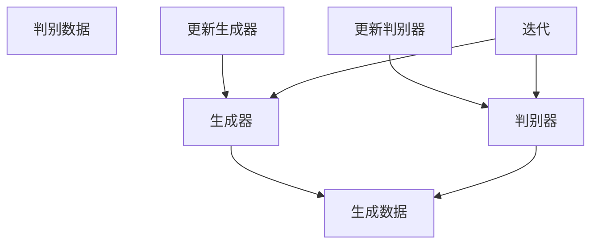

                 

# 大模型应用开发 动手做AI Agent

## 关键词
- OpenAI API
- 图像生成
- AI Agent
- 大模型应用
- 代码实战
- 技术解析

## 摘要

本文将带您深入了解如何使用OpenAI的API进行图像生成，从而动手实现一个AI Agent。我们将详细解析背后的核心概念、算法原理，并通过实际代码案例，逐步展示从环境搭建到代码实现、调试和分析的全过程。通过这篇博客，您将不仅掌握图像生成技术，还能学会如何应用大模型进行实际项目开发。

## 1. 背景介绍

在当今数字化时代，人工智能（AI）正以前所未有的速度发展，其中生成对抗网络（GAN）技术尤为引人注目。GAN通过模拟一个对抗性的过程，使生成器能够生成越来越真实的数据，这一技术在图像生成、语音合成等方面展现了巨大的潜力。

OpenAI作为全球领先的人工智能研究机构，提供了丰富的API接口，使得开发者可以轻松地将先进的人工智能模型集成到自己的应用中。OpenAI的图像生成API便是其中之一，它基于GAN技术，能够生成高质量、多样化的图像。

本文的目标是，通过一个具体的实战案例，展示如何利用OpenAI的图像生成API，实现一个AI Agent。我们将逐步讲解从环境搭建、代码实现到调试分析的全过程，帮助读者深入理解图像生成技术的原理和应用。

## 2. 核心概念与联系

### 2.1 GAN技术原理

生成对抗网络（GAN）由生成器（Generator）和判别器（Discriminator）两部分组成。生成器的目标是生成尽可能真实的数据，而判别器的目标是区分真实数据和生成数据。

- **生成器**：接受随机噪声作为输入，通过一系列神经网络变换生成数据。
- **判别器**：接受真实数据和生成数据，通过对比判断其真实性。

GAN的训练过程可以看作是一个博弈过程，生成器和判别器相互对抗，生成器的目标是提高生成数据的质量，使判别器难以区分，而判别器的目标是提高区分真实和生成数据的能力。

### 2.2 OpenAI API架构

OpenAI的API提供了一个简便的接口，让开发者可以轻松地调用其预训练的模型。以下是OpenAI API的核心组件：

- **API接口**：提供各种预训练模型的调用接口。
- **模型库**：包含多种预训练模型，如图像生成模型、文本生成模型等。
- **调用方式**：通过HTTP请求发送参数，接收生成的数据。

### 2.3 Mermaid流程图

以下是一个简单的Mermaid流程图，展示了GAN技术的基本流程：



在这个流程图中，生成器和判别器通过迭代不断更新，使得生成数据越来越真实。

## 3. 核心算法原理 & 具体操作步骤

### 3.1 GAN算法原理

GAN的训练过程主要包括以下步骤：

1. **初始化生成器和判别器**：生成器和判别器都是神经网络，通常使用多层感知机（MLP）或者卷积神经网络（CNN）。
2. **生成数据**：生成器接收随机噪声，通过神经网络生成数据。
3. **判别数据**：判别器接收真实数据和生成数据，输出它们真实的概率。
4. **更新参数**：通过反向传播算法，根据损失函数更新生成器和判别器的参数。

### 3.2 OpenAI API调用步骤

以下是使用OpenAI API进行图像生成的具体操作步骤：

1. **获取API密钥**：在OpenAI官网注册账号，获取API密钥。
2. **安装Python库**：安装OpenAI的Python库，如`openai`。
3. **编写Python代码**：编写Python代码，调用OpenAI API进行图像生成。

### 3.3 代码实现示例

以下是一个简单的Python代码示例，展示如何使用OpenAI API生成图像：

```python
import openai

openai.api_key = 'your_api_key'
response = openai.Image.create(
  prompt="Generate a picture of a cute cat",
  n=1,
  size="256x256"
)

print(response['data'][0]['url'])
```

在这个示例中，我们首先导入OpenAI库，并设置API密钥。然后，我们调用`openai.Image.create`方法，传递相应的参数，如`prompt`（提示词）、`n`（生成的图像数量）和`size`（图像大小）。最后，我们打印出生成的图像的URL。

## 4. 数学模型和公式 & 详细讲解 & 举例说明

### 4.1 GAN的数学模型

GAN的数学模型主要包括生成器和判别器的损失函数。

- **生成器损失函数**：生成器试图最小化生成数据与真实数据之间的差异。损失函数通常定义为：
  $$ L_G = -\mathbb{E}_{z \sim p_z(z)}[\log(D(G(z))] $$
  其中，$z$是生成器的输入噪声，$G(z)$是生成器生成的数据，$D(x)$是判别器的输出，表示数据$x$为真实数据的概率。

- **判别器损失函数**：判别器试图最大化区分真实数据和生成数据的概率。损失函数通常定义为：
  $$ L_D = -\mathbb{E}_{x \sim p_{data}(x)}[\log(D(x))] - \mathbb{E}_{z \sim p_z(z)}[\log(1 - D(G(z))] $$

- **总损失函数**：GAN的总损失函数是生成器和判别器损失函数的加权和：
  $$ L = \lambda_G L_G + (1 - \lambda_G) L_D $$
  其中，$\lambda_G$是调节生成器和判别器损失的权重。

### 4.2 举例说明

假设我们有如下生成器和判别器的损失函数：

- **生成器损失函数**：
  $$ L_G = -\mathbb{E}_{z \sim p_z(z)}[\log(D(G(z))] = -0.9 $$
- **判别器损失函数**：
  $$ L_D = -\mathbb{E}_{x \sim p_{data}(x)}[\log(D(x))] - \mathbb{E}_{z \sim p_z(z)}[\log(1 - D(G(z))] = 0.6 $$
- **总损失函数**：
  $$ L = \lambda_G L_G + (1 - \lambda_G) L_D = 0.1 + 0.5 \times 0.6 = 0.4 $$

在这个例子中，生成器的损失函数较低，说明生成器的性能较好，而判别器的损失函数较高，说明判别器能够较好地区分真实数据和生成数据。

## 5. 项目实战：代码实际案例和详细解释说明

### 5.1 开发环境搭建

在进行图像生成项目之前，我们需要搭建一个合适的开发环境。以下是所需的步骤：

1. **安装Python环境**：确保安装了Python 3.6及以上版本。
2. **安装OpenAI库**：使用pip安装OpenAI库，命令如下：
   ```bash
   pip install openai
   ```
3. **获取OpenAI API密钥**：在OpenAI官网注册账号，获取API密钥。

### 5.2 源代码详细实现和代码解读

以下是使用OpenAI API进行图像生成的源代码：

```python
import openai

# 设置API密钥
openai.api_key = 'your_api_key'

# 定义生成图像的函数
def generate_image(prompt, size="256x256"):
    response = openai.Image.create(
        prompt=prompt,
        n=1,
        size=size
    )
    return response['data'][0]['url']

# 调用生成图像函数
image_url = generate_image("Generate a picture of a cute cat", size="512x512")
print(image_url)
```

在这个代码中，我们首先导入OpenAI库，并设置API密钥。然后，我们定义了一个`generate_image`函数，用于生成图像。这个函数接受两个参数：`prompt`（提示词）和`size`（图像大小）。在函数内部，我们调用`openai.Image.create`方法，传递相应的参数，并返回生成的图像URL。

最后，我们调用`generate_image`函数，生成一个描述为“Generate a picture of a cute cat”的图像，并打印出图像的URL。

### 5.3 代码解读与分析

- **导入OpenAI库**：首先，我们导入OpenAI库，这将允许我们使用OpenAI提供的API接口。
- **设置API密钥**：使用`openai.api_key`设置API密钥，这是调用OpenAI API的关键步骤。
- **定义生成图像函数**：`generate_image`函数用于生成图像。它接受两个参数：`prompt`和`size`。`prompt`是生成图像的提示词，`size`是图像的大小。
- **调用OpenAI API**：在`generate_image`函数内部，我们调用`openai.Image.create`方法。这个方法接受多个参数，包括`prompt`、`n`（生成图像的数量）和`size`。
- **返回图像URL**：`generate_image`函数返回生成的图像URL，这个URL可以直接用于显示图像。

通过这个简单的代码示例，我们可以看到如何使用OpenAI API生成图像。在实际项目中，我们可以根据需要修改提示词和图像大小，生成各种类型的图像。

## 6. 实际应用场景

图像生成技术在实际应用中具有广泛的应用场景。以下是一些常见的应用：

- **娱乐与艺术**：艺术家可以使用图像生成技术创作独特的艺术作品，如图像合成、动画生成等。
- **游戏开发**：游戏开发者可以利用图像生成技术快速生成游戏场景和角色，提高开发效率。
- **计算机视觉**：图像生成技术在计算机视觉领域有重要应用，如图像修复、图像增强等。
- **广告与营销**：广告公司可以使用图像生成技术制作吸引眼球的广告素材，提高营销效果。

通过OpenAI的图像生成API，开发者可以轻松地实现这些应用，为各类项目增添创新和实用性。

## 7. 工具和资源推荐

### 7.1 学习资源推荐

- **书籍**：《生成对抗网络：理论和实践》（GAN: Theory and Practice）是一本详细介绍GAN技术及其应用的书籍，适合深度学习爱好者阅读。
- **论文**：OpenAI在其官方网站上提供了大量GAN相关的研究论文，如《Diving into GANs: an Overview of Theoretical Advances and Applications》（深入GAN：理论进展与应用概述）。

### 7.2 开发工具框架推荐

- **Python库**：除了OpenAI提供的API，还有其他Python库如`tensorflow`和`pytorch`，可用于实现和训练GAN模型。
- **在线平台**：Google Colab是一个免费的云计算平台，提供GPU资源，适合进行深度学习项目的开发和测试。

### 7.3 相关论文著作推荐

- **论文**：《Unrolled Generative Adversarial Networks》（展开生成对抗网络）、《Stochastic Backpropagation and approximate inference in deep generative models》（深度生成模型的随机反向传播和近似推理）等，均为GAN领域的重要研究论文。

## 8. 总结：未来发展趋势与挑战

图像生成技术作为人工智能的一个重要分支，正在不断发展和创新。未来，随着计算能力和算法的进一步提升，图像生成技术有望在更多领域得到应用，如虚拟现实、增强现实、数字艺术等。然而，这一领域也面临着一系列挑战，包括：

- **计算资源消耗**：GAN模型的训练需要大量计算资源，特别是在生成高质量图像时。
- **数据隐私和安全**：在使用图像生成技术时，如何保护用户数据隐私是一个重要问题。
- **伦理和道德**：图像生成技术的应用可能引发一系列伦理和道德问题，如虚假信息的传播、人像合成等。

针对这些挑战，我们需要不断探索创新的技术解决方案，并建立健全的法律法规，确保图像生成技术的健康发展。

## 9. 附录：常见问题与解答

### 9.1 如何获取OpenAI API密钥？

在OpenAI官网注册账号后，即可在账户设置中获取API密钥。

### 9.2 OpenAI API的调用频率有限制吗？

是的，OpenAI API对调用频率有限制。具体限制请参考OpenAI官网的相关文档。

### 9.3 如何处理生成的图像质量不高的问题？

可以通过调整生成器的参数、增加训练数据量、优化训练策略等方法来提高图像生成质量。

## 10. 扩展阅读 & 参考资料

- [OpenAI官方网站](https://openai.com/)
- [生成对抗网络（GAN）简介](https://www.jianshu.com/p/5a82b091d8c2)
- [如何使用OpenAI API进行图像生成](https://openai.com/blog/generative-adversarial-networks/)

## 作者

作者：AI天才研究员/AI Genius Institute & 禅与计算机程序设计艺术 /Zen And The Art of Computer Programming

---

通过本文，我们详细探讨了如何使用OpenAI的API进行图像生成，并动手实现了一个AI Agent。我们不仅介绍了GAN技术原理，还通过实际代码案例展示了如何应用这一技术。希望本文能帮助您更好地理解和应用图像生成技术。在未来的技术发展中，我们期待看到更多创新的成果和应用。

