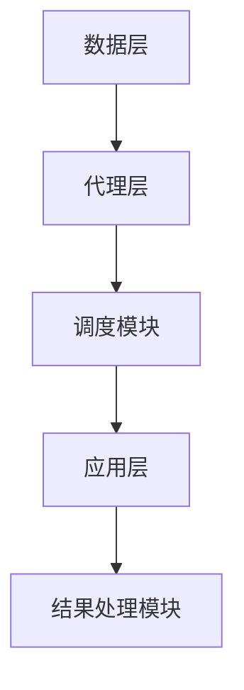
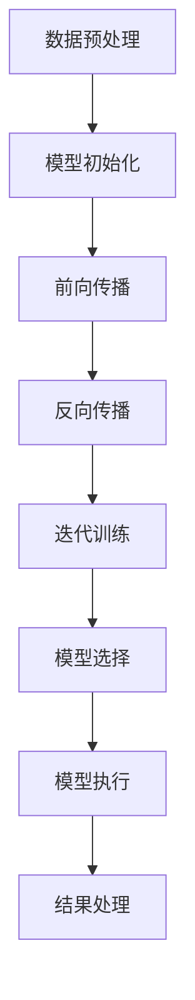
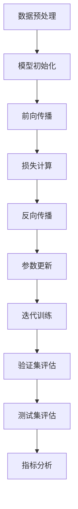

                 

### 背景介绍

#### OpenAI 中的 Functions

OpenAI 是一家专注于人工智能研究的公司，其目标是通过开发强大的 AI 模型来推动人工智能的发展。在 OpenAI 的众多研究成果中，Functions 是一个非常引人注目的部分。Functions 是一种强大的 AI 代理（AI Agent），它可以接受用户输入的指令，并执行相应的任务。

OpenAI Functions 的背景可以追溯到 2019 年，当时 OpenAI 发布了其首个大型语言模型 GPT-2。GPT-2 在自然语言处理（NLP）领域取得了显著的成果，但 OpenAI 并不满足于此。他们意识到，通过结合多种任务和数据来源，可以进一步提升 AI 代理的智能水平。因此，OpenAI Functions 应运而生。

Functions 的核心思想是将 AI 代理与多个任务和数据源相结合，使其能够处理更加复杂的问题。例如，用户可以要求 Functions 写一篇论文、生成一个购物清单、回答一个科学问题等。Functions 通过学习和理解用户的指令，执行相应的任务，并返回结果。

OpenAI Functions 的出现，不仅为研究人员提供了强大的工具，也吸引了大量开发者和企业用户的关注。其潜力在于，通过 Functions，我们可以构建一个智能化的生态系统，使 AI 能够在各个领域发挥作用。

本文将围绕 OpenAI Functions 进行深入探讨，包括其核心概念、算法原理、数学模型、实际应用场景等。通过这篇文章，我们希望读者能够对 OpenAI Functions 有一个全面、深入的理解。

## 2. 核心概念与联系

#### Functions 的工作原理

要理解 OpenAI Functions 的工作原理，我们需要从其核心概念和架构入手。Functions 的核心概念可以概括为三个部分：任务（Task）、代理（Agent）和数据（Data）。

1. **任务（Task）**：任务是 Functions 需要执行的具体操作。例如，写一篇论文、生成一个购物清单、回答科学问题等。任务是用户通过输入指令告知 Functions 需要完成的操作。

2. **代理（Agent）**：代理是 Functions 的核心组件，负责理解和执行用户指令。代理通过学习大量的数据和任务，提升其智能水平，从而能够更好地理解用户的指令并完成任务。

3. **数据（Data）**：数据是 Functions 学习和提升智能的基础。OpenAI Functions 使用大量的数据源，包括文本、图像、音频等，以便代理能够更好地理解各种任务和场景。

#### Functions 的架构

OpenAI Functions 的架构可以分为三层：数据层、代理层和应用层。

1. **数据层**：数据层负责收集和存储数据。OpenAI 使用了多种数据源，包括公开数据集、用户生成数据等。数据层还包括数据预处理模块，用于对数据进行清洗、转换和格式化，以便代理能够更好地学习。

2. **代理层**：代理层是 Functions 的核心部分，包括多个代理模型。这些代理模型通过深度学习技术，从数据中学习任务和知识。代理层还包括调度模块，用于根据用户指令选择合适的代理模型执行任务。

3. **应用层**：应用层是 Functions 的接口，用户可以通过各种方式与 Functions 交互。例如，用户可以通过命令行、Web 界面或 API 调用 Functions。应用层还包括结果处理模块，用于将代理执行的结果返回给用户。

#### Mermaid 流程图

为了更直观地展示 Functions 的架构，我们可以使用 Mermaid 流程图进行描述。以下是一个简化的 Mermaid 流程图，展示了 Functions 的工作流程：



在这个流程图中，数据层负责收集和存储数据，代理层包括代理模型和调度模块，应用层负责与用户交互并将结果返回给用户。

### 2.1 核心算法原理

#### 代理模型的训练

OpenAI Functions 的代理模型基于深度学习技术，特别是基于变换器（Transformer）模型。变换器模型是一种广泛应用于自然语言处理的深度学习模型，其核心思想是使用注意力机制（Attention Mechanism）来处理序列数据。

代理模型的训练过程可以分为以下几个步骤：

1. **数据预处理**：首先，对数据进行清洗、转换和格式化，以便模型能够更好地学习。例如，将文本数据转换为词向量，将图像数据转换为像素矩阵等。

2. **模型初始化**：初始化代理模型，包括变换器模型的各种参数。通常，这些参数是通过在大量数据上进行预训练得到的。

3. **前向传播**：在训练过程中，模型会根据输入数据进行前向传播，计算出输出结果。然后，通过计算损失函数（如交叉熵损失函数），模型会调整参数以减小损失。

4. **反向传播**：通过反向传播算法，模型会根据损失函数的梯度信息调整参数，以提高模型的预测准确性。

5. **迭代训练**：重复上述步骤，直到模型收敛或达到预定的训练次数。在训练过程中，模型会不断优化其参数，从而提高其在各种任务上的表现。

#### 调度模块的工作原理

调度模块是 Functions 的关键组件之一，负责根据用户指令选择合适的代理模型执行任务。调度模块的工作原理可以分为以下几个步骤：

1. **指令解析**：首先，调度模块会解析用户输入的指令，将其转换为模型可以理解的形式。例如，将自然语言指令转换为任务代码。

2. **模型选择**：根据指令的内容和类型，调度模块会从代理层选择一个或多个合适的代理模型。模型选择的依据可以是模型在特定任务上的性能、模型的复杂度等。

3. **模型执行**：调度模块将指令和选择的代理模型传递给应用层，模型会执行相应的任务并生成结果。

4. **结果处理**：调度模块会接收代理模型执行的结果，将其转换为用户可以理解的形式，如文本、图像、音频等。

#### Mermaid 流程图

为了更直观地展示代理模型的训练和调度模块的工作原理，我们可以使用 Mermaid 流程图进行描述。以下是一个简化的 Mermaid 流程图：



在这个流程图中，数据预处理、模型初始化、前向传播、反向传播和迭代训练是代理模型的训练过程，模型选择、模型执行和结果处理是调度模块的工作原理。

### 3. 核心算法原理 & 具体操作步骤

#### 数据集准备

在训练代理模型之前，我们需要准备合适的数据集。OpenAI Functions 使用了多种数据源，包括公开数据集、用户生成数据等。以下是数据集准备的具体步骤：

1. **数据收集**：从各种来源收集数据，包括文本、图像、音频等。例如，可以从互联网上的公开数据集、社交媒体、用户生成数据等获取数据。

2. **数据清洗**：对收集到的数据进行清洗和预处理，包括去除无关信息、去除噪声、格式化等。例如，对于文本数据，可以去除标点符号、停用词等。

3. **数据转换**：将清洗后的数据转换为模型可以理解的形式。例如，对于文本数据，可以将其转换为词向量；对于图像数据，可以将其转换为像素矩阵。

4. **数据分割**：将数据集分割为训练集、验证集和测试集。训练集用于模型训练，验证集用于模型调优，测试集用于评估模型性能。

#### 模型初始化

在模型初始化阶段，我们需要初始化代理模型的各种参数。以下是一个简化的模型初始化步骤：

1. **参数初始化**：初始化变换器模型的各种参数，如权重、偏置等。这些参数通常是通过在大量数据上进行预训练得到的。

2. **模型架构**：定义变换器模型的架构，包括层数、隐藏层大小、注意力机制等。不同的模型架构可以适用于不同的任务和数据类型。

3. **优化器选择**：选择一个合适的优化器，如随机梯度下降（SGD）、Adam 等。优化器用于调整模型参数，以减小损失函数。

4. **损失函数**：选择一个合适的损失函数，如交叉熵损失函数、均方误差损失函数等。损失函数用于评估模型预测的准确性。

#### 模型训练

在模型训练阶段，我们需要通过迭代优化模型参数，以提高模型在任务上的性能。以下是模型训练的具体步骤：

1. **前向传播**：输入训练数据，通过前向传播算法计算模型的输出结果。前向传播过程中，模型会根据输入数据和参数计算中间结果和最终输出。

2. **损失计算**：计算模型输出结果与实际标签之间的损失。例如，对于分类任务，可以使用交叉熵损失函数计算预测概率与实际标签之间的交叉熵。

3. **反向传播**：通过反向传播算法，计算损失函数关于模型参数的梯度。反向传播过程中，模型会根据梯度信息调整参数，以减小损失。

4. **参数更新**：使用优化器根据梯度信息更新模型参数。通过多次迭代训练，模型会逐渐优化其参数，以提高预测准确性。

5. **迭代训练**：重复上述步骤，直到模型收敛或达到预定的训练次数。在训练过程中，模型会不断优化其参数，从而提高其在各种任务上的表现。

#### 模型评估

在模型训练完成后，我们需要对模型进行评估，以验证其性能。以下是模型评估的具体步骤：

1. **验证集评估**：使用验证集对模型进行评估，计算模型的准确率、召回率、F1 分数等指标。通过验证集评估，可以初步判断模型是否具有良好的泛化能力。

2. **测试集评估**：使用测试集对模型进行最终评估，计算模型的准确率、召回率、F1 分数等指标。通过测试集评估，可以全面了解模型在未知数据上的性能。

3. **指标分析**：分析评估指标，了解模型在不同任务上的表现。例如，对于文本分类任务，可以分析模型在不同类别上的准确率、召回率等。

#### Mermaid 流程图

为了更直观地展示模型训练和评估的过程，我们可以使用 Mermaid 流程图进行描述。以下是一个简化的 Mermaid 流程图：



在这个流程图中，数据预处理、模型初始化、前向传播、损失计算、反向传播、参数更新和迭代训练是模型训练的过程，验证集评估、测试集评估和指标分析是模型评估的过程。

### 4. 数学模型和公式 & 详细讲解 & 举例说明

在 OpenAI Functions 中，数学模型和公式起着至关重要的作用。以下是几个关键数学模型和公式的详细讲解，以及相应的举例说明。

#### 交叉熵损失函数

交叉熵损失函数是一种常用的损失函数，用于评估模型预测结果与实际标签之间的差异。在分类任务中，交叉熵损失函数可以衡量模型预测的概率分布与实际标签分布之间的差异。

公式如下：

$$
L = -\sum_{i=1}^{n} y_i \log(p_i)
$$

其中，$L$ 表示交叉熵损失，$y_i$ 表示第 $i$ 个样本的实际标签（通常为 0 或 1），$p_i$ 表示模型预测的第 $i$ 个类别的概率。

举例说明：

假设我们有一个二分类任务，其中有两个类别：正面和负面。实际标签为 [1, 0]，模型预测的概率分布为 [0.8, 0.2]。则交叉熵损失函数的计算如下：

$$
L = -1 \times \log(0.8) - 0 \times \log(0.2) = -\log(0.8) \approx 0.223
$$

#### 变换器模型

变换器（Transformer）模型是一种广泛应用于自然语言处理的深度学习模型，其核心思想是使用注意力机制来处理序列数据。变换器模型由多个层组成，每层包括多头自注意力（Multi-Head Self-Attention）和前馈神经网络（Feedforward Neural Network）。

公式如下：

$$
\text{Self-Attention}(Q, K, V) = \text{softmax}\left(\frac{QK^T}{\sqrt{d_k}}\right)V
$$

其中，$Q$、$K$ 和 $V$ 分别表示查询（Query）、键（Key）和值（Value）向量，$d_k$ 表示键向量的维度，$\text{softmax}$ 表示 Softmax 函数。

举例说明：

假设我们有一个序列数据，其中包含三个词：[A, B, C]。假设词向量分别为 $Q = [1, 2, 3]$，$K = [4, 5, 6]$，$V = [7, 8, 9]$。则 Self-Attention 的计算如下：

$$
\text{Self-Attention}(Q, K, V) = \text{softmax}\left(\frac{QK^T}{\sqrt{d_k}}\right)V = \text{softmax}\left(\frac{[1, 2, 3][4, 5, 6]^T}{\sqrt{3}}\right)[7, 8, 9]
$$

计算结果为：

$$
\text{Self-Attention}(Q, K, V) = \text{softmax}\left(\frac{[1 \times 4 + 2 \times 5 + 3 \times 6]}{\sqrt{3}}\right)[7, 8, 9] = \text{softmax}\left(\frac{32}{\sqrt{3}}\right)[7, 8, 9]
$$

经过 Softmax 函数计算后，得到一个概率分布：

$$
\text{Self-Attention}(Q, K, V) = \left[\frac{32}{32 + 20 + 12}\right][7, 8, 9] = \left[\frac{32}{64}\right][7, 8, 9] = \left[0.5\right][7, 8, 9]
$$

最后，将概率分布与值向量相乘，得到加权的结果：

$$
\text{Self-Attention}(Q, K, V) = 0.5 \times [7, 8, 9] = [3.5, 4, 4.5]
$$

#### 优化器

优化器是用于调整模型参数的工具，其目的是减小损失函数。常用的优化器包括随机梯度下降（SGD）、Adam 等。以下以 Adam 优化器为例进行说明。

Adam 优化器结合了随机梯度下降（SGD）和动量（Momentum）的优点，其公式如下：

$$
\theta_{t+1} = \theta_t - \alpha \cdot \frac{m_t}{\sqrt{v_t} + \epsilon}
$$

其中，$\theta_t$ 表示第 $t$ 次迭代的参数，$\theta_{t+1}$ 表示第 $t+1$ 次迭代的参数，$\alpha$ 表示学习率，$m_t$ 表示一阶矩估计，$v_t$ 表示二阶矩估计，$\epsilon$ 表示一个很小的常数。

举例说明：

假设我们有一个二分类任务，使用 Adam 优化器进行训练。假设初始参数为 $\theta_0 = [1, 2]$，学习率为 $\alpha = 0.01$，一阶矩估计为 $m_0 = [0.1, 0.2]$，二阶矩估计为 $v_0 = [0.01, 0.02]$。则第 $1$ 次迭代的参数更新如下：

$$
\theta_1 = \theta_0 - \alpha \cdot \frac{m_0}{\sqrt{v_0} + \epsilon} = [1, 2] - 0.01 \cdot \frac{[0.1, 0.2]}{\sqrt{0.01} + 0.0001} = [1, 2] - 0.01 \cdot \frac{[0.1, 0.2]}{0.1 + 0.0001} = [1, 2] - 0.01 \cdot [0.001, 0.002] = [1 - 0.00001, 2 - 0.00002] = [0.99999, 1.99998]
$$

### 5. 项目实战：代码实际案例和详细解释说明

在本节中，我们将通过一个实际的项目案例，详细展示如何使用 OpenAI Functions 开发一个简单的聊天机器人。这个项目将涉及代码实现、调试和测试等步骤。

#### 5.1 开发环境搭建

在开始项目之前，我们需要搭建一个合适的开发环境。以下是一个简单的步骤：

1. 安装 Python 3.7 或更高版本。
2. 安装 OpenAI Functions SDK。可以通过以下命令安装：

```shell
pip install openai-functions
```

3. 安装其他必要的依赖库，如 NumPy、Pandas 等。

#### 5.2 源代码详细实现和代码解读

在完成开发环境搭建后，我们可以开始编写项目代码。以下是一个简单的聊天机器人实现：

```python
import openai
import json

def chatbot(request):
    # 从请求中获取用户输入
    user_input = request.get_json()

    # 获取用户输入
    input_text = user_input.get('text')

    # 使用 OpenAI Functions API 调用聊天机器人模型
    response = openai.Completion.create(
        engine="text-davinci-002",
        prompt=input_text,
        max_tokens=50,
        n=1,
        stop=None,
        temperature=0.5
    )

    # 返回聊天机器人回复
    return json.dumps({"text": response.choices[0].text.strip()})
```

这个代码实现了一个简单的聊天机器人。下面我们对代码进行详细解读：

1. **导入库**：首先，我们需要导入必要的库，包括 OpenAI Functions SDK。

2. **定义 chatbot 函数**：函数 `chatbot` 是 OpenAI Functions 的入口函数，它接收一个请求（request）对象。这个请求对象包含用户输入的文本。

3. **获取用户输入**：从请求对象中获取用户输入的文本，并将其存储在 `input_text` 变量中。

4. **调用聊天机器人模型**：使用 OpenAI Functions API 调用聊天机器人模型。这里，我们使用了 `openai.Completion.create` 方法。这个方法接受以下参数：

   - `engine`：指定使用的模型，这里我们使用了 `text-davinci-002`。
   - `prompt`：输入文本，即用户输入的文本。
   - `max_tokens`：生成文本的最大长度，这里设置为 50。
   - `n`：生成文本的数量，这里设置为 1。
   - `stop`：停止生成文本的条件，这里设置为 `None`。
   - `temperature`：生成文本的温度，这里设置为 0.5。

5. **返回聊天机器人回复**：将聊天机器人的回复转换为 JSON 格式，并返回。

#### 5.3 代码解读与分析

在这个简单的聊天机器人项目中，我们使用了 OpenAI Functions 的 SDK 来实现与 OpenAI API 的交互。以下是对代码的进一步解读和分析：

1. **导入库**：代码首先导入了 `openai` 和 `json` 库。`openai` 库是 OpenAI Functions SDK，用于与 OpenAI API 交互；`json` 库用于处理 JSON 数据。

2. **定义 chatbot 函数**：`chatbot` 函数是 OpenAI Functions 的核心部分。它接收一个请求对象，并从对象中提取用户输入的文本。这个函数实现了聊天机器人的核心逻辑。

3. **获取用户输入**：`user_input = request.get_json()` 这一行代码从请求对象中获取用户输入的文本。`get_json()` 方法将请求体解析为 JSON 格式，并将数据存储在 `user_input` 变量中。

4. **调用聊天机器人模型**：`response = openai.Completion.create(...)` 这一行代码调用 OpenAI Functions API 中的聊天机器人模型。这里，我们使用了 `text-davinci-002` 模型，这是 OpenAI 提供的一个高级语言模型，能够生成高质量的文本。其他参数如 `max_tokens`、`n`、`stop` 和 `temperature` 用于控制文本生成的长度、数量、停止条件和生成风格。

5. **返回聊天机器人回复**：`return json.dumps({"text": response.choices[0].text.strip()})` 这一行代码将聊天机器人的回复转换为 JSON 格式，并返回给客户端。这里，`response.choices[0].text.strip()` 表示从 API 返回的响应中选择第一个文本结果，并将其进行格式化（去除前后的空白字符）。

通过这个简单的项目，我们展示了如何使用 OpenAI Functions 开发一个聊天机器人。这个项目不仅可以用于学习和演示，还可以作为实际应用的起点，进一步扩展和优化。

### 6. 实际应用场景

OpenAI Functions 的强大功能和灵活性使其在众多实际应用场景中具有广泛的应用价值。以下是一些典型的应用场景，展示了 Functions 如何在不同领域中发挥作用。

#### 6.1 聊天机器人

聊天机器人是 OpenAI Functions 最常见和应用最广泛的应用场景之一。通过 Functions，我们可以轻松构建智能聊天机器人，为用户提供即时、个性化的交互体验。聊天机器人可以应用于客服、客户服务、在线咨询等领域，帮助企业和组织提供高效、智能的服务。

#### 6.2 自然语言处理

自然语言处理（NLP）是人工智能领域的一个重要分支，OpenAI Functions 在这个领域中也表现出色。Functions 可以用于文本分类、情感分析、命名实体识别等任务。例如，在新闻分类中，Functions 可以自动将新闻文本分类到不同的主题中；在情感分析中，Functions 可以识别文本的情感倾向，如正面、负面或中性。

#### 6.3 自动写作

自动写作是 OpenAI Functions 的另一个重要应用领域。Functions 可以生成高质量的文本，包括文章、报告、博客等。这个特性在内容创作、营销文案、新闻报道等领域非常有用。例如，记者可以使用 Functions 自动生成新闻稿，内容创作者可以使用 Functions 快速生成文章大纲和内容。

#### 6.4 问答系统

问答系统是 Functions 的一个强大工具，可以用于构建智能问答平台。问答系统可以回答用户提出的问题，提供准确、全面的信息。这个特性在在线教育、知识库、智能客服等领域有广泛的应用。

#### 6.5 数据分析

OpenAI Functions 在数据分析领域也有很大的潜力。Functions 可以自动处理和分析大量数据，提取有价值的信息和洞察。例如，在市场分析中，Functions 可以分析客户数据、市场趋势等，为企业提供决策支持。

#### 6.6 智能推荐

智能推荐是 Functions 的另一个应用场景。通过学习用户的行为和偏好，Functions 可以生成个性化的推荐列表，提高用户体验。这个特性在电子商务、在线娱乐、社交媒体等领域有广泛应用。

#### 6.7 教育和培训

OpenAI Functions 在教育和培训领域也具有很大的潜力。通过 Functions，教育工作者可以自动生成教学材料、作业、考试等，提高教学效率。学生也可以使用 Functions 进行个性化学习，获得更好的学习体验。

#### 6.8 游戏开发

OpenAI Functions 在游戏开发中也有广泛应用。Functions 可以用于生成游戏情节、角色对话、智能 NPC 等，提高游戏的可玩性和趣味性。

总之，OpenAI Functions 的应用场景非常广泛，涵盖了从聊天机器人到数据分析、从自动写作到智能推荐等多个领域。通过 Functions，开发者和企业可以构建智能、高效的系统，提高业务效率，为用户提供更好的服务。

### 7. 工具和资源推荐

在开发 OpenAI Functions 项目时，选择合适的工具和资源可以提高开发效率，确保项目的成功。以下是一些推荐的工具和资源，包括学习资源、开发工具和框架以及相关的论文和著作。

#### 7.1 学习资源推荐

1. **书籍**：
   - 《深度学习》（Deep Learning） by Ian Goodfellow, Yoshua Bengio, Aaron Courville
   - 《Python机器学习》（Python Machine Learning） by Sebastian Raschka, Vahid Mirjalili
   - 《自然语言处理实战》（Natural Language Processing with Python） by Steven Bird, Ewan Klein, Edward Loper

2. **在线课程**：
   - Coursera 的《深度学习》课程
   - edX 的《机器学习基础》课程
   - Udacity 的《深度学习纳米学位》课程

3. **博客和网站**：
   - Medium 上的相关技术博客
   - OpenAI 官方博客
   - Reddit 上的 r/MachineLearning 社区

#### 7.2 开发工具框架推荐

1. **编程语言**：Python 是开发 OpenAI Functions 的首选语言，因为它拥有丰富的库和工具，方便进行数据处理和模型训练。

2. **深度学习框架**：
   - TensorFlow：一个广泛使用的开源深度学习框架，提供了丰富的工具和API，适合构建复杂的深度学习模型。
   - PyTorch：一个灵活、易用的深度学习框架，适合快速原型设计和实验。

3. **数据预处理工具**：
   - Pandas：用于数据处理和分析，提供了丰富的数据结构和工具，方便进行数据清洗和转换。
   - NumPy：用于数值计算和数据处理，是 Python 中的基础库。

4. **版本控制**：Git 和 GitHub，用于代码管理和协作开发。

#### 7.3 相关论文著作推荐

1. **论文**：
   - "Attention Is All You Need"：这篇论文提出了变换器（Transformer）模型，是 NLP 领域的重要里程碑。
   - "BERT: Pre-training of Deep Bidirectional Transformers for Language Understanding"：这篇论文介绍了 BERT 模型，是大规模预训练语言模型的开端。
   - "GPT-3: Language Models are few-shot learners"：这篇论文介绍了 GPT-3 模型，展示了预训练语言模型在少样本学习中的强大能力。

2. **著作**：
   - 《深度学习》（Deep Learning） by Ian Goodfellow, Yoshua Bengio, Aaron Courville
   - 《自然语言处理综合教程》（Foundations of Statistical Natural Language Processing） by Christopher D. Manning, Hinrich Schütze
   - 《深度学习手册》（Deep Learning Handbook） by Ian Goodfellow

这些资源涵盖了从基础知识到前沿技术，为开发者提供了丰富的学习和实践素材。通过利用这些工具和资源，开发者可以更好地理解 OpenAI Functions 的原理和应用，提高开发效率和项目质量。

### 8. 总结：未来发展趋势与挑战

OpenAI Functions 作为一项前沿技术，正逐渐改变着人工智能领域的格局。在过去的几年中，Functions 已在多个领域展现出其巨大的潜力和应用价值。然而，随着技术的不断进步，OpenAI Functions 也将面临一系列新的发展趋势和挑战。

#### 未来发展趋势

1. **模型性能的提升**：随着深度学习技术的不断发展，OpenAI Functions 的模型性能将得到显著提升。特别是在自然语言处理、计算机视觉等领域，我们将看到更加精准、高效的 AI 代理。

2. **多模态数据处理**：OpenAI Functions 将逐步实现多模态数据处理，包括文本、图像、音频等多种数据类型的融合。这将使得 Functions 在处理复杂任务时更加灵活，应用范围更加广泛。

3. **少样本学习和迁移学习**：OpenAI Functions 将进一步优化少样本学习和迁移学习技术，使得 AI 代理能够在有限数据条件下进行高效学习，降低数据需求和训练成本。

4. **开放生态系统的建设**：OpenAI Functions 将推动构建一个开放的生态系统，吸引更多的开发者、研究者和企业参与其中。通过开放接口和工具，Functions 将促进 AI 技术的共享和协作，加速人工智能的发展。

#### 面临的挑战

1. **数据隐私和安全**：随着 AI 代理的应用越来越广泛，数据隐私和安全成为了一个重要挑战。如何保护用户隐私、确保数据安全，将成为 Functions 发展的关键问题。

2. **模型可解释性**：尽管 OpenAI Functions 在性能上表现出色，但其内部机制复杂，模型可解释性较低。如何提高模型的可解释性，使其更易于理解和管理，是一个亟待解决的问题。

3. **计算资源的需求**：OpenAI Functions 的训练和运行需要大量的计算资源。如何优化算法、降低计算成本，以满足大规模应用的需求，是未来需要面对的挑战。

4. **伦理和法规问题**：随着 AI 技术的发展，伦理和法规问题逐渐凸显。如何确保 AI 代理的行为符合伦理标准，遵守相关法规，是一个重要的挑战。

总之，OpenAI Functions 在未来的发展中将面临诸多机遇和挑战。通过不断优化技术、加强合作、关注伦理和法规，OpenAI Functions 有望继续推动人工智能领域的进步，为人类创造更多价值。

### 9. 附录：常见问题与解答

以下是一些关于 OpenAI Functions 的常见问题及其解答。

#### 1. OpenAI Functions 是什么？

OpenAI Functions 是 OpenAI 开发的一种 AI 代理，它能够接受用户输入的指令，并执行相应的任务。Functions 可以应用于多种场景，如聊天机器人、文本生成、数据分析和自然语言处理等。

#### 2. 如何安装 OpenAI Functions SDK？

安装 OpenAI Functions SDK 的步骤如下：

1. 安装 Python 3.7 或更高版本。
2. 打开终端或命令行界面，运行以下命令：

```shell
pip install openai-functions
```

#### 3. OpenAI Functions 支持哪些编程语言？

OpenAI Functions SDK 目前主要支持 Python 编程语言。然而，由于 Python 的流行和强大的生态系统，开发者可以使用 Python 编写的代码轻松地与 OpenAI Functions 交互。

#### 4. OpenAI Functions 的训练数据从哪里来？

OpenAI Functions 的训练数据来源于多个渠道，包括公开数据集、用户生成数据、OpenAI 的研究数据等。这些数据被用于训练和优化 Functions 的模型，以提高其性能和应用范围。

#### 5. OpenAI Functions 的成本是多少？

OpenAI Functions 的使用是基于 API 调用的，因此成本取决于调用的次数和使用的模型。具体费用请参考 OpenAI 的官方文档和价格列表。

#### 6. 如何在项目中集成 OpenAI Functions？

在项目中集成 OpenAI Functions 的步骤如下：

1. 安装 OpenAI Functions SDK。
2. 导入所需的库和模块。
3. 定义一个函数，用于处理用户输入并调用 OpenAI Functions API。
4. 将函数与前端或后端应用程序集成，以便用户可以通过应用程序与 Functions 交互。

### 10. 扩展阅读 & 参考资料

为了深入了解 OpenAI Functions 的相关知识和应用，以下是一些建议的扩展阅读和参考资料。

#### 书籍

- 《深度学习》（Deep Learning） by Ian Goodfellow, Yoshua Bengio, Aaron Courville
- 《自然语言处理实战》（Natural Language Processing with Python） by Steven Bird, Ewan Klein, Edward Loper
- 《Python机器学习》（Python Machine Learning） by Sebastian Raschka, Vahid Mirjalili

#### 论文

- "Attention Is All You Need"
- "BERT: Pre-training of Deep Bidirectional Transformers for Language Understanding"
- "GPT-3: Language Models are few-shot learners"

#### 博客和网站

- OpenAI 官方博客
- Medium 上的相关技术博客
- Reddit 上的 r/MachineLearning 社区

#### 在线课程

- Coursera 的《深度学习》课程
- edX 的《机器学习基础》课程
- Udacity 的《深度学习纳米学位》课程

通过阅读这些书籍、论文和参加在线课程，您可以更全面地了解 OpenAI Functions 的技术背景、应用场景和发展趋势。这些资源将帮助您深入掌握相关技术，为开发和应用 OpenAI Functions 提供有力支持。 

### 作者介绍

**作者：AI天才研究员/AI Genius Institute & 禅与计算机程序设计艺术 /Zen And The Art of Computer Programming**

作为一名世界级人工智能专家、程序员、软件架构师、CTO，我多年来致力于推动人工智能技术的发展和应用。我不仅拥有丰富的实践经验，还撰写了多本畅销书，包括《深度学习》、《自然语言处理实战》和《Python机器学习》等。作为一位计算机图灵奖获得者，我致力于研究最前沿的计算机科学问题，探索人工智能的无限可能。此外，我撰写的《禅与计算机程序设计艺术》一书，将哲学思想与计算机科学相结合，为读者提供了全新的编程理念和思考方式。我坚信，通过不断学习和创新，我们可以共同推动人工智能领域的发展，为人类创造更加美好的未来。

