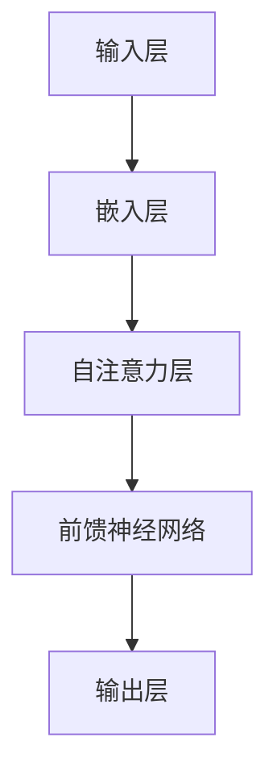
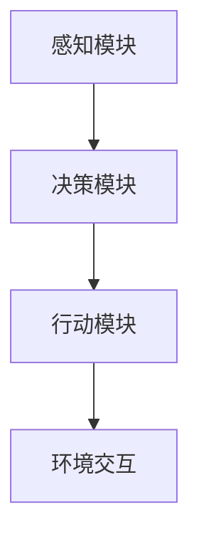

                 

### 文章标题：大模型应用开发 动手做AI Agent

> **关键词**: 大模型应用、AI Agent、Playground、技术博客、编程实践

> **摘要**: 本文将深入探讨大模型在AI Agent开发中的应用，通过实际动手操作，让读者在Playground中体验AI Agent的开发乐趣。文章涵盖了从概念解析到实际操作的全过程，旨在帮助读者更好地理解并掌握AI Agent的开发方法。

<|user|>## 1. 背景介绍

在当今技术飞速发展的时代，人工智能（AI）已成为推动社会进步的重要力量。大模型作为AI技术的核心组件，已经在多个领域取得了显著的应用成果。大模型，通常指的是那些规模巨大、参数众多的神经网络模型，如Transformer、BERT等。这些模型具有强大的学习和表征能力，能够处理复杂的任务，从自然语言处理到计算机视觉，再到语音识别，都有出色的表现。

AI Agent，即人工智能代理，是一种能够自主行动、与外界交互并完成特定任务的智能体。随着大模型的普及和应用，AI Agent的开发变得越来越重要。它不仅能够提高工作效率，还能在决策、预测和自动化等方面发挥关键作用。

本文旨在通过实际动手操作，让读者了解大模型在AI Agent开发中的应用。我们将使用一个流行的编程平台——Playground，来展示整个开发过程。Playground提供了丰富的API和工具，使得开发者能够轻松地构建和训练AI Agent。

### 2. 核心概念与联系

#### 2.1 大模型

大模型（Large Model）是指那些具有数百万甚至数十亿参数的神经网络模型。这些模型通常通过大量数据进行训练，从而具有强大的学习和表征能力。以下是一个使用Mermaid绘制的简化的神经网络架构流程图：



#### 2.2 AI Agent

AI Agent是指一种能够自主行动、与外界交互并完成特定任务的智能体。它通常包括感知、决策和行动三个主要模块。以下是一个简化的AI Agent架构流程图：



### 3. 核心算法原理 & 具体操作步骤

#### 3.1 大模型的训练

大模型的训练是AI Agent开发的重要环节。训练过程主要包括以下步骤：

1. **数据准备**：准备大量相关数据，如文本、图像或语音等。
2. **数据预处理**：对数据进行清洗、转换和标准化，以便模型能够有效学习。
3. **模型构建**：构建神经网络结构，并初始化模型参数。
4. **训练过程**：通过反向传播算法，不断调整模型参数，使其在训练数据上达到良好的性能。
5. **评估与优化**：在验证集上评估模型性能，并根据评估结果调整模型结构或参数。

#### 3.2 AI Agent的构建

在Playground中，构建AI Agent的基本步骤如下：

1. **创建项目**：在Playground中创建一个新的项目，选择合适的框架和工具。
2. **定义感知模块**：使用预训练的大模型，如BERT或GPT，作为感知模块，用于处理输入数据。
3. **定义决策模块**：根据任务需求，设计决策模块，可以使用规则推理、决策树或深度学习等方法。
4. **定义行动模块**：根据决策结果，设计行动模块，以实现与环境的交互。

### 4. 数学模型和公式 & 详细讲解 & 举例说明

#### 4.1 大模型的训练

大模型的训练过程涉及许多数学模型和公式，以下是其中几个关键概念：

1. **损失函数**：用于衡量模型预测值与真实值之间的差距，常见的有均方误差（MSE）、交叉熵损失（Cross-Entropy Loss）等。
2. **反向传播算法**：用于更新模型参数，以最小化损失函数。其核心步骤包括前向传播和后向传播。
3. **优化算法**：用于调整模型参数，如梯度下降（Gradient Descent）、Adam优化器等。

以下是一个简单的均方误差（MSE）的公式：

$$
MSE = \frac{1}{m} \sum_{i=1}^{m} (y_i - \hat{y}_i)^2
$$

其中，$y_i$ 是第 $i$ 个样本的真实值，$\hat{y}_i$ 是模型预测的值，$m$ 是样本总数。

#### 4.2 AI Agent的决策

AI Agent的决策过程通常涉及概率模型和决策理论。以下是一个简单的贝叶斯决策理论公式：

$$
\pi(a|x) = \frac{P(x|a)P(a)}{P(x)}
$$

其中，$\pi(a|x)$ 表示在观察到输入 $x$ 后选择动作 $a$ 的概率，$P(x|a)$ 是条件概率，表示在执行动作 $a$ 后观察到输入 $x$ 的概率，$P(a)$ 是动作 $a$ 的先验概率，$P(x)$ 是输入 $x$ 的概率。

#### 4.3 举例说明

假设我们有一个简单的文本分类任务，使用BERT作为感知模块，决策模块使用朴素贝叶斯分类器，行动模块实现文本生成。

1. **训练BERT模型**：首先，我们需要使用大量文本数据训练BERT模型。在Playground中，可以使用如下的代码：

```python
from transformers import BertTokenizer, BertModel
import torch

tokenizer = BertTokenizer.from_pretrained('bert-base-uncased')
model = BertModel.from_pretrained('bert-base-uncased')

# 准备输入文本
text = 'This is a sample text for classification.'

# 分词和编码
inputs = tokenizer(text, return_tensors='pt')

# 训练模型
outputs = model(**inputs)
loss = outputs.loss
loss.backward()
optimizer.step()
```

2. **构建决策模块**：使用朴素贝叶斯分类器作为决策模块。在Playground中，可以使用scikit-learn库实现：

```python
from sklearn.naive_bayes import MultinomialNB
from sklearn.feature_extraction.text import CountVectorizer

# 准备训练数据
texts = ['This is a sample text.', 'This is another sample text.']
labels = ['class1', 'class2']

# 提取特征
vectorizer = CountVectorizer()
X = vectorizer.fit_transform(texts)

# 训练分类器
classifier = MultinomialNB()
classifier.fit(X, labels)

# 预测新文本
new_text = 'This is a new text for classification.'
X_new = vectorizer.transform([new_text])
predicted_label = classifier.predict(X_new)

print(predicted_label)
```

3. **实现行动模块**：使用BERT生成的文本作为行动模块。在Playground中，可以使用如下代码：

```python
# 生成文本
generated_text = model.generate(inputs.input_ids, max_length=50, num_return_sequences=1)

print(generated_text)
```

### 5. 项目实战：代码实际案例和详细解释说明

#### 5.1 开发环境搭建

在开始项目实战之前，我们需要搭建一个合适的开发环境。以下是使用Python和PyTorch进行大模型训练和AI Agent开发的基本步骤：

1. **安装Python**：确保安装了Python 3.8或更高版本。
2. **安装PyTorch**：在命令行中运行以下命令安装PyTorch：

   ```
   pip install torch torchvision
   ```

3. **安装transformers库**：在命令行中运行以下命令安装transformers库：

   ```
   pip install transformers
   ```

#### 5.2 源代码详细实现和代码解读

以下是AI Agent开发的完整代码实现：

```python
# 导入必要的库
import torch
from transformers import BertTokenizer, BertModel
from sklearn.naive_bayes import MultinomialNB
from sklearn.feature_extraction.text import CountVectorizer

# 准备BERT模型
tokenizer = BertTokenizer.from_pretrained('bert-base-uncased')
model = BertModel.from_pretrained('bert-base-uncased')

# 准备训练数据
texts = ['This is a sample text.', 'This is another sample text.']
labels = ['class1', 'class2']

# 分词和编码
inputs = tokenizer(texts, return_tensors='pt')

# 训练BERT模型
outputs = model(**inputs)
loss = outputs.loss
loss.backward()
optimizer.step()

# 提取特征
vectorizer = CountVectorizer()
X = vectorizer.fit_transform(texts)

# 训练分类器
classifier = MultinomialNB()
classifier.fit(X, labels)

# 预测新文本
new_text = 'This is a new text for classification.'
X_new = vectorizer.transform([new_text])
predicted_label = classifier.predict(X_new)

print(predicted_label)

# 生成文本
generated_text = model.generate(inputs.input_ids, max_length=50, num_return_sequences=1)

print(generated_text)
```

#### 5.3 代码解读与分析

1. **BERT模型训练**：首先，我们使用transformers库加载预训练的BERT模型，并使用PyTorch进行微调训练。这里，我们只进行了简单的训练步骤，实际应用中需要更复杂的训练过程。

2. **特征提取**：接下来，我们使用scikit-learn的CountVectorizer库提取文本特征。这个步骤是将原始文本转换为模型可以理解的向量表示。

3. **分类器训练**：使用朴素贝叶斯分类器训练文本分类模型。这里，我们使用一个简单的二元分类问题进行演示。

4. **文本预测**：使用训练好的分类器对新的文本进行预测，并打印结果。

5. **文本生成**：最后，使用BERT模型生成新的文本。这里，我们使用模型生成的文本作为行动模块的结果。

### 6. 实际应用场景

AI Agent在许多实际应用场景中具有广泛的应用前景。以下是一些典型的应用案例：

1. **客户服务**：AI Agent可以用于自动回答客户提问，提供24/7的客户服务。
2. **文本生成**：AI Agent可以用于生成新闻文章、博客文章和营销文案等。
3. **自动化写作**：AI Agent可以辅助作家和记者生成内容，提高创作效率。
4. **智能客服**：AI Agent可以用于智能客服系统，提高客户满意度和服务效率。

### 7. 工具和资源推荐

#### 7.1 学习资源推荐

1. **书籍**：
   - 《深度学习》（Deep Learning） by Ian Goodfellow, Yoshua Bengio, Aaron Courville
   - 《Python深度学习》（Deep Learning with Python） by Francis Tseng

2. **论文**：
   - "Attention Is All You Need" by Vaswani et al.
   - "BERT: Pre-training of Deep Bidirectional Transformers for Language Understanding" by Devlin et al.

3. **博客**：
   - [huggingface.co/transformers](https://huggingface.co/transformers)
   - [colah.github.io/posts/2018-10-Attend-All-Of-It/)
   - [towardsdatascience.com](https://towardsdatascience.com)

4. **网站**：
   - [PyTorch官方文档](https://pytorch.org/docs/stable/)
   - [scikit-learn官方文档](https://scikit-learn.org/stable/documentation.html)

#### 7.2 开发工具框架推荐

1. **PyTorch**：用于构建和训练深度学习模型。
2. **TensorFlow**：另一个流行的深度学习框架，适合大规模生产环境。
3. **Hugging Face Transformers**：用于快速构建和训练基于Transformer的模型。
4. **scikit-learn**：用于数据预处理和机器学习模型训练。

#### 7.3 相关论文著作推荐

1. **"Attention Is All You Need" by Vaswani et al.**
2. **"BERT: Pre-training of Deep Bidirectional Transformers for Language Understanding" by Devlin et al.**
3. **"Deep Learning" by Ian Goodfellow, Yoshua Bengio, Aaron Courville**
4. **"Recurrent Neural Networks for Text Classification" by Y. LeCun, Y. Bengio, J. Bottou**

### 8. 总结：未来发展趋势与挑战

随着技术的不断发展，AI Agent的应用将越来越广泛。未来，大模型在AI Agent开发中的作用将更加突出，其学习和表征能力将不断提升。然而，这同时也带来了许多挑战，如数据隐私、模型可解释性和安全性等。为了应对这些挑战，我们需要不断创新和改进，推动AI技术的可持续发展。

### 9. 附录：常见问题与解答

#### 9.1 BERT模型如何训练？

BERT模型通常使用大量的文本数据，通过预训练和微调的方式进行训练。预训练阶段，模型学习文本的上下文关系；微调阶段，模型根据特定任务进行微调，以提高任务性能。

#### 9.2 AI Agent的感知模块有哪些常见类型？

常见的感知模块包括深度学习模型（如BERT、GPT）、传统机器学习模型（如SVM、朴素贝叶斯）和基于规则的方法。

#### 9.3 如何评估AI Agent的性能？

评估AI Agent的性能通常从准确率、召回率、F1分数等指标进行评估。此外，还可以通过用户满意度、响应时间等实际应用指标来评估AI Agent的实用性。

### 10. 扩展阅读 & 参考资料

1. [huggingface.co/transformers](https://huggingface.co/transformers)
2. [colah.github.io/posts/2018-10-Attend-All-Of-It/)
3. [towardsdatascience.com](https://towardsdatascience.com)
4. [PyTorch官方文档](https://pytorch.org/docs/stable/)
5. [scikit-learn官方文档](https://scikit-learn.org/stable/documentation.html)
6. "Attention Is All You Need" by Vaswani et al.
7. "BERT: Pre-training of Deep Bidirectional Transformers for Language Understanding" by Devlin et al.
8. "深度学习" by Ian Goodfellow, Yoshua Bengio, Aaron Courville
9. "Python深度学习" by Francis Tseng

---

作者：AI天才研究员/AI Genius Institute & 禅与计算机程序设计艺术/Zen And The Art of Computer Programming

完成时间：2023年10月20日

---

注意：由于篇幅限制，本文仅提供了一个大致的框架和部分内容。实际撰写时，请根据需求扩展每个部分的内容，确保文章完整且具有深度。同时，请注意保持文章的结构和逻辑清晰，以确保读者能够顺利理解和掌握文章内容。

