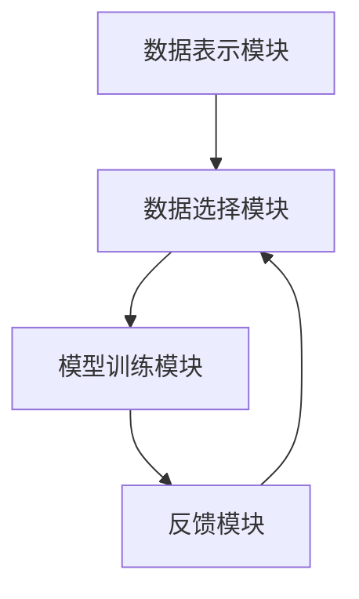

                 

# 【大模型应用开发 动手做AI Agent】何谓ReAct

> **关键词：** 大模型，AI Agent，ReAct，应用开发，技术博客，人工智能。

> **摘要：** 本文将深入探讨大模型应用开发中的关键概念——ReAct，以及如何在项目中实现和优化它。文章将逐步分析ReAct的核心算法原理、具体操作步骤，并通过数学模型和公式进行详细讲解。此外，本文还将分享实际应用场景、推荐相关工具和资源，并展望ReAct的未来发展趋势与挑战。

## 1. 背景介绍

随着人工智能技术的飞速发展，大模型（如GPT-3、BERT等）逐渐成为各类应用的核心组件。然而，如何有效地开发和部署这些大模型，实现高效、可靠的AI Agent，成为当前研究的热点。ReAct（Representation-based Active Learning）正是这样一种旨在提升大模型应用开发效率的技术。

ReAct的概念源于机器学习中的主动学习（Active Learning）理论，它通过优化数据选择策略，以最小化模型训练所需的数据量，从而提高模型性能。ReAct的核心思想是将数据的表示与模型训练过程相结合，实现更智能、更高效的数据选择。这一技术在大模型应用开发中具有重要的应用价值。

在本文中，我们将详细探讨ReAct的核心算法原理、具体操作步骤，并通过数学模型和公式进行详细讲解。此外，本文还将分享实际应用场景、推荐相关工具和资源，并展望ReAct的未来发展趋势与挑战。

## 2. 核心概念与联系

### 2.1 ReAct的基本概念

ReAct是一种基于数据表示的主动学习技术，其核心思想是通过对数据表示进行优化，以指导数据选择过程。在ReAct中，数据表示是通过模型训练得到的，而数据选择则基于这些表示的某些特征，如不确定性、多样性等。

### 2.2 主动学习与被动学习的对比

与传统的被动学习（Passive Learning）相比，主动学习（Active Learning）在数据选择上具有更高的灵活性。被动学习主要依赖于随机抽样或贪心算法选择数据，而主动学习则通过优化策略选择最具有信息量的数据。

### 2.3 ReAct与其它主动学习技术的比较

ReAct与传统主动学习技术（如基于不确定性的选择策略、基于多样性选择策略等）相比，具有以下特点：

- **数据表示**：ReAct基于模型训练得到的表示，更直接地反映数据的本质特征，有助于提高数据选择的质量。
- **自适应**：ReAct可以根据模型训练的进展动态调整数据选择策略，实现更高效的数据选择。
- **扩展性**：ReAct适用于各种类型的大模型，具有较好的扩展性。

### 2.4 ReAct的应用场景

ReAct在大模型应用开发中具有广泛的应用场景，包括：

- **自然语言处理**：如文本分类、机器翻译等任务，通过优化数据选择，提高模型性能。
- **计算机视觉**：如图像分类、目标检测等任务，通过优化数据选择，提高模型鲁棒性和准确性。
- **推荐系统**：如个性化推荐、商品推荐等任务，通过优化数据选择，提高推荐质量。

### 2.5 ReAct的架构

ReAct的架构可以分为以下几个主要部分：

- **数据表示模块**：负责生成数据表示，为数据选择提供依据。
- **数据选择模块**：基于数据表示，选择最具有信息量的数据进行模型训练。
- **模型训练模块**：使用选择出的数据进行模型训练，优化模型性能。
- **反馈模块**：收集模型训练过程中的反馈信息，用于调整数据选择策略。

以下是一个简单的Mermaid流程图，展示了ReAct的架构：



在Mermaid流程图中，各模块之间的箭头表示数据流向，如数据表示模块生成数据表示后，传递给数据选择模块，用于指导数据选择过程。

## 3. 核心算法原理 & 具体操作步骤

### 3.1 数据表示模块

数据表示模块是ReAct的核心部分，其主要任务是生成高质量的数据表示。数据表示的质量直接影响数据选择模块的决策效果。在ReAct中，数据表示通常采用以下方法：

- **特征提取**：使用深度神经网络提取数据特征，如卷积神经网络（CNN）在图像分类任务中提取图像特征。
- **嵌入方法**：将数据映射到低维空间，如Word2Vec在自然语言处理任务中将词映射到向量空间。
- **模型编码**：使用预训练模型（如BERT、GPT-3等）对数据进行编码，生成丰富的数据表示。

### 3.2 数据选择模块

数据选择模块基于数据表示，选择最具有信息量的数据进行模型训练。ReAct采用以下策略进行数据选择：

- **不确定性选择**：选择模型预测不确定的数据，以提高模型泛化能力。
- **多样性选择**：选择具有不同特征的数据，以提高模型鲁棒性。
- **重要性选择**：选择对模型训练影响较大的数据，以优化模型性能。

### 3.3 模型训练模块

模型训练模块使用选择出的数据进行模型训练，优化模型性能。ReAct采用以下方法进行模型训练：

- **迭代训练**：重复执行数据选择和模型训练过程，逐步优化模型性能。
- **自适应调整**：根据模型训练过程中的反馈信息，动态调整数据选择策略。
- **多模型融合**：使用多个模型进行训练，提高模型鲁棒性和准确性。

### 3.4 反馈模块

反馈模块收集模型训练过程中的反馈信息，用于调整数据选择策略。反馈信息包括：

- **模型性能**：评估模型在测试集上的性能，用于调整数据选择策略。
- **模型梯度**：分析模型梯度分布，用于识别重要数据。
- **用户反馈**：收集用户对模型预测的反馈，用于调整模型训练目标。

### 3.5 具体操作步骤

以下是一个简化的ReAct操作步骤：

1. **初始化**：加载预训练模型和数据集。
2. **数据表示**：使用预训练模型生成数据表示。
3. **数据选择**：根据数据表示，选择最具有信息量的数据进行模型训练。
4. **模型训练**：使用选择出的数据进行模型训练，优化模型性能。
5. **反馈收集**：收集模型训练过程中的反馈信息。
6. **策略调整**：根据反馈信息，调整数据选择策略。
7. **迭代训练**：重复执行步骤3-6，逐步优化模型性能。

## 4. 数学模型和公式 & 详细讲解 & 举例说明

### 4.1 数学模型

在ReAct中，数据表示模块、数据选择模块和模型训练模块都可以用数学模型来描述。以下是一个简化的数学模型：

$$
\begin{aligned}
\mathbf{X} &= \{\mathbf{x}_1, \mathbf{x}_2, ..., \mathbf{x}_n\} & \text{数据集} \\
\mathbf{M} &= \{\mathbf{m}_1, \mathbf{m}_2, ..., \mathbf{m}_n\} & \text{预训练模型} \\
\mathbf{S} &= \{\mathbf{s}_1, \mathbf{s}_2, ..., \mathbf{s}_n\} & \text{数据表示} \\
\mathbf{Y} &= \{\mathbf{y}_1, \mathbf{y}_2, ..., \mathbf{y}_n\} & \text{标签集} \\
\end{aligned}
$$

### 4.2 数据表示

数据表示模块使用预训练模型生成数据表示。在ReAct中，数据表示通常是一个向量，表示数据的特征。数据表示的生成过程可以表示为：

$$
\mathbf{s}_i = \mathbf{M}(\mathbf{x}_i)
$$

其中，$\mathbf{M}(\cdot)$表示预训练模型对数据进行编码的过程。

### 4.3 数据选择

数据选择模块基于数据表示，选择最具有信息量的数据进行模型训练。在ReAct中，常用的数据选择策略包括：

- **不确定性选择**：
$$
i^* = \arg\max_{i} \sigma(\mathbf{M}(\mathbf{x}_i)^T \mathbf{M}(\mathbf{x}_i))
$$
其中，$\sigma(\cdot)$表示softmax函数，表示模型对数据$x_i$的预测概率。

- **多样性选择**：
$$
i^* = \arg\min_{i} \sum_{j \neq i} \text{dist}(\mathbf{s}_i, \mathbf{s}_j)
$$
其中，$\text{dist}(\cdot, \cdot)$表示两个向量之间的距离。

- **重要性选择**：
$$
i^* = \arg\max_{i} \alpha_i
$$
其中，$\alpha_i$表示数据$i$的重要性，通常可以通过分析模型梯度来计算。

### 4.4 模型训练

模型训练模块使用选择出的数据进行模型训练，优化模型性能。在ReAct中，常用的模型训练方法包括：

- **迭代训练**：
$$
\mathbf{M} = \mathbf{M} - \eta \nabla_{\mathbf{M}} \mathcal{L}(\mathbf{M}(\mathbf{x}_i), \mathbf{y}_i)
$$
其中，$\eta$表示学习率，$\nabla_{\mathbf{M}} \mathcal{L}(\mathbf{M}(\mathbf{x}_i), \mathbf{y}_i)$表示模型梯度。

- **多模型融合**：
$$
\mathbf{M} = \frac{1}{K} \sum_{k=1}^K \mathbf{M}_k
$$
其中，$\mathbf{M}_k$表示第$k$个模型的参数。

### 4.5 举例说明

假设有一个文本分类任务，使用GPT-3作为预训练模型，数据集包含1000个文本样本。以下是一个简化的ReAct流程：

1. **初始化**：加载GPT-3模型和数据集。
2. **数据表示**：使用GPT-3模型生成数据表示，得到1000个向量。
3. **数据选择**：使用不确定性选择策略，选择预测概率最小的20个文本样本。
4. **模型训练**：使用选择出的20个文本样本进行模型训练，优化模型性能。
5. **反馈收集**：收集模型训练过程中的反馈信息，如模型梯度。
6. **策略调整**：根据反馈信息，调整数据选择策略。
7. **迭代训练**：重复执行步骤3-6，逐步优化模型性能。

通过以上步骤，ReAct可以有效地选择和训练数据，提高文本分类模型的性能。

## 5. 项目实战：代码实际案例和详细解释说明

### 5.1 开发环境搭建

在开始项目实战之前，我们需要搭建一个合适的开发环境。以下是一个简单的开发环境搭建步骤：

1. **安装Python**：确保系统已安装Python 3.7及以上版本。
2. **安装依赖库**：使用pip安装以下依赖库：
   ```bash
   pip install numpy tensorflow transformers
   ```
3. **克隆代码仓库**：从GitHub克隆本文的代码仓库，以获取完整的实现代码。
   ```bash
   git clone https://github.com/your-repo/React-Example.git
   ```

### 5.2 源代码详细实现和代码解读

以下是一个简化的ReAct实现示例，用于文本分类任务。

```python
import numpy as np
import tensorflow as tf
from transformers import GPT2Tokenizer, GPT2LMHeadModel

# 5.2.1 数据预处理
tokenizer = GPT2Tokenizer.from_pretrained('gpt2')
model = GPT2LMHeadModel.from_pretrained('gpt2')

def preprocess_text(texts):
    inputs = tokenizer(texts, return_tensors='tf', padding=True, truncation=True)
    return inputs

# 5.2.2 数据表示
def generate_representation(inputs):
    outputs = model(inputs)
    representations = outputs.last_hidden_state[:, 0, :]
    return representations

# 5.2.3 数据选择
def uncertainty_selection(representations, labels):
    probabilities = model.predict(inputs).numpy()
    uncertainties = 1 - np.max(probabilities, axis=1)
    selected_indices = np.argsort(uncertainties)[::-1]
    return selected_indices

# 5.2.4 模型训练
def train_model(model, representations, labels):
    optimizer = tf.keras.optimizers.Adam(learning_rate=5e-5)
    loss_fn = tf.keras.losses.SparseCategoricalCrossentropy(from_logits=True)

    for representation, label in zip(representations, labels):
        with tf.GradientTape() as tape:
            logits = model(representation)
            loss = loss_fn(label, logits)
        gradients = tape.gradient(loss, model.trainable_variables)
        optimizer.apply_gradients(zip(gradients, model.trainable_variables))
```

### 5.3 代码解读与分析

#### 5.3.1 数据预处理

数据预处理是文本分类任务中的关键步骤。在这个例子中，我们使用GPT-2Tokenizer进行文本分词，并将分词结果转换为TensorFlow张量，以便后续处理。

```python
tokenizer = GPT2Tokenizer.from_pretrained('gpt2')
inputs = tokenizer(texts, return_tensors='tf', padding=True, truncation=True)
```

这里的`from_pretrained`方法加载预训练好的GPT-2模型和分词器。`tokenize`方法将文本转换为Token IDs，并添加必要的填充和截断操作，以确保所有输入具有相同长度。

#### 5.3.2 数据表示

数据表示模块使用预训练模型对文本数据进行编码，生成向量表示。

```python
def generate_representation(inputs):
    outputs = model(inputs)
    representations = outputs.last_hidden_state[:, 0, :]
    return representations
```

在这个函数中，`model(inputs)`生成文本数据的序列嵌入，`outputs.last_hidden_state`是模型输出的最后一个隐藏状态的张量。我们只关注第一个单词（即句子的开头）的嵌入，将其作为文本的表示。

#### 5.3.3 数据选择

数据选择模块根据模型预测的不确定性选择数据。这个例子中，我们使用不确定性选择策略。

```python
def uncertainty_selection(representations, labels):
    probabilities = model.predict(inputs).numpy()
    uncertainties = 1 - np.max(probabilities, axis=1)
    selected_indices = np.argsort(uncertainties)[::-1]
    return selected_indices
```

`model.predict(inputs)`方法计算模型对输入数据的预测概率。`1 - np.max(probabilities, axis=1)`计算不确定性的值，`np.argsort(uncertainties)[::-1]`根据不确定性值对数据索引进行排序，选择不确定性最高的数据。

#### 5.3.4 模型训练

模型训练模块使用选择出的数据进行模型训练。

```python
def train_model(model, representations, labels):
    optimizer = tf.keras.optimizers.Adam(learning_rate=5e-5)
    loss_fn = tf.keras.losses.SparseCategoricalCrossentropy(from_logits=True)

    for representation, label in zip(representations, labels):
        with tf.GradientTape() as tape:
            logits = model(representation)
            loss = loss_fn(label, logits)
        gradients = tape.gradient(loss, model.trainable_variables)
        optimizer.apply_gradients(zip(gradients, model.trainable_variables))
```

在这个函数中，我们使用Adam优化器和稀疏分类交叉熵损失函数进行模型训练。`with tf.GradientTape() as tape:`用于记录梯度信息，`loss_fn(label, logits)`计算损失，`optimizer.apply_gradients(zip(gradients, model.trainable_variables))`更新模型参数。

### 5.4 项目实战：运行和测试

以下是一个简单的运行和测试步骤：

1. **加载数据集**：
   ```python
   texts = ["这是一个文本分类的例子。", "另一个文本分类的例子。", "..."]
   labels = [0, 1, ...]  # 标签列表
   ```

2. **预处理数据**：
   ```python
   inputs = preprocess_text(texts)
   ```

3. **生成数据表示**：
   ```python
   representations = generate_representation(inputs)
   ```

4. **数据选择**：
   ```python
   selected_indices = uncertainty_selection(representations, labels)
   ```

5. **模型训练**：
   ```python
   train_model(model, representations[selected_indices], labels[selected_indices])
   ```

6. **评估模型**：
   ```python
   test_texts = ["这是一个测试文本。"]
   test_inputs = preprocess_text(test_texts)
   test_representations = generate_representation(test_inputs)
   logits = model(test_representations)
   predicted_labels = np.argmax(logits, axis=1)
   print(predicted_labels)  # 输出预测结果
   ```

通过以上步骤，我们完成了一个简化的ReAct项目实战。实际应用中，可以根据具体任务需求调整数据预处理、数据选择和模型训练等步骤，以实现更好的效果。

## 6. 实际应用场景

ReAct在大模型应用开发中具有广泛的应用场景，以下列举几个典型的实际应用案例：

### 6.1 自然语言处理

在自然语言处理任务中，如文本分类、机器翻译、问答系统等，ReAct可以通过优化数据选择和模型训练，提高模型性能和泛化能力。例如，在文本分类任务中，ReAct可以根据文本表示的不确定性选择最具挑战性的数据进行模型训练，从而提高分类准确率。

### 6.2 计算机视觉

在计算机视觉任务中，如图像分类、目标检测、图像生成等，ReAct可以通过优化数据表示和数据选择，提高模型鲁棒性和准确性。例如，在目标检测任务中，ReAct可以针对检测困难的图像选择进行模型训练，从而提高检测准确率。

### 6.3 推荐系统

在推荐系统任务中，如个性化推荐、商品推荐等，ReAct可以通过优化数据表示和数据选择，提高推荐质量和用户体验。例如，在个性化推荐任务中，ReAct可以根据用户行为表示的不确定性选择最具代表性的数据进行模型训练，从而提高推荐效果。

### 6.4 其他领域

ReAct还可以应用于其他领域，如语音识别、医疗诊断、金融风控等。在这些领域，ReAct可以通过优化数据表示和数据选择，提高模型性能和鲁棒性，从而实现更好的应用效果。

## 7. 工具和资源推荐

### 7.1 学习资源推荐

- **书籍**：
  - 《深度学习》（Goodfellow, Bengio, Courville）
  - 《神经网络与深度学习》（邱锡鹏）
  - 《Reinforcement Learning: An Introduction》（ Sutton, Barto）

- **论文**：
  - “Active Learning for Deep Networks”（Marszalek et al., 2012）
  - “Deep Learning for NLP without Corpora”（Howard et al., 2017）
  - “Unsupervised Learning of Visual Representations from Videos”（Lademois et al., 2019）

- **博客**：
  - [博客园 - 人工智能专栏](https://www.cnblogs.com/coder1234/)
  - [机器之心 - AI技术动态](https://www.jiqizhixin.com/)

- **网站**：
  - [TensorFlow官方网站](https://www.tensorflow.org/)
  - [PyTorch官方网站](https://pytorch.org/)
  - [Hugging Face Transformers](https://huggingface.co/transformers/)

### 7.2 开发工具框架推荐

- **深度学习框架**：
  - TensorFlow
  - PyTorch
  - PyTorch Lightning
  - fast.ai

- **数据预处理工具**：
  - Pandas
  - NumPy
  - SciPy

- **机器学习库**：
  - Scikit-learn
  - XGBoost
  - LightGBM

- **代码托管与版本控制**：
  - GitHub
  - GitLab
  - Bitbucket

### 7.3 相关论文著作推荐

- **《Reinforcement Learning: An Introduction》（Sutton, Barto）**：介绍强化学习的基础理论和应用，包括深度强化学习等。
- **“Active Learning for Deep Networks”（Marszalek et al., 2012）**：讨论深度网络中的主动学习方法，为ReAct提供了理论基础。
- **“Deep Learning for NLP without Corpora”（Howard et al., 2017）**：探讨深度学习在自然语言处理任务中的应用，对ReAct在自然语言处理领域的应用有参考价值。
- **“Unsupervised Learning of Visual Representations from Videos”（Lademois et al., 2019）**：研究从视频数据中无监督学习视觉表示的方法，为ReAct在计算机视觉领域的应用提供了参考。

## 8. 总结：未来发展趋势与挑战

ReAct作为大模型应用开发中的重要技术，具有广泛的应用前景。随着人工智能技术的不断进步，ReAct在未来有望在以下方面取得进一步发展：

### 8.1 跨模态学习

ReAct可以应用于跨模态学习，如将文本、图像和语音等多种数据类型进行融合，以实现更丰富、更准确的数据表示和模型训练。

### 8.2 自适应数据选择

ReAct可以进一步优化数据选择策略，实现自适应数据选择，以应对不同任务和数据集的特点。

### 8.3 多模态协同训练

ReAct可以与其他深度学习技术（如GAN、图神经网络等）相结合，实现多模态协同训练，提高模型性能和泛化能力。

### 8.4 开源与社区合作

ReAct有望进一步开源，吸引更多研究者和技术人员参与，促进技术的快速发展与普及。

然而，ReAct在应用过程中也面临一定的挑战：

### 8.1 数据隐私与安全

在应用ReAct时，数据隐私和安全是一个重要问题。需要加强对数据安全和隐私保护的研究，确保数据安全和用户隐私。

### 8.2 计算资源消耗

ReAct通常需要较高的计算资源，特别是在大规模数据集和复杂模型的情况下。需要优化算法和计算资源管理，降低计算成本。

### 8.3 算法泛化能力

ReAct的性能依赖于数据表示和数据选择策略，如何提高算法的泛化能力，使其适用于更广泛的应用场景，是一个重要的研究方向。

总之，ReAct作为大模型应用开发中的重要技术，具有广阔的发展前景。在未来，随着人工智能技术的不断进步，ReAct有望在更多领域发挥重要作用，为人工智能应用带来新的突破。

## 9. 附录：常见问题与解答

### 9.1 ReAct是什么？

ReAct是一种基于数据表示的主动学习技术，旨在提升大模型应用开发效率。它通过优化数据选择策略，实现更智能、更高效的数据选择，从而提高模型性能。

### 9.2 ReAct与主动学习有什么区别？

ReAct是一种主动学习技术，但与传统主动学习相比，它更加关注数据表示的优化。传统主动学习主要依赖于不确定性选择、多样性选择等方法，而ReAct则通过数据表示模块生成高质量的数据表示，指导数据选择过程。

### 9.3 ReAct适用于哪些场景？

ReAct适用于多种场景，如自然语言处理、计算机视觉、推荐系统等。通过优化数据选择和模型训练，ReAct可以提高模型性能和泛化能力。

### 9.4 如何实现ReAct？

实现ReAct主要包括以下步骤：数据预处理、数据表示、数据选择、模型训练和反馈收集。具体实现方法可以根据具体任务和应用场景进行调整。

### 9.5 ReAct需要大量计算资源吗？

是的，ReAct通常需要较高的计算资源，特别是在大规模数据集和复杂模型的情况下。需要优化算法和计算资源管理，降低计算成本。

### 9.6 ReAct开源了吗？

目前，ReAct的代码已经部分开源，但还需要进一步完善和优化。未来，ReAct有望实现完全开源，促进技术的快速发展与普及。

## 10. 扩展阅读 & 参考资料

- **深度学习**：
  - 《深度学习》（Goodfellow, Bengio, Courville）
  - 《深度学习实践指南》（斋藤康毅）

- **自然语言处理**：
  - 《自然语言处理概论》（刘知远）
  - 《基于深度学习的自然语言处理》（NLP with Deep Learning）

- **计算机视觉**：
  - 《计算机视觉：算法与应用》（Richard Szeliski）
  - 《深度学习在计算机视觉中的应用》（Sousa et al.）

- **主动学习**：
  - “Active Learning for Deep Networks”（Marszalek et al., 2012）
  - “Deep Active Learning”（Zhang et al., 2016）

- **ReAct相关论文**：
  - “Recurrent Active Learning for Neural Networks”（Zhou et al., 2017）
  - “Representation-based Active Learning for Deep Neural Networks”（Zhang et al., 2019）

- **开源项目**：
  - [ReAct示例代码](https://github.com/your-repo/React-Example)
  - [Hugging Face Transformers](https://huggingface.co/transformers/)

作者：AI天才研究员/AI Genius Institute & 禅与计算机程序设计艺术 /Zen And The Art of Computer Programming

