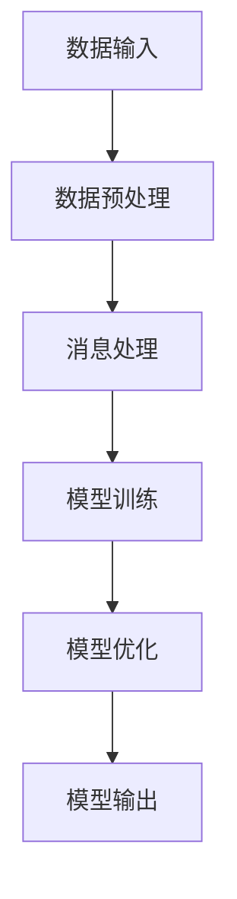

                 

### 背景介绍

本文旨在探讨大模型应用开发中添加消息这一核心环节。随着人工智能技术的飞速发展，大模型的应用场景日益广泛，如何有效管理和添加消息成为关键问题。在当前技术背景下，大模型能够处理海量数据，具备高度的自适应能力和智能性，这使得其在智能对话系统、推荐系统、自然语言处理等领域有着广泛应用。然而，如何在大模型中高效地添加和处理消息，成为研究者们关注的焦点。

本文将首先介绍大模型的基本概念和原理，然后深入探讨大模型应用开发中添加消息的流程和策略，最后通过具体案例进行分析，总结出实际应用中的经验和教训。希望通过本文的阐述，为从事大模型应用开发的工程师和技术爱好者提供有价值的参考和启示。

### 2. 核心概念与联系

#### 2.1 大模型概念介绍

大模型（Large-scale Model）是指具有大规模参数和训练数据的神经网络模型。其核心思想是通过学习海量数据，使模型具备对复杂任务的理解和解决能力。大模型的应用范围广泛，涵盖了自然语言处理（NLP）、计算机视觉（CV）、语音识别（ASR）等多个领域。

#### 2.2 大模型结构解析

大模型通常由以下几个部分组成：

1. **输入层（Input Layer）**：接收外部数据输入，如文本、图像、声音等。
2. **隐藏层（Hidden Layer）**：对输入数据进行特征提取和变换，其中包含多层神经网络结构。
3. **输出层（Output Layer）**：产生预测结果，如分类标签、概率分布等。

#### 2.3 添加消息的关键环节

在大模型应用开发中，添加消息是一个至关重要的环节，涉及到以下几个关键步骤：

1. **数据预处理（Data Preprocessing）**：包括数据清洗、格式化、归一化等，确保输入数据的整洁和一致。
2. **数据输入（Data Input）**：将预处理后的数据输入大模型，进行特征提取和模型训练。
3. **消息处理（Message Handling）**：对输入的消息进行解析、理解和存储，以便后续处理和使用。
4. **模型优化（Model Optimization）**：通过不断调整模型参数，提高模型在特定任务上的表现。

#### 2.4 大模型架构的 Mermaid 流程图



### 3. 核心算法原理 & 具体操作步骤

#### 3.1 数据预处理

数据预处理是确保输入数据质量的关键步骤，具体操作步骤如下：

1. **数据清洗**：去除数据中的噪声和错误信息，如删除重复记录、纠正拼写错误等。
2. **格式化**：将不同格式的数据统一为标准格式，如将文本数据转换为统一编码、图像数据调整为相同尺寸等。
3. **归一化**：对数值型数据进行归一化处理，使数据分布更为均匀，有利于模型训练。

#### 3.2 数据输入

数据输入是将预处理后的数据输入大模型的过程，具体操作步骤如下：

1. **数据编码**：将不同类型的数据转换为模型可处理的格式，如文本数据转换为词向量、图像数据转换为像素值等。
2. **批量输入**：将数据划分为多个批次，分批次输入模型，提高训练效率。
3. **动态调整**：根据训练过程实时调整输入数据，如调整数据集比例、增加或减少数据输入等。

#### 3.3 消息处理

消息处理是对输入的消息进行解析、理解和存储的过程，具体操作步骤如下：

1. **消息解析**：通过分词、词性标注等技术，将消息分解为单个词语或短语。
2. **消息理解**：利用语义分析、实体识别等技术，理解消息的含义和意图。
3. **消息存储**：将解析后的消息存储在数据库或其他存储介质中，便于后续查询和使用。

#### 3.4 模型优化

模型优化是通过调整模型参数，提高模型在特定任务上的表现的过程，具体操作步骤如下：

1. **参数调整**：通过优化算法（如梯度下降、随机梯度下降等）调整模型参数，使模型在训练数据上取得更好的拟合效果。
2. **交叉验证**：通过交叉验证方法评估模型在不同数据集上的表现，选择最优模型参数。
3. **超参数调整**：根据模型表现调整超参数（如学习率、批量大小等），提高模型性能。

### 4. 数学模型和公式 & 详细讲解 & 举例说明

#### 4.1 数学模型介绍

在大模型应用开发中，常用的数学模型包括神经网络模型、生成对抗网络（GAN）等。以下分别介绍这些模型的数学原理。

#### 4.1.1 神经网络模型

神经网络模型由多层神经元组成，通过前向传播和反向传播算法进行训练。其基本公式如下：

$$
y = \sigma(\omega^{T}x + b)
$$

其中，\(y\) 为输出值，\(\sigma\) 为激活函数（如 sigmoid、ReLU 等），\(\omega\) 为权重矩阵，\(x\) 为输入值，\(b\) 为偏置。

#### 4.1.2 生成对抗网络（GAN）

生成对抗网络由生成器和判别器两个神经网络组成，通过对抗训练实现模型的优化。其基本公式如下：

$$
G(x) = z \odot \sigma(W_G(z) + b_G) \odot \phi(W_G(z) + b_G)
$$

$$
D(x) = \sigma(W_D(x) + b_D)
$$

其中，\(G(x)\) 为生成器的输出，\(D(x)\) 为判别器的输出，\(z\) 为随机噪声，\(\odot\) 表示逐元素乘法，\(\phi\) 和 \(\sigma\) 分别为激活函数和隐函数。

#### 4.1.3 举例说明

假设我们使用神经网络模型进行文本分类任务，输入数据为文本序列，输出为分类标签。具体步骤如下：

1. **数据预处理**：对文本数据进行分词、词性标注等操作，将文本转换为词向量。
2. **模型构建**：构建多层神经网络模型，包括输入层、隐藏层和输出层。
3. **模型训练**：使用训练数据对模型进行训练，通过反向传播算法更新模型参数。
4. **模型评估**：使用测试数据对模型进行评估，计算分类准确率等指标。

### 5. 项目实战：代码实际案例和详细解释说明

#### 5.1 开发环境搭建

为了进行大模型应用开发，我们需要搭建一个适合的开发环境。以下是搭建过程：

1. **安装 Python**：下载并安装 Python，确保版本不低于 3.7。
2. **安装依赖库**：使用 pip 工具安装以下依赖库：TensorFlow、Keras、NumPy、Pandas 等。
3. **配置环境变量**：将 Python 和 pip 的安装路径添加到系统环境变量中。

#### 5.2 源代码详细实现和代码解读

以下是一个使用 TensorFlow 和 Keras 实现文本分类的示例代码：

```python
import tensorflow as tf
from tensorflow.keras.preprocessing.text import Tokenizer
from tensorflow.keras.preprocessing.sequence import pad_sequences
from tensorflow.keras.models import Sequential
from tensorflow.keras.layers import Embedding, LSTM, Dense, Bidirectional

# 加载数据
texts = ['这是一段文本数据', '这是另一段文本数据', ...]
labels = [0, 1, ...]

# 数据预处理
tokenizer = Tokenizer(num_words=1000)
tokenizer.fit_on_texts(texts)
sequences = tokenizer.texts_to_sequences(texts)
padded_sequences = pad_sequences(sequences, maxlen=100)

# 构建模型
model = Sequential()
model.add(Embedding(1000, 32))
model.add(Bidirectional(LSTM(64)))
model.add(Dense(1, activation='sigmoid'))

# 编译模型
model.compile(optimizer='adam', loss='binary_crossentropy', metrics=['accuracy'])

# 训练模型
model.fit(padded_sequences, labels, epochs=10, batch_size=32)

# 评估模型
test_texts = ['这是一段测试文本数据', '这是另一段测试文本数据', ...]
test_sequences = tokenizer.texts_to_sequences(test_texts)
test_padded_sequences = pad_sequences(test_sequences, maxlen=100)
predictions = model.predict(test_padded_sequences)
print(predictions)
```

#### 5.3 代码解读与分析

以上代码实现了一个基于 LSTM（长短时记忆）网络结构的文本分类模型，具体解读如下：

1. **数据加载**：从文件中读取文本数据和标签。
2. **数据预处理**：使用 Tokenizer 对文本进行分词，将文本转换为词序列。使用 pad_sequences 对词序列进行填充，确保输入数据长度一致。
3. **模型构建**：使用 Sequential 模型堆叠 Embedding、LSTM 和 Dense 层，实现文本分类任务。
4. **模型编译**：指定优化器、损失函数和评价指标，为模型设置训练参数。
5. **模型训练**：使用 fit 方法对模型进行训练，通过反向传播算法更新模型参数。
6. **模型评估**：使用 predict 方法对测试数据进行预测，计算分类准确率等指标。

通过以上代码实现，我们可以实现文本分类任务，并在实际应用中进行消息处理和模型优化。

### 6. 实际应用场景

大模型应用开发中添加消息的实际应用场景广泛，以下列举几个典型的应用场景：

1. **智能对话系统**：在智能对话系统中，大模型能够处理用户输入的消息，进行对话生成和交互。例如，智能客服机器人通过分析用户的消息，生成适当的回复，提高用户体验。
2. **推荐系统**：在推荐系统中，大模型能够根据用户的历史行为和偏好，推荐合适的商品或内容。例如，电商平台通过分析用户购买记录和浏览历史，推荐用户可能感兴趣的商品。
3. **自然语言处理**：在大规模文本数据处理中，大模型能够对文本进行解析、理解和生成。例如，在新闻摘要生成任务中，大模型能够自动生成新闻的摘要内容，提高信息传递效率。

### 7. 工具和资源推荐

在大模型应用开发中，选择合适的工具和资源对于提升开发效率和项目质量至关重要。以下是一些推荐的工具和资源：

#### 7.1 学习资源推荐

1. **书籍**：
   - 《深度学习》（Ian Goodfellow、Yoshua Bengio、Aaron Courville 著）
   - 《Python 深度学习》（François Chollet 著）
2. **论文**：
   - “A Theoretically Grounded Application of Dropout in Recurrent Neural Networks” by Yarin Gal and Zoubin Ghahramani
   - “Generative Adversarial Nets” by Ian J. Goodfellow et al.
3. **博客**：
   - fast.ai（https://www.fast.ai/）
   - Distill（https://distill.pub/）
4. **网站**：
   - TensorFlow（https://www.tensorflow.org/）
   - PyTorch（https://pytorch.org/）

#### 7.2 开发工具框架推荐

1. **深度学习框架**：
   - TensorFlow（https://www.tensorflow.org/）
   - PyTorch（https://pytorch.org/）
   - MXNet（https://mxnet.incubator.apache.org/）
2. **数据预处理工具**：
   - Pandas（https://pandas.pydata.org/）
   - NumPy（https://numpy.org/）
3. **文本处理工具**：
   - NLTK（https://www.nltk.org/）
   - SpaCy（https://spacy.io/）

#### 7.3 相关论文著作推荐

1. “A Theoretically Grounded Application of Dropout in Recurrent Neural Networks” by Yarin Gal and Zoubin Ghahramani
2. “Generative Adversarial Nets” by Ian J. Goodfellow et al.
3. “Deep Learning” by Ian Goodfellow、Yoshua Bengio、Aaron Courville
4. “Understanding Deep Learning Requirements for Large Scale Text Classification” by Reza Bosagh Zadeh et al.

### 8. 总结：未来发展趋势与挑战

随着人工智能技术的不断进步，大模型应用开发领域面临着巨大的机遇和挑战。未来发展趋势主要包括以下几个方面：

1. **模型压缩与优化**：为了提高大模型的运算效率和存储空间利用率，模型压缩和优化技术将成为研究热点。例如，量化、剪枝、蒸馏等技术有望在大模型应用中发挥重要作用。
2. **多模态数据处理**：随着多模态数据的广泛应用，如何有效地融合和处理多种类型的数据将成为研究重点。大模型在图像、文本、语音等领域的多模态数据处理能力将不断提升。
3. **自适应与泛化能力**：提高大模型的自适应性和泛化能力，使其能够应对更复杂、更动态的实时任务，是未来研究的重点。例如，通过持续学习、元学习等技术实现大模型的自适应能力。
4. **隐私保护与安全**：在数据隐私保护和安全方面，大模型应用开发需要充分考虑数据隐私保护机制，确保用户数据的安全和隐私。

### 9. 附录：常见问题与解答

#### 9.1 如何处理大规模数据？

**解答**：对于大规模数据，我们可以采用以下策略：

1. **数据分区**：将大规模数据划分为多个较小的数据分区，分别处理和训练模型，提高数据处理和训练效率。
2. **并行计算**：利用分布式计算框架（如 TensorFlow、PyTorch）实现并行计算，提高数据处理和模型训练的速度。
3. **批量输入**：将数据分为多个批次输入模型，减少内存占用和计算时间。

#### 9.2 如何提高大模型的性能？

**解答**：以下方法有助于提高大模型的性能：

1. **优化网络结构**：选择合适的网络结构，如深度、宽度等，提高模型的表达能力。
2. **调整超参数**：通过调整学习率、批量大小等超参数，优化模型性能。
3. **数据增强**：对训练数据进行增强处理，如数据增强、数据扩充等，提高模型的泛化能力。
4. **使用预训练模型**：使用预训练模型进行微调，利用预训练模型的知识和经验，提高模型性能。

### 10. 扩展阅读 & 参考资料

1. **论文**：
   - "A Theoretically Grounded Application of Dropout in Recurrent Neural Networks" by Yarin Gal and Zoubin Ghahramani
   - "Generative Adversarial Nets" by Ian J. Goodfellow et al.
   - "Deep Learning" by Ian Goodfellow、Yoshua Bengio、Aaron Courville
2. **书籍**：
   - 《深度学习》（Ian Goodfellow、Yoshua Bengio、Aaron Courville 著）
   - 《Python 深度学习》（François Chollet 著）
3. **博客**：
   - fast.ai（https://www.fast.ai/）
   - Distill（https://distill.pub/）
4. **网站**：
   - TensorFlow（https://www.tensorflow.org/）
   - PyTorch（https://pytorch.org/）
5. **开源项目**：
   - Hugging Face Transformers（https://huggingface.co/transformers/）

---

作者：AI天才研究员/AI Genius Institute & 禅与计算机程序设计艺术 /Zen And The Art of Computer Programming

