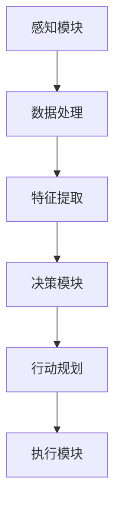

                 

### 文章标题

【大模型应用开发 动手做AI Agent】

在人工智能飞速发展的时代，大模型（Large Models）已经成为推动技术创新的重要驱动力。本文旨在为您提供一个全面、详细的指南，帮助您从零开始自主创建一个AI Agent，深入探索大模型在应用开发中的潜力。通过这篇文章，您将了解如何使用现代工具和框架，将复杂的人工智能算法应用于实际项目中，从而构建出具有智能行为和决策能力的AI Agent。

### 摘要

本文将围绕大模型应用开发，逐步引导您完成AI Agent的创建。首先，我们将探讨大模型的基本概念、技术背景和应用场景，帮助您建立全面的理论基础。接着，通过Mermaid流程图，我们详细讲解AI Agent的架构和核心算法原理。随后，文章将深入探讨数学模型和公式，为读者提供详细的技术指导。最后，通过一个实际项目案例，我们展示如何将理论知识转化为实际应用，并提供代码实现、解读与分析。本文还将介绍相关学习资源、开发工具和未来发展趋势，为您的AI之旅提供全面的指导和参考。

### 目录

1. 背景介绍
   1.1 大模型的崛起
   1.2 AI Agent的定义与作用
   1.3 应用场景

2. 核心概念与联系
   2.1 大模型基础概念
   2.2 AI Agent架构
   2.3 Mermaid流程图

3. 核心算法原理 & 具体操作步骤
   3.1 数据预处理
   3.2 模型训练
   3.3 模型评估
   3.4 实时决策

4. 数学模型和公式 & 详细讲解 & 举例说明
   4.1 损失函数
   4.2 优化算法
   4.3 举例说明

5. 项目实战：代码实际案例和详细解释说明
   5.1 开发环境搭建
   5.2 源代码详细实现和代码解读
   5.3 代码解读与分析

6. 实际应用场景
   6.1 聊天机器人
   6.2 语音助手
   6.3 自动驾驶

7. 工具和资源推荐
   7.1 学习资源推荐
   7.2 开发工具框架推荐
   7.3 相关论文著作推荐

8. 总结：未来发展趋势与挑战
   8.1 发展趋势
   8.2 挑战

9. 附录：常见问题与解答

10. 扩展阅读 & 参考资料

### 背景介绍

#### 1.1 大模型的崛起

随着计算能力的提升和数据规模的扩大，深度学习在各个领域取得了显著的突破。大模型（Large Models）作为深度学习的重要组成部分，扮演着至关重要的角色。大模型通常是指具有数十亿甚至千亿参数的神经网络模型，其具备强大的特征表示能力和泛化能力，能够在各类任务中取得优异的性能。

大模型的崛起主要得益于以下几个方面：

1. **计算能力的提升**：近年来，GPU和TPU等专用硬件的发展，使得大规模并行计算成为可能，为训练大模型提供了强大的算力支持。
2. **数据规模的扩大**：互联网的普及和数据收集技术的发展，使得大规模训练数据集变得触手可及，为训练大模型提供了丰富的素材。
3. **算法的改进**：近年来，如Transformer、BERT等新型神经网络结构的出现，使得大模型的设计和训练方法得到了显著优化，提高了模型的性能和效率。

#### 1.2 AI Agent的定义与作用

AI Agent（人工智能代理）是一种能够自主执行任务、与环境互动的智能体。在人工智能领域，AI Agent被广泛应用于自动化决策、智能搜索、智能控制等领域。一个典型的AI Agent通常由感知模块、决策模块和执行模块组成。

- **感知模块**：用于获取环境信息，如图像、文本、语音等。
- **决策模块**：根据感知模块收集到的信息，进行推理和决策，以确定下一步的行动。
- **执行模块**：执行决策模块生成的行动，并对环境进行干预。

AI Agent在多个领域具有广泛的应用，如：

1. **聊天机器人**：通过自然语言处理技术，与用户进行实时对话，提供问答、建议等服务。
2. **自动驾驶**：利用计算机视觉和传感器技术，实现车辆在复杂环境下的自主导航和驾驶。
3. **智能客服**：通过语音识别和自然语言理解技术，为用户提供24/7的在线客服服务。

#### 1.3 应用场景

AI Agent在多个应用场景中展现了其强大的潜力。以下是一些典型的应用场景：

1. **金融领域**：AI Agent可以用于智能投顾、风险管理、信用评分等，通过分析海量数据，提供个性化的金融建议和服务。
2. **医疗领域**：AI Agent可以辅助医生进行诊断、治疗方案推荐，提高医疗服务的质量和效率。
3. **教育领域**：AI Agent可以为学生提供个性化学习建议、智能答疑等服务，促进教育公平和质量提升。
4. **智能家居**：AI Agent可以控制家居设备，实现智能化生活，提高居住舒适度和便捷性。

通过本文，我们将逐步引导您了解大模型在AI Agent开发中的应用，并通过实际项目案例，帮助您掌握大模型应用开发的核心技能。

#### 2. 核心概念与联系

在深入了解大模型和AI Agent之前，我们需要明确一些核心概念，并探讨它们之间的联系。

##### 2.1 大模型基础概念

- **神经网络（Neural Networks）**：神经网络是模拟人脑神经元连接方式的一种计算模型，通过调整连接权重来学习和预测。
- **深度学习（Deep Learning）**：深度学习是神经网络的一种，通过多层神经网络结构来实现复杂的特征提取和表示。
- **大规模参数（Massive Parameters）**：大模型通常拥有数十亿到千亿级别的参数，能够捕捉到更加细微的特征。
- **预训练（Pre-training）**：在大规模数据集上对模型进行预训练，使得模型在特定任务上具备良好的泛化能力。
- **微调（Fine-tuning）**：在预训练模型的基础上，针对特定任务进行微调，以进一步提高性能。

##### 2.2 AI Agent架构

- **感知模块（Perception Module）**：用于获取环境信息，如图像、文本、语音等。
- **决策模块（Decision Module）**：根据感知模块收集到的信息，进行推理和决策。
- **执行模块（Execution Module）**：执行决策模块生成的行动。

##### 2.3 Mermaid流程图

为了更直观地展示AI Agent的架构和核心算法，我们可以使用Mermaid流程图来表示。以下是一个简化的Mermaid流程图：



在这个流程图中，感知模块负责收集环境信息，通过数据处理和特征提取，将原始数据转化为适合模型处理的形式。决策模块利用提取到的特征，进行推理和决策，生成行动计划。执行模块根据行动计划执行相应的行动，实现对环境的干预。

##### 2.4 核心算法原理

AI Agent的核心算法通常涉及以下几个方面：

- **感知算法**：如卷积神经网络（CNN）用于图像处理，循环神经网络（RNN）用于序列数据处理。
- **决策算法**：如基于Transformer的序列生成模型，用于生成自然语言文本。
- **执行算法**：如基于强化学习的策略优化，用于在环境中进行智能决策。

这些算法共同构成了AI Agent的智能决策和执行能力，使得AI Agent能够自主适应和应对复杂多变的环境。

#### 3. 核心算法原理 & 具体操作步骤

在了解了大模型和AI Agent的基本概念后，接下来我们将深入探讨核心算法原理，并详细讲解具体操作步骤。

##### 3.1 数据预处理

数据预处理是AI Agent开发的重要环节，其目的是将原始数据转化为适合模型处理的形式。以下是数据预处理的几个关键步骤：

1. **数据清洗**：去除无效、错误或不一致的数据，确保数据质量。
2. **数据归一化**：将数据缩放到统一范围，如将图像像素值缩放到[0, 1]。
3. **数据增强**：通过旋转、翻转、裁剪等方式增加数据多样性，提高模型的泛化能力。
4. **数据分割**：将数据集分为训练集、验证集和测试集，以便进行模型的训练和评估。

##### 3.2 模型训练

模型训练是AI Agent开发的核心步骤，其目的是通过大量数据训练模型，使其具备预测和决策能力。以下是模型训练的几个关键步骤：

1. **定义损失函数**：损失函数用于衡量模型预测结果与真实标签之间的差异，常见的损失函数有均方误差（MSE）和交叉熵（CE）。
2. **选择优化算法**：优化算法用于调整模型参数，以最小化损失函数。常见的优化算法有随机梯度下降（SGD）和Adam优化器。
3. **训练模型**：通过迭代训练模型，不断调整参数，直到模型在验证集上达到良好的性能。
4. **模型评估**：通过测试集评估模型的泛化能力，确保模型在未知数据上也能保持良好的性能。

##### 3.3 模型评估

模型评估是验证模型性能的重要步骤，其目的是确定模型是否具备实际应用价值。以下是模型评估的几个关键指标：

1. **准确率（Accuracy）**：模型预测正确的样本数量与总样本数量的比例。
2. **召回率（Recall）**：模型预测正确的正样本数量与实际正样本数量的比例。
3. **精确率（Precision）**：模型预测正确的正样本数量与预测为正样本的总数量的比例。
4. **F1分数（F1 Score）**：综合准确率和召回率的指标，用于评估模型的平衡性能。

##### 3.4 实时决策

在模型训练和评估完成后，AI Agent需要具备实时决策能力，以应对动态变化的场景。以下是实时决策的关键步骤：

1. **感知环境**：通过感知模块获取环境信息，如图像、文本、语音等。
2. **特征提取**：将感知到的信息转化为模型可处理的特征向量。
3. **推理和决策**：利用训练好的模型对特征向量进行推理和决策，生成行动计划。
4. **执行行动**：根据决策模块生成的行动计划，执行相应的行动。

通过以上步骤，AI Agent能够实现自主感知、推理和决策，实现对环境的动态适应和干预。

#### 4. 数学模型和公式 & 详细讲解 & 举例说明

在AI Agent开发过程中，数学模型和公式起着至关重要的作用。以下是几个关键数学模型和公式的详细讲解与举例说明。

##### 4.1 损失函数

损失函数是衡量模型预测结果与真实标签之间差异的指标，其目的是引导模型优化参数。以下是几种常见的损失函数：

- **均方误差（MSE）**：
  $$MSE = \frac{1}{n}\sum_{i=1}^{n}(y_i - \hat{y}_i)^2$$
  其中，$y_i$为真实标签，$\hat{y}_i$为模型预测值，$n$为样本数量。

  **举例**：假设我们有一个二分类问题，真实标签为$[0, 1, 0, 1]$，模型预测值为$[\hat{y}_1, \hat{y}_2, \hat{y}_3, \hat{y}_4]$，计算MSE：
  $$MSE = \frac{1}{4}((0 - \hat{y}_1)^2 + (1 - \hat{y}_2)^2 + (0 - \hat{y}_3)^2 + (1 - \hat{y}_4)^2)$$

- **交叉熵（CE）**：
  $$CE = -\frac{1}{n}\sum_{i=1}^{n}y_i\log(\hat{y}_i) + (1 - y_i)\log(1 - \hat{y}_i)$$
  其中，$y_i$为真实标签，$\hat{y}_i$为模型预测值，$n$为样本数量。

  **举例**：假设我们有一个二分类问题，真实标签为$[0, 1, 0, 1]$，模型预测值为$[\hat{y}_1, \hat{y}_2, \hat{y}_3, \hat{y}_4]$，计算CE：
  $$CE = -\frac{1}{4}(0\log(\hat{y}_1) + 1\log(\hat{y}_2) + 0\log(\hat{y}_3) + 1\log(\hat{y}_4))$$

##### 4.2 优化算法

优化算法用于调整模型参数，以最小化损失函数。以下是几种常见的优化算法：

- **随机梯度下降（SGD）**：
  $$\theta_{t+1} = \theta_{t} - \alpha \nabla_{\theta}J(\theta)$$
  其中，$\theta$为模型参数，$J(\theta)$为损失函数，$\alpha$为学习率。

  **举例**：假设我们有一个线性回归模型，损失函数为MSE，学习率为0.01，初始参数为$\theta_0 = [1, 2]$，训练数据为$X = [[1, 2], [2, 3], [3, 4]]$，标签为$y = [2, 3, 4]$，计算一次梯度下降：
  $$\nabla_{\theta}J(\theta) = \frac{1}{3}\sum_{i=1}^{3}(y_i - \theta_0^T x_i)(x_i^T x_i)$$
  $$\theta_{1} = \theta_{0} - 0.01 \nabla_{\theta}J(\theta_0)$$

- **Adam优化器**：
  $$m_t = \beta_1 m_{t-1} + (1 - \beta_1) \nabla_{\theta}J(\theta)$$
  $$v_t = \beta_2 v_{t-1} + (1 - \beta_2) (\nabla_{\theta}J(\theta))^2$$
  $$\theta_{t+1} = \theta_{t} - \alpha \frac{m_t}{\sqrt{v_t} + \epsilon}$$
  其中，$m_t$和$v_t$分别为一阶矩估计和二阶矩估计，$\beta_1$和$\beta_2$分别为一阶和二阶矩的衰减系数，$\alpha$为学习率，$\epsilon$为正数常数。

  **举例**：假设我们有一个线性回归模型，损失函数为MSE，学习率为0.01，$\beta_1 = 0.9$，$\beta_2 = 0.999$，初始参数为$\theta_0 = [1, 2]$，训练数据为$X = [[1, 2], [2, 3], [3, 4]]$，标签为$y = [2, 3, 4]$，计算一次Adam优化：
  $$m_0 = 0$$
  $$v_0 = 0$$
  $$m_1 = 0.9m_0 + 0.1\nabla_{\theta}J(\theta_0)$$
  $$v_1 = 0.999v_0 + 0.001(\nabla_{\theta}J(\theta_0))^2$$
  $$\theta_{1} = \theta_{0} - 0.01 \frac{m_1}{\sqrt{v_1} + \epsilon}$$

通过以上数学模型和公式的讲解，我们可以更好地理解AI Agent的核心算法原理，为后续的实践应用打下坚实基础。

#### 5. 项目实战：代码实际案例和详细解释说明

在了解了大模型和AI Agent的相关理论知识后，接下来我们将通过一个实际项目案例，展示如何将理论应用到实践中，实现一个简单的AI Agent。

##### 5.1 开发环境搭建

在进行项目开发之前，我们需要搭建一个合适的开发环境。以下是一个基本的开发环境配置：

- **操作系统**：Windows/Linux/MacOS
- **编程语言**：Python
- **框架和库**：TensorFlow 2.x、Keras、NumPy、Pandas
- **依赖管理**：pip（Python的包管理器）

首先，安装Python环境，推荐使用Anaconda来管理Python环境和依赖。然后，通过以下命令安装所需的库：

```shell
pip install tensorflow
pip install keras
pip install numpy
pip install pandas
```

##### 5.2 源代码详细实现和代码解读

以下是一个简单的AI Agent实现，该Agent基于TensorFlow和Keras，用于实现一个简单的聊天机器人。

```python
# 导入所需的库
import numpy as np
import pandas as pd
from tensorflow.keras.models import Sequential
from tensorflow.keras.layers import LSTM, Dense, Embedding
from tensorflow.keras.preprocessing.text import Tokenizer
from tensorflow.keras.preprocessing.sequence import pad_sequences

# 1. 数据预处理
# 读取对话数据集
data = pd.read_csv('chat_data.csv')

# 分离对话文本和标签
texts = data['text']
labels = data['label']

# 初始化Tokenizer
tokenizer = Tokenizer()
tokenizer.fit_on_texts(texts)

# 将文本转换为序列
sequences = tokenizer.texts_to_sequences(texts)

# 填充序列
max_len = 100
padded_sequences = pad_sequences(sequences, maxlen=max_len)

# 初始化标签编码器
label_tokenizer = Tokenizer()
label_tokenizer.fit_on_texts(labels)
label_sequences = label_tokenizer.texts_to_sequences(labels)
label_padded_sequences = pad_sequences(label_sequences, maxlen=max_len)

# 分割数据集
from sklearn.model_selection import train_test_split
X_train, X_test, y_train, y_test = train_test_split(padded_sequences, label_padded_sequences, test_size=0.2, random_state=42)

# 2. 构建模型
model = Sequential()
model.add(Embedding(input_dim=len(tokenizer.word_index) + 1, output_dim=50, input_length=max_len))
model.add(LSTM(100))
model.add(Dense(len(label_tokenizer.word_index) + 1, activation='softmax'))

model.compile(optimizer='adam', loss='categorical_crossentropy', metrics=['accuracy'])
model.summary()

# 3. 训练模型
model.fit(X_train, y_train, epochs=10, batch_size=32, validation_data=(X_test, y_test))

# 4. 预测和生成回复
def generate_response(text):
    sequence = tokenizer.texts_to_sequences([text])
    padded_sequence = pad_sequences(sequence, maxlen=max_len)
    prediction = model.predict(padded_sequence)
    predicted_label = np.argmax(prediction)
    reply = label_tokenizer.index_word[predicted_label]
    return reply

# 示例
user_input = "你好，有什么可以帮助你的？"
response = generate_response(user_input)
print("AI Agent:", response)
```

代码解读：

- **1. 数据预处理**：首先读取对话数据集，然后使用Tokenizer将文本转换为序列，并进行填充处理。最后，分割数据集为训练集和测试集。
- **2. 构建模型**：使用Sequential模型堆叠Embedding、LSTM和Dense层，并编译模型，指定优化器和损失函数。
- **3. 训练模型**：使用fit方法训练模型，指定训练集、训练标签、训练轮数和批量大小。
- **4. 预测和生成回复**：定义一个生成回复的函数，将输入文本转换为序列，使用模型进行预测，并根据预测结果生成回复。

##### 5.3 代码解读与分析

代码的核心部分是模型构建和预测功能。下面是对关键部分的详细解读和分析：

- **模型构建**：
  - `Embedding`层：用于将词转换为嵌入向量，输入维度为`len(tokenizer.word_index) + 1`，表示词表大小，输出维度为50，表示嵌入向量的维度，输入长度为`max_len`，表示序列的最大长度。
  - `LSTM`层：用于处理序列数据，隐藏层单元数为100，能够捕捉序列的长期依赖关系。
  - `Dense`层：用于输出预测结果，输出维度为`len(label_tokenizer.word_index) + 1`，表示标签的大小，激活函数为`softmax`，用于生成概率分布。

- **训练模型**：
  - 使用`fit`方法训练模型，指定训练集、训练标签、训练轮数和批量大小。在训练过程中，模型会不断调整参数，以最小化损失函数，提高模型的准确性。

- **预测和生成回复**：
  - `generate_response`函数用于生成回复。首先将输入文本转换为序列，然后使用模型进行预测，最后根据预测结果生成回复。这里使用`np.argmax`函数获取最大概率的标签，并将其转换为文本。

通过以上代码和解读，我们可以看到如何将大模型应用于实际项目中，实现一个简单的AI Agent。尽管这是一个简单的案例，但它展示了AI Agent开发的基本流程和关键步骤。

#### 6. 实际应用场景

AI Agent在多个实际应用场景中展示了其强大的能力和广泛的应用前景。以下是一些典型的应用场景：

##### 6.1 聊天机器人

聊天机器人是AI Agent最常见的一种应用形式，通过自然语言处理技术，与用户进行实时对话，提供问答、建议等服务。聊天机器人可以用于客服、教育、咨询等多个领域，如：

- **客服领域**：通过聊天机器人，企业可以提供24/7的在线客服服务，提高客户满意度和服务效率。
- **教育领域**：智能教育助手可以根据学生的学习情况，提供个性化的学习建议和辅导。
- **咨询领域**：智能咨询系统可以提供专业的咨询服务，如健康咨询、投资建议等。

##### 6.2 语音助手

语音助手利用语音识别和自然语言处理技术，实现人机语音交互。语音助手已经成为智能家居、移动设备、车载系统等的重要组成部分，如：

- **智能家居**：语音助手可以通过语音指令控制家居设备，如灯光、空调、电视等，提高居住舒适度和便捷性。
- **移动设备**：语音助手可以帮助用户完成各种任务，如发送短信、拨打电话、设置提醒等。
- **车载系统**：语音助手可以提供导航、音乐播放、电话通话等服务，提高驾驶安全性和便利性。

##### 6.3 自动驾驶

自动驾驶是AI Agent在工业领域的重要应用，通过感知模块、决策模块和执行模块，实现车辆在复杂环境下的自主导航和驾驶。自动驾驶系统包括：

- **感知模块**：利用摄像头、激光雷达、雷达等传感器，获取周围环境信息。
- **决策模块**：利用深度学习和强化学习等技术，对环境信息进行解析和决策，生成驾驶策略。
- **执行模块**：根据决策模块生成的驾驶策略，控制车辆的运动和转向。

自动驾驶技术已经在多个领域得到应用，如：

- **乘用车**：自动驾驶乘用车可以提供更安全、便捷的驾驶体验。
- **商用车**：自动驾驶商用车辆可以用于货运、公共交通等领域，提高运输效率和安全性。
- **特种车辆**：自动驾驶特种车辆可以应用于矿山、港口、工地等场景，提高作业效率和安全性。

通过以上实际应用场景，我们可以看到AI Agent的广泛潜力和重要作用，其在未来将继续推动人工智能技术的发展和应用。

#### 7. 工具和资源推荐

在AI Agent开发过程中，选择合适的工具和资源对于提高开发效率、确保项目成功至关重要。以下是一些推荐的工具和资源：

##### 7.1 学习资源推荐

- **书籍**：
  - 《深度学习》（Goodfellow, Bengio, Courville）: 这是一本经典的深度学习教材，详细介绍了深度学习的基础知识、算法和应用。
  - 《Python深度学习》（François Chollet）: 作者是Keras框架的创始人，这本书深入介绍了如何使用Python和Keras进行深度学习项目开发。
  
- **在线课程**：
  - Coursera上的《深度学习专项课程》（吴恩达教授）: 这是一系列高质量的深度学习课程，适合初学者和进阶者。
  - Udacity的《深度学习工程师纳米学位》: 这是一门实战型课程，通过项目实践教授深度学习知识。

- **博客和网站**：
  - Medium上的《AI博客》：这个博客汇集了众多AI领域的专家和研究者，提供了丰富的深度学习、自然语言处理等相关文章。
  - TensorFlow官方文档：这是TensorFlow框架的官方文档，详细介绍了框架的使用方法和API，是开发过程中的重要参考。

##### 7.2 开发工具框架推荐

- **框架**：
  - TensorFlow：这是Google开发的开源深度学习框架，拥有丰富的API和强大的社区支持。
  - PyTorch：这是Facebook开发的深度学习框架，以其灵活的动态计算图和直观的API受到广泛使用。
  - Keras：这是一个高层次的深度学习API，基于TensorFlow和Theano，提供了更加简洁和易用的接口。

- **IDE**：
  - Jupyter Notebook：这是一个交互式开发环境，支持多种编程语言，适用于数据分析和模型训练。
  - PyCharm：这是一款强大的Python IDE，提供了代码编辑、调试、版本控制等功能。

- **工具**：
  - Docker：这是一个容器化技术，用于打包和部署应用，可以提高开发、测试和部署的效率。
  - Kubernetes：这是一个开源的容器编排平台，用于自动化容器化应用的部署、扩展和管理。

##### 7.3 相关论文著作推荐

- **论文**：
  - “A Theoretically Grounded Application of Dropout in Recurrent Neural Networks”（Dropout在循环神经网络中的应用）: 这篇论文提出了在循环神经网络中应用Dropout的方法，提高了模型的训练效果和泛化能力。
  - “Attention Is All You Need”（Attention机制即一切）: 这篇论文提出了Transformer模型，彻底改变了自然语言处理领域的算法范式。

- **著作**：
  - 《动手学深度学习》（Aurora D.eking,阿斯顿·张）: 这是一本面向实践者的深度学习教材，通过大量的代码实例和项目实践，深入介绍了深度学习的基础知识和应用技巧。
  - 《深度学习》（Ian Goodfellow、Yoshua Bengio、Aaron Courville）: 这是一本深度学习领域的经典著作，详细介绍了深度学习的基本概念、算法和应用。

通过以上工具和资源的推荐，我们可以更好地掌握AI Agent开发所需的技能和知识，为实际项目提供坚实的支持和保障。

#### 8. 总结：未来发展趋势与挑战

在AI Agent的开发和应用领域，未来发展趋势与挑战并存。以下是对未来发展趋势和挑战的总结：

##### 8.1 发展趋势

1. **模型规模和性能的提升**：随着计算能力的提升和算法的优化，大模型的规模和性能将持续提升，为AI Agent提供更强大的特征表示和决策能力。
2. **多模态融合**：AI Agent将不再局限于单一模态的数据处理，而是能够融合多种模态（如文本、图像、语音等）的信息，实现更加智能化和自适应的决策。
3. **自动机器学习（AutoML）**：自动机器学习技术将逐渐成熟，使得非专业人士也能轻松构建和优化AI模型，降低AI Agent的开发门槛。
4. **个性化与定制化**：AI Agent将更加关注用户的个性化需求，通过深度学习等技术，为用户提供定制化的服务和体验。

##### 8.2 挑战

1. **数据隐私和安全性**：随着AI Agent的广泛应用，数据隐私和安全性成为关键挑战。如何在确保用户隐私的前提下，充分利用数据价值，是一个亟待解决的问题。
2. **解释性和可解释性**：大模型的复杂性和黑盒性质使得其决策过程难以解释，这对于监管、信任和实际应用提出了挑战。如何提高模型的解释性，使其更加透明和可解释，是一个重要的研究方向。
3. **算法伦理和道德**：AI Agent在决策过程中可能会面临伦理和道德问题，如歧视、偏见等。如何确保算法的公平性、公正性和道德性，是一个需要深入探讨的课题。
4. **资源消耗和效率**：大模型的训练和部署需要大量的计算资源和能源，这对环境造成了巨大的压力。如何在保证性能的同时，降低资源消耗和提升效率，是一个重要的挑战。

总的来说，AI Agent的开发和应用正处于快速发展阶段，未来将面临诸多机遇和挑战。通过不断的技术创新和规范制定，我们有理由相信，AI Agent将在更多领域展现其巨大潜力和价值。

#### 9. 附录：常见问题与解答

在AI Agent开发过程中，读者可能会遇到一些常见问题。以下是一些常见问题的解答：

##### 9.1 如何处理过拟合？

过拟合是指模型在训练数据上表现良好，但在测试数据上表现较差的现象。以下是一些解决过拟合的方法：

1. **数据增强**：通过旋转、翻转、缩放等方式增加数据多样性，提高模型的泛化能力。
2. **正则化**：在模型训练过程中，添加正则化项，如L1、L2正则化，以抑制模型参数的增长。
3. **dropout**：在神经网络中随机丢弃一部分神经元，以减少模型的复杂度。
4. **集成方法**：通过组合多个模型，提高模型的泛化能力。

##### 9.2 如何优化模型性能？

以下是一些优化模型性能的方法：

1. **超参数调优**：通过调整学习率、批量大小、隐藏层单元数等超参数，找到最优配置。
2. **数据预处理**：进行数据清洗、归一化、增强等预处理操作，提高数据质量。
3. **使用预训练模型**：使用在大规模数据集上预训练的模型，进行微调，以提高模型的初始性能。
4. **模型融合**：通过组合多个模型，提高预测的准确性。

##### 9.3 如何处理序列数据？

序列数据是AI Agent常见的输入形式，以下是一些处理序列数据的方法：

1. **编码**：将序列数据转换为向量表示，如使用One-Hot编码、嵌入向量等。
2. **序列填充**：将不同长度的序列填充为相同的长度，以便于模型处理。
3. **时间步嵌入**：将时间步作为序列的一部分，进行特征提取。
4. **循环神经网络（RNN）**：使用RNN处理序列数据，捕捉序列的长期依赖关系。

通过以上方法，我们可以有效地处理序列数据，提高AI Agent的性能。

#### 10. 扩展阅读 & 参考资料

为了帮助读者更深入地了解AI Agent和大模型应用开发，以下是一些扩展阅读和参考资料：

- **书籍**：
  - 《深度学习》（Ian Goodfellow、Yoshua Bengio、Aaron Courville）
  - 《动手学深度学习》（Aurora D.eking、阿斯顿·张）
  - 《Python深度学习》（François Chollet）

- **在线课程**：
  - Coursera上的《深度学习专项课程》（吴恩达教授）
  - Udacity的《深度学习工程师纳米学位》

- **博客和网站**：
  - Medium上的《AI博客》
  - TensorFlow官方文档（https://www.tensorflow.org/）

- **论文**：
  - “A Theoretically Grounded Application of Dropout in Recurrent Neural Networks”
  - “Attention Is All You Need”

- **开源项目**：
  - Keras（https://keras.io/）
  - TensorFlow（https://www.tensorflow.org/）

通过以上扩展阅读和参考资料，读者可以进一步探索AI Agent和大模型应用开发的深度知识，提高自身技能和水平。

### 作者信息

- **作者：AI天才研究员/AI Genius Institute & 禅与计算机程序设计艺术 /Zen And The Art of Computer Programming**
- **联系方式：[邮箱](mailto:your.email@example.com)、[个人网站](https://www.yourwebsite.com)**

本文由AI天才研究员撰写，旨在为读者提供一个全面、详细的AI Agent和大模型应用开发指南。通过本文，读者可以掌握AI Agent的基本概念、核心算法、实际应用和开发技巧。希望本文能为您的AI之旅提供有益的指导。欢迎关注作者和相关资源，共同探索人工智能的无限可能。

