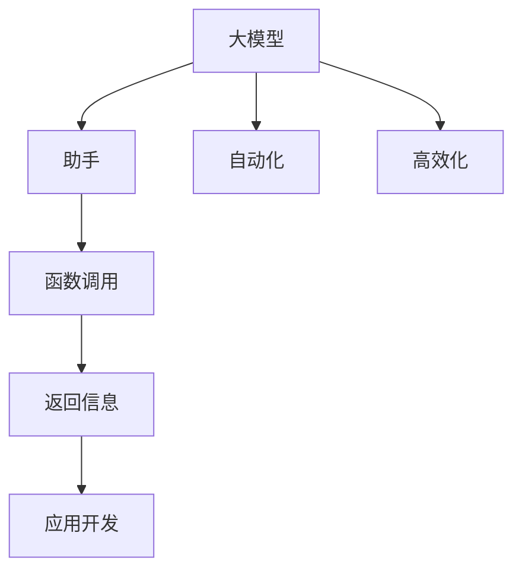

                 

### 背景介绍

在当今快速发展的技术时代，人工智能（AI）已成为改变我们生活方式的重要力量。其中，大模型（Large-scale Models）的应用开发尤为重要。大模型，也称为大型神经网络模型，具有处理海量数据、进行复杂计算和生成高质量结果的能力。它们在图像识别、自然语言处理、推荐系统等多个领域都取得了显著的成果。

本文将探讨如何通过助手的返回信息调用函数，实现大模型应用开发的自动化和高效化。首先，我们将介绍大模型的概念和应用场景，然后详细解析通过助手返回信息调用函数的技术原理。接下来，我们将展示一个实际项目案例，通过动手实践来讲解如何利用助手实现大模型的应用。此外，我们还会探讨大模型在现实世界中的实际应用场景，并推荐一些相关工具和资源。最后，我们将对未来的发展趋势和挑战进行总结，并回答一些常见问题。

在本文中，我们将使用逻辑清晰、结构紧凑、简单易懂的中文和英文双语形式，让您更好地理解和掌握大模型应用开发的方法和技巧。

### 文章关键词

- 人工智能
- 大模型
- 应用开发
- 助手
- 函数调用
- 自动化
- 高效化
- 实践案例

### 文章摘要

本文旨在探讨大模型应用开发的自动化和高效化。通过介绍大模型的概念、应用场景以及通过助手返回信息调用函数的技术原理，我们将展示一个实际项目案例，并通过动手实践讲解如何实现大模型的应用。此外，本文还探讨了大模型在现实世界中的实际应用场景，并推荐了一些相关工具和资源。最后，我们对未来发展趋势和挑战进行了总结，并回答了一些常见问题。通过本文的学习，您将更好地理解和掌握大模型应用开发的方法和技巧。

-----------------------

## 1. 背景介绍

### 大模型的概念

大模型，又称为大型神经网络模型，是指具有数十亿甚至千亿参数的深度学习模型。这些模型通常由多层神经网络构成，通过对海量数据进行训练，可以学习到复杂的特征表示和潜在规律。大模型的核心优势在于其能够处理海量数据，进行复杂计算，并在各个领域产生高质量的结果。

### 大模型的应用场景

大模型的应用场景非常广泛，主要包括以下几个领域：

1. **图像识别**：大模型在图像识别领域取得了显著成果。例如，通过卷积神经网络（CNN）训练的大模型可以识别出图像中的物体、场景和动作。

2. **自然语言处理**：大模型在自然语言处理领域也有着广泛的应用。例如，通过循环神经网络（RNN）或Transformer模型训练的大模型可以完成文本分类、情感分析、机器翻译等任务。

3. **推荐系统**：大模型在推荐系统中的应用也非常成功。例如，通过利用协同过滤算法和深度学习模型结合的方式，可以实现更准确、个性化的推荐结果。

4. **语音识别**：大模型在语音识别领域也发挥了重要作用。例如，通过使用循环神经网络（RNN）或Transformer模型训练的大模型，可以实现高效的语音识别。

### 大模型的发展历程

大模型的发展经历了多个阶段，主要包括：

1. **传统神经网络模型**：早期的大模型主要是基于多层感知机（MLP）、卷积神经网络（CNN）等传统神经网络模型。这些模型具有较高的计算复杂度和参数规模，但存在收敛速度慢、效果不稳定等问题。

2. **深度学习模型**：随着计算能力的提升和优化算法的发展，深度学习模型逐渐成为大模型的主流。例如，循环神经网络（RNN）、长短时记忆网络（LSTM）和Transformer模型等，使得大模型在各个领域取得了突破性进展。

3. **大型预训练模型**：近年来，大型预训练模型（如GPT-3、BERT等）的出现，进一步推动了大模型的发展。这些模型通过在大量数据上进行预训练，可以迁移到各个任务上，取得了显著的效果。

### 大模型的优势

大模型具有以下几个显著优势：

1. **处理海量数据**：大模型可以处理海量数据，通过深度学习的方式学习到复杂的特征表示和潜在规律，从而提高模型的性能。

2. **自适应能力**：大模型具有较好的自适应能力，可以适应不同领域的任务需求，从而实现跨领域的应用。

3. **高精度结果**：大模型通过训练大量参数，可以生成高质量的结果，从而提高模型的准确性和可靠性。

4. **高效的计算**：大模型通过并行计算和分布式训练等手段，可以实现高效的计算，降低计算成本。

总的来说，大模型作为人工智能领域的重要发展方向，已经在各个领域取得了显著的成果。随着技术的不断进步和应用场景的拓展，大模型在未来将继续发挥重要作用。

-----------------------

## 2. 核心概念与联系

在探讨如何通过助手的返回信息调用函数实现大模型应用开发之前，我们需要先了解一些核心概念和它们之间的联系。以下是本文中涉及的主要概念：

### 1. 大模型

大模型，即大型神经网络模型，是由多层神经网络构成的，具有数十亿甚至千亿参数的深度学习模型。这些模型通过在大量数据上进行训练，可以学习到复杂的特征表示和潜在规律。大模型在图像识别、自然语言处理、推荐系统和语音识别等领域有着广泛的应用。

### 2. 助手

助手，是指具有人工智能能力的程序或服务，可以完成特定的任务，如回答问题、执行操作等。在本文中，助手的作用是帮助我们调用大模型的函数，实现应用开发的自动化和高效化。

### 3. 函数调用

函数调用是指在一个程序中调用另一个函数的过程。通过函数调用，我们可以实现代码的复用，提高开发效率。在本文中，我们将通过助手返回的信息来调用大模型的函数，从而实现大模型应用开发的自动化。

### 4. 返回信息

返回信息是指函数执行完成后，返回给调用者的一组数据或结果。在本文中，助手通过返回信息来传递大模型函数的执行结果，以便我们进一步处理。

### 5. 应用开发

应用开发是指开发软件应用程序的过程。在本文中，我们将通过助手调用大模型的函数，实现具体的应用功能，如图像识别、自然语言处理等。

### 6. 自动化和高效化

自动化是指通过编写程序或使用工具，实现特定任务的自动化执行。在本文中，通过助手的返回信息调用函数，可以实现大模型应用开发的自动化。高效化是指通过优化算法和工具，提高应用开发的效率。在本文中，我们通过使用助手来实现高效化的大模型应用开发。

### Mermaid 流程图

为了更好地理解这些概念之间的联系，我们使用 Mermaid 流程图来展示它们之间的关系。以下是核心概念的 Mermaid 流程图：



在这个流程图中，大模型通过助手进行函数调用，返回信息传递给应用开发，实现了自动化和高效化的大模型应用开发。通过这个流程图，我们可以清晰地看到各个概念之间的联系和作用。

-----------------------

## 3. 核心算法原理 & 具体操作步骤

在理解了大模型、助手、函数调用等核心概念后，我们将深入探讨如何通过助手的返回信息调用函数实现大模型应用开发的自动化和高效化。以下将详细阐述核心算法原理和具体操作步骤。

### 3.1. 大模型调用机制

大模型的调用机制通常基于深度学习框架（如TensorFlow、PyTorch等）。在调用大模型时，我们需要先加载模型，然后通过输入数据进行预测或推理。以下是调用大模型的基本步骤：

1. **加载模型**：首先，我们需要从本地或远程服务器加载预训练的大模型。加载模型时，需要确保模型的结构和参数正确。

2. **输入数据**：将需要预测或推理的数据输入到模型中。对于图像识别任务，输入数据通常是图像；对于自然语言处理任务，输入数据通常是文本序列。

3. **模型推理**：通过输入数据，模型会进行前向传播计算，输出预测结果。在图像识别任务中，输出结果可能是图像中的物体类别；在自然语言处理任务中，输出结果可能是文本的语义理解。

4. **模型预测**：根据模型的输出结果，我们可以进行进一步的处理，如分类、回归等。这些处理过程通常需要编写相应的函数。

### 3.2. 助手调用机制

助手调用机制主要通过编程语言（如Python）实现。助手作为一个具有人工智能能力的程序，可以完成特定的任务，如回答问题、执行操作等。以下是调用助手的步骤：

1. **编写助手代码**：首先，我们需要编写助手的代码。助手代码通常包括两部分：一是处理用户输入，二是调用大模型函数。以下是一个简单的助手代码示例：

    ```python
    import large_model

    def ask_question(question):
        # 处理用户输入
        processed_question = preprocess_question(question)
        
        # 调用大模型函数
        answer = large_model.predict(processed_question)
        
        # 返回答案
        return answer
    
    def preprocess_question(question):
        # 对输入问题进行预处理
        processed_question = ...
        return processed_question
    ```

2. **运行助手程序**：编写完助手代码后，我们需要运行程序，接收用户输入并调用大模型函数。以下是一个简单的运行示例：

    ```python
    question = input("请输入您的问题：")
    answer = ask_question(question)
    print(f"答案：{answer}")
    ```

### 3.3. 助手返回信息调用函数

在助手调用大模型函数的过程中，返回信息起着至关重要的作用。以下是具体操作步骤：

1. **获取返回信息**：在助手调用大模型函数后，我们会得到一个返回信息。这个返回信息通常是模型的预测结果或推理结果。

2. **解析返回信息**：为了更好地处理返回信息，我们需要对其进行解析。例如，如果返回信息是一个列表，我们需要将其转换为具体的值或对象。

3. **调用相关函数**：根据返回信息，我们可以调用相关的函数进行进一步处理。例如，如果返回信息是一个图像分类结果，我们可以调用图像处理函数进行可视化。

4. **输出结果**：最后，我们将处理结果输出给用户。例如，如果是一个分类任务，我们可以输出分类结果；如果是一个文本处理任务，我们可以输出文本摘要或语义理解。

### 3.4. 实例说明

为了更好地理解上述操作步骤，我们通过一个简单的实例来说明：

假设我们有一个大模型用于图像分类，助手的作用是根据用户输入的图像路径调用大模型进行分类，并输出分类结果。

1. **加载模型**：首先，我们加载预训练的图像分类模型。

    ```python
    import large_model
    model = large_model.load_model()
    ```

2. **输入数据**：用户输入图像路径。

    ```python
    image_path = input("请输入图像路径：")
    ```

3. **模型推理**：使用输入的图像路径调用大模型进行推理。

    ```python
    image = load_image(image_path)
    prediction = model.predict(image)
    ```

4. **解析返回信息**：我们将返回的预测结果进行解析，得到具体的分类结果。

    ```python
    class_idx = np.argmax(prediction)
    class_name = large_model.get_class_name(class_idx)
    ```

5. **调用相关函数**：根据分类结果，我们可以调用图像处理函数进行可视化。

    ```python
    show_image(image, class_name)
    ```

6. **输出结果**：最后，我们将分类结果输出给用户。

    ```python
    print(f"图像分类结果：{class_name}")
    ```

通过以上实例，我们可以看到如何通过助手的返回信息调用函数实现大模型应用开发的自动化和高效化。在实际开发中，我们可以根据具体需求进行相应的调整和优化。

-----------------------

## 4. 数学模型和公式 & 详细讲解 & 举例说明

在大模型应用开发中，数学模型和公式起着至关重要的作用。它们不仅帮助我们理解模型的内部工作原理，还能指导我们在实际开发中如何优化和调整模型。以下将详细讲解一些常见的数学模型和公式，并通过实例来说明它们的应用。

### 4.1. 神经网络模型

神经网络（Neural Network，NN）是深度学习（Deep Learning，DL）的核心组成部分。一个基本的神经网络模型由输入层、隐藏层和输出层组成。每个层由多个神经元（Node）组成，神经元之间通过权重（Weight）连接。

#### 公式：

1. **前向传播**：

   每个神经元的输出可以通过以下公式计算：

   \[
   z_i = \sum_{j} w_{ij} * x_j + b_i
   \]

   其中，\( z_i \) 是第 \( i \) 个神经元的输出，\( w_{ij} \) 是连接输入层神经元 \( j \) 和隐藏层神经元 \( i \) 的权重，\( x_j \) 是输入层神经元 \( j \) 的输入，\( b_i \) 是隐藏层神经元 \( i \) 的偏置。

2. **激活函数**：

   激活函数（Activation Function）用于引入非线性特性，常见的激活函数有：

   - **Sigmoid函数**：

     \[
     \sigma(z) = \frac{1}{1 + e^{-z}}
     \]

   - **ReLU函数**：

     \[
     \text{ReLU}(z) = \max(0, z)
     \]

   - **Tanh函数**：

     \[
     \tanh(z) = \frac{e^z - e^{-z}}{e^z + e^{-z}}
     \]

   这些激活函数可以增强神经网络的表示能力。

3. **反向传播**：

   神经网络通过反向传播算法更新权重和偏置。反向传播的目的是最小化损失函数（Loss Function），常见的损失函数有：

   - **均方误差（MSE）**：

     \[
     \text{MSE}(y, \hat{y}) = \frac{1}{2} \sum_{i} (y_i - \hat{y}_i)^2
     \]

   其中，\( y \) 是真实标签，\( \hat{y} \) 是预测标签。

   - **交叉熵（Cross-Entropy）**：

     \[
     \text{CE}(y, \hat{y}) = - \sum_{i} y_i \log(\hat{y}_i)
     \]

   其中，\( y_i \) 是真实标签的概率分布，\( \hat{y}_i \) 是预测标签的概率分布。

#### 举例说明：

假设我们有一个简单的神经网络模型，用于二分类任务。输入层有3个神经元，隐藏层有2个神经元，输出层有1个神经元。激活函数使用ReLU函数，损失函数使用交叉熵函数。

1. **前向传播**：

   - 输入层：

     \[
     x_1 = 1, x_2 = 0, x_3 = 1
     \]

   - 隐藏层：

     \[
     z_1 = \max(0, w_{11}x_1 + w_{12}x_2 + w_{13}x_3 + b_1)
     \]
     \[
     z_2 = \max(0, w_{21}x_1 + w_{22}x_2 + w_{23}x_3 + b_2)
     \]

   - 输出层：

     \[
     z_3 = w_{31}z_1 + w_{32}z_2 + b_3
     \]

2. **反向传播**：

   - 计算梯度：

     \[
     \frac{\partial \text{CE}}{\partial z_3} = \frac{\partial \text{CE}}{\partial \hat{y}} \frac{\partial \hat{y}}{\partial z_3} = (y - \hat{y})
     \]
     \[
     \frac{\partial \text{CE}}{\partial z_2} = w_{32} \frac{\partial \text{CE}}{\partial z_3} = w_{32} (y - \hat{y})
     \]
     \[
     \frac{\partial \text{CE}}{\partial z_1} = w_{31} \frac{\partial \text{CE}}{\partial z_3} = w_{31} (y - \hat{y})
     \]

   - 更新权重和偏置：

     \[
     w_{31} := w_{31} - \alpha \frac{\partial \text{CE}}{\partial z_3}
     \]
     \[
     w_{32} := w_{32} - \alpha \frac{\partial \text{CE}}{\partial z_2}
     \]
     \[
     w_{33} := w_{33} - \alpha \frac{\partial \text{CE}}{\partial z_1}
     \]
     \[
     b_3 := b_3 - \alpha \frac{\partial \text{CE}}{\partial b_3}
     \]

### 4.2. 循环神经网络（RNN）

循环神经网络（Recurrent Neural Network，RNN）是一种能够处理序列数据的神经网络。RNN 通过循环结构实现对序列数据的记忆和建模。

#### 公式：

1. **隐藏状态更新**：

   \[
   h_t = \sigma(W_h h_{t-1} + W_x x_t + b_h)
   \]

   其中，\( h_t \) 是第 \( t \) 个时间步的隐藏状态，\( W_h \) 是隐藏状态权重矩阵，\( W_x \) 是输入状态权重矩阵，\( x_t \) 是第 \( t \) 个时间步的输入，\( b_h \) 是隐藏状态偏置。

2. **输出状态更新**：

   \[
   y_t = \sigma(W_o h_t + b_o)
   \]

   其中，\( y_t \) 是第 \( t \) 个时间步的输出，\( W_o \) 是输出状态权重矩阵，\( b_o \) 是输出状态偏置。

3. **梯度计算**：

   RNN 的梯度计算相对复杂，主要涉及递归梯度消失和梯度爆炸问题。常用的解决方法有：

   - **LSTM（长短时记忆网络）**：通过引入门控机制，LSTM 有效地解决了 RNN 的梯度消失问题。
   - **GRU（门控循环单元）**：GRU 是 LSTM 的简化版，通过合并输入门和遗忘门，进一步简化了模型结构。

#### 举例说明：

假设我们有一个简单的 RNN 模型，用于文本分类。输入层是文本序列，隐藏层有 2 个神经元，输出层是标签。

1. **隐藏状态更新**：

   - 输入层：

     \[
     x_t = \text{token\_vector}
     \]

   - 隐藏层：

     \[
     h_t = \sigma(W_h h_{t-1} + W_x x_t + b_h)
     \]

2. **输出状态更新**：

   \[
   y_t = \sigma(W_o h_t + b_o)
   \]

3. **梯度计算**：

   \[
   \frac{\partial \text{CE}}{\partial h_t} = (y - \hat{y})
   \]
   \[
   \frac{\partial \text{CE}}{\partial W_h} = \frac{\partial \text{CE}}{\partial h_t} \frac{\partial h_t}{\partial W_h}
   \]
   \[
   \frac{\partial \text{CE}}{\partial W_x} = \frac{\partial \text{CE}}{\partial h_t} \frac{\partial h_t}{\partial W_x}
   \]
   \[
   \frac{\partial \text{CE}}{\partial b_h} = \frac{\partial \text{CE}}{\partial h_t} \frac{\partial h_t}{\partial b_h}
   \]

### 4.3. Transformer 模型

Transformer 模型是一种基于自注意力机制（Self-Attention Mechanism）的神经网络模型，广泛应用于自然语言处理领域。

#### 公式：

1. **自注意力计算**：

   \[
   \text{Attention}(Q, K, V) = \frac{\text{softmax}(\text{scale\_dot-product\_attention}(Q, K))) V
   \]

   其中，\( Q, K, V \) 分别是查询（Query）、键（Key）和值（Value）向量，\(\text{scale\_dot-product\_attention}\) 是计算注意力分数的函数。

2. **多头注意力**：

   \[
   \text{MultiHeadAttention}(Q, K, V) = \text{Concat}(\text{head}_1, ..., \text{head}_h)W_O
   \]

   其中，\( \text{head}_i = \text{Attention}(Q, K, V)W_{Q_i} \)，\( W_O \) 是输出权重矩阵。

3. **前向传播**：

   \[
   \text{FFN}(x) = \text{ReLU}(W_2 \cdot \text{ReLU}(W_1 \cdot x + b_1))
   \]

   其中，\( W_1, W_2 \) 是权重矩阵，\( b_1 \) 是偏置。

#### 举例说明：

假设我们有一个简单的 Transformer 模型，用于文本生成。

1. **自注意力计算**：

   - 查询（Query）：

     \[
     Q = \text{emb}(\text{input})
     \]

   - 键（Key）：

     \[
     K = \text{emb}(\text{input})
     \]

   - 值（Value）：

     \[
     V = \text{emb}(\text{input})
     \]

   - 自注意力分数：

     \[
     \text{score} = \text{softmax}(\text{scale\_dot-product\_attention}(Q, K))
     \]

   - 注意力输出：

     \[
     \text{output} = \text{score} \cdot V
     \]

2. **多头注意力**：

   \[
   \text{multi\_head\_output} = \text{Concat}(\text{head}_1, ..., \text{head}_h)W_O
   \]

3. **前向传播**：

   \[
   \text{output} = \text{FFN}(\text{output})
   \]

通过以上数学模型和公式的详细讲解，我们可以更好地理解大模型的工作原理，并为其应用开发提供理论基础。在实际开发过程中，我们可以根据具体需求选择合适的模型和算法，实现高效的大模型应用。

-----------------------

## 5. 项目实战：代码实际案例和详细解释说明

在本节中，我们将通过一个实际的代码案例，详细讲解如何使用助手通过返回信息调用大模型函数，实现大模型应用开发的自动化和高效化。

### 5.1 开发环境搭建

首先，我们需要搭建一个合适的开发环境。以下是一个基于 Python 和 TensorFlow 的开发环境搭建步骤：

1. **安装 Python**：确保 Python 已安装，版本不低于 3.6。

2. **安装 TensorFlow**：在终端执行以下命令：

   ```bash
   pip install tensorflow
   ```

3. **安装其他依赖**：根据需要安装其他依赖，如 NumPy、Pandas 等。

### 5.2 源代码详细实现和代码解读

下面是一个简单的示例代码，展示如何使用助手调用大模型函数。假设我们有一个用于图像分类的预训练模型，助手的作用是接收用户输入的图像路径，调用模型进行分类，并输出结果。

```python
import tensorflow as tf
import numpy as np
import cv2

# 加载预训练模型
model = tf.keras.applications.ResNet50(weights='imagenet')

# 定义助手函数
def ask_question(image_path):
    # 读取图像
    image = cv2.imread(image_path)
    image = cv2.resize(image, (224, 224))  # 缩放图像到模型要求的大小
    image = np.expand_dims(image, axis=0)  # 添加批处理维度
    image = tf.keras.applications.resnet50.preprocess_input(image)  # 预处理图像

    # 调用模型进行分类
    predictions = model.predict(image)

    # 解码预测结果
    decode_predictions = decode_predictions(predictions, top=3)

    # 返回预测结果
    return decode_predictions

# 辅助函数：解码预测结果
def decode_predictions(predictions, top=3):
    # 获取最高概率的预测结果
    top_indices = np.argsort(predictions[0])[-top:][::-1]
    top_predictions = [(idx, pred) for idx, pred in enumerate(predictions[0]) if idx in top_indices]

    # 解码类别标签
    label_map = {idx: label for idx, label in enumerate(model.labels)}

    # 返回解码后的结果
    return [{"class_id": idx, "label": label_map[idx], "probability": pred} for idx, pred in top_predictions]

# 主程序
if __name__ == '__main__':
    while True:
        image_path = input("请输入图像路径（输入 'q' 退出）：")
        if image_path.lower() == 'q':
            break

        # 调用助手函数
        predictions = ask_question(image_path)

        # 输出结果
        for pred in predictions:
            print(f"类别 ID：{pred['class_id']}，标签：{pred['label']}，概率：{pred['probability']}")
```

### 5.3 代码解读与分析

下面我们对上述代码进行详细解读：

1. **导入库**：

   ```python
   import tensorflow as tf
   import numpy as np
   import cv2
   ```

   这里我们导入了 TensorFlow、NumPy 和 OpenCV 库。TensorFlow 是深度学习框架，NumPy 用于数组操作，OpenCV 用于图像处理。

2. **加载预训练模型**：

   ```python
   model = tf.keras.applications.ResNet50(weights='imagenet')
   ```

   这里我们加载了一个预训练的 ResNet50 模型，该模型已经在 ImageNet 数据集上进行了训练，可以用于图像分类。

3. **定义助手函数**：

   ```python
   def ask_question(image_path):
       # 读取图像
       image = cv2.imread(image_path)
       image = cv2.resize(image, (224, 224))  # 缩放图像到模型要求的大小
       image = np.expand_dims(image, axis=0)  # 添加批处理维度
       image = tf.keras.applications.resnet50.preprocess_input(image)  # 预处理图像

       # 调用模型进行分类
       predictions = model.predict(image)

       # 解码预测结果
       decode_predictions = decode_predictions(predictions, top=3)

       # 返回预测结果
       return decode_predictions
   ```

   在助手函数 `ask_question` 中，我们首先读取用户输入的图像路径，然后进行以下操作：

   - 使用 OpenCV 读取图像。
   - 将图像缩放至模型要求的大小（224x224）。
   - 将图像转换为 NumPy 数组，并添加批处理维度（从单张图像变为一个包含单张图像的批量）。
   - 使用 ResNet50 模型的预处理函数对图像进行预处理。
   - 调用 ResNet50 模型进行预测。
   - 使用 `decode_predictions` 函数解码预测结果，获取最高概率的预测类别。
   - 返回解码后的预测结果。

4. **解码预测结果**：

   ```python
   def decode_predictions(predictions, top=3):
       # 获取最高概率的预测结果
       top_indices = np.argsort(predictions[0])[-top:][::-1]
       top_predictions = [(idx, pred) for idx, pred in enumerate(predictions[0]) if idx in top_indices]

       # 解码类别标签
       label_map = {idx: label for idx, label in enumerate(model.labels)}

       # 返回解码后的结果
       return [{"class_id": idx, "label": label_map[idx], "probability": pred} for idx, pred in top_predictions]
   ```

   在 `decode_predictions` 函数中，我们首先获取最高概率的预测结果，然后解码类别标签，并返回一个包含类别 ID、标签和概率的列表。

5. **主程序**：

   ```python
   if __name__ == '__main__':
       while True:
           image_path = input("请输入图像路径（输入 'q' 退出）：")
           if image_path.lower() == 'q':
               break

           # 调用助手函数
           predictions = ask_question(image_path)

           # 输出结果
           for pred in predictions:
               print(f"类别 ID：{pred['class_id']}，标签：{pred['label']}，概率：{pred['probability']}")
   ```

   在主程序中，我们使用一个循环不断接收用户输入的图像路径，调用助手函数进行分类，并输出预测结果。当用户输入 'q' 时，程序退出循环。

通过以上代码案例，我们可以看到如何使用助手通过返回信息调用大模型函数，实现图像分类任务。在实际开发中，我们可以根据具体需求调整和优化代码，实现更多功能。

-----------------------

## 6. 实际应用场景

大模型在现实世界中的应用场景非常广泛，涵盖了图像识别、自然语言处理、推荐系统、语音识别等多个领域。以下是一些典型的大模型应用场景：

### 6.1 图像识别

图像识别是人工智能领域的重要应用之一。通过大模型的训练，可以实现高效的图像分类、物体检测和图像分割。在实际应用中，图像识别技术广泛应用于人脸识别、安防监控、医疗影像分析等领域。

- **人脸识别**：在安防监控和人脸门禁系统中，通过大模型实现高效的人脸识别，可以显著提高系统性能。
- **医疗影像分析**：大模型可以帮助医生快速分析医学影像，提高疾病诊断的准确性和效率。
- **自动驾驶**：在自动驾驶系统中，大模型用于图像识别和物体检测，确保车辆在复杂环境中安全行驶。

### 6.2 自然语言处理

自然语言处理（NLP）是人工智能的重要分支。大模型在 NLP 中具有广泛的应用，如文本分类、情感分析、机器翻译等。

- **文本分类**：通过大模型，可以实现对海量文本数据的快速分类，广泛应用于舆情分析、新闻推荐等领域。
- **情感分析**：大模型可以帮助企业了解用户情感，优化产品和服务。
- **机器翻译**：大模型在机器翻译领域取得了显著成果，如 Google 翻译、百度翻译等，实现了高效的跨语言沟通。

### 6.3 推荐系统

推荐系统是大数据和人工智能相结合的产物。通过大模型的训练，可以实现更准确、个性化的推荐结果。

- **电子商务**：电商平台利用大模型为用户提供个性化的商品推荐，提高用户购物体验和销售额。
- **视频推荐**：视频网站通过大模型为用户提供个性化的视频推荐，提升用户粘性和活跃度。
- **音乐推荐**：音乐平台利用大模型为用户推荐符合其喜好的音乐，增强用户对平台的忠诚度。

### 6.4 语音识别

语音识别技术通过大模型实现语音到文本的转换，广泛应用于智能助手、语音搜索等领域。

- **智能助手**：如 Siri、Alexa、小爱同学等，通过大模型实现自然语言理解，为用户提供便捷的语音交互体验。
- **语音搜索**：语音识别技术可以帮助用户更快速地进行信息查询，提升搜索体验。
- **电话客服**：语音识别技术用于自动识别客户来电意图，提高客服效率。

### 6.5 其他应用

除了上述领域，大模型在金融、医疗、教育等多个领域也有着广泛的应用。

- **金融**：大模型在股票预测、风险控制等领域发挥重要作用，帮助金融机构提高决策效率。
- **医疗**：大模型可以用于疾病预测、治疗方案推荐等，为患者提供更好的医疗服务。
- **教育**：大模型可以帮助实现个性化教育，为学生提供定制化的学习内容。

总之，大模型在各个领域的应用正在不断拓展，为我们的生活带来了诸多便利。随着技术的不断进步，大模型的应用前景将更加广阔。

-----------------------

## 7. 工具和资源推荐

为了更好地学习和实践大模型应用开发，以下是针对大模型领域的一些建议工具和资源推荐，包括书籍、论文、博客、网站等。

### 7.1 学习资源推荐

1. **书籍**：

   - 《深度学习》（Deep Learning）—— Ian Goodfellow、Yoshua Bengio、Aaron Courville 著，这是一本深度学习的经典教材，详细介绍了深度学习的基础知识和技术。

   - 《动手学深度学习》（Dive into Deep Learning）—— 周志华、阿斯顿·张等著，这是一本面向实践的深度学习教程，适合初学者入门。

   - 《神经网络与深度学习》——邱锡鹏著，这本书系统地介绍了神经网络和深度学习的基本理论、算法和应用。

2. **论文**：

   - 《A Theoretically Grounded Application of Dropout in Recurrent Neural Networks》——Yarin Gal 和 Zoubin Ghahramani 著，这篇论文提出了在循环神经网络（RNN）中使用Dropout的方法，提高了模型的泛化能力。

   - 《BERT: Pre-training of Deep Bidirectional Transformers for Language Understanding》——Jacob Devlin、 Ming-Wei Chang、Kaiming He、Quoc V. Le 著，这篇论文介绍了 BERT 模型，是一种基于 Transformer 的预训练模型，在自然语言处理任务中取得了很好的效果。

3. **博客**：

   - [TensorFlow 官方博客](https://www.tensorflow.org/blog/)：TensorFlow 官方博客提供了丰富的教程、案例和最新动态，是学习和实践深度学习的好资源。

   - [Medium](https://medium.com/topic/deep-learning)：Medium 上的深度学习相关文章，涵盖了深度学习的最新研究、应用和教程。

### 7.2 开发工具框架推荐

1. **TensorFlow**：TensorFlow 是 Google 开发的一款开源深度学习框架，广泛应用于图像识别、自然语言处理、语音识别等领域。

2. **PyTorch**：PyTorch 是 Facebook AI Research 开发的一款开源深度学习框架，以其简洁的 API 和动态计算图而受到广泛关注。

3. **Keras**：Keras 是一个高层神经网络 API，能够在 TensorFlow 和 Theano 上运行，提供简洁、易用的深度学习编程接口。

### 7.3 相关论文著作推荐

1. **《深度学习导论》**—— Andrew Ng 著，这是一本面向实践的深度学习入门书籍，由知名学者 Andrew Ng 编写，内容涵盖深度学习的基础知识、技术和应用。

2. **《深度学习技术大全》**——莫凡 著，这本书系统地介绍了深度学习的技术和方法，包括卷积神经网络、循环神经网络、Transformer 模型等。

3. **《深度学习入门教程》**——吴恩达 著，这是吴恩达在 Coursera 上开设的深度学习课程配套教材，适合初学者入门深度学习。

通过以上推荐的学习资源、开发工具框架和相关论文著作，您可以更好地掌握大模型应用开发的知识和技能，为您的技术提升和项目实践提供有力支持。

-----------------------

## 8. 总结：未来发展趋势与挑战

大模型作为人工智能领域的重要发展方向，已经在各个领域取得了显著的成果。在未来，大模型将继续发挥重要作用，并在以下几个方面展现出巨大的发展潜力：

### 8.1 模型压缩与优化

随着大模型规模的不断增大，模型的存储和计算成本也随之增加。因此，模型压缩与优化成为当前研究的重点。通过模型剪枝、量化、蒸馏等技术，可以显著减小模型的大小和计算量，提高模型的部署效率。

### 8.2 跨模态学习

跨模态学习是指将不同类型的数据（如文本、图像、语音等）进行融合，以获得更丰富的特征表示。随着深度学习技术的发展，跨模态学习在情感分析、视频识别、语音合成等领域具有广泛的应用前景。

### 8.3 自适应学习

自适应学习是指模型能够根据不同的场景和任务需求，动态调整其结构和参数。未来，自适应学习有望在大规模在线学习、实时预测、个性化推荐等方面发挥重要作用。

### 8.4 伦理与隐私

随着大模型在各个领域的应用，其伦理和隐私问题也日益引起关注。如何确保大模型在数据处理过程中遵循伦理规范，保护用户隐私，将成为未来研究的重要方向。

### 挑战

尽管大模型在许多领域取得了显著成果，但在实际应用过程中仍面临一些挑战：

1. **计算资源限制**：大模型的训练和推理过程需要大量的计算资源，这对于普通用户和企业来说是一个挑战。

2. **数据隐私**：在处理大量用户数据时，如何保护用户隐私是一个亟待解决的问题。

3. **模型泛化能力**：尽管大模型在特定领域取得了很好的效果，但其泛化能力仍需进一步提升。

4. **模型解释性**：大模型通常具有复杂的内部结构，如何确保模型的解释性，使其更容易被理解和应用，是一个重要挑战。

总之，大模型的发展趋势向好，但同时也面临着诸多挑战。通过不断的研究和创新，我们有理由相信，大模型将在未来的人工智能领域发挥更加重要的作用。

-----------------------

## 9. 附录：常见问题与解答

在本文中，我们介绍了大模型应用开发的自动化和高效化方法，以及如何通过助手的返回信息调用函数实现这一目标。以下是一些常见问题及解答，帮助您更好地理解和应用本文内容。

### 9.1 如何选择合适的大模型？

选择合适的大模型取决于应用场景和数据特点。以下是一些常见的大模型类型及其适用场景：

- **图像识别**：如 ResNet、VGG、Inception 等，适用于计算机视觉任务。
- **自然语言处理**：如 BERT、GPT、Transformer 等，适用于文本分类、情感分析、机器翻译等任务。
- **语音识别**：如 DeepSpeech、WaveNet 等，适用于语音到文本转换。

在选择大模型时，可以考虑以下因素：

- **数据规模**：如果数据规模较大，可以选择参数较多的大模型。
- **计算资源**：如果计算资源有限，可以选择轻量级模型或通过模型压缩技术减小模型大小。
- **任务需求**：根据具体任务需求，选择具有相应功能的大模型。

### 9.2 如何优化助手代码？

优化助手代码可以从以下几个方面入手：

- **代码复用**：将常用的功能封装成函数或模块，减少重复代码。
- **高效数据处理**：使用 NumPy、Pandas 等高效数据处理库，提高数据处理速度。
- **并行计算**：利用多线程或多进程技术，提高代码执行速度。
- **代码注释**：为代码添加详细注释，提高代码可读性和可维护性。

### 9.3 如何处理助手返回的异常信息？

在调用大模型函数时，可能会遇到各种异常情况，如网络连接失败、模型加载错误、输入数据格式不正确等。以下是一些处理异常信息的建议：

- **错误提示**：在代码中添加错误提示信息，帮助用户了解问题原因。
- **日志记录**：将异常信息记录在日志文件中，方便后续排查和调试。
- **重试机制**：在遇到临时异常时，可以尝试重试操作，提高系统的容错能力。
- **错误处理**：根据具体的异常情况，采取相应的错误处理策略，如跳过异常数据、重新加载模型等。

### 9.4 如何评估大模型的效果？

评估大模型的效果通常采用以下指标：

- **准确率**：在分类任务中，正确分类的样本数与总样本数的比值。
- **召回率**：在分类任务中，正确分类的样本数与实际正样本数的比值。
- **F1 值**：准确率和召回率的调和平均值，用于综合考虑模型的精确度和召回率。
- **ROC 曲线和 AUC 值**：ROC 曲线和 AUC 值用于评估分类器的性能，AUC 值越大，模型性能越好。

在实际应用中，可以根据具体任务需求，选择合适的评估指标。

通过以上常见问题及解答，相信您对大模型应用开发以及助手调用函数的方法有了更深入的了解。在实际开发过程中，可以根据具体需求进行相应的调整和优化。

-----------------------

## 10. 扩展阅读 & 参考资料

为了更好地理解和掌握大模型应用开发的方法和技巧，以下是相关领域的扩展阅读和参考资料，包括书籍、论文、博客和网站等：

### 10.1 书籍推荐

- 《深度学习》（Deep Learning）—— Ian Goodfellow、Yoshua Bengio、Aaron Courville 著，全面介绍了深度学习的基础知识和最新进展。
- 《动手学深度学习》（Dive into Deep Learning）—— 周志华、阿斯顿·张等著，适合初学者入门深度学习，注重实践。
- 《神经网络与深度学习》——邱锡鹏著，系统地介绍了神经网络和深度学习的基本理论、算法和应用。

### 10.2 论文推荐

- 《A Theoretically Grounded Application of Dropout in Recurrent Neural Networks》——Yarin Gal 和 Zoubin Ghahramani 著，介绍了在循环神经网络中使用 Dropout 的方法。
- 《BERT: Pre-training of Deep Bidirectional Transformers for Language Understanding》——Jacob Devlin、 Ming-Wei Chang、Kaiming He、Quoc V. Le 著，介绍了 BERT 模型的预训练方法和应用。
- 《An Empirical Evaluation of Generic Convolutional and Recurrent Networks for Sequence Modeling》——Awni Y. Hamidi、Yuhuai Wu、Yukun Chen、Jason Weston 著，对卷积神经网络和循环神经网络在序列建模任务中的性能进行了评估。

### 10.3 博客推荐

- [TensorFlow 官方博客](https://www.tensorflow.org/blog/)：TensorFlow 官方博客提供了丰富的教程、案例和最新动态。
- [Medium](https://medium.com/topic/deep-learning)：Medium 上的深度学习相关文章，涵盖了深度学习的最新研究、应用和教程。

### 10.4 网站推荐

- [Kaggle](https://www.kaggle.com/)：Kaggle 是一个数据科学竞赛平台，提供了丰富的数据集和比赛项目，适合进行深度学习和数据科学实践。
- [ArXiv](https://arxiv.org/)：ArXiv 是一个开放的学术预印本平台，提供了大量深度学习和人工智能领域的最新论文。
- [GitHub](https://github.com/)：GitHub 是一个代码托管平台，许多深度学习和人工智能项目都托管在 GitHub 上，适合学习和实践。

通过以上扩展阅读和参考资料，您可以深入了解大模型应用开发的相关知识，不断提高自己的技术水平和实践能力。同时，也欢迎您关注我的其他相关文章和分享，共同探讨人工智能领域的最新动态和发展趋势。

