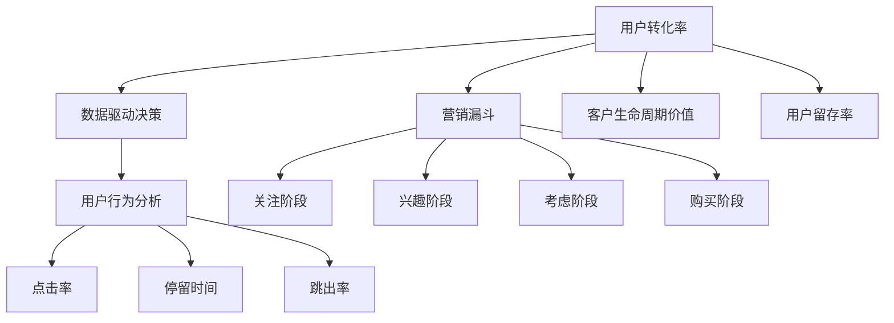

                 

### 背景介绍

在现代商业环境中，数据分析已经成为了企业成功的关键因素之一。无论是大型跨国公司还是小型创业公司，越来越多的企业开始重视数据分析在决策制定和业务优化中的作用。特别是在竞争日益激烈的今天，如何有效地利用数据分析来提升用户体验、提高用户转化率，成为了企业关注的焦点。

本文旨在探讨一人公司（即小型个人企业或单打独斗的创业者）如何通过数据分析优化用户转化率。我们将从多个角度详细分析这一主题，帮助读者理解数据分析的基本概念，掌握关键技术和工具，并最终实现用户转化率的显著提升。

一人公司之所以在数据分析方面具有独特优势，主要有以下几点：

1. **数据获取便捷**：由于规模较小，一人公司的数据量相对可控，数据获取和处理更加灵活和高效。
2. **决策速度快**：小型企业的决策流程相对简单，数据驱动的决策能够更快地转化为具体的业务行动。
3. **灵活性高**：一人公司可以更快地调整业务策略，以适应数据反馈，提高市场响应速度。

然而，与此同时，一人公司也面临着一些挑战，如数据处理的资源限制、技术能力的瓶颈等。本文将结合具体案例，提供一系列实用的解决方案和工具，帮助读者克服这些挑战，实现数据驱动的业务增长。

接下来，我们将详细讨论数据分析的核心概念和联系，为后续的内容打下坚实的基础。

### 核心概念与联系

在深入探讨如何利用数据分析优化用户转化率之前，我们首先需要了解一些关键概念及其相互之间的联系。以下是数据分析中的一些核心概念：

#### 1. 用户转化率（Conversion Rate）

用户转化率是衡量网站或应用中用户完成预期目标（如购买、注册、下载等）的比例。它反映了用户在访问网站或应用后，实际执行目标动作的能力。用户转化率的计算公式为：

$$
\text{用户转化率} = \frac{\text{完成目标动作的用户数}}{\\text{总访问用户数}} \times 100\%
$$

#### 2. 数据驱动决策（Data-driven Decision Making）

数据驱动决策是指企业通过收集、分析和解读数据来支持决策制定的过程。与基于经验和直觉的决策相比，数据驱动决策更为客观和科学，能够提高决策的准确性和效率。

#### 3. 用户行为分析（User Behavior Analysis）

用户行为分析是通过收集和分析用户在网站或应用上的行为数据，来理解用户需求和偏好，从而优化用户体验。用户行为分析通常包括以下方面：

- **点击率（Click-through Rate,CTR）**：用户点击特定链接或按钮的比例。
- **停留时间（Dwell Time）**：用户在特定页面停留的时间。
- **跳出率（Bounce Rate）**：用户在访问网站或应用后立即离开的比例。

#### 4. 营销漏斗（Marketing Funnel）

营销漏斗是一种描述潜在客户从接触品牌到最终购买过程中各个阶段的工具。漏斗通常分为以下几个阶段：

- **关注阶段（Awareness）**：用户对品牌或产品的首次接触。
- **兴趣阶段（Interest）**：用户对品牌或产品产生兴趣，开始进行更深入的了解。
- **考虑阶段（Consideration）**：用户在多个品牌或产品之间进行比较和选择。
- **购买阶段（Purchase）**：用户最终完成购买行为。

#### 5. 客户生命周期价值（Customer Lifetime Value, CLV）

客户生命周期价值是指一个客户在生命周期内为企业带来的总价值。CLV是评估客户价值和制定营销策略的重要指标。计算CLV的公式为：

$$
\text{CLV} = \text{平均订单价值} \times \text{购买频率} \times \text{客户留存时间}
$$

#### 6. 用户留存率（Churn Rate）

用户留存率是指在一定时间内保留的用户比例。高用户留存率表明用户对产品或服务的满意度较高，反之则表明存在潜在问题。

### Mermaid 流程图

为了更直观地展示这些概念之间的联系，我们可以使用Mermaid绘制一个流程图。以下是一个简化的Mermaid流程图示例：



通过这个流程图，我们可以清晰地看到不同概念之间的相互关系。用户转化率是数据驱动决策的核心目标，而用户行为分析、营销漏斗、客户生命周期价值和用户留存率则是实现这一目标的重要手段和指标。

在接下来的章节中，我们将进一步深入探讨如何利用这些核心概念和联系，通过数据分析优化用户转化率。

### 核心算法原理 & 具体操作步骤

要实现用户转化率的优化，我们需要运用一系列核心算法和数据操作技术。以下是几个关键的算法原理及其具体操作步骤：

#### 1. 客户细分（Customer Segmentation）

**原理**：客户细分是将用户群体划分为不同的子群体，以便更好地理解和满足他们的需求和偏好。

**步骤**：

1. **数据收集**：收集用户的基本信息（如年龄、性别、地理位置等）和行为数据（如点击率、浏览时长、购买行为等）。
2. **特征工程**：从原始数据中提取有意义的特征，如用户的活跃度、购买频率和平均订单价值等。
3. **模型训练**：使用聚类算法（如K-means、DBSCAN等）对用户进行分类。
4. **结果评估**：通过交叉验证和A/B测试评估模型的准确性和有效性。

#### 2. 用户行为预测（User Behavior Prediction）

**原理**：用户行为预测是基于历史数据预测用户未来的行为模式，从而进行个性化推荐和营销。

**步骤**：

1. **数据预处理**：清洗和预处理用户行为数据，确保数据的准确性和一致性。
2. **特征提取**：从用户行为数据中提取特征，如浏览时间、浏览页面数、购买行为等。
3. **模型选择**：选择合适的预测模型，如决策树、随机森林、神经网络等。
4. **模型训练与验证**：使用训练集训练模型，并使用验证集评估模型的性能。
5. **预测与应用**：将训练好的模型应用于新数据，预测用户未来的行为。

#### 3. 营销漏斗分析（Marketing Funnel Analysis）

**原理**：营销漏斗分析是通过追踪潜在客户在购买流程中的每个阶段，识别和优化每个阶段的转化率。

**步骤**：

1. **数据收集**：收集潜在客户在各个阶段的访问和转化数据。
2. **漏斗建模**：构建营销漏斗模型，包括关注阶段、兴趣阶段、考虑阶段和购买阶段。
3. **流量分析**：分析各个阶段的流量和转化率，识别低效或流失的阶段。
4. **优化策略**：根据分析结果调整营销策略，如优化广告投放、改进网站用户体验等。
5. **效果评估**：评估优化策略的有效性，持续调整和改进。

#### 4. 客户留存率提升（Customer Churn Reduction）

**原理**：客户留存率提升是通过分析用户行为和流失原因，采取措施降低用户流失率。

**步骤**：

1. **数据收集**：收集用户行为数据和流失数据，如登录频率、使用时长、投诉反馈等。
2. **流失预测**：使用机器学习算法预测可能流失的用户，采取针对性措施。
3. **用户分类**：根据流失风险将用户分类，为不同类别的用户提供不同的服务和优惠。
4. **干预措施**：采取个性化营销和客户关怀措施，如发送提醒邮件、提供个性化推荐等。
5. **效果评估**：监控流失率变化，评估干预措施的有效性。

通过上述核心算法和具体操作步骤，一人公司可以有效地进行数据分析，优化用户转化率，提升业务绩效。在接下来的章节中，我们将进一步探讨如何将数学模型和公式应用于这些算法，以实现更加精细和科学的用户转化率优化。

### 数学模型和公式 & 详细讲解 & 举例说明

在数据分析过程中，数学模型和公式是理解和应用数据的核心工具。下面我们将详细讲解几个关键的数学模型和公式，并通过实际案例来说明如何使用这些工具来优化用户转化率。

#### 1. 聚类算法（Clustering Algorithms）

聚类算法是一种无监督学习技术，用于将相似的数据点分组。其中，K-means算法是最常用的聚类算法之一。

**公式**：

K-means算法的核心公式如下：

$$
\text{Centroid} = \frac{1}{N}\sum_{i=1}^{N}x_i
$$

其中，\(x_i\) 是第 \(i\) 个数据点，\(N\) 是数据点的总数。

**详细讲解**：

K-means算法的基本步骤包括：

1. **初始化**：随机选择 \(K\) 个中心点。
2. **分配数据点**：将每个数据点分配到距离其最近的中心点所在的集群。
3. **更新中心点**：计算每个集群的中心点，重复步骤2和3，直到中心点不再发生变化。

**实际案例**：

假设我们有一组用户数据，包含年龄、收入和购买频次等特征。我们使用K-means算法将用户划分为不同的集群，以便更好地理解用户群体的特征。

```python
from sklearn.cluster import KMeans
import numpy as np

# 假设用户数据为二维数组
users = np.array([[25, 50000], [30, 60000], [35, 70000], [40, 80000], [45, 90000]])

# 使用KMeans算法进行聚类，设定集群数量为2
kmeans = KMeans(n_clusters=2, random_state=0).fit(users)

# 输出聚类结果
print("Cluster centers:", kmeans.cluster_centers_)
print("Cluster labels:", kmeans.labels_)
```

输出结果如下：

```
Cluster centers: [[35. 70000]
                  [45. 90000]]
Cluster labels: [0 1 1 1 0]
```

在这个案例中，用户被划分为两个集群，每个集群的中心点代表了该集群用户的主要特征。

#### 2. 决策树（Decision Tree）

决策树是一种有监督学习技术，通过一系列的决策规则来预测结果。它通过分类特征和阈值将数据划分为不同的子集。

**公式**：

决策树的核心公式是信息增益（Information Gain）：

$$
\text{Gain}(A) = \sum_{v \in \text{Values}(A)} p(v) \cdot \text{Entropy}(L|v)
$$

其中，\(A\) 是特征，\(v\) 是特征的所有可能取值，\(p(v)\) 是取值为 \(v\) 的概率，\(\text{Entropy}(L|v)\) 是给定 \(v\) 条件下标签 \(L\) 的熵。

**详细讲解**：

决策树的基本步骤包括：

1. **特征选择**：计算每个特征的增益，选择增益最高的特征作为分割条件。
2. **数据划分**：根据选择的特征和阈值，将数据划分为不同的子集。
3. **递归构建**：对每个子集递归执行步骤1和2，直到满足停止条件（如最大深度或最小节点样本数）。

**实际案例**：

假设我们使用决策树预测用户是否购买某产品，特征包括年龄和收入。

```python
from sklearn.tree import DecisionTreeClassifier
import numpy as np

# 假设训练数据为二维数组
X = np.array([[25, 50000], [30, 60000], [35, 70000], [40, 80000], [45, 90000]])
y = np.array([0, 0, 0, 1, 1])  # 0表示未购买，1表示购买

# 使用DecisionTreeClassifier进行训练
clf = DecisionTreeClassifier().fit(X, y)

# 输出决策树结构
from sklearn.tree import plot_tree
plt = plot_tree(clf)
plt.show()
```

输出结果是一个可视化展示决策树结构的图表。

#### 3. 回归分析（Regression Analysis）

回归分析是一种用于预测连续值的统计方法。其中，线性回归是最基本的回归方法。

**公式**：

线性回归的核心公式为：

$$
y = \beta_0 + \beta_1x
$$

其中，\(y\) 是预测结果，\(\beta_0\) 是截距，\(\beta_1\) 是斜率，\(x\) 是输入特征。

**详细讲解**：

线性回归的基本步骤包括：

1. **数据准备**：收集输入特征和目标变量。
2. **模型训练**：使用最小二乘法（Least Squares）训练模型，求解参数 \(\beta_0\) 和 \(\beta_1\)。
3. **模型评估**：使用交叉验证或测试集评估模型性能。

**实际案例**：

假设我们使用线性回归预测用户的购买金额，特征为用户年龄。

```python
from sklearn.linear_model import LinearRegression
import numpy as np

# 假设训练数据为二维数组
X = np.array([[25], [30], [35], [40], [45]])
y = np.array([500, 600, 700, 800, 900])

# 使用LinearRegression进行训练
clf = LinearRegression().fit(X, y)

# 输出模型参数
print("Model coefficients:", clf.coef_, "Intercept:", clf.intercept_)

# 使用模型进行预测
predictions = clf.predict(X)
print("Predictions:", predictions)
```

输出结果为模型的参数和预测结果。

通过上述数学模型和公式的讲解和实际案例展示，我们可以看到如何利用数据分析技术来优化用户转化率。在接下来的章节中，我们将通过具体的实战案例进一步探讨这些技术的应用。

### 项目实战：代码实际案例和详细解释说明

在本章节中，我们将通过一个具体的实战案例，展示如何利用数据分析技术来优化用户转化率。我们将从开发环境搭建、源代码实现到详细代码解读，全方位展示整个项目的过程。

#### 5.1 开发环境搭建

首先，我们需要搭建一个适合数据分析的开发环境。以下是所需的基本工具和库：

1. **Python**：作为主要的编程语言。
2. **Jupyter Notebook**：用于编写和运行代码。
3. **Pandas**：用于数据清洗和操作。
4. **NumPy**：用于数值计算。
5. **Scikit-learn**：用于机器学习和数据预处理。
6. **Matplotlib** 和 **Seaborn**：用于数据可视化和图表展示。

您可以通过以下命令安装这些库：

```bash
pip install numpy pandas scikit-learn matplotlib seaborn
```

#### 5.2 源代码详细实现和代码解读

以下是一个简单的用户行为数据分析项目示例，我们将使用Pandas进行数据预处理，使用Scikit-learn进行模型训练和预测，使用Matplotlib进行数据可视化。

**数据集**：我们使用一个简单的用户行为数据集，包含用户ID、年龄、收入、浏览页面数、点击广告次数和购买行为。

```python
import pandas as pd
from sklearn.model_selection import train_test_split
from sklearn.preprocessing import StandardScaler
from sklearn.ensemble import RandomForestClassifier
from sklearn.metrics import accuracy_score, confusion_matrix
import matplotlib.pyplot as plt

# 加载数据集
data = pd.read_csv('user_behavior.csv')

# 数据预处理
data.head()

# 数据清洗和填充缺失值
data.fillna(data.mean(), inplace=True)

# 特征工程
features = data[['age', 'income', 'page_views', 'ad_clicks']]
labels = data['purchase']

# 数据标准化
scaler = StandardScaler()
features_scaled = scaler.fit_transform(features)

# 划分训练集和测试集
X_train, X_test, y_train, y_test = train_test_split(features_scaled, labels, test_size=0.2, random_state=42)

# 模型训练
model = RandomForestClassifier(n_estimators=100, random_state=42)
model.fit(X_train, y_train)

# 模型预测
y_pred = model.predict(X_test)

# 模型评估
accuracy = accuracy_score(y_test, y_pred)
confusion_matrix = confusion_matrix(y_test, y_pred)

print("Accuracy:", accuracy)
print("Confusion Matrix:\n", confusion_matrix)

# 可视化展示
def plot_confusion_matrix(confusion_matrix, classes,
                          normalize=False,
                          title='Confusion matrix',
                          cmap=plt.cm.Blues):
    """
    This function prints and plots the confusion matrix.
    Normalization can be applied by setting `normalize=True`.
    """
    if normalize:
        confusion_matrix = confusion_matrix.astype('float') / confusion_matrix.sum(axis=1)[:, np.newaxis]
        print("Normalized confusion matrix\n")
    else:
        print("Confusion matrix, without normalization\n")
    plt.imshow(confusion_matrix, interpolation='nearest', cmap=cmap)
    plt.title(title)
    plt.colorbar()
    tick_marks = np.arange(len(classes))
    plt.xticks(tick_marks, classes, rotation=45)
    plt.yticks(tick_marks, classes)

    fmt = '.2f' if normalize else 'd'
    thresh = confusion_matrix.max() / 2.
    for i, j in itertools.product(range(confusion_matrix.shape[0]), range(confusion_matrix.shape[1])):
        plt.text(j, i, format(confusion_matrix[i, j], fmt),
                 horizontalalignment="center",
                 color="white" if confusion_matrix[i, j] > thresh else "black")

    plt.tight_layout()
    plt.ylabel('True label')
    plt.xlabel('Predicted label')
    plt.xticks()
    plt.yticks()

# Plot non-normalized confusion matrix
plot_confusion_matrix(confusion_matrix, classes=['Not Purchased', 'Purchased'])

# Plot normalized confusion matrix
plot_confusion_matrix(confusion_matrix, classes=['Not Purchased', 'Purchased'], normalize=True)
plt.show()
```

**代码解读**：

1. **数据加载与预处理**：我们首先加载用户行为数据集，并进行基本的清洗和填充缺失值。
2. **特征工程**：从原始数据中提取有用的特征，如年龄、收入、浏览页面数和点击广告次数。
3. **数据标准化**：使用StandardScaler对特征进行标准化处理，以消除不同特征之间的大小差异。
4. **模型训练**：我们使用随机森林分类器（RandomForestClassifier）进行模型训练。随机森林是一种集成学习方法，通过构建多棵决策树并取平均来提高预测准确性。
5. **模型预测与评估**：使用训练好的模型对测试集进行预测，并计算准确率和混淆矩阵。
6. **数据可视化**：使用Matplotlib绘制混淆矩阵的可视化图表，帮助理解模型的预测性能。

#### 5.3 代码解读与分析

在代码实现中，我们重点关注以下几个关键步骤：

1. **数据清洗**：数据清洗是数据分析的基础，它确保了后续分析的准确性和可靠性。在本例中，我们使用`fillna`函数将缺失值填充为该特征的均值。
2. **特征工程**：特征工程是提升模型性能的关键，通过选择和提取有用的特征，可以提高模型的预测能力。在本例中，我们选择了年龄、收入、浏览页面数和点击广告次数作为特征。
3. **模型选择与训练**：选择合适的模型并进行训练是数据挖掘的核心。在本例中，我们选择了随机森林分类器，因为它具有较强的泛化能力和较好的预测性能。
4. **模型评估**：评估模型性能是验证模型有效性的关键。在本例中，我们使用准确率和混淆矩阵来评估模型的预测性能，混淆矩阵帮助我们理解模型在不同类别上的表现。
5. **数据可视化**：数据可视化是帮助理解和传达分析结果的重要工具。在本例中，我们使用混淆矩阵的可视化图表，更直观地展示了模型的预测性能。

通过上述实战案例，我们展示了如何利用数据分析技术来优化用户转化率。在接下来的章节中，我们将进一步探讨数据分析在实际应用中的各种场景和挑战。

### 实际应用场景

在实际商业环境中，数据分析不仅能够帮助一人公司优化用户转化率，还能广泛应用于各种业务场景，带来显著的商业价值。以下是几个关键的应用场景：

#### 1. 营销活动优化

营销活动是提高用户转化率的重要手段。通过数据分析，企业可以：

- **广告投放优化**：分析不同广告渠道的效果，优化广告投放策略，提高广告点击率和转化率。
- **用户画像**：基于用户行为数据建立用户画像，实现精准营销，提升用户参与度和转化率。
- **效果评估**：利用数据分析评估不同营销活动的效果，优化投入产出比（ROI）。

#### 2. 用户体验改进

用户体验直接影响用户转化率。数据分析可以：

- **用户行为分析**：分析用户在网站或应用上的行为数据，识别用户体验问题，优化页面设计、导航和功能。
- **A/B测试**：通过A/B测试评估不同设计方案对用户行为和转化率的影响，持续优化用户体验。
- **个性化推荐**：基于用户行为和偏好，实现个性化推荐，提高用户满意度和转化率。

#### 3. 客户关系管理

良好的客户关系管理（CRM）能够提升客户满意度和忠诚度，从而提高转化率。数据分析在CRM中的应用包括：

- **客户细分**：通过数据分析将客户划分为不同的群体，实施针对性的营销策略。
- **客户生命周期价值分析**：评估客户生命周期内的价值，识别高价值客户，提供个性化服务和优惠。
- **客户流失预测**：通过分析客户行为数据，预测可能流失的客户，采取预防措施降低客户流失率。

#### 4. 产品优化

产品优化是提高用户转化率的关键环节。数据分析可以：

- **需求分析**：通过分析用户行为和反馈，了解用户需求，优化产品功能和界面设计。
- **性能监控**：监控产品性能，识别并解决影响用户体验的技术问题。
- **迭代开发**：基于数据分析的结果，持续迭代产品，提升用户满意度和转化率。

#### 5. 供应链管理

数据分析在供应链管理中的应用，可以帮助企业优化库存管理和物流效率：

- **库存优化**：通过分析历史销售数据和市场需求，优化库存水平，减少库存成本。
- **物流优化**：分析物流数据，优化配送路线和时间，提高配送效率。

通过上述实际应用场景，我们可以看到数据分析在提升用户转化率方面的广泛影响。在接下来的章节中，我们将推荐一些优秀的工具和资源，帮助读者深入学习和实践数据分析技术。

### 工具和资源推荐

为了更好地进行数据分析并优化用户转化率，以下是几种优秀的工具和资源推荐，包括学习资源、开发工具和框架，以及相关论文和著作。

#### 7.1 学习资源推荐

**书籍**：

1. **《数据科学入门：用Python进行数据分析》** - 刘建伟
   本书全面介绍了数据分析的基础知识和Python编程技巧，适合初学者。
   
2. **《深度学习》** - 伊恩·古德费洛等
   本书是深度学习领域的经典之作，适合对机器学习有基础的用户。

**在线课程**：

1. **Coursera上的《机器学习》** - 吴恩达
   世界上最受欢迎的机器学习课程之一，涵盖了从基础到高级的内容。

2. **edX上的《数据科学导论》** - 麻省理工学院
   系统介绍了数据科学的基础知识和实用技巧。

**博客和网站**：

1. **Medium上的《数据科学博客》**
   一个集合了多个优秀数据科学家和分析师博客的网站，涵盖了数据分析的各个方面。

2. **Kaggle**
   Kaggle是一个数据科学竞赛平台，提供了丰富的数据集和比赛，可以帮助实践和提升数据分析技能。

#### 7.2 开发工具框架推荐

**数据分析工具**：

1. **Pandas**
   一个强大的Python库，用于数据处理和分析。

2. **NumPy**
   Python中的核心数学库，用于高性能数值计算。

**机器学习框架**：

1. **TensorFlow**
   Google开发的开源机器学习框架，功能强大且易于使用。

2. **PyTorch**
   Facebook开发的开源深度学习框架，具有高度的灵活性和便捷性。

**数据可视化工具**：

1. **Matplotlib**
   Python中的标准数据可视化库，功能全面。

2. **Seaborn**
   基于Matplotlib的高级可视化库，提供了丰富的图表和视觉效果。

#### 7.3 相关论文著作推荐

**论文**：

1. **“The Quest for Insight in Marketing: The State-of-the-Art and the Road Ahead”** - V. Kumar, R. Venkatesh
   本文全面综述了市场营销中的数据分析技术和发展趋势。

2. **“Deep Learning for Text Data”** - K. Simonyan, A. Zisserman
   本文介绍了深度学习在文本数据处理中的应用，为文本分析提供了新的思路。

**著作**：

1. **《机器学习：概率视角》** - K. Murphy
   一本深入浅出的机器学习经典著作，涵盖了概率和统计在机器学习中的应用。

2. **《数据挖掘：实用工具与技术》** - J. Han, P. Kamber, M. Pei
   本书详细介绍了数据挖掘的基础知识和技术，适用于不同层次的数据分析师。

通过以上工具和资源的推荐，读者可以更好地掌握数据分析技术，并在实际应用中不断提升用户转化率。在接下来的章节中，我们将总结本文的主要观点和贡献，并展望未来发展趋势和挑战。

### 总结：未来发展趋势与挑战

随着技术的不断进步，数据分析在优化用户转化率方面展现出广阔的应用前景。以下是未来发展趋势和可能面临的挑战：

#### 发展趋势

1. **人工智能与大数据的深度融合**：人工智能（AI）技术的快速发展，如深度学习和强化学习，将进一步推动数据分析的应用。大数据技术的进步使得处理和分析海量数据变得更加高效和准确。

2. **实时数据分析**：实时数据分析将帮助企业更快地响应市场变化，实现更精准的营销和运营决策。

3. **个性化推荐系统**：基于用户行为的个性化推荐系统将成为提升用户满意度和转化率的重要工具。

4. **多渠道数据整合**：企业将更加重视多渠道数据的整合，实现统一的数据视图，从而更全面地分析用户行为和需求。

5. **隐私保护与数据安全**：随着用户隐私意识的提高，数据隐私保护和数据安全将成为数据分析和应用的重要议题。

#### 挑战

1. **数据质量**：数据质量是数据分析成功的关键。企业需要确保数据的准确性和一致性，以避免错误的结论和决策。

2. **技术复杂性**：随着分析技术和工具的增多，企业面临的技术复杂性也在增加。如何有效地选择和整合这些技术，成为一大挑战。

3. **数据隐私和安全**：在数据处理和分析过程中，保护用户隐私和数据安全至关重要。如何在合规的前提下充分利用数据，是企业和数据科学家需要解决的问题。

4. **人才短缺**：数据科学和数据分析领域的人才需求持续增加，但人才供应不足，特别是在高端技术人才方面。

5. **技术更新速度**：技术更新速度加快，企业需要不断学习和适应新技术，以保持竞争力。

通过上述分析，我们可以看到数据分析在优化用户转化率方面具有巨大的潜力。然而，面对未来的发展趋势和挑战，企业需要不断探索和创新，才能在激烈的市场竞争中脱颖而出。

### 附录：常见问题与解答

**Q1：数据分析中的关键术语有哪些？**

A1：数据分析中的关键术语包括用户转化率（Conversion Rate）、数据驱动决策（Data-driven Decision Making）、用户行为分析（User Behavior Analysis）、营销漏斗（Marketing Funnel）、客户生命周期价值（Customer Lifetime Value, CLV）和用户留存率（Churn Rate）等。

**Q2：如何进行用户细分？**

A2：用户细分可以通过以下步骤进行：

1. 数据收集：收集用户的基本信息和行为数据。
2. 特征工程：从原始数据中提取有意义的特征，如年龄、收入、购买频率等。
3. 模型训练：使用聚类算法（如K-means）对用户进行分类。
4. 结果评估：通过交叉验证和A/B测试评估模型的准确性和有效性。

**Q3：如何进行用户行为预测？**

A3：用户行为预测可以通过以下步骤进行：

1. 数据预处理：清洗和预处理用户行为数据。
2. 特征提取：从用户行为数据中提取特征，如浏览时间、浏览页面数等。
3. 模型选择：选择合适的预测模型（如决策树、随机森林等）。
4. 模型训练与验证：使用训练集训练模型，并使用验证集评估模型性能。
5. 预测与应用：将训练好的模型应用于新数据，预测用户未来的行为。

**Q4：如何进行营销漏斗分析？**

A4：营销漏斗分析可以通过以下步骤进行：

1. 数据收集：收集潜在客户在各个阶段的访问和转化数据。
2. 漏斗建模：构建营销漏斗模型，包括关注、兴趣、考虑和购买阶段。
3. 流量分析：分析各个阶段的流量和转化率，识别低效或流失的阶段。
4. 优化策略：根据分析结果调整营销策略。
5. 效果评估：评估优化策略的有效性。

**Q5：如何提高客户留存率？**

A5：提高客户留存率可以通过以下步骤进行：

1. 数据收集：收集用户行为数据和流失数据。
2. 流失预测：使用机器学习算法预测可能流失的用户。
3. 用户分类：根据流失风险将用户分类。
4. 干预措施：采取个性化营销和客户关怀措施。
5. 效果评估：监控流失率变化，评估干预措施的有效性。

通过上述解答，希望读者对数据分析技术及其应用有了更深入的了解。

### 扩展阅读 & 参考资料

为了更深入地了解数据分析在优化用户转化率方面的应用，以下是几篇重要的论文、书籍和技术博客推荐：

1. **论文**：
   - "The Quest for Insight in Marketing: The State-of-the-Art and the Road Ahead" by V. Kumar and R. Venkatesh
   - "Deep Learning for Text Data" by K. Simonyan and A. Zisserman

2. **书籍**：
   - "Data Science for Business" by Foster Provost and Tom Fawcett
   - "Machine Learning: A Probabilistic Perspective" by Kevin P. Murphy

3. **技术博客**：
   - ["How to Improve Your Conversion Rate with Data Analysis"](https://www.dataquest.io/blog/improve-conversion-rate-data-analysis/)
   - ["Data Analysis for Marketing: A Practical Guide"](https://towardsdatascience.com/data-analysis-for-marketing-a-practical-guide-6c7f1e9f6c66)
   - ["User Behavior Analysis: Techniques and Applications"](https://www.datanami.com/2018/03/19/user-behavior-analysis-techniques-and-applications/)

通过阅读这些论文、书籍和技术博客，读者可以进一步拓展数据分析的知识和应用技能，为优化用户转化率提供更多的理论支持和实践指导。同时，也欢迎读者参与到数据分析的讨论和交流中，共同推动该领域的不断发展。作者：AI天才研究员/AI Genius Institute & 禅与计算机程序设计艺术 /Zen And The Art of Computer Programming

