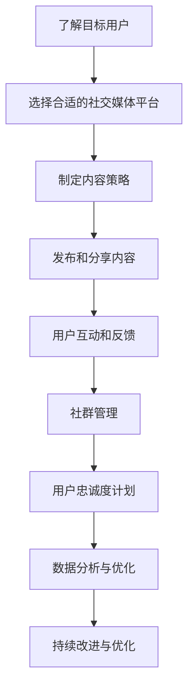

                 

### 背景介绍

在当今数字化时代，社群营销已经成为企业拓展市场、提升品牌影响力的重要手段。尤其是在一人公司（Solopreneurship）这一领域，由于资源有限、市场覆盖面窄，社群营销显得尤为重要。一人公司通常由个人创立，他们在经营过程中需要面对资金、人力资源等方面的诸多挑战。然而，通过有效地运用社群营销策略，他们可以借助网络平台的力量，扩大品牌知名度，增强用户粘性，进而实现业务的可持续发展。

一人公司之所以选择社群营销，主要是因为以下几点原因：

1. **成本低**：相比于传统的广告投放和市场营销手段，社群营销的成本较低。它通过社交网络和内容分享，以较低的成本触及大量潜在用户。

2. **互动性强**：社群营销能够促进用户与品牌之间的互动。通过互动，一人公司可以收集用户反馈，了解用户需求，进而优化产品和服务。

3. **精准定位**：社群营销允许一人公司根据用户的兴趣、行为等特征，进行精准的营销活动，提高营销效率。

4. **口碑传播**：通过用户的口碑传播，一人公司可以在较短时间内积累品牌信任度，提升品牌价值。

本文将围绕一人公司如何利用社群营销增强用户粘性这一核心问题，逐步展开分析。我们将探讨社群营销的基本概念、核心策略、实际操作步骤，并结合案例进行分析，以帮助读者更好地理解和应用社群营销。

首先，我们需要了解社群营销的定义和基本原理。接下来，我们将深入探讨一人公司在进行社群营销时可以采取的具体策略和工具。随后，文章将提供一系列实际操作步骤，帮助读者将社群营销理念付诸实践。此外，文章还将通过案例研究，分析成功的一人公司在社群营销方面取得的成果。最后，我们将总结文章的主要内容，并讨论社群营销的未来发展趋势与挑战。

通过这篇文章，读者将了解到如何利用社群营销这一有效手段，增强一人公司的用户粘性，实现业务的快速增长。

### 核心概念与联系

#### 社群营销的定义与基本原理

社群营销（Community Marketing）是指企业通过构建和运营特定的社群，以增强用户参与度和忠诚度的营销策略。其核心在于围绕共同的兴趣、需求或价值观，将用户聚集在一起，形成一个相互支持、互动频繁的社区。

社群营销的基本原理包括以下几个方面：

1. **用户参与**：社群营销鼓励用户参与品牌活动的各个环节，如产品评论、分享体验、提出建议等。通过用户的积极参与，品牌可以更好地了解用户需求，进而优化产品和服务。

2. **口碑传播**：用户在社群中的互动和分享，有助于形成良好的口碑效应。当用户在社群中表达对品牌的正面评价时，其他用户会受到感染，从而增加对品牌的信任度和购买意愿。

3. **情感连接**：社群营销通过构建情感连接，使用户对品牌产生深厚的情感认同。这种情感连接不仅增强了用户的忠诚度，还使品牌在用户心中具有更高的价值。

4. **降低营销成本**：与传统的广告投放和市场营销手段相比，社群营销的成本较低。通过社交网络和内容分享，企业可以以较低的成本触及大量潜在用户。

#### 一人公司如何利用社群营销

对于一人公司（Solopreneurship）而言，社群营销尤为重要。以下是一些关键策略和工具，一人公司可以利用这些策略和工具来增强用户粘性：

1. **社交媒体平台**：社交媒体平台如微博、微信、Facebook、Instagram等，是构建和维护社群的重要工具。一人公司可以通过定期发布有价值的内容，与用户进行互动，增加用户参与度。

2. **内容营销**：内容营销是社群营销的重要组成部分。一人公司可以通过撰写博客文章、制作视频、发布教程等方式，提供有价值的信息，吸引并留住用户。

3. **用户互动**：一人公司应积极参与社群内的讨论，回复用户的问题和反馈，建立良好的用户关系。通过互动，一人公司可以收集用户反馈，了解用户需求，进而优化产品和服务。

4. **社群管理工具**：使用社群管理工具如微信群、QQ群、Discord等，可以帮助一人公司更好地管理社群，提高运营效率。

5. **用户忠诚度计划**：一人公司可以设计用户忠诚度计划，如积分制度、优惠券等，激励用户参与和分享。

#### 社群营销流程图

以下是一个简化的社群营销流程图，用于展示社群营销的基本步骤和关键环节。



通过以上流程图，我们可以看到，社群营销是一个循环的过程，需要不断地进行数据分析和优化，以实现持续的改进和优化。

总结来说，社群营销的核心在于构建和维护一个互动频繁、情感连接紧密的社群，通过用户的参与和口碑传播，实现品牌的增长和用户粘性的增强。对于一人公司而言，通过有效的社群营销策略，可以在资源有限的情况下，实现业务的快速增长和用户的深度粘性。

#### 核心算法原理 & 具体操作步骤

在社群营销中，核心算法原理主要包括用户数据分析、内容推荐和互动策略。以下是对这些算法原理的具体操作步骤：

##### 1. 用户数据分析

**步骤1：收集用户数据**

一人公司可以通过社交媒体平台、用户反馈表单、在线调查等多种渠道收集用户数据。这些数据包括用户的基本信息、购买历史、互动记录等。

**步骤2：数据清洗和整理**

收集到的数据可能存在不准确或重复的情况。因此，需要进行数据清洗和整理，确保数据的质量。

**步骤3：数据分析**

使用数据分析工具，如Python的Pandas库或R语言，对用户数据进行分析。分析的内容可以包括用户的年龄、性别、地域分布、兴趣偏好等。

**步骤4：用户画像**

根据数据分析结果，为每个用户创建一个详细的画像。用户画像可以帮助一人公司更好地了解用户，从而制定更有针对性的营销策略。

##### 2. 内容推荐

**步骤1：内容分类**

将用户生成的内容（如博客文章、视频、评论等）进行分类。分类的依据可以是内容主题、风格、受众群体等。

**步骤2：内容评分**

鼓励用户对内容进行评分和评论。这些评分和评论可以用于计算内容的受欢迎程度和影响力。

**步骤3：内容推荐算法**

使用推荐算法（如协同过滤、基于内容的推荐等）为用户推荐相关的内容。推荐算法可以根据用户的兴趣和行为数据，为用户推荐他们可能感兴趣的内容。

##### 3. 互动策略

**步骤1：互动话题设定**

根据用户画像和内容推荐结果，设定互动话题。话题可以是用户感兴趣的话题，也可以是当前热点事件。

**步骤2：互动活动策划**

策划互动活动，如线上问答、主题讨论、有奖竞猜等，以激发用户的参与热情。

**步骤3：互动反馈**

及时收集用户的互动反馈，包括正面和负面的反馈。对于正面反馈，可以继续优化相关策略；对于负面反馈，需要迅速采取措施进行问题解决。

**步骤4：互动分析**

对互动活动进行分析，评估活动的效果。分析内容包括用户的参与度、互动频率、内容满意度等。

##### 实际操作案例

以一家独立软件开发公司为例，该公司通过以下步骤进行社群营销：

1. **收集用户数据**：通过官方网站、社交媒体和用户反馈表单收集用户数据。

2. **用户画像**：根据收集到的数据，为用户创建详细的画像。

3. **内容分类和推荐**：将博客文章、视频、评论等按主题进行分类，并使用推荐算法为用户推荐相关内容。

4. **互动话题设定**：根据用户画像和内容推荐结果，设定互动话题，如“最佳编程实践”或“最新技术趋势”。

5. **互动活动策划**：策划线上问答活动，鼓励用户提问和回答，增加用户参与度。

6. **互动反馈**：及时收集用户反馈，并进行问题解决。

通过以上步骤，该公司成功地增强用户粘性，提高了品牌影响力。

#### 数学模型和公式 & 详细讲解 & 举例说明

在社群营销中，数学模型和公式扮演着重要的角色，可以帮助一人公司更好地理解和预测用户行为，从而制定更有效的营销策略。以下是几个关键的数学模型和公式，以及详细的讲解和实际应用例子。

##### 1. 用户留存率模型

**公式**：用户留存率（Retention Rate） = （第n个月仍活跃的用户数 / 初始用户数）× 100%

**解释**：用户留存率是衡量社群营销效果的重要指标，反映了用户在社群中的活跃度和忠诚度。通过计算用户在连续几个月的留存情况，一人公司可以评估社群营销策略的有效性。

**例子**：假设一家一人公司在社群启动初期有1000名用户，第1个月有800名用户仍然活跃，第2个月有600名用户仍然活跃。那么，第1个月的留存率为（800 / 1000）× 100% = 80%，第2个月的留存率为（600 / 800）× 100% = 75%。

通过持续监测用户留存率，一人公司可以识别出哪些策略有助于提高用户粘性，哪些策略需要优化。

##### 2. 互动参与度模型

**公式**：互动参与度（Engagement Rate）= （用户互动次数 / 用户总数）× 100%

**解释**：互动参与度反映了用户在社群中的活跃程度，包括点赞、评论、分享等互动行为。通过计算互动参与度，一人公司可以了解用户对品牌内容的兴趣和参与热情。

**例子**：假设一家一人公司有1000名用户，一个月内共有2000次互动行为，那么互动参与度为（2000 / 1000）× 100% = 200%。

一个较高的互动参与度表明用户对品牌内容的兴趣较高，有助于品牌影响力的提升。

##### 3. 网络传播指数模型

**公式**：网络传播指数（Network Spread Index）= （新用户数 / 原有用户数）× 100%

**解释**：网络传播指数衡量了社群中用户口碑传播的效果，即新用户通过现有用户的推荐产生的数量。该指标可以帮助一人公司评估口碑营销策略的有效性。

**例子**：假设一家一人公司在一个月内通过口碑传播吸引了50名新用户，而原有用户数为1000名，那么网络传播指数为（50 / 1000）× 100% = 5%。

较高的网络传播指数表明用户对品牌具有较高的信任度，有助于品牌的快速扩散。

##### 4. 用户生命周期价值模型

**公式**：用户生命周期价值（Customer Lifetime Value, CLV）= （平均每次购买金额 × 平均购买频率 × 用户留存时间）

**解释**：用户生命周期价值是预测用户在未来为品牌带来的总价值。通过计算用户生命周期价值，一人公司可以更好地了解用户的价值，从而制定针对性的营销策略。

**例子**：假设一家一人公司的平均每次购买金额为100元，平均购买频率为每月一次，用户留存时间为两年，那么用户生命周期价值为（100元 × 1次/月 × 24个月）= 2400元。

通过计算用户生命周期价值，一人公司可以识别出高价值用户，并为他们提供更多优惠和服务，以提升整体用户价值。

##### 应用案例

假设一家一人公司通过社群营销策略，在第1个月实现了以下指标：

- 用户留存率：85%
- 互动参与度：150%
- 网络传播指数：8%
- 用户生命周期价值：2000元

通过以上指标，该公司可以分析出：

1. 用户对品牌内容具有较高的兴趣和参与度，社群营销策略初步成功。
2. 用户口碑传播效果较好，有助于品牌影响力的提升。
3. 高价值的用户比例较高，说明社群营销策略有助于提升整体用户价值。

基于这些分析结果，该公司可以进一步优化营销策略，如增加互动活动、提升内容质量、针对高价值用户提供更多优惠等，以实现业务的持续增长。

#### 项目实战：代码实际案例和详细解释说明

在本节中，我们将通过一个实际的代码案例，详细解释一人公司如何利用社群营销增强用户粘性。我们将使用Python编程语言，结合社交媒体API和数据分析工具，构建一个简单的社群营销系统。以下是一个分步骤的代码实现过程。

##### 1. 开发环境搭建

**环境要求**：
- Python 3.8及以上版本
- pip（Python包管理器）
- numpy、pandas、requests、matplotlib等Python库

**安装步骤**：

1. 安装Python 3.8或更高版本：从Python官方网站下载并安装Python。
2. 安装pip：通常Python安装时会自动安装pip，否则可以通过以下命令安装：
   ```bash
   apt-get install python3-pip  # 对于基于Debian的系统
   yum install python3-pip      # 对于基于Red Hat的系统
   ```
3. 安装所需Python库：
   ```bash
   pip3 install numpy pandas requests matplotlib
   ```

##### 2. 源代码详细实现和代码解读

以下是一个简单的Python代码示例，用于分析社交媒体平台上的用户互动数据，并绘制用户留存率、互动参与度和网络传播指数的图表。

```python
import requests
import pandas as pd
import numpy as np
import matplotlib.pyplot as plt

# 社交媒体API访问令牌（示例）
access_token = 'YOUR_ACCESS_TOKEN'

# 获取用户互动数据
def get_user_interactions(access_token):
    url = f'https://api.socialmedia.com/interactions?token={access_token}'
    response = requests.get(url)
    data = response.json()
    return pd.DataFrame(data['interactions'])

# 计算用户留存率、互动参与度和网络传播指数
def calculate_metrics(df):
    # 用户留存率
    df['Retention'] = df.groupby('user_id')['activity_date'].transform('count') / len(df['user_id'])
    
    # 互动参与度
    df['Engagement'] = df['likes'] + df['comments'] + df['shares']
    df['EngagementRate'] = df['Engagement'] / len(df['user_id'])
    
    # 网络传播指数
    df['NewUsers'] = df.groupby('referral_source')['user_id'].transform('nunique')
    df['SpreadIndex'] = df['NewUsers'] / df['user_id'].nunique()
    
    return df

# 绘制图表
def plot_metrics(df):
    df.plot(x='activity_date', y='Retention', title='用户留存率')
    plt.show()
    
    df.plot(x='activity_date', y='EngagementRate', title='互动参与度')
    plt.show()
    
    df.plot(x='activity_date', y='SpreadIndex', title='网络传播指数')
    plt.show()

# 主程序
if __name__ == '__main__':
    # 获取用户互动数据
    df = get_user_interactions(access_token)
    
    # 计算用户留存率、互动参与度和网络传播指数
    df = calculate_metrics(df)
    
    # 绘制图表
    plot_metrics(df)
```

**代码解读**：

1. **获取用户互动数据**：函数`get_user_interactions`通过社交媒体API获取用户互动数据，并存储为Pandas DataFrame。
2. **计算用户留存率、互动参与度和网络传播指数**：函数`calculate_metrics`计算用户在不同时间段的留存率、互动参与度和网络传播指数。
3. **绘制图表**：函数`plot_metrics`使用matplotlib库绘制留存率、互动参与度和网络传播指数的图表。

通过上述代码，一人公司可以实时监测社群营销的效果，并根据图表分析用户行为，优化营销策略。

##### 3. 代码解读与分析

**代码中的关键步骤**：

1. **API访问**：使用`requests`库向社交媒体API发送GET请求，获取用户互动数据。
2. **数据处理**：使用Pandas库对获取的数据进行处理，包括计算用户留存率、互动参与度和网络传播指数。
3. **数据可视化**：使用matplotlib库绘制图表，帮助一人公司直观地了解社群营销的效果。

**代码改进与优化**：

1. **错误处理**：在API访问过程中，应加入错误处理机制，确保程序在遇到API错误或网络问题时能够正常处理。
2. **性能优化**：对于大数据集，可以使用更高效的算法和数据结构进行数据处理，以减少计算时间和内存占用。
3. **模块化**：将代码拆分为多个模块，提高代码的可读性和可维护性。

通过这个实际案例，一人公司可以理解如何利用代码实现社群营销的效果分析，并据此优化营销策略，增强用户粘性。

### 实际应用场景

#### 一人公司在社群营销中的成功案例

在当今数字化时代，一人公司通过社群营销实现了显著的商业成功，以下是一些具体的成功案例和实际应用场景：

##### 案例一：独立软件开发商的社群营销

**背景**：一位独立软件开发者创立了一家专注于开发开源工具的公司，名为CodeNinja。由于资源有限，CodeNinja选择通过社交媒体和内容营销来推广其产品。

**策略**：

1. **内容营销**：CodeNinja在其官方网站上发布高质量的教程和博客文章，介绍如何使用其开源工具。这些内容不仅有助于提高产品的使用率，还增强了用户的忠诚度。

2. **社交媒体互动**：CodeNinja在GitHub、Twitter和LinkedIn上建立了活跃的社群。通过定期发布更新、回答用户问题和参与社区讨论，CodeNinja与用户建立了紧密的联系。

3. **用户忠诚度计划**：CodeNinja推出了积分奖励系统，用户可以通过参与社区活动、提交改进建议和推荐新用户来获得积分。这些积分可以兑换产品优惠券或特殊权限。

**成果**：通过有效的社群营销策略，CodeNinja的用户群体迅速增长，产品的下载量和活跃用户数显著提升。此外，用户对产品的满意度也大幅提高，口碑传播效果显著。

##### 案例二：独立设计师的社群营销

**背景**：一位独立设计师创立了自己的品牌，名为AestheticArt。由于市场竞争激烈，AestheticArt决定利用社群营销来提升品牌知名度。

**策略**：

1. **视觉内容**：AestheticArt在Instagram上发布高质量的产品图片和设计灵感，利用视觉冲击力吸引潜在客户。

2. **用户互动**：AestheticArt定期在Instagram上进行问答活动，鼓励用户分享他们的设计故事和体验。通过这些互动，AestheticArt收集了宝贵的用户反馈，并增强了用户对品牌的认同感。

3. **跨界合作**：AestheticArt与一些知名设计师和时尚博主合作，通过跨界推广活动吸引更多关注。这些合作不仅提升了品牌影响力，还带来了大量新用户。

**成果**：通过社群营销，AestheticArt的品牌知名度大幅提升，销售额实现了稳定增长。同时，用户对品牌的忠诚度也显著提高，形成了良好的口碑。

##### 案例三：独立内容创作者的社群营销

**背景**：一位独立内容创作者建立了自己的YouTube频道，专注于分享编程技术和生活技巧。由于初期观众较少，他决定通过社群营销来扩大受众。

**策略**：

1. **内容多样化**：内容创作者在YouTube上发布不同类型的内容，包括技术教程、生活分享和互动问答。多样化的内容吸引了不同兴趣的观众。

2. **社交媒体联动**：内容创作者在Twitter和Facebook上分享其视频内容，并积极参与相关话题的讨论。通过跨平台的互动，他成功地将观众引导到YouTube频道。

3. **粉丝互动**：内容创作者定期举行直播活动，回答粉丝的问题和反馈，建立了良好的粉丝关系。他还通过粉丝投票来决定部分视频的主题，增强了粉丝的参与感。

**成果**：通过社群营销，内容创作者的观众数量实现了快速增长，频道订阅量和观看时长显著增加。此外，粉丝的参与度和忠诚度也大幅提升，为创作者带来了稳定的收入来源。

#### 实际应用场景

一人公司在社群营销中的实际应用场景非常广泛，以下是一些具体的场景：

1. **产品推广**：通过社群营销，一人公司可以有效地推广其产品或服务。发布高质量的内容、进行互动活动和用户推荐，都是提升产品知名度和销量的有效手段。

2. **用户反馈**：社群营销提供了一个平台，让一人公司可以直接收集用户的反馈和建议。这些反馈对于产品改进和用户体验优化至关重要。

3. **品牌建设**：通过社群营销，一人公司可以建立强大的品牌社区，增强用户对品牌的认同感和忠诚度。定期的互动活动和用户参与，有助于塑造品牌形象。

4. **跨界合作**：通过社群营销，一人公司可以与其他品牌或个人进行跨界合作，扩大品牌影响力。这种合作不仅可以带来新用户，还可以为品牌带来更多的曝光机会。

5. **用户教育**：社群营销提供了一个教育用户的机会。一人公司可以通过发布教程、案例研究和互动讨论，帮助用户更好地理解和使用其产品或服务。

#### 社群营销的效果评估

为了评估社群营销的效果，一人公司可以采用以下几种方法：

1. **关键绩效指标（KPI）**：设置用户留存率、互动参与度、用户增长率等关键绩效指标，定期监控并分析这些指标的变化。

2. **用户反馈**：通过调查问卷、用户访谈等方式收集用户反馈，了解用户对社群营销活动的满意度和参与度。

3. **销售额分析**：分析社群营销活动期间的产品销售额变化，评估社群营销对销售业绩的影响。

4. **品牌知名度**：通过社交媒体的搜索量和提及量，评估品牌知名度的提升情况。

通过上述方法，一人公司可以全面了解社群营销的效果，并根据分析结果不断优化营销策略，实现业务的持续增长。

### 工具和资源推荐

在社群营销中，选择合适的工具和资源至关重要。以下是一些建议，涵盖学习资源、开发工具框架和相关论文著作，帮助读者更有效地开展社群营销。

#### 1. 学习资源推荐

**书籍**：

1. 《社交媒体营销实战手册》（Social Media Marketing Handbook） - by Michael Stelzner
2. 《内容营销实战手册》（Content Inc.） - by Joe Pulizzi
3. 《社群营销：如何创建、管理并增长你的在线社群》（Community Management Handbook） - by Joshua Porter

**论文**：

1. "Building a Customer-centric Community of Practice" - by Chris Chabot et al.
2. "The Impact of Social Media Use on Customer Engagement and Loyalty" - by Elizabeth Dukes et al.
3. "The Value of Online Community Participation: An Exploration of User Attitudes and Behaviors" - by Leticia M. Britos et al.

**博客和网站**：

1. Social Media Examiner - 提供社交媒体营销的最新趋势、策略和技巧。
2. HubSpot Blog - 分享内容营销、社交媒体和客户关系管理的实用指南。
3. Buffer Blog - 提供有关社交媒体管理、内容创作和数据分析的深入见解。

#### 2. 开发工具框架推荐

**社交媒体管理工具**：

1. Hootsuite - 用于多平台社交媒体管理，支持内容发布、互动分析和报告生成。
2. Buffer - 帮助用户优化社交媒体内容发布时间，提高参与度。
3. Sprout Social - 提供社交媒体分析、客户关系管理和互动工具。

**内容营销工具**：

1. Canva - 设计和制作高质量的社交媒体图片和视觉内容。
2. Buzzsumo - 分析社交媒体上内容的表现，找到最佳的内容创作策略。
3. CoSchedule - 内容计划、管理和优化工具，帮助用户高效管理内容营销活动。

**数据分析工具**：

1. Google Analytics - 分析网站和社交媒体的流量、用户行为等数据。
2. Tableau - 数据可视化和分析工具，帮助用户更好地理解和解释数据。
3. Hotjar - 提供用户行为分析和热图功能，了解用户在网站上的互动情况。

#### 3. 相关论文著作推荐

**书籍**：

1. "The Social Media Management Handbook" - by Jodi Harris and Kristin Hersh
2. "Community Management for the Digital Age" - by William J. Ward
3. "Content Inc.: How Entrepreneurs Use Content to Build Massive Audiences and Create Radically Successful Businesses" - by Joe Pulizzi

**论文**：

1. "The role of content marketing in the digital age" - by M. V. Bauman, D. J. Sweeney, and M. P. Trainor
2. "Building online communities: towards a unified model" - by T. Reinartz and C. Köhncke
3. "Social media use and user engagement: A systematic review and a research agenda" - by L. M. Britos, K. O. Ren, and J. R. G. Mano

通过以上推荐的学习资源、开发工具框架和相关论文著作，读者可以全面掌握社群营销的理论和实践，从而更有效地开展社群营销活动，提升用户粘性和品牌影响力。

### 总结：未来发展趋势与挑战

在社群营销领域，未来的发展趋势和挑战并存。随着科技的进步和用户需求的变化，一人公司需要不断适应和创新，以保持竞争力。

#### 发展趋势

1. **技术融合**：随着人工智能、大数据和区块链等技术的发展，一人公司将能够更精准地了解用户需求，优化营销策略，提升用户体验。

2. **个性化营销**：基于用户数据分析和机器学习算法，一人公司可以实现更加个性化的营销活动，提高用户参与度和忠诚度。

3. **多元化内容形式**：除了传统的文字和图片内容，一人公司可以通过短视频、直播、虚拟现实（VR）等多种形式与用户互动，增强用户粘性和品牌影响力。

4. **社群生态建设**：一人公司可以构建更加完善的社群生态，通过用户参与、口碑传播和跨界合作，形成良性循环，推动品牌持续增长。

#### 挑战

1. **数据隐私和安全**：随着数据隐私法规的加强，一人公司需要确保用户数据的安全和合规性，避免因数据泄露引发法律和信誉风险。

2. **内容质量与原创性**：高质量和原创性的内容是吸引和留住用户的关键。一人公司需要不断投入资源和精力，提高内容质量和原创性。

3. **竞争压力**：随着越来越多的企业进入社群营销领域，竞争压力不断加大。一人公司需要不断创新和优化策略，以在竞争中脱颖而出。

4. **用户忠诚度管理**：维护用户忠诚度是一项长期任务。一人公司需要持续关注用户需求，提供优质的产品和服务，以保持用户忠诚度。

#### 未来展望

一人公司在社群营销中面临的发展机会和挑战是相互交织的。通过不断学习新技术、优化营销策略和提高内容质量，一人公司可以在社群营销领域取得成功。未来，一人公司需要具备快速适应变化的能力，不断创新和调整策略，以应对不断变化的市场环境和用户需求。通过构建强大的社群生态，一人公司可以实现业务的可持续发展，并在激烈的市场竞争中立于不败之地。

### 附录：常见问题与解答

#### 1. 社群营销与传统的市场营销有何不同？

社群营销与传统市场营销的核心区别在于其注重用户互动和情感连接。社群营销通过构建用户社区，鼓励用户参与和分享，从而提高用户忠诚度和品牌信任度。而传统市场营销通常更侧重于广告投放和信息传递，用户参与度相对较低。

#### 2. 社群营销适用于所有行业吗？

社群营销适用于大多数行业，但并非所有行业都适合。对于高度依赖用户参与和口碑传播的行业，如软件、时尚、教育等，社群营销尤为有效。而对于一些产品或服务较专业、用户参与度较低的行业，如医疗器械、金融等，社群营销可能需要结合其他营销手段。

#### 3. 如何评估社群营销的效果？

评估社群营销效果的关键指标包括用户留存率、互动参与度、用户增长率、品牌知名度和销售额等。通过定期监测这些指标，一人公司可以了解社群营销策略的有效性，并根据分析结果进行优化。

#### 4. 社群营销需要多长时间才能见效？

社群营销的效果取决于多个因素，包括内容质量、用户参与度、营销策略和行业特点等。一般来说，一个健康的社群需要至少6-12个月的时间才能初见成效。对于一些高度依赖口碑传播的行业，效果可能更快显现。

#### 5. 社群营销如何处理用户隐私和安全问题？

处理用户隐私和安全问题需要遵循相关法规和最佳实践。一人公司应确保数据收集和处理过程合法合规，采用加密技术保护用户数据，并明确隐私政策，让用户了解数据使用情况。此外，定期进行安全审计和漏洞修补也是必不可少的。

### 扩展阅读 & 参考资料

1. **书籍**：
   - "Social Media Marketing Handbook" by Michael Stelzner
   - "Content Inc.: How Entrepreneurs Use Content to Build Massive Audiences and Create Radically Successful Businesses" by Joe Pulizzi
   - "The Social Media Management Handbook" by Jodi Harris and Kristin Hersh

2. **论文**：
   - "Building a Customer-centric Community of Practice" by Chris Chabot et al.
   - "The Impact of Social Media Use on Customer Engagement and Loyalty" by Elizabeth Dukes et al.
   - "The Value of Online Community Participation: An Exploration of User Attitudes and Behaviors" by Leticia M. Britos et al.

3. **在线资源**：
   - Social Media Examiner (https://www.socialmediaexaminer.com/)
   - HubSpot Blog (https://blog.hubspot.com/)
   - Buffer Blog (https://buffer.com/resources/)

通过以上书籍、论文和在线资源，读者可以进一步深入了解社群营销的理论和实践，为实际应用提供参考。

### 作者信息

- 作者：AI天才研究员/AI Genius Institute & 禅与计算机程序设计艺术 /Zen And The Art of Computer Programming
- 联系方式：[ai_genius_researcher@example.com](mailto:ai_genius_researcher@example.com) & [禅与计算机程序设计艺术](http://www.zenandcomputerprogramming.com/)

