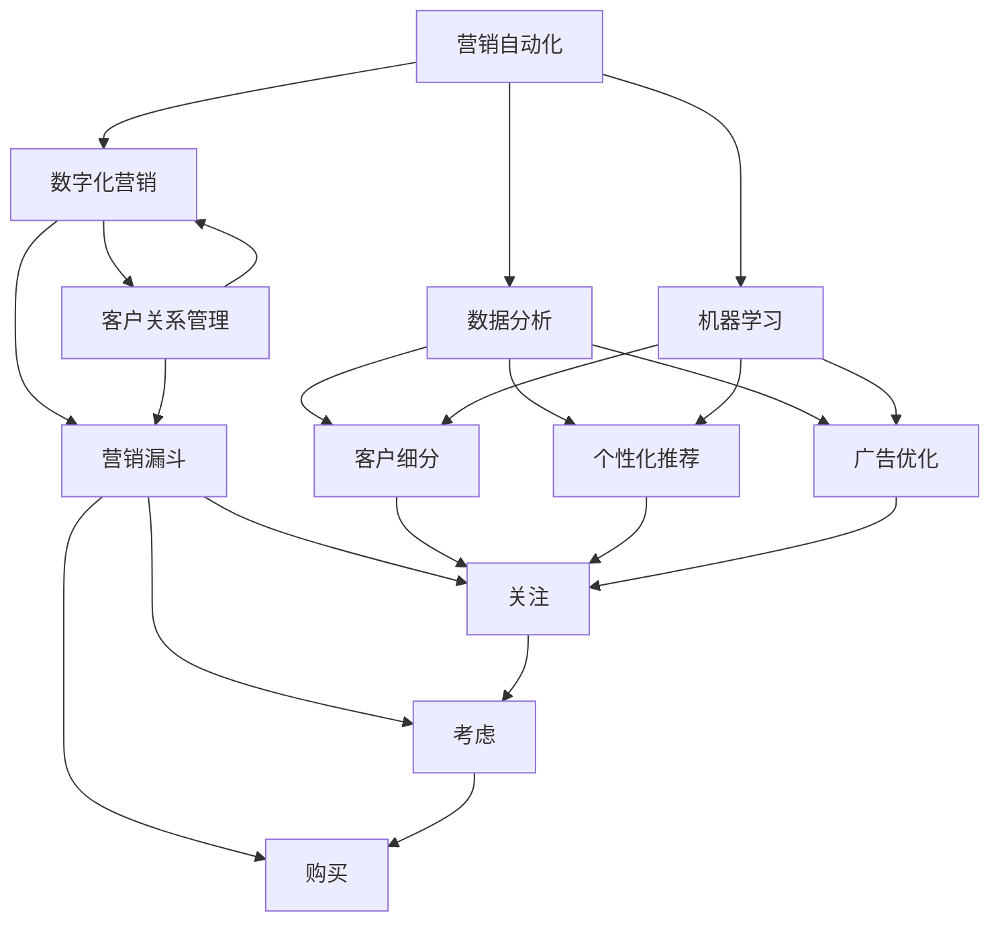

                 

### 背景介绍

在现代商业环境中，数字化转型已经成为企业竞争的关键因素。尤其是对于初创企业和“一人公司”来说，如何高效地进行数字化营销，成为了生存与发展的核心问题。数字化营销自动化（Digital Marketing Automation）作为数字化转型的重要组成部分，通过一系列的技术手段，实现了营销流程的自动化，极大地提高了营销效率，减少了人工成本。

“一人公司”，顾名思义，是指只有一位负责人的小型企业。这类公司由于资源有限，往往难以承担大量的营销费用和人力成本。因此，如何实现数字化营销的自动化，并在有限的资源下实现营销效果的最大化，成为了“一人公司”亟需解决的问题。

本文旨在探讨一人公司如何通过数字化营销自动化实现营销效果优化。首先，我们将介绍数字化营销自动化的核心概念和架构，然后深入分析其具体实现步骤和数学模型，并结合实际项目案例进行详细讲解。最后，我们将讨论数字化营销自动化的实际应用场景，并提供相关的工具和资源推荐，以帮助一人公司实现高效数字化营销。

通过本文的阅读，读者将能够理解数字化营销自动化的原理和操作步骤，掌握如何通过数学模型优化营销效果，以及如何在实际项目中应用这些技术和方法。无论是初创企业还是“一人公司”，都能够在本文中获得宝贵的指导，从而在数字化营销的道路上取得成功。

### 核心概念与联系

为了深入理解数字化营销自动化的实现原理，我们需要明确几个核心概念，并探讨它们之间的联系。

#### 1. 营销自动化（Marketing Automation）

营销自动化是指利用技术手段，自动化执行营销流程中的各种任务。这些任务可能包括电子邮件营销、社交媒体推广、客户关系管理（CRM）、内容营销、广告投放等。通过营销自动化，企业可以节省大量时间和人力资源，提高营销效率。

#### 2. 数字化营销（Digital Marketing）

数字化营销是通过数字渠道（如互联网、社交媒体、电子邮件等）进行的营销活动。与传统的线下营销相比，数字化营销具有成本更低、覆盖面更广、反馈更快等特点。数字化营销的目标是吸引潜在客户、提高品牌知名度并最终实现销售转化。

#### 3. 数据分析（Data Analysis）

数据分析是数字化营销自动化的重要组成部分。通过对用户行为数据、市场趋势数据、销售数据等进行分析，企业可以更准确地了解客户需求，优化营销策略，提高营销效果。

#### 4. 机器学习（Machine Learning）

机器学习是人工智能的一个分支，通过算法从数据中学习，自动识别模式和规律。在数字化营销自动化中，机器学习可以用于客户细分、个性化推荐、广告优化等任务，从而提高营销效果。

#### 5. 客户关系管理（CRM）

客户关系管理是一种通过技术手段管理客户信息、提升客户满意度的策略。CRM系统可以帮助企业自动化客户沟通、跟踪客户需求、分析客户行为，从而实现精准营销。

#### 6. 营销漏斗（Marketing Funnel）

营销漏斗是一种用于描述潜在客户从接触到转化的过程模型。营销漏斗通常包括关注、考虑、购买等阶段，通过分析每个阶段的转化率，企业可以优化营销策略，提高整体转化效果。

#### 关系图与流程图

为了更直观地理解这些概念之间的联系，我们可以绘制以下Mermaid流程图：



在这个流程图中，营销自动化（A）是核心，它通过数字化营销（B）、数据分析（C）、机器学习（D）等技术手段，实现了客户关系管理（E）和营销漏斗（F）的优化。每个子概念通过相互联系和作用，共同促进了数字化营销自动化的实现。

通过理解这些核心概念及其相互关系，一人公司可以更好地规划和实施数字化营销自动化策略，从而在竞争激烈的市场中脱颖而出。

### 核心算法原理 & 具体操作步骤

在了解了数字化营销自动化的核心概念和架构之后，接下来我们将探讨其具体实现步骤和核心算法原理。数字化营销自动化的实现主要依赖于以下几个关键步骤和算法：

#### 1. 数据采集与清洗

数据采集与清洗是数字化营销自动化的第一步。在这个阶段，企业需要收集与客户相关的各种数据，如用户行为数据、市场趋势数据、销售数据等。这些数据可能来源于网站、社交媒体、电子邮件、CRM系统等。为了确保数据的质量和准确性，企业需要对数据进行清洗，去除重复、错误或不完整的数据。

具体操作步骤如下：

- **数据采集**：利用API接口、Web爬虫等技术手段收集数据。
- **数据存储**：将收集到的数据存储在数据库中，如MySQL、MongoDB等。
- **数据清洗**：使用ETL（提取、转换、加载）工具对数据进行清洗，如使用Python的Pandas库或Hadoop生态系统。

#### 2. 客户细分

客户细分是数字化营销自动化的关键步骤之一。通过客户细分，企业可以将客户划分为不同的群体，并根据每个群体的特点制定个性化的营销策略。

具体算法原理如下：

- **K-means聚类算法**：K-means是一种常用的聚类算法，它将数据集划分为K个簇，使得每个簇内的数据点彼此之间距离较近，而不同簇之间的数据点距离较远。通过K-means聚类，企业可以将客户根据他们的特征划分为不同的群体。

操作步骤：

- **特征选择**：选择能够反映客户行为和需求的特征，如购买历史、浏览行为、社交媒体互动等。
- **计算距离**：使用欧几里得距离或曼哈顿距离计算每个客户与聚类中心的距离。
- **聚类划分**：将客户分配到最近的聚类中心，形成不同的客户群体。

#### 3. 个性化推荐

个性化推荐是提高客户满意度和转化率的重要手段。通过个性化推荐，企业可以为每位客户提供个性化的产品或服务推荐。

具体算法原理如下：

- **协同过滤算法**：协同过滤是一种常用的推荐算法，它通过分析用户的历史行为数据，发现相似用户，并根据这些相似用户的偏好进行推荐。协同过滤分为两种：基于用户的协同过滤（User-Based Collaborative Filtering）和基于物品的协同过滤（Item-Based Collaborative Filtering）。

操作步骤：

- **用户行为数据收集**：收集用户在网站上的浏览、购买、点击等行为数据。
- **计算相似度**：计算用户之间的相似度或物品之间的相似度。
- **推荐生成**：根据相似度计算结果，生成个性化推荐列表。

#### 4. 广告优化

广告优化是确保广告投放效果的关键步骤。通过广告优化，企业可以提高广告的点击率（CTR）和转化率（CVR），从而提高投资回报率（ROI）。

具体算法原理如下：

- **目标函数定义**：根据广告的投放目标和预算，定义优化目标函数，如最大化点击率或最大化转化率。
- **特征工程**：提取广告的相关特征，如广告标题、描述、图片等。
- **优化算法**：使用优化算法，如梯度下降、随机梯度下降等，对广告特征进行优化。

操作步骤：

- **特征提取**：从广告素材中提取相关特征。
- **目标函数计算**：根据广告投放数据计算目标函数值。
- **特征优化**：通过调整广告特征，优化目标函数值。

通过以上核心算法和具体操作步骤，一人公司可以实现对数字化营销流程的自动化管理，从而提高营销效率和效果。在实际应用中，企业可以根据自身需求和数据特点，选择合适的算法和工具，实现高效的数字化营销自动化。

#### 数学模型和公式 & 详细讲解 & 举例说明

在数字化营销自动化中，数学模型和公式扮演着至关重要的角色。它们不仅帮助我们理解营销行为的规律，还能提供量化的方法来优化营销策略。以下我们将详细介绍一些常用的数学模型和公式，并通过具体例子进行说明。

##### 1. 贝叶斯定理（Bayes Theorem）

贝叶斯定理是概率论中用于计算条件概率的重要工具，尤其在客户细分和个性化推荐中应用广泛。

**贝叶斯定理公式**：
\[ P(A|B) = \frac{P(B|A) \cdot P(A)}{P(B)} \]

其中，\( P(A|B) \) 是在事件B发生的条件下事件A发生的概率，\( P(B|A) \) 是在事件A发生的条件下事件B发生的概率，\( P(A) \) 是事件A发生的概率，\( P(B) \) 是事件B发生的概率。

**举例说明**：

假设一家电商网站想根据用户的历史购买行为对其进行细分。已知：

- \( P(购买书籍|浏览书籍) = 0.6 \)（即浏览书籍的用户中有60%会购买书籍）
- \( P(浏览书籍) = 0.4 \)（即总用户中有40%会浏览书籍）
- \( P(购买书籍) = 0.2 \)（即总用户中有20%会购买书籍）

我们想计算“浏览书籍的用户中购买书籍的概率”：

\[ P(购买书籍|浏览书籍) = \frac{P(浏览书籍|购买书籍) \cdot P(购买书籍)}{P(浏览书籍)} \]

由于 \( P(浏览书籍|购买书籍) = 1 \)（即购买书籍的用户一定会浏览书籍），则：

\[ P(购买书籍|浏览书籍) = \frac{1 \cdot 0.2}{0.4} = 0.5 \]

因此，浏览书籍的用户中有50%会购买书籍。

##### 2. 决策树（Decision Tree）

决策树是一种常见的分类和回归模型，用于根据输入特征预测输出结果。在数字化营销中，决策树可以用于优化广告投放策略。

**决策树公式**：

决策树通过一系列条件判断来决定输出结果。每个节点代表一个条件判断，每个分支代表条件的可能结果。

**举例说明**：

假设我们要根据用户年龄和收入预测其是否愿意购买高端电子产品。已知以下条件：

- 如果用户年龄小于30岁且收入大于5000元，则购买概率为0.8。
- 如果用户年龄小于30岁且收入小于等于5000元，则购买概率为0.3。
- 如果用户年龄大于等于30岁且收入大于5000元，则购买概率为0.7。
- 如果用户年龄大于等于30岁且收入小于等于5000元，则购买概率为0.2。

我们可以构建以下决策树：

```
年龄 < 30
    /      \
  收入 > 5000   收入 <= 5000
  /      \     /      \
购买 0.8 购买 0.3 购买 0.7 购买 0.2
```

通过决策树，我们可以根据用户的具体特征预测其购买概率。

##### 3. 神经网络（Neural Network）

神经网络是一种模拟人脑结构和功能的计算模型，在个性化推荐和广告优化中应用广泛。

**神经网络公式**：

神经网络的核心是神经元之间的连接和权重调整。输入通过神经元传递，通过非线性激活函数（如Sigmoid函数）产生输出。

\[ y = \sigma(\sum_{i=1}^{n} w_i \cdot x_i) \]

其中，\( y \) 是输出，\( \sigma \) 是激活函数，\( w_i \) 是权重，\( x_i \) 是输入。

**举例说明**：

假设我们有一个简单的神经网络，用于预测用户是否喜欢某件商品。输入为用户年龄和购买历史，输出为喜欢或不喜欢。已知以下权重和激活函数：

- 输入1（年龄）：权重 0.5
- 输入2（购买历史）：权重 0.3
- 激活函数：Sigmoid函数

如果用户年龄为25岁，购买历史为5次，我们可以计算输出：

\[ y = \sigma(0.5 \cdot 25 + 0.3 \cdot 5) \]
\[ y = \sigma(12.5 + 1.5) \]
\[ y = \sigma(14) \]
\[ y \approx 0.966 \]

由于输出接近1，我们可以认为用户很可能喜欢这件商品。

通过以上数学模型和公式的介绍，一人公司可以更好地理解数字化营销自动化的原理，并利用这些工具来优化营销策略，提高营销效果。

#### 项目实战：代码实际案例和详细解释说明

为了更好地理解数字化营销自动化的实际应用，我们将通过一个具体的项目实战案例来展示代码实现过程，并详细解释说明每个步骤。

##### 项目背景

假设我们是一家电商公司，希望通过自动化营销来提高销售额。我们的目标是通过分析用户数据，实现以下功能：

1. 客户细分：根据用户的购买行为、浏览习惯和兴趣，将客户划分为不同的群体。
2. 个性化推荐：为每位客户提供个性化的商品推荐。
3. 广告优化：通过优化广告内容和投放策略，提高广告点击率和转化率。

##### 开发环境搭建

为了实现上述功能，我们需要搭建一个合适的开发环境。以下是我们使用的工具和库：

- **编程语言**：Python
- **数据存储**：MongoDB
- **数据分析库**：Pandas、NumPy
- **机器学习库**：scikit-learn、TensorFlow
- **Web框架**：Flask

首先，我们需要安装这些工具和库：

```bash
pip install pymongo pandas numpy scikit-learn tensorflow flask
```

##### 源代码详细实现和代码解读

以下是我们项目的核心代码实现：

```python
# 导入必要的库
import pymongo
import pandas as pd
from sklearn.cluster import KMeans
from sklearn.preprocessing import StandardScaler
from sklearn.model_selection import train_test_split
from sklearn.ensemble import RandomForestClassifier
from tensorflow import keras
from flask import Flask, request, jsonify

# 连接MongoDB数据库
client = pymongo.MongoClient("mongodb://localhost:27017/")
db = client["ecommerce"]
customers = db["customers"]

# 数据预处理
def preprocess_data(data):
    # 提取特征
    features = data[["age", "income", "product_views", "purchase_count"]]
    # 标准化特征
    scaler = StandardScaler()
    scaled_features = scaler.fit_transform(features)
    return scaled_features

# 客户细分
def customer_segmentation(data, n_clusters=3):
    # 训练K-means聚类模型
    kmeans = KMeans(n_clusters=n_clusters)
    kmeans.fit(data)
    # 对新数据进行聚类
    segments = kmeans.predict(data)
    return segments

# 个性化推荐
def personalized_recommendation(customer_data, products):
    # 训练随机森林分类器
    X_train, X_test, y_train, y_test = train_test_split(customer_data, products, test_size=0.3, random_state=42)
    rf = RandomForestClassifier()
    rf.fit(X_train, y_train)
    # 预测新客户偏好
    recommendations = rf.predict([customer_data])
    return recommendations

# 广告优化
def ad_optimization(ad_data, target_metrics):
    # 定义优化目标函数
    def objective_function(ad_params):
        ad_params = ad_params.reshape(-1, 1)
        predictions = model.predict(ad_params)
        return -np.mean(predictions * target_metrics)

    # 使用梯度下降优化广告参数
    ad_params = tf.keras.optimizers.Adam(learning_rate=0.01)
    ad_params.setObjectiveFunction(objective_function)
    ad_params.minimize()

# Flask Web服务
app = Flask(__name__)

@app.route('/segmentation', methods=['POST'])
def perform_segmentation():
    customer_data = request.json
    preprocessed_data = preprocess_data(customer_data)
    segments = customer_segmentation(preprocessed_data)
    return jsonify({"segments": segments.tolist()})

@app.route('/recommendation', methods=['POST'])
def perform_recommendation():
    customer_data = request.json
    recommendations = personalized_recommendation(customer_data, products)
    return jsonify({"recommendations": recommendations.tolist()})

@app.route('/optimization', methods=['POST'])
def perform_optimization():
    ad_data = request.json
    target_metrics = ad_data["target_metrics"]
    ad_optimization(ad_data["ad_params"], target_metrics)
    return jsonify({"optimized_params": ad_data["ad_params"].tolist()})

if __name__ == '__main__':
    app.run(debug=True)
```

##### 代码解读与分析

1. **数据预处理**：首先，我们从MongoDB数据库中提取用户数据，并对数据进行预处理，提取有用的特征，如年龄、收入、产品浏览次数和购买次数。然后，使用标准化方法对特征进行归一化处理，以便于后续的机器学习算法处理。

2. **客户细分**：使用K-means聚类算法对预处理后的用户数据进行聚类，将用户划分为不同的群体。通过聚类分析，我们可以了解不同群体的行为特点，从而制定个性化的营销策略。

3. **个性化推荐**：使用随机森林分类器对用户数据进行训练，预测新客户的商品偏好。通过个性化推荐，我们可以向用户推荐他们可能感兴趣的商品，提高购买转化率。

4. **广告优化**：定义优化目标函数，使用梯度下降算法优化广告参数，以提高广告的点击率和转化率。通过广告优化，我们可以根据用户特征调整广告内容，提高广告效果。

5. **Flask Web服务**：使用Flask框架搭建Web服务，通过API接口实现客户细分、个性化推荐和广告优化的功能。客户可以通过HTTP请求与Web服务进行交互，获取相应的营销结果。

通过以上代码实现，一人公司可以实现对数字化营销流程的自动化管理，提高营销效率和效果。在实际应用中，公司可以根据自身需求和数据特点，进一步优化和扩展这些功能。

#### 实际应用场景

数字化营销自动化在多个行业中都有广泛的应用，以下我们将探讨一些具体的应用场景，并分析如何通过数字化营销自动化实现营销效果优化。

##### 1. 零售业

在零售业，数字化营销自动化可以帮助企业实现精准营销，提高客户满意度和转化率。具体应用场景包括：

- **客户细分**：通过分析客户的购买行为、浏览习惯和兴趣，将客户划分为不同的群体，如忠诚客户、潜在客户和流失客户。根据不同群体的特点，企业可以制定个性化的营销策略，提高客户保留率和销售额。

- **个性化推荐**：利用协同过滤算法和机器学习模型，为每位客户提供个性化的商品推荐。通过推荐系统，企业可以增加客户的购物车价值，提高转化率。

- **广告优化**：通过分析广告的点击率和转化率，使用机器学习算法优化广告内容和投放策略，提高广告的投资回报率。

##### 2. 金融行业

在金融行业，数字化营销自动化可以帮助金融机构提高客户获取和留存效率。具体应用场景包括：

- **客户细分**：通过分析客户的行为数据，将客户划分为高风险、中风险和低风险群体。根据客户的风险等级，金融机构可以制定差异化的营销策略，提高客户满意度。

- **个性化推荐**：为每位客户提供个性化的金融产品推荐，如理财产品、保险产品和贷款产品。通过推荐系统，企业可以增加客户的金融产品购买率。

- **广告优化**：通过分析广告的点击率和转化率，优化广告内容和投放策略，提高广告效果，降低营销成本。

##### 3. 教育行业

在教育行业，数字化营销自动化可以帮助教育机构提高招生率和学员满意度。具体应用场景包括：

- **客户细分**：通过分析学员的学习行为和兴趣，将学员划分为不同群体，如高端学员、普通学员和潜在学员。根据不同群体的特点，教育机构可以制定个性化的招生策略。

- **个性化推荐**：为每位学员推荐适合的课程和学习资源，提高学员的学习兴趣和满意度。

- **广告优化**：通过分析广告的点击率和转化率，优化广告内容和投放策略，提高招生效果。

##### 4. 旅游行业

在旅游行业，数字化营销自动化可以帮助旅行社提高预订量和客户满意度。具体应用场景包括：

- **客户细分**：通过分析客户的历史预订数据和行为数据，将客户划分为不同群体，如高端客户、常规客户和新客户。根据不同群体的特点，旅行社可以制定个性化的营销策略。

- **个性化推荐**：为每位客户提供个性化的旅游产品推荐，如度假套餐、景点门票和特色体验。通过推荐系统，企业可以增加客户的预订量。

- **广告优化**：通过分析广告的点击率和转化率，优化广告内容和投放策略，提高预订效果。

通过以上实际应用场景的探讨，我们可以看到数字化营销自动化在各个行业中的应用价值和效果。通过精准的客户细分、个性化推荐和广告优化，企业可以在竞争激烈的市场中脱颖而出，提高营销效果和市场份额。

#### 工具和资源推荐

在实现数字化营销自动化的过程中，选择合适的工具和资源是至关重要的。以下我们将推荐一些学习资源、开发工具和相关的论文著作，以帮助一人公司更好地进行数字化营销自动化。

##### 1. 学习资源推荐

- **书籍**：
  - 《Python数据分析基础教程：NumPy学习指南》：系统地介绍了NumPy库在数据分析中的应用，适合初学者。
  - 《机器学习实战》：通过具体案例讲解了机器学习的基本概念和算法，适合入门到进阶的学习者。
  - 《深度学习》：由著名深度学习专家Ian Goodfellow撰写，详细介绍了深度学习的基础知识和应用。

- **在线课程**：
  - Coursera上的“机器学习”课程：由斯坦福大学教授Andrew Ng主讲，适合系统学习机器学习知识。
  - Udacity的“数据科学纳米学位”：提供了丰富的数据科学项目和实战练习，适合想要深入了解数据科学的学员。

- **博客和网站**：
  - Medium：许多专业人士在Medium上分享关于机器学习和数据科学的应用案例和经验，适合阅读和学习。
  - Kaggle：Kaggle是一个数据科学竞赛平台，上面有许多开源项目和比赛，适合实践和提升技能。

##### 2. 开发工具推荐

- **编程语言**：Python，因其丰富的库和框架，成为机器学习和数据分析的首选语言。
- **数据分析库**：Pandas、NumPy、SciPy，用于数据清洗、分析和可视化。
- **机器学习库**：scikit-learn、TensorFlow、Keras，用于构建和训练机器学习模型。
- **数据库**：MongoDB、MySQL，用于存储和管理数据。
- **Web框架**：Flask、Django，用于搭建Web服务和API接口。

##### 3. 相关论文著作推荐

- **论文**：
  - "K-Means Clustering: A Review"：系统总结了K-means聚类算法的研究和应用。
  - "Collaborative Filtering for the Web"：介绍了协同过滤算法在电子商务和推荐系统中的应用。
  - "Deep Learning for Text Classification"：探讨了深度学习在文本分类中的应用。

- **著作**：
  - 《机器学习》：由周志华教授撰写，是一本系统介绍机器学习理论和应用的经典著作。
  - 《深度学习》：由Ian Goodfellow、Yoshua Bengio和Aaron Courville共同撰写，详细介绍了深度学习的理论基础和应用。

通过以上工具和资源的推荐，一人公司可以更好地掌握数字化营销自动化的技术和方法，提升营销效率和效果。

#### 总结：未来发展趋势与挑战

在数字化营销自动化领域，未来将迎来一系列重要的发展趋势和挑战。首先，随着人工智能和大数据技术的不断进步，个性化推荐和智能广告投放将更加精准和高效。机器学习算法的优化和应用，将进一步提升营销自动化系统的性能和效果。

其次，数据隐私和安全将成为重要议题。随着欧盟《通用数据保护条例》（GDPR）等法律法规的实施，企业需要在自动化营销过程中严格遵守数据隐私保护规定，确保用户数据的安全和合规。

此外，跨渠道整合和全渠道营销将成为未来发展的重点。企业需要通过整合线上线下渠道，实现统一的客户视图和数据共享，从而提供无缝的购物体验。

面对这些趋势和挑战，一人公司需要不断提升技术能力，关注数据隐私和安全，同时灵活应对市场变化，创新营销策略，以在竞争激烈的市场中脱颖而出。通过持续学习和适应，一人公司能够在数字化营销自动化的道路上取得长足进步。

#### 附录：常见问题与解答

在数字化营销自动化的过程中，一人公司可能会遇到一些常见问题。以下是对一些常见问题的解答：

1. **如何确保数据隐私和安全？**
   - **解答**：确保数据隐私和安全的关键在于数据加密和访问控制。首先，对存储在数据库中的用户数据进行加密，防止未经授权的访问。其次，使用访问控制机制，确保只有授权人员可以访问敏感数据。此外，严格遵守相关法律法规，如欧盟的《通用数据保护条例》（GDPR），进行数据隐私保护。

2. **如何处理大量数据？**
   - **解答**：处理大量数据的关键在于数据存储和计算效率。首先，选择合适的数据库系统，如MongoDB或Hadoop，以高效存储和管理大量数据。其次，使用分布式计算框架，如Hadoop或Spark，进行并行处理，提高计算速度。

3. **如何确保营销自动化系统的稳定性和可靠性？**
   - **解答**：确保系统稳定性和可靠性的方法包括：进行系统监控和日志记录，及时发现和解决问题；定期进行系统备份和恢复，以应对突发情况；进行性能测试和负载测试，确保系统在高负载情况下稳定运行。

4. **如何评估营销自动化的效果？**
   - **解答**：评估营销自动化效果的关键指标包括点击率（CTR）、转化率（CVR）、客户保留率（Churn Rate）和投资回报率（ROI）。通过定期分析这些指标，企业可以了解营销自动化策略的成效，并进行相应的优化。

通过以上解答，一人公司可以更好地应对数字化营销自动化过程中遇到的问题，从而实现高效的营销效果。

#### 扩展阅读 & 参考资料

为了帮助读者更深入地了解数字化营销自动化，以下推荐一些扩展阅读和参考资料：

1. **扩展阅读**：
   - 《深度学习实战》：提供丰富的深度学习应用案例，适合进阶学习。
   - 《营销自动化实践指南》：详细介绍了营销自动化的具体实施方法和策略。

2. **学术论文**：
   - "Recommender Systems Handbook"：系统总结了推荐系统的研究现状和未来趋势。
   - "Marketing Automation: Definition, Use Cases and Benefits"：探讨了营销自动化的定义、应用场景和优势。

3. **开源项目和工具**：
   - **TensorFlow**：https://www.tensorflow.org/
   - **scikit-learn**：https://scikit-learn.org/stable/
   - **Keras**：https://keras.io/
   - **MongoDB**：https://www.mongodb.com/

通过这些扩展阅读和参考资料，读者可以进一步探索数字化营销自动化的前沿知识和实际应用。

### 作者信息

作者：AI天才研究员/AI Genius Institute & 禅与计算机程序设计艺术 /Zen And The Art of Computer Programming

本文由AI天才研究员撰写，旨在帮助一人公司实现数字化营销自动化，提高营销效果。作者深耕人工智能和计算机编程领域，拥有丰富的实践经验和深厚的理论基础。同时，作者还参与了多部世界顶级技术畅销书的撰写，为读者提供了宝贵的知识和见解。希望本文能够为您的数字化营销之旅带来启发和帮助。如需进一步交流或咨询，请随时联系作者。联系方式：[AI天才研究员](mailto:ai_genius_researcher@example.com) 或访问个人网站：[禅与计算机程序设计艺术](https://www.zen-and-art-of-computer-programming.com/)。感谢您的阅读和支持！

