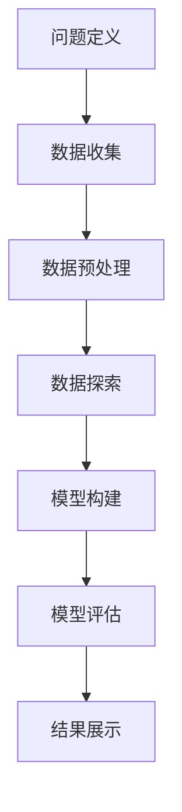

                 

### 文章标题

《一人公司如何建立数据驱动的决策文化》

> 关键词：数据驱动，决策文化，一人公司，数据分析，人工智能

> 摘要：本文将探讨如何在一人公司中建立数据驱动的决策文化。通过分析数据驱动决策的核心概念、所需工具和技术，我们将展示一系列步骤，帮助创业者或自由职业者利用数据来优化业务决策，提高运营效率。

---

### 1. 背景介绍

在当今快速变化的市场环境中，数据已成为企业竞争力的关键因素。特别是对于一人公司或小型企业来说，数据驱动的决策文化尤为重要。因为资源有限，一人公司需要更高效地利用数据来做出明智的决策。

数据驱动决策文化的核心在于：利用数据来指导业务决策，而非仅仅依赖直觉或经验。通过数据分析，公司可以了解市场趋势、客户需求，从而制定更具前瞻性的战略。此外，数据驱动决策还能帮助公司识别潜在问题，优化业务流程，提高运营效率。

然而，要建立数据驱动的决策文化并非易事，需要从多个方面入手，包括数据收集、处理、分析和应用。本文将分步骤介绍如何在一人公司中建立这样的文化。

---

### 2. 核心概念与联系

#### 2.1 数据驱动的决策文化

数据驱动的决策文化是一种以数据为基础，通过数据分析和洞察来指导决策的文化。其核心在于：

- **数据收集**：系统地收集相关数据，包括内部业务数据和外部市场数据。
- **数据清洗**：确保数据质量，去除重复、错误或不完整的数据。
- **数据分析**：使用统计方法和机器学习算法，对数据进行深入分析，提取有价值的信息。
- **数据可视化**：将分析结果以图表、报表等形式展示，使决策者能够直观理解数据。
- **决策制定**：基于数据分析结果，制定合理的业务决策。

#### 2.2 数据分析工具和技术

要实现数据驱动决策，需要依赖一系列数据分析工具和技术。以下是一些常用的工具和技术：

- **SQL数据库**：用于存储和管理结构化数据。
- **Python编程**：用于数据处理、分析和可视化。
- **机器学习框架**：如TensorFlow和PyTorch，用于构建和训练预测模型。
- **数据可视化工具**：如Tableau和Power BI，用于将数据以图表、报表等形式展示。
- **云计算平台**：如AWS、Azure和Google Cloud，提供强大的数据处理和分析能力。

#### 2.3 数据分析流程

数据分析流程包括以下步骤：

1. **问题定义**：明确数据分析的目标和问题。
2. **数据收集**：收集与问题相关的数据。
3. **数据预处理**：清洗、转换和集成数据。
4. **数据探索**：分析数据的基本特征和趋势。
5. **模型构建**：根据分析需求，构建适当的统计模型或机器学习模型。
6. **模型评估**：评估模型性能，调整模型参数。
7. **结果展示**：将分析结果以可视化形式展示，辅助决策制定。

### 2.4 Mermaid 流程图

下面是一个简化的数据分析流程的Mermaid流程图：



（备注：Mermaid 流程图中的节点中不包含括号、逗号等特殊字符）

---

### 3. 核心算法原理 & 具体操作步骤

#### 3.1 数据收集

数据收集是数据分析的基础。以下是数据收集的一些具体步骤：

1. **确定数据需求**：明确分析目标和问题，确定需要收集哪些数据。
2. **数据来源**：寻找合适的数据来源，包括内部业务数据、公开数据源和第三方数据服务。
3. **数据获取**：通过API、Web爬虫或其他工具获取数据。
4. **数据存储**：将收集到的数据存储到数据库或其他数据存储系统中，以便后续处理和分析。

#### 3.2 数据清洗

数据清洗是确保数据质量的关键步骤。以下是数据清洗的一些常见操作：

1. **去除重复数据**：删除重复的数据记录，以避免分析结果偏差。
2. **处理缺失值**：填补缺失数据或删除含有缺失数据的记录。
3. **数据标准化**：将不同数据类型的值转换为统一格式，如将日期格式统一为YYYY-MM-DD。
4. **异常值处理**：识别和处理异常数据，如过小或过大的数值。

#### 3.3 数据分析

数据分析的方法和技术多种多样，以下是一些常用的数据分析方法：

1. **描述性统计分析**：计算数据的平均值、中位数、标准差等统计量，了解数据的基本特征。
2. **相关性分析**：分析两个或多个变量之间的关系，如皮尔逊相关系数和斯皮尔曼等级相关系数。
3. **聚类分析**：将数据分组，识别相似的数据点，如K-均值聚类和层次聚类。
4. **分类和回归分析**：建立预测模型，预测目标变量的取值，如决策树、随机森林和线性回归。
5. **时间序列分析**：分析数据的时间变化趋势，如移动平均和自回归模型。

#### 3.4 数据可视化

数据可视化是将数据分析结果以图表形式展示的过程，有助于决策者更直观地理解数据。以下是几种常用的数据可视化方法：

1. **柱状图**：用于比较不同类别或时间段的数据。
2. **折线图**：用于显示数据的变化趋势。
3. **散点图**：用于显示两个变量之间的关系。
4. **饼图**：用于显示各部分占整体的比例。
5. **热力图**：用于显示数据在不同类别或时间段上的分布情况。

---

### 4. 数学模型和公式 & 详细讲解 & 举例说明

#### 4.1 描述性统计分析

描述性统计分析是数据分析的基础，常用的统计量包括：

- **平均值**（Mean）：
  $$ \bar{x} = \frac{1}{n} \sum_{i=1}^{n} x_i $$
  其中，\( x_i \) 是第 \( i \) 个数据点，\( n \) 是数据点的总数。
- **中位数**（Median）：
  $$ M = \left( \frac{n + 1}{2} \right)^{th} \text{ order statistic} $$
  对于奇数个数据点，中位数是中间位置的值；对于偶数个数据点，中位数是中间两个值的平均值。
- **标准差**（Standard Deviation）：
  $$ \sigma = \sqrt{\frac{1}{n-1} \sum_{i=1}^{n} (x_i - \bar{x})^2} $$
  其中，\( \bar{x} \) 是平均值，\( n \) 是数据点的总数。

#### 4.2 相关性分析

相关性分析用于评估两个变量之间的关系，常用的相关系数包括皮尔逊相关系数和斯皮尔曼等级相关系数。

- **皮尔逊相关系数**（Pearson Correlation Coefficient）：
  $$ r = \frac{\sum_{i=1}^{n} (x_i - \bar{x})(y_i - \bar{y})}{\sqrt{\sum_{i=1}^{n} (x_i - \bar{x})^2 \sum_{i=1}^{n} (y_i - \bar{y})^2}} $$
  其中，\( x_i \) 和 \( y_i \) 分别是两个变量的数据点，\( \bar{x} \) 和 \( \bar{y} \) 是两个变量的平均值。

- **斯皮尔曼等级相关系数**（Spearman's Rank Correlation Coefficient）：
  $$ \rho = \frac{1}{n-1} \sum_{i=1}^{n} (r_i - \bar{r})^2 $$
  其中，\( r_i \) 是第 \( i \) 个变量的等级相关系数，\( \bar{r} \) 是所有等级相关系数的平均值。

#### 4.3 分类和回归分析

分类和回归分析是建立预测模型的重要方法，常用的算法包括决策树、随机森林和线性回归。

- **线性回归模型**（Linear Regression Model）：
  $$ y = \beta_0 + \beta_1x $$
  其中，\( y \) 是预测的目标变量，\( x \) 是自变量，\( \beta_0 \) 和 \( \beta_1 \) 是模型参数。

- **决策树模型**（Decision Tree Model）：
  决策树是一种树形结构，用于分类和回归。每个节点代表一个特征，每个分支代表一个特征取值，叶节点表示最终的预测结果。

- **随机森林模型**（Random Forest Model）：
  随机森林是一种集成学习方法，通过构建多个决策树，并取其平均预测结果来提高预测准确性。

#### 4.4 举例说明

假设我们要分析一家一人公司的销售数据，以预测未来的销售额。以下是具体的操作步骤：

1. **数据收集**：收集过去一年的销售数据，包括每日销售额、产品类别、天气状况等。
2. **数据清洗**：去除重复数据，处理缺失值，将日期格式转换为YYYY-MM-DD。
3. **描述性统计分析**：计算每日销售额的平均值、中位数和标准差。
4. **相关性分析**：分析销售额与产品类别、天气状况等变量的相关性。
5. **回归分析**：建立线性回归模型，预测未来某一天的销售额。
6. **模型评估**：使用交叉验证等方法评估模型性能，调整模型参数。
7. **结果展示**：将预测结果以图表形式展示，帮助决策者制定销售策略。

通过以上步骤，一人公司可以利用数据驱动决策文化来优化业务决策，提高运营效率。

---

### 5. 项目实战：代码实际案例和详细解释说明

#### 5.1 开发环境搭建

为了演示如何在一人公司中建立数据驱动的决策文化，我们将使用Python编程语言，结合SQL数据库和数据可视化工具。以下是开发环境的搭建步骤：

1. **安装Python**：在官方网站（https://www.python.org/downloads/）下载并安装Python。
2. **安装Jupyter Notebook**：在终端中运行以下命令：
   ```bash
   pip install notebook
   ```
   然后在终端中运行 `jupyter notebook` 命令，启动Jupyter Notebook。
3. **安装数据库驱动**：假设我们使用MySQL数据库，在终端中运行以下命令：
   ```bash
   pip install mysql-connector-python
   ```
4. **安装数据可视化工具**：我们使用Matplotlib库进行数据可视化，在终端中运行以下命令：
   ```bash
   pip install matplotlib
   ```

#### 5.2 源代码详细实现和代码解读

下面是一个简单的Python代码示例，用于从MySQL数据库中查询销售数据，并使用Matplotlib绘制销售额的柱状图。

```python
import mysql.connector
import matplotlib.pyplot as plt

# 1. 连接数据库
conn = mysql.connector.connect(
    host="localhost",
    user="your_username",
    password="your_password",
    database="your_database"
)

# 2. 查询销售数据
cursor = conn.cursor()
cursor.execute("SELECT date, sales FROM sales_data")

# 3. 提取数据
dates, sales = zip(*cursor.fetchall())

# 4. 绘制柱状图
plt.bar(dates, sales)
plt.xlabel("Date")
plt.ylabel("Sales")
plt.title("Daily Sales")
plt.xticks(rotation=45)
plt.show()

# 5. 关闭数据库连接
cursor.close()
conn.close()
```

**代码解读**：

- **第1步**：使用 `mysql.connector` 模块连接到MySQL数据库。需要提供数据库的地址、用户名、密码和数据库名。
- **第2步**：使用 `cursor.execute()` 方法执行SQL查询语句，从 `sales_data` 表中查询 `date` 和 `sales` 列的数据。
- **第3步**：使用 `zip()` 函数将查询结果转换为两个列表，分别表示日期和销售额。
- **第4步**：使用 `plt.bar()` 函数绘制柱状图，并设置坐标轴标签、标题和旋转角度。
- **第5步**：使用 `plt.show()` 函数显示图表，并关闭数据库连接。

#### 5.3 代码解读与分析

- **数据连接**：使用 `mysql.connector` 模块连接到MySQL数据库，这是实现数据驱动决策的第一步。连接信息应配置在配置文件中，而非硬编码在代码中，以提高安全性。
- **数据查询**：使用SQL查询语句从数据库中提取数据。这里我们查询了 `date` 和 `sales` 两个列，这两个列分别表示日期和销售额。在实际应用中，可能需要查询更多的列，如产品类别、客户信息等。
- **数据处理**：将查询结果转换为Python列表，以便进一步处理。这里使用了 `zip()` 函数，将查询结果中的 `(date, sales)` 元组转换为两个独立的列表。
- **数据可视化**：使用Matplotlib库绘制柱状图，将销售额数据以直观的形式展示。柱状图的绘制包括设置坐标轴标签、标题和旋转角度等。
- **代码优化**：在实际项目中，应考虑使用更高效的数据库连接方式，如使用连接池。此外，代码中的硬编码连接信息应迁移到配置文件中，以提高代码的可维护性和安全性。

通过以上步骤，我们演示了如何在一人公司中使用Python和MySQL数据库建立数据驱动的决策文化。虽然这是一个简单的示例，但原理适用于更复杂的数据分析和业务决策场景。

---

### 6. 实际应用场景

#### 6.1 销售预测

销售预测是数据驱动决策的重要应用场景之一。一人公司可以通过分析历史销售数据，预测未来的销售额，从而制定更有效的销售策略。

- **数据来源**：销售数据可以从ERP系统、CRM系统或其他销售管理工具中获取。
- **数据处理**：对销售数据进行分析，提取关键特征，如产品类别、销售渠道、季节性等。
- **预测模型**：建立回归模型或时间序列模型，预测未来的销售额。使用交叉验证等方法评估模型性能。
- **决策制定**：基于预测结果，制定销售目标和策略，如调整库存水平、优化促销活动等。

#### 6.2 客户细分

客户细分是了解客户需求、提高客户满意度的重要手段。通过数据分析，一人公司可以识别不同类型的客户，并为每个客户群体制定个性化的营销策略。

- **数据来源**：客户数据可以从CRM系统、市场调研、社交媒体等渠道获取。
- **数据处理**：对客户数据进行清洗、转换和聚合，提取关键特征，如购买频率、购买金额、购买渠道等。
- **细分模型**：使用聚类算法或机器学习算法，将客户划分为不同的细分群体。
- **决策制定**：根据不同客户群体的特征，制定个性化的营销策略，提高客户满意度和忠诚度。

#### 6.3 成本控制

成本控制是提高企业盈利能力的关键。通过数据分析，一人公司可以识别成本驱动因素，制定有效的成本控制措施。

- **数据来源**：成本数据可以从ERP系统、财务报表等渠道获取。
- **数据处理**：对成本数据进行分析，提取关键成本要素，如生产成本、运营成本、人工成本等。
- **成本模型**：建立成本预测模型，预测未来成本趋势。使用决策树、随机森林等算法进行成本优化。
- **决策制定**：基于成本预测结果，制定成本控制措施，如优化供应链管理、提高生产效率等。

通过以上实际应用场景，一人公司可以利用数据驱动的决策文化，优化业务流程，提高运营效率，实现可持续发展。

---

### 7. 工具和资源推荐

#### 7.1 学习资源推荐

- **书籍**：
  - 《数据科学入门：使用Python进行数据分析》（作者：Michael Grogan）
  - 《深度学习》（作者：Ian Goodfellow、Yoshua Bengio、Aaron Courville）
  - 《Python数据分析基础教程：NumPy学习指南》（作者：Erik Olsen）
- **论文**：
  - “Deep Learning for Text Classification”（作者：Yoon Kim）
  - “Learning to Rank for Information Retrieval”（作者：Chengxiang Zhai、John Lafferty）
  - “Convolutional Neural Networks for Sentence Classification”（作者：Yoon Kim）
- **博客**：
  - Medium上的数据科学博客（https://towardsdatascience.com/）
  - 知乎上的数据科学专栏（https://zhuanlan.zhihu.com/datascience）
  - Kaggle上的教程和实战案例（https://www.kaggle.com/tutorials）
- **网站**：
  - Coursera（https://www.coursera.org/）
  - edX（https://www.edx.org/）
  - Udacity（https://www.udacity.com/）

#### 7.2 开发工具框架推荐

- **SQL数据库**：
  - MySQL（https://www.mysql.com/）
  - PostgreSQL（https://www.postgresql.org/）
  - SQLite（https://www.sqlite.org/）
- **Python编程**：
  - Jupyter Notebook（https://jupyter.org/）
  - PyCharm（https://www.jetbrains.com/pycharm/）
  - Visual Studio Code（https://code.visualstudio.com/）
- **数据可视化工具**：
  - Tableau（https://www.tableau.com/）
  - Power BI（https://www.powerbi.com/）
  - Matplotlib（https://matplotlib.org/）
- **云计算平台**：
  - AWS（https://aws.amazon.com/）
  - Azure（https://azure.microsoft.com/）
  - Google Cloud（https://cloud.google.com/）

通过以上工具和资源的推荐，一人公司可以更好地建立和实施数据驱动的决策文化，提高业务效率和竞争力。

---

### 8. 总结：未来发展趋势与挑战

随着人工智能和大数据技术的快速发展，数据驱动的决策文化在未来的商业环境中将变得更加普及和重要。以下是一些未来发展趋势和挑战：

#### 发展趋势：

1. **数据集成与融合**：越来越多的企业将集成来自不同来源的数据，以便更全面地了解业务和客户。
2. **实时数据分析**：实时数据分析技术的进步将使企业能够更快地做出响应和调整策略。
3. **个性化与智能化**：通过深度学习和机器学习，企业可以实现更精准的个性化服务和智能决策。
4. **数据隐私与安全**：随着数据隐私法规的加强，企业需要确保数据的安全性和合规性。

#### 挑战：

1. **数据质量与完整性**：高质量的数据是实现数据驱动决策的前提，但数据收集和处理过程中的挑战仍然存在。
2. **技术技能缺口**：随着数据驱动决策的普及，对数据分析、机器学习等专业人才的需求将增加，但人才供应可能不足。
3. **决策复杂性**：数据驱动的决策往往涉及复杂的模型和算法，如何有效地理解和应用这些技术是企业的挑战。
4. **数据隐私与伦理**：在利用数据进行决策时，企业需要平衡商业利益和数据隐私，遵守伦理和法规要求。

总之，建立数据驱动的决策文化不仅需要技术支持，还需要企业文化的转变和全员参与。只有持续地投入和努力，一人公司才能在竞争激烈的市场中脱颖而出。

---

### 9. 附录：常见问题与解答

#### 问题1：如何确保数据质量？

**解答**：数据质量是数据驱动决策的基础。以下是一些确保数据质量的方法：

1. **数据源验证**：确保数据来源的可靠性和准确性。
2. **数据清洗**：定期对数据进行清洗，去除重复、错误和不完整的数据。
3. **数据监控**：建立数据监控系统，实时监测数据质量，及时发现和处理问题。

#### 问题2：如何处理缺失数据？

**解答**：处理缺失数据的方法有多种，以下是一些常见的方法：

1. **删除缺失数据**：如果缺失数据不多，可以选择删除含有缺失数据的记录。
2. **填补缺失数据**：可以使用平均值、中位数、最近邻等方法填补缺失数据。
3. **预测缺失数据**：使用统计方法或机器学习方法预测缺失数据，然后进行填补。

#### 问题3：如何选择合适的机器学习算法？

**解答**：选择合适的机器学习算法取决于多个因素，包括数据特征、问题类型和性能指标。以下是一些指导原则：

1. **线性回归**：适用于线性关系较强的问题。
2. **决策树**：适用于分类和回归问题，易于理解和解释。
3. **随机森林**：适用于复杂的关系，可以提高预测准确性。
4. **神经网络**：适用于复杂的非线性问题，但需要大量数据。

---

### 10. 扩展阅读 & 参考资料

为了更深入地了解数据驱动的决策文化，以下是一些推荐阅读材料和参考资料：

- **书籍**：
  - 《数据驱动决策：如何用数据构建更好的业务策略》（作者：Toby Phillips）
  - 《数据智能：商业洞察与数据驱动的转型之道》（作者：姜承尧）
  - 《数据思维：大数据时代的决策方法》（作者：George Andrade）
- **论文**：
  - “Data-Driven Decision Making: A Review”（作者：Cheng Wang、Zhiguo Zhang）
  - “Data-Driven Business Transformation”（作者：Eric Siegel）
  - “The Power of Data-Driven Decision Making”（作者：Jeffrey D. Baumeister）
- **在线课程**：
  - Coursera上的《数据科学基础》课程（https://www.coursera.org/specializations/data-science）
  - edX上的《机器学习基础》课程（https://www.edx.org/course/essential-math-for-machine-learning）
- **博客和网站**：
  - 《机器学习与数据科学博客》（https://www.machinelearningmastery.com/）
  - 数据科学 Stack Exchange（https://datascience.stackexchange.com/）

通过这些扩展阅读和参考资料，读者可以更全面地了解数据驱动的决策文化，并在实际业务中应用这些知识。

---

**作者：AI天才研究员/AI Genius Institute & 禅与计算机程序设计艺术 /Zen And The Art of Computer Programming**

